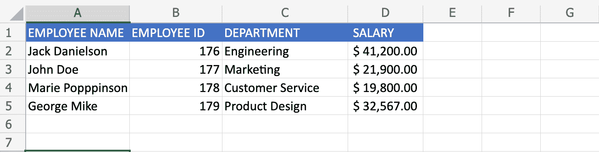
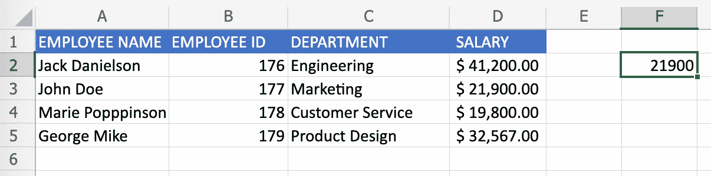

# 如何在 Excel 中使用 VLOOKUP

> 原文：<https://www.freecodecamp.org/news/how-to-use-vlookup-in-excel/>

当您在 Excel 中工作时，VLOOKUP 函数可以减少查找信息的时间。当您使用多个 Excel 表格时，这一点尤其明显。

在本文中，您将学习 VLOOKUP 函数的功能，并理解其背后的语法。借助一个简单的示例，您还将学习如何使用 VLOOKUP Excel 函数来搜索值。

我们开始吧！

## Excel 中的 VLOOKUP 是什么？VLOOKUP 定义

VLOOKUP 是一个强大的 Microsoft Excel 函数，可以从数据表中搜索和检索信息。

VLOOKUP 代表**垂直查找**，所以 VLOOKUP 中的 V 是 Vertical 的简称。

Excel 中的 Vertical 指的是**列**，在这种情况下，在电子表格中垂直查找数据。

具体来说，VLOOKUP 在列中查找特定的值。

VLOOKUP 在数据集中查找特定的信息，并返回与该初始信息相关的附加数据，但这些数据来自同一行的不同列。

例如，如果您有一个姓名和电子邮件列表，VLOOKUP 将在表格中查找一个人的姓名，并检索他们的电子邮件。这将是与其姓名相关联的电子邮件条目。

需要注意的是，VLOOKUP 不应该与 HLOOKUP 混淆——HLOOKUP 是一个完全不同的函数。

HLOOKUP 代表水平查找，H 是 Horizontal 的缩写。Excel 中的水平是指**行**，并在电子表格中水平搜索数据。

要了解 Excel 中行和列的更多信息，请阅读解释二者区别的快速指南。

### VLOOKUP 函数语法分解

VLOOKUP 函数的一般语法如下:

```
=VLOOKUP(lookup_value, table_array, column_number, [range_lookup]) 
```

首先写一个等号`=`，然后输入`VLOOKUP()`函数。

VLOOKUP 函数有四个参数，每个参数用逗号分隔。

让我们解释一下每个参数的含义:

*   **lookup_value** :此参数是必需的，指定您要查找和定位的值。该值位于表格的第一列的最左侧。VLOOKUP 将始终搜索此`lookup_value`右侧的信息。
*   **table_array** :该参数是必需的，代表表格中要搜索的数据范围。`lookup_value`、`column_number`以及你想得到的返回值都包含在这个范围内。
*   **column_number** :此参数是必需的。它是一个整数，指定了`table_array`中要从中检索返回值的列号。
*   **range_lookup** :该参数可选，可以是`TRUE`或`FALSE`。`TRUE`指定函数应该返回近似匹配，这意味着如果没有精确匹配，它应该返回最接近的匹配。而`FALSE`指定函数应该返回你所寻找的精确匹配，如果没有，这将导致一个错误。

## 如何在 Excel 中使用 VLOOKUP

下面我有一个简单数据集的例子。

这个例子将告诉你如何使用 VLOOKUP 函数。您还可以将这里使用的技术应用于更大更复杂的表。



我将使用 VLOOKUP 搜索员工数据表。该表存储了雇员的姓名、id 号、工作部门和工资。

我想使用 VLOOKUP 搜索一个特定的雇员，并返回他们相应的工资。

我希望每当我在`F2`单元格中搜索一个雇员的名字时，都会返回他们相应的薪水。

因此，如果我想找到雇员`John Doe`并返回他们的工资，在列`F2`中，我应该写:

```
=VLOOKUP(A3, A2:D5, 4, FALSE) 
```

让我们来分解一下:

*   单元格`A3`包含我要搜索的值。名为`John Doe`的员工位于`A3`单元。这将是查找值和函数的第一个参数。
*   单元格区域`A2:D5`包含我要搜索的数据。这是 VLOOKUP 将使用的数据源。这个范围需要包括存储第一个参数的第一列，还需要包括我希望存储返回值的列。
*   接下来，我包括可以找到返回值的列号。请记住，您需要从表格开始的地方开始计数。在这种情况下，它是表中的第`4`列。
*   最后，我希望 VLOOKUP 返回一个精确匹配，所以最后一个参数是`FALSE`。

然后我在`F2`单元格中看到结果:



## 结论

在本文中，您学习了在 Excel 中使用 VLOOKUP 函数的基础知识。

要了解有关 Excel 的更多信息，请查阅以下资源:

*   [学习微软 Excel -全视频课程](https://www.freecodecamp.org/news/learn-microsoft-excel/)
*   [Excel 在线课程–11 门免费 Excel 培训课程](https://www.freecodecamp.org/news/excel-classes-online-free-excel-training-courses/)

感谢阅读！