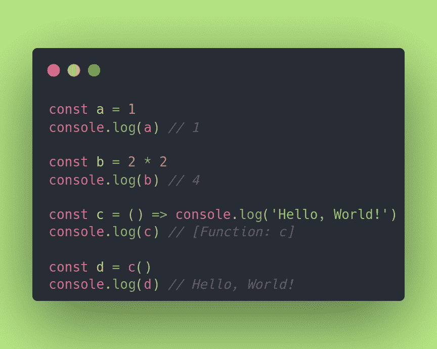
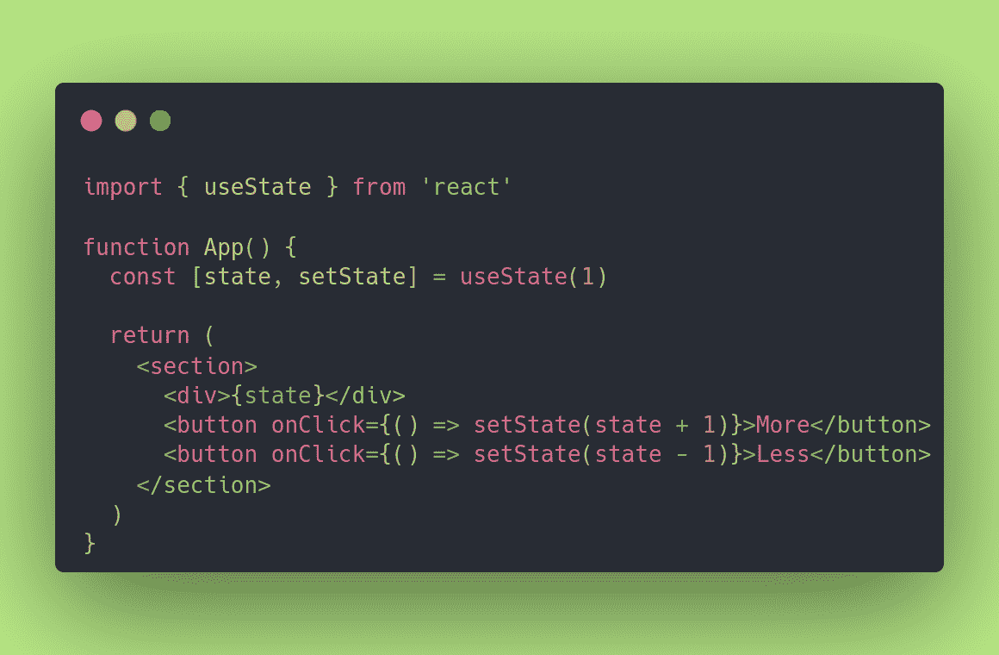
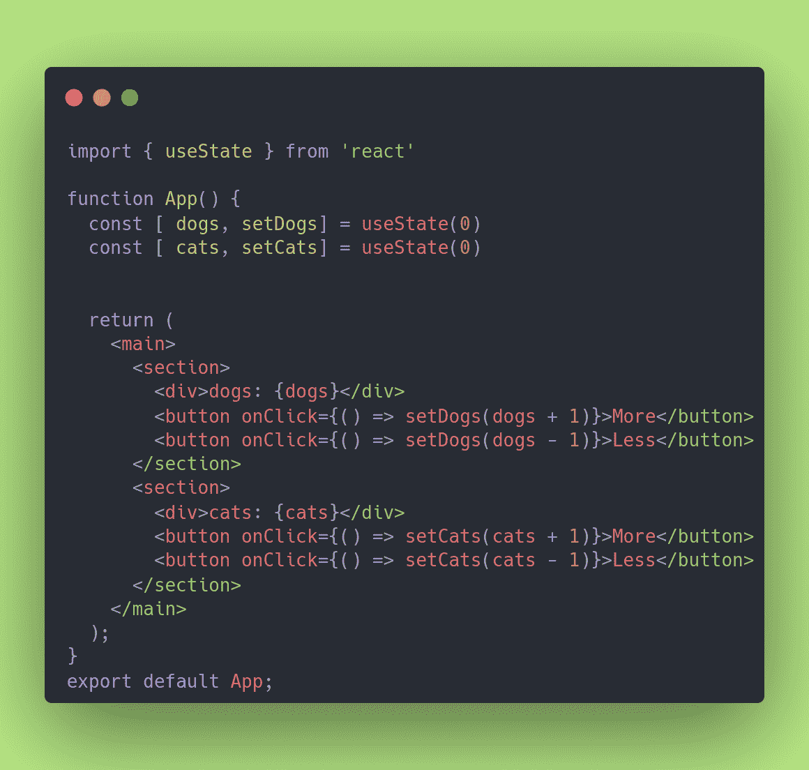
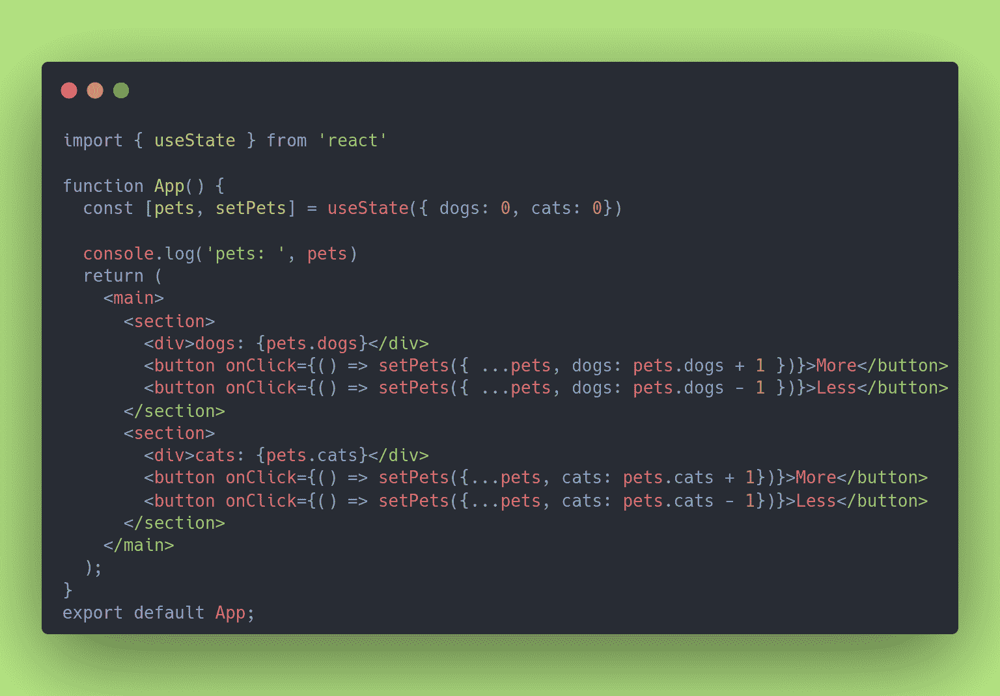
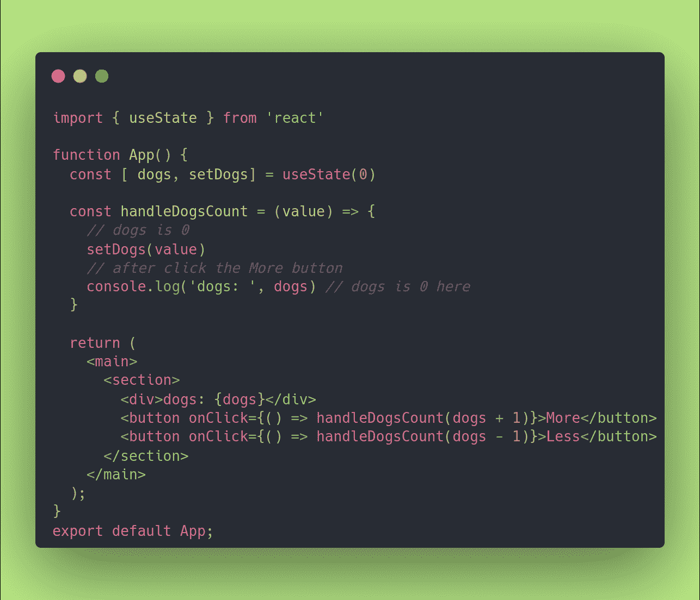
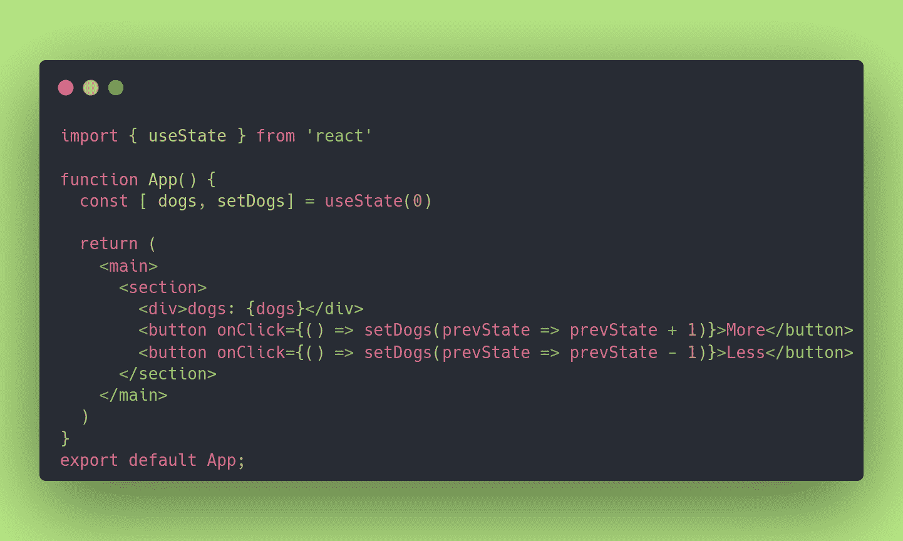
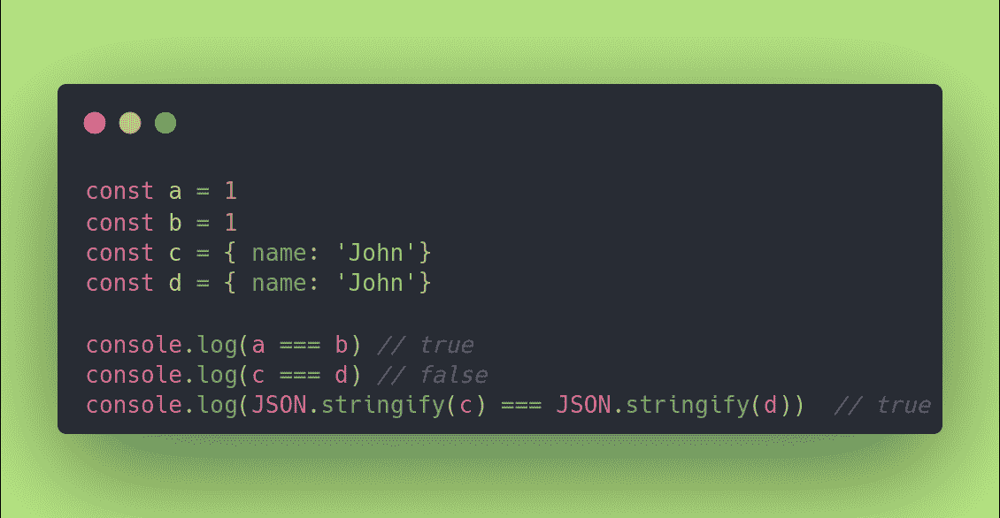

# React 钩子对于初学者——在 10 分钟内学会使用 useState 钩子

> 原文：<https://www.freecodecamp.org/news/learn-react-usestate-hook-in-10-minutes/>

嘿大家好🌈我已经很久没有写 React 中的处理状态了。上一次是本文中的[，四年前，看起来对你们帮助很大。](https://www.freecodecamp.org/news/get-pro-with-react-setstate-in-10-minutes-d38251d1c781/)

我收到了大量的浏览量和惊人的反馈，非常感谢——你真的很棒！🎸

嗯，从那以后过了很久。从 v16.8 版本(2019 年)开始，钩子在 React 中登陆，当在 React 中使用 state 时，有很多东西需要跟上。

你是否正在学习状态，并想成为一名拥有**使用状态**钩子的职业玩家？****

酷，你来对地方了！喝杯咖啡(或茶)，系好安全带，我们走吧！

顺便说一下——如果你正在寻找如何使用 setState(在类组件中),那么我建议你看看我以前的文章[“如何在 10 分钟内用 React setState()成为专业人士”](https://www.freecodecamp.org/news/get-pro-with-react-setstate-in-10-minutes-d38251d1c781/)。

## 什么是反应钩？

钩子是一个特殊的功能，它可以让你**【挂钩】**各种 React 特性。假设有一个函数返回一个包含两个值的数组:

*   **第一个值:**有状态的变量。
*   **第二个值:**有处理程序的变量(改变当前状态的函数)。

就这样，很简单。🥞

记住在 JavaScript **“值是函数，函数是值”**。我在 2017 年和[](https://www.youtube.com/c/funfunfunction)**一起学到了这一点，他是我最喜欢的开发者之一，也是 YouTubers 的粉丝。谢谢你所做的一切，MPJ！**

**如果这让你有点困惑，这里有一个例子:**

**

values are functions, and functions are values** 

**让我们看看这里发生了什么:**

*   **在 **a** 中，你存储了一个数字。我的意思是，你把值 **1** (这是一个数字)赋给一个叫做 **a** 的变量。**
*   **在 **b** 中，你存储了一个表达式求值的结果(值)。**
*   **在 **c** 中，你存储了一个函数。您存储了一个未执行的函数，它存储为一个值，随时可以执行。**
*   **在 **d** 中，我们分配评估结果 **c** 。**

**有道理？你明白要点了吗？是啊，**函数就是值，值就是函数**！现在你只需要知道这些。**

****useState** ，特别是，让您将反应状态添加到功能组件(声明为函数而不是类的组件)。**

**事实上，状态保存在钩子内部，但是可以从“调用”钩子的组件中访问。**

## **反应钩子的规则**

**除了钩子是 JavaScript 函数这一事实之外，在使用它们时还有一些规则要遵循:**

### **只调用顶层的钩子**

**不要在循环、条件或嵌套函数中调用钩子。在任何早期返回之前，总是在 React 函数(组件)的顶层使用钩子。**

**这背后的原因是，每次组件渲染时，钩子必须以相同的顺序调用。这使得 React 能够在多个 useState 和 useEffect 调用之间正确地保留钩子的状态。**

#### **仅从 React 函数调用挂钩**

**这意味着您可以从 React 函数(组件)或自定义挂钩中调用挂钩，但不能从常规 JavaScript 函数中调用。**

**这里有一个有用的插件[来执行钩子的规则。这是一个非常有用的方法，所以一定要试一试。](https://www.npmjs.com/package/eslint-plugin-react-hooks )**

## **使用状态钩子的剖析**

**要使用 useState 钩子，您需要知道一些事情。**

**💡您可以查看下图，以便更好地理解我将在这里解释的内容。**

1.  **您必须从 React 库中导入它。**
2.  **您必须在 React 组件内部调用它**

```
`const [state, setState] = useState(initialValue)`
```

**不确定你是否得到了析构，所以对于那些第一眼没看出来的人:**

**我可以这样做:**

```
`const array = useState(initialValue)`
```

**然后我可以将位置 0 内的状态作为数组[0]，将位置 1 内的 setState 的处理程序作为数组[1]。**

**由于我们知道数组的第一个和第二个位置值，并且我们知道它们对应于状态值和一个改变它的处理程序，所以析构数组更具有声明性。**

```
`const [first, second] = useState(initialValue)`
```

**是的，我们可以这样做。但是我们可以叫任何东西到一垒和二垒。唯一的规则是，这些变量对应于由 **useState** 函数(hook)返回的数组的第一个和第二个位置。**

```
`const [state, setState] = useState(initialValue)
const [counter, setCounter] = useState(initialCount)
const [something, setSomething] = useState(initialSomething)`
```

**如果你不熟悉析构赋值语法，可以暂停阅读，偷偷看一下 [MDN](https://developer.mozilla.org/en-US/docs/Web/JavaScript/Reference/Operators/Destructuring_assignment) 或[阅读这个有用的教程](https://www.freecodecamp.org/news/destructuring-patterns-javascript-arrays-and-objects/)。**

**去吧，我等着！(*江户呷了一口* ☕)**

**3.然后，您可以自由地呈现状态，或者调用 setState 来更新您的状态值。**

**这是一个最简单的全功能示例:**

**

The Anatomy of the useState hook** 

## **何时使用 useState 挂钩**

**要理解什么时候使用这个钩子，我们需要从学习什么时候需要状态开始。**

**乍一看，我们认为当我们需要一个随时间变化的变量时，我们需要保持它的状态。但大多数时候，这是不正确的。我的意思是，如果你的变量可以从其他数据中导出，那么你就不需要状态。**

### **陈述示例 1:**

**根据小时，主题颜色可以是亮的或暗的，可以从系统数据中导出。**

**我们可以简单地从 JS Date 函数中获得时间(日期)。所以我们不需要状态，对吗？这是一个可以用表达式或函数声明的常量，必须对其求值。**

### **陈述示例 2:**

**模态切换(显示/隐藏模态)。**

**模式切换可以是真的或假的，当用户点击一个按钮时触发。因此，在这种情况下，我们真的需要状态，因为我们无法获得这种信息——它只取决于用户“何时以及是否”触发事件。**

**请注意这种差异——什么可以派生，什么依赖于用户。**

**当您需要存储来自用户的输入时，您将需要使用 **useState** 钩子。**

**💡根据经验，您应该只使用状态来保存这类信息——这需要用户输入数据或触发事件。**

**另一个非常常用的例子是**表单**数据。几乎每个应用程序或网站都需要从用户那里收集信息。要做到这一点，拥有一个表单是很常见的(或者说是强制性的)。**

**表单数据必须以状态存储，至少在保存到数据库之前是如此。但它也可以从数据库中检索，并再次成为可编辑的。**

**酷，我们继续。**

## **如何在 React 中使用多个状态变量**

**因此，如果我们需要处理多个状态，最好的和推荐的第一种方法是分别处理它们，就像这样:**

**

Dogs and Cats Counter (Handling Multiple State Variables)** 

**这样做没什么不对，尽管这看起来很原始。这是一个很好的线性方法，因为我们一直在使用 JavaScript 原语(在本例中是数字)。**

**您也可以在一个对象中混合状态:**

****

**这个案例变得有点复杂。我们已经初始化了一个对象，而不是一个原始值。当我们调用 setPets 时，我们必须意识到我们需要扩展现有的 Pets 对象，然后添加更改，否则我们会丢失它。**

**对于旧的 setState API，这不是强制性的——它会理解您想要更新状态对象的键。但是现在不了，我喜欢。现在它更具有声明性，也更像是 JavaScript 中的一个基本概念。**

**如果你对 spread 语法不熟悉，可以在这里查看一下或者[阅读这个有用的教程](https://www.freecodecamp.org/news/javascript-object-destructuring-spread-operator-rest-parameter/)。**

## **状态异步**

**请注意，改变/变更状态是一个异步操作。**

**我们来看一个证据:**

**

State is asynchronous (it's batched and updated with a delay)** 

**所以，我更新了一下我们最初的狗的例子。这次我创建了一个 **handleDogsCount** 函数来向您展示。**

**在 handleDogsCount 中，我用新值调用了 **setDogs** 。**

**如果我需要立即将状态值用于另一个操作，会发生什么情况？**

**对，状态还没更新。处理即时操作的最佳方式是使用传递给 handleDogsCount 函数的值，并且——暂时忽略狗的状态值——事先知道(这很棘手，但事实就是如此)该值没有及时更新。**

## **如何以函数方式改变状态**

**好，现在我们知道状态不会立即改变。还有一个与之相关的问题。如果你可以每秒钟点击一百万次“更多”按钮，会发生什么？**

**可能，在 100 万次点击结束时，计数器将是 999_998(或更少)，而不是预期的 1_000_000。**

**为了避免这种情况发生，我们可以用函数的方式来设置状态。我们获取前一个状态的值，这样 React 就可以正确地批量处理所有请求并线性更新状态。这样我们就不会在中途丢失信息。**

**为此，您只需执行以下操作:**

**

Mutating state in a functional way** 

**好吧，酷。现在我们确信 React 在处理我们的 1M 状态突变请求时不会错过任何东西。**

**我们依赖于 useState setState 处理程序(在本例中是 setDogs 函数)中公开的 previousState，而不是抓取 dogs 变量来加一或减一。**

**注意对象和数组是通过引用进行比较的，所以复杂状态要在其他钩子的依赖数组中适当驯服，比如， **useEffect** 。我们以后再谈，在另一篇文章里！**

**如果你是 JavaScript 新手，让我给你一个我正在谈论的剧透:**

**

Comparison by ref** 

**如你所见， **c** 并不严格等于 **d** 。是的，去试试吧！碰巧 JavaScript 通过引用而不是通过值来比较复杂的对象(所有不是[原语](https://developer.mozilla.org/en-US/docs/Glossary/Primitive)的对象)。**

**如果我把它字符串化，就意味着我在比较字符串。因为它们是原始的，所以它们是严格相等的(通过值来比较)。**

## **如何将状态初始化为函数**

**如果你需要用一个昂贵的计算来初始化状态，那么最好用一个函数来初始化它，而不是一个值。**

```
`const [ dogs, setDogs] = useState(() => expensiveComputation())`
```

**这意味着我们正在懒惰地初始化变量。初始值将仅在初始渲染时分配(同样，如果它是一个函数)。**

**在随后的呈现中(由于组件或父组件中状态的改变)，将忽略 useState 挂钩的参数，并将检索当前值。**

## **结论**

**看来我们已经到达了旅程的终点。**

**您已经学习了什么是钩子，钩子的规则，useState 如何工作，它的结构，以及如何处理多种状态。**

**您还了解了一些陷阱(比如处理状态对象，或者状态是异步的)，以及一些提高性能的技巧，比如将状态初始化为函数以避免不断地计算。**

**希望你喜欢这篇关于 **useState** 钩子或者简称为“状态钩子”的文章。**

## **最后但并不是最不重要的**

**我是[江户](https://eduardovedes.com/)。我是一名自由代码营的倡导者，喜欢帮助人们将职业生涯转向软件工程。**

**如果你正在改变职业，或者考虑改变职业，它可能会启发你读一点我的[故事](https://www.freecodecamp.org/news/from-civil-engineer-to-web-developer-with-freecodecamp/)，它发表在这里的 freeCodeCamp 出版物上。**

**你可能也会对[“如何在 6 个月内成为初级软件工程师”](https://www.freecodecamp.org/news/how-to-become-a-junior-software-engineer-in-6-months/)感兴趣。**

**如果你喜欢这篇文章，请在 [Twitter](https://twitter.com/eduardovedes) 上关注我，伸出手来，这样我们就可以聊天了！**

**谢谢大家🌈，你太棒了！**

**江户**

### **有关 React 挂钩的更多信息...**

1.  **[React 文档](https://reactjs.org/docs/hooks-state.html)**