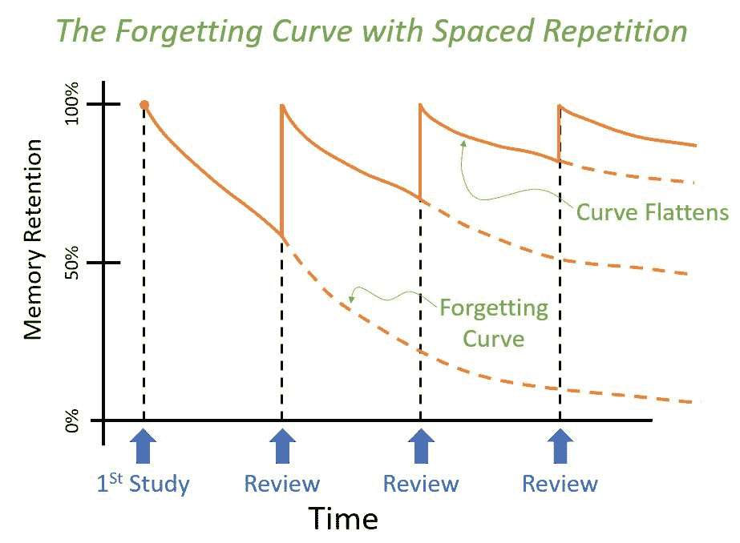
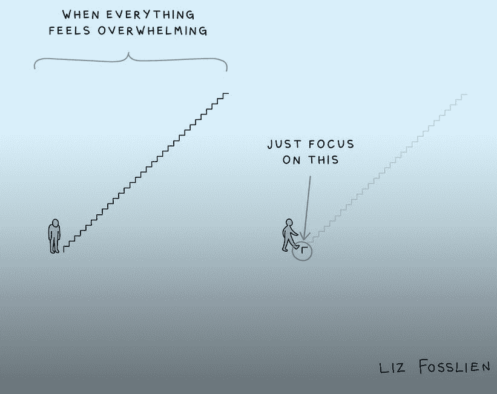

# 学习编码时如何保持动力

> 原文：<https://www.freecodecamp.org/news/how-to-stay-motivated-while-learning-to-code/>

学习编码就像准备一场持久战。最终，胜利并不总是取决于你最初的实力，而是取决于你准备得有多充分，你能坚持多久。

对于编程来说，最大的挑战通常不是语言的复杂性，而是在学习过程中保持一致性和积极性。

为了和你的学习保持一致，你需要很多动力和能量。你学习的一致性将帮助你理解任何编程语言的复杂概念，并充分利用你的时间。

由于来自一个完全非技术背景，我不得不这么晚才开始学习。在我迈出转变的第一步后，我努力与学习有关的一切，尤其是动机。

这篇文章将分享我收集的一些步骤，来克服我在保持一致性和动力上的挣扎。

## 慢慢开始，但保持一个习惯

在学习的早期阶段，你可能只有几个小时的空闲时间可以用来学习。

这是因为大多数人只是敞开心扉去做一些他们从未做过的事情。此外，他们可能有任务，如全职工作，这占了他们日常生活的一部分。因此，调整和腾出时间来学习可能并不容易。

在这个阶段，你不需要担心你一次有多少时间可以学习。最重要的是每天抽出时间学习，不管时间有多长，不管路上遇到什么，都要坚持下去。

## 总是安排你的任务

如果你不安排你的日常任务，拖延和忘记它们会容易得多。很容易全神贯注于一项或几项任务，而忽略了你还有其他事情要做的事实。通常，这种情况发生在你没有按照设定的任务清单去做的时候。

为了防止拖延和健忘，确保你通过安排任务来计划你的一天。您可以使用以下提示作为安排任务的指南:

1.  想想你想完成的所有任务。
2.  估计完成每项任务需要多长时间。
3.  确定你工作效率的高峰时间。
4.  按优先顺序安排任务。
5.  确保将相似的任务捆绑在一起，以提高你的工作效率。
6.  为了保持有条理，在手机或电脑上安排这些任务，并使用提醒和任务应用程序。
7.  在你工作效率最高的时候安排复杂或困难的任务。
8.  在你的时间表中为意外事件留出时间，并提前做好计划。

请注意，将任务安排在每周的开始是一个好主意。

要想了解更多关于如何安排你的一天以获得更高的工作效率，可以考虑阅读 Calendar 的联合创始人兼首席执行官 John Rampton 的这篇文章。

## 加入学习者社区

对大多数人来说，独自学习可能是枯燥乏味的，而且很快就会挫伤你的积极性。这就是为什么有一群志同道合的人总是更好的原因。

这种类型的社区将为您提供许多好处，包括但不限于:

*   参加集体学习
*   获取不同的资源来帮助你的学习
*   关于当前技术趋势的信息
*   获得对个人项目的反馈
*   分享你的进步和衡量你的成长的途径

找出你所在地区是否存在这种类型的社区。或者，如果你找不到，你可以加入一个远程学习社区。

以下是一些我个人认为有用并认为很有价值的偏远社区:

*   **100 devs:**100 devs 社区是一个非营利性组织，由 ResilientCoders 的教师兼工程董事总经理 Leon Noel 创建和维护。100Devs 社区为个人提供全栈 web 开发的免费课程。你可以在这里加入 100Devs 社区[。](https://t.co/N1svwNfVRd)
*   100 天代码:100 天代码 100 天代码是一个在线挑战，人们花 100 天时间学习他们选择的编程语言。为了参加 100DaysofCode，你必须每天至少花一个小时来学习。之后，你在 Twitter 上发布一个完成的任务，标签是#100DaysofCode。
*   Kevin Powell 社区:Kevin Powell 社区是一个由 Kevin Powell 创建和维护的关于 discord 的社区。Kevin 是一名教师和软件开发人员，有多年的工作经验。你可以在 [discord](https://discord.gg/9NmT5HxN) 上加入 Kevin Powell 社区。
*   提交您的代码:提交您的代码社区由 Danny Thompson 创建和维护。这个社区有很多积极的学习者和经验丰富的开发者，他们非常愿意帮助你的项目和指导。你可以在 [discord](https://discord.gg/3JvHFCCp) 上加入提交你的代码社区。

当然，freeCodeCamp 社区有一个[支持和友好的论坛](https://forum.freecodecamp.org/)，在这里你可以问问题和会见其他开发者。

加入一个或多个这样的社区后，保持最佳行为是很重要的。请记住，也要善良，提供价值，并遵循他们的规则。

## 寻找学习伙伴

即使在安排好你的任务和加入一个学习社区后，保持一致和有动力也可能是困难的。如果是这种情况，你可能需要一个学习伙伴。

你可以从以下几个方面受益于有一个学习伙伴:

*   确保你有责任感。
*   你可以建立联合学习会议。
*   你们可以在联合项目上合作。
*   你可能会找到导师。
*   你们可以一起经历编码挑战。

## 使用有效的学习方法

编程语言通常很复杂。除非你有一个有效的学习技巧，否则很难理解这些概念并将其应用到实际环境中。这会让你感到沮丧，减少你学习的动力。

如果你正在学习新概念或新的编程语言，这里有一些你可能尝试过的学习技巧:

*   重复阅读，也称为重读
*   突出
*   总结或做笔记
*   塞满

但是有很多来自著名科学家和心理学家的证据证明，与你可以使用的其他研究技术相比，这些技术没有那么有效。

为了最大限度地利用你的时间，并确保你在更长的时间内记住你学过的东西，试试下面的学习技巧:

### 主动回忆

主动回忆是一种学习技巧，包括从你的大脑中提取已经储存的信息。

> 头脑是一个巨大的仓库或空间；记忆是储存在那个空间的物体；检索记忆类似于在物理空间中搜索和寻找一个物体(Roediger，1980)。

使用这种技巧包括阅读一次主题，然后将你所阅读的主题中的概念和想法转换成问题，然后在这些问题上测试你自己。

### 间隔重复

顾名思义，这种学习技巧包括通过主动回忆的方式对你所学的东西进行间隔修正。这与死记硬背形成对比，死记硬背是指一次性记住某一特定主题的所有概念。

本质上，间隔重复帮助你最小化遗忘曲线的影响。这是一种学习模式，通过这种模式，你允许自己忘记你所学的东西。然后你试着通过在一段时间内特定的时间间隔主动回忆来从你的大脑中检索这些概念。

> 遗忘曲线假设记忆保持力随时间下降。这条曲线显示了当没有试图保留信息时，信息是如何随着时间的推移而丢失的。([来源](https://en.wikipedia.org/wiki/Forgetting_curve))

使用上面的学习技巧将帮助你确保你不会花太多时间去理解和记忆任何话题或概念。

此外，你将有更多的时间完成清单上的其他任务，也有机会学习有助于你职业发展的新技能。

一个流行的工具是 Anki，你可以用它来帮助积极回忆和间隔重复。在这里学习如何使用 Anki。

要了解更多关于这些高效学习技巧的使用，请观看下面的视频:

[https://www.youtube.com/embed/ukLnPbIffxE?feature=oembed](https://www.youtube.com/embed/ukLnPbIffxE?feature=oembed)

### 计时器番茄

番茄工作法非常适合那些很难长时间集中精力学习的人。

使用这个技巧的一个方法是把你的工作日分成 30 或 20 分钟的小块，用 5 分钟的休息时间分开。这些间隔被称为番茄。

## 设定短期目标，一次专注于实现一个目标

> 成功不会一蹴而就。

试图同时实现太多的目标会让人不知所措。所以最好把你的目标分成更短的目标块，一次专注于完成其中一个目标块。

例如，假设你的目标是作为初学者能够用任何流行的 JavaScript 框架构建一个网页。为此，您需要学习各种脚本和编程语言、工具和技能。以下是创建网页时你应该知道的:

1.  了解 HTML 的[基础。](https://www.freecodecamp.org/news/learn-html-beginners-course/)
2.  了解 CSS 的[基础知识。](https://www.freecodecamp.org/news/learn-css-in-this-free-6-hour-video-course/)
3.  了解 HTML 中[语义元素的使用。](https://www.freecodecamp.org/news/semantic-html-alternatives-to-using-divs/)
4.  了解 [CSS Flexbox 和 Grid 对于布局](https://www.freecodecamp.org/news/css-flexbox-and-grid-tutorial/)的使用。
5.  试着用你到目前为止学到的知识建立一个简单的静态网站。
6.  开始学习 JavaScript 的[基础。](https://www.freecodecamp.org/learn/javascript-algorithms-and-data-structures/)
7.  [专注于构建项目](https://www.freecodecamp.org/news/javascript-projects-for-beginners/)用你目前所学的 HTML、CSS 和 JavaScript 基础知识。
8.  开始学习高级的 JavaScript 概念，例如[面向对象编程](https://www.freecodecamp.org/news/how-javascript-implements-oop/)和[异步编程](https://www.freecodecamp.org/news/synchronous-vs-asynchronous-in-javascript/)。
9.  通过构建项目来巩固你对先进概念的了解。
10.  学习你选择的 JavaScript 框架。[反应](https://www.freecodecamp.org/news/learn-react-basics/)、 [Vue](https://www.freecodecamp.org/news/vue-js-full-course/) 、[棱角](https://www.freecodecamp.org/news/learn-angular-full-course/)都是热门选择。
11.  最后，你可以使用你所学的框架来构建你最喜欢的项目。

你可能认为按照上面的顺序完成这些步骤会花费你几个月的时间。但是你可能需要更长的时间——这没关系。

此外，不要试图跳过这些步骤。简单地参加一个速成的网络开发课程可能是不够的，可能会让你失望，比你花时间彻底学习这些概念要困难得多。

另一方面，确保你一次一步地仔细完成每一步，将帮助你建立实现主要目标所必需的技能。它还会防止你失去动力，这是不切实际的期望可能导致的结果。

## 不要害怕寻求帮助

人们在学习编程时早早放弃的原因之一是因为他们在自己的程序中遇到了某种似乎难以解决的 bug。

但是你应该知道，在编程方面，没有人知道所有的事情。即使有几十年经验的软件开发人员仍然会遇到他们自己很难解决的错误。

这是合作如此重要的主要原因——甚至比发展你的个人技能更重要。

每当你发现自己处于这种情况时，不要在这个问题上停留太久。在寻找答案时，充分利用互联网。在这方面，你最好的朋友是谷歌。如果你花时间深入搜索，你可以在谷歌上找到几乎所有与编程相关的问题的答案。

如果你在谷歌上搜索不到你需要的答案，那么下一步就是去你所属的学习社区寻求帮助。不管是什么问题，他们通常都非常愿意帮助你。

向社区寻求帮助时，请注意以下几点:

*   确保直接提问。
*   确保你的问题足够清晰易懂。
*   通过将你的代码放在一个公共的远程存储库中来提供你的代码的副本，比如说 [GitHub](https://github.com/) 或者 C [odepen](https://codepen.io/) 并且提供到这个存储库的链接。

## 保持健康的生活方式

我不能过分强调保持健康生活方式的好处。这将有助于你保持精力，为下一次挑战做好准备。

有几种方法可以保持健康的生活方式，其中一些是:

*   定期锻炼有助于你的认知能力和整体健康。
*   不要长时间坐着。
*   学习的时候经常锻炼手指。
*   在你学习的时候，每隔一段时间眼睛就要离开屏幕。
*   为你的爱好腾出时间，作为对你努力的回报。
*   确保你总是睡得好，并得到适当的休息。

## 结论

编程是马拉松，不是短跑。如果你想取得任何程度的成功，你必须花时间坚持不懈地学习。

采取本文中讨论的步骤将显著提高你实现目标的机会。

如果你喜欢这篇文章，那么你应该给我一个[大喊](https://twitter.com/activus_d)。

## 进一步阅读和参考

1.  [检索创造学习](https://www.youtube.com/watch?v=ukLnPbIffxE)。
2.  [遗忘曲线。](https://en.wikipedia.org/wiki/Forgetting_curve)
3.  [下载 Anki，这是一个用于主动回忆和间隔重复的强大工具](https://apps.ankiweb.net/)。