# React + Ink CLI 教程–如何构建浏览器命令行应用程序

> 原文：<https://www.freecodecamp.org/news/react-js-ink-cli-tutorial/>

React 是一个流行的前端 JavaScript 开发库。根据 JS 2021 调查的[状态，它在认知度和使用率方面排名第一。](https://2021.stateofjs.com/en-US/libraries/front-end-frameworks/)

这意味着大多数 JavaScript 开发人员可能知道或使用 React。

尽管 React 在构建 web 应用程序用户界面(ui)方面很受欢迎，但您也可以将核心 React 库用于其他用途。事实上，`[react-dom](https://reactjs.org/docs/react-dom.html)`库是在网页上呈现 UI 的东西——而不是 React 本身。React 更像是一个可以移植到任何环境的引擎。

开发人员喜欢 React 的一个原因是它构建用户界面的方式。您只需要描述界面应该是什么样子，React 引擎会处理页面上的位置和任何更改。

有一些库使用 React 来帮助开发人员创建除 web 应用程序之外的其他类型的应用程序。它们包括:

*   [React 360](https://github.com/facebookarchive/react-360) :用于构建 3D 虚拟现实应用
*   [React Desktop](https://github.com/gabrielbull/react-desktop) :用于构建桌面应用
*   [React Native](https://github.com/facebook/react-native) :用于构建移动应用
*   [Ink](https://github.com/vadimdemedes/ink) :用于构建命令行应用程序

在本教程中，我们将探索命令行界面。我们还将构建一个应用程序，显示一些选定的加密货币和代币的实时价格。为了帮助获取代币的价格，我们将使用 [CoinGecko API](https://www.coingecko.com/en/api) 。

这个项目的工作版本可以在 GitHub 上找到[。](https://github.com/enyichiaagu/crypto-cli)

**注意:**本文假设您可以使用 React 构建基本的前端 web 应用。如果没有，这里有一个 React JS 上的 [freeCodeCamp 课程。本文还假设您可以使用 REST APIs，并且知道命令行上的基本命令，因为这些不在本文的讨论范围内。](https://www.freecodecamp.org/news/free-react-course-2022/)

好吧，我们开始吧。

## 什么是命令行界面？(CLI)

命令行界面是一种通过文本与计算机进行交互的方式。它的工作原理是在命令提示符下输入特殊的命令。

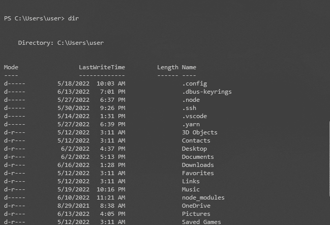

Command Line Interface in Windows Operating System

在[图形用户界面(GUI)](https://en.wikipedia.org/wiki/Graphical_user_interface) 被创造出来之前，这是开发人员与计算机互动的方式。命令行界面对于[自动化任务](https://opensource.com/article/19/12/automation-bash-scripts)和一般的软件开发仍然有用。

## 墨水是什么？

[Ink](https://github.com/vadimdemedes/ink) 是一个 JavaScript 库，为命令行带来了 React。它有助于使用基于组件的 UI 元素的概念开发 CLI 应用程序。

Ink 允许您使用 React 的所有特性，包括基于类的组件、生命周期方法、功能组件、钩子等等，来构建命令行工具。

`ink`库也有名为[有用组件](https://github.com/vadimdemedes/ink#useful-components)的插件。这些有用的组件没有内置到`ink`库中，而是由其他开发人员构建的定制组件，您可以将它们导入到 Ink 项目中。

## 如何安装油墨

有两种安装油墨的方法。它们是:

*   [用巴别塔手动安装油墨](https://github.com/vadimdemedes/ink#getting-started)
*   使用`create-ink-app`命令

在本文中，我们将使用`create-ink-app`方法快速启动一个 Ink 项目。

在命令行上，导航到要存放 ink 项目的文件夹或目录，然后运行以下命令:

```
npx create-ink-app crypto-cli
```

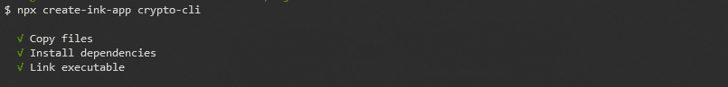

Installing Ink

该命令在运行该命令的文件夹中安装构建 Ink 项目所需的文件。在我们的例子中，文件夹和项目的名字是一样的(`crypto-cli`)。

还为我们的项目生成一个可执行的命令，这样我们就可以通过在 CLI 上调用它的名字来运行我们的应用程序。

至此，Ink 3(截至本文发布时的最新版本)已经安装完毕，我们可以开始构建命令行应用程序了。

当我们运行`crypto-cli`命令时，我们得到这个输出。

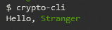

Output of running `crypto-cli`

为什么我们会有这样的输出？让我们来看看安装的文件`create-ink-app`。

## 检查 Ink 安装的文件

项目的文件结构如下所示:

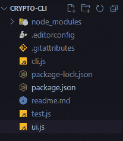

Files and folder create-ink-app provides

这些文件和文件夹是做什么的？

*   这个文件夹包含了我们的应用程序正常运行所需的所有包。这些包包括`react`和`ink`，如果有的话，还包括`react`和`ink`的依赖项。`node-modules`还包括了`ink`的开发者认为可以提供良好开发者体验的包。
*   这个文件有助于保持代码的一致性。许多开发人员可能会使用不同的 ide 来开发这个项目。为了确保编码风格一致，可以使用`.editor-config`。你可以在这里找到更多关于它[的信息。](https://editorconfig.org/)
*   `.gitattributes`:我们将使用它来配置我们的文件的属性，这些文件将被版本控制程序 [Git](https://www.freecodecamp.org/news/what-is-git-learn-git-version-control/) 使用。你可以在这里找到更多信息[。对于这个项目，我们不需要在这个文件中添加或删除任何东西。](https://git-scm.com/docs/gitattributes)
*   在这个文件中，我们将使用`ink`来呈现我们的应用程序。
*   我们用它来锁定我们的应用程序对特定版本的依赖，这样其他人就可以随时随地轻松地复制我们的项目。
*   包含我们的应用程序的元数据，包括名称、版本和依赖项。
*   我们项目的 markdown 自述文件。
*   用于在我们的应用程序中编写测试。我们不会在项目中编辑该文件。
*   `ui.js`:对于使用 React 的前端 web 开发来说，这与`App.js`同义。它导入并包含我们的项目将拥有的每个组件。

查看`package.json`可以看到我们已经安装的依赖项:

```
...,
"dependencies": {
    "import-jsx": "^4.0.1",
    "ink": "^3.2.0",
    "meow": "^9.0.0",
    "react": "^17.0.2"
},
...
```

Dependencies for our project

你可能不熟悉`import-jsx`和`meow`。让我们看看他们是怎么做的。

*   `import-jsx`:你使用这个库在`ink`中导入和传输 JSX 文件。
*   CLI 命令接受参数。`meow`帮助我们在`ink`实施。

说够了。让我们建造。

## 如何构建 CLI 应用程序

在本教程中，正如我前面提到的，我们将使用 [CoinGecko API](https://www.coingecko.com/en/api) 构建一个显示一些加密货币和代币价格的应用程序。

### 如何创建标题

我们将导入一个名为`ink-big-text`的 npm 包。它是油墨提供的“有用成分”之一。我们将使用它在命令行中创建一个大标题。

我们还将安装`ink-gradient`来美化我们的页眉。这是油墨提供的另一种“有用成分”。

```
npm install ink-big-text ink-gradient
```

然后我们将编辑我们的`ui.js`,它也必须包含我们所有的组件。

```
// ui.js

const React = require('react');
const Gradient = require('ink-gradient');
const BigText = require('ink-big-text');

const App = () => (
	<Gradient name="summer">
		<BigText text="crypto cli" align='center' font='chrome'/>
	</Gradient>
);

module.exports = App; 
```

当我们运行`crypto-cli`时，代码会转换成这个奇妙的头。

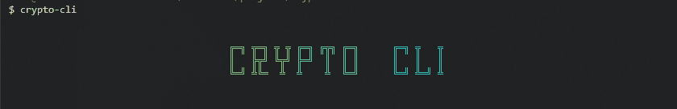

Output of the header

### 如何显示我们的数据

为了显示我们的数据，我们需要创建一个`Box`元素，以表格形式排列数据。`Box`的工作方式类似于网络上`display: flex;`的容器。您将其样式化为 Flexbox 元素。

在从 CoinGecko 提取数据之前，我们现在将创建模拟数据。`src`中的文件`data.json`将保存我们的模拟数据。你可以在这里找到模拟数据。

接下来，我们将在`src`文件夹中创建一个名为`components`的文件夹。我们还将在`components`文件夹中创建一个名为`Table.js`的文件。

下面的代码随后进入`Table.js`:

```
// Table.js

const React = require('react');

const { useState, useEffect } = React;
// Destructuring useState and useEffect from React

const { Box, Text, Newline } = require('ink');
// Destructuring the components we need from ink

const cryptoData = require('../data.json');
// Fetching mock data

const Table = () => {

    const [data, setData] = useState([]);

    useEffect(()=>{
        setData(cryptoData);
    });

    return (
        <Box borderStyle='single' padding={2} flexDirection='column'>
            <Box>
                <Box width='25%'><Text>COIN</Text></Box>
                <Box width='25%'><Text>PRICE (USD)</Text></Box>
                <Box width='25%'><Text>24 HOUR CHANGE</Text></Box>
                <Box width='25%'><Text>ALL TIME HIGH</Text></Box>
            </Box>
            <Newline/>
            {
                data.map(({id, name, current_price, price_change_percentage_24h, ath}) => (
                    <Box key={id}>
                        <Box width='25%'><Text>{name}</Text></Box>
                        <Box width='25%'><Text>{current_price}</Text></Box>
                        <Box width='25%'><Text>{price_change_percentage_24h}</Text></Box>
                        <Box width='25%'><Text>{ath}</Text></Box>
                    </Box>
                ))
            }
        </Box>
    )
}

module.exports = Table;
```

现在，我们将把表格组件导入到我们的应用程序中。

```
// ui.js

const React = require('react');
const Gradient = require('ink-gradient');
const BigText = require('ink-big-text');
const importJsx = require('import-jsx');
const Table = importJsx('./components/Table')

const App = () => (
	<>
		<Gradient name="summer">
			<BigText 
				text="crypto cli" 
				align='center' 
				font='chrome'
			/>
		</Gradient>
		<Table/>
	</>
);

module.exports = App;
(perhaps, remove the 'use strict')
```

运行`crypto-cli`会给我们这个:

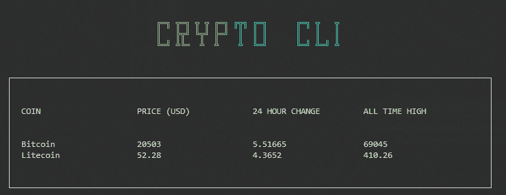

Output using mock data

我喜欢在我的 CLI 应用程序中有一些装饰。所以我们将继续使用`ink`为我们提供的颜色。

```
// Table.js

const React = require('react');

const { useState, useEffect } = React;

const { Box, Text, Newline } = require('ink');

const cryptoData = require('../data.json');

const Table = () => {

    const [data, setData] = useState([]);

    useEffect(()=>{
        setData(cryptoData);
    })

    return (
        <Box borderStyle='single' padding={2} flexDirection='column'>
            <Box>
                <Box width='25%'><Text>COIN</Text></Box>
                <Box width='25%'><Text>CURRENT PRICE (USD)</Text></Box>
                <Box width='25%'><Text>24 HOUR CHANGE</Text></Box>
                <Box width='25%'><Text>ALL TIME HIGH</Text></Box>
            </Box>
            <Newline/>
            {
                data.map(({id, name, current_price, price_change_percentage_24h, ath}) => (
                    <Box key={id}>
                        <Box width='25%'>
                            <Text>{name}</Text>
                        </Box>
                        <Box width='25%'>
                            <Text color='cyan'>{'$' + current_price.toLocaleString()}</Text>
                        </Box>
                        <Box width='25%'>
                            <Text backgroundColor={Math.sign(price_change_percentage_24h) < 0 ? 'red' : 'green'}>
                                {price_change_percentage_24h.toFixed(2) + '%'}
                            </Text>
                        </Box>
                        <Box width='25%'>
                            <Text color='green'>{'$' + ath.toLocaleString()}</Text>
                        </Box>
                    </Box>
                ))
            }
        </Box>
    )
}

module.exports = Table;
```

为了清楚起见，为了给`ink`中的文本组件添加颜色，我们使用了 prop (attribute) `color`。为了添加背景颜色，我们使用了属性`backgroundColor`。然后，我们添加了检查 24 小时变化是负还是正的逻辑。

如果变化是积极的，我们确保背景色是绿色，否则背景色将是红色。

当我们运行`crypto-cli`时，我们有以下输出:

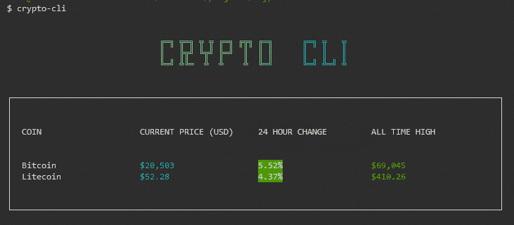

Output after adding styles

手动否定`data.json`中第二个`24 HOUR CHANGE`的值会产生以下输出:

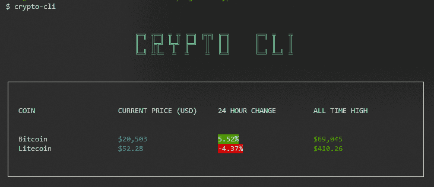

Output after negating a value

### 如何从 CoinGecko API 获取数据

这个阶段是我们从 CoinGecko API 获取实际数据的地方。以下是我们需要采取的步骤:

*   前往[https://www.coingecko.com/en/api/documentation](https://www.coingecko.com/en/api/documentation)

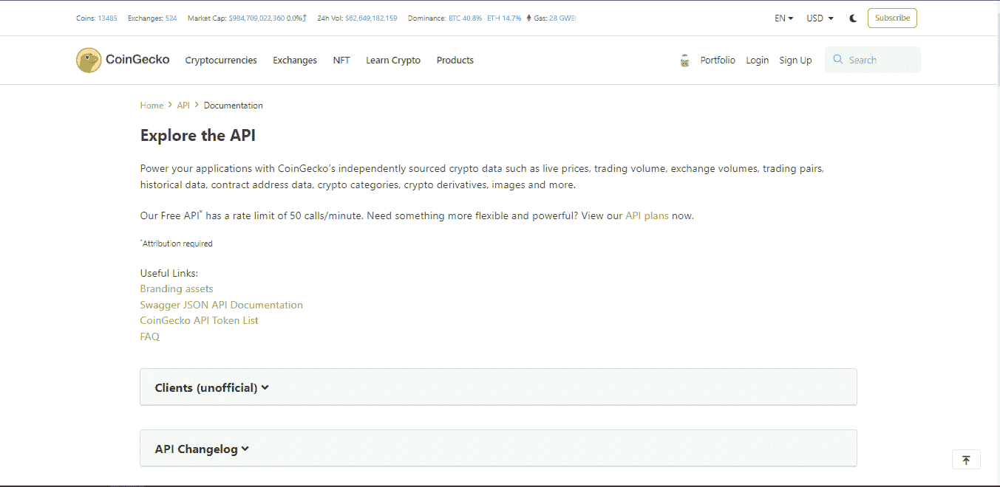

CoinGecko API page

*   导航至“硬币”部分，点击`/coins/markets`

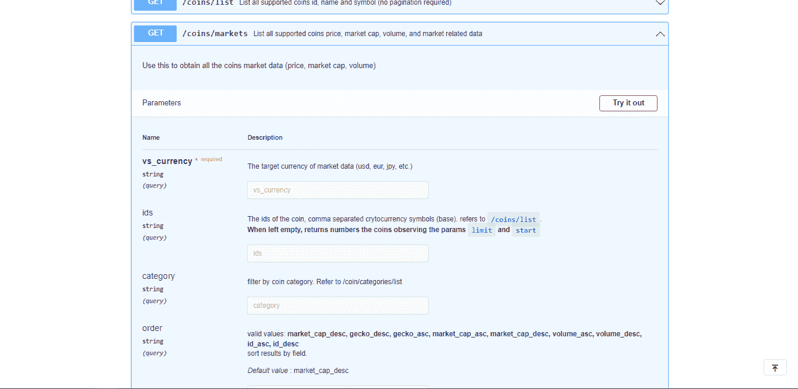

navigating to /coins/markets

*   单击“试用”按钮。
*   输入“美元”作为`vs_currency`。还要输入你喜欢的加密货币和代币的`id`(我用过比特币、莱特币、matic-network、以太坊、tether、binancecoin、solana、aave、cardano 和 tron)。请记住，在输入硬币 id 时不要添加空格。

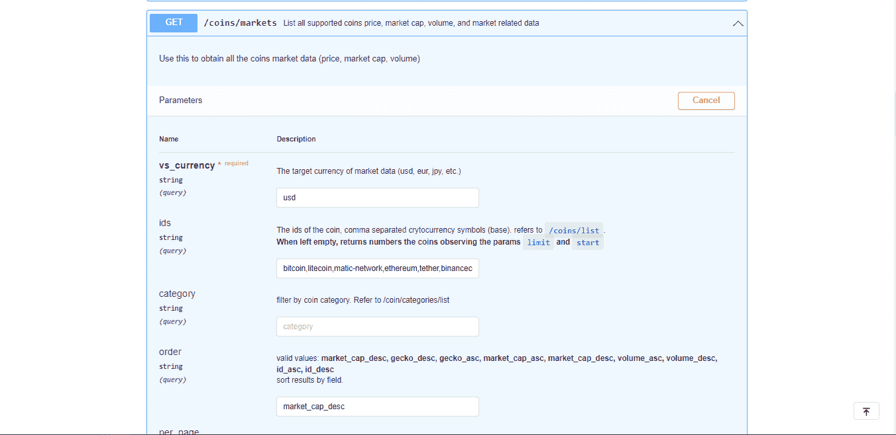

Input form values

*   单击执行按钮
*   复制出它生成的链接。对我来说，这是我将用来进行 API 调用的链接。该链接取决于您选择的加密货币或令牌。

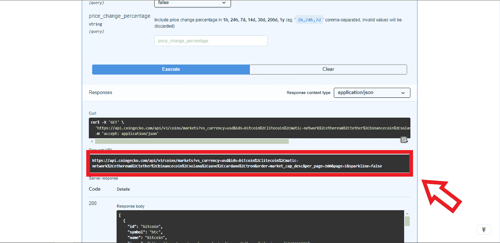

Copy the highlighted link

```
https://api.coingecko.com/api/v3/coins/markets?vs_currency=usd&ids=bitcoin%2Clitecoin%2Cmatic-network%2Cethereum%2Ctether%2Cbinancecoin%2Csolana%2Caave%2Ccardano%2Ctron&order=market_cap_desc&per_page=100&page=1&sparkline=false
```

我们现在将移动到我们的`Table.js`并进行 API 调用。

安装`[axios](https://github.com/axios/axios)`,这是一个 npm 库，用于获取 API 数据。

```
npm install axios
```

然后，使用`axios`，我们获取我们的数据。

```
const React = require('react')
const { useState, useEffect } = React;
const { Box, Text, Newline } = require('ink')
const axios = require('axios')

const url = 'https://api.coingecko.com/api/v3/coins/markets?vs_currency=usd&ids=bitcoin%2Clitecoin%2Cmatic-network%2Cethereum%2Ctether%2Cbinancecoin%2Csolana%2Caave%2Ccardano%2Ctron&order=market_cap_desc&per_page=100&page=1&sparkline=false'

const Table = () => {

    const [data, setData] = useState([])

    useEffect(()=>{
        axios.get(url)
        .then(response => setData(response.data))
        .catch(e => console.log(e))
    },[])
    // Fetching data and catching possible errors

    return (
        <Box borderStyle='single' padding={2}>
            {
                data.length === 0 ?
                <Box>
                    <Text>Loading ...</Text>
                </Box> :
                <Box flexDirection='column'>
                    <Box>
                        <Box width='25%'><Text>COIN</Text></Box>
                        <Box width='25%'><Text>CURRENT PRICE (USD)</Text></Box>
                        <Box width='25%'><Text>24 HOUR CHANGE</Text></Box>
                        <Box width='25%'><Text>ALL TIME HIGH</Text></Box>
                    </Box>
                    <Newline/>
                    {
                        data.map(({id, name, current_price, price_change_percentage_24h, ath}) => (
                            <Box key={id}>
                                <Box width='25%'>
                                    <Text>{name}</Text>
                                </Box>
                                <Box width='25%'>
                                    <Text color='cyan'>{'$' + current_price.toLocaleString()}</Text>
                                </Box>
                                <Box width='25%'>
                                    <Text backgroundColor={Math.sign(price_change_percentage_24h) < 0 ? 'red' : 'green'}>
                                        {price_change_percentage_24h.toFixed(2) + '%'}
                                    </Text>
                                </Box>
                                <Box width='25%'>
                                    <Text color='green'>{'$' + ath.toLocaleString()}</Text>
                                </Box>
                            </Box>
                        ))
                    }
                </Box>
            }
        </Box>
    )
}

module.exports = Table; 
```

对于我们选择的硬币，我们应该会看到以下输出(由于加密市场不稳定，因此值可能会有所不同):

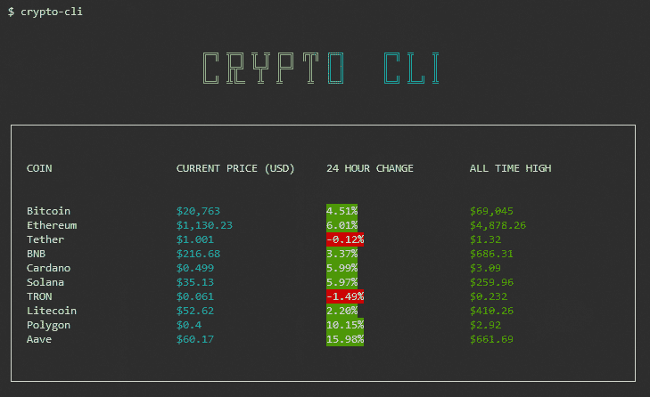

Final Output

## 结论

在本教程中，我们学习了如何使用 React 和 Ink 构建命令行应用程序。

我们还使用 CoinGecko API 和 Axios 来获取数据。

Ink 提供了更多的组件，您可以以多种方式组合它来创建真正有用的命令行程序。

谢谢你的阅读，我会很快见到你。