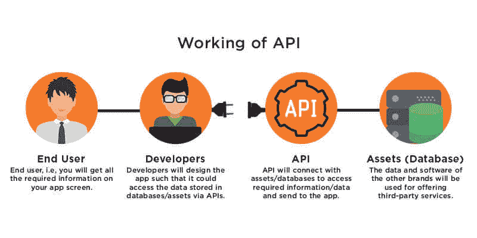
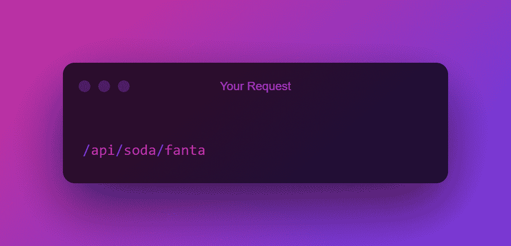
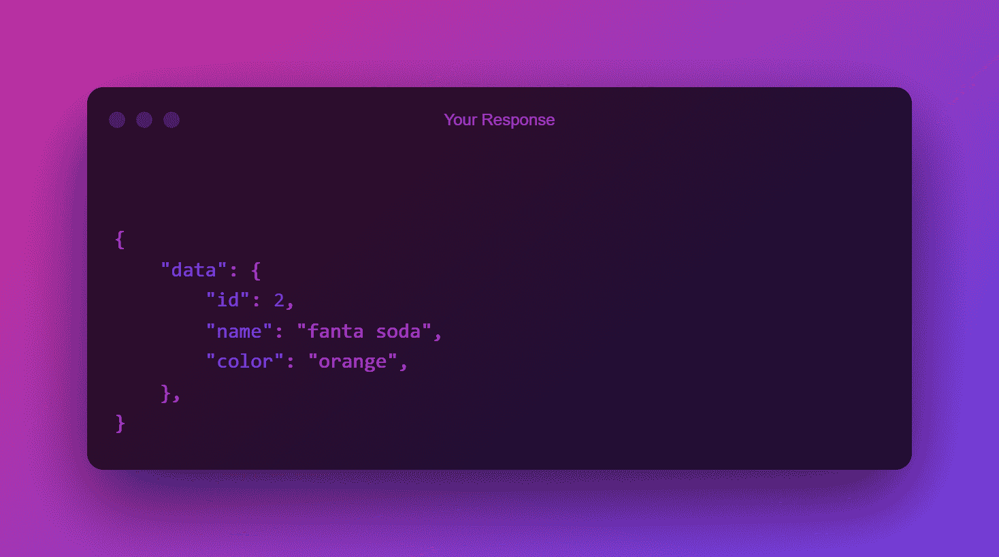
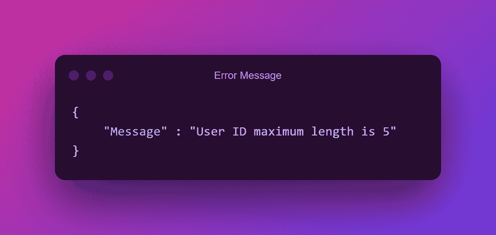
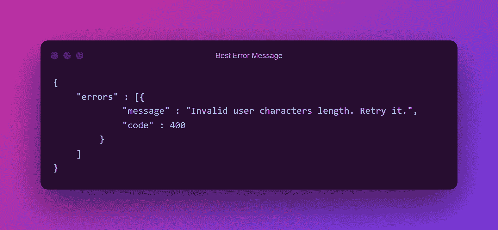
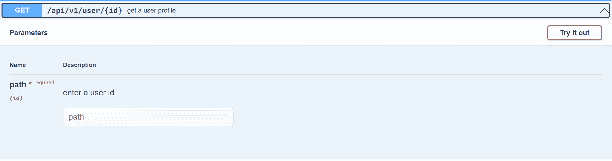

# 如何设计 API——应用程序编程接口最佳实践

> 原文：<https://www.freecodecamp.org/news/design-an-api-application-program-interface/>

**API** 代表应用编程接口。API 使用请求和响应与两个应用程序进行通信。它对外部用户公开。

## API 是如何工作的？

How an API works

想象你在一家商店里，想买一瓶汽水。但你不能走进去拿一个，因为你是一个局外人——一个外部用户——所以你需要一个链接(与某人交谈并为你的苏打水买单)来获得你想要的东西。

你不能链接到书架——数据库——因为它们不能移动或说话。所以这就是销售者——API——介入的地方。卖家是你和你想要的商品——数据(汽水)——之间的中介。

现在，您有了一个链接，可以与货架上的商品进行交流，因此您需要苏打水。然后卖家搜索你想要的汽水品牌和口味给你。你付钱，拿走，然后离开。

### 刚刚发生了什么？

卖方(充当 API)向货架(数据库)查询所请求的数据。

您可能知道，数据集有不同的形式。API 在数据库中查询一个表，然后在这个表中搜索详细的数据。最后，API 向您发送您需要的数据。

假设你点了一杯芬达汽水。

**您的请求:**

**您的回应:**

响应总是采用 JSON (JavaScript 对象表示法)格式。这就是 API 的工作方式。

## 如何设计一个 API

设计 API 时，您应该考虑一些最佳实践，它们可以帮助您优化 API 及其响应时间。

### 正确命名 API

假设您正在创建一个向您发送特定用户数据的 API。简单地将 API 命名为 **GetUsers** 是不明智的，因为这意味着您想要获取数据库中的所有用户，并且调用该 API 的外部用户将会期待您想要给出的响应。

#### API 的好名字的例子

*   使用清晰、简洁的名称:

如果你想查询一个苹果数据库，将 API 命名为“api/fruits/”是没有意义的

虽然苹果是一种水果，但它不是最终用户想要的。最终用户想要一种特定的水果，因此将其命名为**“API/apple/”。**

*   使用解释查询的词语:

使用像名词一样的词来表示 API 中资源的内容，例如**“API/文具/笔”**。这解释了 API 对信纸数据库中所有笔的查询。

这将代替例如**“API/信纸/write”。**

*   避免特殊字符:

如果最终用户看到类似于**“API/fruits % 20？/苹果”。**他们不会理解这个 API 是做什么的，或者它是如何查询的，或者它将获得什么信息。

### 必要时定义参数

除非需要，否则尽可能避免使用额外的参数。创建 RestFul API 时所需参数的一些示例如下:

*   **请求头和 cookie**:这个参数使用服务器发送给用户 web 浏览器的一小段数据。
*   **URL 查询字符串**:这些参数元素被插入到您的 URL 中，帮助您过滤和组织网站上的内容或跟踪信息。
*   **URL 路径**:这是一个必需的参数，它为最终用户或任何调用 API 的人提供了一种获取正确信息的方法，例如: **"/users/"** ，**"/users/<user _ id>/" package/<package _ id>"**。
*   **主体查询字符串/多部分**:该参数设置问题或 API 的 HTTP 方法，如**POST**——发送数据，或**PUT**——更新 API 中的数据。

那么什么时候需要参数呢？假设外部用户正在对一个 API 服务进行多次查询，API 会查询其他服务来获取用户想要的数据。

这将降低 API 服务的速度，但是在这种情况下，额外的参数是有帮助的。

### 定义响应对象

用外行人的话来说，响应对象是 API 被触发或调用时响应的属性。一些响应对象包括:

*   **Title** :这是响应的显示标题，如 **User** 如果对象返回一些用户信息。这是必需的响应对象。
*   **Subject** :这是响应的主题，比如用户和任何其他与用户相关的信息。
*   **Sender_id** :这是创建的发送者或用户的 id。这是一个选项响应对象，意味着如果不需要它，您可以选择不将其添加到响应对象中。
*   **类别**:响应对象的类别。如果 API 返回一个用户的信息，类别将是**用户**。

许多开发人员创建一个包含来自 API 服务的所有内容(甚至是不必要的信息)的响应对象，希望在用户要求更多细节时不要更改响应对象(因为这需要更多的网络需求)。

不幸的是，这是一种糟糕的 API 设计实践。创建响应对象时，明智的做法是只返回外部用户需要的内容，因为构建大型微服务会影响性能等。

### 定义错误对象

当您在外部用户查询数据库时返回一条错误消息时，该消息应该清晰简洁——而不仅仅是一条普通的错误消息，如“**Error Found”**或**“Error occurs”**

这应该是响应的标题，数据或主题部分应该解释发生了什么样的错误。

这是我在创建 API 错误消息时的个人观点。不要返回不必要的错误信息。假设一些用户数据的最大字符长度为 5，一个外部用户向 API 查询字符长度为 8 的用户数据。

不要这样做:

执行以下操作:

这解释了最终用户做错了什么，并且格式向最终用户显示该错误是客户端错误。

### 使用正确的 HTTPS 请求方法

在为 API 服务定义一个 [HTTP 方法](https://doc.oroinc.com/api/http-methods/#:~:text=The%20primary%20or%20most%20commonly,or%20CRUD)%20operations%2C%20respectively.)时，您必须使用正确的方法让用户以正确的方式进行查询。一些 HTTPS 方法是:

*   **POST** :如果最终用户要向 API 发送数据，请使用此方法。
*   **GET** :如果最终用户要在 API 查询数据库后检索数据，请使用此方法。
*   **PUT** :如果最终用户更新数据库中的现有数据，则使用此方法。
*   **PATCH** :如果最终用户需要更正或替换数据库中的现有数据，请使用此方法。
*   **DELETE** :如果最终用户从数据库中删除任何信息或数据，则使用此方法。

假设一个外部用户想通过发送一个 ID 来查询用户表，你设计的 API 方法使用了 **POST** 方法。这将限制用户的查询，因为最终用户没有添加或创建数据，并且用户不能以他们应该能够的方式进行查询。

相反，使用带有 ID 作为参数的 **GET** 方法是最好的，应该是这样的:

这将为用户提供使用 ID 进行查询并获取特定数据的选项。

我建议在定义方法之前了解所有的 HTTP 请求方法，并在被请求时返回正确的 ID。

确保路由非常清晰，这样用户就可以快速调用我前面展示的 API 服务。

### 不要对 API 产生副作用

一个副作用是，例如，当一个外部用户向一个 API 查询用户的名字，但是它返回 ID 和全名。

当创建一个 API 时，尽量不要在一个函数中定义所有的东西。如果 API 设置了许多标志或者同时执行许多任务，那么它应该被分成多个 API。这就是原子性发挥作用的地方。

[原子性](https://docs.oracle.com/cd/E17275_01/html/programmer_reference/transapp_atomicity.html#:~:text=Atomicity%20means%20that%20multiple%20operations,or%20none%20of%20the%20changes.)是指多个操作被组合成一个逻辑实体。创建 API 时，原子性很重要。当使用原子性时，糟糕的函数命名是一个糟糕的想法。

#### 什么时候需要原子性？

假设我们希望在 admins' group 表下创建一个管理员用户。不过，我们还没有创建 admin group 表，所以我们的逻辑是创建一个用户作为 admin，创建 admin group 表，然后将 admin 用户添加到 admin group 表中。

但是如果失败了呢？假设用户没有被创建为管理员，但是创建了 admin 表，反之亦然。这就是原子性发挥作用的地方。

当使用原子性调用一个动作时，尽量调用正确的动作，而不是通用的动作。否则它会把 API 弄得一团糟，在使用 API 时会出现混乱。

### 实现分页

当创建一个巨大的微服务并且响应体或对象变得太大时，分页使 API 更容易返回少量信息。

分页是一种在网站或响应对象上将数字内容分成不同页面的方法。

想象一个有 70 个用户的数据库。API 调用 **getUsers** 而不是一次发送所有用户的响应并使其变慢。

您可以分解响应，比如返回前三十个用户，随后的三十个用户，以及后面的十个用户。不过，分页响应速度更快。

但是这违反了无状态 API 的属性，即外部用户在他们的终端处理会话相关信息的存储。

### 使用[碎片](https://www.ibm.com/docs/SSGU8G_14.1.0/com.ibm.ddi.doc/ids_ddi_084.htm#:~:text=Fragmentation%20is%20a%20database%20server,to%20some%20algorithm%20or%20scheme%20.)

当 API 进行内部通信时，响应通常很短。但当它是一个大的响应时，它是一个例外，当它是一个例外时，它就有问题。

当响应超过其限制(每个响应 10kb 或 15kb)时，会出现这种情况。这里的解决方案是将响应分解，然后一点一点地交给另一个服务。

这就像将 TCP(传输控制协议)号分成片段并分发出去，这样服务就不会过载。

它将知道更多的细节还在后面，它还将有一个结束数据包，如 break 命令，表示当片段即将结束时，协议结束。

## 结论

以下是这篇文章的一些要点:

*   避免奇怪的字符，使用代表 API 响应内容的单词。
*   当响应对象很大时，分页和分段是必不可少的。
*   如果数据库负载很大，应该缓存请求。
*   如果您有很多负载，减少您的响应时间，而不是将完整的信息传递给用户。只需传入必要或关键的数据。这被称为**服务质量下降**。它包括提供基本要素，并且仍然在不破坏 API 服务的情况下做出响应。
*   当设计一个 API 并且你想要一个完美的数据一致性时，缓存你的响应。