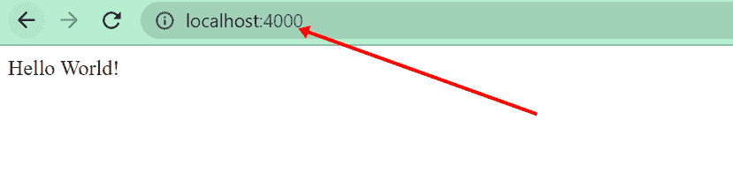
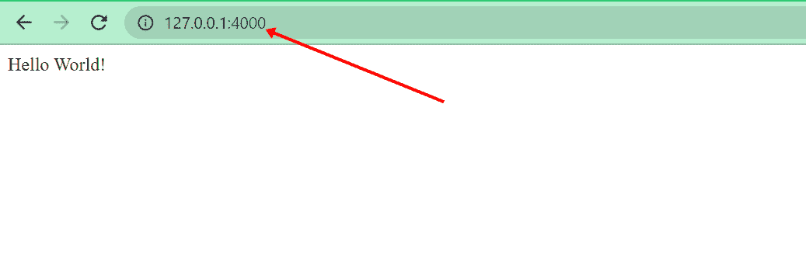

# 什么是本地主机？解释了本地主机 IP 地址

> 原文：<https://www.freecodecamp.org/news/what-is-localhost/>

如果您是一名经验丰富的 web 开发人员，那么您可能在很多场合都见过术语“localhost”。

即使你是一个初学者，刚刚开始 web 开发，你也可能在使用一个服务器插件时看到数字“127.0.0.1”。

您可能在不知道它到底是什么的情况下使用它来测试网站和 web 应用程序。嗯，“127.0.0.1”是本地主机，“本地主机”是“127.0.0.1”。

在本文中，您将了解什么是 localhost 及其对应的 IP 地址“127.0.0.1”。

## 什么是本地主机？

在计算机网络中，主机意味着“服务器”。就像你可以把一个网站放在一个服务器上，你也可以让你自己的电脑成为服务器。这种连接被称为**环回**。环回的 IP 地址是`127.0.0.1`。

如果你以前在互联网上建立过网站，那么你就和 Heroku、Hostinger、Netlify 和许多其他的托管公司打过交道。这些就是我所说的“远程主机”或虚拟服务器。

如果你已经在你的电脑上提供了一个网站，这样你就可以在不连接到互联网的情况下测试它，你要处理的是一个本地主机。

因此，根据定义， **localhost 是当前向自身发出请求的计算机或主机名**。在这种情况下，计算机也是虚拟服务器。

## IP 地址`127.0.0.1`是什么？

如果您想要访问某个网站，您可以在浏览器的地址栏中键入该网站的地址，例如`https://freecodecamp.org`。

域名服务器(DNS)将该地址与对应于该名称的数字 IP 地址进行匹配。在 freeCodeCamp 的情况下，这个 IP 地址是`104.26.2.33`。你访问的每个网站都是这样做的。

Localhost 也不例外。因此，如果你在浏览器的地址栏中输入`localhost`，它会转换成 IP 地址`127.0.0.1`。

这个`127.0.0.1` IP 地址是为计算机上的本地服务器保留的，所以你永远也找不到另一个以 127 开头的 IP 地址。

### 但是 localhost:什么？或者 127.0.0.1:什么？

就像`HTTP`和`HTTPS`，`localhost`是一个协议。记住网站域名是 http 或 https 后面的东西，比如`https://www.google.com/`和`https://www.freecodecamp.org/`。

所以，`localhost:`和`127.0.0.1:`后面必须有东西。那个东西是端口号。

例如，在 Express 应用程序中，端口号是您设置的端口变量。大概是这样的:

```
const port = 4000; 
```

因此，如果你在浏览器地址栏中输入`localhost:4000`并点击`ENTER`，你当前正在制作的网络应用将会被提供给你:


同样，如果你输入`127.0.0.1:4000`，你会得到同样的响应:


如果使用 VS 代码的 live 服务器扩展，它使用一个端口`5500`连接到`127.0.0.1`，后跟文件名:


## 结论

我希望这篇文章能够帮助您了解更多关于 localhost 的知识，它的 IP 地址是什么，以及它如何为网站提供本地测试服务。

是的。没有地方比得上 localhost。恰当的说，“没有一个地方像`127.0.0.1`”:)。

继续编码…