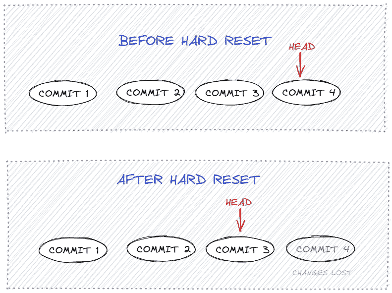
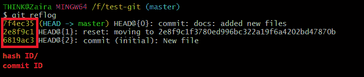
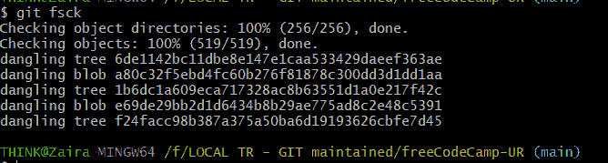

# 如何在 Git 中恢复已删除的文件–在硬重置后恢复更改

> 原文：<https://www.freecodecamp.org/news/how-to-recover-a-deleted-file-in-git/>

Git 是一个版本控制系统，可以帮助您跟踪项目生命周期中的变化。它保留了项目的历史，并允许您和您的团队成员自始至终进行有效的协调。

可能会出现这样的情况:您删除了一个文件，并且想要恢复它。好消息是，在大多数情况下，当使用版本控制系统(VCS)时，您可以恢复文件。

在本教程中，我们将学习 Git 提供的恢复被删除文件的不同方法。

## 提交更改后如何恢复文件

假设您提交了一个变更，但是对一个不同的提交进行了硬重置(`git reset --hard HEAD`)，这从您的当前分支中删除了最近的提交。



Hard reset explained.

在这种情况下，您可以使用`git checkout`或`git reflog`来恢复文件。

您可以从命令:`git log`中找到上一次提交的 hash-ID。

之后，只需使用以下命令恢复到上一次提交:

```
git checkout <hash-id>
```

如果没有散列 ID，可以使用命令`git reflog`。

`reflog`是一种日志记录机制，根据它们唯一的`hash-id`记录所有的变化。

下面是`git reflog`的输出示例:



Output of `git reflog`

选择提交 ID 并使用它恢复到该提交。

```
git reflog <hash-id>
```

## 当更改已暂存但未提交时，如何恢复文件

假设您用`git add <file-name>`暂存了一个文件，然后在提交之前用`git reset --hard HEAD`进行了硬重置。之后，您发现暂存文件丢失了。在这种情况下，您也可以恢复文件。

我们可以使用命令`git fsck`在硬复位后恢复文件。

### 什么是`git fsck`？

`git fsck`代表文件系统检查。它检查`.git`目录中不属于任何变更的所有“悬空 blobs”。例如，可能有一些已暂存但未添加到任何地方的更改。



Output of `git fsck`.

一旦我们能够识别“悬挂的斑点”，我们就可以使用`git show`查看细节。

```
git show f24facc98b387a375a50ba6d19193626cbfe7d45
```

根据不同的更改，您可以查看各自的更改。

您可能还想将更改保存在文件中。您可以使用`>`操作符简单地将输出重定向到一个文件。

```
git show f24facc98b387a375a50ba6d19193626cbfe7d45 > restored_file.txt
```

现在，`restored_file.txt`将包含提交的内容。

## 如何恢复既未提交也未暂存的更改

在更改既没有暂存也没有提交的情况下，Git 不能帮助您恢复文件。

原因是这些文件没有添加到 staging 中，Git 无法判断这些文件的状态。

在这种情况下，在临时文件或文本编辑器的缓存历史中进行搜索会很有帮助。

## 包扎

当处理有风险的文件时，最好使用 VCS。通过这种方式，文件将被保留，并且意外数据丢失的机会将减少。

在本教程中，我们学习了如何恢复已删除的文件，无论它们是暂存的还是提交的。

我希望这篇教程对你有所帮助。谢谢你一直读到最后。

你从这个教程中学到的最喜欢的东西是什么？在 [Twitter](https://twitter.com/hira_zaira) 上告诉我！

你也可以在这里阅读我的其他帖子[。](https://www.freecodecamp.org/news/author/zaira/)