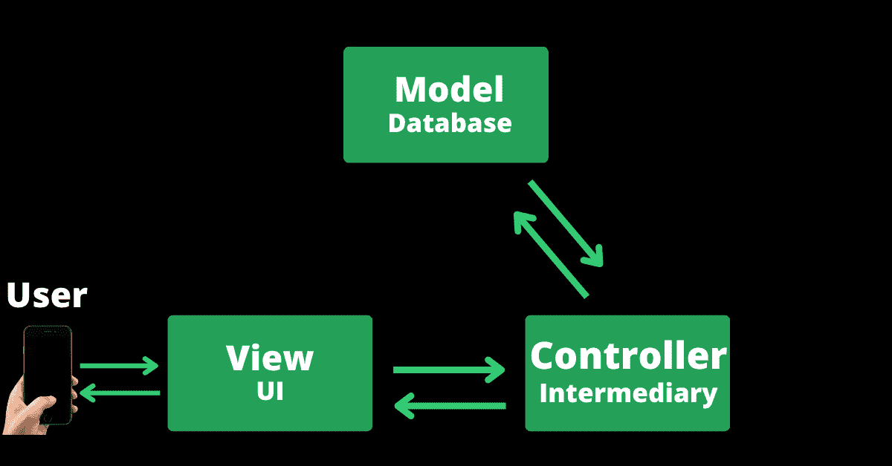
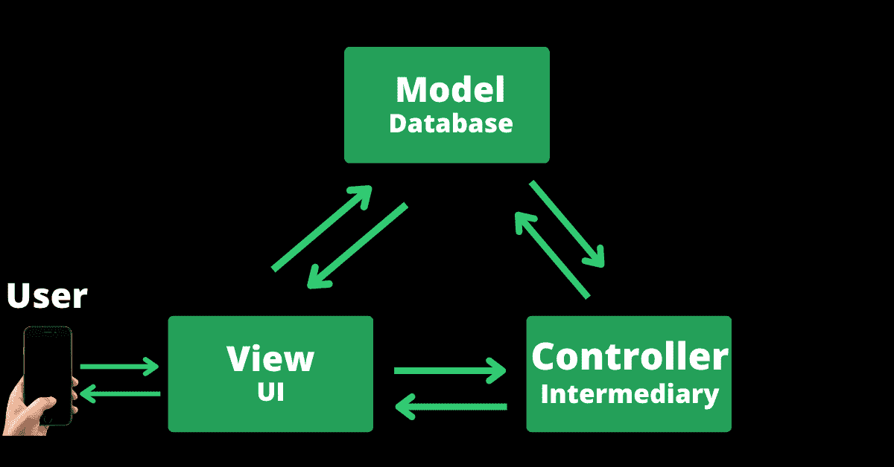
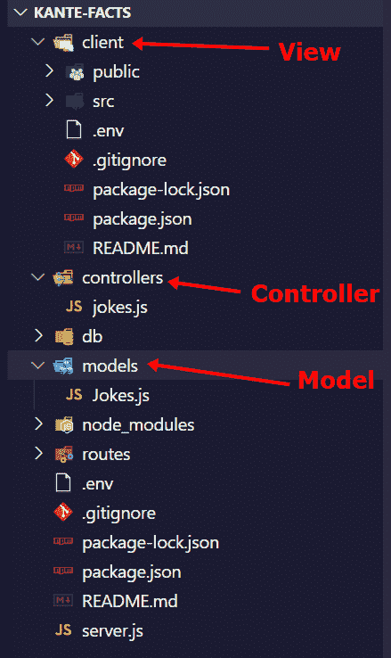

# 计算机科学中的 MVC——MVC 模型

> 原文：<https://www.freecodecamp.org/news/what-does-mvc-mean-in-computer-science/>

MVC 是代表模型、视图和控制器的缩写。这种架构模式是在 20 世纪 70 年代后期为制作桌面应用程序而创建的，但现在它被广泛用于 web 应用程序开发。

在这篇文章中，我将深入探讨 MVC 及其 3 个组件的含义，这样你就能理解它了。

我还准备了一个信息图，可以帮助你更好地理解 MVC，但是你得先看文章。:)

## 我们将涵盖的内容

*   [什么是 MVC，为什么使用它](#whatismvcandwhyisitused)
*   [哪些语言和框架使用 MVC？](#whichlanguagesandframeworksusemvc)
*   [MVC 中的模型是什么？](#whatisthemodelinmvc)
*   [MVC 中的视图是什么？](#whatistheviewinmvc)
*   [MVC 中的控制器是什么？](#whatisthecontrollerinmvc)
*   [结论](#conclusion)

## 什么是 MVC，为什么要用 MVC？

在计算机科学中，MVC 是一种软件设计模式，用于将应用程序代码组织成三个相互交织的部分——模型、视图和控制器。

模型是与数据库交互的逻辑，视图是用户交互的用户界面，控制器是视图和模型之间的中介。

在许多情况下，视图从不与模型直接交互——控制器执行该功能。



在其他一些框架中，模型可以直接与视图进行交互


MVC 设计模式旨在将应用程序代码划分为各自独立的单元，因此维护和优化不会是一件麻烦的事情。这就是通常所说的“关注点分离”。

## 哪些语言和框架使用 MVC？

在过去，MVC 仅用于制作桌面 GUI。今天，许多编程语言和框架都为 web 应用程序开发实现了 MVC。

一些框架甚至强迫你使用 MVC，所以你可能一直在使用 MVC 而没有意识到你正在使用它。

例如，在 full stack Express 应用程序中，开发人员通常会将代码分为模型、控制器和客户端(视图)文件夹。


这是我为我最喜欢的足球运动员制作的[笑话生成器](https://blooming-reef-46396.herokuapp.com/)的文件夹结构。

使用 MVC 的编程语言的例子有 C、C++、C#、Java、Ruby、Smalltalk 等等。

使用 MVC 的框架有 Angular、Express、Django、Flask、Laravel、Ruby on rails 等等。

## MVC 中的模型是什么？

模型组件包含负责从数据库中检索数据的逻辑。为此，您也可以使用 JSON 文件来代替数据库。

例如，在电子商务应用程序的 SQL 数据库中，这可能类似于`product-data = db.get(SELECT * FROM products;`。

在许多情况下，模型与控制器通信，将数据发送到视图(用户界面)。在其他情况下，模型可以直接向视图发送数据。

## MVC 中的视图是什么？

视图组件是用户直接与之交互的部分。它与控制器通信，显示用户用鼠标和键盘操作请求了什么。

HTML、CSS、JavaScript 等语言经常被用来实现这一部分。你也可以使用 React、Vue 和 Svelte 这样的框架。

一些开发人员还使用 Handlebars、ejs 和 liquidjs 等模板引擎来实现视图。

在电子商务应用程序中，代码可能包含如下内容:

```
<h1>{{product.name}}</h2>
<ul>
<p>{{product.description}}</p>
<p>{{product.delivery-modes}}</p> 
```

## MVC 中的控制器是什么？

控制器组件是模型和视图之间的中介。它既不是模型也不是视图，而是连接它们的部分。

控制器对视图所做的是接收和处理用户请求以及视图(用户界面)所执行的操作。因此，它处理类似于`GET`、`POST`、`PUT`或`PATCH`和`DELETE`的请求。

当控制器接收到用户请求时，它就与模型进行通信以获得用户想要的内容，然后将其发送回视图(用户界面)供用户查看。

下面的代码片段显示了控制器的一些伪代码:

```
if (success) {
      show products;
} else {
      show error;
} 
```

## 结论

模型-视图-控制器模式已经成为制作 web 应用程序和其他软件产品的广泛使用的架构模式。

一开始可能会很困惑，但是坚持不懈的学习和练习会帮助你理清思路。

如果你仍然不明白 MVC 是什么，可以这样看:

*   **你**打电话给一家餐馆订披萨——你是`view`
*   你把你点的菜交给一个**服务员**——这个服务员就是`controller`
*   服务员从**商店**拿到你的披萨，然后给你——商店就是`model`

你可以看到，你这个`view`永远不必去商店买你的披萨，就像视图在很多场合永远不会直接从模型中检索数据一样。

感谢阅读。