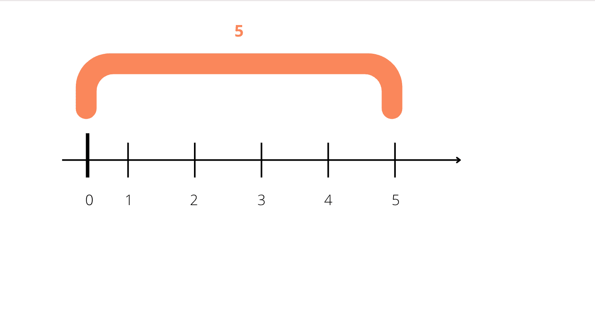
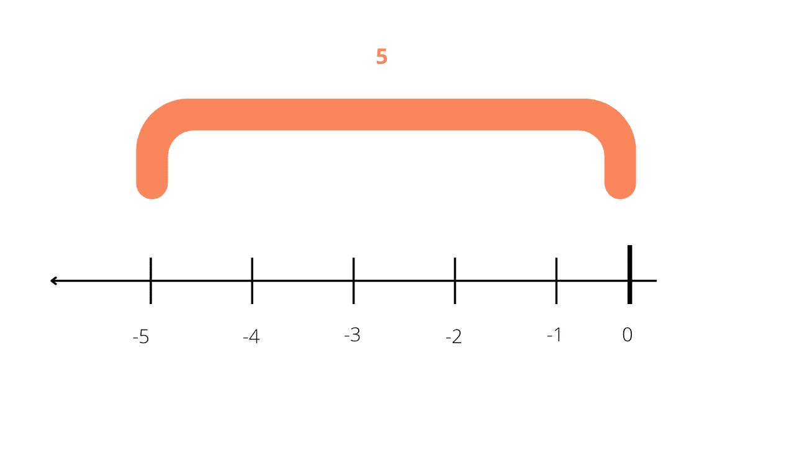

# Python 绝对值–Python ABS 教程

> 原文：<https://www.freecodecamp.org/news/python-absolute-value-python-abs-tutorial/>

在本文中，您将学习 Python 中的`abs()`函数。

您将了解到`abs()`函数的作用以及为什么您可能想要使用它。

你也会在实际例子的帮助下理解如何使用`abs()`。

以下是我们将要介绍的内容:

1.  [Python 中的`abs()`函数是什么？](#intro)
    1.  为什么绝对值很重要？
    2.  [如何使用 Python 中的`abs()`函数？语法崩溃](#usage)
2.  [举例说明如何使用`abs()`功能](#examples)
    1.  [如何使用带有整数参数的`abs()`函数](#integer)
    2.  [如何使用带有浮点数参数的`abs()`函数](#float)
    3.  [如何使用带有复数参数的`abs()`函数](#complex)

## Python 中的`abs()`函数是什么？

`abs()`内置 Python 函数返回一个数的绝对值。

但是首先一个数的绝对值是多少呢？

在数学中，一个数的绝对值是指该数离零的距离。

本质上，它是数轴上的数字离零有多远。

例如，数字五的绝对值是五，因为从零到五的距离是五个单位。



需要注意的是，绝对值将始终是一个正值。所以，当计算一个负数的绝对值时，结果总是这个数的正数。

比如负五的绝对值也是五:



### 为什么绝对值很重要？

绝对值是一个重要的概念，常用于数学和物理中。

有时候你只需要使用正数，而不需要使用负数。事实上，您可能需要确保您将要执行的计算没有任何负数。

您最有可能使用绝对值来计算一个点到另一个点的距离。

其他一些常见的现实世界的例子可能是:

*   计算两点之间的差值。
*   计算消耗的能量。
*   计算两点之间的温度、时间和速度差。

### 如何使用 Python 中的`abs()`函数？初学者语法详解

`abs()`函数的一般语法如下所示:

```
abs(number) 
```

让我们来分解一下:

*   `abs()`函数只有一个参数，这个参数是**必需的**。
*   参数始终是一个可以有负值或正值的数字。
*   该号码可以是:
    *   整数，如`4`、`-15`或`10`。
    *   浮点数，如`4.1`、`-15.06`或`2.13`。
    *   一个复数。一个复数由两部分组成——一个由实数如`1`或`4`组成的**实数**部分，和一个**虚数**部分。在 Python 中，虚数部分是通过添加字母`j`作为后缀创建的——而不是像数学中那样添加字母`i`。你把`j`加到一个实数的末尾，像这样:`1j`或者`4j`。因此，Python 中复数的一个例子是`2 + 4j`或`1 + 2j`。

现在，当谈到`abs()`函数的返回值时:

*   对于**整数**，`abs()`函数返回给定数字的绝对值。
*   对于**浮点数**，`abs()`函数返回给定数字的绝对值。
*   对于**复数**，`abs()`函数返回给定数字的幅度。

## 举例说明如何使用`abs()`功能

在接下来的小节中，您将看到`abs()`函数的运行，以及当它使用整数、浮点数和复数作为参数时，它是如何工作的。

### 如何使用带有整数参数的`abs()`函数

当你传递一个整数作为参数时，`abs()`函数将返回它的绝对值。

下面是一个将正整数作为参数传递的示例:

```
my_number = 7

abs_value = abs(my_number)

print(abs_value)

#output 

#7 
```

下面是一个传递负整数作为参数的例子。

请记住，绝对值永远是正的:

```
my_number = -17

abs_value = abs(my_number)

print(abs_value)

#output

#17 
```

### 如何使用带有浮点数参数的`abs()`函数

当你传递一个浮点数作为参数时，`abs()`函数将返回它的绝对值。

以下示例的工作方式与上一节中的示例相同。

下面是一个正浮点数作为参数:

```
my_number = 34.05

abs_value = abs(my_number)

print(abs_value)

#output

#34.05 
```

这里有一个负浮点数作为参数:

```
my_number = -43.2

abs_value = abs(my_number)

print(abs_value)

#output

#43.2 
```

### 如何使用带有复数参数的`abs()`函数

复数的工作方式不同于整数和浮点数。

当一个复数作为参数传递给`abs()`函数时，返回值是该数字的大小。

一个复数的幅度，比如`a+bj`，就是该数在复平面上原点(0，0)和点(a，b)之间的距离。借助于勾股定理，$\sqrt{a^2 + b^2}$，可以计算出一个复数的大小

所以，我们以复数`3 + 4j`为例。你需要计算实数部分(`3`)和虚数部分`4`)的平方的平方根:$\sqrt{3^2 + 4^2}$ = 5

在 Python 中，这就是如何在`abs()`函数中使用复数:

```
my_number = 3 + 4j

abs_value = abs(my_number)

print(abs_value)

#output

#5.0 
```

## 结论

好了，现在你知道了`abs()` Python 函数是如何工作的了！

我希望这篇文章对你有所帮助。

要了解更多关于 Python 编程语言的知识，请查看 freeCodeCamp 的[带有 Python 认证的科学计算](https://www.freecodecamp.org/learn/scientific-computing-with-python/)。

你将从基础开始，以互动和初学者友好的方式学习。最后，您还将构建五个项目来付诸实践，并帮助巩固您所学的内容。

非常感谢您的阅读和快乐编码:)