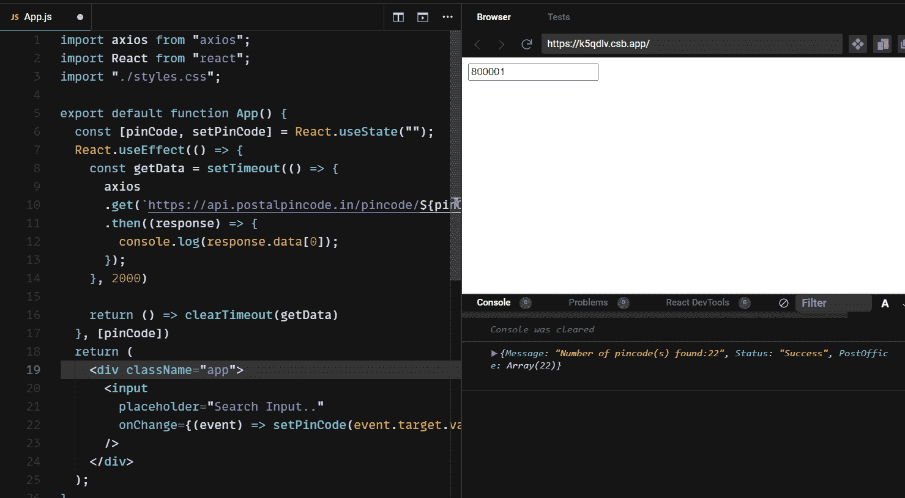

# React 中的去抖——如何延迟 JS 函数

> 原文：<https://www.freecodecamp.org/news/debouncing-explained/>

软件开发有一些繁重的任务。以调用 API 为例。假设我们有一个搜索用户列表的 API，我们不能过于频繁地启动它。我们只希望在键入整个搜索查询后进行搜索。

嗯，[去抖动是软件开发中的一项实践](https://www.freecodecamp.org/news/javascript-debounce-example/),它可以确保像上面这样的繁重任务不会经常被解雇。

## 何时使用去抖

我们用一个例子来理解这个。假设我们有一个 input 元素，当我们输入一些东西时，它会获取一些数据。例如，我们输入任何 pin 码，它都会返回一些数据。

但是这里有一个陷阱。假设我们的密码是 800001。如果我们键入第一个字符，即 8，我们将向后端服务器发送请求。然后我们输入 0，我们将向服务器发送另一个请求，以此类推。

这会多次调用 API，从而过度使用请求。为了防止这种情况，我们使用了一种叫做去抖功能的东西。

为了实现这一点，JavaScript 中有一个特性叫做去抖动。

## JavaScript 中的去抖——一个实际例子

在下面的例子中，当我们在输入框中键入任何数字字符时，我们只是使用 **axios.get** 方法调用一个 API。

输入字符作为参数传递给函数，我们将值作为路径参数传递。我们还在控制台中记录响应。

```
import axios from "axios";
import React from "react";
import "./styles.css";

export default function App() {
  const setInput = (value) => {
    axios
      .get(`https://api.postalpincode.in/pincode/${value}`)
      .then((response) => {
        console.log(response.data[0]?.PostOffice[0]);
      });
  };
  return (
    <div className="app">
      <input
        placeholder="Search Input.."
        onChange={(e) => setInput(e.target.value)}
      />
    </div>
  );
} 
```

但是这里的问题是，每当我们写一个字符，我们的 API 就会被触发。回到上面的例子，假设我们想输入 800001。同样，只要我们输入 8，API 就会被触发，它会搜索字符 8。然后我们会输入 0(零)，API 会搜索 80，以此类推。

现在，让我们改变整个流程，以增加去抖。在去抖动的情况下，在我们输入完整的 pin 码后，API 将在 2 秒后仅触发一次。

首先，在 React 中使用 **useState** 钩子创建一个状态。

```
const [pinCode, setPinCode] = React.useState("");
```

现在，我们需要使用 **onChange** 事件处理程序，在输入内容时将数据设置为 **pinCode** 状态。

```
<input
      placeholder="Search Input.."
      onChange={(event) => setPinCode(event.target.value)}
 />
```

现在，让我们有一个 **useEffect 钩子**，它将在每次我们的 pin 码改变时运行，或者当我们在搜索输入中键入一些东西时运行。

```
React.useEffect(() => {

}, [pinCode])
```

在这个 useEffect 钩子中，我们将有一个名为 **getData** 的函数。这个函数 getData 会有一个回调函数叫做 **setTimeOut** 。我们将计时器设置为 2 秒。

```
React.useEffect(() => {
    const getData = setTimeout(() => {

    }, 2000)
}, [pinCode])
```

现在在这个 **getData** 函数中，让我们调用我们的 API。

```
React.useEffect(() => {
    const getData = setTimeout(() => {
      axios
      .get(`https://api.postalpincode.in/pincode/${pinCode}`)
      .then((response) => {
        console.log(response.data[0]);
      });
    }, 2000)
}, [pinCode])
```

我们还需要在每次结束时，使用 **return** 销毁 **useEffect 钩子**的实例，然后使用 **clearTimeout** 。

```
React.useEffect(() => {
    const getData = setTimeout(() => {
      axios
      .get(`https://api.postalpincode.in/pincode/${pinCode}`)
      .then((response) => {
        console.log(response.data[0]);
      });
    }, 2000)

    return () => clearTimeout(getData)
  }, [pinCode])
```

我们结束了。让我们在输入中输入一些东西，2 秒钟后我们将得到我们的结果。



现在你知道了！

## 包扎

现在你知道如何以及为什么使用去抖功能了。这么简单容易吧？

现在，如果我们在输入中键入任何搜索查询，当我们停止更改输入时，它将在 2 秒钟后显示。我们用**去抖**来做到这一点。

去抖动有多种应用。我们可以用它来避免一次又一次地攻击我们的 API。我们可以使用它来确保表单数据只提交一次，即使我们多次单击 submit 按钮。

你也可以在 Youtube 上查看我在[React 100 秒去抖功能上的视频——React](https://youtu.be/EApDvKguG_0)中延迟一个功能。

在这里获取代码[。](https://codesandbox.io/s/react-debouncing-k5qdlv?file=/src/App.js)

快乐学习。