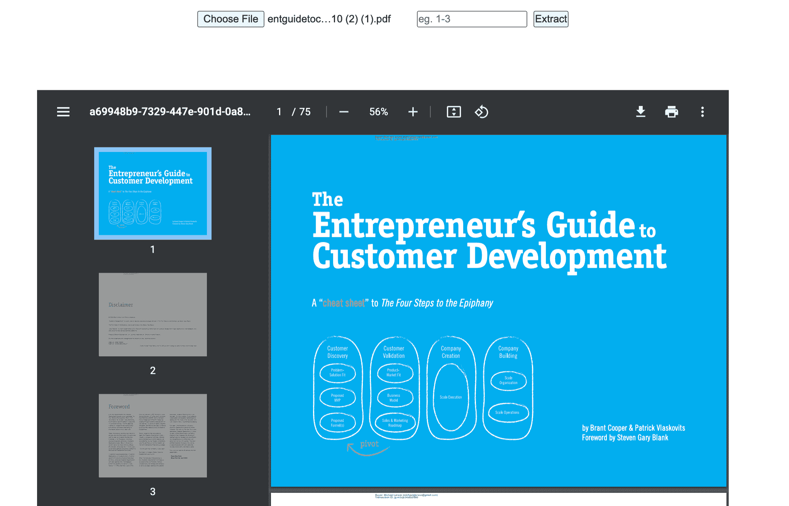

# 如何从 PDF 中提取页面并用 JavaScript 呈现它们

> 原文：<https://www.freecodecamp.org/news/extract-pdf-pages-render-with-javascript/>

PDF 代表可移植文档格式。pdf 是 Adobe 在 90 年代为 Windows 设计的。它们是独立的文档，支持几乎所有主要的操作系统。

但是有时你需要修改 PDF 来适应你的需要，而不仅仅是查看它。不幸的是，用于 pdf 的可用软件经常达不到您的特殊要求。

但你是程序员吧？为什么不做一些软件来帮助 PDF 按照你想要的那样工作呢？嗯，这就是这篇文章的灵感来源。

在本文中，我们将探索 JavaScript 中所有流行的 PDF 相关库。为什么是 JavaScript？因为它有一些相当不错的 PDF 包，人们喜欢它。尤其是我自己。

## 您将在本教程中构建的 PDF 查看器项目



A screenshot of the PDF viewer you'll build

这里有一个[的现场演示，演示你将在本教程中构建什么](https://hrishiksh.github.io/modify-pdf-fcc/)。

1.  首先，我们将探索一些流行的 PDF 包，用于 JavaScript 中与 PDF 相关的工作。然后我们会比较它们，找到最适合我们要求的包装。
2.  接下来，我们将加载一个现有的 PDF 并从中提取一些页面。提取的页面将生成一个新的 PDF 文档。
3.  然后，我们将在浏览器中渲染新的 PDF(我们在第二步中制作的)。
4.  最后，我们将下载新的 PDF 供以后使用。

这就是我们在这里要经历的所有步骤。我希望你看到结果会很兴奋。让我们开始吧。

## JavaScript 的 PDF 库

我在 JavaScript 中发现了两种主要类型的 PDF 库。一个用于 PDF 渲染，另一个用于 PDF 操作(或修改)。我在搜索了一个小时左右后找到了一堆 PDF 库，这些是我最好的选择。

这里列出的所有包都是免费的开源包。您可以在 npm 注册表中找到所有这些软件包。

### [pdfjs](https://mozilla.github.io/pdf.js)

这个软件包是由火狐浏览器背后的公司 Mozilla 制作的。pdfjs 是一个基于 web 标准的平台，用于解析和呈现 pdf。当您在 Firefox 中查看 PDF 时，PDF 查看器由这个 pdfjs 包组成。

这个包的核心优势是网页上的 PDF 呈现。此软件包的其他 PDF 修改功能非常有限。如果你想为你的站点制作一个自定义的 PDF 查看器，这可能就是你正在寻找的包。

pdfjs 有一个非常简单的 API。他们有很多入门图书馆的教程。如果你还不够服气，玩一段时间这个库，你一定会爱上它的。

### [pdf 库](https://pdf-lib.js.org/)

与之前的 pdfjs 包不同，pdf-lib 主要用于 pdf 的创建和操作。您可以根据自己的需要使用这个包动态生成一个新的 PDF 文档。

这个包对修改现有文档提供了强大的支持。你可以用这个库做很多 PDF 修改。例如，您可以进行 pdf 拆分和合并，您可以提取页面，注释 PDF 文档，添加大纲，以及许多您可以想象的事情。

它只有 JavaScript 作为依赖项。因此，它可以在任何有 JavaScript 运行时的设备上运行。浏览器、Nodejs、Deno、React Native 都很好的支持。如果您能设法在设备上安装 JavaScript，那么这个库肯定会工作。

pdf-lib 的主要缺点是它没有强大的渲染支持。如果你想用这个库制作一个很好的用户界面来浏览 pdf，那么 pdf-lib 不是你的正确选择。在这种情况下，您应该改用 pdfjs。

### [pdfjs](https://github.com/rkusa/pdfjs) #2

如果你认为我在重复我自己，那么我没有。这是一个用于创建 PDF 文档的 JavaScript 库。它有一个非常简单的 API。

我们之前讨论的 pdfjs 库在 UI 中有非常强的渲染支持，但是它缺乏 PDF 创建和修改功能。

但是这个库是为 PDF 创建而构建的。它有一个非常简单的 API，对初学者非常友好。可以和 pdf-lib 包对比一下。

这个 pdfjs 库的主要缺点是对现有文档修改的支持仍处于测试阶段。它并不总是工作，仍然是一个正在进行中的工作。

如果您主要关注的是 PDF 修改(例如，页面提取、合并、拆分、注释等等)，那么这个库可能不适合您。

如果贡献者能够让修改特性发挥作用，那么这可能是 JavaScript 的最佳 PDF 包。

### [js-pdf](https://parall.ax/products/jspdf)

不像上面列出的所有 PDF 包，这个库是一个完整的野兽。您可以使用此库执行任何与 PDF 相关的工作。这就像一个万金油图书馆。如果你想要一些复杂的 PDF 相关的东西，那么这个库可以做到。

但是 JavaScript 中有更好的包，非常适合单独的任务。例如，pdfjs 是比 js-pdf 更好的 PDF 呈现器，pdf-lib 比 js-pdf 具有更好的修改支持。

这里我不是在谈论实际的性能或其他类型的指标，我是在谈论开发人员的体验。我发现它的 API 不是很直观。对于一个初学者来说，第一眼看上去可能会感到不知所措。不过这是我的看法，也是我使用它时的体验。

PDF 生成是这个库的主要优势。您可以使用任何设计生成任何类型的 PDF。这个包裹将为你做所有的重活。如果你有经验，那么这可能是你最好的选择。

### [react-pdf](https://react-pdf.org/)

顾名思义，这个库专门研究 React 生态系统。这种用法非常敏感。您可以使用类似 JSX 的语法轻松创建文档。

您可以使用简单的 React 组件创建和显示 PDF 文档。但是功能非常有限。这个库主要用于 PDF 生成。

如果您的目标是向用户显示 PDF，那么您可以使用这个包。作为一个 React 爱好者，你会爱上这个图书馆。看看他们的游乐场，花点时间看看这个套餐。这样你就会知道你是否需要这个库。

## 为什么我们将在本教程中使用 pdf-lib

在上面提到的所有 PDF 库中，我将在本文中使用 pdf-lib。由于我们要分割和合并 PDF 页面，并在浏览器中呈现它们，pdf-lib 似乎是这种情况下的最佳选择。

此外，pdf-lib 有一个非常简单的 API，所有这些 API 都有很好的文档记录。如果使用的是 TypeScript，还可以得到类型推断，非常有帮助。

最后但同样重要的是，他们的例子非常好。您可以在几分钟内启动并运行。所以我喜欢这个库作为我的用例。

## 如何用 JavaScript 读取本地 PDF 文件

在对我们的 PDF 文档进行任何操作之前，我们必须从用户那里获得文档。在浏览器中读取任何文件都可以通过`FileReader` web API 来处理。

首先，我们将制作一个文件输入按钮，然后使用`FileReader` web API 处理上传的文件。

```
<input type="file" id="file-selector" accept=".pdf" onChange={onFileSelected} />
```

由于 Filereader API 支持回调，我发现 async/await 更简洁、更容易使用。因此，让我们创建一个 helper 函数来将 Filereader 回调修改为 async/await。

```
function readFileAsync(file) {
    return new Promise((resolve, reject) => {
      let reader = new FileReader();
      reader.onload = () => {
        resolve(reader.result);
      };
      reader.onerror = reject;
      reader.readAsArrayBuffer(file);
    });
  }
```

现在，当用户使用之前的文件输入上传文件时，我们监听文件输入事件，然后使用这个`readFileAsync`函数读取文件。

该逻辑的实现如下所示:

```
const onFileSelected = async (e) => {
    const fileList = e.target.files;
    if (fileList?.length > 0) {
      const pdfArrayBuffer = await readFileAsync(fileList[0]);
    }
  };
```

## 如何提取 PDF 页面

至此，我们的 PDF 被上传并转换成 JavaScript `ArrayBuffer`。当我们从 PDF 中提取一定范围的页面时，我们需要一个包含这些 PDF 页码的数组。

在 JavaScript 中，生成自然数数组并不难。所以我们制作了一个名为`range()`的函数来生成我们想要的所有索引。

我们必须提供起始页码和结束页码，然后这个`range()`函数可以生成一个具有适当页码的数组。

```
function range(start, end) {
	let length = end - start + 1;
	return Array.from({ length }, (_, i) => start + i - 1);
} 
```

这里我们在末尾加-1。你知道原因吗？是–在编程中，索引从 0 开始，而不是从 1 开始。所以我们必须从每个页码中减去-1 才能得到我们想要的行为。

现在让我们开始本文的主要部分:提取。在做任何工作之前，导入 pdf-lib 库。

```
import { PDFDocument } from "pdf-lib"; 
```

首先，我们加载从前面的`onFileSelected`函数中得到的 PDF `ArrayBuffer`。然后我们将`ArrayBuffer`加载到`PDFDocument.load(arraybuffer)`函数中。这是我们用户提供的 PDF。为了方便起见，我们称它为`pdfSrcDoc`。

现在我们将创建一个新的 PDF。从用户提供的文档中提取的所有 PDF 页面都将合并到新文档中。我们使用`PDFDocument.create()`函数来完成这项工作。为了方便使用，我们称之为`pdfNewDoc`。

之后，我们通过使用`copyPages()`函数将我们想要的页面从`pdfSrcDoc`复制到`pdfNewDoc`中。然后我们将复制的页面添加到`pdfNewDoc`。

要保存更改，运行`pdfNewDoc.save()`。让我们创建一个名为`extractPdfPage()`的函数来重用逻辑。函数内部的代码如下所示:

```
async function extractPdfPage(arrayBuff) {
    const pdfSrcDoc = await PDFDocument.load(arrayBuff);
    const pdfNewDoc = await PDFDocument.create();
    const pages = await pdfNewDoc.copyPages(pdfSrcDoc,range(2,3));
    pages.forEach(page=>pdfNewDoc.addPage(page));
    const newpdf= await pdfNewDoc.save();
    return newpdf;
  }
```

我们从`extractPdfPage()`函数返回一个`Uint8Array`。

## 如何在浏览器中呈现 PDF

到目前为止，我们已经有了一个修改过的 PDF。为了在你的浏览器中渲染它，我们必须把它转换成一个 Blob。

然后我们将把它做成一个 URL，并在 iframe 中呈现它。

您也可以使用我上面提到的 pdfjs 库创建您的自定义 PDF 查看器。但是，如果你不需要这样的品牌和定制，浏览器的默认 PDF 浏览器就可以了。

```
function renderPdf(uint8array) {
    const tempblob = new Blob([uint8array], {
      type: "application/pdf",
    });
    const docUrl = URL.createObjectURL(tempblob);
    setPdfFileData(docUrl);
  }
```

现在，您可以轻松地在一个`iframe`中呈现这个从`renderPdf()`函数返回的 docUrl。

## 完整的代码示例

我在本教程中使用 Next.js。如果您使用其他框架或普通的 JavaScript，结果将是相似的。以下是这个项目的所有代码:

```
import { useState } from "react";
import { PDFDocument } from "pdf-lib";

export default function Home() {
  const [pdfFileData, setPdfFileData] = useState();

  function readFileAsync(file) {
    return new Promise((resolve, reject) => {
      let reader = new FileReader();
      reader.onload = () => {
        resolve(reader.result);
      };
      reader.onerror = reject;
      reader.readAsArrayBuffer(file);
    });
  }

  function renderPdf(uint8array) {
    const tempblob = new Blob([uint8array], {
      type: "application/pdf",
    });
    const docUrl = URL.createObjectURL(tempblob);
    setPdfFileData(docUrl);
  }

  function range(start, end) {
    let length = end - start + 1;
    return Array.from({ length }, (_, i) => start + i - 1);
  }

  async function extractPdfPage(arrayBuff) {
    const pdfSrcDoc = await PDFDocument.load(arrayBuff);
    const pdfNewDoc = await PDFDocument.create();
    const pages = await pdfNewDoc.copyPages(pdfSrcDoc, range(2, 3));
    pages.forEach((page) => pdfNewDoc.addPage(page));
    const newpdf = await pdfNewDoc.save();
    return newpdf;
  }

  // Execute when user select a file
  const onFileSelected = async (e) => {
    const fileList = e.target.files;
    if (fileList?.length > 0) {
      const pdfArrayBuffer = await readFileAsync(fileList[0]);
      const newPdfDoc = await extractPdfPage(pdfArrayBuffer);
      renderPdf(newPdfDoc);
    }
  };

  return (
    <>
      <h1>Hello world</h1>
      <input
        type="file"
        id="file-selector"
        accept=".pdf"
        onChange={onFileSelected}
      />
      <iframe
        style={{ display: "block", width: "100vw", height: "90vh" }}
        title="PdfFrame"
        src={pdfFileData}
        frameborder="0"
        type="application/pdf"
      ></iframe>
    </>
  );
} 
```

您现在可以使用 PDF 查看器上的下载按钮保存生成的 PDF。

## 从这里去哪里

在这篇文章中，我只是触及了冰山一角。如果你想使用 pdf，并想从中获得一些东西，那么 pdf-lib 是一个非常强大的库。

您可以将两个 PDF 合并为一个，可以旋转页面，或者从 PDF 中删除一些页面。这些只是一些例子——可能性是无限的。

如果您想将 Next.js 应用程序部署到 Cloudflare pages，[这是您应该查看的文章](https://hrishikeshpathak.com/blog/deploy-nextjs-cloudflare-pages)。

做点什么吧。做一些有创意的东西，并在推特上展示给我看。

## 结论

如果你一直读到现在，我非常感激。感觉就像是我在制作世界另一端的人会阅读的内容。请与您的编码朋友分享。

您是否要为您的 PDF 文档添加大纲？我知道这是一项非常艰巨的任务。我经历了很多痛苦，才使用 JavaScript 在 PDF 文档中添加了这个特性。你感兴趣吗？那是未来的故事。

祝你愉快。