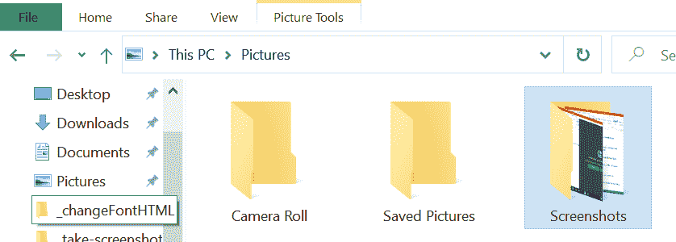
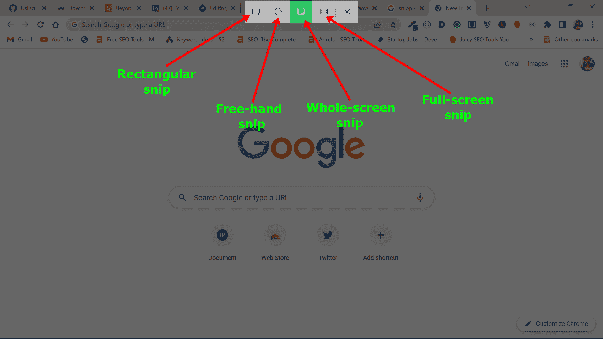
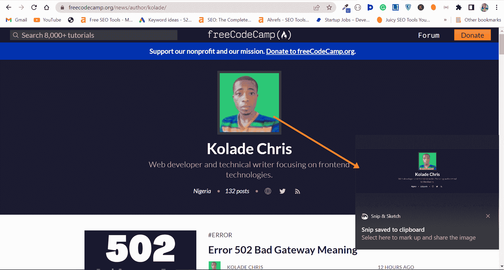
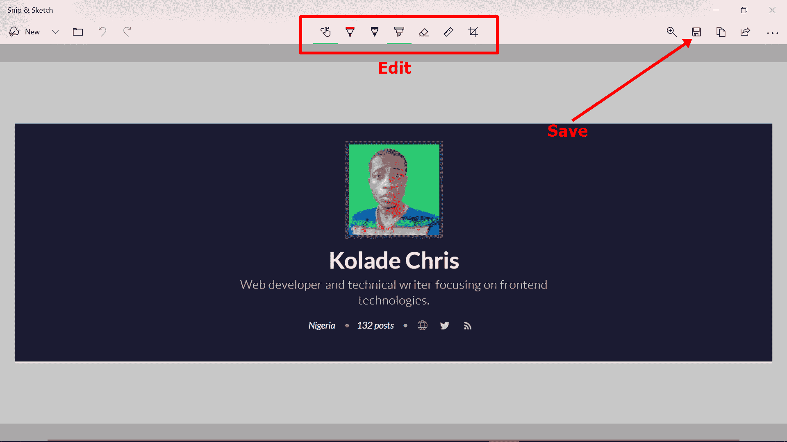
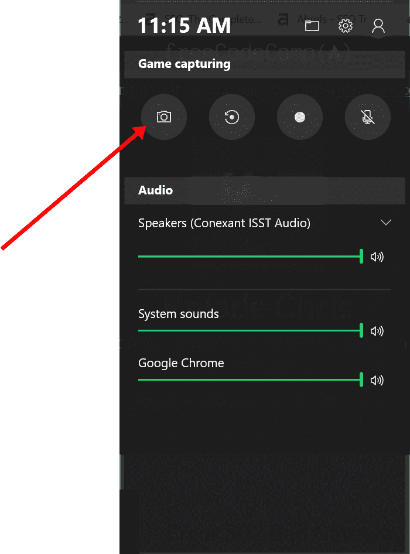
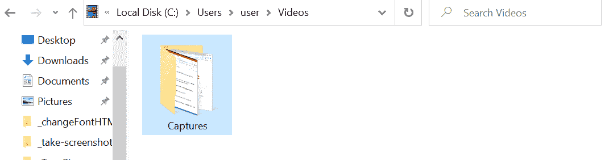
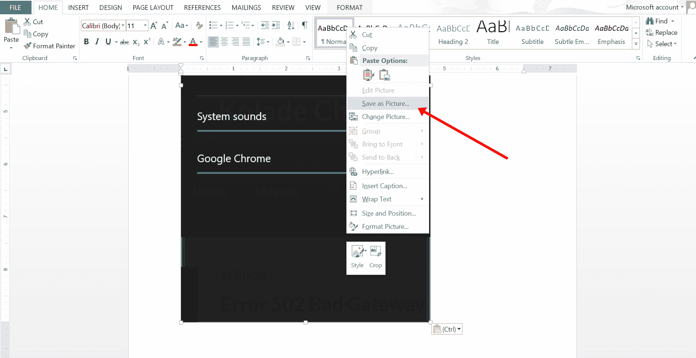

# 如何在 Windows 上截屏–在 PC 上截屏

> 原文：<https://www.freecodecamp.org/news/how-to-screenshot-on-windows-take-a-screen-shot-on-pc/>

就像你可以在手机上截图一样，你也可以在 Windows 电脑上截图。

无论您是想对屏幕的某个特定部分进行截图，还是想对整个屏幕进行截图，都有工具和键盘组合可供您使用。

在这篇文章中，我将展示 4 种在 Windows PC 上截图的方法。

我还将向您展示一个我已经用了很长时间的技巧来用 Microsoft Word 进行截图，直到我发现了更好的方法。

## 我们将涵盖的内容

*   [如何用 Windows 和 PrintScreen ( `PrtScn`)键截图](#howtotakescreenshotswithwindowsandprintscreenprtscnkeys)
*   [如何用截图工具截图](#howtotakescreenshotswiththesnippingtool)
*   [如何用微软人体工程学键盘截图](#howtotakescreenshotswiththemicrosoftergonomickeyboard)
*   [如何用游戏条截图](#howtotakescreenshotswiththegamebar)
*   [如何用 PrintScreen ( `PrtScn`)键和 MS Word(窍门)](#howtotakescreenshotswiththeprintscreenprtscnkeyandmswordthetrick)截图
*   [结论](#conclusion)

## 如何用 Windows 和 PrintScreen ( `PrtScn`)键截图

按住`WIN` (Windows logo 键)并按下打印屏幕键(`PrtScn`)可以对你的整个屏幕进行截图。

您的屏幕会稍微变暗，这表明您刚刚进行了截图。

你可以在你的图片文件夹(`C:\Users\user\Pictures\Screenshots`)的截图子文件夹里找到截图。

下面是我的:

## 如何用截图工具截图

截图工具是一个微软实用程序，用于截图。从 Windows 7 开始就有了。

用截图工具截图，按住`WIN` (Windows logo 键)和`SHIFT`，然后按`S`。

然后你的屏幕会变暗，让你进入一个屏幕，在那里你可以选择你想要的截图类型。

截图后会弹出通知。

单击通知框以访问截取工具 UI。

在 UI 中，您可以进行更改并将其保存到您喜欢的任何文件夹中。

## 如何用微软人体工程学键盘截图

Microsoft 人体工程学键盘有一个键，使用该键可以访问 Microsoft snipping 工具。

有了键，就不需要像之前截图的方法一样按 WIN + SHIFT + S 了。

按键，拍摄您的屏幕截图，如果需要，可以编辑屏幕截图，然后保存。

## 如何用游戏杆截图

微软游戏栏是另一个记录屏幕和截图的工具。

要访问游戏栏，请按`WIN` (Windows 徽标键)+ `G`。

点击截图。

您将在您的视频文件夹(`C:\Users\user\Videos\Captures`)的 Captures 子文件夹下看到截图。

下面是我的:

## 如何用 PrintScreen ( `PrtScn`)键和 MS Word 截图(窍门)

使用 print screen 键拍摄截图会将截图保存在剪贴板中。想把截图保存在电脑上怎么办？

为此，按下`PrtScn`键并打开 Microsoft Word。

按`CTRL` + `V`粘贴截图。

右击截图，点击“另存为图片”。

## 结论

我希望这篇文章能帮助你在 Windows PC 上截屏。

如果你觉得这篇文章有帮助，你可以分享给你的朋友和家人。

感谢您的阅读。