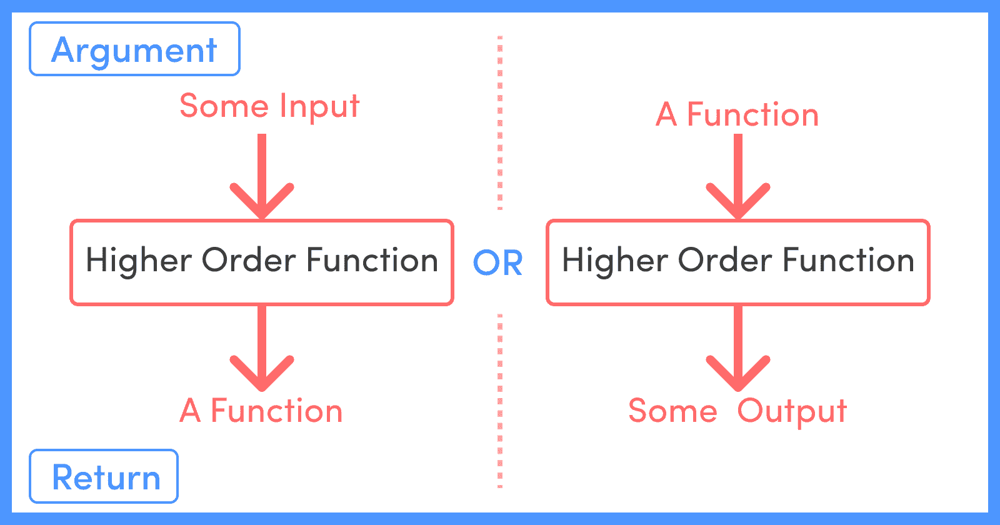

# JavaScript 中的高阶函数——初学者指南

> 原文：<https://www.freecodecamp.org/news/higher-order-functions-in-javascript/>

在 JavaScript 中，函数被视为一等公民。我们可以将函数视为值，并将它们赋给另一个变量，将它们作为参数传递给另一个函数，甚至从另一个函数返回它们。

函数充当一级函数的这种能力是 JavaScript 中高阶函数的优势。

基本上，将另一个函数作为参数或返回一个函数的函数称为高阶函数。



让我们深入了解一下这两种类型的实现，即:

*   将一个函数作为参数传递给另一个函数
*   从另一个函数返回一个函数


## 如何将一个函数作为参数传递给另一个函数

在这一节中，我们将看到如何将函数作为参数发送，以及最终它如何帮助我们编写更简洁的代码。

考虑下面的代码，我们想在其中创建一个接受数组作为参数的函数。它从中过滤出所有奇数，并返回所有过滤出的数字。

该函数将类似于以下内容:

```
const arr = [1, 2, 3, 4, 5, 6, 7, 8, 9, 10, 11];

function filterOdd(arr) {
  const filteredArr = [];
  for (let i = 0; i < arr.length; i++) {
    if (arr[i] % 2 !== 0) {
      filteredArr.push(arr[i]);
    }
  }
  return filteredArr;
}
console.log(filterOdd(arr));

// Output:
// [ 1, 3, 5, 7, 9, 11 ] 
```

上面的函数返回过滤后的数组`[ 1, 3, 5, 7, 9, 11 ]`,其中包含所有的奇数，正如我们所料。

现在，假设我们还想创建一个函数，过滤并返回所有偶数。我们完全可以创建以下函数来实现这一点:

```
function filterEven(arr) {
  const filteredArr = [];
  for (let i = 0; i < arr.length; i++) {
    if (arr[i] % 2 == 0) {
      filteredArr.push(arr[i]);
    }
  }
  return filteredArr;
}
console.log(filterEven(arr));

// Output:
// [ 2, 4, 6, 8, 10 ] 
```

同样，正如预期的那样，我们将得到一个包含所有偶数的数组的期望输出-`[ 2, 4, 6, 8, 10 ]`。

但是请注意，我们用这种方法编写了大量重复的代码。上面的两个函数做了很多共同的事情，比如接受原始数组，创建一个新数组来存储过滤后的数组，遍历整个主数组，最后返回过滤后的数组。

这两个函数之间唯一的区别是它们用来过滤原始数组的逻辑。

对于函数`filterOdd`，我们使用逻辑`arr[i] % 2 !== 0`，而在`filterEven`函数中，我们使用逻辑`arr[i] % 2 == 0`来过滤掉原始数组。

这就是我们可以从使用高阶函数中获益的地方。主要目的是创建一个函数来完成我们在上面两个函数中所做的所有常见工作，并将逻辑部分作为参数单独传递给这个函数。让我们看看如何实现这一点。

让我们创建一个函数，它执行我们在`filterOdd`和`filterEven`函数中执行的所有常见内容。这将是这样的:

```
function filterFunction(arr, callback) {
  const filteredArr = [];
  for (let i = 0; i < arr.length; i++) {
    callback(arr[i]) ? filteredArr.push(arr[i]) : null;
  }
  return filteredArr;
} 
```

暂时忽略`callback`参数。请注意，在新的`filterFuntion`中，我们保留了所有的通用步骤，即接受原始数组，创建一个新数组来存储过滤后的数组，遍历整个主数组，最后返回我们在`filterOdd`和`filterEven`函数中执行的过滤后的数组。

现在，`callback`参数基本上接受了逻辑，这将是另一个包含过滤逻辑的函数。为了分别过滤奇数和偶数，我们需要编写以下逻辑函数:

```
// Function containing logic for filtering out odd numbers

function isOdd(x) {
  return x % 2 != 0;
}

// Function containing logic for filtering out even numbers

function isEven(x) {
  return x % 2 === 0;
} 
```

就是这样！我们现在只需要将主数组和逻辑函数传递给我们的`filterFunction`,如下所示:

```
// For filtering out odd numbers

filterFunction(arr, isOdd)
// Output of console.log(filterFunction(arr, isOdd)):
// [ 1, 3, 5, 7, 9, 11 ]

// For filtering out even numbers

filterFunction(arr, isEven)
// Output of console.log(filterFunction(arr, isEven)):
// [ 2, 4, 6, 8, 10 ] 
```

这样，我们将像`isOdd`或`isEven`这样的逻辑函数作为参数传递给另一个函数`filterFunction`。

我们基本上是从主函数中抽象出主过滤逻辑。我们现在可以传递任何其他过滤逻辑到`filterFunction`，而不需要改变它。

例如，如果我们想过滤掉一个大于 5 的数字，那么我们只需要编写下面的过滤逻辑:

```
function isGreaterThanFive(x) {
  return x > 5;
} 
```

并将其作为参数传递给`filterFunction`:

```
filterFunction(arr, isGreaterThanFive)

// Output of console.log(filterFunction(arr, isGreaterThanFive)):
// [ 6, 7, 8, 9, 10, 11 ] 
```

我们也可以将逻辑函数作为箭头函数传递，得到相同的结果——也就是说，传递`(x) => x > 5)`代替`isGreaterThanFive`会得到相同的结果。

```
filterFunction(arr, (x) => x > 5)

// Output of console.log(filterFunction(arr, (x) => x > 5)):
// [ 6, 7, 8, 9, 10, 11 ] 
```

### 如何创建聚合填充

我们知道 JavaScript 为我们提供了一些内置的高阶函数，比如`map()`、`filter()`、`reduce()`等等。我们能重新创建我们自己的这些函数的实现吗？让我们再深入一点。

我们已经在上一节中创建了过滤函数。让我们创建一个`filterFunction`函数的数组原型，这样我们就可以在任何数组中使用它。这将看起来像这样:

```
Array.prototype.filterFunction = function (callback) {
  const filteredArr = [];
  for (let i = 0; i < this.length; i++) {
    callback(this[i]) ? filteredArr.push(this[i]) : null;
  }
  return filteredArr;
}; 
```

在上面的代码中，`this`指的是原型被调用的数组。所以如果我们写下这样的话:

```
const arr = [1, 2, 3, 4, 5]
arr.filterFunction(callbackFn) 
```

那么`this`将引用数组`arr`。

现在我们可以使用`filterFunction`了，就像我们使用 JS 中内置的`filter()`函数一样。我们可以这样写:

```
arr.filterFunction(isEven) 
```

这类似于调用内置的`filter()`函数:

```
arr.filter(isEven) 
```

上述两个函数调用(即`arr.filterFunction(isEven)`和`arr.filter(isEven)`)将给出相同的输出，就像`[ 2, 4, 6, 8, 10 ]`。

类似地，我们也可以在原型实现中传递一个箭头函数，因为我们可以传递内置的`filter()`函数。

```
// I
arr.filterFunction((x) => x % 2 != 0)
arr.filter((x) => x % 2 != 0)
// both give the same output on console.log: [ 1, 3, 5, 7, 9, 11 ]

// II
arr.filterFunction((x) => x > 5)
arr.filter((x) => x > 5)
// both give the same output on console.log: [ 6, 7, 8, 9, 10, 11 ] 
```

在某种程度上，我们为内置的`filter()`函数编写了一个 polyfill。

### 函数链接

我们还可以用原型实现实现函数链，就像我们可以用内置的`filter()`函数一样。我们先过滤掉所有大于 5 的数字。然后从结果中，我们会过滤掉所有偶数。它看起来会像这样:

```
// Using our own filterFunction() prototype implementation
arr.filterFunction((x) => x > 5).filterFunction((x) => x % 2 === 0)

//Using the inbuilt filter() implementation
arr.filter((x) => x > 5).filter((x) => x % 2 === 0)

// both give the same output on console.log: [ 6, 8, 10 ] 
```

这就是我们如何在 JS 中使用高阶函数来编写模块化、更简洁、更易维护的代码。

接下来，让我们看看如何从另一个函数返回一个函数。


## 如何在 JavaScript 中从另一个函数返回一个函数

我们可以从另一个函数返回一个函数，因为我们在 JavaScript 中将函数视为值。让我们通过一个例子来看这个问题:

```
function calculate(operation) {
  switch (operation) {
    case "ADD":
      return function (a, b) {
        console.log(`${a} + ${b} = ${a + b}`);
      };
    case "SUBTRACT":
      return function (a, b) {
        console.log(`${a} - ${b} = ${a - b}`);
      };
  }
} 
```

在上面的代码中，当我们用一个参数调用函数`calculate`时，它打开这个参数，然后最终返回一个匿名函数。因此，如果我们调用函数`calculate()`并将其结果存储在一个变量中，然后控制台记录它，我们将得到以下输出:

```
const calculateAdd = calculate("ADD");
console.log(calculateAdd);

// Output: 
// [Function (anonymous)] 
```

你可以看到`calculateAdd`包含了一个匿名函数，这个匿名函数是由`calculate()`函数返回的。

有两种方法可以调用这个内部函数，我们现在来探讨一下。

### 使用变量调用返回的函数

在这个方法中，我们将返回函数存储在一个变量中，如上所示，然后调用该变量来调用内部函数。

让我们看看它的代码:

```
const calculateAdd = calculate("ADD");
calculateAdd(2, 3);
// Output: 2 + 3 = 5

const calculateSubtract = calculate("SUBTRACT");
calculateSubtract(2, 3);
// Output: 2 - 3 = -1 
```

我们在这里做了什么？

*   我们调用了`calculate()`函数，并将`ADD`作为参数传递
*   我们将返回的匿名函数存储在`calculateAdd`变量中，并且
*   我们通过调用带有所需参数的`calculateAdd()`来调用内部返回函数。

### 使用双括号调用返回的函数

这是一种非常复杂的调用内部返回函数的方式。我们在这个方法中使用了双括号`()()`。

让我们看看它的代码:

```
calculate("ADD")(2, 3);
// Output: 2 + 3 = 5

calculate("SUBTRACT")(2, 3);
// Output: 2 - 3 = -1 
```

你可以用类似于上面链接例子的方式来思考这个问题。只是我们没有链接函数，而是链接参数。

第一个括号中的参数属于外部函数，而第二个括号中的参数属于内部返回函数。

如前所述,`calculate()`方法返回一个函数，并且使用第二个括号立即调用返回的函数。

正如我上面提到的，这是一种非常复杂的调用函数的方式。但是一旦你掌握了窍门，它就变得...很自然。

我们可以在`redux`状态管理库中的`connect`方法中看到这种双括号符号。你可以在这里阅读更多关于`connect`。

## 摘要

在本文中，我们了解到:

*   为什么函数在 JS 中被称为一等公民
*   什么是高阶函数
*   如何将一个函数作为参数传递给另一个函数
*   如何创建一个数组原型，函数链接，为内置的 filter()方法编写我们自己的 polyfill
*   如何从一个函数返回另一个函数以及调用返回函数的不同方法

## 包裹

感谢阅读！我真的希望这篇关于高阶函数的文章对你有用。更多精彩内容敬请期待。安静点。🖖

## 社会联系

*   [LinkedIn](https://www.linkedin.com/feed/)
*   [网站](https://www.sohamderoy.dev/)
*   [博客网站](https://blog.sohamderoy.dev/)

