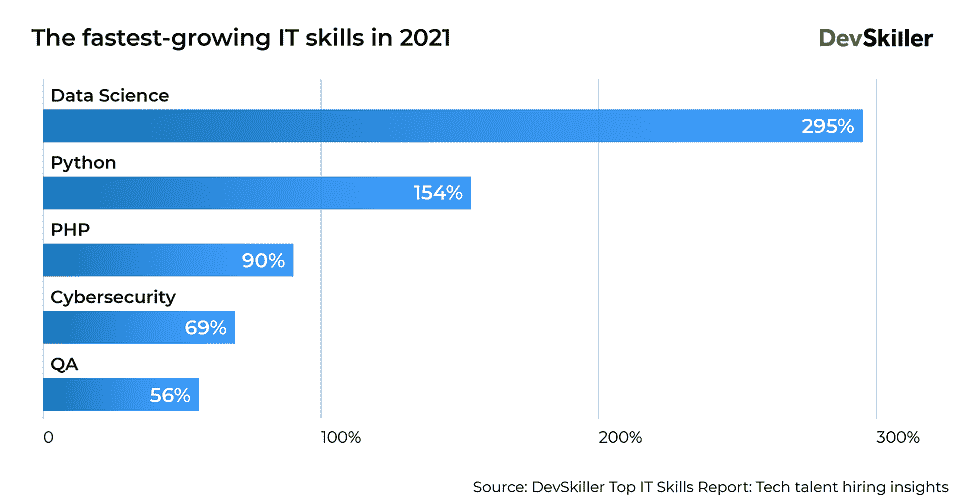
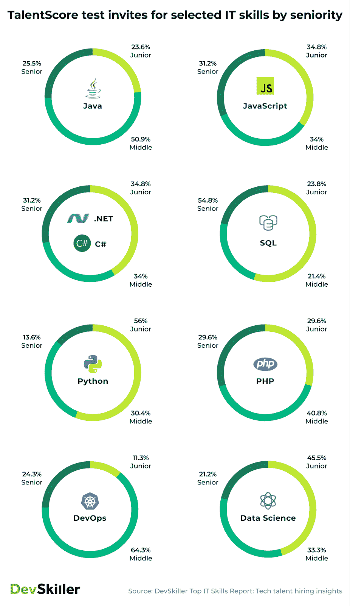
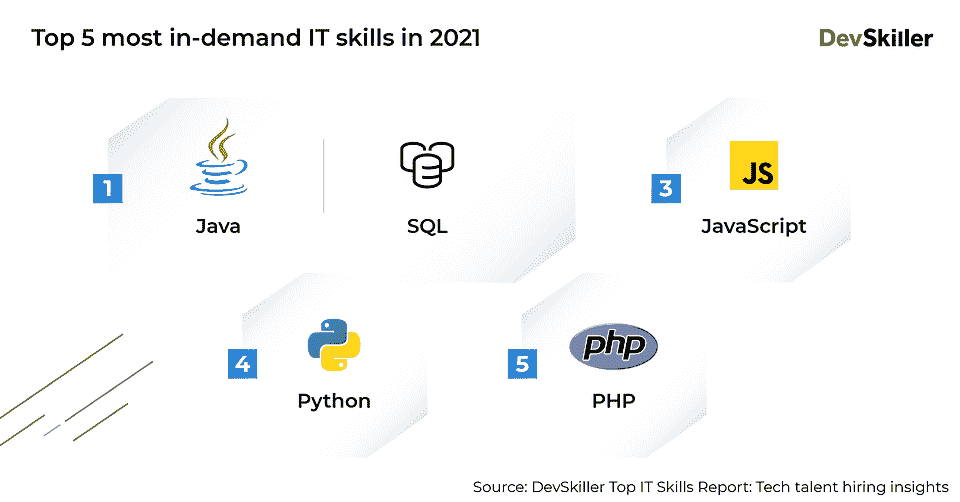
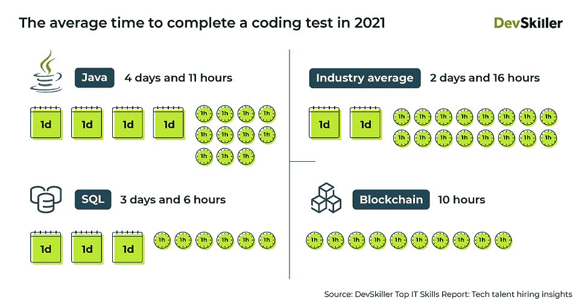
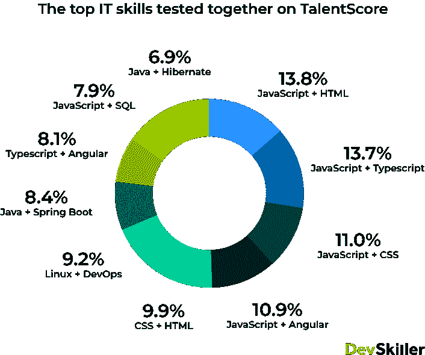

# 2022 年技术技能需求——从 191 个国家的候选数据中吸取的经验教训

> 原文：<https://www.freecodecamp.org/news/in-demand-tech-skills-devskiller-report/>

一句流行的中国谚语说:“种植一棵树的最佳时间是 20 年前。第二好的时机就是现在。”

这同样适用于获取新的技术技能。无论你是初级开发人员还是经验丰富的软件工程师，总有你可以改进和提高的地方。

但是，你如何选择这个可能有助于你在 IT 行业发展的“东西”呢？面对大量的在线课程和雇主要求的新 IT 技能，你很容易感到眩晕。

不要担心——DevSkiller 将根据我们的顶级 IT 技能报告的 [2022 版的调查结果，提供有数据支持的见解。我们通过分析来自 191 个国家的成千上万的编码测试得出了这些见解，这些测试是由招聘 IT 相关职位的公司通过我们的 TalentScore 技术筛选解决方案发送给候选人的。](https://go.devskiller.com/it-skills-2022-freecodecamp)

基于我们的专有数据，我们已经编制了一套有用的学习技巧。这要看你以后希望得到什么工作。

明智地选择，记住 IT 行业不仅在等待经验丰富的开发人员，也在等待新手。来自 DevSkiller 平台的数据显示，大约 40%的技术测试邀请是针对初级开发人员的。

## 如果你想和市场一起成长

你可能听说过“数据是新的石油”。但只有少数大型科技公司知道如何提取和加工这种“石油”，以便能够为他们的业务提供燃料。

这导致就业市场对数据相关职位的需求不断增加，如数据科学家、数据分析师或数据工程师。

如果在一组结构化的表格或图表中组织随机数的想法让你很感兴趣，那么与数据相关的角色可能很适合你。

请记住，数据相关职位的市场并不像你可能期望创建的仪表盘那样结构化。随着市场的发展和变得更加成熟，你可能会学到我们现在甚至无法想象的新技能。

话虽如此，这种灵活性和渴望学习的回报可能是巨大的。

根据最新一期 DevSkiller 报告的观点，数据科学在未来热门 IT 技能排名中名列前茅。2021 年，该地区招聘任务的受欢迎程度同比增长了 295%。

## 如果你想尽快进入 IT 人才市场

另一个关于未来热门 IT 技能的大事件是 Python。但是这种需求并不是你选择学习编程语言的唯一优势。

我们为顶级 IT 技能报告汇编的数据显示，Python——初级职位的测试邀请比例为 54%——是刚开始 IT 行业职业生涯的开发人员中最受欢迎的技术。

鉴于 Python 与其他编程语言相比相对容易学习的事实，它可能是加速你进入 it 就业市场的完美选择。请记住，最快的方法并不总是最令人满意的。

## 如果你想在大公司工作

试图在就业市场上找到自己的位置就像开车一样。有些人喜欢开快车，快速到达目的地，但有些人喜欢缓慢但安全地前进。

如果你属于后者，你应该考虑学习一门最成熟和流行的编程语言，比如 Java 或 SQL。这能帮你在一家大公司找到工作。这可能没有为一个很酷的不断变化的创业公司工作那么令人兴奋，但它会给你提供一定程度的稳定性和安全性，你可能会觉得很有吸引力。

根据 DevSkiller TalentScore 的数据显示，Java 和 SQL 都是招聘公司最需要的 IT 技能。技术招聘人员通过我们的平台发出的编码测试邀请中，有 19%都使用了这些语言。

值得一提的是，市场上似乎缺乏这些技能。根据我们报告中的见解，与其他技术专家相比，Java 和 SQL 开发人员等待完成编码测试的时间最长。

这一趋势背后的原因之一是，招聘池很浅，各公司都在争夺同一批有限的候选人。

2021 年，被招聘的候选人提交 Java 编码测试的平均时间为 4 天 11 小时，而 SQL 的平均时间为 3 天 6 小时。2021 年，所有语言的行业平均时间为 2 天 16 小时。

## 如果你想释放你的创造力

你认为自己是一个有创造力的人吗？不仅关心事物如何工作，也关心它们看起来如何？如果是这样的话，你应该考虑从事前端开发人员的职业。

也许你不会像平面设计师一样享受那么多的艺术自由，但请放心，如果你用实用的编码技能来补充你对美学的偏见，你会找到一份你喜欢的工作。

如果这听起来对你有吸引力，请记住前端开发不再仅仅是 HTML 或任何一种语言。在任何给定的项目中，您可能需要能够浏览至少两种技术。

从我们的报告中发现，如今招聘公司测试的 5 种最常见的配对 IT 技能是 JavaScript 和 HTML、JavaScript 和 TypeScript、JavaScript 和 CSS、JavaScript 和 Angular 以及 CSS 和 HTML。

## 如果你不想编码(或者只是一点点)

鉴于低代码/无代码平台和工具越来越受欢迎，你不再需要成为一名成熟的软件工程师来获得一份 IT 工作。

当然，在这个行业中，你总是被期望拥有一定水平的计算机知识，并且理解软件开发的关键概念。但是你不再需要为了成为雇主的一个有吸引力的候选人而实际编码。

低代码/无代码越来越受欢迎，这反映在 DevSkiller TalentScore 上检查 Salesforce 相关技能的测试数量的动态增长上。自 2020 年以来，它已经增长了 1300%，以满足我们客户的需求，也就是招聘公司的需求。

请记住，Salesforce 只是你的潜在雇主使用的众多低代码/无代码平台之一。

## 如果你想帮助别人进入 IT 行业

最后但同样重要的是，也许在仔细考虑你的技能和偏好后，你会发现你更喜欢与人打交道，每天解决技术问题不适合你。或者你可能已经厌倦了现在的工作，想要尝试一些新的东西。

不要担心，IT 行业不仅仅是 0 和 1，还有很多不需要学习编码技能的选择可以让你得到你梦想的工作。

其中一个与帮助他人找到一份非常合适的工作有关——也就是成为一名科技招聘人员。

如果这听起来很合适，你可以通过获得行业认可的[DevSkiller Tech recruiting Certification](https://devskiller.com/devskiller-tech-recruitment-certification-course/)开始朝这个方向发展。尽管乍看起来并不难，但我们的数据显示，只有 61%的用户在第一次尝试时通过了我们的认证考试。

## 数字技能差距对你有利

随着软件蚕食世界已经有一段时间了，IT 行业已经成为全球经济中就业机会增长的主要驱动力之一。

仅在欧盟，IT 专家的供需缺口估计为[至少 50 万个职位空缺](http://ec.europa.eu/newsroom/document.cfm?doc_id=45188)。这还不包括所有与 IT 相关的职位，比如科技招聘人员和其他需要一定程度数字技能的职位。

所以，如果你在犹豫你的提升技能或重新获得技能的努力是否会给你带来回报，答案是:是的。你获得加薪或跳槽到收入更高的工作的可能性接近 100%。最坏的情况？你会在学习新事物中找到快乐。

毕竟，编码很有趣。