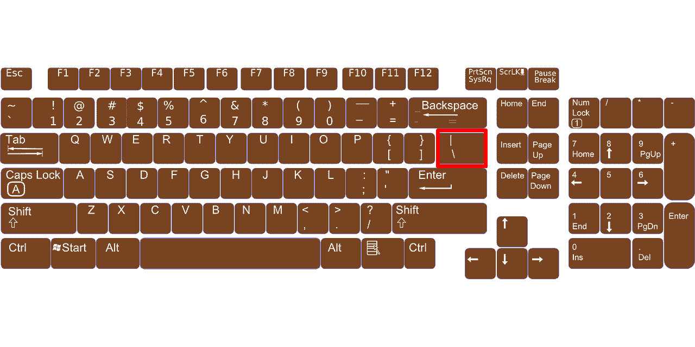
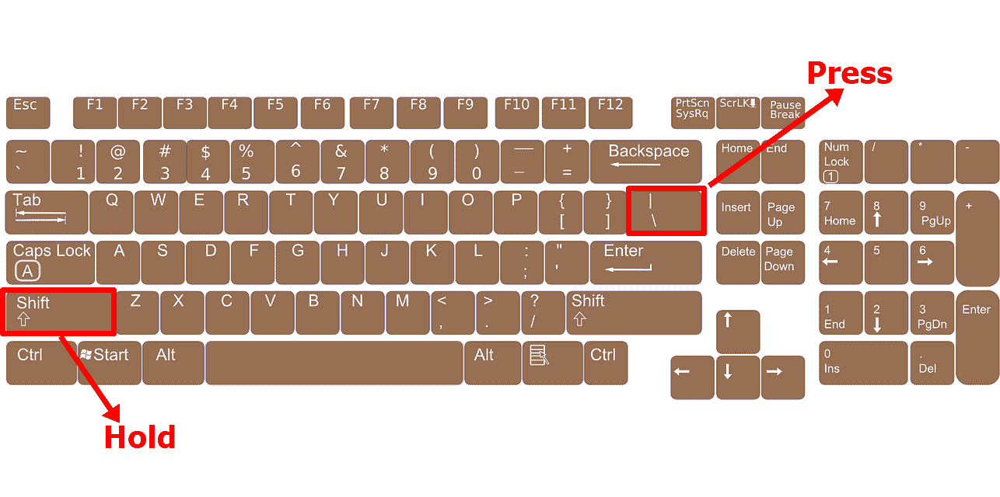
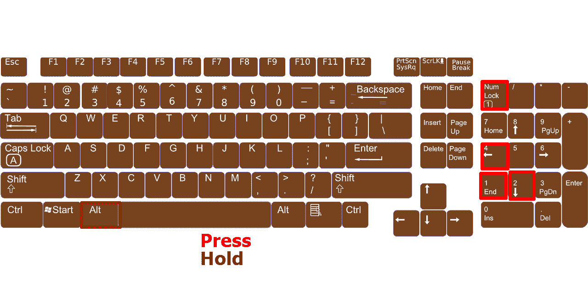

# 如何在键盘上键入竖线|竖线字符

> 原文：<https://www.freecodecamp.org/news/how-to-type-the-vertical-line-bar-character-on-a-keyboard/>

我们在各种场景和上下文中使用竖线字符|。你将在数学和编程、Linux 和计算机科学领域中使用它来表示不同的事物。

程序员也称这个字符为管道符号。

## 管道字符是用来做什么的？

在数学中，双管(||)表示一条线与另一条线平行。比如 A || C。

在 Linux 中，您可以使用它来组合您想要一起执行的命令。

在许多编程语言中，我们使用管道字符作为 OR 运算符，这通常意味着其中一个语句必须为真。

例如，在 JavaScript 中，我们像这样使用管道字符:

```
let score1 = 25
let score2 = 35

console.log(score1 === 25 || score2 === 26)
// true 
```

您可能想知道如何在键盘上键入垂直线(管道字符)。这就是我将在本文中向您展示的内容。

## 如何在键盘上键入竖线字符？

竖线字符不会隐藏在键盘上。它位于回车键的正上方。


但是如果你键入那个键，你得到的是一个反斜杠。所以，要输入它，你得按住`SHIFT`，然后按下反斜杠键:


另一种键入竖线字符的方法是打开数字键盘，按住`ALT`，然后按 1、2 和 4。


现在您知道如何在键盘上键入竖线或竖线字符，并且您可以在数学或编程任务中使用它。

感谢您的阅读。