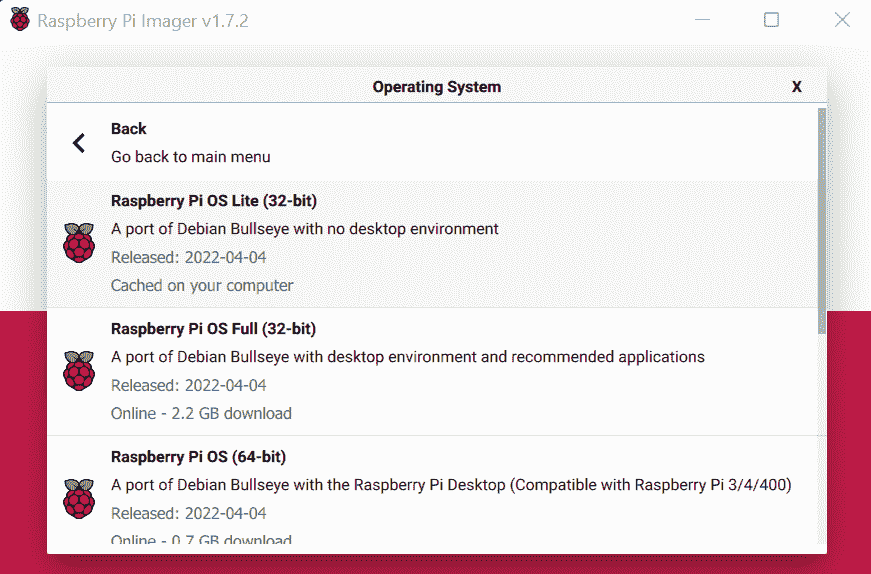
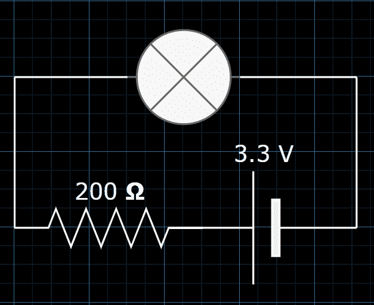
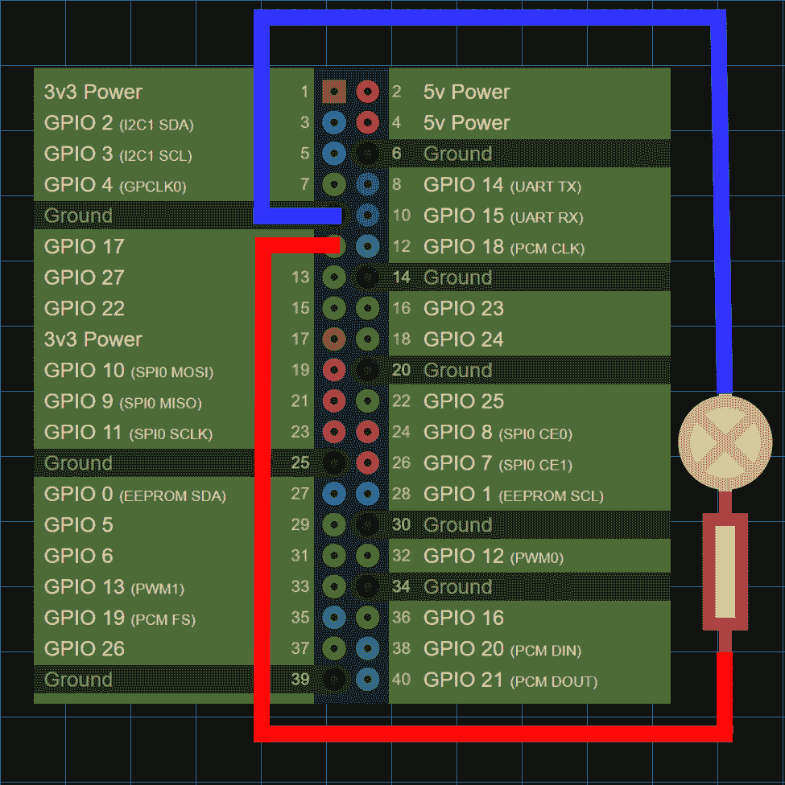
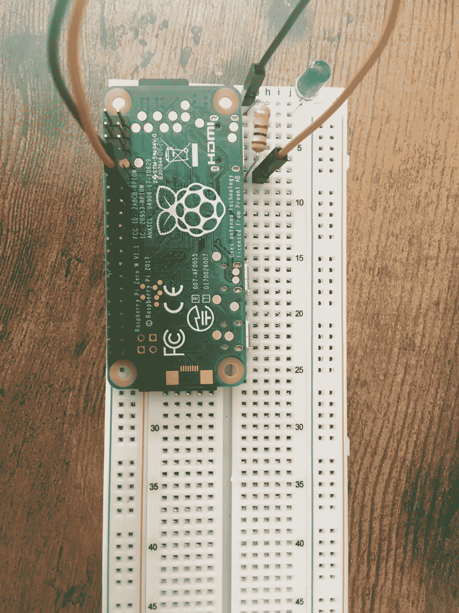

# Raspberry Pi Zero W 上的嵌入式 Rust 编程

> 原文：<https://www.freecodecamp.org/news/embedded-rust-programming-on-raspberry-pi-zero-w/>

Rust 中的嵌入式编程需要一个全新的知识库。使用 Raspberry Pi Zero W，您可以快速启动并运行嵌入式 Rust。

从一个嵌入式的*“Hello World”*等价物开始，到一个文本到莫尔斯电码的翻译器，这篇文章将带你完成这个过程。

*   [如何设置 Pi](#howtosetupthepi)
    *   [格式化 SD 卡](#formatthesdcard)
    *   [闪分发](#flashthedistribution)
        *   [配置 Wifi 和 SSH](#configurewifiandssh)
    *   [完成回路](#completethecircuit)
*   [如何设置交叉编译](#howtosetupcrosscompilation)
    *   [安装目标](#installthetarget)
    *   [指定链接器](#specifythelinker)
*   [如何编写嵌入式“Hello World”](#howtoprogramanembeddedhelloworld)
    *   [成功退出程序](#successfullyexittheprogram)
*   [如何交叉编译程序](#howtocrosscompiletheprogram)
*   [如何将二进制传输到 Pi](#howtotransferthebinarytothepi)
*   [如何通过 SSH 进入 Pi](#howtosshintothepi)
    *   [运行程序](#runtheprogram)
*   如何编写一个文本到莫尔斯电码的翻译器
*   [附录](#appendix)
    *   [目标](#targets)

## 如何设置 Pi

### 格式化 SD 卡

使用可以从 [Raspberry Pi 软件网页](https://www.raspberrypi.com/software/)下载的 Raspberry Pi 成像仪。


### 快速分发

我推荐的发行版是 [Raspberry Pi OS Lite](https://www.raspberrypi.com/software/operating-systems/) 。这是一个*无头*发行版，这意味着它没有 GUI。



#### 配置 Wifi 和 SSH


一旦完成，你就可以将 SD 卡插入树莓派，并启动它。

### 完成回路

**电路图**



**Pi 引脚排列**

将负极接地，正极连接到 BCM 针脚 17，如下所示:



引脚排列可以在这里看到:[https://pinout.xyz/](https://pinout.xyz/)



## 如何设置交叉编译

### 安装目标

使用`rustup`为您的 raspberry pi 安装文章目标:

```
my-pc$ rustup add target arm-unknown-linux-gnueabihf 
```

[附录](#targets)关于 Rust 中目标的更多信息。

### 指定链接器

将`raspberrypi/tools`存储库下载到名为`rpi_tools`的目录中:

```
my-pc:~ $ git clone https://github.com/raspberrypi/tools $HOME/rpi_tools 
```

使用您最喜欢的文本编辑器编辑`~/.cargo/config`文件:

```
my_pc:~ $ sudo nano ~/.cargo/config 
```

告诉 Cargo 为您的目标使用特定的链接器版本:

```
[target.arm-unknown-linux-gnueabihf]
linker = "/rpi_tools/arm-bcm2708/arm-rpi-4.9.3-linux-gnueabihf/bin/arm-linux-gnueabihf-gcc" 
```

## 如何编写嵌入式“Hello World”程序

首先创建一个新的 Rust 项目，并在您最喜欢的文本编辑器中打开`main.rs`文件:

```
my-pc:~ $ cargo new blink
my-pc:~ $ cd blink
my-pc:~/blink $ nano src/main.rs 
```

导入`rust_gpiozero`板条箱，并对 LED 进行编程，使其每秒交替开启和关闭:

```
use rust_gpiozero::*;

fn main() {
    // Create a new LED attached to Pin 17
    let mut led = LED::new(17);

    led.blink(1.0, 1.0);

    led.wait();
} 
```

确保将依赖关系添加到`Cargo.toml`文件中:

```
[dependencies]
rust-gpiozero = "0.2.1" 
```

### 成功退出程序

由于`rustc 1.61.0` ^([ [1](https://doc.rust-lang.org/stable/std/process/struct.ExitCode.html) ]) ，您可以使用`std::process::ExitCode` struct 来指定返回给进程 parent:

```
use std::process::ExitCode;
fn main() -> ExitCode {
    // ...
    if error {
      return ExitCode::from(1);
    }
    ExitCode::SUCCESS
} 
```

否则，您可以简单地返回一个`Result`:

```
fn main() -> Result<(), std::io::Error> {
  // ...
  Ok(())
} 
```

## 如何交叉编译程序

针对所需的架构，构建您的程序的发布版本:

```
my-pc:~/blink $ cargo build --release --target=arm-unknown-linux-gnueabihf 
```

## 如何将二进制转换成圆周率

使用`scp`通过 SSH 将编译好的二进制文件从您的主机传输到 Raspberry Pi:

```
my-pc:~/blink $ scp target/arm-unknown-linux-gnueabihf/release/blink pi@192.168.1.199:~/blink 
```

**注意:**您的 Pi 的本地 IP 可能会有所不同。

## 如何通过 SSH 进入 Pi

SSH 并通过其本地 IP 地址登录到 Raspberry Pi:

```
my-pc:~ $ ssh pi@192.168.1.199 
```

### 运行程序

在 Raspberry Pi 中，运行编译后的二进制文件:

```
pi:~ $ ./blink 
```

## 如何编写一个文本到莫尔斯电码的翻译器

下面是一个应用程序的例子，它逐行读取 stdin，将输入翻译成莫尔斯码，并根据字符的莫尔斯码切换 LED 的开关。

```
use rust_gpiozero::*;
use std::io::{BufRead, self};
use std::collections::HashMap;
use std::thread::sleep;
use std::time::Duration;

fn main() -> Result<(), std::io::Error> {
    println!("Starting...\n- Type in text to turn into Morse Code\n- Type `quit()` to quit\n");
    // Create a new LED attached to Pin 17
    let led = LED::new(17);

    /// Length of a dot in milliseconds
    const DOT_DELAY: u64 = 80;
    /// Length of a dash in milliseconds
    const DASH_DELAY: u64 = DOT_DELAY * 3;
    /// Delay between inputs in milliseconds
    const PUSH_DELAY: u64 = DOT_DELAY;
    /// Delay between letters in milliseconds
    const LETTER_DELAY: u64 = DOT_DELAY * 3;
    /// Delay between words in milliseconds
    const WORD_DELAY: u64 = DOT_DELAY * 7;

    let morse_code_alphabet: HashMap<char, &'static str> =
    [
        ('a', ".-"),
        ('b', "-..."),
        ('c', "-.-."),
        ('d', "-.."),
        ('e', "."),
        ('f', "..-."),
        ('g', "--."),
        ('h', "...."),
        ('i', ".."),
        ('j', ".---"),
        ('k', "-.-"),
        ('l', ".-.."),
        ('m', "--"),
        ('n', "-."),
        ('o', "---"),
        ('p', ".--."),
        ('q', "--.-"),
        ('r', ".-."),
        ('s', "..."),
        ('t', "-"),
        ('u', "..-"),
        ('v', "...-"),
        ('w', ".--"),
        ('x', "-..-"),
        ('y', "-.--"),
        ('z', "--.."),
        ('1', ".----"),
        ('2', "..---"),
        ('3', "...--"),
        ('4', "....-"),
        ('5', "....."),
        ('6', "-...."),
        ('7', "--..."),
        ('8', "---.."),
        ('9', "----."),
        ('0', "-----"),
        ('.', ".-.-.-"),
        (',', "--..--"),
        ('?', "..--.."),
        ('\'', ".----."),
        ('!', "-.-.--"),
        ('/', "-..-."),
        ('(', "-.--."),
        (')', "-.--.-"),
        ('&', ".-..."),
        (':', "---..."),
        (';', "-.-.-."),
        ('=', "-...-"),
        ('+', ".-.-."),
        ('-', "-....-"),
        ('_', "..--.-"),
        ('"', ".-..-."),
        ('$', "...-..-"),
        ('@', ".--.-."),
        (' ', " "),
    ].iter().cloned().collect();

    // Read standard input per line
    for line_res in io::stdin().lock().lines() {
        let line = line_res?;
        if line == "quit()" {
            break;
        }
        // Turn line into morse code
        let mut morse = String::new();
        for c in line.chars() {
            if let Some(morse_code_char) = morse_code_alphabet.get(&c) {
                morse.push_str(morse_code_char);
                // Separate characters with a comma
                morse.push_str(",");
            }
        }
        // Blink LED based on characters
        for c in morse.chars() {
            match c {
                '.' => {
                    led.on();
                    sleep(Duration::from_millis(DOT_DELAY));
                    led.off();
                    sleep(Duration::from_millis(PUSH_DELAY));
                },
                '-' => {
                    led.on();
                    sleep(Duration::from_millis(DASH_DELAY));
                    led.off();
                    sleep(Duration::from_millis(PUSH_DELAY));
                },
                ',' => {
                    sleep(Duration::from_millis(LETTER_DELAY));
                },
                ' ' => {
                    sleep(Duration::from_millis(WORD_DELAY));
                },
                _ => {
                    println!("Unknown character: {}", c);
                    break;
                }
            }
        }
        sleep(Duration::from_millis(WORD_DELAY));
    }

    // Free the variable and associated resources
    led.close();

    Ok(())
} 
```

## 附录

### 目标

在 Rust 中，*目标*是编译程序的平台(架构)。Cargo 根据文件系统布局 ^([ [2](https://doc.rust-lang.org/cargo/reference/cargo-targets.html#target-auto-discovery) ]) 自动检测目标。

您可以通过运行以下命令来查看内置目标的列表:

```
rustc --print target-list
# OR
rustup target list 
```

在这里，您可以通过运行以下命令向项目添加一个新目标:

```
rustup target add <target> 
```

给定的目标往往以*三联*^([三联](https://rust-lang.github.io/rfcs/0131-target-specification.html))的形式出现:

*   建筑
*   供应商
*   操作系统类型
*   环境类型

这被称为“目标三元组”，因为第四部分是可选的。