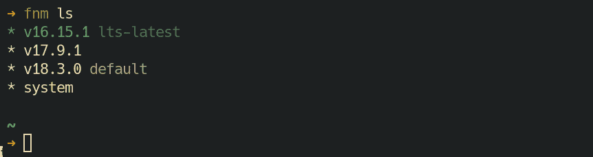

# 如何使用 fnm–快速节点管理器

> 原文：<https://www.freecodecamp.org/news/fnm-fast-node-manager/>

如果您使用 Node 已经有一段时间了，您很可能会发现您的项目——或者您正在处理的项目——是为 Node 的旧版本编写的。这意味着它们在最新版本中不会像预期的那样工作。

在这种情况下，节点版本管理器可以帮助您节省安装和在不同节点版本之间来回切换的宝贵时间。

今天我将向您介绍`fnm`(快速节点管理器)，这是一个节点版本管理器，用 Rust 编写，考虑到简单和速度。`fnm`也有跨平台支持。

## 目录

*   1安装 Linux 系统和`zsh` shell
    *   1.1 [外壳设置](#shell-setup)
    *   1.2 [如何安装完井脚本](#how-to-install-the-completion-script)
*   2T3`fnm`的常用用法
    *   2.1 [如何列出所有远程节点版本](#how-to-list-all-remote-node-versions)
    *   2.2 [如何安装多个版本的节点](#how-to-install-multiple-versions-of-node)
    *   2.3 [如何为节点版本设置别名](#how-to-set-aliases-for-a-node-version)
    *   2.4 [如何使用特定版本的节点](#how-to-use-a-particular-version-of-node)
    *   2.5 [如何给项目附加节点版本](#how-to-attach-a-node-version-to-a-project)
    *   2.6 [如何卸载一个版本的节点](#how-to-uninstall-a-version-of-node)
*   3如何去掉`fnm`
*   4 [总结](#summary)

## 1 安装 Linux 系统和 zsh shell[](#installation-for-linux-system-and-zsh-shell)

这里我将只介绍 Linux 系统的`fnm`和`zsh` shell 的安装。其他平台和外壳的安装说明见[文件](https://github.com/Schniz/fnm)。

首先确保您的系统上安装了`curl`。然后运行以下命令来安装`fnm`:

```
curl -fsSL https://fnm.vercel.app/install | bash -s -- --skip-shell
```

它会将`fnm`安装到你的`$HOME/.fnm/`目录中。

**更新** `fnm`和**用上面的命令重新安装**一样。

### 1.1 外壳设置[](#shell-setup)

还有一个更重要的步骤。只需将以下内容添加到您的`.zshrc`文件中:

```
# fnm
export PATH=/home/$USER/.fnm:$PATH
eval "$(fnm env --use-on-cd --version-file-strategy=recursive)"
```

### 1.2 如何安装完井脚本[](#how-to-install-the-completion-script)

安装完井脚本是**可选的**。如果您想知道这一步的作用，下面是它的作用:当您按 TAB 键时，它试图自动完成您键入的与 fnm 相关的部分命令。例如，如果您键入`fnm ls-`并按 TAB 键，它将自动完成到`fnm ls-remote`。

`fnm`附带了不同 shells 的所有完成代码及其二进制代码。您必须将代码粘贴到一个名为`_fnm`的文件中，该文件位于在`FPATH`环境变量中指定的目录下:

```
fnm completions --shell zsh > <a_fpath_dir>/_fnm
```

查看`echo $FPATH`的输出以获得所有可能的目录，并用一个实际的目录替换`<a_fpath_dir>`。建议使用用户本地路径。如果没有这样的路径，您可以在您的`.zshrc`中添加一行:

```
fpath=(/home/$USER/your/favorite/path/here $fpath)
```

## 2 常见用法`fnm`[](#common-usage-of-fnm)

### 2.1 如何列出所有远程节点版本[](#how-to-list-all-remote-node-versions)

要查看可以安装的所有不同节点版本，请运行:

```
fnm ls-remote
```

它将打印所有版本，如下所示:

```
.
.
.
v16.15.0 (Gallium)
v16.15.1 (Gallium)
v17.0.0
v17.0.1
v17.1.0
v17.2.0
v17.3.0
v17.3.1
v17.4.0
v17.5.0
v17.6.0
v17.7.0
v17.7.1
v17.7.2
v17.8.0
v17.9.0
v17.9.1
v18.0.0
v18.1.0
v18.2.0
v18.3.0
```

### 2.2 如何安装多个版本的节点[](#how-to-install-multiple-versions-of-node)

让我们安装版本为`v18.3.0`的节点:

```
fnm install v18.3.0
```

要安装最新 LTS 版本的节点，可以使用`--lts`选项。因此，运行以下命令来安装它:

```
fnm install --lts
```

`fnm`还支持部分版本匹配。`fnm`根据您的部分输入猜测最新的可用版本。例如，如果你只是:

```
fnm install 17
```

它将安装版本为`v17.9.1`的节点，这是从`17`开始的最新可用版本。因此，请尝试上面的命令。

让我们通过在您的终端中输入`node --version`来检查您的节点版本。请注意，默认情况下使用第一个安装的。

在了解如何开始使用 Node 的不同安装版本之前，让我们看看如何为一个版本设置一个别名(名称),以便可以轻松地引用它。

### 2.3 如何为节点版本设置别名[](#how-to-set-aliases-for-a-node-version)

默认情况下，使用`fnm`安装的 Node 的第一个版本会收到别名`default`。

为版本设置别名的语法是:

```
fnm alias <version> <name>
```

如果你想设置别名`default`，有一个简写:

```
fnm default <version>
```

您也可以为一个版本设置多个别名。

删除别名的语法是:

```
fnm unalias <name>
```

### 2.4 如何使用特定版本的节点[](#how-to-use-a-particular-version-of-node)

您可以使用`use`子命令使用特定版本的节点:

```
fnm use 16 
```

要检查当前节点版本，只需运行:

```
fnm current 
```

要列出使用`fnm`安装的所有节点版本，请运行:

```
fnm ls 
```



注意，您可以通过使用`system`绕过`fnm`并在您的系统上使用系统范围的 Node 安装(如果有的话):

```
fnm use system
```

### 2.5 如何将节点版本附加到项目[](#how-to-attach-a-node-version-to-a-project)

您可以在项目的根目录下创建一个 [`.node-version`](https://github.com/shadowspawn/node-version-usage) 文件，并在该文件中写入该项目所需的节点版本，如下所示，以便为其附加一个节点版本:

```
echo 'v18.3.0' > .node-version 
```

`fnm`尊重此文件。所以如果你在那个目录下，你可以使用`fnm install`或者`fnm use`来安装或者使用那个版本。

`fnm`也尊重`.nvmrc`文件(类似于`.node-version`文件，但来自`nvm`土地)。所以，如果你早点使用`nvm`，你会顺利过渡到`fnm`。

`fnm`可以使用这些点文件来检测节点版本，甚至在使用`cd`时自动开始使用它，这在大多数情况下非常方便，所以我已经在 shell 设置中通过向`fnm env`命令添加以下标志来启用它们:

*   **`--use-on-cd`** :该标志告诉`fnm`当你`cd`进入一个项目根目录时，它会自动使用`.node-version`(或`.nvmrc`)中指定版本的节点。很酷，不是吗？
*   `**--version-file-strategy=recursive**`:这个标志和它的`recursive`值基本上告诉`fnm`使用`.node-version`(或`.nvmrc`)中指定的节点版本，即使你在一个嵌套的目录中并且使用没有版本的`use`或`install`子命令。它还告诉`fnm`当您离开任何这样的项目目录并使用没有版本的`use`子命令时，使用别名为`default`的节点版本。将该标志与`--use-on-cd`一起使用，可以让您在深入进入和退出这类项目目录时，拥有自动使用或安装相关版本的节点的魔力(如本文所述)。

如果这些特性干扰了您的工作流，您可以在 shell 设置中随时删除这些标志来关闭它们。

### 2.6 如何卸载一个版本的节点[](#how-to-uninstall-a-version-of-node)

卸载 node 的一个版本与安装它非常相似。你只需要用子命令`uninstall`代替`install`就可以了。就是这样。

## 3 如何去掉`fnm`[](#how-to-remove-fnm)

删除`fnm`就像从您的`home`中删除`.fnm`目录并删除您在 shell 配置文件中添加的特定配置一样简单。记住还要删除完成脚本。

## 4 总结[](#summary)

下面是我们在本文中讨论的所有命令的摘要:

```
# Listing all remote versions
fnm ls-remote

# Listing all installed ones
fnm ls

# Installing
fnm install <version>

# Uninstalling
fnm uninstall <version>

# Installing node of the latest LTS version
fnm install --lts

# Setting an alias
fnm alias <version> <name>

# Shortcut for setting 'default' as an alias
fnm default <version>

# Removing an alias
fnm unalias <name>

# Using a Node of a particular version
fnm use <version>

# Displaying the version of currently used Node
fnm current 
```

此外，如果您需要快速帮助，`fnm`已经内置了帮助，您可以随时从您的终端获得帮助，如下所示:

*   `fnm`命令的帮助:`fnm --help`
*   任何子命令的帮助`fnm <sub-command> --help`

如果你喜欢`fnm`，别忘了在 [GitHub](https://github.com/Schniz/fnm) 上给它一颗星。我认为它应该得到比现在更多的星星。

感谢阅读！如果你愿意，你可以查看我的[网站](https://www.ashutoshbiswas.dev/)，在[推特](https://twitter.com/ashutoshbw)和 [LinkedIn](https://www.linkedin.com/in/ashutosh-biswas/) 上关注我。

快乐编码😄