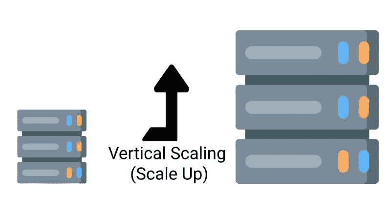

# 水平与垂直扩展–如何扩展数据库

> 原文：<https://www.freecodecamp.org/news/horizontal-vs-vertical-scaling-in-database/>

## 数据可扩展性

数据可伸缩性是指数据库通过添加和删除数据来处理不断变化的需求的能力。通过这种方式，数据库与软件同步增长。

通过伸缩，数据库可以扩展或收缩系统资源的容量，以支持应用程序频繁变化的使用。

**有两种方法可以扩展数据库:**

*   水平扩展(横向扩展)
*   垂直扩展(向上扩展)

在本文中，我们将研究这两种扩展方法，并讨论每种方法的优缺点，以帮助您进行选择。

## 水平缩放

这种扩展方法增加了更多的数据库节点来处理增加的工作负载。它减少了服务器上的负载，而不是扩展单个服务器。

当您需要更多容量时，可以向群集中添加更多服务器。这种扩展方法的另一个名称是**向外扩展**。

### 水平缩放的优势:

*   升级很容易
*   它实现简单，成本较低
*   它提供了灵活、可扩展的工具
*   它具有无限的扩展能力，可以无限地添加服务器实例
*   升级水平扩展的数据库很容易——只需向服务器添加一个节点

### 水平缩放的缺点:

*   代码中的任何错误都将变得更加复杂，难以调试和理解
*   许可费用昂贵，因为您将拥有更多获得许可的节点
*   由于所需的空间、冷却和电力增加，数据中心的成本将显著增加

### 何时使用水平缩放:

如果您要处理超过 1000 个用户，那么最好使用这个伸缩系统，因为当服务器接收到多个用户请求时，一切都会很好地伸缩。

它也不会崩溃，因为有多个服务器。

## 垂直缩放

垂直扩展方法通过增加同一逻辑服务器中的资源来增加单台机器的容量。这包括向现有软件添加内存、存储和处理能力等资源，增强其性能。

这是缩放数据库的传统方法。这种方法的另一个名字是**放大**。

### 垂直扩展的优势:

*   数据中心的空间、冷却和电力成本会更低
*   这是一个具有成本效益的软件
*   它易于使用和实施，管理员可以轻松管理和维护该软件
*   这种方法的资源是灵活的

### 垂直缩放的缺点:

*   成本可能很低，但每次扩大规模时，您都需要支付许可证费用
*   由于高端服务器，硬件成本更高
*   您可以升级的数量是有限制的
*   您受到单一数据库供应商的限制，并且迁移具有挑战性，或者您可能需要重新开始

### 何时使用垂直缩放:

如果您需要一个具有独特数据一致性的系统，那么垂直扩展方法适合您。

如果你不想担心平衡服务器的工作负载，垂直伸缩是最好的选择。

## 垂直和水平缩放的区别

| 垂直的 | 水平的 |
| --- | --- |
| 许可证费用更低 | 许可证费用更高 |
| 这种方法通过增加单独的服务器来增强服务器的能力 | 这种方法用现有的服务器增加了服务器的能力 |
| 这些数据存在于单个节点上，并通过多核进行扩展 | 这基于对包含单个数据部分的每个节点进行分区 |

## 哪种缩放方法最适合你的应用？

在选择如何扩展数据库时，您必须考虑纵向和横向扩展的风险。

现在，我们来看看一些需要考虑的因素，以便您选择最适合您应用的缩放系统:

### 负载平衡

垂直扩展系统最适合平衡负载，因为您只有一台服务器(垂直扩展)，不需要平衡负载。水平扩展要求您均衡地平衡工作负载。

### 故障点

水平扩展系统有不止一个服务器，所以当一个服务器崩溃时，下一个服务器会接手。这意味着不存在使系统具有弹性的单点故障。

但是在垂直扩展系统中，只有一个服务器，所以一旦服务器崩溃，所有东西都会离线。

### 速度

就速度而言，垂直扩展系统更快，因为它运行在一台服务器上，垂直扩展系统有一个*进程间通信*，也就是说，服务器在自身内部通信，速度很快。

水平扩展系统在两台或多台服务器之间进行网络调用。这也被称为*远程过程调用(RPC)。然而，RPC 速度很慢。*

### 数据一致性

在处理服务器时，您需要确保当最终用户发送请求时，存储在服务器中的数据是一致的。

垂直扩展系统具有数据一致性，因为所有信息都在一台服务器上。但是水平扩展系统是通过多台服务器横向扩展的，因此数据一致性可能是一个大问题。

### 硬件限制

水平伸缩系统的伸缩性很好，因为针对一个请求所投入的服务器数量与数据库或服务器中的用户数量成线性关系。另一方面，垂直扩展系统有一个限制，因为所有的东西都在一台服务器上运行。

当选择一个系统来扩展您的数据库时，请务必列出本文中信息的优缺点。它将帮助你决定使用哪一个。

## 结论

云计算模型的可扩展性是指快速、即时地增加或减少 IT 容量的能力。了解这两种类型的伸缩是如何工作的是至关重要的，因为这在您的数据库或服务器管理中扮演着重要的角色。

快速回顾...

*   服务器的作用是增强其处理增加的工作负载的能力，称为**垂直扩展。**
*   系统的工作是添加新节点来管理分布式工作负载，称为**水平扩展。**
*   随着用户数量的增加，水平扩展系统可以很好地扩展。
*   垂直扩展系统速度更快，因为它能够进行进程间通信。

感谢阅读！