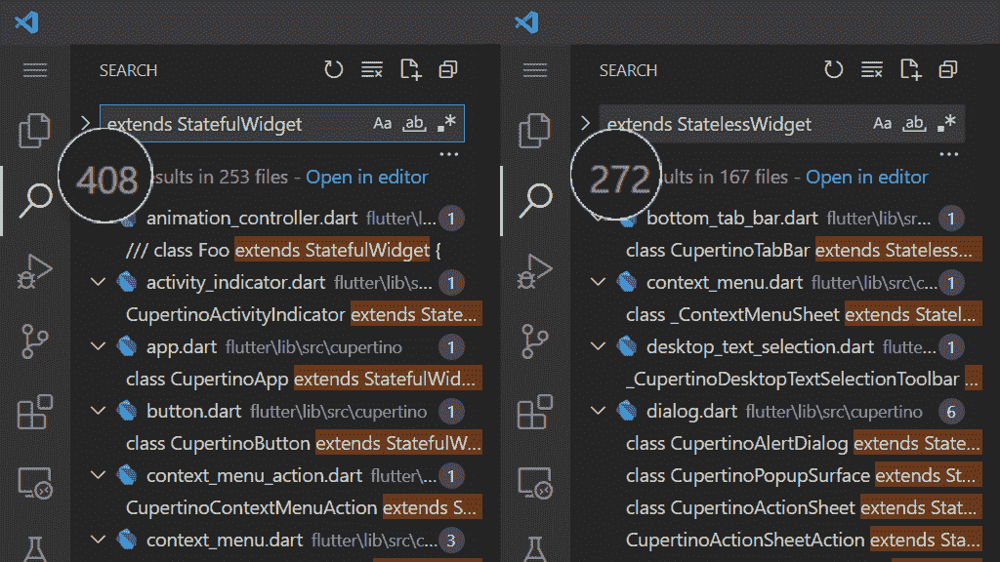
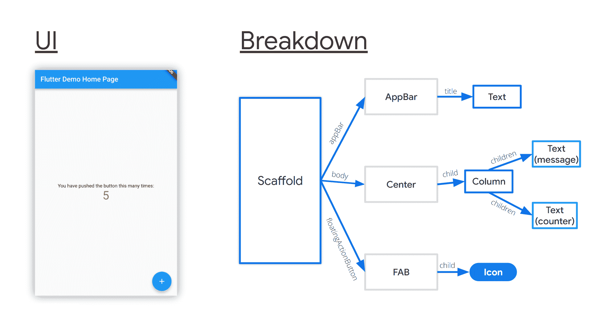
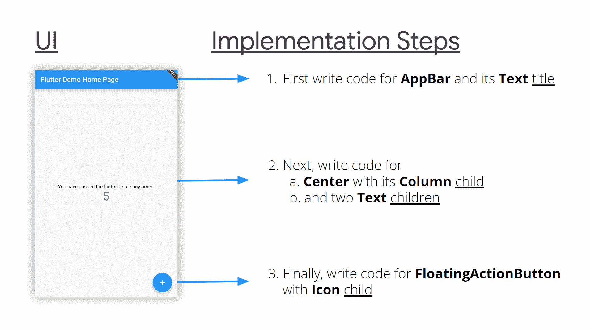
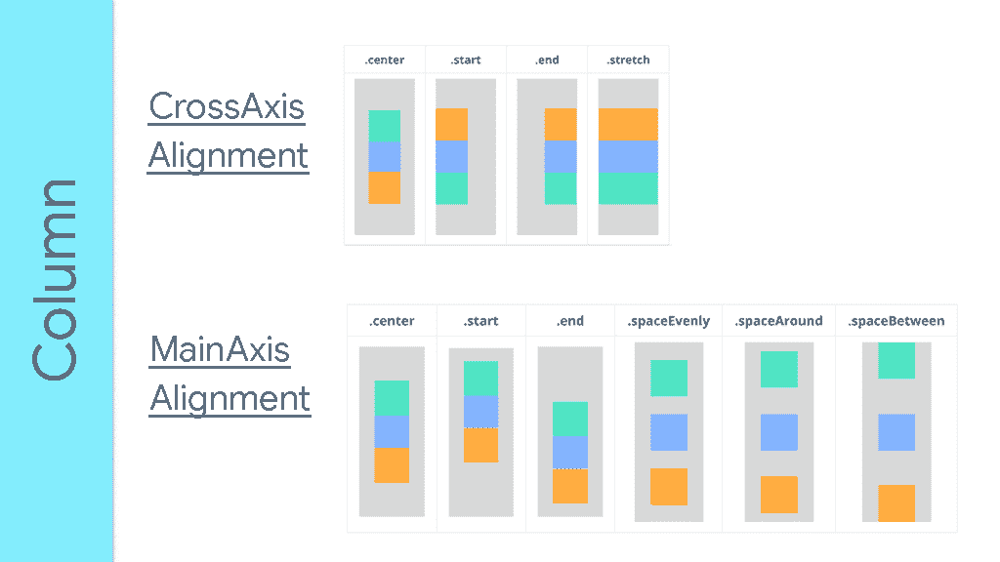
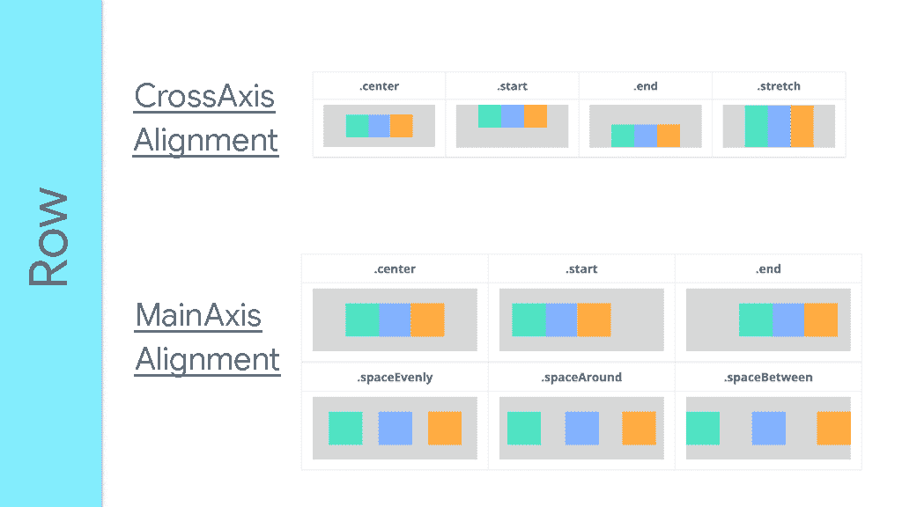
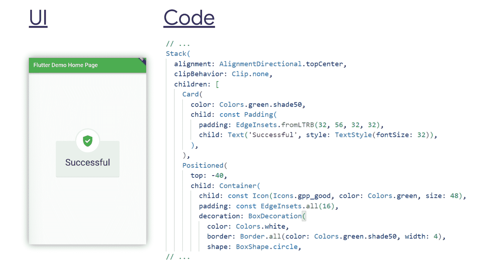
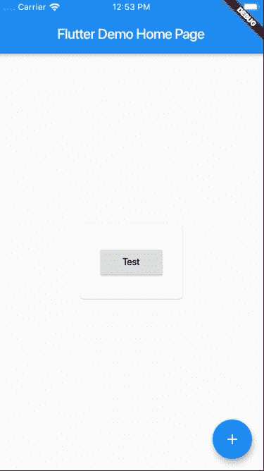
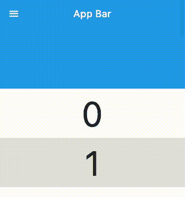
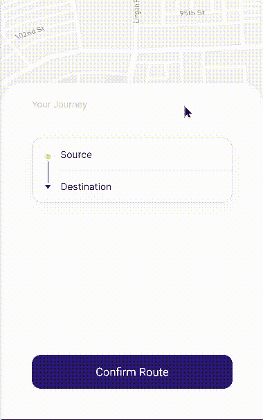
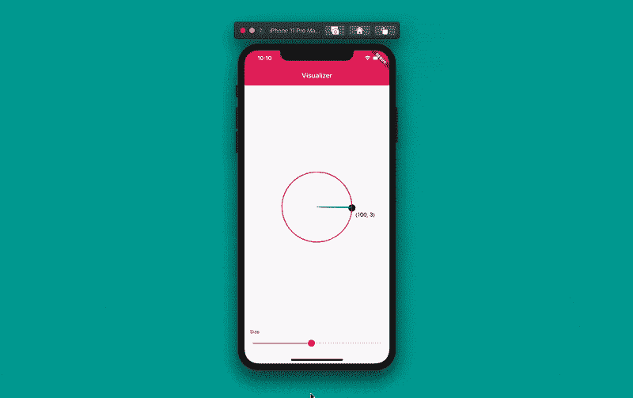

# 如何在 Flutter 中实现任何 UI

> 原文：<https://www.freecodecamp.org/news/how-to-implement-any-ui-in-flutter/>

在本文中，您将学习如何将任何用户界面图像、片段或屏幕转换成 [Flutter](https://flutter.dev) 代码。

这不是一个关于构建应用程序的教程。它更像是一个指南，可以帮助你将遇到的任何 UI 应用到你已经有的应用程序中。本教程还解释了 Flutter 中各种各样的 UI 概念。

## 目录

*   [什么是颤振？](#what-is-flutter)
*   [微件在颤动](#widgets-in-flutter)
*   [微件树](#the-widget-tree)
*   [如何在 Flutter](#how-to-implement-any-ui-in-flutter)
    [1 中实现任意 UI？实现左上；右下](#1-write-your-code-starting-at-the-top-left-and-move-down-to-the-bottom-right)
    [2。选择一个小部件](#2-choose-a-widget)
    [3。使用 widget 组](#3-use-widget-groups)
    [a .列/行](#a-column-row)
    [b .堆叠 Widget](#b-stack-widget)
    [4 .创建自定义小部件](#4-create-custom-widgets)
    [5。添加更多定制](#5-add-more-customization)
    [a .容器小部件](#a-container-widget)
    [b .手势检测器/墨池](#b-gesturedetector-inkwell)
*   [如何实现滚动界面](#how-to-implement-scrolling-interfaces)
*   [关于 CustomPaint](#about-custompaint)
*   [总结](#summary)

## 什么是颤振？

> Flutter 是 Google 的一个开源框架，用于从单个代码库构建漂亮的本地编译的多平台应用程序。–(s[source:flutter . dev](https://flutter.dev)

在 Flutter 中，与大多数框架相反， [Dart](https://dart.dev) 是你唯一用来编码的编程语言。这是颤振的一个被低估的好处。尤其是对于一个可以构建桌面、移动和 web 应用程序的工具。

大多数 [UI](https://en.wikipedia.org/wiki/User_interface_design) 平台使用不止一种语言。比如前端 web 开发，你要写 [HTML](https://developer.mozilla.org/en-US/docs/Web/HTML) 、 [CSS](https://developer.mozilla.org/en-US/docs/Web/CSS) 、 [JavaScript](https://developer.mozilla.org/en-US/docs/Web/JavaScript) 。对于 [Android](https://developer.android.com/) ，你得写 [Kotlin](https://developer.android.com/kotlin) (或者 [Java](https://developer.android.com/studio/write/java8-support) )和 [XML](https://developer.android.com/guide/topics/ui/declaring-layout#write) 。但在 Flutter 中，它只是一种语言:Dart。

加上只有一种编程语言的好处，Flutter 很简单，因为 Flutter 中的所有东西都是一个小部件。例如`[AnimatedWidget](https://api.flutter.dev/flutter/widgets/AnimatedWidget-class.html)`、`[BottomNavigationBar](https://api.flutter.dev/flutter/material/BottomNavigationBar-class.html)`、`[Container](https://api.flutter.dev/flutter/widgets/Container-class.html)`、`[Drawer](https://api.flutter.dev/flutter/material/Drawer-class.html)`、`[ElevatedButton](https://api.flutter.dev/flutter/material/ElevatedButton-class.html)`、`[FormField](https://api.flutter.dev/flutter/widgets/FormField-class.html)`、`[Image](https://api.flutter.dev/flutter/widgets/Image-class.html)`、`[Opacity](https://api.flutter.dev/flutter/widgets/Opacity-class.html)`、`[Padding](https://api.flutter.dev/flutter/widgets/Padding-class.html)`，...

这是 Flutter 易于使用的部分原因——它基本上是简单的英语。 [Widget](https://docs.flutter.dev/development/ui/widgets) 名称反映了它们是什么，它们的属性很容易理解。

## 飘动中的部件

小部件是一个 Dart [类](https://dart.dev/samples#classes)，它或者扩展了 [StatefulWidget](https://api.flutter.dev/flutter/widgets/StatefulWidget-class.html) 或者 [StatelessWidget](https://api.flutter.dev/flutter/widgets/StatelessWidget-class.html) 。

您的本地 [Flutter 安装](https://docs.flutter.dev/get-started/install)附带了几个小部件。要查看缺省可用的小部件，请在首选编辑器中打开 Flutter 安装的 packages 文件夹。然后在所有文件中搜索“extends StatefulWidget”和“extends StatelessWidget ”,并记录结果的数量。



截止到 [Flutter 2.10](https://docs.flutter.dev/development/tools/sdk/release-notes/release-notes-2.10.0) ，你将获得 **408** StatefulWidgets 和 **272** StatelessWidgets。总共有 **680 个小部件**可供您使用和实现 ui。

这些小部件通常可以满足您的所有需求。但有时它们可能还不够。Dart 和 Flutter 的包管理器 pub.dev 有更多的小部件可以用来实现 ui。

很难统计 pub.dev 中的小部件，但是搜索一个空字符串(不要在搜索栏中输入任何内容，然后按搜索图标)并将 SDK 设置为 Flutter 会返回当前已发布包的总数。


在撰写本文时，pub.dev 中有超过 23000 个 Flutter 包，每个包都有*至少一个*小部件。这意味着除了可用的 680 个小部件之外，您还需要实现来自 pub.dev 的 23000 多个小部件。这意味着你真的可以在 Flutter 中轻松实现任何你想要的 UI。

除了许多可用的小部件，您还可以在实现 ui 时创建自己的小部件。

## 小组件树

以下是创建新的 Flutter 项目并删除注释时获得的部分代码:

```
 @override
  Widget build(BuildContext context) {
    return Scaffold(
      appBar: AppBar(
        title: Text(widget.title),
      ),
      body: Center(
        child: Column(
          mainAxisAlignment: MainAxisAlignment.center,
          children: <Widget>[
            const Text(
              'You have pushed the button this many times:',
            ),
            Text(
              '$_counter',
              style: Theme.of(context).textTheme.headline4,
            ),
          ],
        ),
      ),
      floatingActionButton: FloatingActionButton(
        onPressed: _incrementCounter,
        tooltip: 'Increment',
        child: const Icon(Icons.add),
      ),
    );
  }
```

Part of the placeholder code for new Flutter projects

父节点`Scaffold`带有`appBar`、`body`和`floatingActionButton`参数。反过来，`[AppBar](https://api.flutter.dev/flutter/material/AppBar-class.html)`也接受一个具有`Text`值的`title`参数。

`body`取一个具有`Column`T3 的`Center`值。而`Column`又有两个`Text`作为`children`。`FloatingActionButton`接受`onPressed`回调、`tooltip`增量、`Icon`为`child`。



Flutter widget tree breakdown

这是一个简单的部件树。它有父母和后代。`child`和`children`是大多数 Flutter 小部件的共同属性。随着窗口小部件不断获取更多的窗口小部件子部件，您的应用程序逐渐成长为一个大的窗口小部件树。

当您在 Flutter 中实现 ui 时，请记住您正在构建一个小部件树。你会注意到你的代码从左边向内缩进。它似乎在左边形成了某种虚拟的大于号。

**注意:**巨大的缩进等级是你需要重构代码的信号。这意味着您需要将一些小部件层次结构提取到一个单独的小部件中。

## 如何在 Flutter 中实现任何 UI

### 1.从左上角开始写你的代码，一直写到右下角

您将根据每个元素在 UI 中的位置一个接一个地实现 UI 小部件。因此，您将首先为出现在 UI 顶部的内容编写代码。然后，继续为页面中的其他项目编写代码，直到到达 UI 的底部。



这是直观的。

在水平轴上，从左到右。如果需要，或者如果它是一个从右向左的 UI，那么就从右向左实现它。

### 2.选择一个 Widget

接下来，您需要从逻辑上确定想要用于给定 UI 元素的小部件。至少，对于给定的 UI 元素，您将使用您熟悉的简单小部件，这些小部件的名称说明了它们的功能。

UI 组件的名称很可能就是小部件的名称。如果你觉得很难做出选择，快速在线搜索会给你答案。Flutter 有一个很棒的在线社区。

### 3.使用 widget 组

如果一组 UI 项目垂直排列，一个接一个，使用`[Column](https://api.flutter.dev/flutter/widgets/Column-class.html)`。如果它们水平排列，一个接一个，使用`[Row](https://api.flutter.dev/flutter/widgets/Row-class.html)`。如果它们被放置在彼此之上，使用一个`[Stack](https://api.flutter.dev/flutter/widgets/Stack-class.html)`，浮动部件被包裹在`[Positioned](https://api.flutter.dev/flutter/widgets/Positioned-class.html)`部件中。

#### a.列/行

在`Column`或`Row`中，你可以改变或调整部件在主轴或横轴上的排列方式。使用它们的`[CrossAxisAlignment](https://api.flutter.dev/flutter/rendering/CrossAxisAlignment.html)`和`[MainAxisAlignment](https://api.flutter.dev/flutter/rendering/MainAxisAlignment.html)`属性进行这样的调整。

对于横轴，可以对齐到中心、末端、起点和拉伸。对于主轴，可以对齐到中心、末端、周围间距、中间间距、均匀间距和末端。

在`Column`中，纵轴是主轴，横轴是横轴。在`Row`中，水平轴是主轴，而垂直轴是横轴。



Adapted from https://arzerin.com/2019/11/20/flutter-column/



Adapted from https://arzerin.com/2019/11/20/flutter-row/

在`Column` s 和`Row` s 中，如果你想让一个特定的子部件占据尽可能多的可用空间，就把这个部件包装在一个`[Expanded](https://api.flutter.dev/flutter/widgets/Expanded-class.html)`部件中。如果你熟悉 web 前端，你会注意到`Column`和`Row`就像 CSS 中的`[display: flex;](https://developer.mozilla.org/en-US/docs/Web/CSS/flex)`。

#### b.堆栈小部件

使用`Stack`，在`children`列表中的最后一个小部件出现在前面的子部件之上。

您可能需要编辑堆栈的`[alignment](https://api.flutter.dev/flutter/widgets/Stack/alignment.html)`来指示小部件的相对位置。像`[topCenter](https://api.flutter.dev/flutter/painting/AlignmentDirectional/topCenter-constant.html)`、`[center](https://api.flutter.dev/flutter/painting/AlignmentDirectional/center-constant.html)`、`[bottomEnd](https://api.flutter.dev/flutter/painting/AlignmentDirectional/bottomEnd-constant.html)`等等。

`Stack`的大小是基于非定位的小部件(子列表中没有包装在`[Positioned](https://api.flutter.dev/flutter/widgets/Positioned-class.html)`父列表中的小部件)计算的。在编码时，记住您的`Stack`应该至少有一个非定位的小部件，或者它应该被包装在一个显式设置`Stack`大小的父小部件中。

`Positioned`取任意或全部`[bottom](https://api.flutter.dev/flutter/widgets/Positioned/bottom.html)`、`[top](https://api.flutter.dev/flutter/widgets/Positioned/top.html)`、`[left](https://api.flutter.dev/flutter/widgets/Positioned/left.html)`、`[right](https://api.flutter.dev/flutter/widgets/Positioned/right.html)`。他们设置孩子相对于`Stack`的位置。负值会将子对象向相反方向移动。但是，负值会剪切掉子对象的一部分。使用`Stack`上的`[clipBehavior: Clip.none](https://api.flutter.dev/flutter/widgets/Stack/clipBehavior.html)`显示定位的小工具的所有部分。



Full code [here](https://gist.github.com/obumnwabude/de06d67b7e636dfb8ae1b852b97624b4).

### 4.创建自定义小部件

在构建小部件树时，您会注意到两件事:

1.  要么是树的一大块长得太大，它本身就是一个逻辑单元。
2.  或者，一些小部件块或小部件集可能会重复出现，只是略有变化。

这两个迹象表明你应该[重构](https://en.wikipedia.org/wiki/Code_refactoring)你的代码。这意味着您应该提取这些小部件，并在另一个 Dart 文件中定义它们。

您的[代码编辑器](https://docs.flutter.dev/get-started/editor)将帮助您进行重构。不管有没有编辑器，您需要做的就是:

1.  创建新的 Dart 文件。文件名应该反映新小部件的名称。
2.  创建一个扩展 StatefulWidget 或 StatelessWidget 的新类，这取决于新的小部件是否有[状态](https://api.flutter.dev/flutter/widgets/State-class.html)。
3.  然后从一个`[build](https://api.flutter.dev/flutter/widgets/StatelessWidget/build.html)`方法返回小部件块。
4.  (可选)如果需要，您的新 Dart 类可以将位置或命名参数带到其构造函数中，以自定义小部件的外观。

```
// in counter_display.dart
import 'package:flutter/material.dart';

class CounterDisplay extends StatelessWidget {
  @override
  Widget build(BuildContext context) {
    return Column(
  	  mainAxisAlignment: MainAxisAlignment.center,
      children: [
        Text('You have pushed the button this many times:'),
        Text('$counter', style: TextStyle(fontSize: 24)),
      ],
    );
  }
}

// in main.dart
//
// ... 
  body: Center(child: CounterDisplay()),
// ... 
```

您将构建许多自定义小部件，而它们又将成为更多自定义小部件的后代，这很好。小部件树意味着随着需求的增加而不断增长。

### 5.添加更多定制

你不会仅仅因为重构和[重复(干代码)](https://en.wikipedia.org/wiki/Don%27t_repeat_yourself)就定制 widgets。由于您正在实现的 UI，您将创建自定义小部件。

您将创建自定义小部件，因为许多可用的小部件并不总是满足给定 UI 的确切需求。您需要以某种特殊的方式将它们组合起来，以实现特定的 UI。

#### a.容器小部件

`[Container](https://api.flutter.dev/flutter/widgets/Container-class.html)`是一个功能强大的小工具。你可以用不同的方式设计它。如果你习惯于 web frontend，你会注意到它就像 HTML 中的`[div](https://developer.mozilla.org/en-US/docs/Web/HTML/Element/div)`。

`Container`是一个基础小部件。您可以使用它来创建任何 UI 片段。

一些`Container`参数是`[constraints](https://api.flutter.dev/flutter/widgets/Container/constraints.html)`、`[decoration](https://api.flutter.dev/flutter/widgets/Container/decoration.html)`、`[margin](https://api.flutter.dev/flutter/widgets/Container/margin.html)`、`[padding](https://api.flutter.dev/flutter/widgets/Container/padding.html)`、`[transform](https://api.flutter.dev/flutter/widgets/Container/transform.html)`等等。当然，`Container`带一个`[child](https://api.flutter.dev/flutter/widgets/Container/child.html)`，可以是任何小部件。

`decoration`属性可以接受一个`[BoxDecoration](https://api.flutter.dev/flutter/painting/BoxDecoration-class.html)`，后者又可以接受其他几个属性。这是`Container`灵活性的核心。`BoxDecoration`采用`[border](https://api.flutter.dev/flutter/painting/BoxDecoration/border.html)`、`[borderRadius](https://api.flutter.dev/flutter/painting/BoxDecoration/borderRadius.html)`、`[boxShadow](https://api.flutter.dev/flutter/painting/BoxDecoration/boxShadow.html)`、`[color](https://api.flutter.dev/flutter/painting/BoxDecoration/color.html)`、`[gradient](https://api.flutter.dev/flutter/painting/BoxDecoration/gradient.html)`、`[image](https://api.flutter.dev/flutter/painting/BoxDecoration/image.html)`、`[shape](https://api.flutter.dev/flutter/painting/BoxDecoration/shape.html)`等参数。

有了这些参数和它们的值，您可以根据自己的喜好实现任何 UI。你可以使用`Container`来代替 Flutter 自带的许多[材质小部件](https://api.flutter.dev/flutter/material/material-library.html)。这样你的应用就符合你的口味了。

#### b.手势检测器/墨水瓶

`[GestureDetector](https://api.flutter.dev/flutter/widgets/GestureDetector-class.html)`顾名思义检测用户交互。不是每个 UI 都是一个按钮。在实现 ui 时，你需要一些小部件来响应用户的动作。在这种情况下，使用`GestureDetector`。

`GestureDetector`可以检测不同类型的手势:点击、双击、滑动、...`GestureDetector`当然需要一个`[child](https://api.flutter.dev/flutter/widgets/GestureDetector/child.html)`(可以是任何 widget)，不同的手势有不同的回调，像`[onTap](https://api.flutter.dev/flutter/widgets/GestureDetector/onTap.html)`、`[onDoubleTap](https://api.flutter.dev/flutter/widgets/GestureDetector/onDoubleTap.html)`、`[onPanUpdate](https://api.flutter.dev/flutter/widgets/GestureDetector/onDoubleTap.html)`(用于刷卡)，...

**注意:**默认情况下，当用户与`GestureDetector` s 的`child`中的空格进行交互时，不会调用回调。如果你想让你的`GestureDetector`对空白空间(在它的`child`内)的手势做出反应，那么将`GestureDetector`的`[behavior](https://api.flutter.dev/flutter/widgets/GestureDetector/behavior.html)`属性设置为`[HitTestBehavior.translucent](https://api.flutter.dev/flutter/rendering/HitTestBehavior.html)`。

```
GestureDetector(
  // set behavior to detect taps on empty spaces
  behavior: HitTestBehavior.translucent,
  child: Column(
    children: [
      Text('I have space after me ...'),
      SizedBox(height: 32),
      Text('... that can detect taps.'),
    ],
  ),
  onTap: () => print('Tapped on empty space.'),
)
```

Usage of GestureDetector, indicating HitTestBehavior.translucent behavior.

`[InkWell](https://api.flutter.dev/flutter/material/InkWell-class.html)`类似于`GestureDetector`。它对*的一些*手势做出反应，而`GestureDetector`对这些手势做出反应。然而，它在互动时会显示出**波纹**效果(而`GestureDetector` s 不会)。



From https://stackoverflow.com/q/58285012/13644299

`InkWell`必须有一个`[Material](https://api.flutter.dev/flutter/material/Material-class.html)`祖先。所以，如果你最上面的小工具是`[MaterialApp](https://api.flutter.dev/flutter/material/MaterialApp-class.html)`，你不用担心。否则，用一个`Material`把`InkWell`包起来。

如果你要改变`InkWell`的父对象或者`child`的颜色，你也应该这样做。如果你不这样做，涟漪就不会出现。您还必须设置`Material`小部件的`[color](https://api.flutter.dev/flutter/material/Material/color.html)`来显示波纹。你可以将`color`设置为`[Colors.transparent](https://api.flutter.dev/flutter/material/Colors/transparent-constant.html)`，然后 Flutter 会处理剩下的事情。

## 如何实现滚动界面

滚动是一个有点微妙的话题。默认情况下，小部件不会在 Flutter 中滚动。如果你的`Column`或`Row`可以滚动，那就用`[ListView](https://api.flutter.dev/flutter/widgets/ListView-class.html)`来代替。`ListView`也带`children`参数。

`ListView`也有`[ListView.builder](https://api.flutter.dev/flutter/widgets/ListView/ListView.builder.html)`和`[ListView.separated](https://api.flutter.dev/flutter/widgets/ListView/ListView.separated.html)`这样的工厂构造器。`builder`让你对孩子的构建过程有更多的控制权，而`separated`考虑到了*分隔符*(比如`[Divider](https://api.flutter.dev/flutter/material/Divider-class.html)`)。

默认情况下，`ListView` s 垂直滚动它们的子节点。但是，您可以将`ListView`的`[scrollDirection](https://api.flutter.dev/flutter/widgets/ScrollView/scrollDirection.html)`更改为`[Axis.horizontal](https://api.flutter.dev/flutter/painting/Axis.html)`来水平滚动其子节点。

有时，您可能希望使用`[SingleChildScrollView](https://api.flutter.dev/flutter/widgets/SingleChildScrollView-class.html)`而不是`ListView`。顾名思义，它只需一个`[child](https://api.flutter.dev/flutter/widgets/SingleChildScrollView/child.html)`就可以滚动。您可以将小部件组作为它的`child`传递。

[还有其他滚动小工具](https://docs.flutter.dev/development/ui/widgets/scrolling)。

但是要特别注意`[CustomScrollView](https://api.flutter.dev/flutter/widgets/CustomScrollView-class.html)`。它给你巨大的滚动控制，不像其他的。它需要`[slivers](https://api.flutter.dev/flutter/widgets/CustomScrollView/slivers.html)`，这些依次是具有强大滚动机制的滚动窗口小部件。

`[SliverFillRemaining](https://api.flutter.dev/flutter/widgets/SliverFillRemaining-class.html)`、`[SliverFillViewport](https://api.flutter.dev/flutter/widgets/SliverFillViewport-class.html)`、`[SliverGrid](https://api.flutter.dev/flutter/widgets/SliverGrid-class.html)`、`[SliverList](https://api.flutter.dev/flutter/widgets/SliverList-class.html)`、`[SliverPersistentHeader](https://api.flutter.dev/flutter/widgets/SliverPersistentHeader-class.html)`等等，都是您包含在`slivers`的*列表中的小部件的例子。这些小部件中的大多数都有一个*委托*，它处理滚动是如何发生的。*

使用`CustomScrollView`的一个很好的例子是使用`[SliverAppBar](https://api.flutter.dev/flutter/material/SliverAppBar-class.html)`，在这里你希望 AppBar 在默认情况下展开，在滚动时收缩。



另一个例子是`[DraggableScrollableSheet](https://api.flutter.dev/flutter/widgets/DraggableScrollableSheet-class.html)`,你可以把一些动作按钮粘在底部。



## 关于自定义画图

这就是 Flutter 给 UI 世界带来终极灵活性的地方。

`[CustomPaint](https://api.flutter.dev/flutter/widgets/CustomPaint-class.html)`对于 Flutter 就像 *[画布 API](https://developer.mozilla.org/en-US/docs/Web/API/Canvas_API)* 对于 HTML 或者 [SVG](https://developer.mozilla.org/en-US/docs/Web/SVG) 对于图片一样。

`CustomPaint`是 Flutter 中的一个小部件，它让你能够不受限制地设计和绘制。它给你一个画布，你可以用一个`[painter](https://api.flutter.dev/flutter/widgets/CustomPaint/painter.html)`在上面画画。



From https://blog.codemagic.io/flutter-custom-painter/

您将很少使用 CustomPaint。但是要意识到它的存在。因为可能会有非常复杂的 ui，小部件组合可能无法实现它们，你将别无选择，只能用`CustomPaint`来绘制。

到那个时候，对你来说并不难，因为你已经熟悉了其他的小部件。

## 摘要

对于给定的 UI 片段，选择一个小部件，编写它的代码，用其他小部件构建这个小部件，然后看看你用 Flutter 实现了多么棒的 UI。

实现 ui 是移动、web 和桌面应用程序开发的主要部分。Flutter 是一个为这些平台构建跨平台 UI 工具包。Flutter 的声明性和丰富的小部件使得 UI 实现变得简单。

继续在 Flutter 中实现 ui。当你这样做时，它会成为你的第二天性。你将能够在 Flutter 中实现任何 UI。