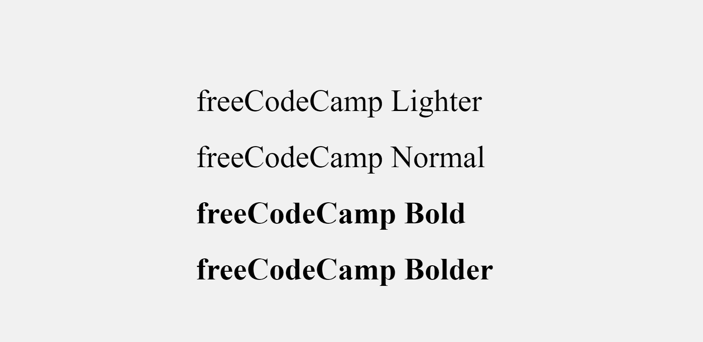
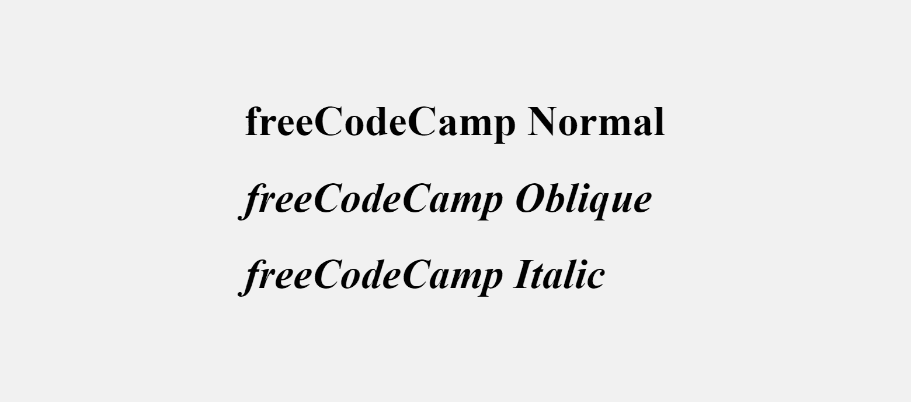
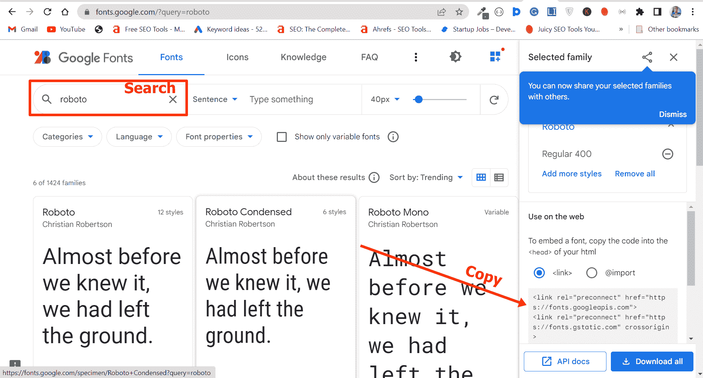

# 如何用 HTML 改变字体

> 原文：<https://www.freecodecamp.org/news/how-to-change-font-with-html/>

回到 HTML4 时代，有一个`<font>`标签可以用来改变文本的字体大小、字体系列和颜色。

但是在 HTML5 中，`<font>`标签已经被弃用了。所以如果你想改变任何与字体相关的东西，你必须用 CSS 来完成。

在这篇文章中，我将向你展示如何使用 CSS 改变文本的字体大小、字体粗细、字体样式和字体系列。

## 如何更改文本的字体大小

文本的字体大小表示文本有多大。

要更改某些文本的字体大小，您需要使用`font-size`属性，然后指定像素值(`px`)、`rem`或`em`。

您可以像这样使用内联 CSS 来实现:

```
<h1 style="font-size: 4rem">freeCodeCamp</h1> 
```

您也可以在嵌入式或内部 CSS 中实现:

```
<style>
    h1 {
        font-size: 4rem;
    }
</style> 
```

最后，您可以在外部 CSS 中完成:

```
 h1 {
        font-size: 4rem;
    } 
```

为了去掉默认的白色背景并将文本水平和垂直居中，我编写了这个 CSS:

```
 body {
      display: flex;
      align-items: center;
      justify-content: center;
      height: 100vh;
      background-color: #f1f1f1;
    } 
```

在浏览器中，看起来如下所示:


## 如何改变文本的字体粗细

Font-weight 属性有助于设置特定文本的粗细程度。

您可以使用`font-weight`来更改文本的亮度或粗体，然后给它一个值，如`normal`、`lighter`、`bold`或`bolder`。您也可以使用 100、200、500 等值。

就像字体大小一样，你可以改变内嵌、嵌入或外部 CSS 中的字体粗细。

```
<span>
   <h1 style="font-weight: lighter">freeCodeCamp Lighter</h1>
   <h1 style="font-weight: normal">freeCodeCamp Normal</h1>
   <h1 class="bold" style="font-weight: bold">freeCodeCamp Bold</h1>
   <h1 style="font-weight: bolder">freeCodeCamp Bolder</h1>
</span> 
```

```
<style>
    .lighter {
      font-weight: lighter;
    }

    .normal {
      font-weight: normal;
    }

    .bold {
      font-weight: bold;
    }

    .bolder {
      font-weight: bolder;
    }
</style> 
```

```
.lighter {
      font-weight: lighter;
    }

    .normal {
      font-weight: normal;
    }

    .bold {
      font-weight: bold;
    }

    .bolder {
      font-weight: bolder;
    } 
```



## 如何更改文本的字体样式

字体样式是文本的字样变体。这种字体变体可以是`normal`、`bold`或`italic`。

要更改字体样式，您需要一个值为`normal`、`oblique`或`italic`的字体样式属性。

Normal 是默认的字体样式，所以不需要指定它，除非必须覆盖它。

通常，您可以在内联、内部或外部 CSS 中更改字体样式。

```
<span>
      <h1>freeCodeCamp Normal</h1>
      <h1 style="font-style: oblique">freeCodeCamp Oblique</h1>
      <h1 style="font-style: italic">freeCodeCamp Italic</h1>
</span> 
```

```
<style>
    .oblique {
      font-style: oblique;
    }

    .italic {
      font-style: italic;
    }
</style> 
```

```
 .oblique {
      font-style: oblique;
    }

    .italic {
      font-style: italic;
    } 
```

下面是浏览器中的输出:


## 如何更改文本的字体系列

字体系列表示共享相同设计和版式的字体集合。

要更改某些文本的字体系列，需要使用 CSS `font-family`属性。

然后，您可以选择使用内联 CSS、内部 CSS 或外部 CSS 来实现。

下面的代码片段显示了如何在内联 CSS 中更改字体系列:

```
<h1 style="font-family: Verdana, Geneva, Tahoma, sans-serif">
      freeCodeCamp
</h1>

You can change the font-family in embedded or internal CSS this way:

```css
<style>
    h1 {
      font-family: Verdana, Geneva, Tahoma, sans-serif;
    }
</style> 
```

在外部 CSS 文件中，您可以像这样更改字体系列:

```
h1 {
      font-family: Verdana, Geneva, Tahoma, sans-serif;
    } 
```

确保外部 CSS 链接到 HTML 文件，否则无法工作。

谷歌 Chrome 浏览器内部的 Verdana 字体家族是这样的:


您可能已经注意到该值中还有其他字体系列 Geneva、Tahoma 和 sans-serif。

如果用户的设备上没有 Verdana，浏览器可以使用这些方法。

如果你不喜欢你的设备内置的字体，你可以从谷歌字体获得其他字体。

搜索您最喜欢的字体并复制链接，然后将链接粘贴到 HTML 的`<head>`部分，这样您就可以在 HTML 样式表
中访问它

在我的例子中，我像这样使用 Roboto 字体:

```
 h1 {
      font-family: Roboto, sans-serif;
    } 
```

这是它在浏览器中的样子:


## 结论

本文向您展示了如何在内联、内部或外部 CSS 中更改文本的字体大小、字体粗细、字体样式和字体系列。

您可能想知道在内联、内部或外部 CSS 之间使用哪一种最好。

如果你正在做一个小项目，你可以使用内部或者嵌入的 CSS，但是如果你正在做一个大项目或者在一个团队中，你不应该使用内部 CSS。

这是因为让你的 CSS 远离你的 HTML 是一个最佳实践。

内联 CSS 在大多数情况下是不允许的，因为它可能会影响 HTML 的可读性。

也有人认为内联 CSS 会对网站的 SEO 产生负面影响。

感谢您的阅读。