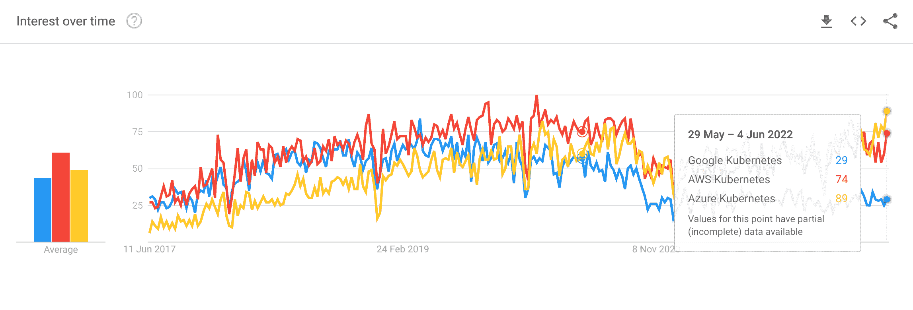

# K8s 是什么意思？如何设置 Kubernetes 和管理集群

> 原文：<https://www.freecodecamp.org/news/what-does-k8s-mean-kubernetes-setup-guide/>

你可能在不同的地方看到过 k8s 这个术语，并想知道它是什么意思。嗯，意思是库伯内特斯。缩写包括:

*   “k”是 Kubernetes 的第一个字母，
*   " **8** "是单词中第一个和最后一个之间的字母数，以及
*   s 是最后一个字母。

现在，让我们看看 Kubernetes 是用来做什么的，以了解它的核心优势和使用领域。

集装箱到处都是。使用像 [Docker](https://www.docker.com/) 这样的容器技术，你可以在一个完全隔离的环境中用一个命令启动应用程序。Kubernetes 用于容器编排，将多台机器组合成一个集群，并分发有状态容器。

在这篇博文中，你将了解到:

*   如何在本地设备上玩 Kubernetes，
*   如何在 Kubernetes 集群中启动应用程序，
*   最受欢迎的托管 Kubernetes 提供商，用于大规模运行您的应用程序。

本教程将主要关注使用 shell 而不是 UI，因为它允许您在本地和远程 Kubernetes 集群中使用所有示例。

## 如何在本地设备上设置 Kubernetes

最简单的入门方法就是[安装 Docker。](https://www.docker.com/get-started/)启动后可以打开 Docker，进入`Settings -> Kubernetes`，本地启用 Kubernetes。确认后，您的 Kubernetes 集群将启动。

与 Kubernetes 集群通信的最简单的方法是使用 [kubectl](https://github.com/kubernetes/kubectl) 。因此，如果您还没有这样做，[安装 kubectl](https://kubernetes.io/docs/tasks/tools/#kubectl) 。

此外，我建议您[设置 kubectx](https://github.com/ahmetb/kubectx) ，它允许您在不同的集群之间切换。为了使 Kubernetes 的部署变得容易，您还应该[安装 Helm](https://helm.sh/docs/intro/install/) ，它使您能够用一个命令部署更复杂的应用程序，这些应用程序由多个部分组成。

现在，Docker 显示 Kubernetes 集群已经在您的设置中准备好了，然后您可以启动一些应用程序。让我们看看所有可用的 Kubernetes 上下文:

```
# Show all available contexts
kubectx

> development
> docker-desktop

# Select local docker desktop context
kubectx docker-desktop
```

## 如何在 Kubernetes 集群中启动应用程序

让我们建立一个 [JupyterHub](https://jupyterhub.readthedocs.io/en/stable/) 允许团队使用 Jupyter 笔记本，这是机器学习和 Python 最流行的平台之一。

```
# add helm repository
helm repo add jupyterhub https://jupyterhub.github.io/helm-chart/

# start containers
helm install my-jupyterhub jupyterhub/jupyterhub --version 1.2.0

# after a few minutes, get information about the Kubernetes service
kubectl --namespace=default get svc proxy-public

NAME           TYPE           CLUSTER-IP      EXTERNAL-IP   PORT(S)        AGE
proxy-public   LoadBalancer   10.109.132.29   localhost     80:31480/TCP   31m
```

正如打印的那样，外部 IP 是 localhost，暴露在端口 80 上。一旦容器启动，您就可以打开 [http://localhost](http://localhost) 并使用用户名“admin”登录，无需密码。

正如您所看到的，用几个命令行就可以轻松运行一个更全面的应用程序。如果你想尝试更多的例子，可以看看[我关于 Helm](https://www.freecodecamp.org/news/helm-charts-tutorial-the-kubernetes-package-manager-explained/) 的博文。

要清理资源，您应该删除正在运行的应用程序:

```
helm uninstall my-jupyterhub

release "my-jupyterhub" uninstalled
```

## 最受欢迎的托管 Kubernetes 集群

一旦您想要运行一个应用程序并让其他人可以使用它，您必须运行一个公开可用的 Kubernetes 集群。如果您不是专家，就不应该从头开始运行集群。

相反，您可以使用 Kubernetes 集群的托管版本，这意味着集群本身的大部分维护是由外部提供者完成的。您可以简单地部署容器，事情应该只是工作。

我的建议是使用谷歌的托管集群 (GKE)。谷歌是 Kubernetes 的原始设计者，并以提供坚实的 Kubernetes 体验而闻名。他们还提供一种更极端的管理版本，叫做 GKE 自动驾驶仪，允许你按集装箱小时数和内存付费。

然而，在现实中，团队使用标准的 Kubernetes 集群，该集群集成了更多的其他托管服务，如果您使用 Autopilot，这些服务还不可用。例如，您可以通过使用[配置连接器](https://cloud.google.com/config-connector/docs/overview)使用 Kubernetes 资源创建服务帐户、DNS 记录或托管证书。

您可以按照简单的 Google 教程在几分钟内建立一个 GCP Kubernetes 集群并部署一个示例应用程序。

还有更多托管的 Kubernetes 集群，如亚马逊的弹性 Kubernetes 服务(T1)和微软的 Azure Kubernetes 服务(T3)。无论您喜欢哪种云，使用当前云供应商提供的托管 Kubernetes 集群通常都是一个好主意。

我[用 Google Trends](https://trends.google.com/trends/explore?date=today%205-y&q=Google%20Kubernetes,AWS%20Kubernetes,Azure%20Kubernetes) 比较了三个热门厂商对 Kubernetes 的兴趣，结果显示 Azure 和 AWS(亚马逊)最受欢迎。



这些数字并没有显示哪个供应商提供了最好的体验。但是，他们对在 Azure 上运行的 Kubernetes 表现出极大的兴趣。有趣的是，Azure 在过去几个月里一直领先。

## 摘要

在这篇博文中，你了解了 k8s 的意思——它只是 Kubernetes 的缩写。这是一个流行的容器编排系统，用于自动化应用程序的部署、扩展和管理。你可以在本地运行 Kubernetes，也可以在不同的云中大规模运行。

我希望你喜欢这篇文章。

如果你喜欢它，觉得有必要给我一点掌声，或者只是想和我保持联系，[在 Twitter 上关注我](https://twitter.com/sesigl)。

我在易贝·克莱南泽根公司工作，这是世界上最大的机密公司之一。顺便说一下，[我们正在招聘](https://www.ebay-kleinanzeigen.de/careers)！

## 参考

*   [木星舵轮图](https://artifacthub.io/packages/helm/jupyterhub/jupyterhub?modal=values)
*   [顶级管理的 Kubernetes 服务](https://techgenix.com/top-managed-kubernetes-services/)
*   [Azure vs 谷歌 vs 亚马逊 Kubernetes](https://www.linkedin.com/pulse/aks-vs-eks-gke-managed-kubernetes-services-compared-yarden-fayer/?trk=public_profile_article_view)