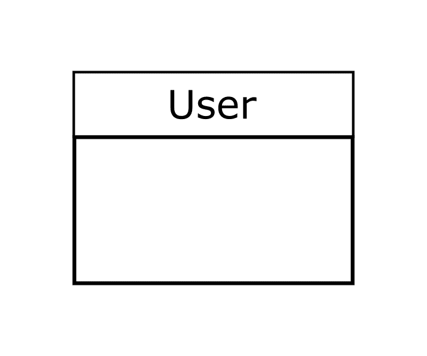
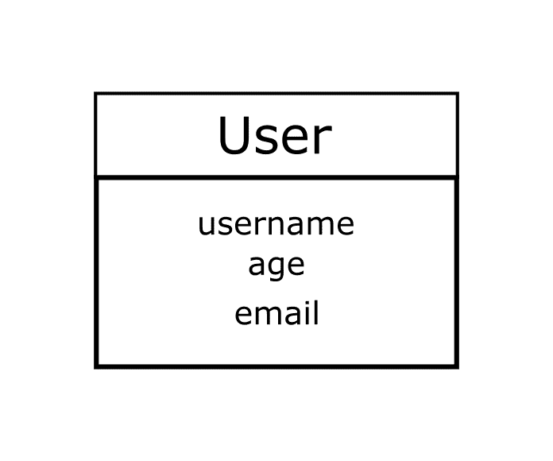
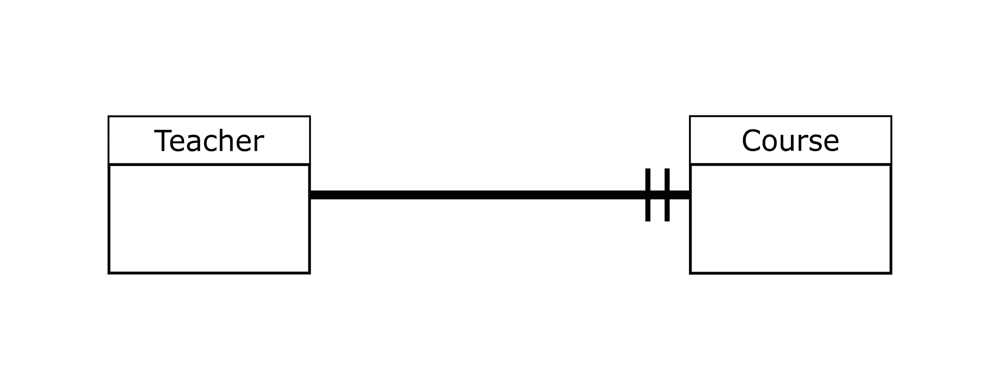
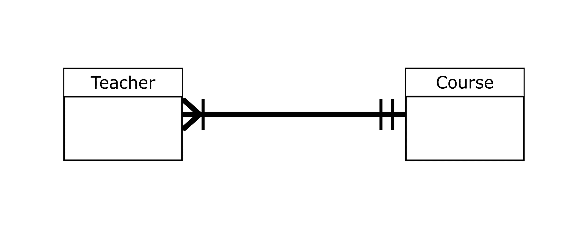
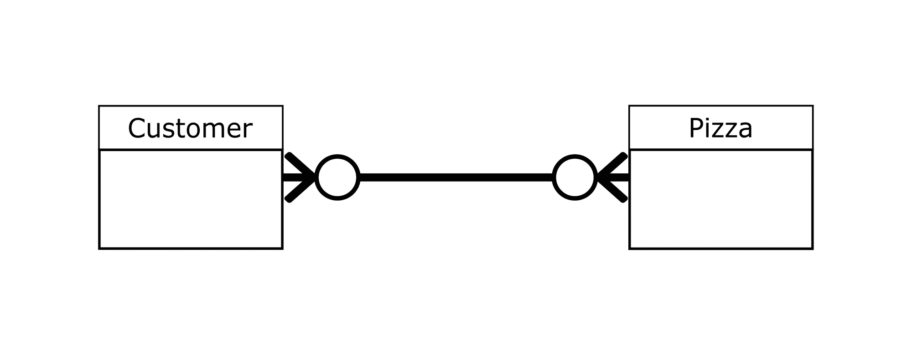

# 鱼尾纹符号——关系符号和如何阅读图表

> 原文：<https://www.freecodecamp.org/news/crows-foot-notation-relationship-symbols-and-how-to-read-diagrams/>

实体关系图(ERD)帮助我们理解组成系统的各种“实体”之间的联系。

在软件开发中，实体关系图主要用于数据库设计。这让我们可以创建组成系统的实体的图形表示，比如数据库(通过本教程中的例子，您会更好地理解这一点)。

为了理解 ERD 中实体之间的关系，我们使用特定的符号和记号。

虽然有各种各样的符号来理解实体关系图，但我们将重点关注乌鸦脚符号，这是创建/设计实体关系图时最常用的符号之一。

本教程将帮助您理解实体关系图中的实体及其属性，可以用来定义实体之间关系的鱼尾纹符号中的各种符号，以及如何阅读和理解图。

在本教程结束时，你应该能够理解和阅读图，并创建自己的实体关系图，利用乌鸦脚符号来定义你的实体关系。

你会看到这些词:符号，指标，符号互换使用。

## 实体关系图中的实体是什么？

在我们看一些例子之前，让我们先来谈谈组成我们将要使用的实体关系图的一些关键术语/组件。

首先是**实体**。一个实体仅仅代表我们数据库中的一个对象。这可以是用户、课程、产品等的对象。

注意，每个实体的名称应该是单数(用户)，而不是复数(用户)。

实体看起来是这样的:

上图显示了一个名为 user 的实体。这个实体将拥有关于在平台上注册的各种用户的信息。

在下一节中，我们将讨论属性。

## 实体关系图中的属性是什么？

我们已经讨论过实体，我们知道它们存储了关于它们所代表的对象的某种信息。

关于对象的信息是属性。所以我们可以说实体的属性就是属性。

让我们用图表来表示这一点。

上图中的实体有三个属性——用户名、年龄和电子邮件。

现在您对实体及其属性有了更清晰的了解。

如果你仍然觉得这很混乱，那么上面的实体叫做“用户”。实体有三个属性(用户名、年龄和电子邮件),称为实体的属性。

## 实体关系图中实体之间的关系

在前面的章节中，我们讨论了实体及其属性。在大多数情况下，数据库由多个实体组成。

为了理解一个实体和另一个实体之间的关系，我们用线来连接它们。但是这些线上面有符号(指示符)来指定两个实体之间存在的关系类型。

我们将使用鱼尾纹符号来指定我们的实体关系。

### 鱼尾纹符号及其意义

在我们看到与鱼尾纹符号相关的符号图之前，我们需要讨论一下鱼尾纹符号中的一个关键术语。

使用鱼尾纹符号时需要知道的最重要的术语之一是**基数**。

**基数**作为实体间关系的参数。对于一个实体，有一个最小和最大的数字来帮助定义它与另一个实体的关系。

如果这些解释看起来令人困惑，请不要担心。随着我们的深入，你会完全理解他们。

以下是与鱼尾纹符号相关的符号:

#### 零

上面的符号/图表在鱼尾纹符号中表示零。我们知道这一点是因为水平线右侧的零/圆指示器。

#### 一个

上图显示了一条水平线，一条短垂直线与之交叉。垂直线作为指示器-它表示一。

#### 许多

上图表示许多。你很容易记住这个符号，因为它看起来像一只乌鸦的脚。

上面的三张图是鱼尾纹符号中指标的基本表示。但在大多数情况下，这些指标结合起来才能充分理解实体之间的关系。

当我们开始看一些实际例子时，你会更好地理解这些符号的含义。

在此之前，让我们看看更多的图表和它们的含义。我们不会引入任何新的东西，只是上面图表的组合。

#### 零个或多个

如上所述，鱼尾纹符号中的**零或多个**符号/指示器是零和多个指示器的组合。

#### 一个或多个

正如所料，**一个或多个**指标是两个指标的组合——一个和多个。

#### 唯一的一个

一个且仅有一个指示器有两个“一”指示器。在下一节的例子中，您会更好地理解它的用法。

## 如何在实体关系图中使用鱼尾纹符号

在上一节中，我们关注了鱼尾纹符号图及其含义。它们充当解释一个实体和另一个实体之间关系的指示器。

在这一节中，我们将深入研究一些实际的例子——这将帮助你完全理解如何使用鱼尾纹符号。

如果您已经遵循了前面的章节，那么我们将在本节中使用的图表的某些方面应该对您来说是清楚的。

### 鱼尾纹符号示例#1

在这个例子中，我们将从一个假设开始，创建实体并使用 crow's foot 符号表示它们之间的关系。

我们将把这个例子分成几个步骤，用图表引导到最后的草图。

##### 步骤 1 -我们的假设和实体

假设我们的数据库中有两个实体。教师和课程实体。这是一个典型的例子:

##### 步骤 2 -教师实体和课程实体的关系

因为我们是创建这个数据库模型的人，所以我们要制定规则！所以对于每个老师来说，他们只能教一门课。

我们假设这是一个用户学习编程语言的平台。每个老师只能教一门编程语言。

这里的符号将是**一个且只有一个**。批注将放在水平线的右侧。

这是一个实体关系图:

还记得我们谈论过的基数吗？嗯，这是实践中观察它的最佳地点。一个老师可以选修的课程最少是一门，最多也是一门。

##### 步骤 3 -课程实体和教师实体的关系

对于每门课程，我们希望有一名或多名教师可供选择——这意味着一门课程可以由一名或多名教师教授。这里的最小值是 1，而最大值是很多。

所以用户可以向一个或多个 JavaScript 老师学习，向一个或多个 Python 老师学习，等等。

要使用的符号是**一个或多个**。批注将放在水平线的左侧。

这是 ERD:

### 鱼尾纹符号示例 2

符号不一定总是不同的。重要的是实体之间关系背后的逻辑。这完全取决于创建或设计数据库的人。

看看下面的图表。

我们有两个实体——客户和披萨。这些实体通过带有符号/指示器/记号的水平线连接在一起。

让我们从左边的符号开始。它有零个或多个符号。这意味着没有顾客(可选)或许多顾客可以订购比萨饼。

同样，右边的符号暗示顾客可以点零个或多个披萨。

这里的**基数**对于两个实体是相同的。零是最小值，而许多是最大值。

其他鱼尾纹符号图的用例与我们示例中的用例相同。这完全取决于逻辑和你的设计。

## 结论

本教程旨在介绍如何理解数据库设计中的实体关系图和鱼尾纹符号。

我们可以使用实体关系图来创建数据库模型，或者用构成数据库的各种实体来创建数据库的图形表示。这使得理解每个实体如何与另一个实体相关联变得更加容易。

符号使理解实体之间的关系变得更加容易。在我们的例子中，我们使用了鱼尾纹符号。

我们首先解释了一些与实体关系图和鱼尾纹符号相关的关键术语，如实体、属性、基数和各种鱼尾纹符号图的含义。

然后，我们看到了一些例子来帮助理解在实体关系图中定义实体之间的关系时，如何应用乌鸦脚符号图。

所用的例子非常简单，但是在实际的数据库中工作时并不总是这样。对基本图表及其含义有一个很好的理解将帮助你理解更复杂的设计。

感谢您的阅读！