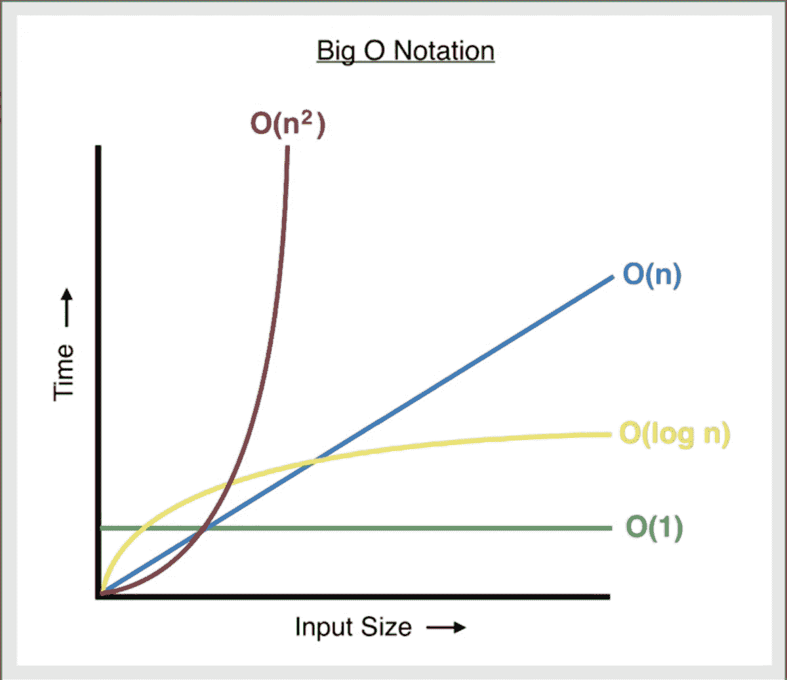
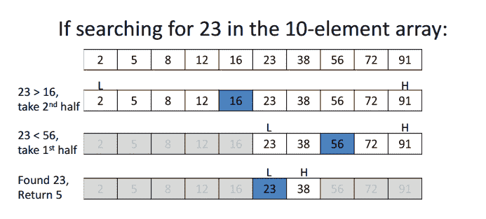
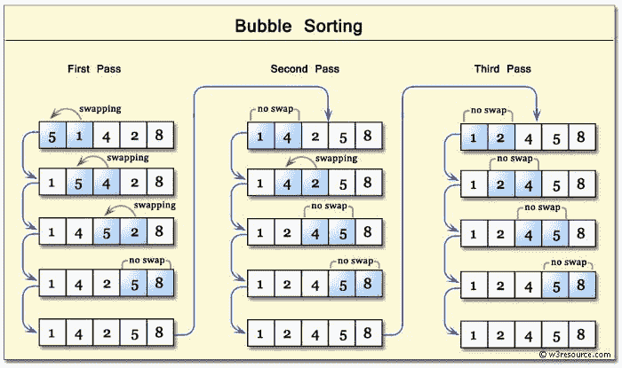
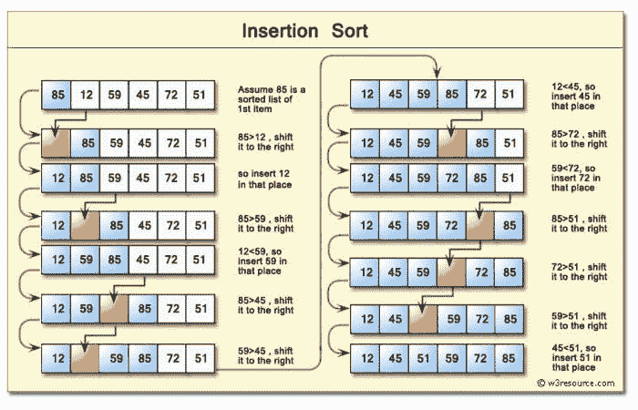
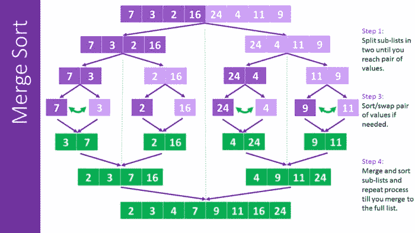
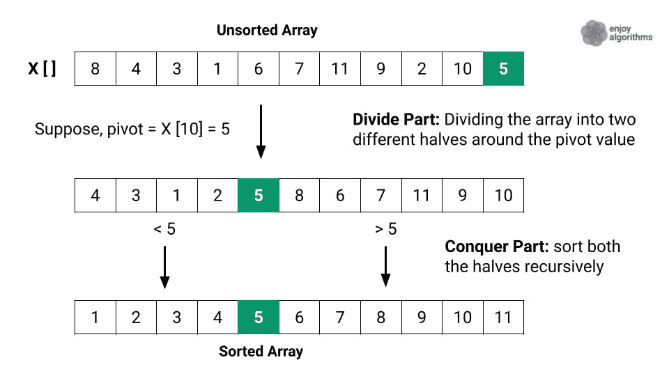
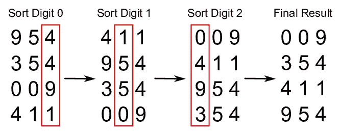
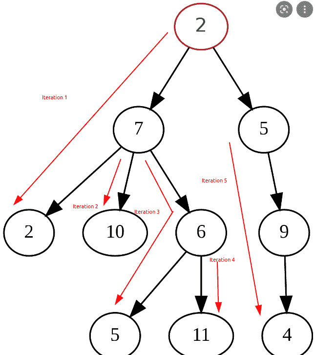
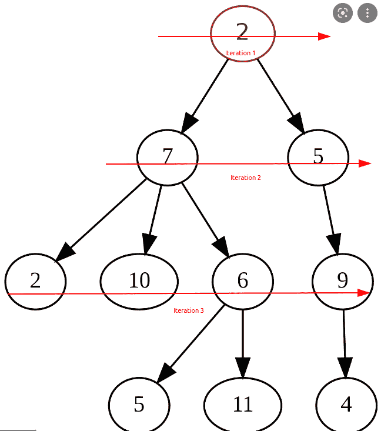
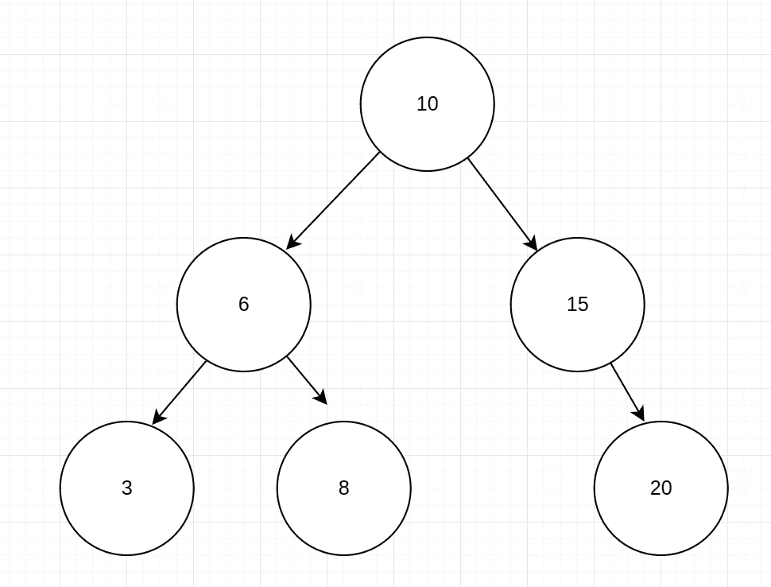

# 算法介绍手册——包含 JavaScript 示例

> 原文：<https://www.freecodecamp.org/news/introduction-to-algorithms-with-javascript-examples/>

大家好！在本文中，我们将了解算法，这是计算机科学和软件开发的一个关键话题。

算法是一个花哨，有时令人生畏，而且经常被误解的词。这听起来真的很难很复杂，但实际上它只不过是为了实现某个目标而必须采取的一系列步骤。

我认为算法的基础知识主要包括两点:

*   渐近符号(我们用它来比较一种算法与另一种算法的性能)。
*   用于非常频繁的任务的经典算法的一般知识，例如搜索、排序和遍历。

这正是我们将在这里看到的。😉
走吧！

## 目录

*   [什么是算法？](#what-is-an-algorithm)
*   [算法复杂度](#algorithmic-complexity)
*   [搜索算法](#searching-algorithms)
    *   [线性搜索](#linear-search)
    *   [二分搜索法](#binary-search)
*   [排序算法](#sorting-algorithms)
    *   [冒泡排序](#bubble-sort)
    *   [选择排序](#selection-sort)
    *   [插入排序](#insertion-sort)
    *   [合并排序](#merge-sort)
    *   [快速排序](#quick-sort)
    *   [基数排序](#radix-sort)
*   [遍历算法](#traversing-algorithms)
    *   [广度优先搜索(BFS)](#breadth-first-search-bfs-)
    *   [深度优先搜索(DFS)](#depth-first-search-dfs-)
        *   [预购 DFS](#pre-order-dfs)
        *   [发布订单 DFS](#post-order-dfs)
        *   [按顺序 DFS](#in-order-dfs)
*   [总结](#wrap-up)

# 什么是算法？

如前所述，算法只是为了实现某个目标而需要采取的一组步骤。

我发现，当人们第一次听到算法这个词时，他们会描绘出这样的画面...


A scene from Matrix or Mr. Robot

但实际上这种图片会更准确...


A book of recipes

一个算法就像一个食谱，在这个意义上，它会指出为了达到你的目标需要遵循的必要步骤。

制作面包的食谱可以是:

```
1- Mix flower, salt, water and yeast
2- Let the dough rise
3- Put in the oven for 30'
4- Let chill and enjoy
```

旁注:我希望你能欣赏我正在教你如何同时编码和烹饪，而且是免费的。😜

识别单词是否是回文的算法可以是:

```
function isPalindrome(word) {
	// Step 1- Put a pointer at each extreme of the word
    // Step 2 - Iterate the string "inwards"
	// Step 3 - At each iteration, check if the pointers represent equal values
	// If this condition isn't accomplished, the word isn't a palindrome
    let left = 0
    let right = word.length-1

    while (left < right) {
        if (word[left] !== word[right]) return false
        left++
        right--
    }

    return true
}

isPalindrome("neuquen") // true
isPalindrome("Buenos Aires") // false
```

与配方一样，在这种算法中，我们有具有特定目的的步骤，这些步骤按照给定的顺序执行，以达到我们想要的结果。

跟随[维基百科](https://en.wikipedia.org/wiki/Algorithm):

> 算法是定义明确的指令的有限序列，通常用于解决一类特定问题或执行计算。

# 算法复杂性

现在我们知道了什么是算法，让我们学习如何比较不同的算法。

假设我们遇到了这个问题:

> 编写一个带两个参数的函数:一个非空的非重复整数数组和一个表示目标和的整数。如果数组中任意两个数字的总和达到目标总和，函数应该将它们放在一个数组中返回。如果没有两个数的和达到目标和，那么函数应该返回一个空数组。

这可能是解决问题的有效方法:

```
function twoNumberSum(array, targetSum) {
    let result = []
    // We use a nested loop to test every possible combination of numbers within the array
        for (let i = 0; i < array.length; i++) {
          for (let j = i+1; j < array.length; j++) {
              // If we find the right combination, we push both values into the result array and return it
              if (array[i] + array[j] === targetSum) {
                  result.push(array[i])
                  result.push(array[j])
                  return result
              }
          }
      }
      // Return the result array
      return result
}

console.log(twoNumberSum([9,1,3,4,5], 6)) // [1,5]
console.log(twoNumberSum([1,2,3,4,5], 10)) // []
```

这可能是另一个有效的解决方案:

```
function twoNumberSum(array, targetSum) {
	// Sort the array and iterate it with one pointer at each extreme
	// At each iteration, check if the sum of the two pointers is bigger or smaller than the target
	// If it's bigger, move the right pointer to the left
	// If it's smaller, move the left pointer to the right
	let sortedArray = array.sort((a,b) => a-b)
	let leftLimit = 0
	let rightLimit = sortedArray.length-1

	while (leftLimit < rightLimit) {
			const currentSum = sortedArray[leftLimit] + sortedArray[rightLimit]

			if (currentSum === targetSum) return [sortedArray[leftLimit], sortedArray[rightLimit]]
			else currentSum < targetSum ? leftLimit++ : rightLimit--        
	}

	return []
}

console.log(twoNumberSum([9,1,3,4,5], 6)) // [1,5]
console.log(twoNumberSum([1,2,3,4,5], 10)) // []
```

这可能是另一个有效的解决方案:

```
function twoNumberSum(array, targetSum) {
    // Iterate over array once, and at each iteration
    // check if the number you need to get to ther target exists in the array
    // If it exists, return its index and the present number index
	let result = []

	for (let i = 0; i < array.length; i++) {
        let desiredNumber = targetSum - array[i]
        if (array.indexOf(desiredNumber) !== -1 && array.indexOf(desiredNumber) !== i) {
            result.push(array[i])
            result.push(array[array.indexOf(desiredNumber)])
            break
        }
	}

    return result
}

console.log(twoNumberSum([9,1,3,4,5], 6)) // [1,5]
console.log(twoNumberSum([1,2,3,4,5], 10)) // []
```

那么我们如何比较哪种解决方案更好呢？他们都完成了他们的目标，对吗？

但是除了**有效性**(目标是否达到)之外，我们还应该从**效率**的角度来评估算法，也就是说从时间(处理时间)**(内存使用量)和空间**(内存使用量)的角度来看，哪个用最少的资源**来解决问题。**

当第一次想到这一点时，一个自动出现的想法是，“只需测量算法运行需要多长时间”。这是有效的。

但问题是相同的算法在不同的计算机上可能需要更长或更短的时间，这取决于它的硬件和配置。即使是在同一台计算机上，考虑到当时正在运行的后台任务，运行时间也可能会更长或更短。

我们需要的是一种客观且不变的方法来衡量算法的性能，这正是**渐近符号**的用途。

渐近符号(也称为 **Big O** 符号)是一个系统，它允许我们**分析和比较算法在其输入增长**时的性能。

Big O 是一种标准化的方法，用于分析和比较不同算法的复杂性(在运行时和空间方面)。无论你在什么计算机上“计算”，算法的大 O 复杂度总是相同的，因为复杂度是根据**计算的，当输入变化**时，算法的运算次数如何变化，并且无论环境如何，这种关系总是保持不变。

一个算法可能有许多不同的复杂性，但最常见的有以下几种:

*   **Constant — O(1):** 当所需的操作数/空间数总是与输入无关时。以一个函数为例，它接受一个数字作为输入，并返回该数字减去 10。不管你给它 100 还是 1000000 作为输入，那个函数总会执行一次操作(rest 10)，所以复杂度是常数 O(1)。
*   **对数— O(log n):** 当所需的操作/空间数量的增长速度比输入的增长速度越来越慢时。这种类型的复杂性经常出现在采用分而治之方法的算法或搜索算法中。一个经典的例子是二分搜索法，在这个例子中，你必须不断地将数据集分成两半，直到你得到最终的结果。
*   **Linear —O(n):** 当所需操作/空间的数量以与输入相同的速度增长时。以一个循环为例，它打印数组中的每个值。运算的次数会随着数组的长度一起增长，所以复杂度是线性的 O(n)。
*   **Quadratic — O(n ):** 当所需操作/空间的数量相对于输入以 2 的幂增长时。嵌套循环是这种情况的典型例子。假设我们有一个循环，它遍历一个数字数组，在这个循环中，我们有另一个循环，它再次遍历整个数组。对于数组中的每个值，我们都要在数组上迭代两次，所以复杂度是 O(n)的平方。



A graphic representation of classic algorithm complexities

注意，当谈到时间和空间复杂性时，使用了相同的符号。比方说，我们有一个函数，不管它接收的输入是什么，它总是创建一个只有一个值的数组，那么空间复杂度将是常数 O(1)，其他复杂度类型也是如此。

为了更好地理解这一切，让我们回到我们的问题并分析我们的解决方案示例。

### 示例 1:

```
function twoNumberSum(array, targetSum) {
    let result = []
    // We use a nested loop to test every possible combination of numbers within the array
        for (let i = 0; i < array.length; i++) {
          for (let j = i+1; j < array.length; j++) {
              // If we find the right combination, we push both values into the result array and return it
              if (array[i] + array[j] === targetSum) {
                  result.push(array[i])
                  result.push(array[j])
                  return result
              }
          }
      }
      // Return the result array
      return result
}

console.log(twoNumberSum([9,1,3,4,5], 6)) // [1,5]
console.log(twoNumberSum([1,2,3,4,5], 10)) // []
```

在这个例子中，我们对参数数组进行迭代，对于数组中的每个值，我们再次对整个数组进行迭代，寻找一个总和等于目标总和的数字。

每次迭代都算作一项任务。

*   如果数组中有 3 个数字，我们将对每个数字迭代 3 次，然后再迭代 9 次(数组中 3 个数字的 3 倍)。) **12** 任务总数。
*   如果数组中有 4 个数字，我们将对每个数字迭代 4 次，再迭代 16 次(数组中 4 个数字的 4 倍)。) **20** 任务总计。
*   如果数组中有 5 个数字，我们将对每个数字迭代 5 次，再迭代 25 次(数组中 5 个数字的 5 倍。) **25** 任务总计。

您可以看到该算法中的任务数量与输入相比是如何呈指数增长和不成比例增长的。该算法的复杂度是二次的-**O(n)**。

每当我们看到嵌套循环时，我们应该想到二次复杂度= >坏= >可能有更好的方法来解决这个问题。

### 示例 2:

```
function twoNumberSum(array, targetSum) {
	// Sort the array and iterate it with one pointer at each extreme
	// At each iteration, check if the sum of the two pointers is bigger or smaller than the target
	// If it's bigger, move the right pointer to the left
	// If it's smaller, move the left pointer to the right
	let sortedArray = array.sort((a,b) => a-b)
	let leftLimit = 0
	let rightLimit = sortedArray.length-1

	while (leftLimit < rightLimit) {
			const currentSum = sortedArray[leftLimit] + sortedArray[rightLimit]

			if (currentSum === targetSum) return [sortedArray[leftLimit], sortedArray[rightLimit]]
			else currentSum < targetSum ? leftLimit++ : rightLimit--        
	}

	return []
}

console.log(twoNumberSum([9,1,3,4,5], 6)) // [1,5]
console.log(twoNumberSum([1,2,3,4,5], 10)) // []
```

在迭代之前，我们先对算法进行排序。然后我们只迭代一次，在数组的每个极端使用一个指针，然后“向内”迭代。

这比之前的解决方案要好，因为我们只迭代一次。但是我们仍然对数组进行排序(通常具有对数复杂度)，然后迭代一次(线性复杂度)。这个解的算法复杂度是 **O(n log(n))。**

### 示例 3:

```
function twoNumberSum(array, targetSum) {
    // Iterate over array once, and at each iteration
    // check if the number you need to get to ther target exists in the array
    // If it exists, return its index and the present number index
	let result = []

	for (let i = 0; i < array.length; i++) {
        let desiredNumber = targetSum - array[i]
        if (array.indexOf(desiredNumber) !== -1 && array.indexOf(desiredNumber) !== i) {
            result.push(array[i])
            result.push(array[array.indexOf(desiredNumber)])
            break
        }
	}

    return result
}

console.log(twoNumberSum([9,1,3,4,5], 6)) // [1,5]
console.log(twoNumberSum([1,2,3,4,5], 10)) // []
```

在最后一个例子中，我们只迭代了一次数组，之前没有做任何事情。这是最佳解决方案，因为我们执行的操作数量最少。这种情况下的复杂度是线性的—**O(n)**。

这确实是算法背后最重要的概念。能够比较不同的实现并理解哪一个更有效以及为什么是非常重要的知识。因此，如果你对这个概念还不清楚，我鼓励你再读一遍例子，寻找其他资源，或者查看[这个令人敬畏的免费代码营视频课程](https://www.youtube.com/watch?v=8hly31xKli0)。

# 搜索算法

一旦你对算法的复杂性有了很好的理解，下一件需要知道的事情就是用来解决非常普通的编程任务的流行算法。所以先从搜索开始吧。

当在数据结构中搜索一个值时，我们可以采用不同的方法。我们将看看两个最常用的选项，并对它们进行比较。

## **线性搜索**

线性搜索包括一次迭代数据结构中的一个值，并检查该值是否是我们正在寻找的值。如果我们使用的数据结构是无序的，这可能是最直观的搜索方式，也是我们能做的最好的搜索方式。

假设我们有一个数字数组，我们想为这个数组写一个函数，它接受一个数字作为输入，并返回这个数字在数组中的索引。如果它不在数组中，它将返回-1。一种可能的方法如下:

```
const arr = [1,2,3,4,5,6,7,8,9,10]

const search = num => {
    for (let i = 0; i < arr.length; i++) {
        if (num === arr[i]) return i
    }
    return -1
}

console.log(search(6)) // 5
console.log(search(11)) // -1
```

由于数组是无序的，我们无法知道每个值的大概位置，所以我们最多只能一次检查一个值。这个算法的复杂度是 **linear - O(n)** 因为在最坏的情况下，我们将不得不在整个数组上迭代一次来获得我们正在寻找的值。

线性搜索是许多内置 JavaScript 方法使用的方法，如`indexOf`、`includes`和`findIndex`。

## **二分搜索法**

当我们有一个有序的数据结构，有一个更有效的方法可以采用，二分搜索法。我们在二分搜索法的做法如下:

*   选择我们的数据结构的中间值并“问”，这是我们正在寻找的值吗？
*   如果不是，我们“问”我们正在寻找的值是大于还是小于中间值？
*   如果它更大，我们就“丢弃”所有小于中间值的值。如果它更小，我们“丢弃”所有大于中间值的值。
*   然后我们重复同样的操作，直到我们找到给定的值或者数据结构的剩余部分不能再分了。



A graphic representation of binary search

二分搜索法最酷的地方在于，在每次迭代中，我们丢弃了大约一半的数据结构。这使得搜索变得非常快速和高效。👌

假设我们有相同的数组(有序的),我们想写和以前一样的函数，它接受一个数字作为输入，并返回该数字在数组中的索引。如果它不在数组中，它将返回-1。二分搜索法方法可能如下:

```
const arr = [1,2,3,4,5,6,7,8,9,10]

const search = num => {
    // We'll use three pointers.
    // One at the start of the array, one at the end and another at the middle.
    let start = 0
    let end = arr.length-1
    let middle = Math.floor((start+end)/2)

    // While we haven't found the number and the start pointer is equal or smaller to the end pointer
    while (arr[middle] !== num && start <= end) {
        // If the desired number is smaller than the middle, discard the bigger half of the array
        if (num < arr[middle]) end = middle - 1
        // If the desired number is bigger than the middle, discard the smaller half of the array
        else start = middle + 1
        // Recalculate the middle value
        middle = Math.floor((start+end)/2)
    }
    // If we've exited the loop it means we've either found the value or the array can't be devided further
    return arr[middle] === num ? middle : -1
}

console.log(search(6)) // 5
console.log(search(11)) // -1
```

这种方法乍一看似乎“代码更多”，但实际上潜在的迭代次数比线性搜索少得多，这是因为在每次迭代中，我们丢弃了大约一半的数据结构。这个算法的复杂度是**对数**–**O(log n)**。

# 排序算法

当对数据结构进行排序时，我们可以采取许多可能的方法。让我们来看看一些最常用的选项，并对它们进行比较。

## ****冒泡排序****

冒泡排序遍历数据结构，一次比较一对值。如果这些值的顺序不正确，它会交换位置来纠正它。重复该迭代，直到数据被排序。该算法使较大的值“冒泡”到数组的末尾。

该算法具有**二次–O(n)**复杂性，因为它会将每个值与其余值进行一次比较。



一种可能的实现如下:

```
const arr = [3,2,1,4,6,5,7,9,8,10]

const bubbleSort = arr => {
    // set a flag variable
    let noSwaps

    // We will have a nested loop
    // with a pointer iterating from right to left
    for (let i = arr.length; i > 0; i--) {
        noSwaps = true
		// and another iterating from right to left
        for (let j = 0; j < i-1; j++) {
            // We compare the two pointers
            if (arr[j] > arr[j+1]) {
                let temp = arr[j]
                arr[j] = arr[j+1]
                arr[j+1] = temp
                noSwaps = false
            }
        }
        if (noSwaps) break
    }
}

bubbleSort(arr)
console.log(arr) // [1,2,3,4,5,6,7,8,9,10]
```

## ****选择排序****

选择排序类似于冒泡排序，但它不是将较大的值放在数据结构的末尾，而是将较小的值放在开头。它采取的步骤如下:

*   将数据结构的第一项存储为最小值。
*   遍历数据结构，将每个值与最小值进行比较。如果找到一个更小的值，它会将该值标识为新的最小值。
*   如果最小值不是数据结构的第一个值，它交换最小值和第一个值的位置。
*   它重复这个迭代，直到数据结构被排序。

该算法具有**二次–O(n)**复杂度。


一种可能的实现如下:

```
const arr = [3,2,1,4,6,5,7,9,8,10]

const selectionSort = arr => {

    for (let i = 0; i < arr.length; i++) {
        let lowest = i

        for (let j = i+1; j < arr.length; j++) {
            if (arr[j] < arr[lowest]) {
                lowest = j
            }
        }

        if (i !== lowest) {
            let temp = arr[i]
            arr[i] = arr[lowest]
            arr[lowest] = temp
        }
    }
}

selectionSort(arr)
console.log(arr) // [1,2,3,4,5,6,7,8,9,10]
```

## ****插入排序****

插入排序通过创建一个总是正确排序的“有序的一半”来对数据结构进行排序，并遍历数据结构来选取每个值并将其准确地插入到有序的一半中它应该在的位置。

它采取的步骤如下:

*   它从选取数据结构中的第二个元素开始。
*   它将这个元素与其前一个元素进行比较，并在必要时交换位置。
*   它继续到下一个元素，如果它不在正确的位置，它遍历“有序的一半”来找到它的正确位置，并将其插入到那里。
*   它重复相同的过程，直到数据结构被排序。

该算法具有**二次(O(n ))** 复杂度。



一种可能的实现如下:

```
const arr = [3,2,1,4,6,5,7,9,8,10]

const insertionSort = arr => {
    let currentVal

    for (let i = 0; i < arr.length; i++) {
        currentVal = arr[i]

        for (var j = i-1; j >= 0 && arr[j] > currentVal; j--) {
            arr[j+1] = arr[j]
        }

        arr[j+1] = currentVal
    }

    return arr
}

insertionSort(arr)
console.log(arr) // [1,2,3,4,5,6,7,8,9,10]
```

冒泡排序、选择排序和插入排序的问题是这些算法不能很好地扩展。

当我们处理大数据集时，我们可以选择更好的选项。其中一些是合并排序、快速排序和基数排序。那么现在就让我们来看看这些吧！

## ****合并排序****

合并排序是一种算法，它递归地将数据结构分解为单个值，然后以排序的方式再次组合。

它采取的步骤如下:

*   递归地将数据结构分成两半，直到每个“片段”只有一个值。
*   然后，以排序的方式递归合并片段，直到它回到原始数据结构的长度。

该算法具有 O(n log n) 的复杂度，因为它的分解部分具有 log n 的复杂度，而它的比较部分具有 n 的复杂度



一种可能的实现如下:

```
const arr = [3,2,1,4,6,5,7,9,8,10]

// Merge function
const merge = (arr1, arr2) => {
    const results = []
    let i = 0
    let j = 0

    while (i < arr1.length && j < arr2.length) {
        if (arr2[j] > arr1[i]) {
            results.push(arr1[i])
            i++
        } else {
            results.push(arr2[j])
            j++
        }
    }

    while (i < arr1.length) {
        results.push(arr1[i])
        i++
    }

    while (j < arr2.length) {
        results.push(arr2[j])
        j++
    }

    return results
}

const mergeSort = arr => {
    if (arr.length <= 1) return arr
    let mid = Math.floor(arr.length/2)
    let left = mergeSort(arr.slice(0,mid))
    let right = mergeSort(arr.slice(mid))
    return merge(left, right)
}

console.log(mergeSort(arr)) // [1,2,3,4,5,6,7,8,9,10]
```

## ****快速排序****

快速排序的工作方式是选择一个元素(称为“轴心”)，并在排序后的数组中找到轴心应该结束的索引。

quicksort 的运行时间部分取决于如何选择透视。理想情况下，它应该大致是被排序数据集的中间值。

该算法采取的步骤如下:

*   确定透视值，并将其放入索引中。
*   递归地对数据结构的每“一半”执行相同的过程。

该算法具有 O(n log n) 的复杂度。



一种可能的实现如下:

```
const arr = [3,2,1,4,6,5,7,9,8,10]

const pivot = (arr, start = 0, end = arr.length - 1) => {
    const swap = (arr, idx1, idx2) => [arr[idx1], arr[idx2]] = [arr[idx2], arr[idx1]]

    let pivot = arr[start]
    let swapIdx = start

    for (let i = start+1; i <= end; i++) {
        if (pivot > arr[i]) {
            swapIdx++
            swap(arr, swapIdx, i)
        }
    }

    swap(arr, start, swapIdx)
    return swapIdx
}

const quickSort = (arr, left = 0, right = arr.length - 1) => {
    if (left < right) {
        let pivotIndex = pivot(arr, left, right)
        quickSort(arr, left, pivotIndex-1)
        quickSort(arr, pivotIndex+1, right)
    }

    return arr
}

console.log(quickSort(arr)) // [1,2,3,4,5,6,7,8,9,10]
```

## ****基数排序****

Radix 是一种算法，它的工作方式与之前看到的不同，因为它不比较值。基数用于对数字列表进行排序，这样做是利用了一个事实，即数字的大小是由其拥有的位数来定义的(位数越多，数字就越大)。

radix 的作用是按数字顺序对值进行排序。它首先按照第一个数字对所有值进行排序，然后再按照第二个数字排序，最后按照第三个数字排序……这个过程会按照列表中最大数字的位数重复多次。在这个过程结束时，算法返回完全排序的列表。

它采取的步骤如下:

*   计算最大的数字有多少位。
*   循环遍历列表，直到最大位数。在每次迭代中:
*   为每个数字创建“桶”(从 0 到 9 ),并根据被评估的数字将每个值放入相应的桶中。
*   用存储桶中排序的值替换现有列表，从 0 开始一直到 9。

该算法具有 **O(n*k)** 的复杂度，k 是最大数具有的位数。鉴于它不相互比较值，这种算法比以前看到的算法有更好的运行时间，但只能在数字列表上工作。

如果我们想要一个数据不可知的排序算法，我们可能会使用前面的任何一个。



一种可能的实现如下:

```
const arr = [3,2,1,4,6,5,7,9,8,10]

const getDigit = (num, i) => Math.floor(Math.abs(num) / Math.pow(10, i)) % 10

const digitCount = num => {
    if (num === 0) return 1
    return Math.floor(Math.log10(Math.abs(num))) + 1
}

const mostDigits = nums => {
    let maxDigits = 0

    for (let i = 0; i < nums.length; i++) maxDigits = Math.max(maxDigits, digitCount(nums[i]))

    return maxDigits
}

const radixSort = nums => {
    let maxDigitCount = mostDigits(nums)

    for (let k = 0; k < maxDigitCount; k++) {
        let digitBuckets = Array.from({ length: 10 }, () => [])

        for (let i = 0; i < nums.length; i++) {
            let digit = getDigit(nums[i], k)
            digitBuckets[digit].push(nums[i])
        }

        nums = [].concat(...digitBuckets)
    }

    return nums
}

console.log(radixSort(arr)) // [1,2,3,4,5,6,7,8,9,10]
```

# 遍历算法

我们要看的最后一种算法是遍历算法，它用于遍历可以以不同方式迭代的数据结构(主要是树和图)。

当迭代一个像树一样的数据结构时，我们可以用两种主要的方法来区分迭代的优先级，或者广度或者深度。

如果我们优先考虑深度，我们将“下降”通过树的每个分支，从每个分支的头到叶子。



Depth first

如果我们优先考虑广度，我们将横向遍历每个树的“层”，在“下降”到下一层之前，遍历同一层的所有节点。



Breadth first

我们选择哪一个将在很大程度上取决于我们在迭代中寻找什么值，以及我们的数据结构是如何构建的。

## 广度优先搜索(BFS)

所以让我们先来分析一下 BFS。如前所述，这种遍历将以“水平方式”遍历我们的数据结构。在这个新的示例图像之后，将按照以下顺序遍历这些值:`[10, 6, 15, 3, 8, 20]`。



通常，BFS 算法遵循的步骤如下:

*   创建一个队列和一个变量来存储已经“访问过”的节点
*   将根节点放入队列中
*   只要队列中还有东西，就一直循环下去
*   将一个节点从队列中出队，并将该节点的值推入存储已访问节点的变量中
*   如果出队节点上有一个 left 属性，将其添加到队列中
*   如果在出列的节点上有一个 right 属性，将它添加到队列中

一种可能的实现如下:

```
class Node {
    constructor(value) {
        this.value = value
        this.left = null
        this.right = null
    }
}

class BinarySearchTree {
    constructor(){ this.root = null; }

    insert(value){
        let newNode = new Node(value);
        if(this.root === null){
            this.root = newNode;
            return this;
        }
        let current = this.root;
        while(true){
            if(value === current.value) return undefined;
            if(value < current.value){
                if(current.left === null){
                    current.left = newNode;
                    return this;
                }
                current = current.left;
            } else {
                if(current.right === null){
                    current.right = newNode;
                    return this;
                } 
                current = current.right;
            }
        }
    }

    BFS(){
        let node = this.root,
            data = [],
            queue = [];
        queue.push(node);

        while(queue.length){
           node = queue.shift();
           data.push(node.value);
           if(node.left) queue.push(node.left);
           if(node.right) queue.push(node.right);
        }
        return data;
    }
}

const tree = new BinarySearchTree()
tree.insert(10)
tree.insert(6)
tree.insert(15)
tree.insert(3)
tree.insert(8)
tree.insert(20)

console.log(tree.BFS()) // [ 10, 6, 15, 3, 8, 20 ]
```

## 深度优先搜索

DFS 将以“垂直方式”遍历我们的数据结构。按照我们为 BFS 使用的相同示例，这些值将按以下顺序遍历:`[10, 6, 3, 8, 15, 20]`。

这种做 DFS 的方式叫做“预订单”。实际上，有三种主要的方法可以实现 DFS，每种方法的不同之处只是改变了访问节点的顺序。

*   **前序:**访问当前节点，然后左节点，然后右节点。
*   **Post order:** 在访问节点之前，先浏览左边的所有子节点，再浏览右边的所有子节点。
*   **按顺序:**向左浏览所有子节点，访问当前节点，向右浏览所有子节点。

如果这听起来令人困惑，不要担心。这并不复杂，简单地举几个例子就能明白。

### 预购 DFS

在前序 DFS 算法中，我们执行以下操作:

*   创建一个变量来存储被访问节点的值
*   将树根存储在变量中
*   编写一个助手函数，接受一个节点作为参数
*   将节点的值推送到存储值的变量中
*   如果节点有 left 属性，调用 helper 函数，将 left 节点作为参数
*   如果节点有一个右属性，则调用 helper 函数，将左节点作为参数

一种可能的实现如下:

```
class Node {
    constructor(value){
        this.value = value;
        this.left = null;
        this.right = null;
    }
}

class BinarySearchTree {
    constructor(){
        this.root = null;
    }
    insert(value){
        var newNode = new Node(value);
        if(this.root === null){
            this.root = newNode;
            return this;
        }
        var current = this.root;
        while(true){
            if(value === current.value) return undefined;
            if(value < current.value){
                if(current.left === null){
                    current.left = newNode;
                    return this;
                }
                current = current.left;
            } else {
                if(current.right === null){
                    current.right = newNode;
                    return this;
                } 
                current = current.right;
            }
        }
    }

    DFSPreOrder(){
        var data = [];
        function traverse(node){
            data.push(node.value);
            if(node.left) traverse(node.left);
            if(node.right) traverse(node.right);
        }
        traverse(this.root);
        return data;
    }

}

var tree = new BinarySearchTree()
tree.insert(10)
tree.insert(6)
tree.insert(15)
tree.insert(3)
tree.insert(8)
tree.insert(20)

console.log(tree.DFSPreOrder()) // [ 10, 6, 3, 8, 15, 20 ]
```

### 后订单 DFS

在后序 DFS 算法中，我们执行以下操作:

*   创建一个变量来存储被访问节点的值
*   将树根存储在变量中
*   编写一个助手函数，接受一个节点作为参数
*   如果节点有 left 属性，调用 helper 函数，将 left 节点作为参数
*   如果节点有一个右属性，则调用 helper 函数，将左节点作为参数
*   用当前节点作为参数调用帮助函数

一种可能的实现如下:

```
class Node {
    constructor(value){
        this.value = value;
        this.left = null;
        this.right = null;
    }
}

class BinarySearchTree {
    constructor(){
        this.root = null;
    }
    insert(value){
        var newNode = new Node(value);
        if(this.root === null){
            this.root = newNode;
            return this;
        }
        var current = this.root;
        while(true){
            if(value === current.value) return undefined;
            if(value < current.value){
                if(current.left === null){
                    current.left = newNode;
                    return this;
                }
                current = current.left;
            } else {
                if(current.right === null){
                    current.right = newNode;
                    return this;
                } 
                current = current.right;
            }
        }
    }

    DFSPostOrder(){
        var data = [];
        function traverse(node){
            if(node.left) traverse(node.left);
            if(node.right) traverse(node.right);
            data.push(node.value);
        }
        traverse(this.root);
        return data;
    }
}

var tree = new BinarySearchTree()
tree.insert(10)
tree.insert(6)
tree.insert(15)
tree.insert(3)
tree.insert(8)
tree.insert(20)

console.log(tree.DFSPostOrder()) // [ 3, 8, 6, 20, 15, 10 ]
```

### 为了 DFS

在有序 DFS 算法中，我们执行以下操作:

*   创建一个变量来存储被访问节点的值
*   将树根存储在变量中
*   编写一个助手函数，接受一个节点作为参数
*   如果节点有 left 属性，调用 helper 函数，将 left 节点作为参数
*   将节点的值推送到存储值的变量中
*   如果节点有一个右属性，则调用 helper 函数，将左节点作为参数
*   用当前节点作为参数调用帮助函数

一种可能的实现如下:

```
class Node {
    constructor(value){
        this.value = value;
        this.left = null;
        this.right = null;
    }
}

class BinarySearchTree {
    constructor(){
        this.root = null;
    }
    insert(value){
        var newNode = new Node(value);
        if(this.root === null){
            this.root = newNode;
            return this;
        }
        var current = this.root;
        while(true){
            if(value === current.value) return undefined;
            if(value < current.value){
                if(current.left === null){
                    current.left = newNode;
                    return this;
                }
                current = current.left;
            } else {
                if(current.right === null){
                    current.right = newNode;
                    return this;
                } 
                current = current.right;
            }
        }
    }

    DFSInOrder(){
        var data = [];
        function traverse(node){
            if(node.left) traverse(node.left);
            data.push(node.value);
            if(node.right) traverse(node.right);
        }
        traverse(this.root);
        return data;
    }
}

var tree = new BinarySearchTree()
tree.insert(10)
tree.insert(6)
tree.insert(15)
tree.insert(3)
tree.insert(8)
tree.insert(20)

console.log(tree.DFSInOrder()) // [ 3, 6, 8, 10, 15, 20 ]
```

您可能已经注意到，前序、后序和按序实现都非常相似，我们只是改变了访问节点的顺序。我们得到的遍历结果在每个实现中都有很大的不同，有时一个可能比另一个更方便。

关于何时使用 BFS 或 DFS，正如我所说的，这取决于我们的数据结构是如何组织的。

一般来说，如果我们有一个非常宽的树或图(意味着有许多同级节点)，我们应该优先考虑 DFS。如果我们正在处理一个非常大的树或者有非常长的分支的图形，我们应该优先考虑 BFS。

两种算法的时间复杂度是相同的，因为我们总是只访问每个节点一次。但是空间复杂度可以不同，这取决于对于每个实现有多少节点必须存储在存储器中。所以我们需要跟踪的节点越少越好。

# 包裹

一如既往，我希望你喜欢这篇文章，并学到一些新东西。如果你愿意，你也可以在 [LinkedIn](https://www.linkedin.com/in/germancocca/) 或 [Twitter](https://twitter.com/CoccaGerman) 上关注我。

回头见！

