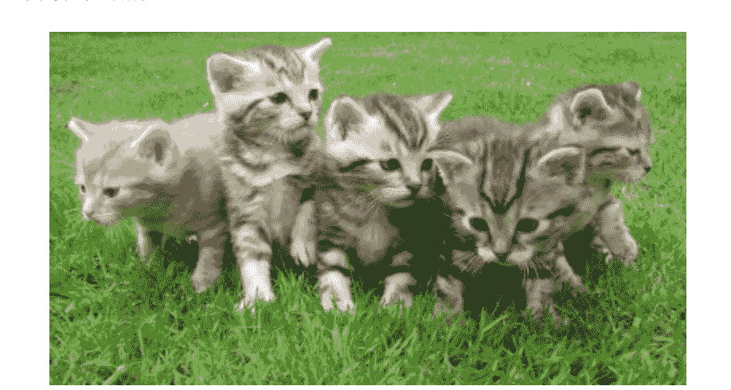

# HTML 链接——如何将图像转换成链接，并在段落中嵌套链接

> 原文：<https://www.freecodecamp.org/news/how-to-turn-text-and-images-into-links-using-html/>

有时你会想在段落中嵌套链接或者将一张图片变成一个链接。但是如何在 HTML 中做到这一点呢？

在本文中，我将展示如何在段落中嵌套链接，以及如何使用代码示例将图像转换为链接。

## **如何在段落标签中嵌套锚点标签**

如果你想在你的段落中包含链接，那么你可以在段落标签中嵌套锚点标签。

在第一个例子中，我们有文本“我爱 freeCodeCamp”。

```
<p>I love freeCodeCamp</p>
```

如果我想将单词 freeCodeCamp 转换成一个链接，那么我会将它包装在一组锚标签中。

```
<p>I love <a href="https://www.freecodecamp.org/">freeCodeCamp</a></p>
```

我们还可以添加`target="_blank"`属性，让该链接在新的选项卡中打开。

```
<p>I love <a target="_blank" href="https://www.freecodecamp.org/">freeCodeCamp</a></p>
```

当你将鼠标悬停在单词 freeCodeCamp 上时，你会注意到它是一个链接，你现在可以点击它将你引导到该网站。

[https://codepen.io/jessica-wilkins/embed/preview/BaYVREm?default-tabs=html%2Cresult&height=300&host=https%3A%2F%2Fcodepen.io&slug-hash=BaYVREm](https://codepen.io/jessica-wilkins/embed/preview/BaYVREm?default-tabs=html%2Cresult&height=300&host=https%3A%2F%2Fcodepen.io&slug-hash=BaYVREm)

当你想引导你的用户到关于页面主要内容的附加信息时，在段落标签中嵌套链接是很有帮助的。

在下一个例子中，我有一段谈到了 freeCodeCamp 提供的课程。

```
<p>I started learning how to code using freeCodeCamp. I really enjoyed their Responsive Web Design course. I am looking forward to starting the JavaScript course soon.</p>
```

我想先把 freeCodeCamp 这个词变成一个链接，把人们引向网站。

```
<p>I started learning how to code using  <a href="https://www.freecodecamp.org/">freeCodeCamp</a>. I really enjoyed  their Responsive Web Design course. I am looking forward to starting the  JavaScript course soon.</p>
```

现在，我将添加另一个“响应式网页设计课程”的链接，它将引导人们学习基于项目的课程。

```
<p>I started learning how to code using  <a href="https://www.freecodecamp.org/">freeCodeCamp</a>. I really enjoyed  their  <a href="https://www.freecodecamp.org/learn/2022/responsive-web-design/">Responsive Web Design course</a>. I am looking forward to starting the JavaScript course soon.</p>
```

最后，我将添加一个 JavaScript 课程的链接，它将引导用户学习 JavaScript 课程。

```
<p>I started learning how to code using <a href="https://www.freecodecamp.org/">freeCodeCamp</a>. I really enjoyed their <a href="https://www.freecodecamp.org/learn/2022/responsive-web-design/">Responsive Web Design course</a>. I am looking forward to starting the <a href="https://www.freecodecamp.org/learn/javascript-algorithms-and-data-structures/">JavaScript course</a> soon.</p>
```

这是 web 浏览器中的最终结果:

[https://codepen.io/jessica-wilkins/embed/preview/ExQRmqY?default-tabs=html%2Cresult&height=300&host=https%3A%2F%2Fcodepen.io&slug-hash=ExQRmqY](https://codepen.io/jessica-wilkins/embed/preview/ExQRmqY?default-tabs=html%2Cresult&height=300&host=https%3A%2F%2Fcodepen.io&slug-hash=ExQRmqY)

## 如何把一张图片变成一个链接

在 HTML 中，我们可以使用``元素在页面上添加图像。在这个例子中，我们添加了五只猫的图像。

```

```



如果我们想让那张图片成为一个可点击的链接，那么我们可以把它放在一组锚定标签中。

```
<a href="https://en.wikipedia.org/wiki/Cat"></a>
```

我们还可以添加`target="_blank"`属性，让该链接在新的选项卡中打开。

```
<a target="_blank" href="https://en.wikipedia.org/wiki/Cat"></a>
```

当您将鼠标悬停在图像上时，您会看到光标指针，指示它是一个链接，将您导向一篇关于猫的文章。

[https://codepen.io/jessica-wilkins/embed/preview/XWZYRgy?default-tabs=html%2Cresult&height=300&host=https%3A%2F%2Fcodepen.io&slug-hash=XWZYRgy](https://codepen.io/jessica-wilkins/embed/preview/XWZYRgy?default-tabs=html%2Cresult&height=300&host=https%3A%2F%2Fcodepen.io&slug-hash=XWZYRgy)

## **结论**

在这篇文章中，我们学习了如何在段落中嵌套锚标签，以及如何将图片转化为链接。

要在段落中添加链接，我们可以在段落标签中嵌套锚点标签。

```
<p>I love <a href="https://www.freecodecamp.org/">freeCodeCamp</a></p>
```

为了将图像转换成链接，我们可以在锚标记中嵌套一个`img`元素。

```
<a href="https://en.wikipedia.org/wiki/Cat"></a>
```

我希望您喜欢这篇文章，并祝您的编程之旅好运。