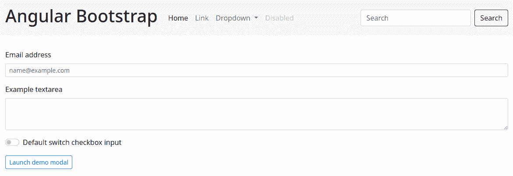

# 如何将引导程序添加到 Angular 应用程序中

> 原文：<https://www.freecodecamp.org/news/how-to-add-bootstrap-css-framework-to-an-angular-application/>

在本文中，我们将使用最新版本的 Angular 构建一个 web 应用程序。然后，我们将添加引导 CSS 框架，它提供了丰富的响应界面组件。

让我们开始吧。

## 先决条件

在开始之前，您需要安装和配置下面的工具来创建 Angular 应用程序。

*   Git 是一个分布式版本控制系统，我们将用它来同步存储库。
*   [Node.js 和 npm](https://nodejs.org/) : Node.js 是基于 Google 的 V8 引擎的 JavaScript 代码运行时软件。npm 是 Node.js 的包管理器(节点包管理器)。我们将使用这些工具来构建和运行 Angular 应用程序并安装库。
*   Angular CLI : Angular CLI 是 Angular 的命令行实用工具，我们将使用它来创建 Angular 应用程序的基础结构。
*   IDE(像 [Visual Studio Code](https://code.visualstudio.com/) 或者 [WebStorm](https://www.jetbrains.com/webstorm/) ):集成开发环境是一个带有图形界面的工具，可以帮助你开发应用程序。我们将使用一个来开发我们的角度应用程序。

## 如何创建角度应用程序

[Angular](https://angular.io/) 是一个使用 HTML、CSS 和 TypeScript (JavaScript)构建 web、移动和桌面应用的开发平台。目前，Angular 处于版本 13，Google 是该项目的主要维护者。

Bootstrap 是一个开源的 CSS 框架，它有许多用于构建响应性 web 界面的组件。

让我们使用带有路线文件和 SCSS 风格格式的`@angular/cli`来创建具有角度基础结构的应用程序。

```
ng new angular-bootstrap
? Would you like to add Angular routing? Yes
? Which stylesheet format would you like to use? SCSS   [ https://sass-lang.com/documentation/syntax#scss                ]
CREATE angular-bootstrap/README.md (1062 bytes)
CREATE angular-bootstrap/.editorconfig (274 bytes)
CREATE angular-bootstrap/.gitignore (604 bytes)
CREATE angular-bootstrap/angular.json (3273 bytes)
CREATE angular-bootstrap/package.json (1079 bytes)
CREATE angular-bootstrap/tsconfig.json (783 bytes)
CREATE angular-bootstrap/.browserslistrc (703 bytes)
CREATE angular-bootstrap/karma.conf.js (1434 bytes)
CREATE angular-bootstrap/tsconfig.app.json (287 bytes)
CREATE angular-bootstrap/tsconfig.spec.json (333 bytes)
CREATE angular-bootstrap/src/favicon.ico (948 bytes)
CREATE angular-bootstrap/src/index.html (302 bytes)
CREATE angular-bootstrap/src/main.ts (372 bytes)
CREATE angular-bootstrap/src/polyfills.ts (2820 bytes)
CREATE angular-bootstrap/src/styles.scss (80 bytes)
CREATE angular-bootstrap/src/test.ts (743 bytes)
CREATE angular-bootstrap/src/assets/.gitkeep (0 bytes)
CREATE angular-bootstrap/src/environments/environment.prod.ts (51 bytes)
CREATE angular-bootstrap/src/environments/environment.ts (658 bytes)
CREATE angular-bootstrap/src/app/app-routing.module.ts (245 bytes)
CREATE angular-bootstrap/src/app/app.module.ts (393 bytes)
CREATE angular-bootstrap/src/app/app.component.scss (0 bytes)
CREATE angular-bootstrap/src/app/app.component.html (23809 bytes)
CREATE angular-bootstrap/src/app/app.component.spec.ts (1090 bytes)
CREATE angular-bootstrap/src/app/app.component.ts (222 bytes)
✔ Packages installed successfully.
    Successfully initialized git. 
```

现在我们需要安装`bootstrap`和`bootstrap-icons`库，它们包含具有 Bootstrap 样式和 JavaScript 代码的文件，如下所示:

```
npm install bootstrap bootstrap-icons 
```

安装后，我们将配置`bootstrap`和`bootstrap-icons`库。更改`angular.json`文件，增加`bootstrap.scss`、`bootstrap-icons.css`和`bootstrap.bundle.min.js`文件如下:

```
"styles": [
  "node_modules/bootstrap/scss/bootstrap.scss",
  "node_modules/bootstrap-icons/font/bootstrap-icons.css",
  "src/styles.scss"
],
"scripts": [
  "node_modules/bootstrap/dist/js/bootstrap.bundle.min.js"
] 
```

现在我们将安装包含本机角度支持的`@ng-bootstrap/ng-bootstrap`库:

```
npm install @ng-bootstrap/ng-bootstrap@next 
```

安装后，我们将导入`NgbModule`模块。更改`app.module.ts`文件并添加如下行:

```
import { NgbModule } from '@ng-bootstrap/ng-bootstrap';

imports: [
  BrowserModule,
  NgbModule,
  AppRoutingModule,
], 
```

现在我们将从`src/app/app.component.ts`文件中删除`AppComponent`类的内容。导入`NgbModal`服务并创建`open`方法来打开一个模态，如下所示。

```
import { Component } from '@angular/core';
import { NgbModal } from '@ng-bootstrap/ng-bootstrap';

@Component({
  selector: 'app-root',
  templateUrl: './app.component.html',
  styleUrls: ['./app.component.scss'],
})
export class AppComponent {

  constructor(private modalService: NgbModal) {
  }

  public open(modal: any): void {
    this.modalService.open(modal);
  }

} 
```

接下来我们将删除`src/app/app.component.html`文件的内容。在 HTML 中添加一些组件来查看和测试这些组件，如下所示。

```
<nav class="navbar navbar-expand-sm navbar-light bg-light">
  <div class="container-fluid">
    <a class="navbar-brand" href="#">
      <h1>Angular Bootstrap</h1>
    </a>
    <button class="navbar-toggler" type="button" data-bs-toggle="collapse" data-bs-target="#navbarSupportedContent" aria-controls="navbarSupportedContent" aria-expanded="false" aria-label="Toggle navigation">
      <span class="navbar-toggler-icon"></span>
    </button>
    <div class="collapse navbar-collapse" id="navbarSupportedContent">
      <ul class="navbar-nav me-auto mb-2 mb-lg-0">
        <li class="nav-item">
          <a class="nav-link active" aria-current="page" href="#">Home</a>
        </li>
        <li class="nav-item">
          <a class="nav-link" href="#">Link</a>
        </li>
        <li class="nav-item dropdown">
          <a class="nav-link dropdown-toggle" href="#" id="navbarDropdown" role="button" data-bs-toggle="dropdown" aria-expanded="false">
            Dropdown
          </a>
          <ul class="dropdown-menu" aria-labelledby="navbarDropdown">
            <li><a class="dropdown-item" href="#">Action</a></li>
            <li><a class="dropdown-item" href="#">Another action</a></li>
            <li><hr class="dropdown-divider"></li>
            <li><a class="dropdown-item" href="#">Something else here</a></li>
          </ul>
        </li>
        <li class="nav-item">
          <a class="nav-link disabled" href="#" tabindex="-1" aria-disabled="true">Disabled</a>
        </li>
      </ul>
      <form class="d-flex">
        <input class="form-control me-2" type="search" placeholder="Search" aria-label="Search">
        <button class="btn btn-outline-success" type="submit">Search</button>
      </form>
    </div>
  </div>
</nav>
<div class="container-fluid py-3">
  <div class="row my-3">
    <div class="col">
      <label for="exampleFormControlInput1" class="form-label">Email address</label>
      <input type="email" class="form-control form-control-sm" id="exampleFormControlInput1" placeholder="name@example.com">
    </div>
  </div>
  <div class="row my-3">
    <div class="col">
      <label for="exampleFormControlTextarea1" class="form-label">Example textarea</label>
      <textarea class="form-control form-control-sm" id="exampleFormControlTextarea1" rows="3"></textarea>
    </div>
  </div>
  <div class="row my-3">
    <div class="col">
      <div class="form-check form-switch">
        <input class="form-check-input" type="checkbox" id="flexSwitchCheckDefault">
        <label class="form-check-label" for="flexSwitchCheckDefault">Default switch checkbox input</label>
      </div>
    </div>
  </div>
  <div class="row my-3">
    <div class="col">
      <button class="btn btn-sm btn-outline-primary" (click)="open(demoModal)">Launch demo modal</button>
    </div>
  </div>
</div>

<ng-template #demoModal let-modal>
  <div class="modal-header">
    <h4 class="modal-title" id="modal-basic-title">Profile update</h4>
    <button type="button" class="btn-close" data-bs-dismiss="modal" aria-label="Close" (click)="modal.dismiss('Cross click')"></button>
  </div>
  <div class="modal-body">
    <form>
      <div class="form-group">
        <label for="dateOfBirth">Date of birth</label>
        <div class="input-group">
          <input id="dateOfBirth" name="dateOfBirth" class="form-control" placeholder="yyyy-mm-dd" ngbDatepicker #dp="ngbDatepicker">
          <button type="button" class="btn btn-outline-secondary bi bi-calendar" (click)="dp.toggle()"></button>
        </div>
      </div>
    </form>
  </div>
  <div class="modal-footer">
    <button type="button" class="btn btn-outline-dark" (click)="modal.close('Save click')">Save</button>
  </div>
</ng-template> 
```

最后，我们将使用下面的命令运行应用程序:

```
npm start

> angular-bootstrap@1.0.0 start
> ng serve

✔ Browser application bundle generation complete.

Initial Chunk Files | Names         |      Size
vendor.js           | vendor        |   3.38 MB
styles.css          | styles        | 255.86 kB
polyfills.js        | polyfills     | 128.56 kB
scripts.js          | scripts       |  76.94 kB
main.js             | main          |  22.81 kB
runtime.js          | runtime       |   6.59 kB

                    | Initial Total |   3.86 MB

Build at: 2021-06-27T21:28:22.756Z - Hash: 122b9fa4d57b962e7bcc - Time: 21933ms

** Angular Live Development Server is listening on localhost:4200, open your browser on http://localhost:4200/ **

✔ Compiled successfully. 
```

准备好了。我们将在`http://localhost:4200/`访问 URL，并检查应用程序是否工作。你可以看到应用程序在 [GitHub 页面](https://rodrigokamada.github.io/angular-bootstrap/)和 [Stackblitz](https://stackblitz.com/edit/angular13-bootstrap) 上工作。



应用程序存储库可在[https://github.com/rodrigokamada/angular-bootstrap](https://github.com/rodrigokamada/angular-bootstrap)获得。

## **结论**

让我们总结一下本文所涵盖的内容:

*   我们创建了一个角度应用程序。
*   我们添加了一些引导 CSS 框架组件。

您可以使用本文来创建丰富且响应迅速的应用程序，以提供更好的用户体验和更高的可用性。

感谢您的阅读，我希望你喜欢这篇文章！

这篇教程用葡萄牙语发布在我的博客上。

为了在我发布新文章时保持更新，请在 Twitter 上关注我。