# PHP 教程-如何为你的项目设置 PHP 和 XAMPP

> 原文：<https://www.freecodecamp.org/news/how-to-get-started-with-php/>

大家好，欢迎来到本教程。今天，我们将看看如何在项目中设置和使用 PHP。

但是在我们开始之前，我们需要了解 PHP 是什么。

## PHP 是什么？

PHP 是“超文本预处理器”的缩写。它是一种基于 web 的开源服务器端脚本语言，集成在您的 HTML 文件中。

您可以用它来制作既能响应数据库又能与数据库交互的网页。

## PHP 的优势

PHP 有很多好处，下面是其中的一些:

### PHP 很容易使用

学习和使用 PHP 不需要大量的学习，因为它的语法是合理的和组织良好的。命令功能也很容易使用，因为它们可以帮助您准确理解它们的作用。

### PHP 是灵活的

灵活性是每种脚本语言都应该具备的主要优势，PHP 也不例外。即使项目已经启动，PHP 开发人员也有能力对项目进行修改。

### PHP 帮助你从表单中收集数据

您可以使用 PHP 从用 HTML 创建的表单中收集数据(如姓名、电子邮件、电话号码或密码)。许多网站使用 PHP 的这个特殊功能。

### PHP 有很好的安全性

PHP 不外包从表单中收集的数据或信息。这是大多数网站和社交媒体应用程序使用它的部分原因，因为它有一个安全的数据库系统。

## 如何在你的项目中安装和设置 PHP

要开始使用 PHP，你需要三样东西:一个用于编写代码的代码编辑器、一个已安装的 PHP 版本和 XAMPP。

在这个例子中，我们将使用 Visual Studio 代码，我将教你如何在你的电脑上安装一个版本的 PHP 和 XAMPP。

进入 [PHP 网站](https://www.php.net/)，点击导航栏中的下载。当前版本应该在顶部。

点击“Windows 下载”，当它打开时，向下滚动一点，您应该会看到一个部分，其中有“VS16 x64 线程安全(2022-May-11 09:29:42)”该部分包含一个“zip”文件，点击它，等待您的下载完成。

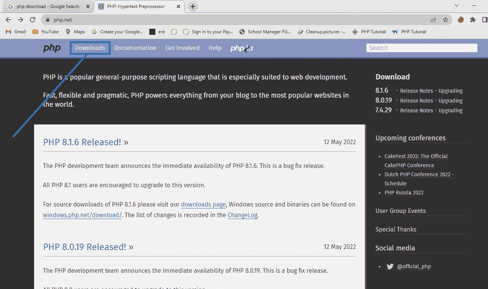

Click on the Download Button

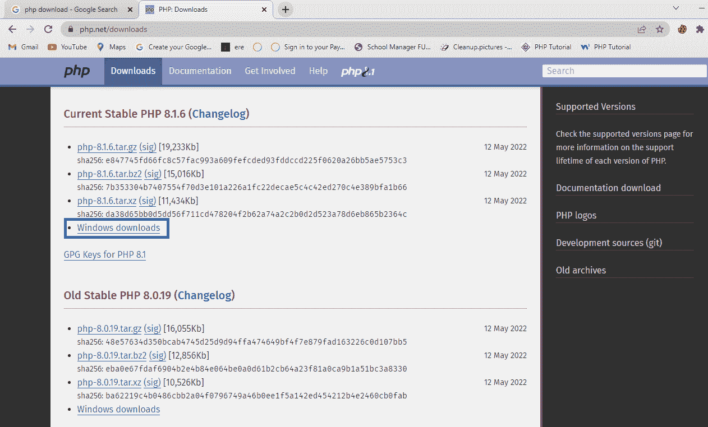

Click on Windows downloads

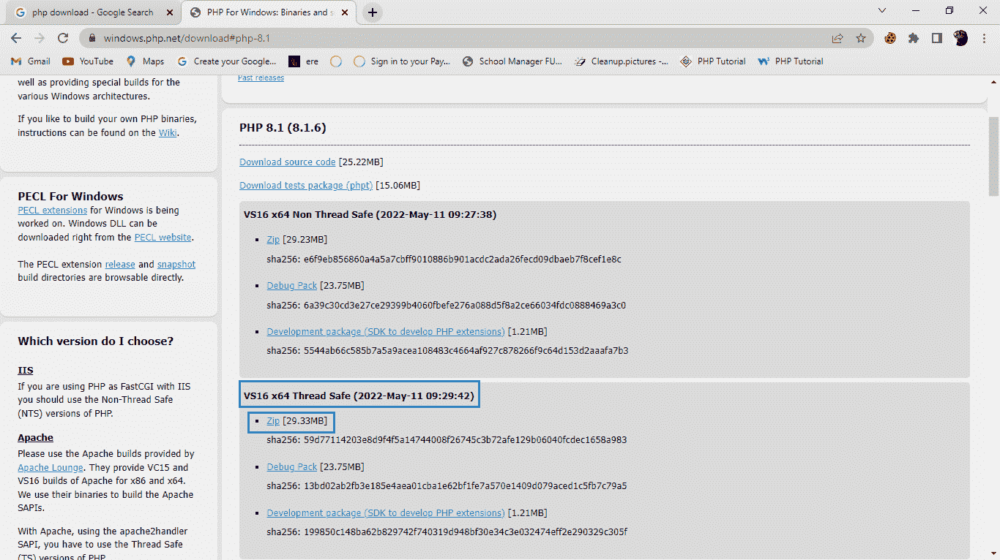

Below Thread Safe click on the zip file to download

下载完成后，进入你电脑的下载文件夹，寻找一个 PHP 压缩文件。右键单击它并选择提取文件。将文件保存到本地驱动器很重要。

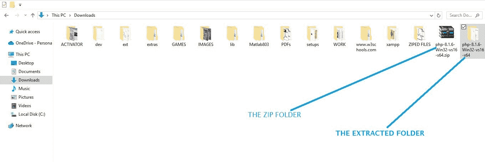

Zip folder and the extracted folder

打开本地磁盘，打开解压后的 PHP 文件夹。在显示当前目录的栏上单击一次，然后复制目录的名称，应该是这样的格式:C:\php-8.1.6。


Click the bar once and copy the Directory name 

在 windows 栏中，搜索“编辑系统环境属性”。点击“环境变量”按钮，点击“路径”，然后点击下面的编辑按钮。它打开了一个可以创建新变量的空间。

因此，单击 new 按钮，然后粘贴您之前复制的目录的名称(应该是“C:\php-8.1.6”)，并单击 ok。

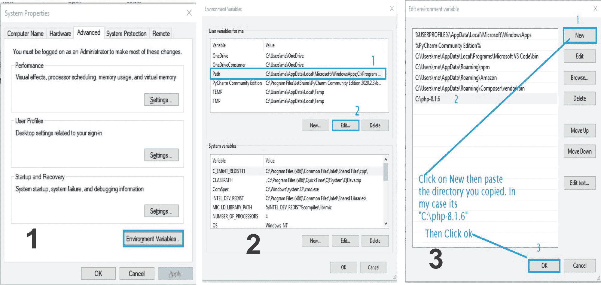

要测试 PHP 现在是否安装在您的计算机上，请使用搜索关键字`cmd`在 Windows 中搜索命令提示符。打开它，然后输入`php --version`并点击输入。您应该会看到类似这样的内容:

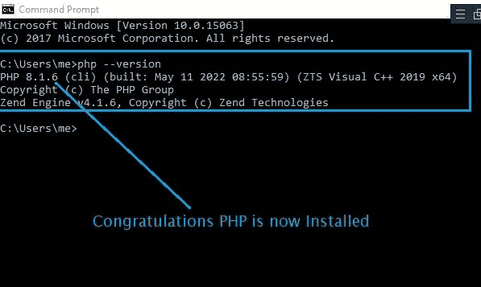

PHP version 8.1.6

如上图所示，当前版本的 PHP 安装在我们的电脑上。下一步是找到 XAMPP。

## 什么是 XAMPP？

首字母缩写词 XAMPP 代表跨平台、Apache、MySQL、PHP 和 Perl。XAMPP 是一个免费的开源网络服务器，允许你在本地服务器上开发、测试和建立网站。

与 PHP 不同，XAMPP 安装非常简单。在你的浏览器中搜索“XAMPP 下载”或者去他们的[网站](https://www.apachefriends.org/index.html)。当它打开时，您应该会看到当前版本的 Windows、Linux 和 OSX 版 XAMPP。

因为我用的是 Windows 电脑，我只需点击 Windows 电脑，下载就应该开始了。

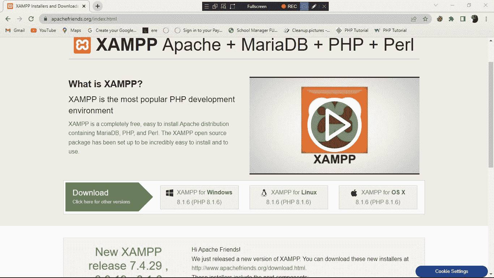

Click the XAMPP for Windows if you are using Windows

下载完成后，进入你的下载，右键点击安装文件并选择“以管理员身份运行”。

这将带您进入 **Setup-xampp** 向导:

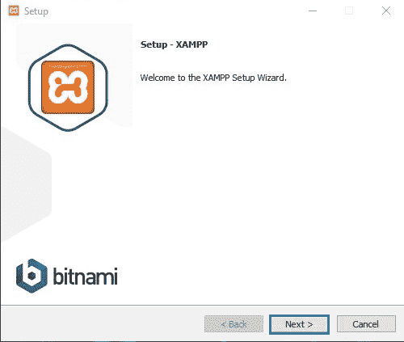

click next

单击下一步，您将能够选择您想要的组件:

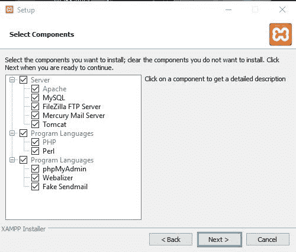

**Select components and click next**

然后你会来到安装文件夹。你必须选择一个文件夹来安装 XAMPP。我建议在你的本地磁盘上创建一个文件夹来安装 XAMPP。

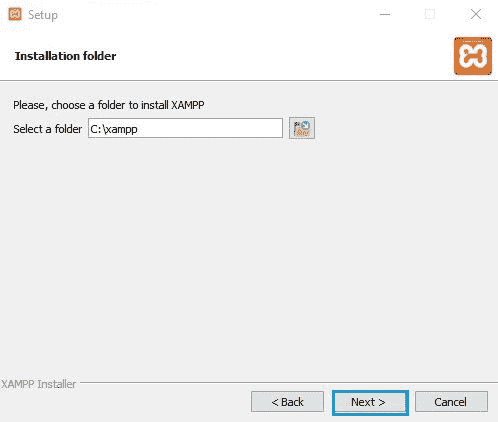

select an installation folder

然后你将选择语言。您可以选择英语或德语(由您选择):

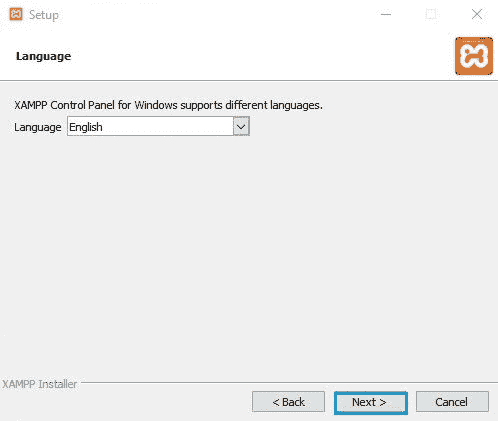

select language

现在你将得到 XAMPP 的比特纳米:

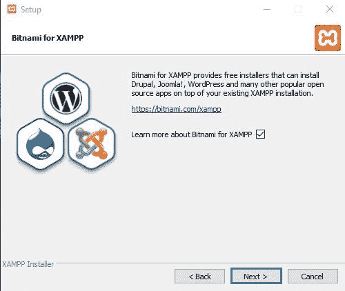

click next

您已经准备好安装:

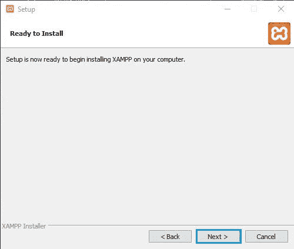

click next

安装过程完成时，请耐心等待。完成后，单击确定。

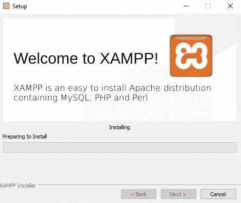

wait for the installation to complete

一旦安装过程完成，您现在可以在您的项目中使用 XAMPP。

## 你为什么需要 XAMPP？

要运行 the web，你需要安装一个像 Apache 这样的 web 服务器和一个像 MySQL 这样的数据库——这两个都是 XAMPP 支持的。

XAMPP 是一个本地服务器，可以在我们的个人电脑上流畅运行，在 Windows 和 Linux 上都可以接受。它还可以帮助您在将网站发布到 web 服务器之前测试网站，看看它们是否工作正常。

## 如何用 XAMPP 运行 PHP

要用 XAMPP 运行 PHP，你必须经历一些步骤，我将把它分解一下，这样你就能理解了。

首先，打开本地存储文件夹，转到“xampp”文件夹并打开它。您应该会看到一个名为“htdocs”的文件夹。打开它，然后在其中创建一个新文件夹。在我的例子中，我把我创建的文件夹命名为“Demo”(所以给你的文件夹起你自己选择的名字)。

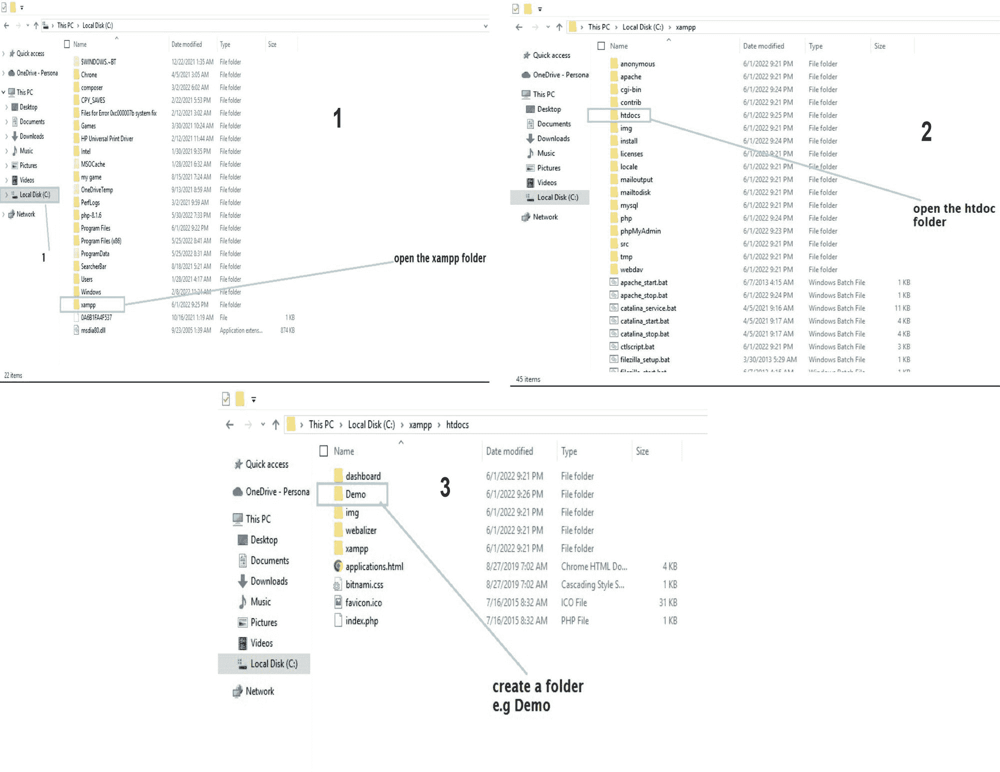

接下来，打开您的 VS 代码，点击 open folder，然后转到保存您创建的文件夹的位置(在我的例子中，我将它命名为“Demo”)。创建一个扩展名为`.php`的文件——在我的例子中，我将自己的文件命名为`test.php`。扩展`.php`告诉代码编辑器我们正在处理一个 PHP 代码/项目。


create a file with an extension of .php

PHP 是用`<?php (Code goes in here) ?>`标签运行的。开始标签是`<?php`，然后你的 PHP 代码在结束标签`?>`之前。例如:

```
<?php
echo “<h1> My Name is Derek </h2>;
?>
```

echo 关键字告诉浏览器显示`My Name is Derek`，而`<h1></h1>`告诉 web 浏览器将文本格式化为加粗/更大。那就省省吧。

编写完代码后，打开 XAMPP 控制面板，通过单击 action 部分下的 start 来启动 Apache 模块。

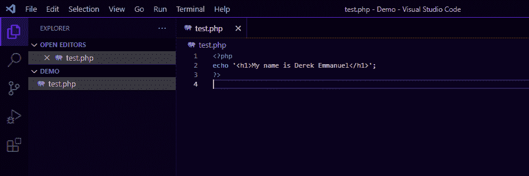

然后转到您的 web 浏览器，在搜索栏中键入`localhost/Demo/test.php`，然后输入。您的网络浏览器应该会显示:

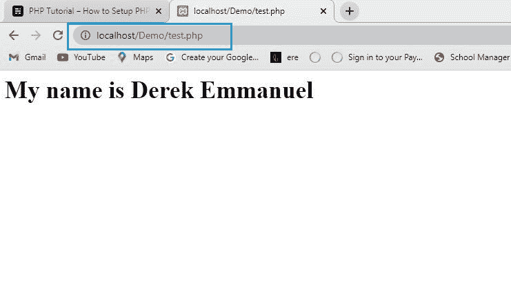

web display

如果您的代码显示在 web 浏览器上，那么恭喜您！你站起来了。

## 结论

非常感谢您跟随本教程。我希望你能从这一课中获得一些价值，我希望你能尝试使用 PHP 和 XAMPP。

请继续关注我的下一篇教程。

祝编码愉快！