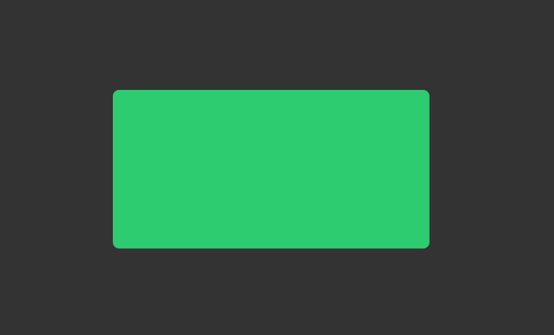
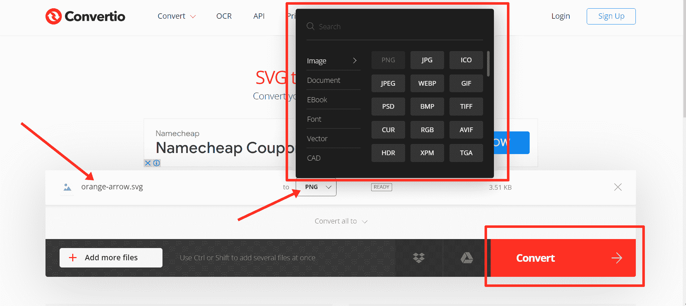

# 什么是 SVG 文件？

> 原文：<https://www.freecodecamp.org/news/what-is-an-svg-file/>

SVG 代表可缩放矢量图形。这是一种网页友好的基于矢量的文件格式，用于在互联网上呈现二维图像。

您可以通过扩展名–`.svg`来识别 SVG 文件。

与其他流行的图像格式(如 PNG、JPEG 和 JPG，它们以像素的形式存储图像信息，因为它们是基于光栅的格式)不同，SVG 将图形信息存储为一组点和线。

这意味着无论 SVG 文件如何修改、缩放或调整大小，它们都不会像 PNG、JPG 和其他光栅图像那样变得模糊和像素化。

本文将向您展示 SVG 图像文件的可能性，以及如何通过编码为自己制作一个。

## 目录

*   [如何制作 SVG 文件](#howtomakeansvgfile)
    *   [如何用图像编辑程序制作 SVG](#howtomakeansvgwithimageeditingprograms)
    *   [如何用 XML 制作 SVG](#howtomakeansvgwithxml)
*   [SVG 文件有什么用途？](#whatisansvgfileusedfor)
*   [如何打开 SVG 文件](#howtoopenansvgfile)
*   如何将 SVG 文件转换成图像？
*   [结论](#conclusion)

## 如何制作一个 SVG 文件

### 如何用图像编辑程序制作 SVG

您可以使用 Adobe Illustrator、CorelDraw、Adobe Photoshop、Microsoft Visio 和 GIMP 等图像编辑软件制作 SVG 文件。

有了这些程序，当你画 SVG 的时候，你的创造力就是你的极限。

这取决于你对程序的了解和经验。

此外，如果您使用 Google Docs 创建插图和绘图，您可以将它们导出到 SVG。

### 如何用 XML 制作 SVG

如果你不知道如何使用上面列出的图像编辑程序，但是你会编码，你可以用 XML 编码一个 SVG。

要编码一个 SVG，创建一个扩展名为`.svg`:
的文件

**步骤 1** :定义您的 SVG 开始和结束标签

```
<svg>
    <!--  -->
</svg> 
```

**第二步**:在开始标签中定义版本和`xmlns`属性，分别设置为`1.1`和`"http://www.w3.org/2000/svg"`。

```
<svg version="1.1" >

</svg> 
```

**第三步**:在自结束标签中指定想要绘制的形状。例如，`<rect>`为长方形。

```
<svg version="1.1" >
    <rect />
</svg> 
```

**第四步**:指定你想要的宽度和高度:

```
 width="200" height="100" 
```

**第五步**:用`fill`属性定义你想要填充形状的颜色:

```
fill="#2ecc71" 
```

代码现在如下面的代码片段所示:

```
<svg version="1.1" >
    <rect width="200" height="100" fill="#2ecc71" />
</svg> 
```

最后，这是浏览器中显示的内容:


您也可以使用`rx`和`ry`属性在`x`和`y`轴上定义边界半径:

```
<svg version="1.1" >
    <rect width="200" height="100" fill="#2ecc71" rx="4" ry="4" />
</svg> 
```



绘制完 SVG 后，您可以将它用作图像源(`src`)的值:

```
 
```

如果您愿意，可以将 SVG 直接嵌入到 HTML 代码中:

```
<body>
    <svg version="1.1" >
      <rect width="200" height="100" fill="#2ecc71" />
    </svg>
</body> 
```

## SVG 文件是用来做什么的？

因为 SVG 文件终身不变，所以网站图标和徽标通常都是用它们制作的。

SVG 的一个突出优点是其中的文本可以被像 Google 这样的搜索引擎读取，所以 SVG 文件被用来制作信息图和插图。

## 如何打开一个 SVG 文件

现代浏览器如 Google Chrome、Edge、Safari 和 Firefox 都有内置功能，可以为你打开 SVG 文件。

您也可以在专门的编辑软件中打开 SVG 文件来制作它们。同样，例子有 Adobe Illustrator、CorelDraw、Adobe Photoshop、Microsoft Visio 和 GIMP。

如果你想编辑 SVG 文件，你可以用代码编辑器打开它们，比如 VS Code、Atom 和 Sublime Text，然后进行编辑。

## 如何将 SVG 文件转换成图像？

如果您想将 SVG 转换为其他图像格式，如 PNG 和 JPG，您可以使用图像编辑程序，如 Adobe Photoshop。

你也可以使用名为 [Convertio](https://convertio.co/svg-png/) 的在线工具。

你所需要做的就是上传你的 SVG，然后选择你想要转换成的格式。


## 结论

您应该使用 SVG 的原因有很多。

我最喜欢的原因是搜索引擎可以读取 SVG 文件中的文本。这是因为 SVG 文件是用纯 XML 编写的——用于传输数字数据的标记语言。

如果 Google 和其他搜索引擎在 SVG 文件中找到相关的关键字，这将极大地提高 SEO。

感谢您的阅读。