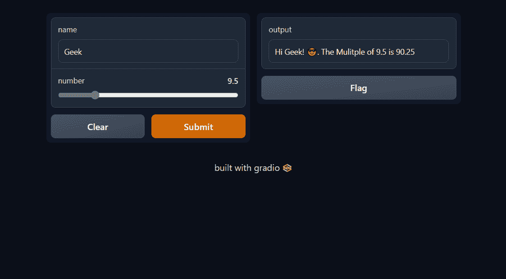
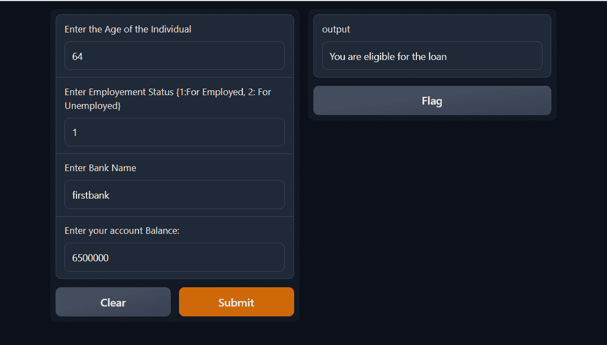

# 如何使用 Gradio 将机器学习模型部署为 Web 应用程序

> 原文：<https://www.freecodecamp.org/news/how-to-deploy-your-machine-learning-model-as-a-web-app-using-gradio/>

你已经建立了 99%准确的机器学习模型，现在你欣喜若狂。你就像 yaaaaaaaaay！我的模型表现很好。

然后你停顿了一下，你就像——现在怎么办？

首先，您可能会想到将您的代码上传到 GitHub，并向人们展示您的 Jupyter 笔记本文件。它包括你使用 Seaborn 创建的那些华丽的可视化，那些非常强大的集合模型，以及它们如何能够通过它们的评估指标等等。

但是你注意到没有人和它互动。

好吧，我的朋友，为什么不试着将模型部署为一个 web 应用程序，这样非技术人员也可以与模型进行交互？因为只有像你这样的程序员才有可能理解第一种方法。

有几种方法可以部署您的模型，但是在本文中我们将重点介绍其中的一种:使用 Gradio。我看得出你很兴奋。好吧，放松享受，因为这将是一次令人兴奋的旅程。

# 先决条件

在开始这一旅程之前，我假设您具备以下知识:

1.  您知道如何用 Python 创建用户定义的函数
2.  你可以建立并拟合一个 ML 模型
3.  您的环境已经设置好了

# 格拉迪欧是什么？

Gradio 是一个免费的开源 Python 库，允许你为你的机器学习模型开发一个易于使用的可定制组件演示，任何人都可以在任何地方使用。

Gradio 集成了最流行的 Python 库，包括 Scikit-learn、PyTorch、NumPy、seaborn、pandas、Tensor Flow 等。

它的一个优点是，它允许你与你目前在 Jupyter 或 Colab 笔记本上开发的 web 应用程序进行交互。它有许多独特的功能，可以帮助您构建一个用户可以与之交互的 web 应用程序。

# 如何安装 Gradio

要使用 Gradio，我们必须首先在本地 PC 上安装它的库。因此，转到您的 Conda PowerShell 或终端并运行以下命令。如果您正在使用 Google Colab，您还可以键入以下内容:

```
pip install gradio 
```

我们现在已经在本地电脑上安装了 Gradio。让我们回顾一下 Gradio 的一些基础知识，这样我们就可以熟悉这个库了。

首先，我们必须将库导入到我们的笔记本或 IDE 中，无论您使用哪一个。我们可以通过键入以下命令来做到这一点:

```
import gradio as gr 
```

# 如何创建您的第一个 Web 应用程序

在本教程中，我们将创建一个示例问候应用程序来熟悉 Gradio 的基础知识。

为此，我们需要编写一个问候函数，因为 Gradio 使用 Python 用户定义的函数。因此，我们的问候函数如下所示:

```
def greet_user(name):
	return "Hello " + name + " Welcome to Gradio!😎" 
```

我们现在需要在 Gradio 上部署 Python 函数，以便它可以充当 web 应用程序。为此，我们键入:

```
app =  gr.Interface(fn = greet_user, inputs="text", outputs="text")
app.launch() 
```

在运行上面的代码之前，让我们仔细检查一下代码中发生了什么。

这个属性是 Gradio 中任何事物的基础。它是用户界面，显示将在 web 上显示的所有组件。

参数`fn`:这是您创建的想要提供给 Gradio 的 Python 函数。

`inputs`参数:这些是您希望传递到您创建的函数中的组件，比如单词、图像、数字、音频等等。在我们的例子中，我们创建的函数需要文本，所以我们将它输入到输入参数中。

`output`参数:这个参数允许你在界面上显示你想看到的组件。因为我们在这个例子中创建的函数需要显示文本，所以我们为 outputs 参数提供了文本组件。

`app.launch`用于启动应用程序。当您运行上面的代码时，您应该会看到这样的内容:


一旦 Gradio 界面出现，只需输入你的名字并点击提交。然后它在我们上面创建的函数中输出结果。现在我们已经完成了，在学习如何部署我们的模型之前，让我们再回顾一下 Gradio 中的一件事情。

我们将创建一个 Gradio 应用程序，它可以接受两个输入并提供一个输出。这个应用程序只是要求你的名字和一个值，然后输出你的名字以及你输入的值的倍数。为此，只需键入以下代码:

```
def return_multiple(name, number):
    result = "Hi {}! 😎. The Mulitple of {} is {}".format(name, number, round(number**2, 2))
    return result

app = gr.Interface(fn = return_multiple, inputs=["text", gr.Slider(0, 50)], outputs="text")
app.launch() 
```



现在我们已经完成了，让我们快速回顾一下我们在这里做的一些你可能不熟悉的事情。

输入参数:在输入参数中，我们创建了一个包含两个组件的列表，文本和滑块。滑块也是 Gradio 的属性之一，当您滑过给定范围时，它会返回一个浮点值。我们使用它是因为在我们创建的函数中，我们期望一个文本和一个值。

我们必须对输入参数中的组件进行排序，就像我们在上面创建的函数中对属性进行排序一样。也就是说，数字之前先有文本。所以我们期望的输出实际上是一个字符串。我们只是在上面的函数中做了一些格式化。

现在我们已经熟悉了 Gradio 的一些基础知识，让我们创建一个将要部署的模型。

# 如何在 Gradio 上部署机器学习模型

在这一节中，我将使用一个分类模型，这个模型是我以前训练并保存在 pickle 文件中的。

当您创建一个需要长时间训练的模型时，最有效的处理方法是在训练完成后将其保存在 pickle 文件中，这样您就不必再次经历训练模型的压力。

如果您想将模型保存为 pickle 文件，让我向您展示如何做到这一点。首先导入 pickle 库，然后键入下面的代码。假设我只想拟合这样一个模型:

```
import pickle 
```

```
from sklearn.ensemble import RandomForestClassifier
clf = RandomForestClassifier(random_state=42)
clf.fit(X_train, y_train) 

# If you've fitted the model just type this to save it: Remember to change the file name
with open("filename.pkl", "wb") as f:
pickle.dump(clf, f) 
```

现在，如果您希望加载它，您也可以键入以下代码:

```
with open("filename.pkl", "rb") as f:
	clf  = pickle.load(f) 
```

现在我们已经了解了这一点，让我们创建一个函数，我们将能够传递到 Gradio，以便它可以进行预测。

```
def make_prediction(age, employment_status, bank_name, account_balance):
    with open("filename.pkl", "rb") as f:
        clf  = pickle.load(f)
        preds = clf.predict([[age, employment_status, bank_name, account_balance]])
    if preds == 1:
            return "You are eligible for the loan"
    return "You are not eligible for the loan"

#Create the input component for Gradio since we are expecting 4 inputs

age_input = gr.Number(label = "Enter the Age of the Individual")
employment_input = gr.Number(label= "Enter Employement Status {1:For Employed, 2: For Unemployed}")
bank_input = gr.Textbox(label = "Enter Bank Name")
account_input = gr.Number(label = "Enter your account Balance:")
# We create the output
output = gr.Textbox()

app = gr.Interface(fn = make_prediction, inputs=[age_input, employment_input, bank_input, account_input], outputs=output)
app.launch() 
```



所以让我们打开上面的包装:

我们将从创建输入组件的地方开始。您可以选择在`gr.Interface`中创建组件，但是在下面的代码中，我直接在`gr.Interface`外部构建它，然后将变量提供给`gr.Interface`。

所以，如果你想创建一个接收数字的组件，使用`gr.Number`，然后从我创建的输出变量，你可以像我们之前在第一个应用程序中所做的那样传递文本(如果你不想显式声明属性，那么“文本”字符串是 textbox 的简写)。

我还在每个组件中使用了 label 参数，以便用户知道该做什么。我们已经熟悉了上面提到的其他代码。现在我们已经完成了，我们的模型已经部署好了。🎉🎉😎🥳🥳.

# 结论

感谢您阅读本教程。我们在这篇文章中讨论了很多。请记住，学习 Gradio 并不止于此——你可以在他们的网站上查看更多信息。他们有关于如何创建 web 应用程序的非常直观的文档。

再次感谢您的阅读。如果你喜欢这篇文章，你可以在 LinkedIn 或 T2 Twitter 上关注我。谢谢，祝你部署愉快😀