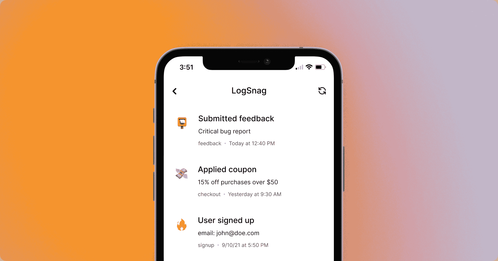
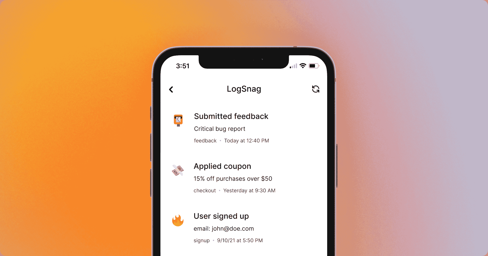
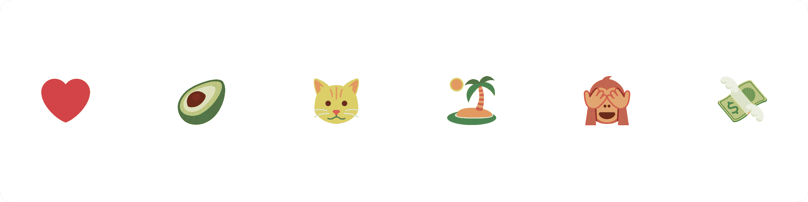

# 推特表情符号——如何在你的网站上使用推特表情符号

> 原文：<https://www.freecodecamp.org/news/how-to-use-twitter-emoji-on-your-website/>

在这篇文章中，我将解释什么是 Twitter 表情符号，以及为什么你会想使用它们。

## 为什么应该使用 Twitter 表情符号？

几个月前，我开始从事我的一个项目，我需要允许用户为他们的输入选择不同的图标。

经过一番思考后，我决定用表情符号来代替图标，因为每个人都知道它们，而且它们几乎随处可见。



Web app example with native emojis

很简单，对吧？不完全是。像所有其他东西一样，表情符号也有自己的问题，你可能不知道，除非你花一些时间和它们一起工作。

表情符号最常见的一个问题是，它们在不同操作系统甚至不同浏览器之间的设计和支持非常不一致。

例如，如果你在手机上选择了一个特定的表情符号，它在你的笔记本电脑上可能看起来非常不同，或者如果你的操作系统不支持最新的 Unicode，它可能最终显示为一个正方形或一个方框。

如果你的项目中有很多表情符号，这可能会变成一个严重的用户体验问题，并开始让你的用户感到烦恼。所以是时候让我想出一个办法，在用户开始远离这个项目之前解决这个问题了。

在做了一些研究后，我偶然发现了 Twitter 的表情符号集！Twemoji 是一个开源库，提供跨所有平台的标准表情支持。它使得跨不同操作系统和浏览器支持所有最新的表情符号变得非常容易，并且让它们看起来都一样。

这就是我所需要的，所以我毫不犹豫地将它集成到我的项目中，它解决了我所有的问题。



Web app example with Twitter emojis

好吧，这就是背景故事。现在让我们用一些代码来体验一下 Twemoji 是如何工作的。

## Twemoji 是如何工作的？

简而言之，Twemoji 对每个 Unicode 表情符号都有一个备选的 SVG 和 PNG。它允许我们从它们的 CDN 或本地导入它们，并把它们呈现为图像而不是 Unicode 文本。

这意味着它们在任何地方都受到支持，我们总是可以获得最新的表情符号。



Twemoji Examples

## 如何开始使用 Twemoji

首先，我们必须将 Twemoji 导入到 HTML 文档中。为此，让我们将以下内容复制并粘贴到文档的`<head>`标签中。

```
<script src="https://twemoji.maxcdn.com/v/latest/twemoji.min.js" crossorigin="anonymous"></script>
```

接下来，我们必须使用我们刚刚导入的库，让它将我们的 Unicode 解析成 Twemojis。

有两种方法可以解析你的表情符号，我将会介绍这两种方法，让你决定哪一种更适合你的需求。

### 解析整个正文内容

第一个更简单的选择是让 Twemoji 解析我们的整个 DOM，自动转换每个 Unicode 表情符号，并用 Twemoji 替换它。

要实现这一点，我们所要做的就是使用我们刚刚导入的包，并像这样将我们的文档体传递给它:

```
twemoji.parse(document.body);
```

一旦我们调用`twemoji.parse`并将文档主体作为参数传递给它，它将解析主体中的所有内容。它将用 Twemoji 图像取代文本 Unicode 表情符号，而不会影响任何周围的注释。

此时，您的 HTML 文档应该如下所示。一旦在浏览器中打开它，您应该会看到 Twemoji。

```
<html>
    <head>
        <script src="https://twemoji.maxcdn.com/v/latest/twemoji.min.js" crossorigin="anonymous"></script>
    </head>
    <body>
	    📮
    </body>
    <script>
	    twemoji.parse(document.body)
    </script>
</html>
```

请记住，这种方法会带来一些性能损失，因为我们要在体内的每个元素上运行这种操作，这可能会非常昂贵。

### 手动解析每个表情符号

对于我的项目，我最终选择了手动解析的方式。它让我对事情的处理方式有了更多的控制，并减少了解析整个文档的性能损失。

但是这种方法更复杂，除非你有充分的理由决定手动解析你的表情符号，而不是解析整个文档，否则我不推荐这种方法。

要理解这里的区别，了解 parse 方法的工作原理是很重要的:

如果`twemoji.parse`的第一个参数是 HTMLElement，该方法将自动解析元素并替换文档中的表情符号。但是，如果第一个元素是一个字符串，该方法将解析这个表情符号，并允许我们在一个我们可以定义的回调函数中接收数据。

回到我们的 HTML 文档，让我们将表情符号作为字符串传入，提供一个回调方法，并将参数打印到控制台。

```
const emoji = "📮"
twemoji.parse(emoji, {
	callback: (icon, options) => {
		console.log(icon, options)
	}
})

// Console output
// 1f4ee {base: 'https://twemoji.maxcdn.com/v/14.0.2/', ext: '.png', size: '72x72', callback: ƒ, attributes: ƒ, …}
```

如您所见，回调选项为我们提供了构建源 URL 并将其作为图像添加到文档中所需的所有信息。

接下来，让我们定义一个接受选项并构造源 URL 的方法。

```
function constructTwemojiURL(icon, options) {
	return ''.concat(
		options.base, 
		options.size, 
		'/',
		icon,         
		options.ext   
	);
}
```

我们现在可以从回调中调用这个方法来获取源 URL，然后创建一个新的图像标签并将其附加到我们的文档中。

```
const emoji = "📮"
twemoji.parse(emoji, {
	callback: (icon, options) => {

		// create the image tag
		const img = document.createElement('img');

		// assign the image source
		img.src = constructTwemojiURL(icon, options)        
		img.alt = "Twemoji"

		// append the tag to our document body
		document.body.append(img)

	}
})
```

最后，如果我们在浏览器中打开 HTML 文档，我们应该会看到我们的 Twemoji。此时，您的 HTML 文档应该如下所示:

```
<html>
	<head>
		<script src="https://twemoji.maxcdn.com/v/latest/twemoji.min.js" crossorigin="anonymous"></script>
	</head>
	<body></body>
	<script>
		function constructTwemojiURL(icon, options) {
			return ''.concat(
				options.base, 
				options.size, 
				'/',
				icon,         
				options.ext   
			);
		}

		const emoji = "📮"
		twemoji.parse(emoji, {
			callback: (icon, options) => {

				// create the image tag
				const img = document.createElement('img');

				// assign the image source
				img.src = constructTwemojiURL(icon, options)        
				img.alt = "Twemoji"

				// append the tag to our document body
				document.body.append(img)

			}
		})

	</script>
</html>
```

## 结论

差不多就是这样！在本文中，我们讨论了为什么您可能决定在您的 web 应用程序中使用 Twemojis，并且我们已经根据您的用例介绍了两种不同的实现方式。

如果你对我正在建设的项目感兴趣，它叫做 LogSnag。

LogSnag 是一个简单的事件跟踪工具，可以轻松地实时跟踪项目中的任何重要内容，并接收个性化的推送通知。你可以去 logsnag.com 的[了解更多关于这个项目的信息。](https://logsnag.com)


LogSnag Screenshot