# 了解 Istio——如何管理、监控和保护微服务

> 原文：<https://www.freecodecamp.org/news/learn-istio-manage-microservices/>

三年前，我为 Google Cloud 社区写了一篇名为[“用 Istio 回到微服务”](https://medium.com/google-cloud/back-to-microservices-with-istio-p1-827c872daa53)的文章。我把它发布在那里是为了让那些对基于 Kubernetes 的最新技术感兴趣的人看到。

那时，Istio 还是一项小众技术。但是快进三年，还有:

*   我与克里斯蒂安·波斯塔([@克里斯蒂安·波斯塔](https://twitter.com/christianposta))合著了《行动中的 Istio》一书，这本书最近由曼宁出版。
*   我加入了 [Solo.io](https://www.solo.io/) ，在那里我每天与客户合作，以最好地利用 Istio 的服务网格功能。无论是为了提高弹性、降低发布新软件的风险、改善安全状况，还是它所支持的无数功能。

Kubernetes 甚至在当时就被广泛采用，现在已经成为全球主流技术。随着在其上运行的服务数量的增加，采用 Istio 的组织数量也会增加。

此外， **Istio 不再是小众技术了！**在对用户体验进行了许多改进(例如，安装和第二天的操作变得更加容易)之后，Istio 已经被不同规模和行业的组织所采用。

与此同时，它还通过增加对虚拟机的支持、将网格扩展到多个集群等等，不断扩展其工具集。

你需要知道的最后一点是，市场缺乏具备这种知识的人。我们需要你！这就是为什么我完全重写了这篇文章，以全面介绍 Istio 并展示它的功能——因为我不希望您只知道它“做什么”,还想知道它“如何”做。

以下是我们将在本手册中涵盖的内容:

*   Istio 是做什么的？
*   [Istio 简介](#introduction-to-istio)
*   [Istio 的建筑](#istio-s-architecture)
*   [如何在实践中使用 Istio](#how-to-use-istio-in-practice)
*   [如何在网格上运行服务](#how-to-run-the-services-on-the-mesh)
*   [入口网关–如何允许流量进入网状网](#ingress-gateway-how-to-admit-traffic-into-the-mesh)
*   [可观察性](#observability)
*   [交通管理–金丝雀部署](#traffic-management-canary-deployments)
*   [Istio Security](#istio-security)

## Istio 是做什么的？

Istio 是一个开源项目，由谷歌、IBM 和 Lyft 的团队合作发起。现在，贡献者的数量已经增加到包括许多其他组织，如 Solo.io、Tetrate、Aspen Mesh 等等。

它解决了许多微服务问题，例如:

*   **流量管理:**通过超时、重试和负载平衡解决网络不可靠性
*   **安全性:**对传输中的流量进行加密，对最终用户和服务进行认证和授权
*   **可观察性:**通过跟踪、度量和日志使系统可观察

这些复杂性或问题可以在应用层解决，但您的服务会因处理流量管理、服务发现、身份验证、工具以及其他一切与您的业务无关的事情而变得臃肿。

让我们用一个产品经理和开发人员之间的对话来说明这一点:

> **PM:** 向应用程序添加反馈功能需要多长时间？
> 
> **Dev:** 两次冲刺。
> 
> **PM:** 什么…？！那只是一堆垃圾！
> 
> **Dev:** 创建 CRUD 很容易，但是我们需要对用户和服务进行认证和授权。由于网络不可靠，我们需要实施重试和断路器。我们需要超时和隔板来确保我们不会让整个系统瘫痪。此外，为了检测问题，我们需要监控和跟踪[…]

你明白了。对于我们来说，添加一个简单的服务所需要的所有仪式和努力都是巨大的。

下图显示了在您的应用程序代码中实现的所有层，这些层消耗了您团队的资源。将资源更好地用于核心业务功能。


The layers of a microservice in addition to the core business functionality

Istio 从您的服务中移除了上述所有横切关注点，并在平台层实现了这些。让我们看看这是如何发生的。

**注意:**本文假设您对 Kubernetes 有一定的了解。如果不是这样，我推荐你阅读[我对 Kubernetes](https://www.freecodecamp.org/news/learn-kubernetes-in-under-3-hours-a-detailed-guide-to-orchestrating-containers-114ff420e882/) 的介绍，然后继续这篇文章。

## Istio 简介

在没有 Istio 的世界里，一个服务直接向另一个服务发出请求，如果失败，服务负责处理这些请求。它可以通过重试、丢弃耗时太长的请求、断开断路器以保护服务免于过载等方式来做到这一点。

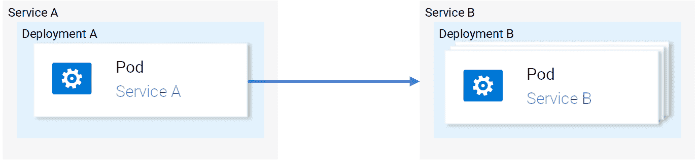

Service-to-service traffic

这就是为什么我们有这么多用于服务发现、弹性、工具等的库。考虑到每个服务都必须解决这些问题，在平台层而不是在应用程序代码中解决这些问题是有意义的。

Istio 设计了一个巧妙的解决方案。它拦截所有网络通信，并将其重定向到与每个服务一起运行的有能力的 sidecar 代理。代理人有责任解决上述所有问题。

下面的动画显示了 sidecar 如何代理中间流量和实施重试，以及失败请求的故障转移。

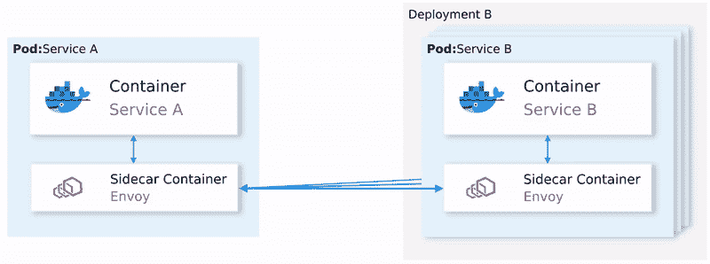

Service-to-service traffic in Istio

边车代理做的不止这些。我们将在本文中详细阐述它的许多特性。但是需要注意的关键是，应用程序本身完全不关心服务代理甚至整个网格。如果被问及服务网格，您的应用程序会说，“到底什么是服务网格？!"


Drawing by Victoria Dimitrakopoulos

### 边车代理

对于 sidecar 代理来说，要辨别请求是否失败，它必须理解应用层协议，比如 HTTP。在这一层起作用的代理是*应用层代理*或*第 7 层代理*。在本文的后续部分，我将交替使用这些术语。

通过拦截所有服务到服务的流量，应用层代理可以实现以下功能:

*   **容错** —使用响应状态代码，代理了解请求何时失败并重试。
*   **细粒度流量管理** —将带有特定报头的请求路由到预期服务。例如仅向测试用户发送应用程序的新测试版本
*   **指标** —成功响应和失败响应的计数，服务响应所用的时间，等等。
*   **跟踪** —在每个请求中添加特殊的头，并在集群中的所有服务中跟踪它们。
*   **安全性** —分别使用证书和 JWT 令牌验证服务和最终用户。

这些只是在应用程序网络层管理流量时启用的一些功能。

## 伊斯迪奥的建筑

Istio 由数据平面的*和控制平面*的*组成。*

### 数据平面

数据平面包括注入了边车代理的所有 pod。在 Istio 社区中，我们经常将它们称为网状工作负载或简称为*工作负载*。

同时，我们将不带 sidecar 的工作负载称为*传统工作负载*，因为它们是有害且危险的，您将在稍后的安全部分中看到这一点。

**注:** *“我们为什么不干脆叫它们豆荚呢？"* —因为网状工作负载没有绑定到集群，可能运行在不同的集群或虚拟机上，实际上是在任何可以运行和配置 sidecar 代理的地方。

#### 放大一个工作负载

每个工作负载有以下四个组成部分:

*   init 容器–你不用担心这个。知道它将流量重定向配置到边车代理就足够了。
*   飞行员代理人(pilot-agent)——你也不用担心这个。知道它进行边车代理的初始引导就足够了。
*   **边车代理**——你也不需要担心这个。知道它是实现流量管理、安全性和可观察性特性的具体组件就足够了。
*   **应用本身**

Istio 使用 Envoy 作为边车代理。Envoy 是一个多功能的第 7 层代理，高度可扩展，背后有一个活跃的社区。

Envoy 不同于其他代理，它可以通过自己公开的 API 进行动态配置。

你可能会问，“**为什么重要？**“因为特使必须跟上环境中发生的变化。

例如，在 Kubernetes 中，工作负载是短暂的。新的服务被一致地部署，工作负载被重新调度，并且用户可能定义新的路由规则或策略。因此，我们需要不断更新代理配置的*“某物”*。

这个“东西”就是*控制平面*，它使用 Envoy API 将代理与底层平台中发生的变化同步。

### Istio 控制平面

Istio 的控制平面是一个 Kubernetes 控制器，它监视 Kubernetes API 服务器，以了解平台中运行的工作负载，并生成关于如何在这些工作负载之间路由流量的特使配置。

此外，Istio 以 Kubernetes 自定义资源定义(CRDs)的格式公开了一个 API，服务运营商( *you* )可以使用它来配置数据平面。

使用*配置数据平面*，意味着您使用策略、路由规则、重试等来配置工作负载。

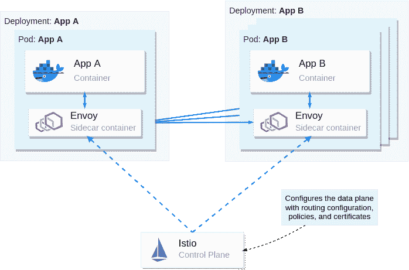

The control plane configures the data plane

我们对 Istio 的建筑有了相当多的了解。从这里开始，我们将把理论简化到最低限度，并增加实际例子来帮助你理解和记忆内容。

## 如何在实践中使用 Istio

### 先决条件:如何设置 Kubernetes 集群

在学习 Istio 以及如何使用它之前，您需要获得一个具有管理员访问权限的 Kubernetes 集群。

可以理解，您将需要`kubectl`来与集群交互。要安装`kubectl`，请阅读[官方文档，并按照操作系统](https://kubernetes.io/docs/tasks/tools/install-kubectl/)的说明进行操作。

本文在 Docker 中使用 *Kubernetes，也称为`kind`。您可以使用任何其他本地 Kubernetes 发行版，如 Docker-Desktop ( [如何安装](https://docs.docker.com/desktop/)和[使用它](https://docs.docker.com/desktop/kubernetes/))、 [Rancher Desktop](https://rancherdesktop.io/) 或 [Minikube](https://minikube.sigs.k8s.io/docs/start/) 。只要确保至少是 1.23 版本的 Kubernetes。*

要安装`kind`，请遵循[https://kind.sigs.k8s.io/docs/user/quick-start/](https://kind.sigs.k8s.io/docs/user/quick-start/)的安装说明。

### 如何使用`kind`创建集群

安装`kind`之后，使用下面的命令创建一个 Kubernetes 集群:

`kind create cluster --image=kindest/node:v1.23.1`

这个命令使用 Kubernetes 版本 1.23.1 提取一个容器映像，并在容器运行时运行它。比如你的运行时是`docker`，你可以通过执行`docker ps`看到正在运行的容器。

您的输出将显示一个新的容器正在运行:

```
CONTAINER ID   IMAGE                  COMMAND        NAMES
2974301ffa31   kindest/node:v1.23.1   "/usr/loca…"   kind-control-plane
```

**注意:** Istio 1.13 与 Kubernetes 的 1.20 及更高版本兼容。要了解 Kubernetes 支持的版本，请查看官方文档，网址是[Istio:Supported Kubernetes releases。](https://istio.io/latest/docs/releases/supported-releases/)

### 如何在集群上安装 Istio

您可以使用`istioctl`实用程序或`helm`包管理器来安装 Istio。要获得`istioctl`，下载 Istio 发布工件，如下所示。

```
curl -L https://istio.io/downloadIstio | \
  ISTIO_VERSION=1.13.2 TARGET_ARCH=x86_64 sh -
```

在下载的目录中，你会在`istio-1.13.2/bin/istioctl`下找到`istioctl` CLI 工具。接下来，在 PATH 环境变量中移动二进制文件——这样就可以从任何目录执行`istioctl`命令。

之后，用下面的命令安装 Istio:

```
istioctl install --set profile=demo -y
```

此命令可能需要几分钟才能完成，因为它会等待所有 pod 都在运行。完成后，在 Istio 安装名称空间中打印部署的 pod。

```
kubectl get pods -n istio-system
```

您应该会看到下面的输出。

```
NAME                                   READY   STATUS    RESTARTS
istio-egressgateway-6cf5fb4756-r569f   1/1     Running   0
istio-ingressgateway-dc9c8f588-cn2z4   1/1     Running   0
istiod-7586c7dfd8-2nbsk                1/1     Running   0
```

已安装的组件有:

*   **Istio 出口网关**–用于保护出口流量
*   **Istio 入口网关**–流量进入集群的入口点
*   **Istiod**–Istio 的控制平面，用于配置服务代理

### 如何安装 Istio 附加软件

前面下载的 Istio 工件包含了可视化生成的遥测数据的示例工具。要将它们部署到集群中，请执行以下命令:

```
kubectl apply -f istio-1.13.2/samples/addons/
```

这将安装以下工具:Prometheus、Grafana、Kiali 和 Jaeger。我们稍后将会看到这些。但是，首先，我们需要一些服务。

### 示例应用程序:情感分析

我们将运行我的 [Kubernetes 介绍文章](https://www.freecodecamp.org/news/learn-kubernetes-in-under-3-hours-a-detailed-guide-to-orchestrating-containers-114ff420e882)中使用的微服务应用程序。它足够复杂，可以在实践中展示 Istio 的特性。

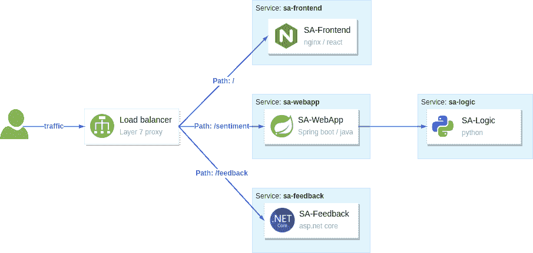

The sentiment analysis services

上图显示了构成应用程序的服务:

*   **SA-Frontend** —服务服务于前端；React JavaScript 应用程序
*   SA-WebApp 服务处理分析句子情感的查询
*   **SA-Logic** —服务执行情感分析
*   **SA-Feedback** —服务记录用户对分析准确性的反馈

此外，该图显示了一个第 7 层代理，它根据请求的路径反向代理流量。在 Istio 的网状网络中，*入口网关*是流量的入口点，并将其路由到服务。

## 如何在网格上运行服务

要使服务成为网格的一部分，您必须将 sidecar 代理注入到它们的应用程序单元中。您可以手动或自动完成此操作。

对于自动边车注入，您用`istio-injection: enabled`标记名称空间。之后，部署到这些名称空间中的任何 pod 都将被注入 sidecar(利用 Kubernetes 的一个名为 mutating webhooks 的特性来修改 pod 定义)。

创建一个名称空间，并将其标记为自动注入。

```
kubectl create ns demo kubectl label ns demo istio-injection=enabled
```

将 kubectl 上下文切换到`demo`名称空间，以便对其应用后续命令。

```
kubectl config set-context --current --namespace=demo
```

接下来，克隆包含整篇文章所需的服务和配置的存储库:

```
git clone https://github.com/rinormaloku/master-istio.git 
cd master-istio
```

继续部署服务:

```
kubectl apply -f ./kube
```

接下来，使用以下命令验证边车是否被注入到每个服务箱中:

```
$ kubectl get pods -n demo

NAME                           READY     STATUS    RESTARTS   AGE
sa-feedback-55f5dc4d9c-c9wfv   2/2       Running   0          12m
sa-frontend-558f8986-hhkj9     2/2       Running   0          12m
sa-logic-568498cb4d-2sjwj      2/2       Running   0          12m
sa-logic-568498cb4d-p4f8c      2/2       Running   0          12m
sa-web-app-599cf47c7c-s7cvd    2/2       Running   0          12m
```

确保在`READY`栏下，您看到数值“2/2”。这表明两个容器都在运行:app 容器和 sidecar 代理。如下图所示，我们放大到一个单元。

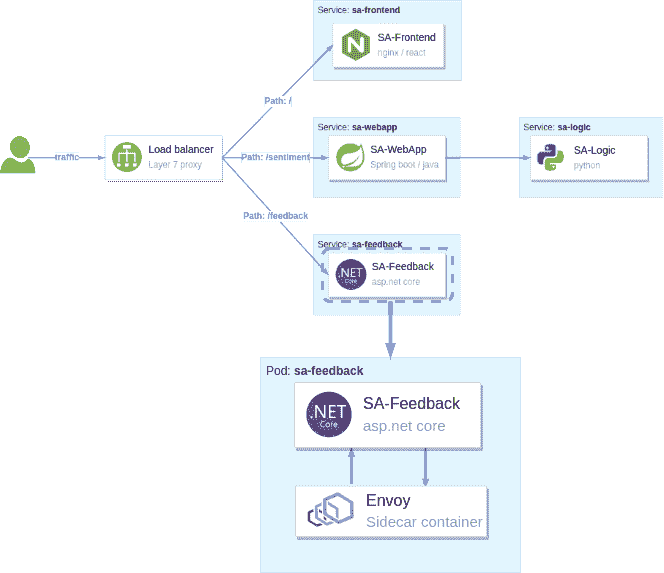

Figure 7\. Zooming into one Pod: The sidecar container is injected into the pod

我们的服务已准备好接收最终用户流量。为此，我们接下来需要揭露这些。

## 入口网关–如何允许流量进入网状网络

Istio 的入口网关是网格边缘的一个特殊代理，它允许来自公共网络的流量进入，并将其路由到集群内的服务。

之前，当我们在 Istio 安装名称空间中打印 pod 时，我们看到它处于`Running`状态。该网关由类型为`LoadBalancer`的 Kubernetes 服务公开。我们可以如下查询:

```
$ kubectl get svc -n istio-system -l istio=ingressgateway

NAME                   TYPE           CLUSTER-IP     EXTERNAL-IP
istio-ingressgateway   LoadBalancer   10.96.176.88   <pending>
```

如果使用的是`kind`，外部 IP 地址将处于`Pending`状态。然而，在托管的 Kubernetes 集群中，云提供商将为负载平衡器提供一个静态 IP 地址，您可以使用该地址将流量路由到网关。

作为一种变通方法，我们可以将它移植到我们的本地环境。打开第二个终端，执行下面的命令，并让它在整篇文章中运行。

```
kubectl port-forward -n istio-system svc/istio-ingressgateway 8080:80
```

现在，去往`localhost:8080`的流量将被转发到入口网关。如果你打开浏览器，输入那个地址，然后回车，你会发现网关拒绝了你的请求。这是网关的默认行为。

### 网关 API:允许流量

Istio 定义了`Gateway`自定义资源，您可以使用它来配置允许进入网格的流量类型。例如，要在端口 80 上接受 HTTP 流量，我们将使用下面的配置:

```
apiVersion: networking.istio.io/v1alpha3
kind: Gateway
metadata:
  name: http-gateway
spec:
  selector:
    istio: ingressgateway
  servers:
  - port:
      number: 80
      name: http
      protocol: HTTP
    hosts:
    - "*"
```

上面的大部分配置都是不言自明的，但是最突出的可能是选择器`istio: ingressgateway`。

问题是:*“我们为什么需要它？”*

一个服务网格可以有多个入口网关。通常，您会在多租户环境中使用它。在我们的实例中，我们将把`Gateway`配置应用到默认入口网关，该网关标有`istio=ingressgateway`。

将`Gateway`应用于集群:

```
kubectl apply -f istio/http-gateway.yaml
```

应用`Gateway`配置后，端口 80 上的流量将被所有主机(如通配符主机“*”所示)接纳。

接下来，我们需要配置如何处理许可的流量。

### 虚拟服务 API:路由流量

`VirtualService`资源为所有代理和网关配置网格内的流量路由。在我们的实例中，我们希望将流量从入口网关路由到一组工作负载，如下所示。

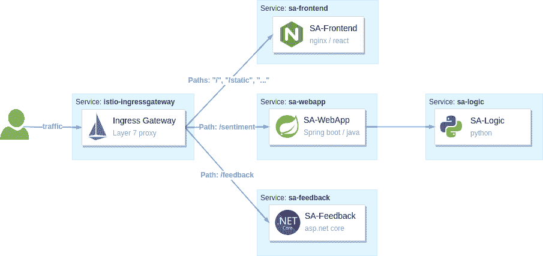

Istio’s ingress gateway routes traffic based on the HTTP location header

让我们来分解应该路由到 SA 前端的请求:

*   **与** `/`完全匹配的路径应该被路由到 SA 前端以获得 Index.html
*   **前缀为** `/static/*`的路径应该被路由到 SA-Frontend，以获取前端所需的任何静态文件，如级联样式表和 JavaScript 文件。
*   **匹配正则表达式** `'^.*\.(ico|png|jpg)$'`的路径应该被路由到 SA-Frontend。

这是通过以下配置实现的:

```
apiVersion: networking.istio.io/v1alpha3
kind: VirtualService
metadata:
  name: sa-external-services
spec:
  hosts:
  - "*"
  gateways:
  - http-gateway                      # 1
  http:
  - match:
    - uri:
        exact: /
    - uri:
        prefix: /static
    - uri:
        regex: '^.*\.(ico|png|jpg)$'
    route:
    - destination:
        host: sa-frontend             # 2
        port:
          number: 80
```

1.  这个`VirtualService`适用于来自我们在前面部分定义的`http-gateway`的请求
2.  目的地定义了路由流量的服务

**注:**以上配置在`vs-route-ingress.yaml`文件中。它还包含 SA-WebApp 和 SA-Feedback 流量的路由规则。为了简洁起见，在上面的清单中省略了它。

将`VirtualService`应用到集群。

```
kubectl apply -f istio/vs-route-ingress.yaml
```

控制平面在几秒钟内将配置传播到网关。之后，你可以访问地址为 [http://localhost:8080/](http://localhost:8080/) 的应用程序，前提是你仍然将 Istio 的入口网关端口转发到你的本地环境。

打开该地址的浏览器。您将看到该应用程序，如下图所示。

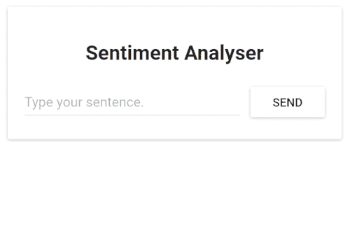

下图显示了这两种资源如何配置入口网关。`Gateway`资源对其进行配置以接纳流量，而`VirtualService`配置将接纳的流量路由到哪里。

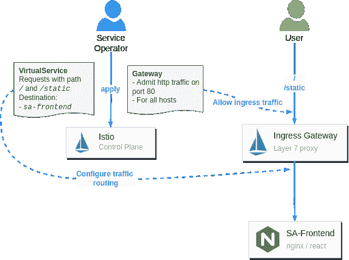

Configuring Istio’s ingress gateway to admit and route traffic

万岁！我们启动并运行了服务。我们注入了边车，并将最终用户流量路由到这些设备。

您可能会想:*“为什么要对将工作负载运行到网格中大惊小怪？毕竟，任何第 7 层入口控制器都可以使用基于路径的路由将流量路由到工作负载。”*

我们将在接下来展示您获得的安全性和可观察性优势时回答这个问题。所以让我们开始吧。

## 可观察性

Istio 的 sidecar 代理(即特使代理)为所有入站和出站流量生成访问日志、指标和跟踪。这些指标提供了对系统工作的深入了解，并有助于回答一些问题，如:系统是否健康？一个服务的成功率是多少？诸如此类。

生成指标是故事的一半。另一半是以促进行动的方式收集和可视化信息。我们将使用之前安装的 Istio 附加组件:

*   **收集指标的普罗米修斯**
*   **Grafana** 用于可视化那些
*   **耶格**告密的痕迹
*   Kiali 将所有遥测数据汇集在一起

但是如果您的组织中已经有了一些可观察性工具呢？更好的是，您可以将 Istio 与那些整合:)

### Grafana:可视化指标

Grafana 将普罗米修斯收集的数据可视化。打开 Grafana 仪表板，让我们看看我们从盒子里得到了什么。

```
istioctl dashboard grafana
```

上面的命令将把 Grafana 移植到您的本地环境，并在您的默认浏览器中打开它。接下来，导航到“Istio”>“Istio Service Dashboard”，使用“Service”下拉菜单过滤输出，并选择“sa-webapp”服务。

如果您这边的图形看起来有点空，那么通过执行下面的命令来生成流量:

```
while true; do \
  curl -i http://localhost:8080/sentiment \
  -H "Content-type: application/json" \
  -d '{"sentence": "I love yogobella"}'; \
  sleep .$RANDOM; done
```

在本文的剩余部分让这个命令保持运行，因为我们在后续部分也需要流量流入。

下面我们来看一下`sa-webapp`服务的指标。

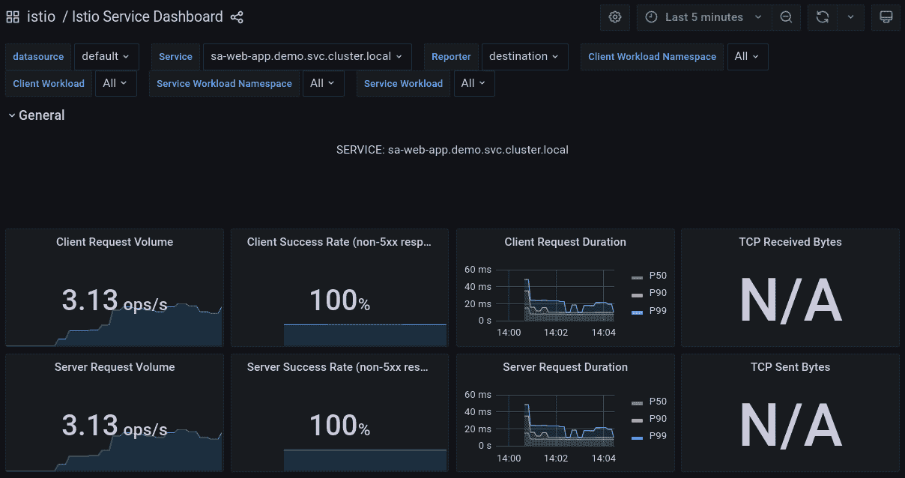

Grafana: Visualizing metrics for the sa-webapp service

Prometheus 和 Grafana 使我们能够了解我们的服务的健康状况、性能，以及随着时间的推移而出现的改进或退化。由您来进一步研究这些图表和它们可视化的信息。

接下来，我们将研究在服务中传递的跟踪请求。

### 耶格:窃取请求的痕迹

明智的做法是问:“为什么我们现在要跟踪请求？我们不是为了巨石柱才这么做的吗？”—改用微服务解决了一些困难，虽然不经意间带来了一些需要其他解决方案的分布式系统的固有属性。

例如，分布式的特性使得定位故障变得相对棘手。

假设一个最终用户收到一个失败的请求——“原因是什么？”要定位故障，您必须检查所有参与服务请求的服务。

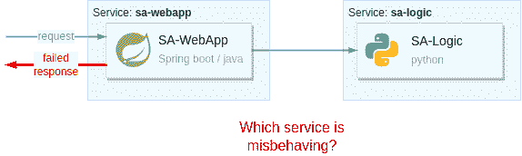

没有合适的工具，唯一可用的选择就是脱下你的*工程师*帽子，戴上你的*侦探*帽子。然后，通过查询所有服务日志、按时间戳过滤并尝试理解所有数据，您可以拼凑出“*失败请求*的故事。然后，你会慢慢地，但肯定会追根究底，找到罪魁祸首！

第一次玩侦探游戏可能是一项有趣的活动，但很快就会变得平淡无奇，因为失败是常事。我们需要有效的工具来定位分布式系统中的那些。

**耶格就是这样一个工具。**

耶格(Jaeger)来自德语单词“猎人”(书面 ger)。它意味着“追捕失败”不过，我更喜欢我的侦探类比。周虎和耶格把❌换成了**督察小工具** ✅

要在没有 Istio 的情况下跟踪请求，您必须检测您的所有服务以生成跟踪，并将它们推送到 **Inspector Gadget** 。*(耶…我正跟着它转*🤣)

相反，使用 Istio，sidecar 代理生成跟踪头(作为 HTTP 头)并将它们推送给 Inspector Gadget ( *这是最后一次，我保证*😜).这由每个具有 sidecar 代理的服务来完成。

您只需**更新您的服务，将生成的跟踪头传播给上游服务**。否则，每个代理重新生成报头。当这些痕迹被缝合在一起时，它不会给我们完整的请求画面。

下图显示了这一过程。

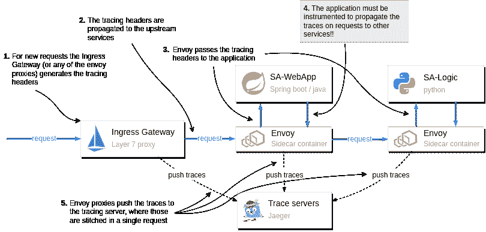

How tracing information is generated and pushed to the Trace Servers

注意图中的步骤 4。将跟踪头传递给上游是应用程序的责任。

传递跟踪头是至关重要的，因为下一个代理将获取现有的头，并理解这是已经被跟踪的请求的延续。因此，它将重用跟踪头(如`x-request-id`)，然后添加它记录的额外数据。跟踪头用于在 Jeager 中组合一个请求的所有信息。

打开 Jaeger 仪表板，查看跟踪如何显示请求的整个范围。

```
istioctl dashboard jaeger
```

上面的命令将把 Jeager 移植到您的本地环境，并在您的默认浏览器中打开它。

在 Jaeger 用户界面中四处查看，并调查各个请求。例如，下图显示了分析句子情感的请求的跟踪。

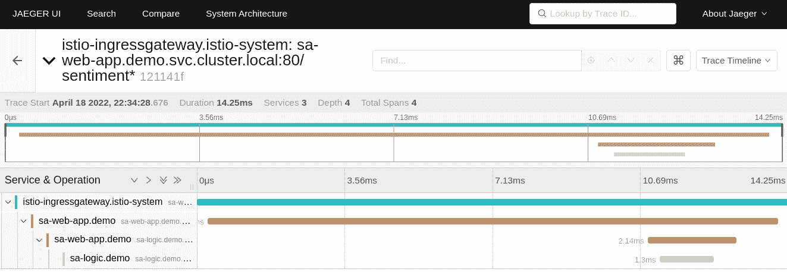

The full request flow through the mesh

该图显示了请求是如何在入口网关开始的(这是与服务网格工作负载的第一次接触)。然后，该请求被分别路由到`sa-webapp`和`sa-logic`。

**注意:**要了解您的应用程序需要传播的头文件和相应的客户端库，请查看 [Istio 的分布式跟踪常见问题](https://istio.io/latest/about/faq/distributed-tracing)并阅读[的答案“Istio 的分布式跟踪需要什么](https://istio.io/latest/about/faq/distributed-tracing/#how-to-support-tracing)

跟踪阐明了请求失败的位置以及哪个服务返回了错误，等等。但是我们使用代理访问日志和应用程序日志了解了更多关于失败的信息。

### 访问日志

Envoy 将每个请求记录为访问日志。让我们从`sa-webapp`服务中打印出一个日志条目来查看记录的数据。

```
$ kubectl logs deploy/sa-webapp -c istio-proxy | tail -n 1

[2022-04-18T12:09:44.091Z] "POST /sentiment HTTP/1.1" 200 - via_upstream - "-" 32 46 5 5 "10.244.0.6" "curl/7.74.0" "bfb9e6e5-2968-9b25-b256-f0917aa6b0bb" "localhost:8080" "10.244.0.16:8080" inbound|8080|| 127.0.0.6:51819 10.244.0.16:8080 10.244.0.6:0 outbound_.80_._.sa-webapp.demo.svc.cluster.local default
```

看起来很像胡言乱语，不是吗？这是文本格式，其中每条信息都用空格分隔。您可以通过打印访问日志格式来了解每个空格分隔的字段代表什么，这是通过以下命令实现的:

```
$ istioctl pc all deploy/sa-webapp -o json | \
    grep log_format -A 2 | tail -n 2

"text_format_source": {
  "inline_string": "[%START_TIME%] \"%REQ(:METHOD)% %REQ(X-ENVOY-ORIGINAL-PATH?:PATH)% %PROTOCOL%\" %RESPONSE_CODE% %RESPONSE_FLAGS% %RESPONSE_CODE_DETAILS% %CONNECTION_TERMINATION_DETAILS% \"%UPSTREAM_TRANSPORT_FAILURE_REASON%\" %BYTES_RECEIVED% %BYTES_SENT% %DURATION% %RESP(X-ENVOY-UPSTREAM-SERVICE-TIME)% \"%REQ(X-FORWARDED-FOR)%\" \"%REQ(USER-AGENT)%\" \"%REQ(X-REQUEST-ID)%\" \"%REQ(:AUTHORITY)%\" \"%UPSTREAM_HOST%\" %UPSTREAM_CLUSTER% %UPSTREAM_LOCAL_ADDRESS% %DOWNSTREAM_LOCAL_ADDRESS% %DOWNSTREAM_REMOTE_ADDRESS% %REQUESTED_SERVER_NAME% %ROUTE_NAME%\n"
```

因此，第一个条目是前面列出的日志中的值`[2022-04-18T12:09:44.091Z]`的`[%START_TIME%]`，依此类推。您可以在这个 Istio 文档中了解更多关于访问日志的信息:“[特使访问日志](https://istio.io/latest/docs/tasks/observability/logs/access-log/#default-access-log-format)”。

### 如何自定义访问日志格式

您可以自定义访问日志格式。例如，以下命令更新 Istio 安装，以 JSON 格式打印日志。

```
istioctl install --set profile=demo \
    --set meshConfig.accessLogEncoding="JSON"
```

在 JSON 格式中，日志数据具有与解释值的含义的键相关联的值。

### kiali——Istio 服务网络的控制台

Kiali 是 Istio 的强大控制台。它使用遥测数据来可视化服务到服务的流量。它将收集的遥测信息关联起来，例如度量、跟踪、访问和应用程序日志。因此，调试应用程序问题轻而易举。

**注意:** Kiali 有一个验证器列表，它也能发现网格中的错误配置。然而，这超出了本文的范围。了解更多关于 [Kiali 验证器](https://kiali.io/docs/features/validations/)的信息。

使用以下命令打开 Kiali 仪表板:

```
istioctl dashboard kiali
```

下图显示了仪表板中的可视化信息。

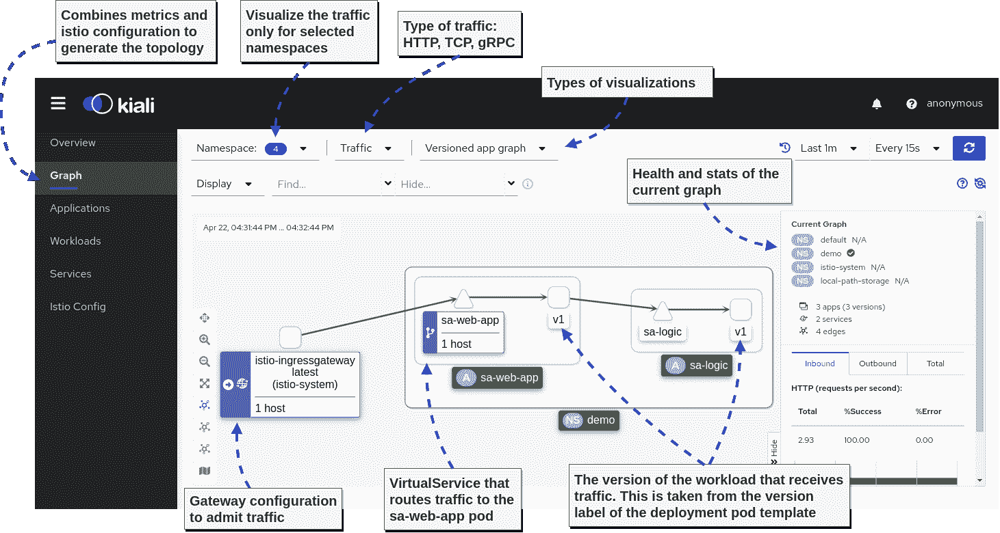

接下来，我们来看看我最喜欢的特性:关联度量和跟踪，如下所示。

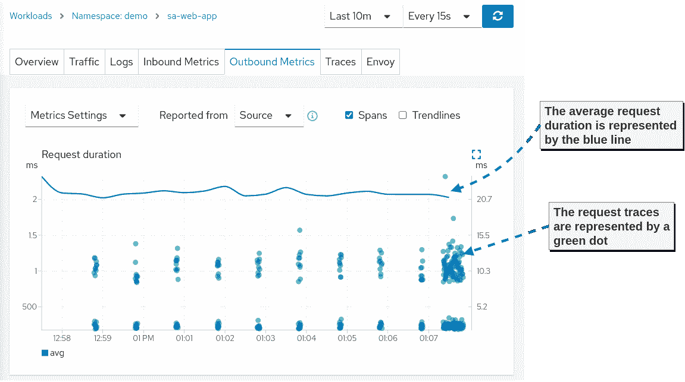

度量和跟踪的相关性使得应用程序团队可以直接找到最慢的请求以及它通过服务的路径。这样，很容易发现瓶颈，团队可以集中精力提高他们的应用程序性能。

**提示:**查看官方文档，了解更多关于[指标相关性的信息](https://kiali.io/docs/features/tracing/#metric-correlation)

至此，我们结束了本文的可观测性部分。当然，所有这些工具都有更大的广度和深度。然而，这里的覆盖范围足以让您了解在采用服务网格时您在系统上获得的可观察性。

## 交通管理–金丝雀部署

让第 7 层代理作为服务到服务流量的媒介，可以实现复杂的流量管理功能。例如，当我们基于入口网关中的路径头路由请求时，我们已经在使用它了。

我们可以根据任何其他 HTTP 信息做出路由决定。接下来，让我们看看流量管理功能如何帮助我们实现安全部署。

### 如何让连续交货安全

在整个科技行业，我们从经验中了解到，最频繁的服务中断发生在工作日，很少发生在周末。这是因为，在这一周中，系统会发生变化。我们无法避免变化，但我们必须找到方法使它们的交付更加安全。

连续交付可以分为两个阶段:

1.  **部署阶段**:部署应用程序
2.  **发布阶段**:向应用程序发送最终用户流量

#### 交付模式

“部署阶段”由平台处理。例如，这就是我们使用 Kubernetes 部署的目的。

“发布阶段”是 Istio 的流量管理功能派上用场的时候，它允许实施以下交付模式:

*   **Canary 部署** —通过仅将一小部分流量路由到最新版本来验证新部署。然后验证更改，只有在这之后才发布给所有用户。
*   **渐进式部署**–canary 部署的一种变体，逐渐增加发送到新版本的流量百分比
*   黑暗发布(Dark launch)——不完全是关于安全地发布软件，而是关于将软件发布给一部分用户(比如测试版用户)并验证他们如何接受变更
*   **流量镜像**–将真实用户流量镜像到新版本的应用，并忽略响应。

在本文中，我们将展示 canary 部署模式，以便在将新版本的应用程序发布到实际流量之前对其进行验证。我们将在《Istio in Action》一书中讨论更多的部署模式。

### Istio 的金丝雀部署

当在 Kubernetes 中部署另一个版本的应用程序时，它会立即收到流量，这意味着我们的用户会被路由到新的服务。这不是我们想要的！

我们实际上希望流量只被路由到第一个版本，即使在部署了应用程序的第二个版本之后(后来，我们决定向最终用户流量发布第二个版本)。

在 Istio 中，使用 DestinationRule API 来区分版本。根据下面的目的地规则，我们定义了以下子集:

*   子集`v1` —以标签为`version: v1`的窗格为目标
*   子集`v2` —以标签为`version: v2`的窗格为目标

```
apiVersion: networking.istio.io/v1alpha3
kind: DestinationRule
metadata:
  name: sa-logic
spec:
  host: sa-logic
  subsets:
  - name: v1
    labels:
      version: v1
  - name: v2
    labels:
      version: v2
```

让我们将它应用到集群中，使这种区别存在。

```
kubectl apply -f istio/sa-logic-dr.yaml
```

接下来，让我们创建一个虚拟服务，该虚拟服务配置服务代理，对于任何以`sa-logic`服务为目标的流量，只将流量路由到子集`v1`:

```
apiVersion: networking.istio.io/v1alpha3
kind: VirtualService
metadata:
  name: sa-logic
spec:
  hosts:
  - sa-logic
  http:
  - route:
    - destination:
        host: sa-logic
        subset: v1
      weight: 100
```

通过执行以下命令应用到集群:

```
kubectl apply -f istio/sa-logic-vs.yaml
```

现在，部署服务的第二个版本不会将其释放给最终用户流量。

```
kubectl apply -f kube/canary/sa-logic-v2.yaml
```

使用 Kiali 图形仪表板验证所有流量都被路由到子集`v1`(见下图)。

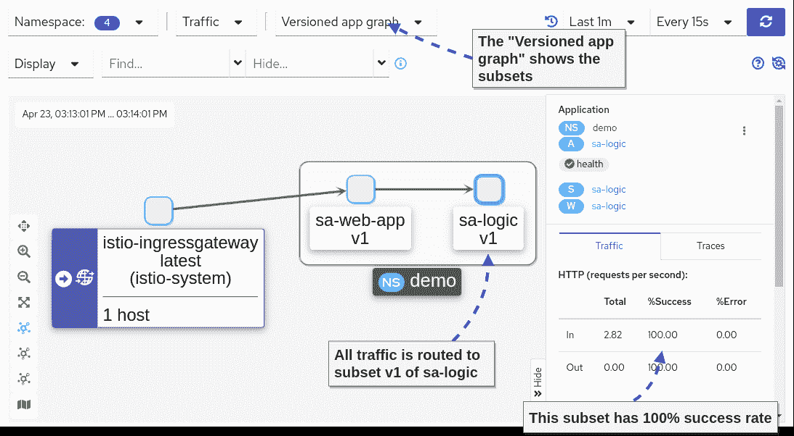

Success rate of subset *v1*

接下来，让我们只向新版本的`sa-logic`发送 10%的最终用户流量，如下图所示。

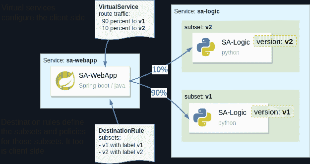

How Istio configures the routing to subsets

```
apiVersion: networking.istio.io/v1alpha3
kind: VirtualService
metadata:
  name: sa-logic
spec:
  hosts:
  - sa-logic
  http:
  - route:
    - destination:
        host: sa-logic
        subset: v1
      weight: 90
    - destination:
        host: sa-logic
        subset: v2
      weight: 10
```

将其应用到集群。

```
kubectl apply -f istio/sa-logic-vs-canary.yaml
```

在向最终用户流量发布新版本后，您可以对其进行监控和验证。利用我们之前探索的可观察性工具。

例如，在应用更改后，我们可以在 Kiali 图中观察子集的成功率和错误率。

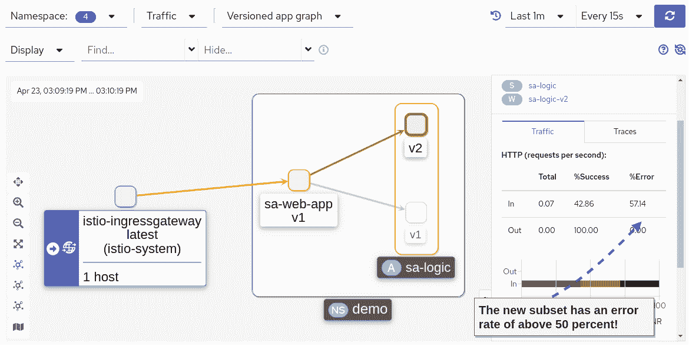

天哪！我们的错误率确实增加了。让我们更新虚拟服务，将所有流量重定向到`v1`，它没有任何错误。

```
kubectl apply -f istio/sa-logic-vs.yaml
```

如果您重新检查 Kiali 图，您会发现 100%的流量都被路由到版本 1，没有任何错误。

**总结:**Kubernetes 的发布总是大爆炸。您有一个想要发布的变更，如果它有 bug，它会影响您的所有用户。

但是 Istio 利用服务代理做出细粒度的路由决策，当使用时，使发布安全。

接下来，让我们研究一下 Istio 的安全特性——这越来越令人兴奋了！

## Istio 安全

我从来不会相信安全会是一个让我兴奋的话题。在技术层面上，Istio 可以做些什么来让这个话题变得有趣呢？更重要的是，你为什么也要兴奋呢？

**答案很简单:** Istio 将安全责任从我们的应用程序代码转移到平台(特别是 envoy 代理)。因此，当流量到达我们的应用程序时，它已经被认证和授权。

在下面几节中，我们将展示如何使用 Istio 对服务到服务和最终用户流量进行身份验证和授权。

但是首先，让我们确保对身份验证和授权有一个共同的理解:

*   **认证**是指客户端或服务器使用它所拥有的东西来证明身份(即回答“它是谁”)，比如证书和/或 JWT。
*   **授权**是允许或拒绝经过认证的用户的动作的过程。

### 自动 mTLS:服务对服务认证

Istio 使用*面向所有人的安全生产身份框架* —也称为 SPIFFE —向工作负载发布身份。

对 SPIFFE 如何工作的阐述超出了本文的范围。但是知道 Istio 将工作负载的身份标识为 x509 证书就足够了。

Istio 使用由 Kubernetes 本身分配给 Kubernetes Pod 的 Kubernetes `serviceaccount`作为身份来源。如果您的部署没有指定服务帐户，那么将为其分配`default`服务帐户。

**注:**对于有兴趣了解更多 SPIFFE 的人，我们将[“附录 c . Istio security:sp iffe”](https://livebook.manning.com/book/istio-in-action/appendix-c/)奉献给它。

生成的证书对工作负载元数据进行了编码，如名称空间、服务帐户等。代理使用此证书来启动相互验证的连接(MTL)。您可以在特使配置中找到证书。

以下命令查询特使配置，将其过滤为我们需要的输出，并解码证书。你需要安装 [step-cli](https://smallstep.com/docs/step-cli/installation) 和 [jq](https://stedolan.github.io/jq/download/) 来执行它。

```
istioctl proxy-config all deploy/sa-webapp -o json | \
  jq -r '.. |."secret"? | select(.name == "default")' | \
  jq -r '.tls_certificate.certificate_chain.inline_bytes' | \
  base64 -d - | step certificate inspect
```

我的输出如下所示。

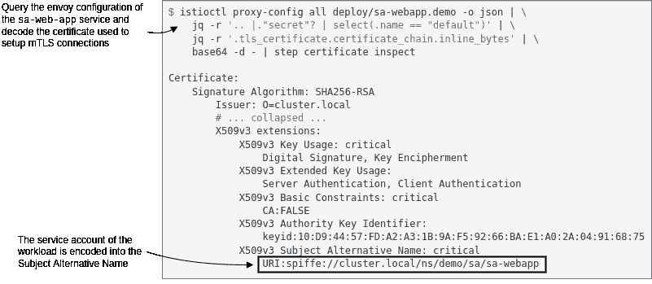

我们提到过，证书用于加密流量，保护流量免受中间人攻击。接下来我们来验证一下。

#### 服务对服务的流量是加密的

为了查明流量是否被加密，我们需要捕获通过 pod 的流量。为此，我们将在 pod 中运行一个调试容器，如下图`nicolaka/netshoot`(运行调试容器需要 Kubernetes 版本 1.23)。

`netshoot`图像有许多网络实用程序，包括`tcpdump`，一个我们将使用的网络捕获实用程序。

使用以下命令运行调试容器:

```
# Query the name of the sa-webapp pod
POD_NAME=$(kubectl get pods -l app=sa-webapp -o jsonpath={.items..metadata.name} | cut -d ' ' -f1)

# Run a debug container with tcpdump utility
kubectl debug -q -i $POD_NAME --image=nicolaka/netshoot -- \
  tcpdump -l --immediate-mode -vv -s 0 '(((ip[2:2] - ((ip[0]&0xf)<<2)) - ((tcp[12]&0xf0)>>2)) != 0)'
```

可能需要一两分钟(*甚至更久*)直到调试容器被拉出并运行。如果您仍然在执行对`sa-webapp`的连续查询，您将会看到大量的流量被捕获。然而，你将无法从中获得任何真知灼见。这很好，因为**就是这个想法——它是加密的。Tada！**🎉

请注意，这种优势不会扩展到遗留工作负载，我们将在接下来看到这一点。

#### 来自传统工作负载的流量是明文形式的

首先运行一个无限期运行的遗留工作负载。我们将创建一个新的名称空间，不会将其标记为自动边车注入。因此，工作负载不会被注入 sidecar，它不会有身份，也不能相互认证。

```
kubectl create ns legacy
kubectl -n legacy run workload --image=radial/busyboxplus:curl -- tail -f /dev/null
```

当 Pod 运行时，执行一个从传统工作负载到`sa-web-app`工作负载的 cURL 请求。

```
kubectl -n legacy exec workload -- \
  curl -i http://sa-webapp.demo/sentiment \
  -H "Content-type: application/json" \
  -d '{"sentence": "I love yogobella"}'
```

回顾在`sa-webapp`窗格中运行的`tcpdump`命令的输出，您将看到明文形式的响应，如下所示。

```
HTTP/1.1 200 OK
content-type: application/json;charset=UTF-8
date: Mon, 25 Apr 2022 12:14:02 GMT
x-envoy-upstream-service-time: 13
server: istio-envoy
x-envoy-decorator-operation: sa-web-app.demo.svc.cluster.local:80/*
transfer-encoding: chunked

2e
{"sentence":"I love yogobella","polarity":0.5}
```

假设数据是敏感的，比如密码、JWT(可用于重放攻击)等等。这是一种危险的攻击媒介，对您的组织来说是一种风险。

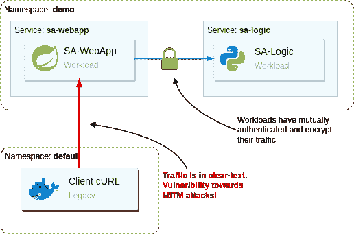

Istio 为我们提供了防止网格中的工作负载接收明文流量的工具。

### PeerAuthentication–如何改进安全默认值

默认情况下，Istio 将服务代理配置为使用 *mTLS 许可*模式，这意味着允许未经身份验证的流量。

这是一个明智的默认设置，因为它允许服务逐渐迁移到网格中，而不会导致服务停机。

将工作负载迁移到网格后，建议将 mTLS 模式翻转为严格要求相互认证的流量。您可以通过下面的`PeerAuthentication`配置来实现。

```
apiVersion: "security.istio.io/v1beta1"
kind: "PeerAuthentication"
metadata:
  name: "default"
  namespace: "istio-system"
spec:
  mtls:
    mode: STRICT
```

这个配置适用于所有工作负载，因为 Istio 使用了一个惯例，即 Istio 安装名称空间中的配置(在我们的例子中是`istio-system`)会这样做。然而，它可以被一个*名称空间范围的*配置或*边车特定的*配置覆盖。

了解有关 Istio 配置的[“范围、继承和覆盖”](https://istio.io/latest/docs/tasks/observability/telemetry/#scope-inheritance-and-overrides)的更多信息。解释是关于遥测 API 的，但适用于`PeerAuthentication`，其他 Istio API 也一样。

将对等身份验证配置应用到群集。

```
kubectl apply -f istio/security/peer-authentication.yaml
```

验证来自传统工作负载的流量被拒绝。

```
$ kubectl -n legacy exec workload -- \
    curl -i -Ss http://sa-webapp.demo/sentiment \
    -H "Content-type: application/json" \
    -d '{"sentence": "I love yogobella"}'

curl: (56) Recv failure: Connection reset by peer
command terminated with exit code 56
```

cURL 命令失败，并出现错误`Recv failure: Connection reset by peer`，因为服务代理不接受未经认证的连接。

### 如何授权服务到服务的流量

相互认证服务和加密它们之间的流量可以保护传输中的数据。

但是，当恶意用户获得其中一个工作负载的身份时，会发生什么呢？

**恶意用户可以认证每一个服务并查询敏感数据。**

然而，如果我们坚持最小特权的原则，我们将每个工作负载的访问权限减少到仅仅是它的功能所需要的。因此，当身份被盗时，我们将损害范围减少到只有它被允许访问的范围。

在 Istio 中，我们使用授权策略来控制访问。基本上，在工作负载相互认证并且我们知道它们的身份(即我们知道“谁”是谁)之后，我们可以应用策略，即指定允许身份执行什么操作。

我把这个作为可选练习留给你。您应该实现授权策略，以便网格遵守最小特权原则。

Istio 有一个[快速示例](https://istio.io/latest/docs/tasks/security/authorization/authz-http/)可以帮助您找到正确的方法，您会发现对[授权策略 API 参考](https://istio.io/latest/docs/reference/config/security/authorization-policy/)的详细描述非常有用。

*每个服务需要的访问权限汇总:*

*   `istio-ingressgateway`可以访问`sa-frontend`、`sa-feedback`和`sa-web-app`
*   `sa-web-app`可以访问`sa-logic`服务。
*   应禁止所有其他访问。

### 最终用户身份验证

Istio 使用 JWTs 作为一种身份验证方法来验证最终用户的请求。

为了让最终用户接收 JSON web 令牌，我们需要一个身份提供者(IdP)。我们将使用 Keycloak 作为 IdP。然而，任何实现 OpenID 连接发现(OIDC)标准的解决方案都是一样的。

#### 在集群中运行 Keycloak

首先创建一个名称空间并将`keycloak`部署到其中。

```
kubectl create ns keycloak
kubectl -n keycloak apply -f kube/idp/keycloak.yaml

# wait for the rollout
kubectl -n keycloak rollout status deploy/keycloak
```

等到*键盘锁*启动并运行。接下来，创建一个客户端应用程序来表示`sa-frontend`单页面应用程序。此外，添加下表中列出的用户。

| 用户名 | 密码 | 组 | UserType |
| --- | --- | --- | --- |
| 用户 | 密码 | 用户 | 规则的 |
| 贝塔 | 密码 | 用户 | 贝塔 |
| 调解人 | 密码 | 调解人 | 规则的 |

> 注意:`group`和`usertype`属性是在认证后作为声明添加到 JWT 中的。

客户端应用程序和用户的创建是通过下面的脚本自动完成的。这使您免去了浏览 Keycloak UI 并手动创建它们的过程。

```
# 1\. Port forward to the local environment
kubectl port-forward svc/keycloak -n keycloak  8081:8080 &
PID=$!
sleep 2

# 2\. Create client and users
export KEYCLOAK_URL=http://localhost:8081/auth

export KEYCLOAK_TOKEN=$(curl -d "client_id=admin-cli" -d "username=admin" -d "password=admin" -d "grant_type=password" "$KEYCLOAK_URL/realms/master/protocol/openid-connect/token" | jq -r .access_token)
echo $KEYCLOAK_TOKEN

# Create initial token to register the client
read -r client token <<<$(curl -H "Authorization: Bearer ${KEYCLOAK_TOKEN}" -X POST -H "Content-Type: application/json" -d '{"expiration": 0, "count": 1}' $KEYCLOAK_URL/admin/realms/master/clients-initial-access | jq -r '[.id, .token] | @tsv')

# Register the client
read -r id secret <<<$(curl -X POST -d "{ \"clientId\": \"sa-frontend\", \"implicitFlowEnabled\": true }" -H "Content-Type:application/json" -H "Authorization: bearer ${token}" ${KEYCLOAK_URL}/realms/master/clients-registrations/default| jq -r '[.id, .secret] | @tsv')

# Add allowed redirect URIs
curl -H "Authorization: Bearer ${KEYCLOAK_TOKEN}" -X PUT \
  -H "Content-Type: application/json" -d "{\"serviceAccountsEnabled\": true, \"directAccessGrantsEnabled\": true, \"authorizationServicesEnabled\": true, \"redirectUris\": [\"http://localhost:8080/\"]}" $KEYCLOAK_URL/admin/realms/master/clients/${id}

# Add the group attribute in the JWT returned by Keycloak
curl -H "Authorization: Bearer ${KEYCLOAK_TOKEN}" -X POST -H "Content-Type: application/json" -d '{"name": "group", "protocol": "openid-connect", "protocolMapper": "oidc-usermodel-attribute-mapper", "config": {"claim.name": "group", "jsonType.label": "String", "user.attribute": "group", "id.token.claim": "true", "access.token.claim": "true"}}' $KEYCLOAK_URL/admin/realms/master/clients/${id}/protocol-mappers/models

# Add the user type attribute in the JWT returned by Keycloak
curl -H "Authorization: Bearer ${KEYCLOAK_TOKEN}" -X POST -H "Content-Type: application/json" -d '{"name": "usertype", "protocol": "openid-connect", "protocolMapper": "oidc-usermodel-attribute-mapper", "config": {"claim.name": "usertype", "jsonType.label": "String", "user.attribute": "usertype", "id.token.claim": "true", "access.token.claim": "true"}}' $KEYCLOAK_URL/admin/realms/master/clients/${id}/protocol-mappers/models

# Create regular user
curl -H "Authorization: Bearer ${KEYCLOAK_TOKEN}" -X POST -H "Content-Type: application/json" -d '{"username": "user", "email": "user@acme.com", "enabled": true, "attributes": {"group": "users", "usertype": "regular"}, "credentials": [{"type": "password", "value": "password", "temporary": false}]}' $KEYCLOAK_URL/admin/realms/master/users

# Create beta user
curl -H "Authorization: Bearer ${KEYCLOAK_TOKEN}" -X POST -H "Content-Type: application/json" -d '{"username": "beta", "email": "beta@acme.com", "enabled": true, "attributes": {"group": "users", "usertype": "beta"}, "credentials": [{"type": "password", "value": "password", "temporary": false}]}' $KEYCLOAK_URL/admin/realms/master/users

# Create moderator user
curl -H "Authorization: Bearer ${KEYCLOAK_TOKEN}" -X POST -H "Content-Type: application/json" -d '{"username": "moderator", "email": "moderator@acme.com", "enabled": true, "attributes": {"group": "moderator", "usertype": "regular"}, "credentials": [{"type": "password", "value": "password", "temporary": false}]}' $KEYCLOAK_URL/admin/realms/master/users

# 3\. Stop port-forwarding
kill $PID
```

成功完成后，您将能够继续下一部分。

### 如何公开 Keycloak 服务

OIDC 标准使客户端应用程序能够识别最终用户。客户端应用程序通过将用户重定向到身份验证服务器来启动该过程。首先，用户对自己进行身份验证，然后身份验证服务器将用户返回给客户端应用程序，并附上一个代表其身份的令牌。

最终用户必须能够访问认证服务器。这就是为什么我们也必须通过 Istio 的入口网关暴露`keycloak`。

配置到 keycloak 的流量路由的更新的虚拟服务可以用下面的命令来应用。请随意检查该文件并了解更改。

```
kubectl apply -f istio/vs-route-ingress-keycloak.yaml
```

接下来，我们需要更新客户端应用程序— `sa-frontend` —将用户重定向到前端。你可以在这里了解代码[。但是，您可以省去这些细节，只应用预构建的映像和这些更改。](https://github.com/rinormaloku/master-istio/blob/main/services/sa-frontend/src/App.js#L80-L83)

```
kubectl set image deployment/sa-frontend \
    sa-frontend=rinormaloku/sentiment-analysis-frontend:keycloak
```

等待 Pod 运行，然后刷新`sa-frontend`页面。

新版本会将您重定向到`Keycloak`进行身份验证。使用凭证`user / password`登录。成功登录后，您将收到一个 JWT，并将被重定向回客户端。

因此，后续的句子分析请求将包含 JWT，我们可以基于它对最终用户进行身份验证和授权。

### request authentic ation–如何验证最终用户的请求

认证最终用户流量的推荐方法是在入口网关中。这减少了处理量，因为未经身份验证和未经授权的流量会在早期被拒绝。但是，如果您想要跨服务传播 JWT，您必须更新您的服务来传递它。

下图显示了角色及其对我们接下来将实现的服务的访问。

以下是访问级别的汇总:

*   所有用户都可以访问`sa-frontend`服务(这对于启动认证流程非常重要)
*   经过身份验证的用户除了可以访问`sa-frontend`之外，还可以访问`sa-webapp`
*   版主可以访问所有服务

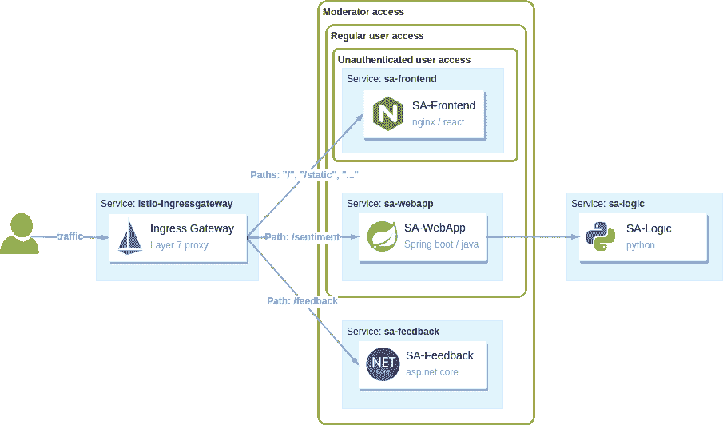

`RequestAuthentication` API 用于配置最终用户 jwt 的认证。例如，使用下面的配置，我们验证由`keycloak`发布的 jwt。

```
apiVersion: "security.istio.io/v1beta1"
kind: "RequestAuthentication"
metadata:
  name: "keycloak-request-authn"
  namespace: istio-system
spec:
  selector:
    matchLabels:
      app: istio-ingressgateway
  jwtRules:
  - issuer: "http://localhost:8080/auth/realms/master" (1)
    jwksUri: http://keycloak.keycloak.svc:8080/auth/realms/master/protocol/openid-connect/certs (2)
```

详述上面清单中的 JWT 规则属性:

1.  与此颁发者匹配的令牌使用此 JWT 规则进行身份验证
2.  根据在该 URI 找到的 JSON Web 密钥集(jwk)验证匹配的令牌

将其应用到集群。

```
kubectl apply -f istio/security/request-authentication.yaml
```

您可能期望从现在开始拒绝没有 jwt 的请求，但是这是不正确的。`RequestAuthentication`资源只认证包含 JWT 的请求。其他请求按原样传递。

通过在没有令牌的情况下触发请求，验证该请求是否被接纳和服务，如下所示:

```
$ curl -S http://localhost:8080/sentiment \
    -H "Content-type: application/json" \
    -d '{"sentence": "I love yogobella"}'

{"sentence":"I love yogobella","polarity":0.5}
```

但是，包含 JWT 的请求和没有令牌的请求是有区别的。

前者将身份数据存储在连接元数据中。同时，后者在连接元数据中缺少身份数据。连接元数据被称为连接身份或请求身份。

**注:**请求标识由通过`RequestAuthentication`和`PeerAuthentication`认证的数据组成。因此，您可以基于最终用户和发出请求的服务来控制访问。

这些策略根据请求标识决定是允许还是拒绝流量。

### 授权策略–如何接受和拒绝请求

使用`AuthorizationPolicy` API，您可以配置代理来接受或拒绝流量。

我们希望 **所有的用户** ，甚至是未经认证的用户，都可以访问`sa-frontend`和`keycloak`服务(这样用户就可以首先对自己进行认证)。只有在这之后，我们才知道用户是谁，并且我们可以应用策略来确定允许他们执行“什么”操作。

我们通过以下策略实现了这一目标。它允许任何流量进入列出的路径(这些路径用于`sa-frontend`和`keycloak`服务)。

```
apiVersion: security.istio.io/v1beta1
kind: AuthorizationPolicy
metadata:
  name: allow-view
  namespace: istio-system
spec:
  selector:
    matchLabels:
      app: istio-ingressgateway
  action: ALLOW
  rules:
  - to:
    - operation:
        paths: ["/", "/static*", "/auth*"]
```

将其应用到集群。

```
kubectl apply -f istio/security/allow-view.yaml
```

现在，用户可以进行身份验证并接收一个 JWT，它将在对集群服务的后续请求中使用。`RequestAuthentication`配置对 JWT 进行身份验证，因此，来自令牌的声明被存储为连接元数据。

我们在下一节中使用的关键元数据是 Istio 通过组合 JWT 的`iss`和`sub`声明构建的`requestPrincipals`。

#### 如何基于连接元数据接纳请求

根据下面的策略，我们允许来自所有前缀为`/sentiment`的路径的任何匹配`requestPrincipals`的请求。

```
apiVersion: security.istio.io/v1beta1
kind: AuthorizationPolicy
metadata:
  name: allow-analysis
  namespace: istio-system
spec:
  selector:
    matchLabels:
      app: istio-ingressgateway
  action: ALLOW
  rules:
  - from:
    - source:
        requestPrincipals: ["*"]
    to:
    - operation:
        paths: ["/sentiment*"]
```

对于应用于传入流量的策略，它必须同时匹配`source`和`operation`。例如，只有在以下情况下，上述策略才会适用并允许流量:

*   **source** 因为通配符而匹配所有 requestPrincipals。但是，如果请求缺少任何请求主体，它就不会匹配。只有在`RequestAuthentication`验证了 JWT 之后，才会分配请求的请求主体。
*   **操作**匹配所有路径前缀为`/sentiment`的请求

将其应用到集群。

```
kubectl apply -f istio/security/allow-analysis.yaml
```

验证你能分析句子。如果一切正常，请继续下一部分。

#### 不同的访问级别

`sa-frontend`允许用户在分析一个句子后发送反馈。但是目前，如果您尝试发送反馈，请求将失败，并显示“未授权”

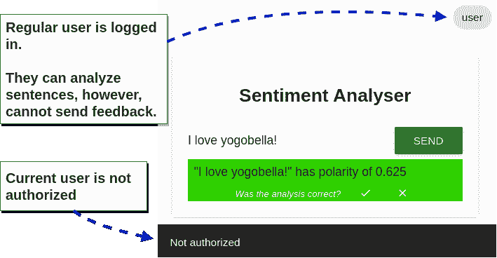

这是因为没有策略明确允许该请求。所以会默认否定。接下来，我们希望仅允许版主执行此操作。

我们使用`group`声明来区分版主和用户。我们可以通过以下政策实现这一目标:

```
apiVersion: security.istio.io/v1beta1
kind: AuthorizationPolicy
metadata:
  name: allow-feedback-for-mods
  namespace: istio-system
spec:
  selector:
    matchLabels:
      app: istio-ingressgateway
  action: ALLOW
  rules:
  - from:
    - source:
        requestPrincipals: ["*"]
    when:
    - key: request.auth.claims[group]
      values: ["moderator"]
```

将其应用到集群。

```
kubectl apply -f istio/security/allow-feedback.yaml
```

要验证版主是否可以发送反馈，请遵循以下步骤:打开一个匿名窗口，使用凭证`moderator / password`登录，键入一个句子，然后提交反馈。会成功的！

在安全性部分，我们学习了三种定制资源:

*   `PeerAuthentication` —用于对等方的认证
*   `RequestAuthentication` —用于最终用户的身份验证
*   `AuthorizationPolicy` —根据认证数据允许或拒绝请求。

## 摘要

嘿！你对这篇文章了如指掌。恭喜，干得好！这是一个相当长的过程，但是在你自己身上花了几个小时之后，你会清楚地知道`Istio`是什么，它能为你和你的企业做什么。

我们所学内容的总结:

*   服务网格是通过在应用程序旁边添加一个代理并拦截进出它的所有网络流量来实现的。
*   该代理支持:
    *   **高级交通管理**
        *   使用`Gateways`，我们定义服务代理(包括入口网关)接受的流量
        *   使用`VirtualServices`，我们定义如何将流量路由到目的地。
        *   使用`DestinationRules`，我们在路由发生后定义策略。在我们的实例中，我们只使用它来定义子集。
    *   **通过生成遥测数据制作可观测系统**
        *   访问日志记录单个请求的结果。
        *   跟踪显示了请求通过服务的流程。由督察 Gadget ( *可视化我没忍住，但你知道我指的是 JaegerP* 和 Kiali
        *   度量测量系统的属性、成功率、每秒操作数等等。
    *   **安全**
        *   `PeerAuthenticaiton`资源只强制执行相互认证的流量，确保所有服务到服务的流量被加密，明文流量被拒绝。
        *   `RequestAuthentication`资源根据配置的 jwk 验证 jwt。
        *   `AuthorizationPolicy`资源使我们能够决定是接受还是拒绝流量。

### 附加阅读

读到这里，你对 Istio 的了解比很多人都要多，甚至包括一些使用它运行产品服务的人。

然而，Istio 的一些怪癖可能会让你大吃一惊。有时，您的应用程序和代理可能会出现问题。您还会有其他问题，例如:

*   如何排除服务代理或入口网关的故障？
*   如何理解所应用的特使配置？
*   如何使用故障注入？
*   在边缘保护流量
*   如何建立多集群服务网格？幕后发生了什么？
*   基于机器的工作负载的集成可能吗？如果是，如何实现？
*   如何使用外部授权服务器？
*   第 2 天操作

我们在《Istio in Action》一书中回答了这些问题以及其他许多问题这本书真正让我感到自豪的是——除了它是对 Istio 最深入的阐述之外——它还有多少参考价值。

太疯狂了。每当我们解决一些棘手的问题，比如 DNS 解析、跨集群流量的故障排除等等，我发现我自己和 Solo 的其他现场工程师都会回头去看它。

以下是一些其他有用的资源:

*   [Istio 配置参考](https://istio.io/latest/docs/reference/config/)
*   [Istio’s blog](https://istio.io/latest/blog/)
*   Solo 的[博客](https://www.solo.io/blog/)和 [YouTube 频道](https://www.youtube.com/channel/UCuketWAG3WqYjjxtQ9Q8ApQ)
*   [克里斯蒂安·波斯塔的博客](https://blog.christianposta.com/)
*   [卡尔·斯通尼的博客](https://karlstoney.com/tag/istio/)

我借此机会感谢你加入我的这次航行。这并不容易，你坚持下来了，真了不起。

我很想听听你的想法，所以请随时在推特( [@rinormaloku](https://twitter.com/rinormaloku) )或我的页面【rinormaloku.com[联系我。](https://rinormaloku.com/)