# 如何使用 Snyk 找到并修复安全漏洞

> 原文：<https://www.freecodecamp.org/news/how-to-find-and-fix-security-vulnerabilities-using-snyk/>

在本文中，我们将讨论一个重要的话题，Python 中的安全性。

我们经常从 PyPi 下载并安装软件包，但我们不确定它们可能会带来哪些漏洞。

因此，在本教程中，我们将了解一个名为 Snyk 的出色工具，它可以帮助我们找到代码中的漏洞，然后修复它们。所以让我们开始吧！

## Snyk 是什么？

Snyk(发音为*skyve*)是一个开发者安全平台，用于保护代码、依赖项、容器和基础设施的安全。它扫描你的代码，通读它，并告诉你你的代码中是否有漏洞。

现在它不仅仅检查你的代码——它还可以检查已安装的依赖项、你的 Docker 容器、你的基础设施代码，以及其他一些东西。

Snyk 与许多语言兼容，并带有不同 ide 支持的插件。所以，这基本上是你的代码的语法。

## 如何开始使用 Snyk

要开始，您需要在 Snyk 上创建一个帐户。前往[https://snyk.io/](https://snyk.io/)注册一个免费账户。我建议你通过 Github 登录。

注册后，您可以登录您的帐户。登录后，您将能够看到一个类似的控制面板:

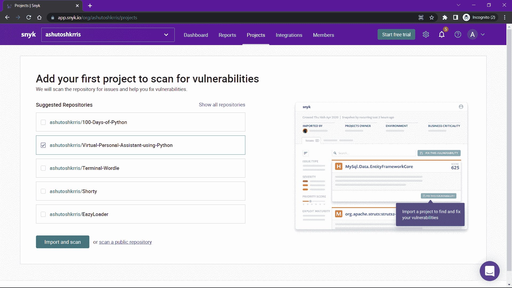

现在，您可以转到[此链接](https://docs.snyk.io/snyk-cli/install-the-snyk-cli)并按照说明下载 Snyk CLI。有多种方法可以下载 Snyk CLI。你可以选择其中任何一个。

如果您在这里，我假设您已经使用任何可用的方法安装了 Snyk CLI。现在我们需要做的是用 Snyk CLI 验证我们自己。

为此，请在终端中运行以下命令:

```
snyk auth
```

运行该命令时，将在默认浏览器中打开一个身份验证页面，如下所示:

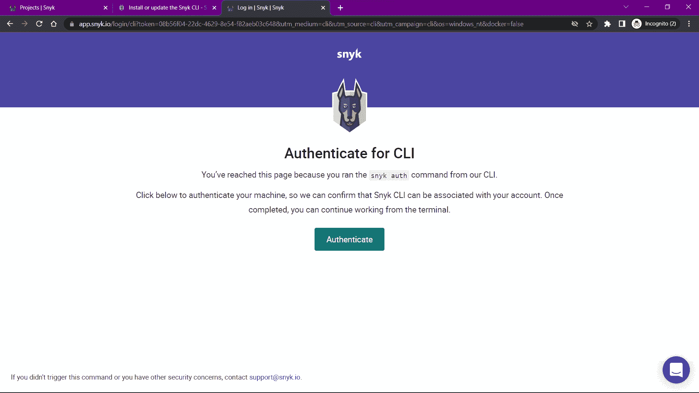

只需点击**认证**按钮，等待页面显示成功消息。看到消息后，您可以转到您的终端，在那里您会发现类似如下的输出:

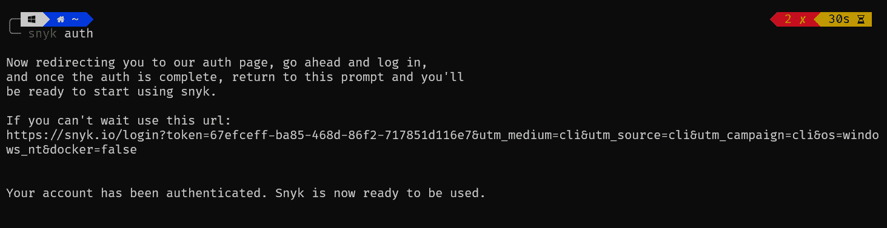

现在，Synk CLI 已经连接到您的帐户。

## 如何在演示应用中发现漏洞

出于演示目的，我们将使用一个用 Django 编写的名为 PyGoat 的 web 应用程序。我故意给 app 加了很多漏洞，这样我们就可以很好的演示一下 Snyk 用它了。

下面是 Github 资源库的链接:[https://github.com/purpledobie/pygoat](https://github.com/purpledobie/pygoat)。打开存储库链接，单击 Fork，然后将分叉的存储库克隆到您的本地机器上。

当您浏览存储库时，您会发现 docker 文件、作为代码文件的基础设施以及标准的 Python 文件。我们一会儿再看文件。您可以从 **requirements.txt** 文件安装 Python 依赖项。

```
pip install -r requirements.txt
```

### snyk 插件

Snyk 有适用于不同 ide 的插件，比如 Eclipse、VS Code 和 Jetbrains (PyCharm、IntelliJ 等等)。因为我使用的是 VS 代码，所以我在 IDE 上安装了 Snyk 扩展。您可以为您的 IDE 做同样的事情。

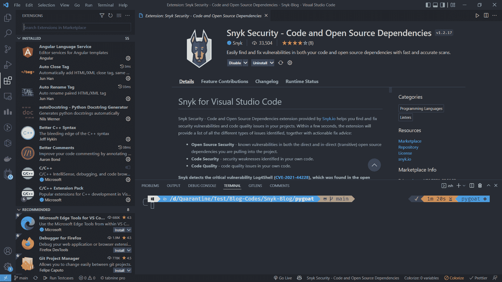

安装扩展后，您可能需要再次进行身份验证。一旦通过认证，插件将开始自动扫描代码。几秒钟后，它将显示类似如下的结果:

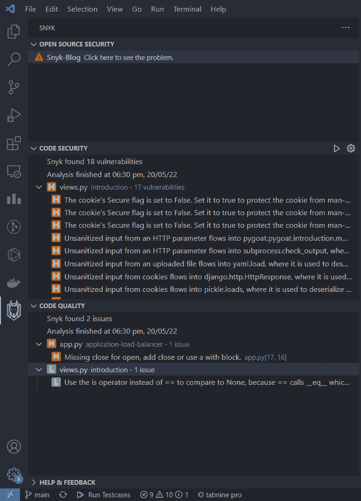

您可以看到代码中有 18 个代码安全漏洞和 2 个代码质量问题。

每个问题或漏洞旁边都有一个图标。可以分别是 **C** 、 **H** 、 **M** 、 **L** 意为**临界**、**高**、**中**、**低**。你可以点击它们中的任何一个来了解更多，它甚至会为问题或漏洞提出修复建议。

### Snyk CLI 命令

我们已经运行了一个 Synk CLI 命令——**`snyk auth`**——来通过 Snyk 验证我们自己。现在让我们看看其他一些重要的命令。

#### **1。`snyk test`命令**

该命令将扫描代码并显示任何漏洞。让我们运行它，看看会得到什么样的输出:

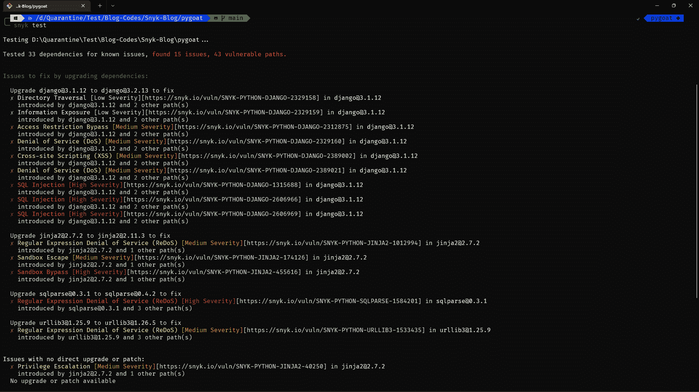

您可以看到它已经完成扫描，并发现了相同的漏洞。漏洞再次被标记为低、中、高和严重。

除此之外，它还为我们提供了解决问题的建议。例如，如果你看到上面的图片，这表明我们应该将 Django 从 3.1.12 版升级到 3.2.13 版，以解决很多问题。

让我们升级 Django，然后重新扫描应用程序，看看这些漏洞是否已经修复。

我们首先使用以下命令将 Django 版本升级到 3.2.13:

```
pip install django==3.2.13
```

您将得到类似的输出:

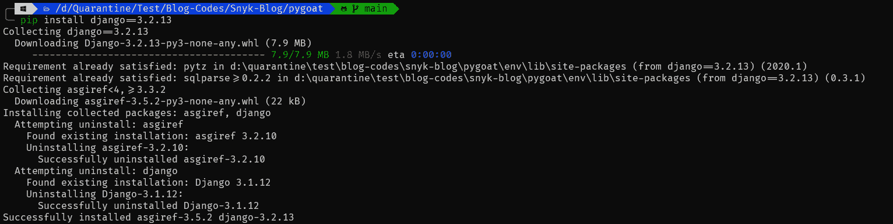

现在让我们使用`**snyk test**`命令重新扫描代码。

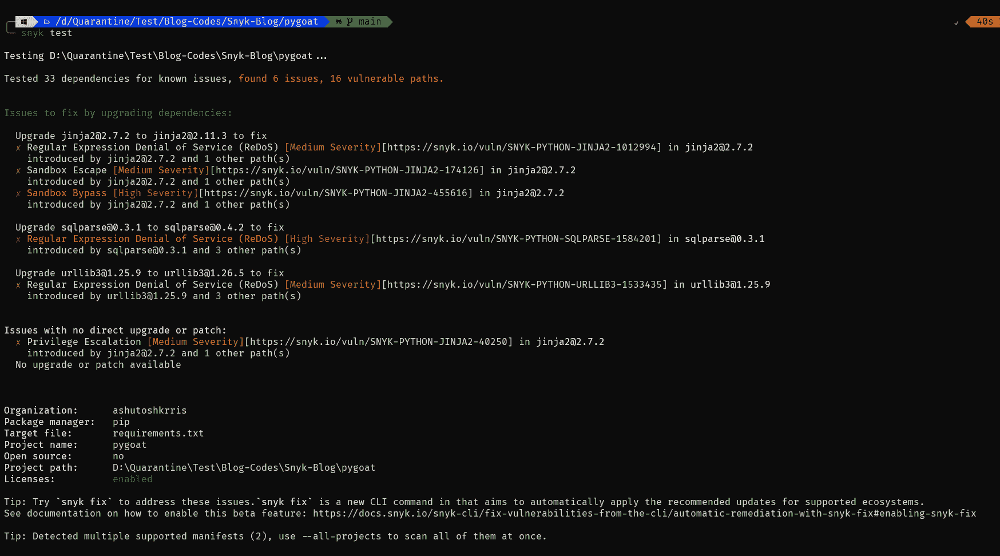

现在，如果你注意到，我们没有那些漏洞，如 SQL 注入。

#### **2。`snyk monitor`命令**

这个命令扫描代码，并在 Snyk UI 或 Snyk 平台上上传它的快照。让我们首先运行命令:

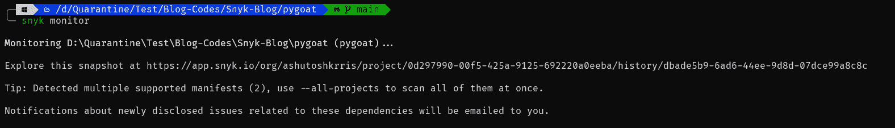

该命令拍摄了项目的快照，并将其上传到 Snyk 平台。然后它给了我们一个 URL，在那里我们可以看到很多关于该项目的其他信息。如果你打开网址，你会看到一个类似的网页:

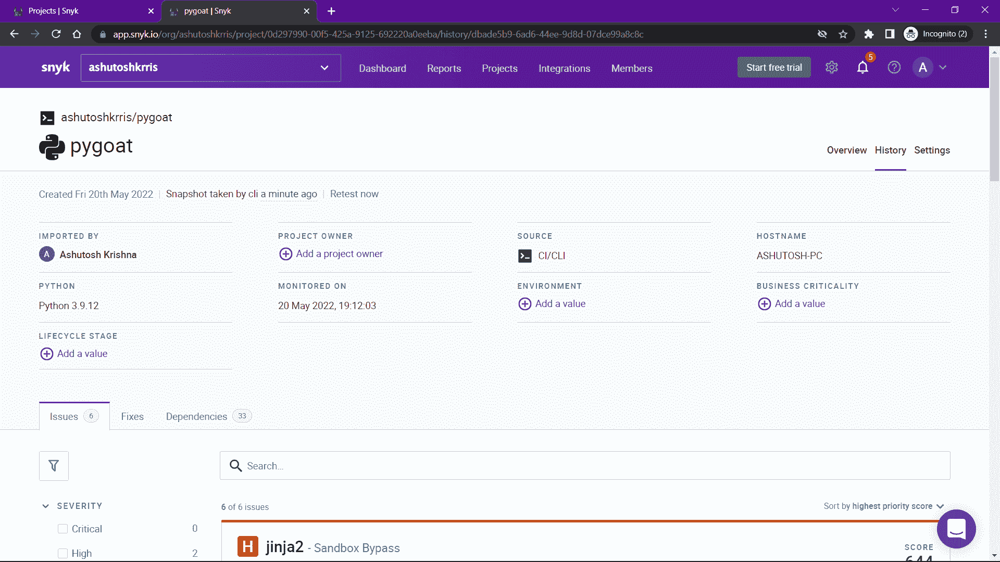

现在更容易发现应用程序中的漏洞。您也可以点击**立即重新测试**链接重新测试应用程序。您还可以看到应用程序的**修复**和**依赖**。

### 3.将基础设施作为代码扫描

如果您查看项目，您会发现一个名为 **infrastructure** 的文件夹。在那里面，我们有**应用-负载平衡器文件夹**。因此，这个项目可以部署到 AWS 负载均衡器。

有一个 Python 文件`**app.py**`实际上为 AWS 上的负载平衡器的配置生成了一个模板。然后在 **cdk.out** 文件夹中，可以找到一个由 Python 代码生成的**loadbalancerstack . template . JSON**文件。

为了在部署之前扫描任何错误的配置，我们实际上可以使用 Snyk 测试这个文件。同样的命令是:

```
snyk iac test <template-file-path>
```

让我们运行并查看输出:

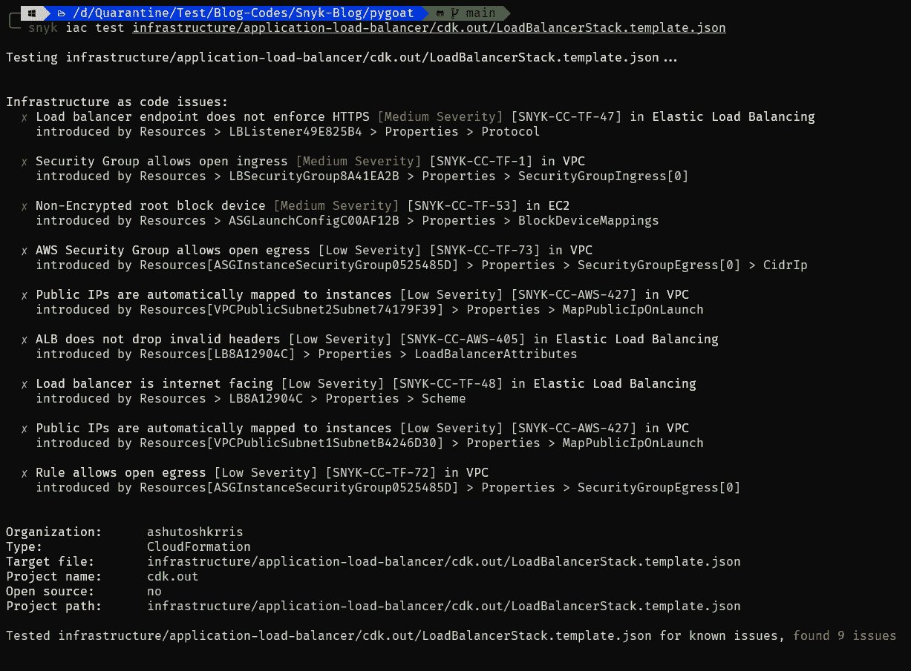

它显示了模板文件中的所有问题和漏洞。

### 4.扫描 Docker 文件和 Docker 图像

在这个项目中，我们有一个 docker 文件。您可以使用以下命令从 Docker 文件构建 Docker 映像:

```
docker build -t pygoat .
```

您可以看到下面创建的图像:

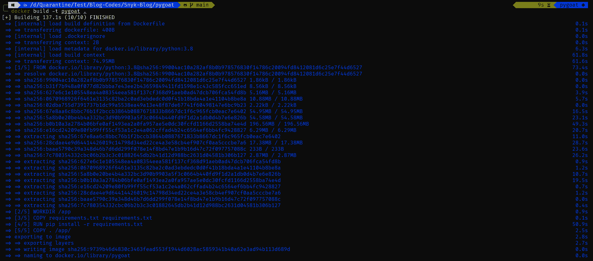

构建映像后，您可以使用以下命令扫描漏洞:

```
docker scan pygoat
```

Snyk 与 Docker 的集成使得扫描变得极其简单。

您将获得如下输出:

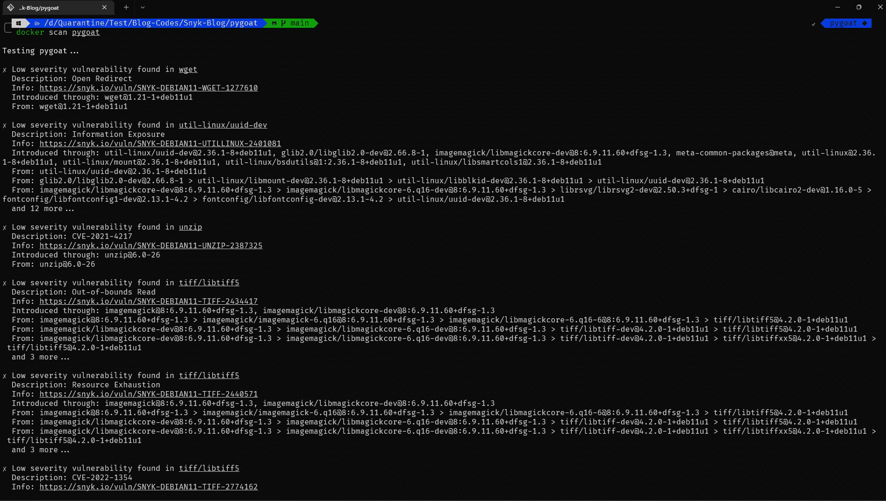

输出非常大，不可能显示所有的内容。但是我们可以看到图像中的漏洞。

## 如何整合 Snyk 和 GitHub

Snyk 可以自动为您修复问题。当您将 GitHub 存储库链接到 Snyk 时，它将扫描整个项目，如果它有任何漏洞的修复，它将创建一个带有修复的 Pull 请求。是不是很神奇？

由于我们已经使用 GitHub 登录，Snyk 已经可以访问我们的存储库。我们只需要选择我们希望扫描的存储库。

点击 Add project 按钮，然后点击 GitHub 并选择你的库。

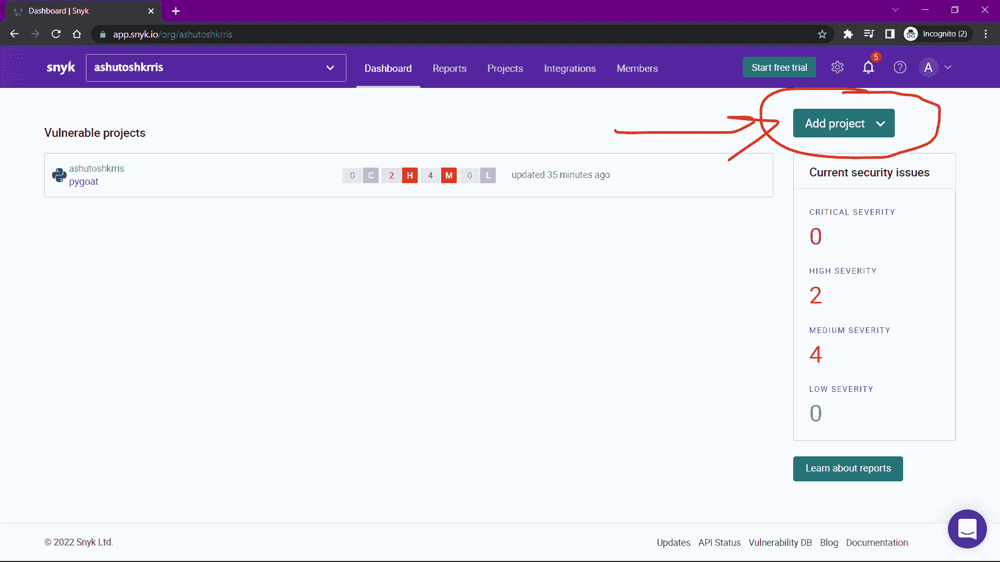

添加项目后，您可以在仪表板上找到它。Snyk 将自动扫描项目。

一旦你看到问题，你会看到一个**修复这个漏洞**(针对每个漏洞)或**修复这些漏洞**(针对修复所有漏洞)按钮。

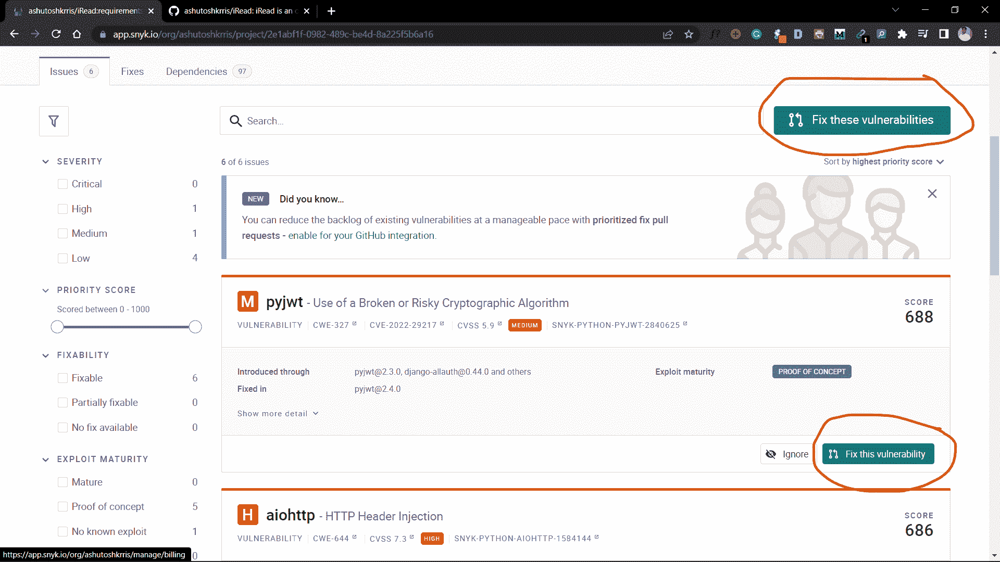

当你点击它，你会看到这个页面:

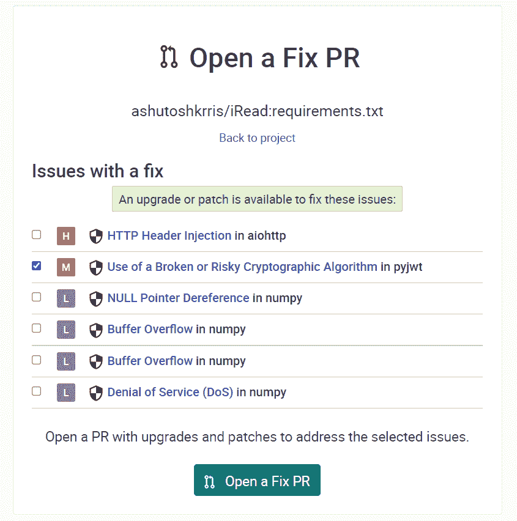

您可以选择复选框来修复您想要修复的漏洞，然后单击**打开修复程序**按钮。一旦你点击它，一个 PR 就会被创建在你的存储库中。

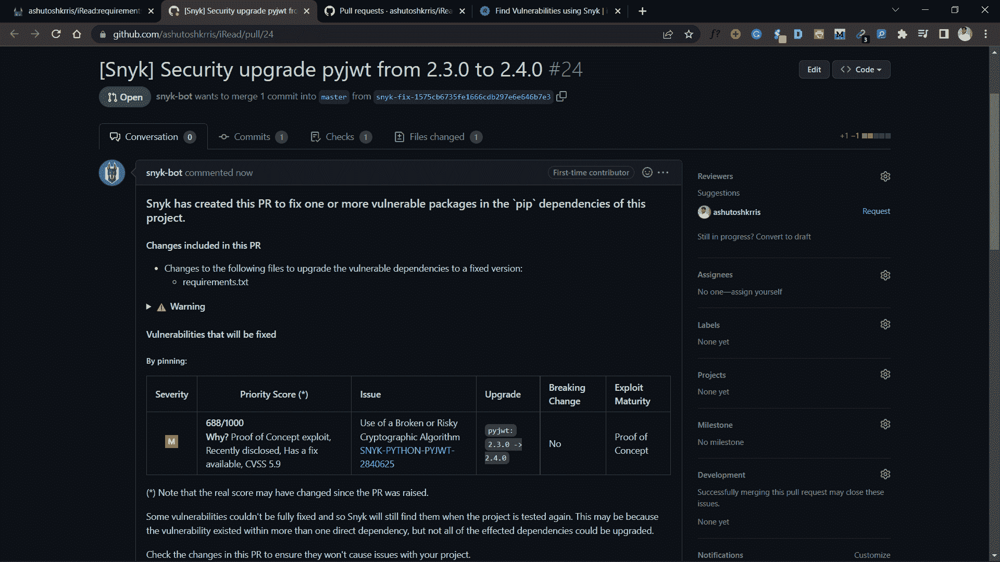

现在，您可以自由地合并或拒绝拉取请求。

## 结论

在本文中，我们学习了 Snyk，这是一个可以帮助我们找到漏洞并修复它们的工具。这只是一个基本的概述。关于它还有很多要了解的。

感谢阅读！

你可以在 [Twitter](https://twitter.com/ashutoshkrris) 上关注我，或者查看[我的博客](https://ireadblog.com)。