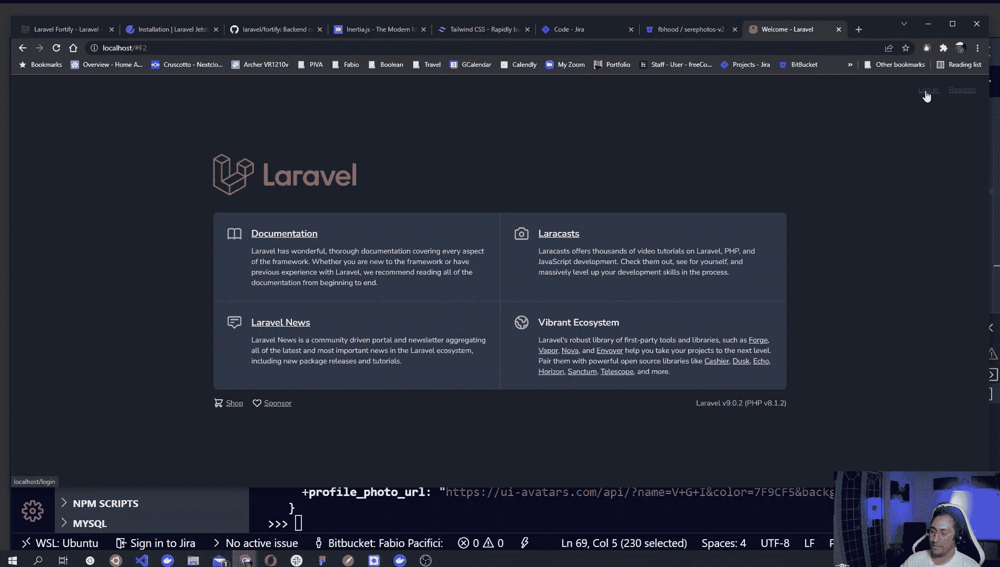
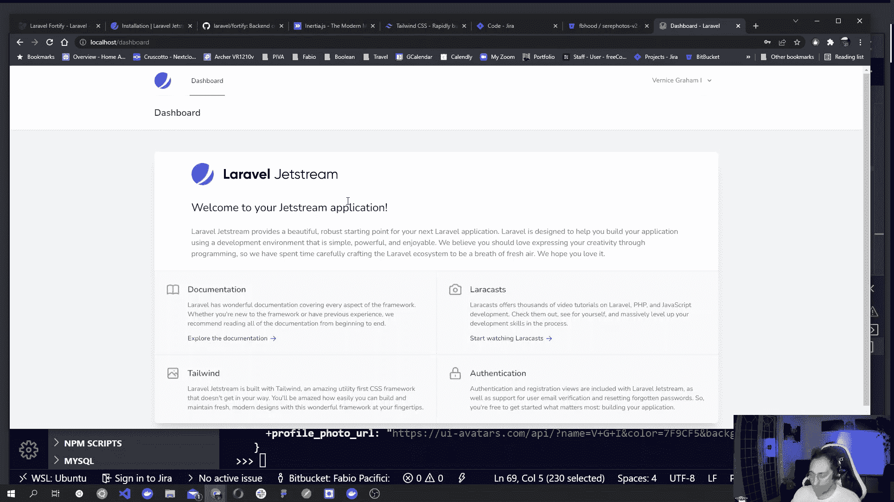
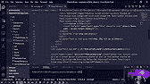

# 如何用 Laravel 9，MySQL，Vue.js，Inertia，Jetstream，Docker 构建全栈单页应用

> 原文：<https://www.freecodecamp.org/news/how-to-build-a-full-stack-single-page-application-with-laravel-mysql-vue-and-docker/>

在本教程中，您将学习如何构建单页应用程序。我将带您一步一步地完成这个过程，使用像 Laravel 9、Jetstream、Vuejs、Inertiajs、MySQL、Tailwind CSS 和 Docker 这样的尖端技术。

让我们开始吧。

## 遵循本指南您需要:

要跟进，您需要:

*   一台电脑
*   知道如何安装软件
*   对 HTML、CSS、JavaScript 和 PHP 有基本的了解
*   至少了解一个 JavaScript 框架，并理解 MVC 设计模式。

本指南分为 10 章，基于我录制的一个现场编码系列。实时编码系列完全没有脚本，所以会有一些你在本指南中找不到的错误和陷阱。

您可以在本文末尾找到完整的播放列表。

这里的一切应该只是工作，但如果它不觉得可以通过加入 Slack 上我的社区来寻求帮助。在那里你可以分享代码片段，直接和我聊天。

## 目录

*   我们使用的是什么技术？
*   [如何设置您的机器](#howtosetupyourmachine)
*   [如何用 Laravel 9，Laravel Sail，Jetstram，Inertia 和 Vue3 构建 app](#howtobuildtheappwithlaravel9laravelsailjetstraminertiaandvue3)
*   [如何重构管理仪表板并创建新的管理页面](#howtorefactortheadmindashboardandcreatenewadminpages)
*   [如何提交带有文件的表单](#howtosubmitformswithfiles)
*   [如何将表单添加到组件](#howtoaddtheformtothecomponent)
*   [如何存储数据](#howtostoredata)
*   [如何更新操作](#howtoupdateoperations)
*   [如何删除资源](#howtodeletearesource)
*   [总结，下一步是什么](#wrapupandwhatsnext)
*   [结论](#conclusion)

## 我们用的是什么技术？

首先，让我们回顾一下我们将在这个项目中使用的不同工具。

### 码头工人

Docker 是一组平台即服务产品，使用操作系统级虚拟化来交付称为容器的软件包中的软件。

为了简化这个概念，Docker 让您将应用程序和依赖项打包到一个容器中。

容器化的应用程序允许您拥有一个灵活的开发环境，这样您就可以运行不同的应用程序，而不用担心不同版本之间的依赖性、需求和冲突。您可以轻松运行应用程序，例如，需要两个不同版本的 PHP 和 MySQL。

每个团队成员都可以通过简单地运行相同容器的配置，快速地重现应用程序的相同环境。

如果你想了解更多关于 Docker 的知识，它的[文档](https://www.docker.com/)是一个很好的起点。

这里还有一本关于码头工人基本知识的手册，这样你可以练习你的技能。

### 关系型数据库

MySQL 是一个开源的关系数据库管理系统。您可以使用它将数据组织到一个或多个表中，这些表中的数据可能彼此相关。

我们需要在某个地方存储数据，这就是 MySQL 发挥作用的地方。

如果你想了解更多，这里有一些文件。如果你想深入了解，这里有一个 MySQL 上的[全免费课程。](https://www.freecodecamp.org/news/learn-to-use-the-mysql-database/)

### 拉勒韦尔

Laravel 是一个免费的开源 PHP web 框架，它可以帮助您开发遵循模型-视图-控制器架构模式的 web 应用程序。

Laravel 是一个令人惊叹的 PHP 框架，可以用来创建定制的 web 应用程序。

这里有 Laravel [文档](https://laravel.com/)了解更多信息，这里有[完整的基于项目的课程](https://www.freecodecamp.org/news/laravel-full-course/)帮助你学习 Laravel。

### 拉勒维尔帆

Laravel Sail 是一个轻量级命令行界面，用于与 Laravel 的默认 Docker 开发环境进行交互。

Sail 为使用 PHP、MySQL 和 Redis 构建 Laravel 应用程序提供了一个很好的起点，不需要任何 Docker 经验。

通常，创建一个开发环境来构建这样的应用程序意味着你必须在你的本地机器上安装软件、语言和框架——这是非常耗时的。多亏了 Docker 和 Laravel Sail，我们很快就可以开始运营了！

Laravel Sail 通过 WSL2 在 macOS、Linux 和 Windows [上得到支持。](https://docs.microsoft.com/en-us/windows/wsl/about)

如果你想仔细阅读，这里有[文档](https://laravel.com/docs/9.x/sail)。

### 拉勒维尔急流

构建 web 应用程序时，您可能希望让用户注册并登录来使用您的应用程序。这就是我们将使用 Jetstream 的原因。

Laravel Jetstream 是一个设计精美的 Laravel 应用入门套件，为您的下一个 Laravel 应用提供了完美的起点。

它使用 Laravel Fortify 来实现所有的后端认证逻辑。这些是[份文件](https://jetstream.laravel.com/2.x/introduction.html)。

### Vuejs

Vue.js 是一个开源的模型-视图-视图模型前端 JavaScript 框架，用于构建用户界面和单页面应用程序。

Vue 是一个很棒的框架，你可以单独使用它来构建单页面应用程序，但是你也可以和 Laravel 一起使用它来构建一些令人惊奇的东西。

如果你想阅读的话，这里有 Vue [文档](https://vuejs.org/)。这里有一个[伟大的 Vue 课程](https://www.freecodecamp.org/news/vue-3-full-course/)让你开始。

### 惯性 JS

惰性是 Laravel 和 Vuejs 之间的粘合剂，我们将使用它来构建使用经典服务器端路由的现代单页面应用程序。

你可以在的[文档中了解更多信息。](https://inertiajs.com/)

### 顺风

Tailwind CSS 是一个实用优先的 CSS 框架，包含 flex、pt-4、text-center 和 rotate-90 等类，可以用来直接在标记中构建任何设计

我们将在这个项目中使用它来构建我们的设计。如果你不熟悉顺风，这里有一个[快速指南，可以帮助你启动并运行](https://www.freecodecamp.org/news/get-started-with-tailwindcss/)。

## 如何设置您的机器

为了跟随我的现场编码(和本教程)，您需要在您的机器上安装 Docker desktop。如果您使用的是 Windows，还需要在系统设置中启用 WSL。

访问 Docker [入门页面](https://www.docker.com/get-started)安装 Docker Desktop。

如果您使用的是 Windows，请按照此处的步骤[启用 WSL2。](https://docs.microsoft.com/en-us/windows/wsl/about)

如果你有任何困难，请随时联系或加入我在 Slack 上的社区来寻求帮助。

## 带帆的 Laravel 装置

如果您已经在您的机器上成功安装了 Docker Desktop，我们可以打开终端并安装 Laravel 9。

打开终端窗口，浏览到您想要保存项目的文件夹。然后运行下面的命令下载最新的 Laravel 文件。该命令会将所有文件放入一个名为 my-example-app 的文件夹中，您可以随意调整该文件夹。

```
# Download laravel
curl -s "https://laravel.build/my-example-app" | bash
# Enter the laravel folder
cd my-example-app 
```

### 使用`sail up`命令在 Docker 上部署 Laravel

Docker Desktop 启动并运行后，下一步是启动 Laravel sail 来构建本地运行我们的应用程序所需的所有容器。

从下载了所有 Laravel 文件的文件夹中运行以下命令:

```
vendor/bin/sail up 
```

需要一分钟。然后访问 [http://localhost](http://localhost) ，您应该会看到您的 Laravel 应用程序。

如果您运行`sail up`并得到以下错误，很可能您需要更新 Docker 桌面:

```
ERROR: Service 'laravel.test' failed to build: 
```

## 如何使用 Laravel 9、Laravel Sail、Jetstram、Inertia 和 Vue3 构建应用程序

在本节中，我们将定义一个基本的路线图，用 Laravel Sail 安装 Laravel 9，运行 Sail，并构建容器。

我还会带你参观拉勒维尔赛尔号和赛尔号。

然后，我们将安装 Jetstream 和 scaffold Vue 和惯性文件，看看这些文件和可用的功能。

接下来，我们将填充我们的数据库，并添加 Jetstream 提供的前端，以注册一个帐户并登录到一个新的 Laravel 应用程序。

最后，我们将看看 Jetstream 仪表板和惯性/Vue 组件，然后开始玩。

在这一过程中，我们将禁用注册，启用 Jetstream 用户资料图片功能，然后添加我们的第一个惯性页面，我们将在其中呈现一些从数据库中获取的数据。

如果你想沿着这条路走下去，这里有现场编码视频:

[https://www.youtube.com/embed/c0ibec9dhZA?feature=oembed](https://www.youtube.com/embed/c0ibec9dhZA?feature=oembed)

如果你喜欢跟随这个书面教程，这里有所有的步骤。

只是提醒一下——你应该把 Laravel 和 Sail 一起安装，并在你的机器上设置 Docker。如果你还没有这样做，你可以按照上面的步骤来做。

### Laravel Sail 概述–Sail 命令

随着 Laravel Sail 的安装，我们通常的 Laravel 命令有了一点点改变。

例如，我们现在不得不使用 Sail 来运行 Laravel artisan 命令，而不是像`php artisan`那样使用 PHP，就像这样:`sail artisan`。

`sail artisan`命令将返回所有可用 Laravel 命令的列表。

通常，当我们使用 Laravel 时，我们还必须运行`npm`和`composer`命令。

同样，我们需要给命令加上前缀`sail`,让它们在容器中运行。

下面是您可能需要运行的一些命令的列表:

```
# Interact with the database - run the migrations
sail artisan migrate # It was: php artisan migrate
# Use composer commands
sail composer require <packageName> # it was: composer require <packageName>
# Use npm commands
sail npm run dev # it was: npm run dev 
```

您可以在 [Sail 文档](https://laravel.com/docs/9.x/sail#executing-sail-commands)中了解更多信息。

### 安装 Jetstream 和脚手架 Vue 和惯性

现在让我们安装 Laravel Jetstream 认证包，并使用带有 Vue3 的惯性脚手架。

```
cd my-example-app
sail composer require laravel/jetstream 
```

记住在 composer 命令前加上前缀`sail`。

上面的命令为 Laravel 添加了一个新命令。现在我们需要运行它来安装所有的 Jetstream 组件:

```
sail artisan jetstream:install inertia 
```

接下来，我们需要用 npm 编译所有静态资产:

```
sail npm install
sail npm run dev 
```

在实际看到我们的应用程序之前，我们需要运行数据库迁移，这样 Jetstream 所需的会话表就存在了。

```
sail artisan migrate 
```

搞定了。Jetstream 现已安装在我们的应用程序中。如果您在浏览器中访问`http://localhost`,您应该会看到 Laravel 应用程序的顶部有两个注册和登录的链接。



### 填充数据库并创建一个用户帐户

在创建新用户之前，让我们快速地看一下 Laravel Sail 在`.env`文件中为我们创建的数据库配置。

```
DB_CONNECTION=mysql
DB_HOST=mysql
DB_PORT=3306
DB_DATABASE=my-example-app
DB_USERNAME=sail
DB_PASSWORD=password 
```

如您所见，Laravel Sail 配置了我们访问 Docker 上运行的数据库容器所需的一切。`DB_DATABASE`是数据库的名称，与项目文件夹相同。这就是为什么在上一步中我们能够顺利运行`migrate`命令的原因。

由于我们已经迁移了所有的数据库表，现在我们可以使用 Laravel 内置的用户工厂来创建一个新用户，然后使用它的详细信息来登录我们的用户仪表板。

让我们打开 artisan tinker 与我们的应用程序进行交互。

```
sail artisan tinker 
```

上面的命令将打开一个命令行界面，我们可以用它来与我们的应用程序进行交互。让我们创建一个新用户。

```
User::factory()->create() 
```

上面的命令将创建一个新用户，并将其数据保存在我们的数据库中。然后，它会将用户数据呈现在屏幕上。确保复制用户电子邮件，以便我们稍后可以使用它登录。然后通过键入`exit;`退出。

工厂创建的每个用户的默认密码是`password`。

让我们访问登录页面并访问我们的应用程序控制面板。


### Jetstream 仪表板

登录后，你被重定向到 Jetstream 仪表板，默认情况下看起来很棒。我们可以随意定制，但这只是一个起点。



### Jetstream/Vue 组件和惯性概述

安装 Jetstram 后，您可能注意到的第一件事是在我们的应用程序中注册了许多 Vue 组件。不仅如此，惯性也会带来 Vue 成分。

要使用惯性，我们需要在定义路线时熟悉它。

当我们安装 Jetstream 时，它在`resources/js`目录中创建了许多子文件夹，所有的 Vue 组件都在其中。不仅仅是简单的组件，还有惯性渲染的页面组件作为我们的视图。

Jetstream 惯性脚手架创造了:

*   这里我们有 27 个 Jetstream 使用的组件，但是如果我们愿意，我们也可以在我们的应用程序中使用它们。
*   在这个文件夹中，惯性使用布局组件来呈现仪表板页面
*   这是我们放置所有页面(视图)组件的地方。您可以在这里找到仪表板页面和 Laravel 欢迎页面组件。

惯性的力量主要来自它如何连接 Vue 和 Laravel，让我们将数据(数据库模型等)作为道具传递给我们的 Vue 页面组件。

当您打开`routes/web.php`文件时，您会注意到我们不再返回视图，而是使用`Inertia`来呈现页面组件。

让我们检查一下呈现欢迎组件的`/`主页路径。

```
Route::get('/', function () {
    return Inertia::render('Welcome', [
        'canLogin' => Route::has('login'),
        'canRegister' => Route::has('register'),
        'laravelVersion' => Application::VERSION,
        'phpVersion' => PHP_VERSION,
    ]);
}); 
```

这看起来像我们通常的路由定义，除了在闭包里我们通过调用惯性类`Inertia::render()`的`render`方法返回一个`\Inertia\Response`。

该方法接受两个参数。第一个是组件名。这里，我们传递了`Welcome`页面组件，而第二个参数是一个关联数组，它将变成一个要传递给组件的`props`列表。这就是奇迹发生的地方。

在 Welcome 组件内部，您会注意到在它的脚本部分，我们简单地定义了四个与关联数组的键相匹配的属性。然后惯性会完成剩下的工作。

```
<script>
    import { defineComponent } from 'vue'
    import { Head, Link } from '@inertiajs/inertia-vue3';

    export default defineComponent({
        components: {
            Head,
            Link,
        },
        // 👇 Define the props 
        props: {
            canLogin: Boolean, 
            canRegister: Boolean,
            laravelVersion: String,
            phpVersion: String,
        }
    })
</script> 
```

然后我们可以调用模板中的道具。如果你查看模板部分，你会注意到代码中引用了`laravelVersion`和`phpVersion`，就像你通常在 Vuejs 中处理 props 一样。

```
<div class="ml-4 text-center text-sm text-gray-500 sm:text-right sm:ml-0">
  Laravel v{{ laravelVersion }} (PHP v{{ phpVersion }})
</div> 
```

仪表板组件略有不同。事实上，它使用在`Layouts/AppLayout.vue`下定义的布局，并使用`Welcome`组件来呈现仪表板页面内容，这与 laravel 欢迎页面相同。

```
 <template>
    <app-layout title="Dashboard">
        <template #header>
            <h2 class="font-semibold text-xl text-gray-800 leading-tight">
                Dashboard
            </h2>
        </template>

        <div class="py-12">
            <div class="max-w-7xl mx-auto sm:px-6 lg:px-8">
                <div class="bg-white overflow-hidden shadow-xl sm:rounded-lg">
                    <welcome /> 
                </div>
            </div>
        </div>
    </app-layout>
</template> 
```

在布局组件中，您会注意到两个惯性组件`Head`和`Link`。

我们可以使用`Head`组件向页面添加 head 元素，比如 meta 标签、页面标题等等。`Link`组件是一个围绕标准锚标记的包装器，它增加点击事件并防止整页重新加载，正如你在惯性文档中看到的。

[链接组件](https://inertiajs.com/links)
[头部组件](https://inertiajs.com/title-and-meta#head-component)

### 禁用注册功能

如果你跟着做，下一步我将禁用 Jetstream 提供的一个功能——注册一个帐户。

为此，我们可以导航到`config/fortify.php`并注释掉 features 数组中的第 135 行`Features::registration()`。

```
'features' => [
        //Features::registration(),
        Features::resetPasswords(),
        // Features::emailVerification(),
        Features::updateProfileInformation(),
        Features::updatePasswords(),
        Features::twoFactorAuthentication([
            'confirmPassword' => true,
        ]),
    ], 
```

如果我们访问欢迎页面，我们会注意到`register`链接不见了。此外，当我们运行`sail artisan route:list`时，路线不再列出。

### 启用 Jetstream 用户个人资料图片

现在让我们尝试启用名为 ProfilePhotos 的 Jetstream 特性。正如您所猜测的，这将允许用户添加个人资料图片。

为此，我们需要访问`config/jetstream.php`并取消对第 59 行`Features::profilePhoto`的注释。

```
 'features' => [
        // Features::termsAndPrivacyPolicy(),
        Features::profilePhotos(), // 👈
        // Features::api(),
        // Features::teams(['invitations' => true]),
        Features::accountDeletion(),
    ], 
```

如果您登录，您会看到在用户个人资料中，有一个新的部分可用于上传个人资料图片。

但是在做任何其他事情之前，我们需要运行`sail artisan storage:link`以便 Laravel 创建一个到`storage/app/public`文件夹的符号链接，我们将在那里保存所有用户资料图像。

现在尝试访问用户个人资料并更新个人资料图片。如果你在图像上得到 404，这是因为默认情况下 Laravel sail 假设我们正在使用 Laravel valet，并在`.env`文件中设置应用程序 URL，就像这样`APP_URL=http://my-example-app.test`。让我们更改它，改用 localhost。

```
APP_URL=http://localhost 
```

现在，我们应该可以开始查看和更改我们的个人资料图像了！🥳

### 如何添加我们的第一个惯性页面，并从数据库中呈现记录

由于我们渲染的是 Vue 组件而不是刀片视图，明智的做法是在我们创建或编辑 Vue 组件时开始`sail npm run watch`观察并重新编译它们。接下来，让我们添加一个新的照片页面。

我将首先在 web.php 中创建一个新的路由:

```
Route::get('photos', function () {
    //dd(Photo::all());
    return Inertia::render('Guest/Photos');
}); 
```

在上面的代码中，我定义了一个新的 GET route，然后呈现了一个组件，我将把它放在`resources/js/Pages/Guest`中并调用`Photos`。让我们创造它。

创建来宾文件夹:

```
cd resources/js/Pages
mkdir Guest
cd Guest
touch Photos.vue 
```

那么让我们定义一个基本组件:

```
<template>
  <h1>Photos Page</h1>
</template> 
```

如果我们访问`http://localhost/photos/`就会看到我们的新页面，酷！让我们从欢迎页面复制页面结构，这样我们也可以获得登录和仪表板链接。

组件将变成这样:

```
<template>
    <Head title="Phots" />

    <div class="relative flex items-top justify-center min-h-screen bg-gray-100 dark:bg-gray-900 sm:items-center sm:pt-0">
        <div v-if="canLogin" class="hidden fixed top-0 right-0 px-6 py-4 sm:block">
            <Link v-if="$page.props.user" :href="route('admin.dashboard')" class="text-sm text-gray-700 underline">
                Dashboard
            </Link>

            <template v-else>
                <Link :href="route('login')" class="text-sm text-gray-700 underline">
                    Log in
                </Link>

                <Link v-if="canRegister" :href="route('register')" class="ml-4 text-sm text-gray-700 underline">
                    Register
                </Link>
            </template>
        </div>

        <div class="max-w-6xl mx-auto sm:px-6 lg:px-8">
            <h1>Photos</h1>

        </div>
    </div>
</template>

<script>
    import { defineComponent } from 'vue'
    import { Head, Link } from '@inertiajs/inertia-vue3';

    export default defineComponent({
        components: {
            Head,
            Link,
        },

        props: {
            canLogin: Boolean,
            canRegister: Boolean,

        }
    })
</script> 
```

下一步是在这个新页面上呈现大量数据。为此，我们将构建一个模型，并向数据库添加一些记录。

```
saild artisan make:model Photo -mfcr 
```

这个命令创建一个名为`Photo`的模型，加上一个数据库迁移表类、一个工厂和一个资源控制器。

现在让我们在刚刚创建的迁移中定义数据库表。访问`database/migrations`文件夹，您应该会看到一个文件名类似于此的文件:`2022_02_13_215119_create_photos_table`(您的名称会略有不同)。

在迁移文件中，我们可以定义一个基本表，如下所示:

```
 public function up()
    {
        Schema::create('photos', function (Blueprint $table) {
            $table->id();
            $table->string('path');
            $table->text('description');
            $table->timestamps();
        });
    } 
```

对于我们的表，我们只定义了两个新列，`path`和`description`，加上将由`$table->id()`和`$table->timestamps()`方法创建的`id`、`created_at`和`updated_at`。

在迁移之后，我们将定义一个种子，然后运行迁移并播种数据库。

在`database/seeders/PhotoSeeder.php`文件的顶部，我们将导入我们的模型和 Faker:

```
use App\Models\Photo;
use Faker\Generator as Faker; 
```

接下来，我们将使用 for 循环实现 run 方法，在数据库中创建 10 条记录。

```
 public function run(Faker $faker)
    {
        for ($i = 0; $i < 10; $i++) {
            $photo = new Photo();
            $photo->path = $faker->imageUrl();
            $photo->description = $faker->paragraphs(2, true);
            $photo->save();
        }
    } 
```

我们已经准备好运行迁移并播种数据库。

```
 sail artisan migrate
sail artisan db:seed --class PhotoSeeder 
```

我们现在准备在`Guest/Photos`页面组件上显示数据。
首先更新路线，并将一组照片作为道具传递给渲染组件:

```
Route::get('photos', function () {
    //dd(Photo::all());
    return Inertia::render('Guest/Photos', [
        'photos' => Photo::all(), ## 👈 Pass a collection of photos, the key will become our prop in the component
        'canLogin' => Route::has('login'),
        'canRegister' => Route::has('register'),
    ]);
}); 
```

其次，将道具传递给 Guest/Photos 组件的脚本部分中的道具:

```
 props: {
    canLogin: Boolean,
    canRegister: Boolean,
    photos: Array // 👈 Here
} 
```

最后，遍历数组并渲染模板部分中的所有照片，就在 h1:

```
<section class="photos">
    <div v-for="photo in photos" :key="photo.id" class="card" >
        
    </div>
</section> 
```

搞定了。如果你访问`/photos`页面，你会看到十张照片。🥳

## 如何重构管理仪表板并创建新的管理页面

在本章中，我们将重新路由 Jetstream 仪表板，并为所有管理页面创建一个路由组。

然后，我们将看到如何向仪表板添加一个新链接，并添加一个新的管理页面。

最后，我们将从数据库中收集数据，并将它们呈现在一个基本表中。默认的表格不够酷，所以对于阅读本文的读者，我决定添加一个顺风表格组件。

### 重新安排 Jetstream 仪表板的路线

如果我们查看`config/fortify.php`文件，我们可以看到在第 64 行有一个名为 home 的键。它正在调用路由服务提供者的`Home`常量。

这意味着我们可以修改常量，并将经过身份验证的用户重定向到不同的路由。

让我们一步一步来看:

*   更新主页常量
*   创建路由组并将登录用户重定向到`admin/`而不是“/dashboard”

我们的应用程序将只有一个用户，所以一旦他们登录，这显然是网站管理员-所以重定向到一个`admin` URI 是有意义的。

改变第 20 行附近的`app/Providers/RouteServiceProvider.php`中的原点常数，以匹配以下内容:

```
public const HOME = '/admin'; 
```

### 如何添加管理页面路由组

接下来，让我们更新我们在 web.php 的路线。我们将更改 Jetstream 登记的路线:

```
Route::middleware(['auth:sanctum', 'verified'])->get('/', function () {
        return Inertia::render('Dashboard');
    })->name('dashboard'); 
```

对此:

```
Route::middleware(['auth:sanctum', 'verified'])->prefix('admin')->name('admin.')->group(function () {

    Route::get('/', function () {
        return Inertia::render('Dashboard');
    })->name('dashboard');

    // other admin routes here
}); 
```

上面的路由是一个路由组，该路由组对组内的所有路由使用`auth:sanctum`中间件，前缀为`admin`，并在每个路由名称后添加一个`admin`后缀。

最终结果是，我们将能够通过名称来引用仪表板路线，现在名称将是`admin.dashboard`。当我们登录时，我们将被重定向到`admin`路线。我们的仪表板路线将会响应，因为 URI 只是`/`，但是 goup 前缀将会在组中的每条路线前加上前缀，并使它们的 URI 以`admin`开始。

如果您现在运行`sail artisan route:list`,您将会注意到仪表板路线如我们所料发生了变化。

在进入下一步之前，我们需要更新`/layouts/AppLayout.vue`和`/Pages/Welcome.vue`组件。

您还记得仪表板路线名称现在是`admin.dashboard`而不仅仅是`dashboard`吗？

让我们检查这两个组件，并将`route('dahsboard')`的每个引用更新为:

```
route('admin.dahsboard') 
```

此外,`route().current('dashboard')`的每一处提及:

```
route().current('admin.dashboard') 
```

在所有的更改之后，确保重新编译 Vue 组件，并通过运行`sail npm run watch`来观察更改。然后访问主页，检查是否一切正常。

### 如何向仪表板添加新链接

现在，要添加一个新的管理页面，我们可以在其中列出存储在数据库中的所有照片，我们需要向我们之前创建的组添加一个新的 route。让我们点击`web.php`文件并进行修改。

在路由组中，我们将添加一条新路由:

```
Route::middleware(['auth:sanctum', 'verified'])->prefix('admin')->name('admin.')->group(function () {

    Route::get('/', function () {
        return Inertia::render('Dashboard');
    })->name('dashboard');

    // 👇 other admin routes here 👇

    Route::get('/photos', function () {
        return inertia('Admin/Photos');
    })->name('photos'); // This will respond to requests for admin/photos and have a name of admin.photos

}); 
```

在上面的新路径中，我们使用了`inertia()` helper 函数来做同样的事情——返回惯性/响应并呈现我们的页面组件。我们将组件放在`Pages`中的一个`Admin`文件夹下，我们将把它命名为`Photos.vue`。

在创建组件之前，让我们向仪表板添加一个指向新路线的新链接。

在`AppLayout.vue`中，找到`Navigation Links`注释，复制/粘贴`jet-nav-link`组件，该组件实际上显示了到仪表板的链接，并使其指向我们的新路线。

您最终会得到这样的结果:

```
<!-- Navigation Links -->
<div class="hidden space-x-8 sm:-my-px sm:ml-10 sm:flex">
    <jet-nav-link :href="route('admin.dashboard')" :active="route().current('admin.dashboard')">
        Dashboard
    </jet-nav-link>
    <!-- 👇 here it is our new link -->
      <jet-nav-link :href="route('admin.photos')" :active="route().current('admin.photos')">
        Photos
    </jet-nav-link>
</div> 
```

我们上面的链接使用`route('admin.photos')`指向管理组中的正确路径。

如果您访问`localhost/dashboard`并打开检查器，您应该会看到一个错误:

```
Error: Cannot find module `./Photos.vue` 
```

很好——我们还没有创建照片页面组件。所以让我们现在就开始吧！

### 如何添加新的管理页面组件

在`Pages/Admin`文件夹中创建一个名为`Photos.vue`的文件。下面是通过终端创建文件夹和文件的 bash 命令，但是您也可以使用 IDE 的图形界面来完成同样的操作。

```
cd resources/js/Pages
mkdir Admin
touch Admin/Photos.vue 
```

为了使这个新页面看起来像仪表板页面，我们将复制它的内容。您最终应该会得到这样的结果:

```
 <template>
  <app-layout title="Dashboard"> <!-- 👈 if you want you can update the page title -->
    <template #header>
      <h2 class="font-semibold text-xl text-gray-800 leading-tight">Photos</h2>
    </template>

    <div class="py-12">
      <div class="max-w-7xl mx-auto sm:px-6 lg:px-8">
        <div class="bg-white overflow-hidden shadow-xl sm:rounded-lg">
          <!-- 👇  All photos for the Admin page down here -->
          <h1 class="text-2xl">Photos</h1>

        </div>
      </div>
    </div>
  </app-layout>
</template>

<script>
import { defineComponent } from "vue";
import AppLayout from "@/Layouts/AppLayout.vue";

export default defineComponent({
  components: {
    AppLayout,
  },
});
</script> 
```

我从仪表板模板中删除了一些内容，所以请务必仔细检查上面的代码。从模板中删除了`welcome`组件，因为它在此页面中不需要，在脚本部分中也不需要它的引用。其余的都是一样的。

请随意更新在`<app-layout title="Dashboard">`上作为道具引用的页面标题。

现在，当您访问`localhost/admin`时，您可以点击照片菜单项，查看我们的照片页面组件内容。现在不多，就一个`h1`。

### 如何将管理页面中的记录呈现为表格

现在是将数据呈现到表格上的时候了。为了使事情顺利进行，让我们首先添加我们的标记，并伪造我们已经可以访问的对象数组，并在我们的表中对它们进行循环。然后我们会想办法让事情变得真实。

```
 <table class="table-auto w-full text-left">
  <thead>
    <tr>
      <th>ID</th>
      <th>Photo</th>
      <th>Desciption</th>
      <th>Actions</th>
    </tr>
  </thead>
  <tbody>
    <tr v-for="photo in photos">
      <td>{{ photo.id }}</td>
      <td></td>
      <td>{{photo.description}}</td>
      <td>View - Edit - Delete</td>

    </tr>
  </tbody>
</table> 
```

好了，既然我们假设我们的组件可以访问照片列表，那么让我们从 Route 向组件传递一个新的道具。

更新 web.php 的路线，并将第二个参数传递给`inertia()`函数，该参数将是一个关联数组。它将把它的键作为道具传递给 Vue 页面组件。

在这个函数中，我们将调用`Photo::all()`来将一个集合分配给一个`photos`键，但是如果你想对结果进行分页，你可以使用其他的方法。

```
Route::get('/photos', function () {
    return inertia('Admin/Photos', [
        'photos' => Photo::all()
    ]);
})->name('photos'); 
```

为了将道具连接到我们的页面组件，我们需要在组件内部定义道具。

```
<script>
import { defineComponent } from "vue";
import AppLayout from "@/Layouts/AppLayout.vue";

export default defineComponent({
  components: {
    AppLayout,
  },
  /* 👇 Pass the photos array as a props 👇 */
  props: {
    photos: Array,
  },
});
</script> 
```

#### 额外:如何使用顺风表组件

Tailwind 是一个类似于 Bootstrap 的 CSS 框架。有许多免费使用的组件，我们可以从文档中获取、调整和使用。

这个表格组件是免费的，看起来还不错:[https://tailwindui . com/components/application-ui/lists/tables](https://tailwindui.com/components/application-ui/lists/tables)。

我们可以 tweek 照片页面模板，并使用 Tailwind 表格组件来获得一个漂亮的表格，如下所示:

```
 <template>
    <app-layout title="Dashboard">
        <template #header>
            <h2 class="font-semibold text-xl text-gray-800 leading-tight">Photos</h2>
        </template>

         <div class="py-12">
            <div class="max-w-7xl mx-auto sm:px-6 lg:px-8">
              <!-- All posts goes here -->
              <h1 class="text-2xl">Photos</h1>
              <a class="px-4 bg-sky-900 text-white rounded-md" href>Create</a>
              <div class="flex flex-col">
                  <div class="-my-2 overflow-x-auto sm:-mx-6 lg:-mx-8">
                      <div class="py-2 align-middle inline-block min-w-full sm:px-6 lg:px-8">
                          <div class="shadow overflow-hidden border-b border-gray-200 sm:rounded-lg">
                              <table class="min-w-full divide-y divide-gray-200">
                                  <thead class="bg-gray-50">
                                      <tr>
                                          <th
                                              scope="col"
                                              class="px-6 py-3 text-left text-xs font-medium text-gray-500 uppercase tracking-wider"
                                          >ID</th>
                                          <th
                                              scope="col"
                                              class="px-6 py-3 text-left text-xs font-medium text-gray-500 uppercase tracking-wider"
                                          >Photos</th>
                                          <th
                                              scope="col"
                                              class="px-6 py-3 text-left text-xs font-medium text-gray-500 uppercase tracking-wider"
                                          >Description</th>
                                          <th scope="col" class="relative px-6 py-3">
                                              <span class="sr-only">Edit</span>
                                          </th>
                                      </tr>
                                  </thead>
                                  <tbody class="bg-white divide-y divide-gray-200">
                                      <tr v-for="photo in photos" :key="photo.id">
                                          <td class="px-6 py-4 whitespace-nowrap">
                                              <div
                                                  class="text-sm text-gray-900"
                                              >{{ photo.id }}</div>
                                          </td>

                                          <td class="px-6 py-4 whitespace-nowrap">
                                              <div class="flex items-center">
                                                  <div class="flex-shrink-0 h-10 w-10">
                                                      
                                                  </div>
                                              </div>
                                          </td>

                                          <td class="px-6 py-4 whitespace-nowrap">
                                              <div class="text-sm text-gray-900">
                                                {{ photo.description.slice(0, 100) + '...' }}
                                              </div>
                                          </td>
                                        <!-- ACTIONS -->
                                          <td class="px-6 py-4 whitespace-nowrap text-right text-sm font-medium">
                                              <a href="#" class="text-indigo-600 hover:text-indigo-900">
                                              View - Edit - Delete
                                              </a>
                                          </td>
                                      </tr>
                                  </tbody>
                              </table>
                          </div>
                      </div>
                  </div>
                </div>
            </div>
        </div>
    </app-layout>
</template> 
```

## 如何提交带有文件的表单

在下一节中，我们将研究如何提交表单，以便我们可以向数据库添加新照片。

*   添加创建按钮
*   添加创建路线
*   定义 PhotosCreate 组件
*   添加表单
*   验证日期
*   显示验证错误
*   将文件保存到文件系统
*   保存模型

### 如何创建新照片

添加指向创建路线的链接:

```
<a class="px-4 bg-sky-900 text-white rounded-md" :href="route('admin.photos.create')">Create</a> 
```

在管理组内创建路线:

```
Route::get('/photos/create', function () {
    return inertia('Admin/PhotosCreate');
})->name('photos.create'); 
```

让我们添加稍后将处理表单提交的路由:

```
Route::post('/photos', function () {
    dd('I will handle the form submission')   
})->name('photos.store'); 
```

创建`Admin/PhotosCreate.vue`组件:

```
 <template>
    <app-layout title="Dashboard">
        <template #header>
            <h2 class="font-semibold text-xl text-gray-800 leading-tight">Photos</h2>
        </template>

         <div class="py-12">
            <div class="max-w-7xl mx-auto sm:px-6 lg:px-8">
                <h1 class="text-2xl">Add a new Photo</h1>
                <!-- 👇 Photo creation form goes here -->

            </div>
        </div>
    </app-layout>
</template>

<script>
import { defineComponent } from "vue";
import AppLayout from "@/Layouts/AppLayout.vue";

export default defineComponent({
  components: {
    AppLayout,
  },

});
</script> 
```

## 如何将窗体添加到组件中

下一步是将表单添加到页面中，并弄清楚如何提交它。

如果你点击惯性文档，你会发现有一个 useForm 类，我们可以用它来简化这个过程。

首先，将模块导入 Admin/PhotosCreate.vue 组件的脚本标记中:

```
import { useForm } from '@inertiajs/inertia-vue3'; 
```

接下来我们可以在设置函数中使用它(Vue 3 composition API):

```
setup () {
    const form = useForm({
      path: null,
      description: null,
    })

    return { form }
  } 
```

在上面的代码中，我们定义了一个名为`setup()`的函数，然后定义了一个名为`form`的常量，并为其分配了`useForm()`类。

在它的括号内，我们定义了两个属性，`path`和`description`，它们是我们的照片模型的列名。

最后，我们为设置函数返回了`form`变量。这是为了让变量在我们的模板中可用。

接下来，我们可以添加表单标记:

```
<form @submit.prevent="form.post(route('admin.photos.store'))">

<div>
    <label for="description" class="block text-sm font-medium text-gray-700"> Description </label>
    <div class="mt-1">
        <textarea id="description" name="description" rows="3" class="shadow-sm focus:ring-indigo-500 focus:border-indigo-500 mt-1 block w-full sm:text-sm border border-gray-300 rounded-md" placeholder="lorem ipsum" v-model="form.description"/>
    </div>
    <p class="mt-2 text-sm text-gray-500">Brief description for your photo</p>
        <div class="text-red-500" v-if="form.errors.description">{{form.errors.description}}</div>
</div>
<div>
    <label class="block text-sm font-medium text-gray-700"> Photo </label>
    <div class="mt-1 flex justify-center px-6 pt-5 pb-6 border-2 border-gray-300 border-dashed rounded-md">
    <div class="space-y-1 text-center">
        <svg class="mx-auto h-12 w-12 text-gray-400" stroke="currentColor" fill="none" viewBox="0 0 48 48" aria-hidden="true">
        <path d="M28 8H12a4 4 0 00-4 4v20m32-12v8m0 0v8a4 4 0 01-4 4H12a4 4 0 01-4-4v-4m32-4l-3.172-3.172a4 4 0 00-5.656 0L28 28M8 32l9.172-9.172a4 4 0 015.656 0L28 28m0 0l4 4m4-24h8m-4-4v8m-12 4h.02" stroke-width="2" stroke-linecap="round" stroke-linejoin="round" />
        </svg>
        <div class="flex text-sm text-gray-600">
        <label for="path" class="relative cursor-pointer bg-white rounded-md font-medium text-indigo-600 hover:text-indigo-500 focus-within:outline-none focus-within:ring-2 focus-within:ring-offset-2 focus-within:ring-indigo-500">
            <span>Upload a file</span>
            <input id="path" name="path" type="file" class="sr-only" @input="form.path = $event.target.files[0]" />
        </label>
        <p class="pl-1">or drag and drop</p>
        </div>
        <p class="text-xs text-gray-500">PNG, JPG, GIF up to 10MB</p>
    </div>
    </div>
</div>
<div class="text-red-500" v-if="form.errors.path">{{form.errors.path}}</div>

<button type="submit" :disabled="form.processing" class="inline-flex justify-center py-2 px-4 border border-transparent shadow-sm text-sm font-medium rounded-md text-white bg-indigo-600 hover:bg-indigo-700 focus:outline-none focus:ring-2 focus:ring-offset-2 focus:ring-indigo-500">Save</button>
</form> 
```

上面的代码在 form 标签上使用了 Vue v-on 指令短尾语法`@submit.prevent="form.post(route('admin.photos.store'))"`，并使用了带有`prevent`修饰符的 dom 事件`submit`。

然后它使用我们之前创建的`form`变量和一个`post`方法。这是可用的，因为我们正在使用`useForm`类。

接下来，我们将表单指向我们之前创建的名为 admin.photos.store 的路径。

在表单中，我们有两组输入。首先，我们有 textarea，它使用 v-model 将它绑定到我们之前声明的属性`form.description`。

第二组在 Tailwind 组件中使用了`form.path`(显示了拖放文件区域的标记)。

现在，我们允许用户在输入 DOM 事件`@input="form.path = $event.target.files[0]"`上使用 v-on 指令只上传一张照片。

最后要注意的两件事是通过`<div class="text-red-500" v-if="form.errors.path">{{form.errors.path}}</div>`对路径和描述进行的错误处理。

最后，在处理表单时，我们使用`form.processing`禁用提交按钮。

下一步是定义在数据库中保存数据的逻辑。

## 如何存储数据

为了存储数据，我们可以编辑我们之前定义的路线，如下所示:

```
Route::post('/photos', function (Request $request) {
    //dd('I will handle the form submission')  

    //dd(Request::all());
    $validated_data = $request->validate([
        'path' => ['required', 'image', 'max:2500'],
        'description' => ['required']
    ]);
    //dd($validated_data);
    $path = Storage::disk('public')->put('photos', $request->file('path'));
    $validated_data['path'] = $path;
    //dd($validated_data);
    Photo::create($validated_data);
    return to_route('admin.photos');
})->name('photos.store'); 
```

上面的代码使用依赖注入来允许我们在回调函数中使用参数`$request`。

我们首先验证请求，并将结果数组保存在变量`$validated_data`中。然后，我们使用`Storage` facades 将文件保存在文件系统中，并获得我们存储在`$path variable`中的文件路径。

最后，我们向关联数组添加一个`path`键，并向其传递`$path`变量。接下来，我们使用`Photo::create`方法在数据库中创建资源，并使用新的`to_route()`助手函数将用户重定向到`admin.photos`页面。

确保导入 web.php 文件顶部的`Request`类和`Storage`外观，如下所示:

```
use Illuminate\Http\Request;
use Illuminate\Support\Facades\Storage; 
```

现在，我们可以在数据库中添加一张新照片，并为管理员和标准访问者显示照片列表。

接下来，我们需要完成 CRUD 操作，并允许用户编辑/更新照片并删除它。

## 如何更新操作

让我们从添加负责显示表单的路由开始，这些表单用于编辑资源并将其值更新到数据库中。

就在 Admin 组中的其他路由下，让我们添加以下代码:

```
 Route::get('/photos/{photo}/edit', function(Photo $photo){
     return inertia('Admin/PhotosEdit', [
            'photo' => $photo
        ]);
})->name('photos.edit'); 
```

上面的方法使用依赖注入在函数内部注入当前的 post，由 URI `/photos/{photo}/edit`选择。

接下来，它通过`inertia()`函数返回惯性响应，该函数接受组件名`'Admin/PhotosEdit'`作为其第一个参数，接受一个关联数组作为其第二个参数。

做`['photo' => $photo]`将允许我们稍后将`$photo`模型作为道具传递给组件。

接下来让我们在`resources/js/Pages/Admin/PhotosEdit.vue`下添加新的页面组件

这将是它的模板:

```
<template>
    <app-layout title="Edit Photo">
        <template #header>
            <h2 class="font-semibold text-xl text-gray-800 leading-tight">Edit Photo</h2>
        </template>
        <div class="py-12">
            <div class="max-w-7xl mx-auto sm:px-6 lg:px-8">
                <form @submit.prevent="form.post(route('admin.photos.update', photo.id))">
                    <div>
                        <label
                            for="description"
                            class="block text-sm font-medium text-gray-700"
                        >Description</label>
                        <div class="mt-1">
                            <textarea
                                id="description"
                                name="description"
                                rows="3"
                                class="shadow-sm focus:ring-indigo-500 focus:border-indigo-500 mt-1 block w-full sm:text-sm border border-gray-300 rounded-md"
                                placeholder="lorem ipsum"
                                v-model="form.description"
                            />
                        </div>
                        <p class="mt-2 text-sm text-gray-500">Brief description for your photo</p>
                        <div
                            class="text-red-500"
                            v-if="form.errors.description"
                        >{{ form.errors.description }}</div>
                    </div>

                    <div class="grid grid-cols-2">
                        <div class="preview p-4">
                            
                        </div>
                        <div>
                            <label class="block text-sm font-medium text-gray-700">Photo</label>
                            <div
                                class="mt-1 flex justify-center px-6 pt-5 pb-6 border-2 border-gray-300 border-dashed rounded-md"
                            >
                                <div class="space-y-1 text-center">
                                    <svg
                                        class="mx-auto h-12 w-12 text-gray-400"
                                        stroke="currentColor"
                                        fill="none"
                                        viewBox="0 0 48 48"
                                        aria-hidden="true"
                                    >
                                        <path
                                            d="M28 8H12a4 4 0 00-4 4v20m32-12v8m0 0v8a4 4 0 01-4 4H12a4 4 0 01-4-4v-4m32-4l-3.172-3.172a4 4 0 00-5.656 0L28 28M8 32l9.172-9.172a4 4 0 015.656 0L28 28m0 0l4 4m4-24h8m-4-4v8m-12 4h.02"
                                            stroke-width="2"
                                            stroke-linecap="round"
                                            stroke-linejoin="round"
                                        />
                                    </svg>
                                    <div class="flex text-sm text-gray-600">
                                        <label
                                            for="path"
                                            class="relative cursor-pointer bg-white rounded-md font-medium text-indigo-600 hover:text-indigo-500 focus-within:outline-none focus-within:ring-2 focus-within:ring-offset-2 focus-within:ring-indigo-500"
                                        >
                                            <span>Upload a file</span>
                                            <input
                                                id="path"
                                                name="path"
                                                type="file"
                                                class="sr-only"
                                                @input="form.path = $event.target.files[0]"
                                            />
                                        </label>
                                        <p class="pl-1">or drag and drop</p>
                                    </div>
                                    <p class="text-xs text-gray-500">PNG, JPG, GIF up to 10MB</p>
                                </div>
                            </div>
                            <div class="text-red-500" v-if="form.errors.path">{{ form.errors.path }}</div>
                        </div>
                    </div>

                    <button
                        type="submit"
                        :disabled="form.processing"
                        class="inline-flex justify-center py-2 px-4 border border-transparent shadow-sm text-sm font-medium rounded-md text-white bg-indigo-600 hover:bg-indigo-700 focus:outline-none focus:ring-2 focus:ring-offset-2 focus:ring-indigo-500"
                    >Update</button>
                </form>
            </div>
        </div>
    </app-layout>
</template> 
```

该模板实际上与 Create 组件相同，除了一些事情。该表单指向一个路由，该路由需要一个参数，我们将该参数作为第二个参数传递给函数`route`。看起来是这样的:`<form @submit.prevent="form.post(route('admin.photos.update', photo.id))">`。

在上传表单组旁边有一个区域，我们可以看到原始照片:

```
 <div class="preview p-4">
    
</div> 
```

其余部分是相同的，这里是脚本部分:

```
import { defineComponent } from "vue";
import AppLayout from "@/Layouts/AppLayout.vue";
import { useForm } from '@inertiajs/inertia-vue3';

export default defineComponent({
    components: {
        AppLayout,
    },
    props: {
        photo: Object
    },
    setup(props) {
        const form = useForm({
            _method: "PUT",
            path: null,
            description: props.photo.description,
        })

        return { form }
    },

}); 
```

请注意，我们正在传递一个带有 photo 键的 props 对象，这允许我们引用模板中的模型。

接下来，这一行`_method: "PUT",`代码需要能够提交一个`PUT`请求，而不是表单标签上调用的`POST`请求。

现在，让我们在下面的路径中实现处理表单提交的逻辑。

在 web.php，就在前面的路由下，让我们添加一个路由来响应表单提交的 PUT 请求。

```
Route::put('/photos/{photo}', function (Request $request, Photo $photo)
    {
        //dd(Request::all());

        $validated_data = $request->validate([
            'description' => ['required']
        ]);

        if ($request->hasFile('path')) {
            $validated_data['path'] = $request->validate([
                'path' => ['required', 'image', 'max:1500'],

            ]);

            // Grab the old image and delete it
            // dd($validated_data, $photo->path);
            $oldImage = $photo->path;
            Storage::delete($oldImage);

            $path = Storage::disk('public')->put('photos', $request->file('path'));
            $validated_data['path'] = $path;
        }

        //dd($validated_data);

        $photo->update($validated_data);
        return to_route('admin.photos');
    })->name('photos.update'); 
```

路由逻辑是直接的。首先我们验证描述，接下来我们检查文件是否被上传，如果是，我们验证它。

然后，在将新图像存储到数据库之前，我们删除先前上传的图像`Storage::delete($oldImage);`，并使用`$photo->update($validated_data);`更新资源。

和之前的商店路线一样，我们使用`return to_route('admin.photos');`重定向到`admin.photos`路线。

## 如何删除资源

我们需要采取的最后一步是编写删除照片的逻辑。让我们从添加路线开始。

在前一条路线的正下方，我们可以写:

```
Route::delete('/photos/{photo}', function (Photo $photo)
{
    Storage::delete($photo->path);
    $photo->delete();
    return to_route('admin.photos');
})->name('photos.delete'); 
```

该路由还在其 URI 中使用通配符来标识资源。接下来，它的第二个参数是回调，它像以前一样使用依赖注入。在回调函数中，我们首先使用`Storage::delete($photo->path);`从文件系统中删除图像。

然后，我们从数据库`$photo->delete();`中删除资源，并像前面的重新路由一样将用户重定向回`return to_route('admin.photos');`。

现在，我们需要在前面的步骤中创建的表中添加一个删除按钮，以显示所有照片。

在`v-for`内组件`Admin/Photos.vue`的模板部分，我们可以添加这个 Jetstream 按钮:

```
 <jet-danger-button @click="delete_photo(photo)">
    Delete
</jet-danger-button> 
```

找到有`ACTIONS`注释的表格单元格，用上面的按钮替换`DELETE`文本。

所以最终的代码将是:

```
<td class="px-6 py-4 whitespace-nowrap text-right text-sm font-medium">
    <a href="#" class="text-indigo-600 hover:text-indigo-900">
    View - Edit - 

    <jet-danger-button @click="delete_photo(photo)">
        Delete
    </jet-danger-button>
    </a>
</td> 
```

如您所见，按钮上有一个`@click`事件监听器。它调用了一个方法`delete_photo(photo)`,我们需要定义这个方法和一堆其他的方法，以便有一个好的模态开口来请求用户的确认。

首先导入惯性辅助函数使用形式:

```
// 0\. Import the useForm class at the top of the script section along with all required components
import { useForm } from '@inertiajs/inertia-vue3';
import JetDangerButton from '@/Jetstream/DangerButton.vue'
import { ref } from "vue"; 
```

记住在前进之前，在组件对象中注册组件`JetDangerButton`。

接下来，在脚本部分添加`setup()`函数，并实现提交表单和显示模态所需的逻辑。代码中的注释将指导您完成所有步骤。

```
// 1\. add the setup function
setup() {
    // 2\. declare a form variable and assign to it the Inertia useForm() helper function 
    const form = useForm({
        // 3\. override the form method to make a DELETE request
        _method: "DELETE",
    });
    // 4\. define a reactive object with show_modal and photo property
    // this will be used to figure out when to show the modal and the selected post values
    const data = ref({
        show_modal: false,
        photo: {
            id: null,
            path: null,
            description: null,
        }
    })

    // 5\. define the delete_photo function and update the values of the show_modal and photo properties
    // of the reactive object defined above. This method is called by the delete button and will record the details 
    // of the selected post
    const delete_photo = (photo) => {
        //console.log(photo);
        //console.log(photo.id, photo.path, photo.description);
        data.value = {
            photo: {
                id: photo.id,
                path: photo.path,
                description: photo.description
            },
            show_modal: true
        };
    }
    // 6\. define the method that will be called when our delete form is submitted
    // the form will be created next
    const deleting_photo = (id) => {
        form.post(route('admin.photos.delete', id))
        closeModal();
    }
    // 7\. delare a method to close the modal by setting the show_modal to false
    const closeModal = () => {
        data.value.show_modal = false;
    }
    // 8\. remember to return from the setup function the all variables and methods that you want to expose 
    // to the template.
    return { form, data, closeModal, delete_photo, deleting_photo }

} 
```

最后，在`v-for`循环之外，使用下面的代码添加模态。你可以把它放在你想放的地方，但不要放在循环里面。

```
 <JetDialogModal :show="data.show_modal">
    <template #title>
        Photo {{ data.photo.description.slice(0, 20) + '...' }}
    </template>
    <template #content>
        Are you sure you want to delete this photo?

    </template>
    <template #footer>
        <button @click="closeModal" class="px-4 py-2">Close</button>
        <form @submit.prevent="deleting_photo(data.photo.id)">
            <jet-danger-button type="submit">Yes, I am sure!</jet-danger-button>
        </form>
    </template>
</JetDialogModal> 
```

这是我们最后的 JavaScript 代码:

```
import { defineComponent } from "vue";
import AppLayout from "@/Layouts/AppLayout.vue";
import TableComponent from "@/Components/TableComponent.vue";
import { Link } from '@inertiajs/inertia-vue3';
import { useForm } from '@inertiajs/inertia-vue3';
import JetDialogModal from '@/Jetstream/DialogModal.vue';
import JetDangerButton from '@/Jetstream/DangerButton.vue'
import { ref } from "vue";
export default defineComponent({
    components: {
        AppLayout,
        Link,
        TableComponent,
        JetDialogModal,
        JetDangerButton
    },
    props: {
        photos: Array,
    },

    setup() {

        const form = useForm({
            _method: "DELETE",
        });
        const data = ref({
            show_modal: false,
            photo: {
                id: null,
                path: null,
                description: null,
            }

        })

        const delete_photo = (photo) => {
            //console.log(photo);
            console.log(photo.id, photo.path, photo.description);
            data.value = {
                photo: {
                    id: photo.id,
                    path: photo.path,
                    description: photo.description
                },
                show_modal: true
            };
        }
        const deleting_photo = (id) => {
            form.post(route('admin.photos.delete', id))
            closeModal();
        }

        const closeModal = () => {
            data.value.show_modal = false;

        }

        return { form, data, closeModal, delete_photo, deleting_photo }

    }
});
</script> 
```

这里我们有 HTML:

```
<template>
    <app-layout title="Dashboard">
        <template #header>
            <h2 class="font-semibold text-xl text-gray-800 leading-tight">Photos</h2>
        </template>

         <div class="py-12">
            <div class="max-w-7xl mx-auto sm:px-6 lg:px-8">
              <!-- All posts goes here -->
              <h1 class="text-2xl">Photos</h1>
              <a class="px-4 bg-sky-900 text-white rounded-md" href>Create</a>
              <div class="flex flex-col">
                  <div class="-my-2 overflow-x-auto sm:-mx-6 lg:-mx-8">
                      <div class="py-2 align-middle inline-block min-w-full sm:px-6 lg:px-8">
                          <div class="shadow overflow-hidden border-b border-gray-200 sm:rounded-lg">
                              <table class="min-w-full divide-y divide-gray-200">
                                  <thead class="bg-gray-50">
                                      <tr>
                                          <th
                                              scope="col"
                                              class="px-6 py-3 text-left text-xs font-medium text-gray-500 uppercase tracking-wider"
                                          >ID</th>
                                          <th
                                              scope="col"
                                              class="px-6 py-3 text-left text-xs font-medium text-gray-500 uppercase tracking-wider"
                                          >Photos</th>
                                          <th
                                              scope="col"
                                              class="px-6 py-3 text-left text-xs font-medium text-gray-500 uppercase tracking-wider"
                                          >Description</th>
                                          <th scope="col" class="relative px-6 py-3">
                                              <span class="sr-only">Edit</span>
                                          </th>
                                      </tr>
                                  </thead>
                                  <tbody class="bg-white divide-y divide-gray-200">
                                      <tr v-for="photo in photos" :key="photo.id">
                                          <td class="px-6 py-4 whitespace-nowrap">
                                              <div
                                                  class="text-sm text-gray-900"
                                              >{{ photo.id }}</div>
                                          </td>

                                          <td class="px-6 py-4 whitespace-nowrap">
                                              <div class="flex items-center">
                                                  <div class="flex-shrink-0 h-10 w-10">
                                                      
                                                  </div>
                                              </div>
                                          </td>

                                          <td class="px-6 py-4 whitespace-nowrap">
                                              <div class="text-sm text-gray-900">
                                                {{ photo.description.slice(0, 100) + '...' }}
                                              </div>
                                          </td>
                                        <!-- ACTIONS -->
                                         <td class="px-6 py-4 whitespace-nowrap text-right text-sm font-medium">
                                            <a href="#" class="text-indigo-600 hover:text-indigo-900">
                                            View - Edit - 

                                            <jet-danger-button @click="delete_photo(photo)">
                                                Delete
                                            </jet-danger-button>
                                            </a>
                                        </td>
                                      </tr>
                                  </tbody>
                              </table>
                          </div>
                      </div>
                  </div>
                </div>
            </div>
        </div>
         <JetDialogModal :show="data.show_modal">
            <template #title>
                Photo {{ data.photo.description.slice(0, 20) + '...' }}
            </template>
            <template #content>
                Are you sure you want to delete this photo?

            </template>
            <template #footer>
                <button @click="closeModal" class="px-4 py-2">Close</button>
                <form @submit.prevent="deleting_photo(data.photo.id)">
                    <jet-danger-button type="submit">Yes, I am sure!</jet-danger-button>
                </form>
            </template>
        </JetDialogModal>
    </app-layout>
</template> 
```

就是这样。如果你做的一切都正确，你应该能够看到所有的照片，创建新的照片，以及编辑和删除它们。

我会给你留一些家庭作业。您能想出如何在下面的部分中删除按钮之前实现查看和编辑链接吗？

```
<!-- ACTIONS -->
<td class="px-6 py-4 whitespace-nowrap text-right text-sm font-medium">
    <a href="#" class="text-indigo-600 hover:text-indigo-900">
    View - Edit - 

    <jet-danger-button @click="delete_photo(photo)">
        Delete
    </jet-danger-button>
    </a>
</td> 
```

## 总结和下一步

在本指南中，我们迈出了第一步，学习了如何使用 Laravel 作为后端框架，使用 Vue3 作为前端框架来构建一个单页面应用程序。我们用 Inertia js 将它们粘在一起，构建了一个简单的照片应用程序，让用户可以管理照片。

我们刚刚开始一段奇妙的旅程。学习新技术并不容易，但是多亏了它们详尽的文档，我们才能跟上并构建令人敬畏的应用程序。

你下一步要掌握 Laravel，Vue3，惯性和所有我们到目前为止一直在使用的技术，就是阅读他们的文档并继续学习。使用我们已经建立的应用程序，如果你想，并改善它或从头开始。

只要记住这一点，编码是有趣的，所以放松并享受它。

[Live coding - Laravel 9 + Inertia + Vue3This is an ongoing live coding series where I code fully un-scripted live. During the series we will build a complete project from scratch, starting with new...YouTube](https://youtube.com/playlist?list=PL-qez5yxvgfgRDUG7P850dMAmwGZLlJj3)

## 结论

这只是我如何使用这些技术构建单页面应用程序的概述。

如果您熟悉服务器端路由和 Vuejs，那么您将会喜欢使用 Laravel、Inertia 和 Vuejs 构建单页面应用程序。学习曲线并不陡峭，而且你有很好的文档来帮助你。

我希望你喜欢这个指南。如果是这样，请告诉我，并考虑订阅我的 YouTube 频道，在 Twitter 上关注我。如果你被困住了，就去寻求帮助。

你可以在这里找到这个指南的源代码。

[在推特上关注我](https://twitter.com/Fab_Sky_Walker)
[和我一起放松一下](https://join.slack.com/t/fabiopacificicom/shared_invite/zt-rf4vwvcm-esx1RkokwrJ93yyr1rPpVQ)