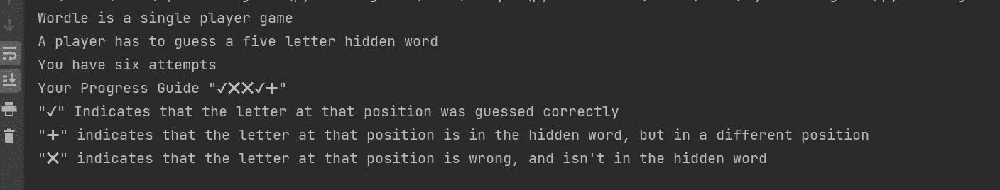
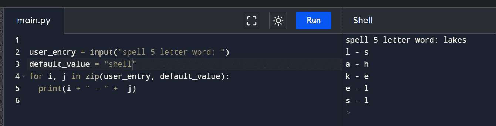
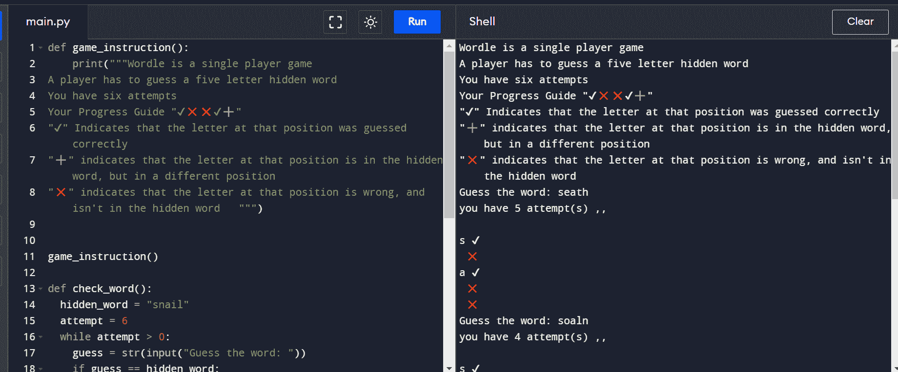
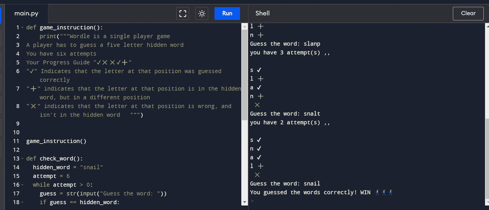

# 如何用 Python 构建一个 Wordle 克隆

> 原文：<https://www.freecodecamp.org/news/building-a-wordle-game/>

在漫长的一天之后，解谜是一种放松和打发时间的方式。对头脑也有好处。

更好的是，解谜和提高解决问题的技能之间存在关联。

Wordle 是一款新的字谜游戏，挑战玩家在六次尝试中猜出一个五个字母的单词。

在本教程中，您将构建一个类似 Wordle 的猜谜游戏，其规则与原始游戏相同。我们将用 Python 来构建游戏。完成这个挑战将提高您对函数和 while 循环的了解，并帮助您更加熟悉 zip 方法。

## 先决条件

*   Python 的基础知识

## 我们将涵盖的内容:

*   游戏如何运作
*   游戏逻辑怎么写
*   比赛结果

## 游戏如何运作

游戏将包括:

*   存储五个字母单词的变量，称为“hidden_word”。
*   来自用户的输入。
*   存储用户尝试猜测单词的次数(最多 6 次)的变量。
*   一种检查字母是否被正确猜测并处于正确位置的条件，用“✔”表示
*   另一个检查字母是否猜对但位置错误的条件，用“➕”表示
*   检查字母是否被猜到但不在隐藏单词中的最终条件，由“❌”指示

## 游戏逻辑怎么写

### 第一功能块

首先，我们需要告知玩家规则。这是必要的，这样人们就知道如何正确地玩。

首先创建一个名为“game_instruction”的函数。

```
def game_instruction():
```

然后，将指令作为字符串传递给“print”函数以显示结果。将字符串放在 docstrings(" " " " ")中，因为符号(“✔❌❌✔➕”)将被放在双引号(" ")中。此外，每条指令将出现在新的一行中，不使用(" \n") [标签](https://replit.com/@HeritageAlabi/triplequote#main.py)。

```
print("""Wordle is a single player game
A player has to guess a five letter hidden word
You have six attempts
Your Progress Guide "✔❌❌✔➕"
"✔" Indicates that the letter at that position was guessed correctly
"➕" indicates that the letter at that position is in the hidden word, but in a different position
"❌" indicates that the letter at that position is wrong, and isn't in the hidden word   """) 
```

每个句子都是在新的一行开始的，它会以这种方式出现在控制台上。我们通过调用我们的函数来结束，这样指令将被打印在屏幕上。

```
game_instruction() 
```

如果你得到一个错误，可能是你忘记在函数定义`def game_instruction()`的末尾加上冒号(:)或者你的代码格式不正确。请注意记录的控制台错误，因为它将为您提供指导。

### 将它整合在一起

```
 def game_instruction():
     print("""Wordle is a single player game
A player has to guess a five letter hidden word
You have six attempts
Your Progress Guide "✔❌❌✔➕"
"✔" Indicates that the letter at that position was guessed correctly
"➕" indicates that the letter at that position is in the hidden word, but in a different position
"❌" indicates that the letter at that position is wrong, and isn't in the hidden word   """)
game_instruction() 
```

最后，如果您运行代码，但控制台上没有任何结果，这意味着您可能忘记了调用该函数。

### 输出



Game instructions for players

### 第二功能块

下一步是处理用户的输入，并将其与隐藏的单词进行比较。这种能力对游戏来说至关重要。

创建一个名为“check_word”的函数。在代码块中，创建一个名为“hidden word”的变量，并将其分配给任意一个由五个字母组成的单词。这个隐藏的单词是用户试图猜对的。

```
def check_word():
  hidden_word = "snail" 
```

因为玩家有 6 次尝试，所以将一个名为“尝试”的新变量赋给“6”的值，并创建一个 while 语句。

这里最好使用一个 while 循环，因为这个过程会一直运行，直到用户猜出正确的单词或者用尽他们的努力。while 语句运行的条件是尝试次数大于“0”。

```
def check_word():
  hidden_word = "snail"
  attempt = 6
  while attempt > 0: 
```

然后在 while 循环中创建用户输入，并根据隐藏的单词检查条件。如果用户的输入与隐藏的单词相同，则循环结束，游戏结束。

```
def check_word():
  hidden_word = "snail"
  attempt = 6
  while attempt > 0:
    guess = str(input("Guess the word: "))
    if guess == hidden_word:
      print("You guessed the words correctly! WIN 🕺🕺🕺 ")
      break 
```

格式字符串(f " ")是另一种不使用“+”号将变量和字符串连接在一起的方法。

这里有一个例子:

```
# Instead of,
print("you have" + attempt + " attempt(s) ,, \n") # '\n' is used for new line

# use this,
print(f"you have {attempt} attempt(s) ,, \n") # the variable to be printed is wrapped in curly braces 
```

如果用户的输入不等于隐藏的单词，则引入一个 else 语句，所有条件都将在“else”块中进行检查。当用户玩游戏时，尝试次数减少 1，剩余的尝试次数打印在控制台上。

```
 def check_word():
  hidden_word = "snail"
  attempt = 6
  while attempt > 0:
    guess = str(input("Guess the word: "))
    if guess == hidden_word:
      print("You guessed the words correctly! WIN 🕺🕺🕺 ")
      break
    else:
      attempt = attempt - 1
      print(f"you have {attempt} attempt(s) ,, \n ") 
```

如果用户的输入与隐藏单词不匹配，有三种情况需要检查:

*   首先，如果字母的位置错了，而是在隐藏的单词中，在字母旁边印上“➕”。
*   第二，如果字母在正确的位置并且在隐藏的单词中，在字母旁边打印一个“✔”。
*   第三，如果字母不在隐藏的单词中，在字母旁边印上“❌”。

要比较用户输入和隐藏单词中的字母，可以在 zip()函数旁边包含一个 for 循环作为语句。

`for i, j in zip(food, drink):`

zip()函数是一个内置函数，它循环遍历列表和元组等项。它可以从相同大小的多个变量中提取值。

对于字符串，不能直接单独使用 zip()函数。包含“for”循环是为了从存储字符串的变量中获取字母。

这里有一个例子:

用户输入一个五个字母的单词，然后创建一个包含五个字母单词的变量。用 zip()同时遍历两个变量，所有的元素都将被打印出来，并用连字符隔开。

码组

```
user_entry = input("spell 5 letter word: ")
default_value = "shell"
for i, j in zip(user_entry, default_value):
  print(i + " - " +  j) 
```

输出



回到我们的准则:

```
def check_word():
  hidden_word = "snail"
  attempt = 6
  while attempt > 0:
    guess = str(input("Guess the word: "))
    if guess == hidden_word:
      print("You guessed the words correctly! WIN 🕺🕺🕺 ")
      break
    else:
      attempt = attempt - 1
      print(f"you have {attempt} attempt(s) ,, \n ")
      for char, word in zip(hidden_word, guess):
            if word in hidden_word and word in char:
                print(word + " ✔ ")

            elif word in hidden_word:
                print(word + " ➕ ")
            else:
                print(" ❌ ") 
```

让我们来看看这里发生了什么:

`for char, word in zip(hidden_word, guess)` -这个语句的意思是循环通过变量名为`char`的`hidden_word`和变量名为`word`的`guess`。隐藏单词中的所有字母由`char`访问，guess 中的所有字母由`word`访问。

然后，将通过比较`word`(用户输入)和`char`(隐藏单词)中的两个字母来检查前面提到的三个条件:

```
def check_word():
  hidden_word = "snail"
  attempt = 6
  while attempt > 0:
    guess = str(input("Guess the word: "))
    if guess == hidden_word:
      print("You guessed the words correctly! WIN 🕺🕺🕺 ")
      break
    else:
      attempt = attempt - 1
      print(f"you have {attempt} attempt(s) ,, \n ")
      for char, word in zip(hidden_word, guess):
            if word in hidden_word and word in char:
                print(word + " ✔ ")

            elif word in hidden_word:
                print(word + " ➕ ")
            else:
                print(" ❌ ")
      if attempt == 0:
        print(" Game over !!!! ") 
```

最后一步是调用函数:

```
def check_word():
  hidden_word = "snail"
  attempt = 6
  while attempt > 0:
    guess = str(input("Guess the word: "))
    if guess == hidden_word:
      print("You guessed the words correctly! WIN 🕺🕺🕺 ")
      break
    else:
      attempt = attempt - 1
      print(f"you have {attempt} attempt(s) ,, \n ")
      for char, word in zip(hidden_word, guess):
            if word in hidden_word and word in char:
                print(word + " ✔ ")

            elif word in hidden_word:
                print(word + " ➕ ")
            else:
                print(" ❌ ")
      if attempt == 0:
        print(" Game over !!!! ")

check_word() 
```

将所有代码块放在一起，看起来应该是这样的:

```
def game_instruction():
    print("""Wordle is a single player game 
A player has to guess a five letter hidden word 
You have six attempts 
Your Progress Guide "✔❌❌✔➕"  
"✔" Indicates that the letter at that position was guessed correctly 
"➕" indicates that the letter at that position is in the hidden word, but in a different position 
"❌" indicates that the letter at that position is wrong, and isn't in the hidden word   """)

game_instruction()

def check_word():
  hidden_word = "snail"
  attempt = 6
  while attempt > 0:
    guess = str(input("Guess the word: "))
    if guess == hidden_word:
      print("You guessed the words correctly! WIN 🕺🕺🕺 ")
      break
    else:
      attempt = attempt - 1
      print(f"you have {attempt} attempt(s) ,, \n ")
      for char, word in zip(hidden_word, guess):
            if word in hidden_word and word in char:
                print(word + " ✔ ")

            elif word in hidden_word:
                print(word + " ➕ ")
            else:
                print(" ❌ ")
      if attempt == 0:
        print(" Game over !!!! ")

check_word() 
```

**输出:**



## 结论

干得好！你已经完成了用 Python 创建一个字谜游戏。代码样本在这里找到[，如果你有任何问题可以在](https://replit.com/@HeritageAlabi/woordle-game#main.py)[推特](https://twitter.com/HeritageAlabi1)上联系我。💙