# 在 Excel 中串联–如何使用串联函数

> 原文：<https://www.freecodecamp.org/news/concatenate-in-excel-how-to-use-the-concat-function/>

Excel 有许多有用的函数，可以用来处理数据。

在本指南中，您将了解`CONCAT`功能及其使用方法。

串联就是把两个东西连接在一起。在 Excel 中，您可以使用`CONCAT`函数将多个单元格中的数据合并到一个单元格中。让我们看看它是如何工作的。

## CONCAT 函数的语法

CONCAT 函数的一般语法是:

```
=CONCAT(text1; [text2; ...])
```

其中的参数是:

*   `text1`是一个必需的参数，可以是一个字符串或字符串数组(类似于单元格区域)。
*   `[text2, ...]`标识后面的可选参数。最多可以有 253 个文本参数，每个参数也可以是一个字符串或字符串数组(如一个单元格范围)。

## 如何在 Excel 中使用 CONCAT 函数

要使用 CONCAT 函数，您需要单击您想要显示结果的单元格，并在那里键入`=CONCAT(`。

之后，您可以单击想要连接在一起的单元格或单元格范围——您需要按住 Ctrl 键来添加多个参数。

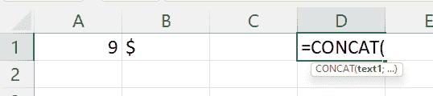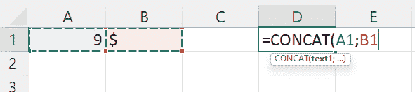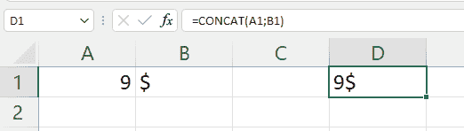

就像你在这些截图中看到的，我们在单元格 D1 中写`=CONCAT(`，然后在按住 Ctrl 的同时点击单元格 A1 和 B1。之后，按回车键将在单元格 D1 中给出结果。

如果您想要在不同单元格的内容之间添加文本，例如空格，您可以单击一个单元格，然后键入一个分号并将您想要添加的文本用引号括起来，然后再键入一个分号，最后单击下一个单元格:

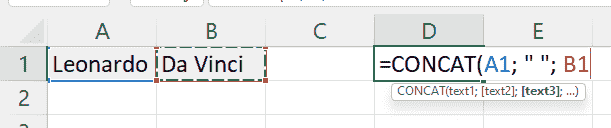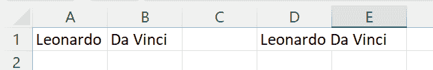

在这种情况下，你应该在单元格 D1 中写下`=CONCAT(`，然后点击单元格 A1，键入一个分号，然后键入由字符串包围的空格，`" "`，接着是另一个分号，最后点击单元格 B1。这将导致“达芬奇”在细胞 D1。

**注意:**最多可以连接 32，767 个字符，这是单元格的限制。如果结果字符串超过 32，767 个字符，该函数将输出一个`#VALUE!`错误。

## 例子

微软官方文档有三个关于如何使用`CONCAT`函数的有用例子。让我们检查一下。

### 拼接示例 1:

| = concat(b:b)；页:1 | a 的 | b 的 |
| --- | --- | --- |
|  | 第一等的 | b1 |
|  | 主动脉第二声 | b2 |
|  | a4 | b4 |
|  | a5 | b5 |
|  | a6 | b6 |
|  | a7 | b7 |

如果您想跟进，请复制此表格并将其数据粘贴到新 Excel 工作表的单元格 A1 中。

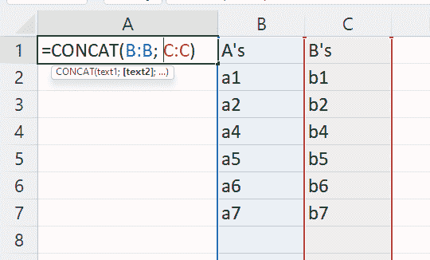

该函数允许整列引用，因此在公式`=CONCAT(B:B; C:C)`中，您将整列 B ( `B:B`)串联在整列 C ( `C:C`)之后，因此结果是`A'sa1a2a4a5a6a7B'sb1b2b4b5b6b7`–空单元格对最终结果没有贡献。

### 拼接示例 2:

| =CONCAT(B2:C8) | a 的 | b 的 |
| --- | --- | --- |
|  | 第一等的 | b1 |
|  | 主动脉第二声 | b2 |
|  | a4 | b4 |
|  | a5 | b5 |
|  | a6 | b6 |
|  | a7 | b7 |

要跟进，请复制此表，并将其粘贴到一个空 Excel 表的 A1 单元格中。

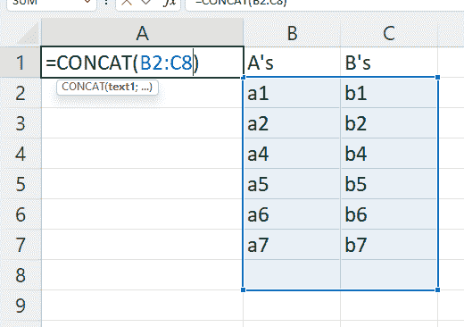

在这种情况下，范围`B2:C8`(图中突出显示的范围)中的单元格被连接在一起，A1 单元格中的公式将产生`a1b1a2b2a4b4a5b5a6b6a7b7`。同样，在这种情况下，空单元对结果没有贡献。

**注意:**一个范围内的单元格是逐行读取的，所以单元格按顺序串联:`B2;C2;B3;C3;B4;C4;B5;C5;B6;C6;B7;C7;B8;C8`(B8 和 C8 为空，所以对最终结果没有贡献)。

### 串联示例 3

这个例子中有各种各样的例子，都是关于将单元格和其他文本连接起来的主题。这个例子很好地说明了如何用 Concat 函数做很多事情。

让我们来看看。

| 数据 | 西方人名的第一个字 | 姓 |
| --- | --- | --- |
| 溪红点鲑 | 安德列亚斯 | 豪瑟 |
| 种类 | 第四 | 渴望 |
| Thirty-two |  |  |
| **公式** | **描述** | **结果** |
| `=CONCAT("Stream population for "; A2;" "; A3; " is "; A4; "/mile.")` | 通过将 A 列中的数据与其他文本连接起来创建一个句子。 | 小溪鳟鱼的数量是 32 条/英里。 |
| `=CONCAT(B2;" "; C2)` | 连接三个部分:单元格 B2 中的字符串、空格字符和单元格 C2 中的值。 | 安德烈亚斯·豪泽 |
| `=CONCAT(C2; ", "; B2)` | 连接三个部分:C2 单元格中的字符串、包含逗号和空格的字符串以及 B2 单元格中的值。 | 安德烈亚斯·豪泽 |
| `=CONCAT(B3; " & "; C3)` | 连接三个部分:单元格 B3 中的字符串，由一个带&符号的空格和另一个空格组成的字符串，以及单元格 C3 中的值。 | 第四&松木 |
| `=B3 & " & " & C3` | 联接与上一示例相同的项，但使用了与号(&)计算运算符，而不是 CONCAT 函数。 | 第四&松木 |

为了跟进，您还可以将此表复制到一个空 Excel 表的 A1 单元格中。

#### 小溪鳟鱼的数量是 32 条/英里。

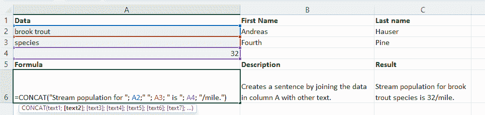

本例中显示的第一个公式用几个字符串将三个单元格(A2、A3 和 A4)的文本连接在一起，形成一个更长的句子。

因此，结果是由字符串`"Stream population for "`与单元格 A2 的内容组合而成的，所以`"brook trout"`，然后是空格(`" "`)、单元格 A3 的内容(`"species"`)、字符串`" is "`、单元格 A4 的内容(`32`)，最后是字符串`"/mile."`。

所有这一切导致了字符串`"Stream population for brook trout species is 32/mile."`。

(对于下面的截图，我已经隐藏了我已经谈到的公式行)。

#### 安德烈亚斯·豪泽

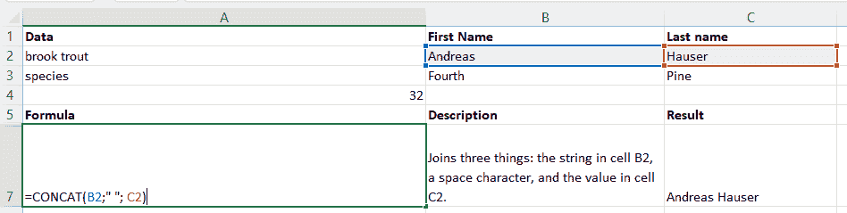

在本例中，公式`=CONCAT(B2; " "; C2)`将单元格 B2 中的字符串、空格`" "`和单元格 C2 中的字符串连接在一起，得到`"Andreas Hauser"`。

#### 安德烈亚斯·豪泽

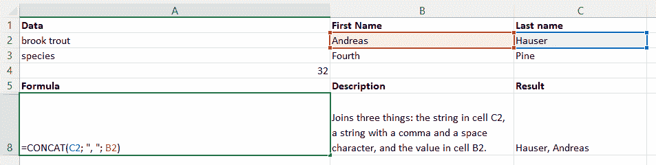

从这个例子中，您可以看到单元格在`CONCAT`函数参数中的写入顺序很重要。公式`=CONCAT(C2; ", "; B2)`将来自单元格 C2、逗号和空格`", "`以及来自单元格 B2 的字符串连接在一起，得到`"Hauser, Andreas"`。

来自单元格 C2 和 B2 的字符串以不同的顺序连接，因为它们在方法的参数中以不同的顺序书写。

#### 第四&松木

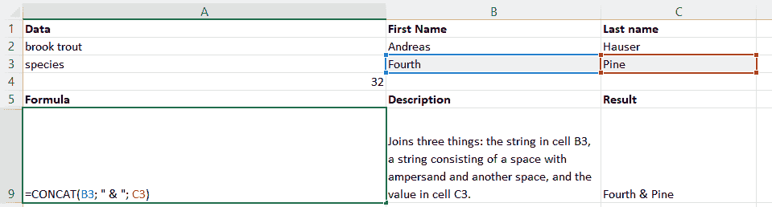

你可以把任何类型的屏幕连接在一起。请看这里，公式`=CONCAT(B3; " & "; C3)`将 B3 单元格中的字符串与 C3 单元格中的字符串连接起来，在这两个字符串中间加上一个空格、一个与号和另一个空格，`" & "`产生`"Fourth & Pine"`。

#### 第四&松木(二)

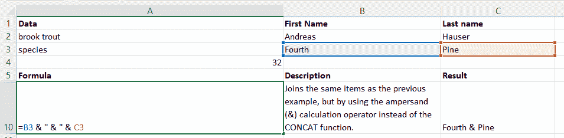

这个例子展示了连接字符串的另一种方法:使用操作符`&`你可以写出你想要连接的字符串的列表，用一个&符号(`&`)分开。所以`=B3 & " & " & C3`给出了与`=CONCAT(B3; " & "; C3)`相同的结果。

**注意:**您只能对单个单元格使用`&`运算符，它对范围无效。

就是这样！现在你知道如何在 Excel 中使用`CONCAT`函数了。感谢阅读！