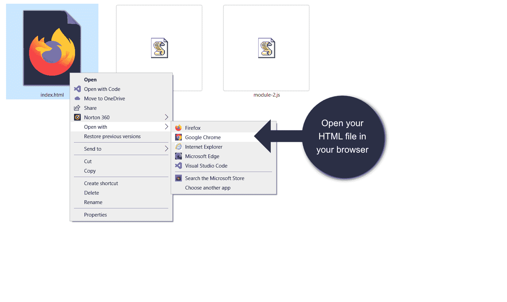
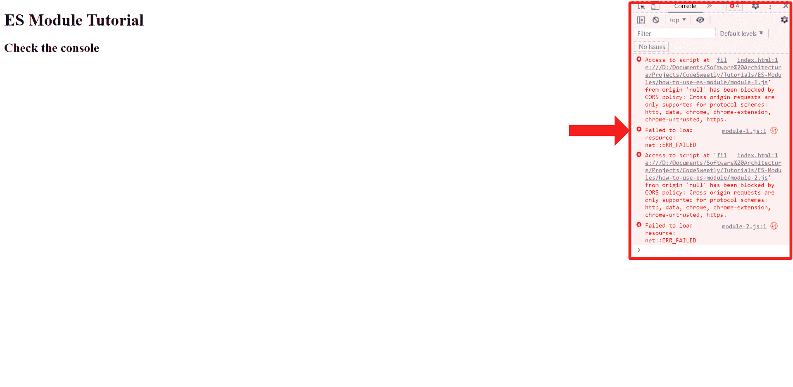
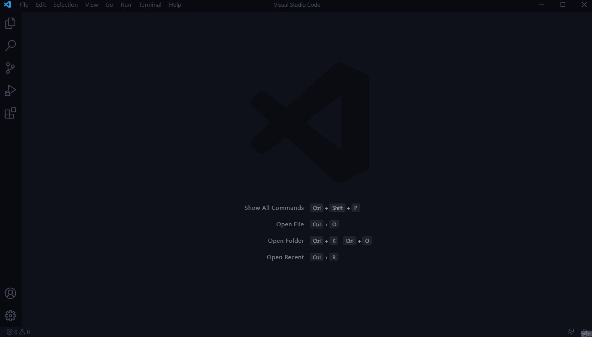
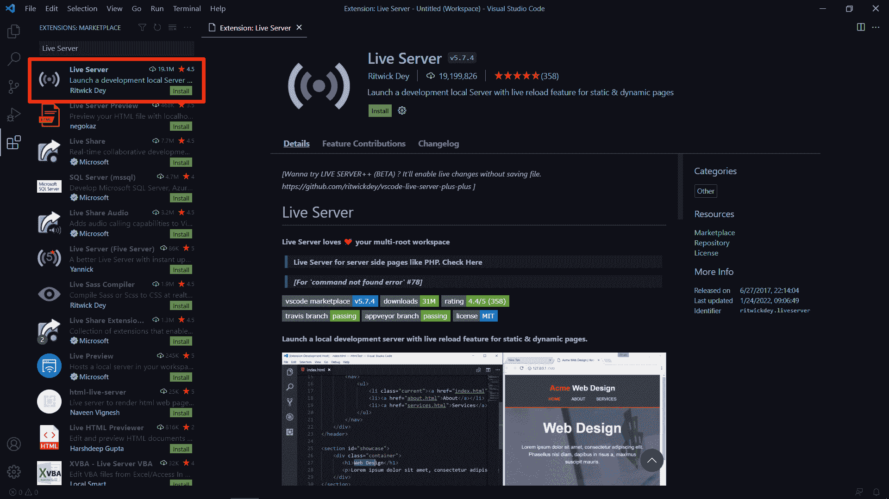
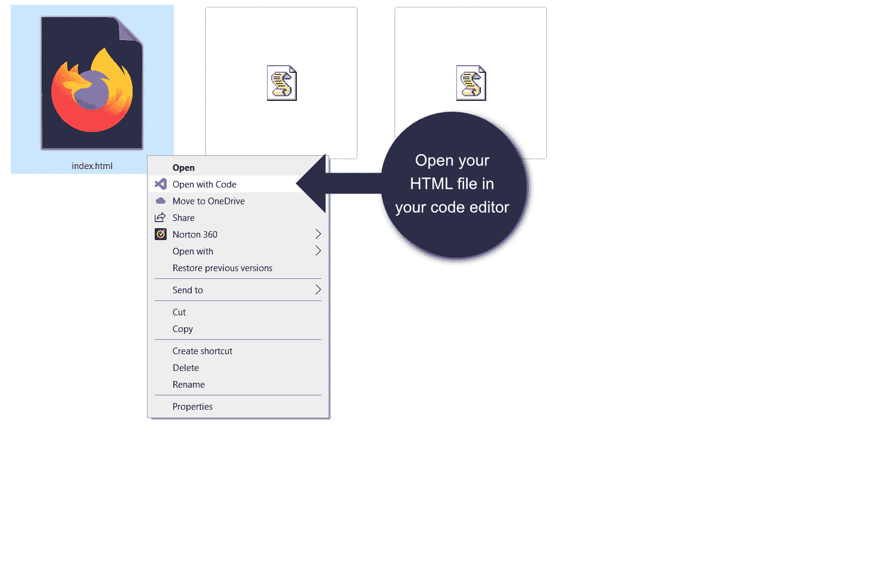
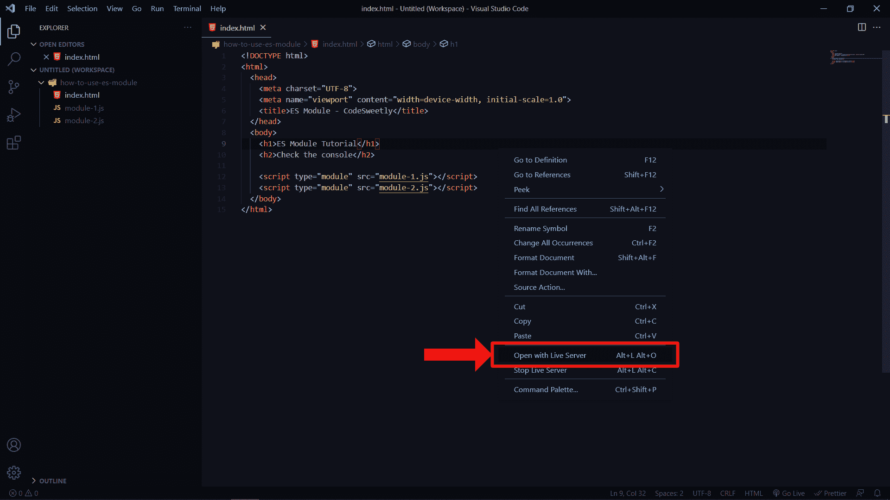
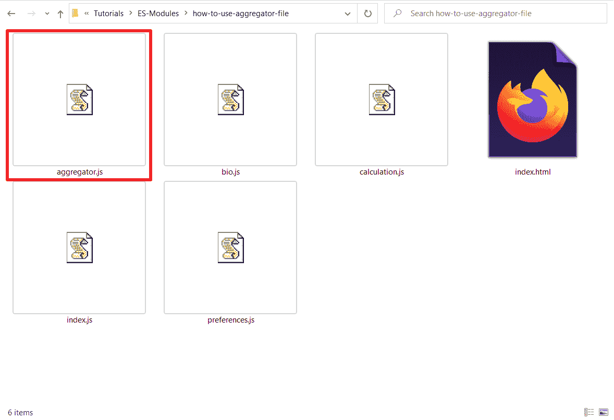
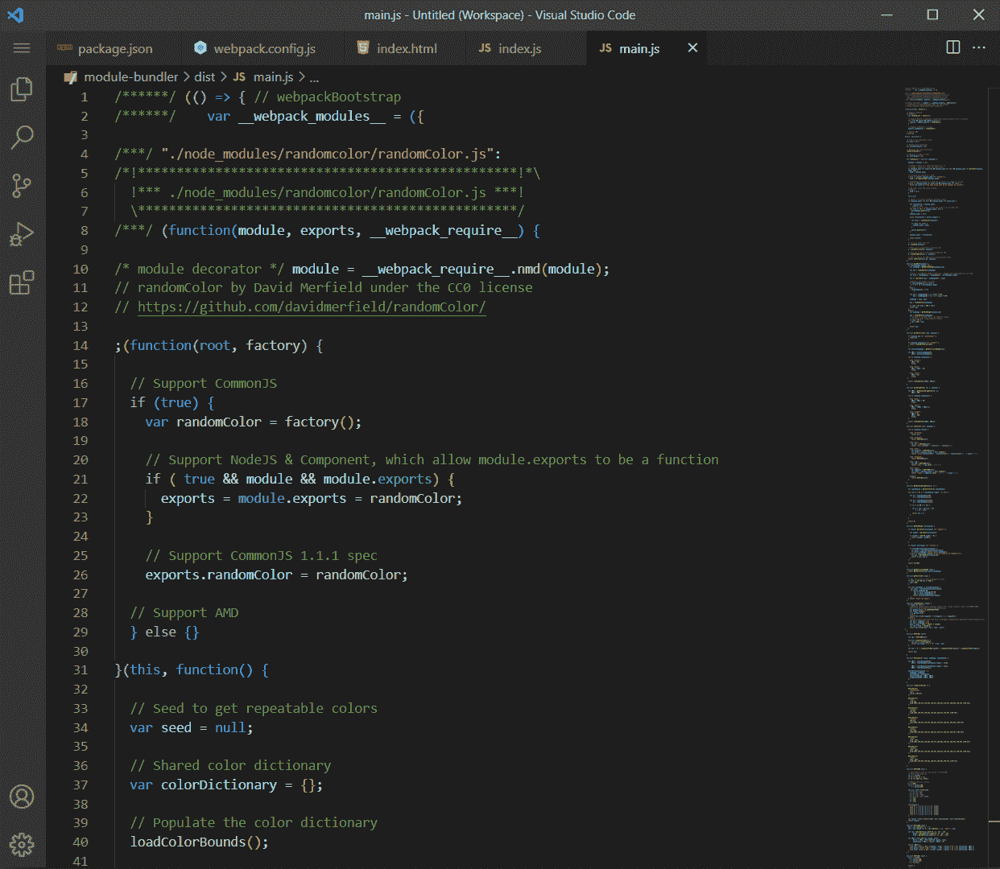
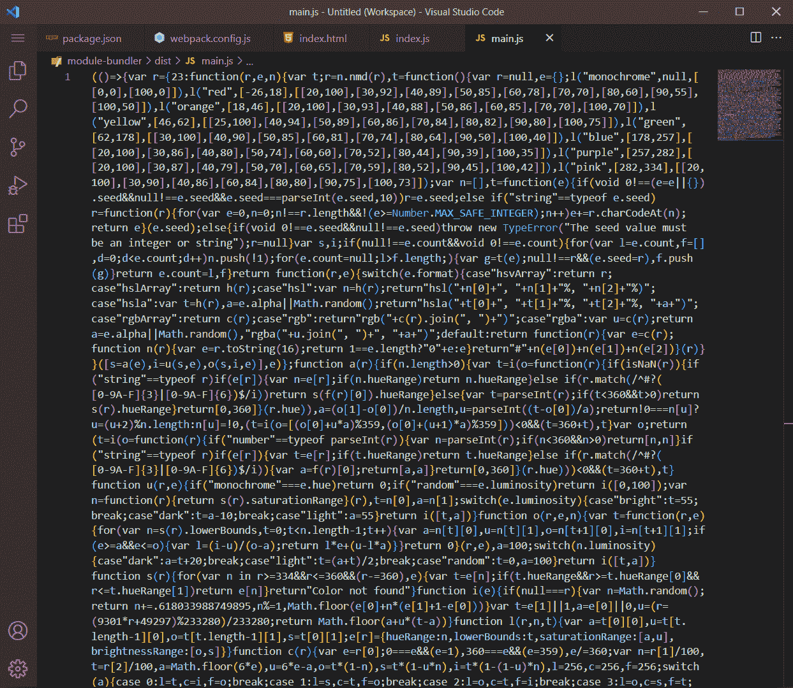
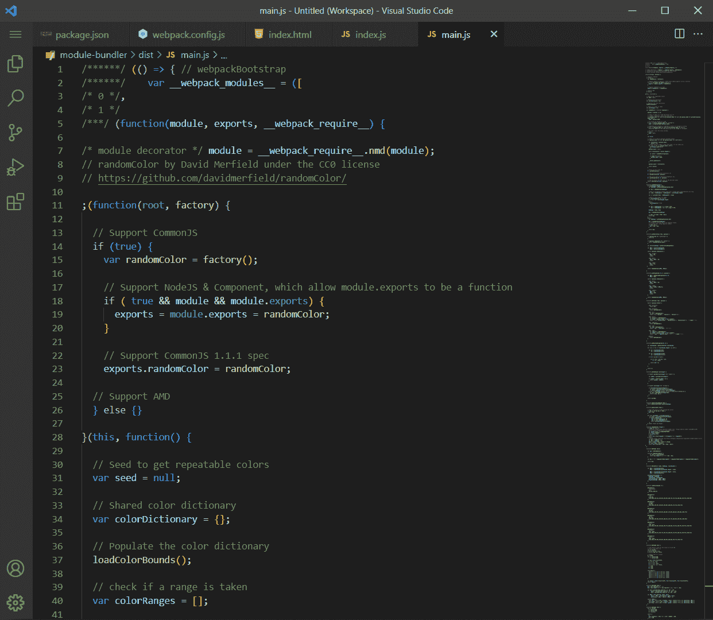

# JavaScript 模块手册——ES 模块和模块捆绑器完整指南

> 原文：<https://www.freecodecamp.org/news/javascript-es-modules-and-module-bundlers/>

模块和**模块打包器**是现代 web 开发的基本组件。但是理解它们是如何工作的会很快变得让人不知所措。

这篇文章将用简单的英语向你展示所有你需要知道的关于 ES 模块和模块捆绑器的知识。

## 目录

1.  [JavaScript 模块到底是什么？](#what-exactly-is-a-javascript-module)
2.  [为什么要使用模块？](#why-use-modules)
3.  [JavaScript 中常见的模块系统类型](#common-types-of-module-systems-in-javascript)
4.  [如何将 JavaScript 文件转换成模块](#how-to-convert-a-javascript-file-into-a-module)
5.  [如何使用 ES 模块](#how-to-use-an-es-module)
6.  [如何导出模块代码](#how-to-export-a-module-s-code)
7.  [如何导入导出的代码](#how-to-import-exported-code)
8.  [如何使用模块的导入代码](#how-to-use-a-module-s-imported-code)
9.  [如何在 ES 模块中重命名导出和导入](#how-to-rename-exports-and-imports-in-es-modules)
10.  为什么要重命名一个模块的代码？
11.  [如何重命名 ES 模块中的多个导出](#how-to-rename-multiple-exports-in-an-es-module)
12.  [如何重命名 ES 模块中的多个导入](#how-to-rename-multiple-imports-in-an-es-module)
13.  [如何从 ES 模块一次性导入所有可导出项目](#how-to-import-all-exportable-items-from-an-es-module-in-one-go)
14.  [如何匿名导出到 ES 模块](#how-to-export-anonymously-to-an-es-module)
15.  [聚合器文件到底是什么？](#what-exactly-is-an-aggregator-file)
16.  [项目:如何使用聚合器文件](#project-how-to-use-an-aggregator-file)
17.  [如何使用`import()`语法动态加载模块](#how-to-use-the-import-syntax-to-load-a-module-dynamically)
18.  [ES 模块中的`import.meta`到底是什么？](#what-exactly-is-import-meta-in-es-modules)
19.  [快速回顾到目前为止的模块](#quick-review-of-modules-so-far)
20.  [什么是模块捆绑器？](#what-is-a-module-bundler)
21.  [为什么需要模块捆绑器？](#why-do-you-need-a-module-bundler)
22.  模块捆绑器是如何工作的？
23.  [如何使用 Webpack](#how-to-use-webpack)
24.  [如何让 Webpack 自动生成你的应用程序的 HTML 文件](#how-to-make-webpack-auto-generate-your-app-s-html-file)
25.  [如何让`HtmlWebpackPlugin`使用你的源文件作为模板自动生成一个新的 HTML 页面](#how-to-make-htmlwebpackplugin-use-your-source-file-as-a-template-to-auto-generate-a-new-html-page)
26.  [更新你的应用需要知道的重要信息](#important-stuff-to-know-about-updating-your-app)
27.  [如何自动重新运行 web pack](#how-to-rerun-webpack-automatically)
28.  [如何自动重新加载浏览器](#how-to-reload-the-browser-automatically)
29.  [web pack 的配置文件到底是什么？](#what-exactly-is-webpack-s-configuration-file)
30.  [常用 Webpack 配置选项](#common-webpack-configuration-options)
31.  [概述](#overview)

所以，事不宜迟，让我们从模块开始吧。

## JavaScript 模块到底是什么？

JavaScript **模块**是一个允许您导出其代码的文件。这允许其他 JavaScript 文件导入并使用导出的代码作为它们的依赖项。

具体来说，一个模块就是一个 JavaScript 文件，它允许你与项目中的其他文件共享它的代码(或者通过像 Yarn 和 NPM 这样的[包管理器](https://www.codesweetly.com/package-manager-explained)与外界共享)。

## 为什么要使用模块？

在早期，人们使用 JavaScript 主要是为了一些琐碎的脚本任务，比如在需要的地方为网页提供一些交互功能。换句话说，开发人员主要使用 JavaScript 编写小脚本，而不是大脚本。

然而今天，JavaScript 已经成长为一个巨大的脚本工具，它能做的不仅仅是使网页具有交互性。

现在，将大量 JavaScript 代码用于各种功能(如服务器端网站开发、游戏开发和移动应用程序开发)已经成为常态。

由于 JavaScript 几乎可以用于任何编程任务，因此需要在项目文件和外界之间共享脚本。

所以 JavaScript 社区开发了模块系统，允许开发者按需共享他们的脚本。

## JavaScript 中常见的模块系统类型

以下是 JavaScript 中一些流行的模块系统:

*   [异步模块定义(AMD)](https://github.com/amdjs/amdjs-api/blob/master/AMD.md)
*   [普通模块](https://en.wikipedia.org/wiki/CommonJS)
*   [通用模块定义(UMD)](https://github.com/umdjs/umd)
*   [ES 模块](https://tc39.es/ecma262/#sec-modules)

**注:** ES 模块有时被称为“JS 模块”或“ECMAScript 模块”。

在上面列出的模块系统中，ES 模块系统是 JavaScript 的官方标准。

剩下的三个(AMD、CommonJS 和 UMD)是在 JavaScript 没有标准化模块系统的时候由不同的开发者创建的。

然而，自从 ES 模块在 2015 ECMAScript 标准中出现后，之前的模块系统逐渐成为 JavaScript 历史的一部分。

因此，本文将着重向您展示 ES 模块是如何工作的。

首先，知道如何将 JavaScript 文件转换成模块是很重要的。所以，下面我们来讨论一下。

## 如何将 JavaScript 文件转换成模块

要将 JavaScript 文件转换为 ES 模块，请执行以下操作:

### 步骤 1:创建项目目录

创建一个项目文件夹—这个项目的 HTML 和 JavaScript 文件将驻留在其中。

### 步骤 2:创建您的代码文件

在项目文件夹中创建以下文件:

1.  `index.html`
2.  `index.js`

### 步骤 3:将 JavaScript 文件添加到 HTML 文档中

打开您的`index.html`文件，复制下面的代码:

```
<!DOCTYPE html>
<html>
  <head>
    <meta charset="UTF-8">
    <meta name="viewport" content="width=device-width, initial-scale=1.0">
    <title>ES Module - CodeSweetly</title>
  </head>
  <body>
    <h1>ES Module Tutorial</h1>

    <!-- Add the "index.js" JavaScript file to this HTML document -->
    <script type="module" src="index.js"></script>
  </body>
</html>
```

在上面的 HTML 片段中，我们使用了`<script>`的`type="module"`属性将`index.js` JavaScript 文件转换成一个 ES 模块。

现在，我们知道了如何将 JavaScript 文件转换成模块，让我们看看如何使用它。

## 如何使用 ES 模块

按照以下步骤学习如何使用 ES 模块。

### 步骤 1:创建项目目录

创建一个项目文件夹—这个项目的 HTML 和模块文件将驻留在其中。

### 步骤 2:创建您的代码文件

在项目文件夹中创建以下文件:

1.  `index.html`
2.  `module-1.js`
3.  `module-2.js`

### 步骤 3:将模块添加到 HTML 文档中

打开您的`index.html`文件，复制下面的代码:

```
<!DOCTYPE html>
<html>
  <head>
    <meta charset="UTF-8">
    <meta name="viewport" content="width=device-width, initial-scale=1.0">
    <title>ES Module - CodeSweetly</title>
  </head>
  <body>
    <h1>ES Module Tutorial</h1>
    <h2>Check the console</h2>

    <script type="module" src="module-1.js"></script>
    <script type="module" src="module-2.js"></script>
  </body>
</html>
```

下面是我们在上面的 HTML 片段中做的主要事情:

1.  我们在 HTML 文档中添加了两个 JavaScript 文件。
2.  我们使用了`type="module"`属性将常规的 JavaScript 文件转换成 es 模块文件。

**注意****JavaScript 自动推迟 ES 模块。因此，您不需要在模块的`<script>`元素中使用`defer`属性。**

同样，计算机将只执行一个模块一次——不管你使用多少个`<script>`标签来引用它。

### 第四步:查看你的应用程序

在任何浏览器中打开您的`index.html`文件，查看您的应用程序的当前状态。



Opening an index.html file in a Chrome browser

一旦打开，如果你检查你的浏览器控制台，你会看到一些错误信息。



Inspecting a Chrome browser's console

浏览器抛出了一个 CORS 策略错误，因为 ES 模块只能通过`http://`和`https://`URL 工作，而不能通过`file://` URL 在本地工作。

换句话说，由于我们的 HTML 文件包含两个 ES 模块，我们需要通过一个`http://`方案加载文档。

通过`http://`方案加载 HTML 文档的两种典型方法是:

*   通过使用本地服务器，或者
*   通过使用模块捆扎机

我们将在本文后面详细讨论模块捆绑器。不过现在，让我们看看如何使用本地服务器通过一个`http://`方案加载`index.html`文件。

#### 如何通过本地服务器运行 HTML 文件

下面的步骤将向你展示如何使用一个 [VS Code](https://code.visualstudio.com/) 本地服务器扩展来运行你的 HTML 文件。

**注:**假设你的代码编辑器是 Atom 或者 Sublime Text。在这种情况下，请按照下面的链接来学习如何安装本地服务器插件。

*   [Atom Live 服务器](https://atom.io/packages/atom-live-server)
*   [升华文字直播服务器](https://youtu.be/5CinAgQylao)

##### 1.将项目文件夹添加到 VSCode 的工作区



Adding a project folder to VSCode's workspace

##### 2.安装本地服务器(Ritwick Dey 的 Live 服务器)



Installing the VSCode Live Server by Ritwick Dey

##### 3.在代码编辑器中打开您的 HTML 文件



Opening HTML file in VSCode editor

##### 4.使用 Live Server 在默认浏览器中运行 HTML 文件



Opening the project's HTML file with Live Server

你的应用程序现在应该用`http://`方案加载了——在你的浏览器控制台中没有任何 CORS 错误。

**一些需要注意的事情:**

*   假设您没有将项目文件夹添加到 VSCode 的工作区中(步骤 1)。在这种情况下，Live 服务器可能无法正确加载您的文件。
*   每当您保存对 HTML 文件的任何更改时，Live Server 将自动重新加载您的浏览器。
*   假设您希望停止实时服务器。在这种情况下，右键单击 HTML 编辑器页面，然后单击“停止活动服务器”。
*   默认情况下，JavaScript 模块在严格模式下运行。因此，您必须遵守 JavaScript 严格的语法规则。否则，您的程序可能会出现故障。

所以，现在您已经将 JavaScript 文件转换成了 ES 模块，您可以开始使用`export`和`import`关键字来共享您的模块代码。下面我们来讨论一下如何。

## 如何导出模块的代码

有两种等效的方法可以导出模块的项目。

1.  在你的代码前放置一个关键字
2.  创建出口声明

下面两种方式都来讨论一下。

### 如何通过在代码前放置一个`export`关键字来共享模块的代码

导出项目的一种方法是在您希望与其他模块共享的代码前放置一个`export`关键字。

例如，打开您的`module-1.js`文件并复制下面的代码:

```
// module-1.js

// Export the "bestClub" variable:
export const bestClub = "Your Club"; 
```

在上面的代码片段中，您可以看到我们是如何将`export`关键字放在`const`变量语句之前的。

我们在`const`变量前加上`export`关键字，告诉计算机与请求它的其他模块共享`bestClub`变量。

**注意:**`export`关键字突出显示了您希望与其他模块共享的代码。

这里还有一个例子:

```
// Export the "multiply" function:
export function multiply(x, y) {
  return x * y;
} 
```

上面的语句指示计算机将`multiply()`导出到请求它的模块。

现在让我们看看导出模块代码的第二种方法。

### 如何通过创建导出语句来共享模块代码

共享模块代码的另一种方法是使用`export`关键字作为独立的语句。您可以通过在您希望共享的代码的逗号分隔名称块(`{...}`)前添加一个`export`关键字来实现这一点。

**这里有一个例子:**

```
// Create a variable named "bestClub":
const bestClub = "Your Club";

// Create a function named "multiply":
function multiply(x, y) {
  return x * y;
}

// Create an array named "fruits":
const fruits = ["Mango", "Apple", "Orange", "Lemon"];

// Export the three statements above:
export { bestClub, multiply, fruits }; 
```

上面的代码片段使用了一个`export`语句来表示计算机可以与请求其中任何一个的其他模块共享`bestClub`、`multiply`和`fruits`。

请记住，`export`仅作为顶级项目工作。例如，它不能在函数中工作。

因此，下面的代码片段会抛出一个错误，因为我们在函数内部使用了`export`关键字。

```
function wrong() {
  export let bestClub = "Your Club";
  return bestClub;
} 
```

**注:**

*   `export`关键字只在模块内部有效——在普通的 JavaScript 程序中无效。
*   JavaScript [吊起](https://www.codesweetly.com/javascript-hoisting)的`export`语句。因此，您可以在模块中的任何地方定义它们。
*   默认情况下，导出的模块以严格模式运行——不管您是否指定了`strict`语句。

现在让我们看看如何导入导出的代码。

## 如何导入导出的代码

要导入导出的代码，请使用 ES 模块的`import`语句。

例如，打开您的`module-2.js`文件并复制下面的代码:

```
// module-2.js

import { bestClub } from "./module-1.js"; 
```

在上面的代码片段中，我们使用了一个`import`语句从`module-1.js`文件中引入`bestClub`变量。

所以，`module-2.js`是一个顶级模块，因为它包含另一个脚本。

另一方面，`module-1.js`是一个子模块，因为它是在另一个文件中使用的脚本。

**注:**

*   我们使用`import`语句从其他模块导入项目。
*   在导入导出时，必须用花括号将命名的导出括起来。

请记住，`import`语句只有在使用`export`关键字导出时才能获得另一个模块的代码。

例如，下面的`import`语句将导入`bestClub`、`multiply`和`fruits`项目，如果它们在`module-1.js`文件中被标记为出口。

```
// Import three items from the module-1.js file:
import { bestClub, multiply, fruits } from "./module-1.js"; 
```

假设您没有使用`export`关键字将这三个项目标记为可导出特征。在这种情况下，`import`语句将抛出一个`Uncaught SyntaxError`。

**注:**

*   “模块说明符”和“导入说明符”是上面代码片段中人们称之为`"./module-1.js"`文件路径字符串的其他名称。
*   `"./module-1.js"`模块说明符中的点(`.`)符号表示*“同一目录”*。换句话说，点标记告诉计算机在当前模块所在的同一个文件夹中找到`module-1.js`文件。
*   上面代码片段中提到的当前模块是定义了`import`语句的文件。

导入说明符的点(`.`)语法的替代方法是写出模块位置的整个[相对路径](https://docs.oracle.com/javase/tutorial/essential/io/path.html)。

**这里有一个例子:**

```
// Import three items from the module-1.js file:
import { bestClub, multiply, fruits } from "/codesweetly/blog/notes/modular-javascript/es-modules/module-1.js"; 
```

你可以看看上面的`import`语句有多长。我们经常使用点语法，因为它的长度短且可移植。

假设您选择使用点语法。在这种情况下，请记住，一些模块系统(如 Node.js 和 module bundlers)允许您省略点标记和文件扩展名，如下所示:

```
// Import three items from the module-1.js file:
import { bestClub, multiply, fruits } from "module-1"; 
```

然而，其他模块系统，如 ES 模块，不允许这种遗漏。

**注:**

*   带有*无*点标记和文件扩展名的模块说明符称为“裸”模块说明符。
*   模块的导入项目是导出特征的只读视图。因此，您只能在导出代码的模块中修改代码，而不能在导入代码的模块中修改。
*   JavaScript 将模块的代码作为动态绑定导入。因此，假设您在导出模块中更新了导入代码的值。在这种情况下，您的更改也将反映在导入模块中。

现在让我们讨论如何使用导入的代码。

## 如何使用模块的导入代码

一旦导入了代码，就可以像在导入的模块中定义代码一样使用它。

**这里有一个例子:**

```
// module-2.js

import { bestClub } from "./module-1.js";

const myBestClub = bestClub + " " + "is my best club.";

console.log(myBestClub); 
```

[**在 StackBlitz** 上试一下](https://stackblitz.com/edit/web-platform-ka4gdj?devtoolsheight=33&file=module-2.js)

**注:**

*   `import`关键字只在模块内部有效——在普通的 JavaScript 程序中无效。
*   导入模块的特性在全局[范围](https://www.codesweetly.com/javascript-scope)中不可用。因此，您只能在导入项目的脚本中访问导入的项目，而不能在 JavaScript 控制台等其他地方访问。
*   JavaScript [吊起](https://www.codesweetly.com/javascript-hoisting)的`import`语句。因此，您可以在模块中的任何地方定义它们。
*   默认情况下，导入的模块以严格模式运行——不管您是否指定了`strict`语句。

所以，现在我们知道了如何使用 ES 模块，让我们讨论如何重命名您希望导出(或导入)的代码。

## 如何在 ES 模块中重命名导出和导入

假设您希望重命名正在导出(或导入)的代码。在这种情况下，使用`as`关键字。

**这里有一个例子:**

```
// module-1.js

// Create a variable named "bestClub":
const bestClub = "Your Club";

// Export the bestClub variable as "favoriteTeam":
export { bestClub as favoriteTeam }; 
```

在上面的代码片段中，我们告诉计算机将`bestClub`变量*导出为* `favoriteTeam`。

因此，在导入变量时，您将使用名称`favoriteTeam`—而不是`bestClub`。

**这里有一个例子:**

```
// module-2.js

import { favoriteTeam } from "./module-1.js";

const myBestClub = favoriteTeam + " " + "is my best club.";

console.log(myBestClub); 
```

[**在 StackBlitz** 上试一下](https://stackblitz.com/edit/web-platform-dltrvv?devtoolsheight=33&file=module-2.js)

我们在导出变量时重命名了上面例子中的`bestClub`。但是，您也可以在导入过程中对其进行重命名。

**这里有一个例子:**

```
// module-1.js

// Create a variable named "bestClub":
const bestClub = "Your Club";

// Export the bestClub variable:
export { bestClub }; 
```

```
// module-2.js

import { bestClub as favoriteTeam } from "./module-1.js";

const myBestClub = favoriteTeam + " " + "is my best club.";

console.log(myBestClub); 
```

[**在 StackBlitz** 上试一下](https://stackblitz.com/edit/web-platform-qrnt6y?devtoolsheight=33&file=module-2.js)

是否在导出或导入期间重命名您的代码完全由您决定。

然而，许多开发人员更喜欢在导入过程中重命名，因为您并不总是能够控制代码的源文件，尤其是从第三方模块导入时。

## 为什么要重命名模块的代码？

重命名有助于防止浏览器因名称冲突而引发错误。例如，考虑这些片段:

```
// module-1.js

// Create a variable named "bestClub":
const bestClub = "Your Club";

// Export the bestClub variable:
export { bestClub }; 
```

```
// module-2.js

import { bestClub } from "./module-1.js";

const bestClub = bestClub + " " + "is my best club.";

console.log(bestClub); 
```

[**在 StackBlitz** 上试一下](https://stackblitz.com/edit/web-platform-vvcy2d?devtoolsheight=33&file=module-2.js)

当您运行上面的代码片段时，浏览器将抛出类似于以下内容的错误:

```
"SyntaxError: Identifier 'bestClub' has already been declared"
```

浏览器抛出错误，因为导入代码的名称与`module-2.js` ' `bestClub`变量冲突。

但是，您可以通过简单地重命名导入的代码来纠正错误，如下所示:

```
// module-2.js

import { bestClub as favoriteTeam } from "./module-1.js";

const bestClub = favoriteTeam + " " + "is my best club.";

console.log(bestClub); 
```

请记住，您还可以重命名多个导出。下面来看看如何。

## 如何重命名 ES 模块中的多个导出

您可以通过用逗号分隔每个`as`语句来重命名多个导出。

**这里有一个例子:**

```
// module-1.js

const bestClub = "Your Club";
const fruits = ["Grape", "Apple", "Pineapple", "Lemon"];

function multiply(x, y) {
  return x * y;
}

// Export the three statements above:
export { 
  bestClub as favoriteTeam, 
  fruits as crops, 
  multiply as product 
}; 
```

```
// module-2.js

import { favoriteTeam, crops, product } from "./module-1.js";

const bestClub = `I bought ${product(2, 11)} ${crops[2]}s at ${favoriteTeam}.`;

console.log(bestClub); 
```

**[在 StackBlitz](https://stackblitz.com/edit/web-platform-ir5f1h?devtoolsheight=33&file=module-1.js) 上试一下**

您还可以重命名多个导入。让我们看看怎么做。

## 如何重命名 ES 模块中的多个导入

您可以通过用逗号分隔每个`as`语句来重命名多个导入。

**这里有一个例子:**

```
// module-1.js

const bestClub = "Your Club";
const fruits = ["Grape", "Apple", "Pineapple", "Lemon"];
function multiply(x, y) {
  return x * y;
}

// Export the three statements above:
export { bestClub, fruits, multiply }; 
```

```
// module-2.js

import { 
  bestClub as favoriteTeam, 
  fruits as crops, 
  multiply as product 
} from "./module-1.js";

const bestClub = `I bought ${product(2, 11)} ${crops[2]}s at ${favoriteTeam}.`;

console.log(bestClub); 
```

[**在 StackBlitz** 上试一下](https://stackblitz.com/edit/web-platform-yinyru?devtoolsheight=33&file=module-2.js)

假设您希望从`module-1.js`导入所有可导出的内容，而不指定每个导入的名称。你怎么能这样做？让我们找出答案。

## 如何一次从 ES 模块导入所有可导出的项目

假设您希望从特定模块导入所有可导出的项目，而不指定每个导入的名称。在这种情况下，使用`import * as`语法通过模块对象引入项目。

**这里有一个例子:**

```
// Import all exportable features from the "countries.js" module:
import * as allCountries from "./countries.js"; 
```

上面的语句指示计算机导入`./countries.js`模块的所有可导出内容，并将导入内容封装在名为`allCountries`的模块对象中。

导入后，您可以像以前一样使用导入的项目。但是，现在您需要通过模块对象的名称来访问它们。

**这里有一个例子:**

```
// module-1.js

const bestClub = "Your Club";
const fruits = ["Grape", "Apple", "Pineapple", "Lemon"];
function multiply(x, y) {
  return x * y;
}

// Export the three statements above:
export { bestClub, fruits, multiply }; 
```

```
// module-2.js

import * as firstModule from "./module-1.js";

const bestClub = `I bought ${firstModule.multiply(2, 11)} ${firstModule.fruits[2]}s at ${firstModule.bestClub}.`;

console.log(bestClub); 
```

[**在 StackBlitz** 上试一下](https://stackblitz.com/edit/web-platform-s5bug2?devtoolsheight=33&file=module-2.js)

那么，如果您更喜欢匿名导出模块的内容呢？让我们讨论一下你可以使用的技术。

## 如何匿名导出到 ES 模块

到目前为止，我们已经通过明确说明我们希望共享的特定代码的名称导出了项目，例如，`export { bestClub }`。

这种输出技术被称为输出的**。**

您也可以使用**默认导出**技术匿名导出。但是什么是默认导出呢？让我们找出答案。

### ES 模块中的默认导出到底是什么？

**默认导出**是开发人员用来匿名导出代码的技术。

您可以通过在想要导出的代码前添加关键字`default`来实现默认导出。这样，计算机将共享代码作为默认导出。

换句话说，代码将以特殊的名称`default`导出，而不是它的原始名称(如果有)。

因此，在代码导入过程中，您可以选择使用名称`default`(一个自定义名称)或不使用任何名称来导入代码。

**这里有一个例子:**

```
// module-1.js

const bestClub = "Your Club";

// Export the bestClub variable as a default export:
export default bestClub; 
```

我们没有在上面的默认导出语句中使用花括号，因为在一个模块中只能有一个默认导出。

或者，您也可以像这样重写上面的代码:

```
// module-1.js

// Export the string value as a default export:
export default "Your Club"; 
```

请记住，您可以使用默认的导出技术来共享函数、变量、字符串、类或对象文本。

但是，您不能将`export default`关键字添加到`var`、`let`或`const`关键字的前面。

换句话说，下面的代码片段会抛出一个`SyntaxError`。

```
export default const bestClub = "Your Club";
```

现在让我们讨论如何导入默认导出。

### 如何将默认导出导入 ES 模块

导入默认导出有两种等效的方法:

*   使用`default as`语法
*   仅指定导入代码的名称

让我们来讨论两种导入技术。

#### 如何使用`default as`语法导入默认导出

导入默认导出的一种方法是使用如下的`default as`语法:

```
import { default as newName } from "./module-relative-path.js";
```

**这里有一个例子:**

```
// module-1.js

// Export the string value as a default export:
export default "Your Club"; 
```

```
// module-2.js

import { default as favoriteTeam } from "./module-1.js";

const bestClub = favoriteTeam + " " + "is my best club.";

console.log(bestClub); 
```

[**在 StackBlitz** 上试一下](https://stackblitz.com/edit/web-platform-zcyvst?devtoolsheight=33&file=module-2.js)

注意，我们不需要指定从`module-1.js`文件导入的代码的名称。相反，我们使用`default`关键字匿名导入代码。

之后，我们将导入的代码*重命名为* `favoriteTeam`。

现在让我们看看导入默认导出的第二种方法。

#### 如何通过仅指定导入代码的名称来导入默认导出

导入默认导出的另一种方法是忽略花括号(`{...}`)、`default`关键字和`as`关键字。

相反，只需指定您希望用来引用导入代码的名称，如下所示:

```
import newName from "./module-relative-path.js";
```

**这里有一个例子:**

```
// module-1.js

// Export the string value as a default export:
export default "Your Club"; 
```

```
// module-2.js

import favoriteTeam from "./module-1.js";

const bestClub = favoriteTeam + " " + "is my best club.";

console.log(bestClub); 
```

[**在 StackBlitz** 上试一下](https://stackblitz.com/edit/web-platform-rgrlh7?devtoolsheight=33&file=module-2.js)

您可以看到上面的缩短导入技术比前一个选项更简洁。

**注:**

*   `export default`语句使得 JavaScript 模块能够与现有的 CommonJS 和 AMD 模块系统进行内插(可靠工作)。
*   深入查看 *ES6 的“[默认导出](https://hacks.mozilla.org/2015/08/es6-in-depth-modules/)部分:模块*以了解更多关于插值的信息。

在我们结束关于 ES 模块的讨论之前，您应该知道您可以使用一个聚合器文件来整理您项目的`import`语句。

但是我听到你问，聚合器文件到底是什么？下面就来了解一下。

## 聚合器文件到底是什么？

一个**聚合器文件**是一个脚本，专门用于导入和重新导出您从其他模块导出的项目。

换句话说，您可以创建一个父脚本(聚合器文件)，而不是用来自不同文件的多个导入语句来阻塞您的顶层模块。

父脚本的唯一目的是从其他模块导入和重新导出项目。

然后，在您的顶层模块中，您可以只从聚合器文件中导入任何所需的代码，而不是从许多其他脚本中导入。

这样做，你将使你的顶层模块更加整洁。

那么，这一切到底意味着什么？让我们看一个迷你项目。

## 项目:如何使用聚合器文件

按照下面的步骤学习如何使用聚合器文件。

### 步骤 1:创建项目目录

创建一个项目文件夹—这个项目的 HTML 和模块文件将驻留在其中。

### 步骤 2:创建您的代码文件

在项目文件夹中创建以下文件:

1.  `index.html`
2.  `index.js`
3.  `preferences.js`
4.  `calculation.js`
5.  `bio.js`

### 步骤 3:将模块添加到 HTML 文档中

打开您的`index.html`文件，复制下面的代码:

```
<!DOCTYPE html>
<html>
  <head>
    <meta charset="UTF-8">
    <meta name="viewport" content="width=device-width, initial-scale=1.0">
    <title>ES Module - CodeSweetly</title>
  </head>
  <body>
    <h1>How to use an aggregator file - ES Module Tutorial</h1>
    <h2>Check the console</h2>

    <script type="module" src="index.js"></script>
    <script type="module" src="preferences.js"></script>
    <script type="module" src="calculation.js"></script>
    <script type="module" src="bio.js"></script>
  </body>
</html> 
```

下面是我们在上面的 HTML 片段中做的主要事情:

1.  我们在 HTML 文档中添加了四个 JavaScript 文件。
2.  我们使用了`type="module"`属性将常规的 JavaScript 文件转换成 es 模块文件。

### 步骤 4:从您的`preference`模块中导出项目

打开您的`preferences.js`模块，从其中导出一些项目，如下所示:

```
const bestFruits = ["Grape", "Apple", "Pineapple", "Lemon"];
const bestColor = "White";
const bestNumber = 111;
const bestClub = "Your Club";
const bestTime = "Now";

export { bestClub, bestFruits }; 
```

### 第 5 步:从您的`calculation`模块中导出项目

打开您的`calculation.js`模块，从其中导出一些项目，如下所示:

```
function add(x, y) {
  return x + y;
}

function subtract(x, y) {
  return x - y;
}

export function multiply(x, y) {
  return x * y;
}

function divide(x, y) {
  return x / y;
} 
```

### 第 6 步:从您的`bio`模块中导出项目

打开您的`bio.js`模块，从其中导出一些项目，如下所示:

```
const aboutMe = {
  firstName: "Oluwatobi",
  lastName: "Sofela", 
  companyName: "CodeSweetly",
  profession: "Web Developer",
  gender: "Male",
};

export default aboutMe; 
```

### 步骤 7:导入导出的特征

要将导出的项目导入顶级模块，您有两种选择:

1.  直接从导出模块导入到顶层脚本。
2.  从聚合器文件导入到顶级模块。

让我们来看看这两个选项的区别。

#### 从导出模块直接导入到顶层脚本

导入代码的一种方法是直接从导出脚本导入到顶级模块。

例如，打开您的`index.js`文件，导入`preferences.js`、`calculation.js`和`bio.js`模块的导出内容，如下所示:

```
// index.js

import { bestFruits } from "./preferences.js";
import { multiply } from "./calculation.js";
import aboutMe from "./bio.js";

const news = `All ${aboutMe.companyName}'s staff gave Tom ${multiply(7, 129)} ${bestFruits[2]}s.`;

console.log(news); 
```

[**在 StackBlitz** 上试一下](https://stackblitz.com/edit/web-platform-dqmd1u?devtoolsheight=33&file=index.js)

您可以看到，我们直接从三个导出脚本中将项目导入到了`index.js`模块中。

上述输入技术工作正常。然而，更干净的替代方法是使用聚合器文件。让我们看看怎么做。

#### 从聚合器文件导入到顶级模块

引入代码的另一种方法是将代码从聚合器文件导入到顶级模块中。

按照下面的步骤查看如何创建和使用聚合器文件。

##### 1.创建聚合器文件

您可以将文件命名为`aggregator.js`或任何您喜欢的名称。



A highlight of the project's aggregator file

##### 2.将聚合器脚本添加到 HTML 文件中

```
<!DOCTYPE html>
<html>
  <head>
    <meta charset="UTF-8">
    <meta name="viewport" content="width=device-width, initial-scale=1.0">
    <title>ES Module - CodeSweetly</title>
  </head>
  <body>
    <h1>How to use an aggregator file - ES Module Tutorial</h1>
    <h2>Check the console</h2>

    <script type="module" src="index.js"></script>
    <script type="module" src="preferences.js"></script>
    <script type="module" src="calculation.js"></script>
    <script type="module" src="bio.js"></script>
    <script type="module" src="aggregator.js"></script>
  </body>
</html> 
```

请注意以下几点:

1.  `index.js`是[的顶层模块](https://www.codesweetly.com/web-tech-glossary#top-level-module-javascript)，因为它是我们导入和使用`preferences.js`、`calculation.js`和`bio.js`的文件。
2.  `preferences.js`、`calculation.js`、`bio.js`是[子模块](https://www.codesweetly.com/web-tech-glossary#submodule-javascript)，因为它们是我们导入顶层模块的文件。
3.  `aggregator.js`是[的父模块](https://www.codesweetly.com/web-tech-glossary#parent-module-es-module)，因为它是聚合和重新导出三个子模块的脚本。

从技术上来说，您可以在项目的 HTML 文件中仅指示顶级模块，如下所示:

```
<!DOCTYPE html>
<html>
  <head>
    <meta charset="UTF-8">
    <meta name="viewport" content="width=device-width, initial-scale=1.0">
    <title>ES Module - CodeSweetly</title>
  </head>
  <body>
    <h1>How to use an aggregator file - ES Module Tutorial</h1>
    <h2>Check the console</h2>

    <script type="module" src="index.js"></script>
  </body>
</html> 
```

通过这样做，可以避免子模块和父模块使 HTML 页面变得混乱。

现在让我们看看如何使用聚合器模块。

##### 3.使用聚合器模块来聚合子模块

以下是如何使用聚合器模块来导入和重新导出项目的所有导出项:

```
// aggregator.js

import { bestFruits } from "./preferences.js";
import { multiply } from "./calculation.js";
import aboutMe from "./bio.js";

export { bestFruits, multiply, aboutMe }; 
```

您可以看到，我们只使用了聚合器文件来导入和重新导出我们项目的导出特性。

上面的`import` / `export`语句的简写方式如下:

```
// aggregator.js

export { bestFruits } from "./preferences.js";
export { multiply } from "./calculation.js";
export { default as aboutMe } from "./bio.js"; 
```

请记住，以下语法是无效的:

```
export aboutMe from "./bio.js";
```

换句话说，每当您使用`export...from`语法重新导出一个默认导出时，请确保您像这样重命名重新导出:

```
export { default as aboutMe } from "./bio.js";
```

现在让我们看看如何从聚合器文件导入重新导出的特征。

##### 4.从聚合器文件导入您的导出

一旦您将所有子模块聚合到聚合器模块中，就可以转到顶层脚本(在本例中为`index.js`)并导入导出的项目。

**这里有一个例子:**

```
// index.js

import { bestFruits, multiply, aboutMe } from "./aggregator.js";

const news = `All ${aboutMe.companyName}'s staff gave Tom ${multiply(7, 129)} ${bestFruits[2]}s.`;

console.log(news); 
```

[**在 StackBlitz** 上试一下](https://stackblitz.com/edit/web-platform-fttqqb?devtoolsheight=33&file=index.js)

你看，像变魔术一样，我们用一行代码替换了三个`import`语句，清理了我们的代码！

使用聚合器文件来整理项目的导出有助于分离关注点，并使顶层模块更加整洁。

到目前为止，我们一直使用静态的`import`语法来指示计算机在加载时评估我们导入的模块的代码。

但是假设您更喜欢有条件地或者按需加载您的模块。在这种情况下，您可以使用动态的`import()`语法。下面我们来看看具体是怎么操作的。

## 如何使用`import()`语法动态加载模块

要有条件地或按需加载模块，可以像这样使用`import()`语法:

```
import("./module/relative-path.js").then(function (module) { });
```

`import()`语法主要做两件事:

1.  它加载其模块说明符参数(在本例中为`"./module/relative-path.js"`)。
2.  它返回一个 promise 对象，该对象解析为包含导入说明符的导出的模块对象。

因此，由于`import()`语法返回一个承诺，所以也可以使用`await`关键字。

**这里有一个例子:**

```
const module = await import("./module/relative-path.js");
```

**注意:**虽然`import()`类似于函数调用，但不是。相反，`import()`代码是一种使用括号的特殊 ES 模块语法(类似于 [`super()`](https://developer.mozilla.org/en-US/docs/Web/JavaScript/Reference/Operators/super) 语法)。

因此，你不能[调用](https://www.codesweetly.com/call-apply-bind-javascript/#what-is-the-call-method)、[应用](https://www.codesweetly.com/call-apply-bind-javascript/#what-is-the-apply-method)或[绑定](https://www.codesweetly.com/call-apply-bind-javascript/#what-is-the-bind-method)的`import()`语法，因为它不继承`Function.prototype`的属性。

为了准确了解`import()`在实践中是如何工作的，让我们按照下面的步骤更新我们之前的项目。

### 1.更新您的 HTML 文件

打开您的`index.html`文件并执行以下操作:

1.  将您的`<h1>`内容更新为“最新消息”。
2.  用空的`<p>`元素替换`<h2>`元素。
3.  创建一个`<button>`元素。

换句话说，您的`index.html`文件应该是这样的:

```
<!DOCTYPE html>
<html>
  <head>
    <meta charset="UTF-8">
    <meta name="viewport" content="width=device-width, initial-scale=1.0">
    <title>ES Module - CodeSweetly</title>
  </head>
  <body>
    <h1>The Latest News</h1>
    <p id="news-paragraph"></p>
    <button id="news-button">Get the News</button>

    <script type="module" src="index.js"></script>
  </body>
</html> 
```

### 2.更新您的`index.js`模块

打开您的`index.js`文件，复制下面的代码:

```
// index.js

const paragraphElement = document.getElementById("news-paragraph");
const buttonElement = document.getElementById("news-button");

async function displayNews() {
  let news = null;
  // highlight-next-line
  const aggregatorModule = await import("./aggregator.js");

  news = `All ${aggregatorModule.aboutMe.companyName}'s staff gave Tom ${aggregatorModule.multiply(7, 129)} ${aggregatorModule.bestFruits[2]}s.`;

  paragraphElement.innerText = news;
}

buttonElement.addEventListener("click", displayNews); 
```

[**在 StackBlitz** 上试一下](https://stackblitz.com/edit/web-platform-pw3xpq?file=index.js)

您可以看到我们如何使用`import()`方法按需加载聚合器模块(当用户点击按钮时)——而不是预先加载。

尽管动态导入可以提高程序的初始加载时性能，但是最好只在需要的时候使用它。

**注意:**`import()`方法不要求其[参数](https://www.codesweetly.com/javascript-arguments)有一个`type="module"`的`<script>`。因此，您可以在常规的 JavaScript 文件中使用它。

现在，假设您希望获得当前模块的[元数据](https://en.wikipedia.org/wiki/Metadata)。在这种情况下，您可以使用`import.meta`语法。

## ES 模块中的`import.meta`到底是什么？

代码是一个包含当前模块信息的对象。

**这里有一个例子:**

```
<!DOCTYPE html>
<html>
  <head>
    <meta charset="UTF-8">
    <meta name="viewport" content="width=device-width, initial-scale=1.0">
    <title>ES Module - CodeSweetly</title>
  </head>
  <body>
    <h1>About import.meta</h1>
    <h2>Check the console ⬇⬇⬇</h2>

    <script type="module">
      console.log(import.meta);
      console.log(import.meta.url);
    </script>
  </body>
</html> 
```

[**在 StackBlitz** 上试一下](https://stackblitz.com/edit/web-platform-8ky5vd?devtoolsheight=33&file=index.html)

上面代码片段中的`import.meta`代码将返回一些关于使用它的模块的信息。

## 快速回顾到目前为止的模块

我们已经知道，JavaScript 模块只是一个文件，它有一个附加功能，可以与项目中的其他模块共享代码——或者通过 Yarn 和 NPM 这样的包管理器与外界共享代码。

我们还使用本地服务器通过`http://`方案加载我们的 HTML 文档——这使得浏览器加载我们的应用程序时不会抛出任何 CORS 错误。

然而，实时服务器仅限于本地开发和测试目的。

换句话说，你不能通过一个`http://`方案在生产中使用一个活动的服务器来服务你的 HTML 文档。相反，如果你使用一个*模块捆绑器*，那将是最好的。

但是我听到你问，模块捆绑器到底是什么？下面就来了解一下。

## 什么是模块捆绑器？

一个**模块捆绑器**是开发者用来捆绑一个应用的[模块](#what-exactly-is-a-javascript-module)和依赖关系到一个浏览器兼容的 JavaScript 文件的工具。

## 你为什么需要一个模块捆绑器？

模块捆绑器允许浏览器访问您在`require()`或`import`语句中指定的文件。

换句话说，假设一个浏览器运行一个带有`require("./node_module/test/sample/app.js")`语句的 JavaScript 文件。在这种情况下，浏览器会抛出一个错误，显示`Uncaught ReferenceError: require is not defined`。

计算机会抛出这样的错误，因为浏览器无法访问 JavaScript 程序中指定的文件。

但是，您可以使用模块捆绑器创建一个新的 JavaScript 文件，其中包含浏览器可以读取的代码。

## 模块捆绑器是如何工作的？

模块捆绑器的捆绑工作如下:

### 首先，它创建一个输出脚本文件

模块捆绑器将首先在项目的`dist`文件夹中创建一个“输出脚本文件”。

**注:**

*   捆绑器使用*输出脚本文件*保存捆绑代码。
*   一个**输出文件**是一个条目文件的编译版本。换句话说，输出脚本文件指的是 bundler 为您的项目自动生成的 JavaScript 文件。
*   一个**入口点**是一个文件，捆绑器使用它开始构建一个[依赖图](https://webpack.js.org/concepts/dependency-graph/)，它需要将所有项目模块组合成一个浏览器兼容模块。
*   入口点是构建步骤中最关键的文件，它(直接或间接)链接到项目中的每个其他模块。

### 接下来，模块捆绑器编译您的代码

其次，捆绑器将检查构建步骤的入口点，看是否出现某些`require()`或`import`语句。

假设模块捆绑器找到一个`require()`或`import`语句。在这种情况下，捆绑器将编译(组合)语句中指定的每个依赖项的内容和入口点的内容。

**注:**

*   **构建步骤**是模块捆绑器构建新的浏览器兼容 JavaScript 文件的过程。
*   构建步骤的输出文件有时被称为**发布代码**。换句话说，发行版代码是缩小和优化的源代码版本。
*   一个**依赖关系**是一个文件，你的脚本需要它来按预期工作。因此，在`import { variable } from "./path/to/module.js"`中，`module.js`是依赖文件，因为它是我们的应用程序按设计运行所依赖的脚本。

现在让我们讨论模块捆绑器做的最后一件事。

### 最后，它保存编译后的代码

模块捆绑器的最后一步是将编译后的代码保存到[步骤 1](#first-it-creates-an-output-script-file) 的输出脚本文件中。

因此，步骤 1 的脚本文件(构建步骤的输出)将包含入口点及其依赖项的内容，但没有`require()`或`import`语句。

**注:**模块打包器的典型例子有 [webpack](https://webpack.js.org) 、 [browserify](http://browserify.org/) 、 [rollup](https://rollupjs.org/guide/en/) 和[package](https://parceljs.org/)。

所以，现在我们知道了模块捆绑器是如何工作的，让我们讨论一下如何使用一个流行的捆绑器— *Webpack* 。

## 如何使用 Webpack

按照下面的步骤学习如何使用 Webpack 将项目的 JavaScript 文件及其依赖项捆绑到一个输出脚本文件中。

### 步骤 1:创建项目目录

创建一个项目文件夹—该项目的文件将存放在其中。

### 步骤 2:转到项目的根文件夹

使用命令行，导航到项目的根目录，如下所示:

```
cd path/to/project/root-directory
```

**注意:**一个**根目录**是一个包含一个具体项目的所有其他文件和子文件夹的文件夹。

换句话说，您在步骤 1 中创建的文件夹是您的根文件夹，因为它将包含与这个特定项目相关的所有内容。

### 步骤 3:创建一个`package.json`文件

在项目的根目录下创建一个 [package.json](https://www.codesweetly.com/package-json-file-explained) 文件，如下所示:

```
npm init -y
```

或者，你可以像这样使用纱线:

```
yarn init -y
```

**注:**

*   `-y`标志指示 NPM(或纱)给[创建一个默认的`package.json`文件](https://www.codesweetly.com/package-json-file-explained/#how-to-create-a-default-packagejson-file)。
*   您必须在系统上安装节点和 NPM，上面的初始化代码才能工作。你可以从 [Node.js](https://nodejs.org/en/) 网站安装最新的 LTS 版本。

### 步骤 4:安装 Webpack 模块捆绑器

将`webpack`和`webpack-cli`作为[开发依赖](https://www.codesweetly.com/package-manager-explained/#npm-installation-command)库本地安装到您的项目中:

```
npm install webpack webpack-cli --save-dev
```

或者，如果您的包管理器是 Yarn，运行:

```
yarn add webpack webpack-cli --dev
```

**注意:**`webpack-cli`包使得在命令行上运行 webpack 成为可能。

### 步骤 5:创建项目的目录

创建一个“源”代码文件夹(`./src`)和一个“分发”代码文件夹(`./dist`)。

```
mkdir src dist
```

**注意:**虽然`src`和`dist`是源代码和发行版代码文件夹的典型名称，但是您可以自由选择您喜欢的任何其他名称。

### 步骤 6:创建您的源代码文件

在新创建的源代码目录中创建以下文件:

1.  `index.html`
2.  `index.js`

**注:**

*   Webpack 建议将[源代码](https://www.codesweetly.com/web-tech-glossary#source-code)保存在`./src`目录中，将[分发代码](https://www.codesweetly.com/web-tech-glossary#distribution-code)保存在`./dist`目录中。
*   除了`require()`、`import`和`export`语句之外，Webpack 不会修改任何其他代码。

### 步骤 7:将 JavaScript 文件添加到 HTML 文档中

打开您的`index.html`文件，复制下面的代码:

```
<!DOCTYPE html>
<html>
  <head>
    <meta charset="UTF-8">
    <meta name="viewport" content="width=device-width, initial-scale=1.0">
    <title>ES Module - CodeSweetly</title>
  </head>
  <body id="body">
    <h1>Module Bundler Tutorial</h1>
    <button id="button">Click Me to Change Color!</button>

    <script src="./index.js"></script>
  </body>
</html> 
```

下面是我们在上面的 HTML 片段中做的主要事情:

1.  我们创建了一个`<h1>`和`<button>`元素。
2.  我们在 HTML 文档中添加了 step 6 的 JavaScript 文件。

**注意:**使用捆绑器时，不需要将`type="module"`属性添加到项目的`<script>`元素中。相反，捆绑器会自动将所有包含`import`和`export`语句的脚本视为模块。

### 步骤 8:安装一些依赖项

使用文本编辑器，[在本地安装项目的依赖项](https://www.codesweetly.com/package-manager-explained/#local-package-installation)。

例如，下面是如何将 [randomColor](https://www.npmjs.com/package/randomcolor) 包作为本地依赖项安装的方法:

```
npm install randomcolor --save
```

**注:**

*   使用`npm install package-name --save`命令获取您的应用在生产中需要的依赖关系。
*   将`npm install package-name --save-dev`命令用于您的应用程序在本地开发和测试时需要的依赖项。

或者，你可以像这样使用纱线:

```
yarn add randomcolor
```

**注意:**使用`yarn add package-name --dev`命令获取你的应用程序在本地开发和测试时需要的依赖项。

### 步骤 9:导入依赖项

使用`require()`方法或`import`语句将依赖项导入到 JavaScript 源代码中。

例如，下面是如何使用`import`语句将步骤 8 的`randomColor`依赖项引入到您的`index.js`脚本文件中:

```
// index.js

import randomColor from "randomcolor"; 
```

上面代码片段的`require()`方法等价是这样的:

```
// index.js

const randomColor = require("randomcolor"); 
```

**注:**

*   `import`语句是 JavaScript 导入模块的本地方式。
*   `require()`函数是将模块导入脚本的 CommonJS 语法。
*   导入项目依赖项的另一种方法是用 HTML 文档的`<script>`标签隐式加载它们。然而，这样的技术污染了全局范围。所以，使用`import`或`require()`语法更好。

### 步骤 10:使用依赖关系

使用您在步骤 9 中导入的依赖项来做您想要做的事情。

例如，下面是如何使用`randomColor`依赖关系:

```
// index.js

import randomColor from "randomcolor";

const bodyElement = document.getElementById("body");
const buttonElement = document.getElementById("button");

function changeBodyColor() {
  const color = randomColor();
  bodyElement.style.backgroundColor = color;
}

buttonElement.addEventListener("click", changeBodyColor); 
```

在上面的代码片段中，我们告诉计算机，每当用户点击`buttonElement`，它应该:

1.  调用`changeBodyColor`功能。
2.  用`randomColor`的[调用](https://www.codesweetly.com/declaration-initialization-invocation-in-programming/#what-does-invocation-mean-in-programming)输出初始化函数的`color`变量。
3.  使用`color`变量的值来设计`bodyElement`的背景颜色。

现在让我们将入口点(`index.js`文件)和`randomColor`依赖项捆绑到一个 JavaScript 文件中。

### 步骤 11:开始构建步骤

使用您的终端，通过运行 webpack 创建您的包，如下所示:

```
npx webpack
```

运行上面的命令后，webpack 将执行以下操作:

1.  它会用你的`index.js`作为它的入口点。
2.  它将在项目的`dist`文件夹中创建一个包(输出文件),包含入口点及其依赖项的内容。

**注:**

*   默认情况下，Webpack 将它的包生成为一个`main.js`文件——它将保存在您在步骤 5 中创建的分发文件夹中。但是，您可以通过创建配置文件来更改默认设置，Webpack 将自动使用该文件。我们将在本指南后面的中讨论创建和使用配置文件[。](#what-exactly-is-webpack-s-configuration-file)
*   [NPX](https://nodejs.dev/learn/the-npx-nodejs-package-runner) 是节点的包运行器，它会自动找到并执行 Webpack。

我们的下一步是告诉浏览器使用新创建的包。下面就这么做吧。

### 步骤 12:让浏览器参考新创建的包

所以，现在您已经创建了一个浏览器兼容的包文件，您需要告诉浏览器使用它而不是`index.js`源代码文件。

因此，转到 HTML 文件，用 Webpack 的发行包替换对 JavaScript 源代码的引用。

例如，不要在 HTML 文件的`<script>`标签中使用`"./index.js"`，而是像这样使用`"../dist/main.js"`:

```
<!DOCTYPE html>
<html>
  <head>
    <meta charset="UTF-8">
    <meta name="viewport" content="width=device-width, initial-scale=1.0">
    <title>ES Module - CodeSweetly</title>
  </head>
  <body id="body">
    <h1>Module Bundler Tutorial</h1>
    <button id="button">Click Me to Change Color!</button>

    <script src="../dist/main.js"></script>
  </body>
</html> 
```

现在让我们看看我们的应用程序！

### 步骤 13:在浏览器中检查你的应用程序

在浏览器中打开您的 HTML 文件，以确认浏览器可以成功读取您的应用程序及其依赖项。

请记住，您是在第 6 步中手动创建 HTML 文件的。但是，Webpack 也可以为您自动生成一个。让我们找出方法。

## 如何让 Webpack 自动生成你的应用程序的 HTML 文件

假设您的应用程序现在输出多个包，或者您已经开始使用哈希来创建唯一的文件名。在这种情况下，您可能会发现手动管理 HTML 文件越来越困难。

因此，Webpack 允许您使用 [HtmlWebpackPlugin](https://webpack.js.org/plugins/html-webpack-plugin/) 来自动生成和管理项目的`index.html`文件。

按照下面的步骤来学习如何使用`HtmlWebpackPlugin`来自动生成和管理你的项目的 HTML 文件。

### 第一步:安装`HtmlWebpackPlugin`

像这样安装`HtmlWebpackPlugin`:

```
npm install html-webpack-plugin --save-dev
```

或者，如果您的包管理器是 Yarn，请使用:

```
yarn add html-webpack-plugin --dev
```

### 步骤 2:创建配置文件

在项目的根文件夹中创建一个 Webpack 配置文件，如下所示:

```
touch webpack.config.js
```

### 步骤 3:将插件添加到 webpack 的配置中

打开您的`webpack.config.js`文件并添加`HtmlWebpackPlugin`插件，如下所示:

```
// webpack.config.js

const HtmlWebpackPlugin = require("html-webpack-plugin");

module.exports = { 
  plugins: [new HtmlWebpackPlugin()] 
} 
```

**注意:**我们将在本指南的后面讨论如何使用配置文件[。](#what-exactly-is-webpack-s-configuration-file)

### 步骤 4:运行构建步骤

一旦你安装并添加了`HtmlWebpackPlug`到你的项目中，像这样重新编译你的模块:

```
npx webpack
```

运行构建步骤后，`HtmlWebpackPlugin`将执行以下操作:

1.  它将自动生成一个新的`index.html`文件。
2.  该插件会自动将 Webpack 生成的包插入到新创建的 HTML 文档中。
3.  它会自动将新的 HTML 文件保存在项目的分发文件夹中。

换句话说，在运行一个构建之后，`new HtmlWebpackPlugin()`的调用(在配置文件中)将自动生成一个包含以下内容的`dist/index.html`文件:

```
<!doctype html>
<html>
  <head>
    <meta charset="utf-8">
    <title>Webpack App</title>
    <meta name="viewport" content="width=device-width,initial-scale=1">
    <script defer src="main.js"></script>
  </head>
  <body>
  </body>
</html> 
```

注意，`HtmlWebpackPlugin`生成的 HTML 文档不包含[您的源文件](#step-7-add-the-javascript-file-to-your-html-document)的`<h1>`和`<button>`元素。

换句话说，假设你在浏览器中打开了`dist/index.html`文件。在这种情况下，浏览器将打开一个空的 HTML 页面。

`HtmlWebpackPlugin`省略了源代码的`<body>`元素的内容，因为它没有从原始文档创建新文件。相反，它会自动创建一个全新的 HTML 页面，其中只包含 Webpack 生成的包。

然而，你也可以告诉`HtmlWebpackPlugin`使用你的源文件作为模板。下面来看看如何。

## 如何让`HtmlWebpackPlugin`使用你的源文件作为模板自动生成一个新的 HTML 页面

要让`HtmlWebpackPlugin`使用 HTML 源文件作为模板，请执行以下操作:

### 1.更新您的 HTML 文件

打开你的`index.html` *源代码*文件，删除你[之前用来引用 Webpack 发行包的](#step-12-refer-browsers-to-the-newly-created-bundle)标签`<script>`。

因此，您的 HTML 源代码应该是这样的:

```
<!DOCTYPE html>
<html>
  <head>
    <meta charset="UTF-8">
    <meta name="viewport" content="width=device-width, initial-scale=1.0">
    <title>ES Module - CodeSweetly</title>
  </head>
  <body id="body">
    <h1>Module Bundler Tutorial</h1>
    <button id="button">Click Me to Change Color!</button>
  </body>
</html> 
```

我们删除了分发包的脚本，因为`HtmlWebpackPlugin`在自动生成新的 HTML 文件时会自动插入一个脚本。

**记住:**插件将使用你的源代码作为模板来创建新文件。因此，删除手工编码的包的引用有助于避免脚本冲突。

现在，让我们配置插件，使用你的源代码作为模板。

### 2.更新您的配置文件

打开您的项目的`webpack.config.js`文件并更新`HtmlWebpackPlugin`的设置，如下所示:

```
// webpack.config.js

const HtmlWebpackPlugin = require("html-webpack-plugin");

module.exports = { 
  plugins: [new HtmlWebpackPlugin({
    template: "./src/index.html"
  })] 
} 
```

在上面的配置片段中，我们执行了以下操作:

1.  我们向`HtmlWebpackPlugin`函数传递了一个包含`template`属性的对象参数。
2.  我们用 HTML 源代码的路径初始化了`template`属性。

因此，如果您现在运行`npx webpack`命令，`HtmlWebpackPlugin`将使用`./src/index.html`作为模板来生成新的`dist/index.html`文件。

因此，新创建的 HTML 分发文件将如下所示:

```
<!doctype html>
<html>
  <head>
    <meta charset="UTF-8">
    <meta name="viewport" content="width=device-width, initial-scale=1.0">
    <title>ES Module - CodeSweetly</title>
    <script defer="defer" src="main.js"></script>
  </head>
  <body id="body">
    <h1>Module Bundler Tutorial</h1>
    <button id="button">Click Me to Change Color!</button>
  </body>
</html> 
```

假设在您的输出(`dist`)目录中已经存在一个`index.html`文件。在这种情况下，`HtmlWebpackPlugin`生成的新文件将替换现有的 HTML 文件。

### 3.在浏览器中检查您的应用程序

在浏览器中打开新生成的`dist/index.html`文件，确认浏览器可以成功读取你的 app 及其依赖项。

**注:**

*   `HtmlWebpackPlugin`通过提供特定的[配置选项](https://github.com/jantimon/html-webpack-plugin#options)，允许您指定如何以及在哪里生成您的 HTML 文件。例如，`new HtmlWebpackPlugin({ title: "A CodeSweetly Project" })`告诉插件使用`"A CodeSweetly Project"`作为生成的 HTML 文件的标题。
*   假设您收到一条错误消息(例如，`ReferenceError: __webpack_base_uri__ is not defined`)。在这种情况下，您可能需要更新您的 Webpack 依赖项。您可以通过在终端上运行`npm update webpack webpack-cli`来实现。

## 关于更新应用程序需要了解的重要信息

每当对源代码进行更改时，请确保执行以下操作，以使更新反映在浏览器中:

1.  重新运行生成步骤。
2.  刷新您的浏览器。

重复运行构建步骤和刷新浏览器的手动过程可能会很麻烦。幸运的是，Webpack 提供了一种自动化这两项任务的方法。让我们找出方法。

## 如何自动重新运行 Webpack

假设您希望自动化重新运行构建步骤的过程。在这种情况下，您可以向您的 [package.json](https://www.codesweetly.com/package-json-file-explained/) 的`scripts`字段添加一个`watch`属性。

例如，执行以下操作:

### 1.将`watch`添加到`scripts`字段

打开您的项目的`package.json`文件，将一个`watch`属性添加到它的`scripts`字段，如下所示:

```
{
  "name": "your_package",
  "version": "1.0.0",
  "scripts": {
    "test": "echo \"Error: no test specified\" && exit 1",
    "watch": "webpack --progress --watch"
  }
} 
```

上面的代码片段向我们的`package.json`文件的`"scripts"`字段添加了一个值为`"webpack --progress --watch"`的`"watch"`属性。

### 2.运行`watch`脚本

使用您的终端，像这样调用您的`package.json`的`watch`脚本:

```
npm run watch
```

或者，你可以像这样使用纱线:

```
yarn run watch
```

一旦你调用了`watch`脚本，NPM 将执行`"webpack --progress --watch"`。

### 什么是`"webpack --progress --watch"`？

`"webpack --progress --watch"`命令指示 NPM:

1.  运行 Webpack。
2.  将`--progress`和`--watch`选项传递给 Webpack 的配置。

`--progress`选项将让 NPM 显示 Webpack 编译的进度百分比。

`--watch`选项激活 Webpack 的手表模式。

换句话说，`--watch`指示 Webpack 在您每次保存对依赖图中文件的更改时监视并自动重新编译您的模块。

例如，转到您的`index.js`文件，向`changeBodyColor()`函数添加一个`console.log`语句，如下所示:

```
// index.js

import randomColor from "randomcolor";

const bodyElement = document.getElementById("body");
const buttonElement = document.getElementById("button");

function changeBodyColor() {
  const color = randomColor();
  bodyElement.style.backgroundColor = color;
  console.log(color);
}

buttonElement.addEventListener("click", changeBodyColor); 
```

之后，保存您的更改。然后刷新你的浏览器。

刷新后，执行以下操作:

1.  打开浏览器的控制台。
2.  点击应用程序的`"Click Me to Change Color!"`按钮。

您可以看到，当您保存源代码的更改时，`--watch`标志会自动重新编译您的模块。

因此，您不再需要再次手动运行`npx webpack`命令。相反，每当您保存更改时，`--watch`标志将监视并自动重新编译您的模块。

**注:**

*   运行`npm run watch`之后，您当前打开的终端将继续处理`watch`命令的活动。所以，你将不能在那个终端上输入任何命令，直到你停止`watch`的执行。但是，您可以打开一个新的终端窗口，与正在处理的`watch`同时使用。换句话说，用一个终端运行`watch`，用另一个终端输入命令。
*   要停止`watch`的执行，在 windows 上使用`ctrl + c`或在 mac 上使用`cmd + c`。
*   您可以将`"watch"`键(或任何其他[脚本的键](https://www.codesweetly.com/package-json-file-explained/#scripts))重命名为您喜欢的任何其他名称。
*   您可以忽略查看像`node_modules`这样的大文件夹，方法是将它们添加到项目的[配置文件](https://www.codesweetly.com/javascript-module-bundler#what-exactly-is-webpacks-configuration-file)的 [watchOptions.ignored](https://webpack.js.org/configuration/watch/#watchoptionsignored) 字段中。

所以，现在我们知道了如何自动化 Webpack 的执行，让我们来讨论如何自动重新加载浏览器。

## 如何自动重新加载浏览器

假设你希望自动重新加载你的浏览器。在这种情况下，您可以使用 Webpack 的[开发服务器](https://github.com/webpack/webpack-dev-server)包。

以下步骤将向您展示如何配置和使用该软件包。

### 步骤 1:安装 webpack 的 web 服务器

使用您的终端，安装`webpack-dev-server`包，如下所示:

```
npm install webpack-dev-server --save-dev
```

或者，如果您的包管理器是 Yarn，运行:

```
yarn add webpack-dev-server --dev
```

**注意:**`webpack-dev-server`包默认开启手表模式。因此，无论何时使用 dev 服务器，您都不需要手动启用一个`watch`脚本。

换句话说，一旦您决定使用 Webpack 的开发服务器，请执行以下操作:

1.  使用 windows 上的`ctrl + c`或 mac 上的`cmd + c`来停止`watch`的执行(如果脚本仍在运行)。
2.  删除[之前添加](#how-to-rerun-webpack-automatically)到`package.json`文件中的`watch`属性。

### 步骤 2:指定文件的位置

告诉 web 服务器应该从哪里获取 Webpack 没有生成的文件，方法是在您之前[创建的配置文件](#step-2-create-a-configuration-file)中添加一个`devServer`选项:

```
// webpack.config.js

const HtmlWebpackPlugin = require("html-webpack-plugin");

module.exports = { 
  plugins: [new HtmlWebpackPlugin({
    template: "./src/index.html"
  })],
  devServer: {
    static: "./dist"
  }
} 
```

上面的配置片段告诉开发服务器提供 Webpack 没有从项目的`dist`文件夹构建的内容。

注意，默认情况下，开发服务器在`localhost:8080`上提供文件。但是，您可以通过向`devServer`选项添加一个`port`属性来指定您希望使用的端口，如下所示:

```
// webpack.config.js

const HtmlWebpackPlugin = require("html-webpack-plugin");

module.exports = { 
  plugins: [new HtmlWebpackPlugin({
    template: "./src/index.html"
  })],
  devServer: {
    static: "./dist",
    port: 5001
  }
} 
```

**注:**

*   `webpack-dev-server`使用 [output.path](https://www.codesweetly.com/javascript-module-bundler#outputpath) 的目录服务捆绑文件。
    换句话说，开发服务器将使用`http://[devServer.host]:[devServer.port]/[output.publicPath]/[output.filename]`来生成捆绑文件的 URL。
*   我们将在本指南的后面讨论如何使用配置文件[。](#what-exactly-is-webpack-s-configuration-file)

现在让我们看看如何运行 dev 服务器。

### 步骤 3:运行开发服务器

有两种方法可以运行 dev 服务器。

*   在 CLI 中使用 NPX
*   使用`package.json`的脚本字段

下面两种方式都来讨论一下。

#### 如何在 CLI 上使用 NPX 运行 Webpack 的开发服务器

使用终端，导航到项目的根目录——`webpack.config.js`文件所在的位置——然后使用 NPX 运行开发服务器，如下所示:

```
npx webpack serve --mode development --open
```

上面的代码片段使用 NPX 执行以下操作:

1.  通过执行 Webpack 运行构建步骤。
2.  从内存而不是硬盘提供构建步骤的输出文件。

**注:**

*   dev 服务器需要一个 HTML 文档(通常是一个`index.html`文件)来提供构建步骤的输出。
*   `--mode development`标志告诉 Webpack 在开发模式下运行构建步骤。
*   标志告诉开发服务器打开你的默认浏览器。

请记住，dev 服务器不会将构建步骤的输出文件保存到项目的任何目录中。相反，它执行以下操作:

1.  它将构建步骤的输出文件[保存在内存](https://en.wikipedia.org/wiki/In-memory_processing)(您系统的 RAM)中。
2.  它提供来自内存的输出文件，而不是你系统的[硬盘](https://www.computerhope.com/jargon/m/memory.htm#storage)。

使用系统内存来构建和提供输出文件使得 dev 服务器能够快速地为您的包提供服务。

然而，当您的应用程序准备好投入生产时，记得运行`npx webpack`编译命令，将您的包保存在项目的分发文件夹中——而不是内存中。

现在让我们讨论运行 dev 服务器的第二种方式。

#### 如何使用`package.json`的脚本字段运行 Webpack 的开发服务器

运行开发服务器的另一种方法是将`"webpack serve --mode development --open"`命令添加到`package.json`的`scripts`字段，如下所示:

```
{
  "name": "your_package",
  "version": "1.0.0",
  "scripts": {
    "test": "echo \"Error: no test specified\" && exit 1",
    "start": "webpack serve --mode development --open"
  }
} 
```

之后，您可以在终端上使用`npm run start`来执行`webpack serve --mode development --open`命令。

一旦您启动了开发服务器——通过选项 1 或 2，您的默认浏览器将自动打开您项目的 HTML 页面。

然后，每当您保存对源代码的更改时，开发服务器将自动重新加载您的浏览器以反映最近的更新。

**注:**

*   运行`npm run start`之后，您当前打开的终端将继续处理 dev 服务器的活动。因此，在停止服务器之前，您将无法在该终端上输入任何命令。但是，您可以打开一个新的终端窗口，同时使用当前窗口来处理服务器。换句话说，使用一个终端运行 dev 服务器，另一个终端输入命令。
*   要停止 dev 服务器的执行，在 windows 上使用`ctrl + c`或在 mac 上使用`cmd + c`。
*   您可以将`"start"`键(或任何其他[脚本的键](https://www.codesweetly.com/package-json-file-explained/#scripts))重命名为您喜欢的任何其他名称。
*   查看 [Webpack 的文档](https://webpack.js.org/configuration/dev-server),了解更多配置开发服务器的方法。

请记住，我们在[步骤 2](#step-2-specify-your-files-location) 中使用了一个配置文件。再来说说文件是做什么的。

## Webpack 的配置文件到底是什么？

Webpack 的**配置文件**是一个 JavaScript 文件，允许您修改或扩展 Webpack 的默认设置。

例如，Webpack 的默认设置假设项目的入口点是`src/index.js`。

此外，默认情况下，Webpack 会最小化、优化并将其构建步骤的结果输出到一个`dist/main.js`文件中。

但是，假设您希望更改这些默认设置(或添加更多配置)。在这种情况下，您需要创建一个配置文件，Webpack 将自动使用该文件。

以下步骤将向您展示如何创建和使用 Webpack 配置文件。

**注意:**如果您的项目已经有一个配置文件，您可以跳过步骤 1 和 2。

### 步骤 1:转到项目的根文件夹

导航到项目的根目录，如下所示:

```
cd path/to/project/root-directory
```

### 步骤 2:创建项目的配置文件

在项目的根文件夹中创建一个配置文件，如下所示:

```
touch webpack.config.js
```

### 步骤 3:指定您的配置

打开您项目的`webpack.config.js`文件，并指定您想要更改(或添加)的[配置选项](https://webpack.js.org/configuration/#options)。

**这里有一个例子:**

```
// webpack.config.js

const HtmlWebpackPlugin = require("html-webpack-plugin");

module.exports = { 
  plugins: [new HtmlWebpackPlugin()] 
}; 
```

下面是我们在上面的配置文件中所做的:

1.  我们用`"html-webpack-plugin"`包初始化了`HtmlWebpackPlugin`变量。
2.  我们导出了一个包含我们希望 Webpack 使用的`plugins`配置的对象。

因此，无论何时运行构建步骤，Webpack 都会自动使用您在配置文件中指定的设置，而不是它的默认设置。

现在让我们运行构建步骤。

### 步骤 4:运行模块捆绑器

使用您的终端，通过运行 Webpack 创建您的包，如下所示:

```
npx webpack --config webpack.config.js
```

上面代码片段中使用的`--config webpack.config.js`代码是可选的。我们在上面用它来说明传递一个任意名称为的[配置是可能的——对于需要分割成多个文件的复杂配置，您可能需要它。](https://webpack.js.org/configuration/#use-a-different-configuration-file)

然而，Webpack 将默认使用`webpack.config.js`文件，如果它存在于您的项目的根目录中。

请记住，[插件](https://webpack.js.org/concepts/plugins/)只是您可以在配置文件中使用的众多选项之一。

让我们讨论一下开发人员使用的其他配置选项。

## 常见 Webpack 配置选项

以下是您可以用来改变(或扩展)Webpack 默认设置的常用配置选项。

### 进入

`entry`字段指定您希望 Webpack 用来开始应用程序捆绑过程的一个或多个文件。

**这里有一个例子:**

```
// webpack.config.js

module.exports = {
  entry: "./src/index.js",
}; 
```

上面的代码片段指示 Webpack 从`"./src/index.js"`开始绑定过程。

假设您使用一个数组(或一个对象)作为`entry`字段的值。在这种情况下，Webpack 会将所有数组(或对象)的项作为应用程序的入口点进行处理。

**这里有一个例子:**

```
// webpack.config.js

module.exports = {
  entry: [
    "./src/index.js",
    "./src/index-two.js",
    "./src/index-three.js"
  ]
} 
```

上面的代码指示 Webpack 从`entry`数组中指定的三个文件(即`"./src/index.js"`、`"./src/index-two.js"`和`"./src/index-three.js"`)开始绑定过程。

这里还有一个例子:

```
// webpack.config.js

module.exports = {
  entry: {
    index: "./src/index.js",
    indexTwo: "./src/index-two.js",
    indexThree: "./src/index-three.js"
  }
} 
```

上面的代码指示 Webpack 从`entry`对象中指定的三个文件(即`"./src/index.js"`、`"./src/index-two.js"`和`"./src/index-three.js"`)开始绑定过程。

**注:**

*   如果`entry`的值是一个字符串或数组，Webpack 将创建一个块(bundle)——默认情况下它将命名为`main`。
*   如果`entry`的值是一个对象，Webpack 将创建一个或多个块。创建的卡盘的具体数量将取决于物体的总属性。
*   假设`entry`的值是一个对象。在这种情况下，Webpack 将使用每个键来命名每个块。例如，在`entry: { home: './home-module.js' }`中，Webpack 将创建一个名为`home`的块(bundle)。

### 语境

`context`字段将 Webpack 指向包含您的条目文件的目录。

**这里有一个例子:**

```
// webpack.config.js

const path = require("path");

module.exports = {
  entry: "index.js",
  context: path.resolve(__dirname, "src")
} 
```

上面的代码片段告诉 Webpack 在项目的`src`目录中定位`index.js`条目文件。

### 输出

`output`字段指定 Webpack 应该如何以及在哪里输出它处理的包和资产。

`output`字段常用的三个选项是`path`、`filename`和`clean`。

#### 输出路径

`output.path`选项指定您希望 Webpack 放置捆绑文件的输出目录。

**这里有一个例子:**

```
// webpack.config.js

const path = require("path");

module.exports = {
  entry: "./src/index.js",
  output: {
    path: path.resolve(__dirname, "dist")
  }
} 
```

上面的代码片段使用了`output.path`选项来告诉 Webpack 使用项目的`"./dist"`文件夹作为输出目录。

#### 输出.文件名

`output.filename`选项指定 Webpack 应该如何命名它创建的每个包。

假设您只通过一个入口点创建了一个包。在这种情况下，您可以指定一个静态名称作为包的文件名。

**这里有一个例子:**

```
// webpack.config.js

const path = require("path");

module.exports = {
  entry: "./src/index.js",
  output: {
    filename: "codesweetly.js",
    path: path.resolve(__dirname, "dist")
  }
} 
```

`output.filename`选项告诉 Webpack 使用`"codesweetly.js"`作为处理`"./src/index.js"`后创建的包的文件名。

假设您希望通过两个或多个入口点、代码分割或各种插件来创建多个包。在这种情况下，最好通过任何 Webpack 的替换技术动态生成每个包的文件名。

**注意:**替换——在 Webpack 中——指使用括号中的字符串为文件名创建[模板](https://webpack.js.org/configuration/output/#template-strings)。

现在让我们讨论三种常用的替换技术。

##### 替换技术 1:条目名

**“entry name”**替换命名技术使 Webpack 通过[将一个包的入口点名称与一个给定的字符串连接起来而创建每个包的名称。](https://www.codesweetly.com/web-tech-glossary#concatenation)

**这里有一个例子:**

```
// webpack.config.js

const path = require("path");

module.exports = {
  entry: {
    home: "./src/home-module.js",
    promo: "./src/promo-module.js",
    music: "./src/music-module.js"
  },
  output: {
    filename: "[name].bundle.js",
    path: path.resolve(__dirname, "dist")
  }
} 
```

`output.filename`选项告诉 Webpack 通过连接每个入口点的名称和`".bundle.js"`字符串值来创建每个包的文件名。

例如，假设 Webpack 已经处理完了`promo`入口点(即`"./src/promo-module.js"`)。在这种情况下，最后一个包的名字将是`"promo.bundle.js"`。

现在让我们讨论第二种替换技术。

##### 替换技术 2:内部块 id

**“内部块 id”**替换命名技术使 Webpack 通过将一个包的入口点 id 与一个给定的字符串连接起来来创建每个包的名称。

**这里有一个例子:**

```
// webpack.config.js

const path = require("path");

module.exports = {
  entry: {
    home: "./src/home-module.js",
    promo: "./src/promo-module.js",
    music: "./src/music-module.js"
  },
  output: {
    filename: "[id].bundle.js",
    path: path.resolve(__dirname, "dist")
  }
} 
```

`output.filename`选项告诉 Webpack 通过连接每个入口点的内部 chuck id 和`".bundle.js"`字符串值来创建每个包的文件名。

现在让我们讨论第三种替换技术。

##### 替换技术 3:内容散列

**“内容散列”**替换命名技术使 Webpack 通过将生成的内容散列与给定的字符串连接起来，来创建每个包的名称。

**这里有一个例子:**

```
// webpack.config.js

const path = require("path");

module.exports = {
  entry: {
    home: "./src/home-module.js",
    promo: "./src/promo-module.js",
    music: "./src/music-module.js"
  },
  output: {
    filename: "[contenthash].bundle.js",
    path: path.resolve(__dirname, "dist")
  }
} 
```

`output.filename`选项告诉 Webpack 通过将每个块的内容散列与`".bundle.js"`字符串值连接起来来创建每个包的文件名。

请记住，Webpack 允许您组合不同的替换—例如，`filename: "[name].[contenthash].bundle.js"`。

您也可以使用函数返回文件名，如下所示:

```
filename: (pathData) => {
  return pathData.chunk.name === "main" ? "[name].js" : "[name].bundle.js";
} 
```

Webpack 还允许您用如下所示的文件夹结构初始化 filename 属性:

```
filename: "codesweetly/[name]/bundle.js"
```

现在，让我们讨论一下开发人员通常在`output`字段中使用的第三个属性。

#### 输出.清洁

随着 Webpack 越来越多地生成文件并保存到输出目录中，将项目的`/dist`文件夹与未使用的文件混在一起是很常见的。

因此，一个好的做法是在每个构建步骤之前清理输出目录。这样，您的`/dist`文件夹将只包含用过的文件。

下面让我们看看如何进行清理:

```
// webpack.config.js

const path = require("path");

module.exports = {
  entry: "./src/index.js",
  output: {
    filename: "codesweetly.js",
    path: path.resolve(__dirname, "dist"),
    clean: true
  }
} 
```

上面代码片段中的`clean`选项告诉 Webpack 在每个构建步骤之前清理项目的输出目录。

换句话说，Webpack 将在开始每个构建步骤之前清空输出目录。

因此，输出目录将只包含编译过程中生成的文件，而不是 Webpack 以前保存在那里的任何旧文件。

现在让我们讨论另一个流行的配置选项，您可以使用它来改变(或扩展)Webpack 的默认设置。

### 组件

在依赖图中，`module`字段使 Webpack 处理资产——如 CSS 文件和字体——作为[模块](#what-exactly-is-a-javascript-module)。

因此，假设您希望 Webpack 捆绑图像、CSS 文件、字体等非 JavaScript 资产。在这种情况下，您可以使用`module`选项来指定 Webpack 在将这些资产添加到依赖图之前应该如何管理它们。

以下是使用`module`选项的一些常用方法。

#### 如何使用 Webpack 的`module`选项加载 CSS 样式表

以下是如何使用 Webpack 的模块选项来加载 CSS 样式表:

```
// webpack.config.js

const path = require("path");

module.exports = {
  entry: "./src/index.js",
  output: {
    filename: "main.js",
    path: path.resolve(__dirname, "dist")
  },
  module: {
    rule: [
      {
        test: /\.css$/i,
        use: ["style-loader", "css-loader"]
      }
    ]
  }
} 
```

上面的配置片段使用了`module`属性来告诉 Webpack 使用`"style-loader"`和`"css-loader"`来加载 CSS 文件。

请记住，加载程序的顺序很重要。

换句话说，Webpack 从右向左读取加载程序。因此，它会在`"style-loader"`之前先执行`"css-loader"`。

所以，[“CSS-loader”](https://github.com/webpack-contrib/css-loader)会把它的结果(也就是被处理的资源)传递给`"style-loader"`。然后，[“样式加载器”](https://github.com/webpack-contrib/style-loader)会将最终的 CSS 资源插入到 HTML 页面的`<head>`元素中。

有必要安装您希望 Webpack 在加载 CSS 资产时使用的加载器。

所以，举例来说，在 Webpack 可以使用之前的配置文件来加载”。css "资产，你需要安装`"style-loader"`和`"css-loader"`。

以下是安装两个加载器的方法:

```
npm install style-loader css-loader --save-dev
```

或者，如果您的包管理器是 Yarn，运行:

```
yarn add style-loader css-loader --dev
```

**注:**

*   `"css-loader"`帮助解释和解决`@import`和`url()`项，如`import`、`require()`、`url('./my-image.png')`。
*   `"style-loader"`帮助将一个`<style>`标签和从`"css-loader"`派生的样式注入到你的项目的 HTML 文件中。

现在让我们看看如何使用`module`选项加载图像。

#### 如何使用 Webpack 的`module`选项加载图像

以下是如何使用 Webpack 的`module`选项来加载图像:

```
// webpack.config.js

const path = require("path");

module.exports = {
  entry: "./src/index.js",
  output: {
    filename: "main.js",
    path: path.resolve(__dirname, "dist")
  },
  module: {
    rule: [
      {
        test: /\.(png|svg|jpg|jpeg|gif)$/i,
        type: "asset/resource"
      }
    ]
  }
} 
```

上面的配置片段使用 module 属性告诉 webpack 加载`".png"`、`".svg"`、`".jpg"`、`".jpeg"`和`".gif"`文件作为[资源资产模块](https://webpack.js.org/guides/asset-modules/#resource-assets)。

因此，假设下面的`import`语句在您的脚本文件中:

```
import anyImage from "./your-image.png";
```

在这种情况下，Webpack 将如何加载图像:

1.  Webpack 将处理`your-image.png`。
2.  它会将处理后的图像添加到您的*输出*目录中。
3.  Webpack 将使用已处理图像的 URL 初始化`anyImage`变量。

**注意:**在处理并将`your-image.png`添加到输出文件夹时，Webpack 会将图像的文件名改为类似于`150b55a1bf7461efb720.png`的名称。

现在让我们看看如何使用`module`选项加载字体。

#### 如何使用 Webpack 的`module`选项加载字体

以下是如何使用 Webpack 的`module`选项来加载字体:

```
// webpack.config.js

const path = require("path");

module.exports = {
  entry: "./src/index.js",
  output: {
    filename: "main.js",
    path: path.resolve(__dirname, "dist")
  },
  module: {
    rule: [
      {
        test: /\.(woff|woff2|eot|ttf|otf)$/i,
        type: "asset/resource"
      }
    ]
  }
} 
```

上面的配置片段使用`module`属性告诉 Webpack 加载`".woff"`、`".woff2"`、`".eot"`、`".ttf"`和`".otf"`文件作为[资源资产模块](https://webpack.js.org/guides/asset-modules/#resource-assets)。

一旦你配置了加载器，你就可以通过 [@font-face](https://developer.mozilla.org/en-US/docs/Web/CSS/@font-face) CSS 声明来合并你的字体。

**这里有一个例子:**

```
/* styles.css */

@font-face {
  font-family: "Digital7";
  src: url("./digital-7.regular.woff") format("woff"),
       url("./digital-7.regular.ttf") format("truetype");
  font-weight: 600;
  font-style: italic;
}

div {
  color: red;
  font-family: "Digital7";
} 
```

每当`css-loader`加载上面的样式表时，它将处理指定的字体，并将处理后的副本添加到项目的输出目录中。

**注:**

*   Webpack 会将处理过的字体的文件名改为类似于`93911ab167c943140756.ttf`的名称。
*   参见 [Webpack 的文档](https://webpack.js.org/guides/asset-management/#loading-data)了解如何加载 JSON、CSV、TSV 和 XML 文件。

现在让我们讨论另一个流行的配置选项，您可以使用它来改变(或扩展)Webpack 的默认设置。

### 开发工具

`devtool`字段告诉 Webpack 将编译后的文件转换成源代码格式。因此，使您更容易调试源代码中发生错误的确切文件(和行)。

**这里有一个例子:**

```
// webpack.config.js

const path = require("path");

module.exports = {
  entry: "./src/index.js",
  output: {
    filename: "main.js",
    path: path.resolve(__dirname, "dist")
  },
  devtool: "source-map"
} 
```

在编译时，如果 Webpack 在您的配置脚本中看到一个`devtool`属性，它将生成一个`.js.map`文件，浏览器将使用它来代替`.js`文件。

**注意:**有不同的 [devtool 选项](https://webpack.js.org/configuration/devtool/)用于指定 Webpack 是否以及如何生成源地图。

现在让我们讨论另一个流行的配置选项，您可以使用它来改变(或扩展)Webpack 的默认设置。

### 方式

`mode`字段告诉 Webpack 您希望它用来构建输出文件的特定内置优化配置。

您可以指定 Webpack 是否应该使用`production`、`development`或 no ( `none`)配置来优化您的包。让我们讨论下面三个优化设置中的每一个。

#### 发展模式

一个`mode: "development"`设置告诉 Webpack 构建一个在开发环境中使用的输出文件。

**这里有一个例子:**

```
// webpack.config.js

const path = require("path");

module.exports = {
  entry: "./src/index.js",
  output: {
    filename: "main.js",
    path: path.resolve(__dirname, "dist")
  },
  devtool: "source-map",
  mode: "development"
} 
```

设置`mode: "development"`配置将使 Webpack 创建一个包，该包:

*   建造速度很快
*   优化程度较低
*   包括注释
*   没有缩小
*   产生有用的错误信息
*   易于调试

下面是一个`mode: "development"`包的例子:



Image of a development mode bundle compiled with webpack

为了使未缩小的输出文件可读，请确保 Webpack 的 [devtool](#devtool) 字段不是`eval`。

每当您将`mode`设置为`development`时，Webpack 可能会将`devtool`的值默认为`eval`。所以，确保选择一个不同的`devtool`——比如[源映射](https://webpack.js.org/configuration/devtool/#devtool)或者通过将其值设置为`"false"`来禁用它——只要你想让你的输出文件可读。

假设您选择在开发模式下运行 Webpack。在这种情况下，当您准备好部署应用程序时，请记住将配置更改为生产模式。

现在，让我们讨论如何配置 Webpack，以便在生产模式下构建输出文件。

#### 生产模式

一个`mode: "production"`设置告诉 Webpack 构建一个用于生产环境的输出文件。

**这里有一个例子:**

```
// webpack.config.js

const path = require("path");

module.exports = {
  entry: "./src/index.js",
  output: {
    filename: "main.js",
    path: path.resolve(__dirname, "dist")
  },
  devtool: "source-map",
  mode: "production"
} 
```

设置`mode: "production"`配置将使 Webpack 创建一个包，该包:

*   建造缓慢
*   更加优化
*   排除注释
*   被缩小
*   不会产生详细的错误消息
*   很难调试

下面是一个`mode: "production"`包的例子:



Image of a production mode bundle compiled with webpack

**注意:** Webpack [建议](https://webpack.js.org/guides/production/#source-mapping)在生产中启用源地图——就像`source-map`一样。

现在，让我们讨论如何配置 Webpack 来构建没有任何优化设置的输出文件。

#### 无模式

一个`mode: "none"`设置告诉 Webpack 构建一个输出文件，而不针对开发或生产进行优化。

**这里有一个例子:**

```
// webpack.config.js

const path = require("path");

module.exports = {
  entry: "./src/index.js",
  output: {
    filename: "main.js",
    path: path.resolve(__dirname, "dist")
  },
  mode: "none"
} 
```

下面是一个`mode: "none"`包的例子:



Image of a none mode bundle compiled with webpack

#### 关于`mode`选项需要了解的重要信息

为了使开发和生产模式之间的切换变得容易，您可以将`mode`配置存储在您的`package.json`文件的`"scripts"`字段中。

**这里有一个例子:**

```
{
  "name": "your-app-name",
  "version": "1.0.0",
  "scripts": {
    "test": "echo \"Error: no test specified\" && exit 1",
    "dev": "webpack --mode development",
    "build": "webpack --mode production"
  }
} 
```

上面的代码片段用 Webpack 的`development` mode 命令初始化了脚本的`"dev"`属性。

同样，我们用 Webpack 的`production` mode 命令初始化脚本的`"build"`属性。

因此，假设您在终端上执行`npm run dev`。在这种情况下，Webpack 将在开发模式下执行构建步骤。

## 概观

本文讨论了什么是 JavaScript 模块以及它是如何工作的。我们还讨论了如何使用流行的模块捆绑器(Webpack)将项目的 JavaScript 文件及其依赖项捆绑到一个输出文件中。

现在我们有了。我希望这篇文章对你有所帮助。

感谢阅读！

### 这里有一个有用的资源:

我写了一本关于 React 的书！

*   这是初学者友好✔
*   它有✔的现场代码片段
*   它包含可扩展的项目✔
*   ✔有很多容易理解的例子

[React 解释清楚](https://www.amazon.com/dp/B09KYGDQYW)的书就是你理解 ReactJS 所需要的全部。

[](https://www.amazon.com/dp/B09KYGDQYW)