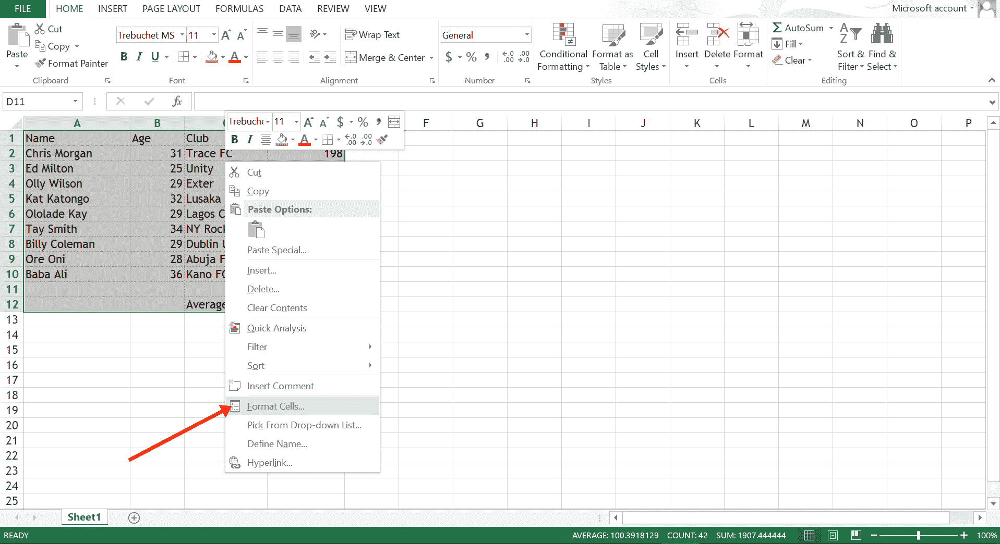
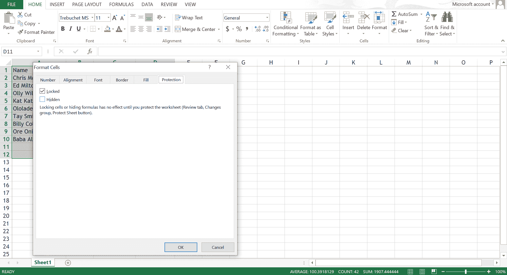
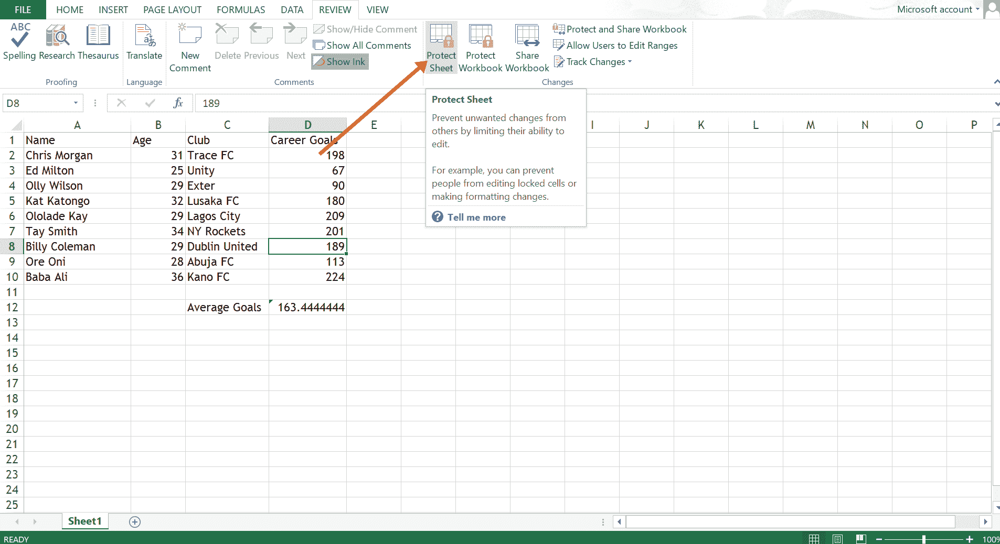
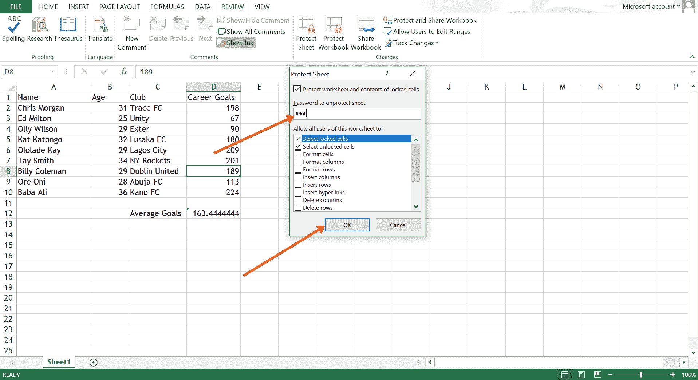
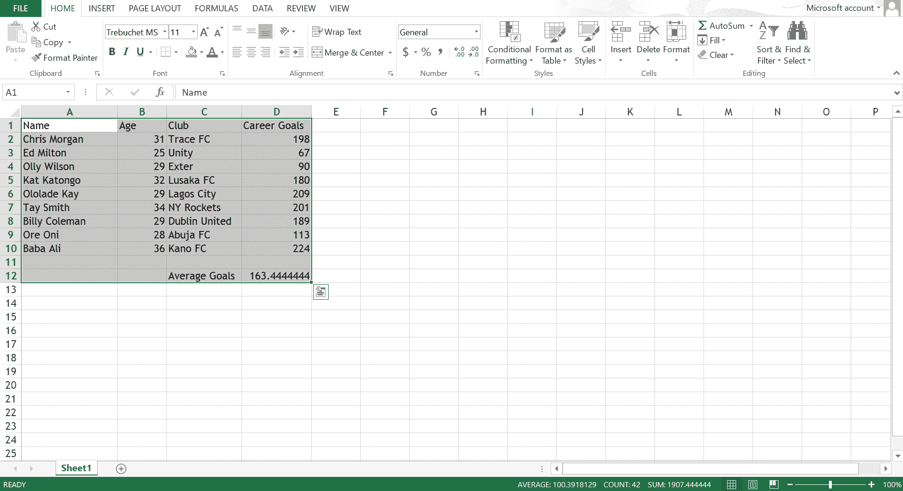
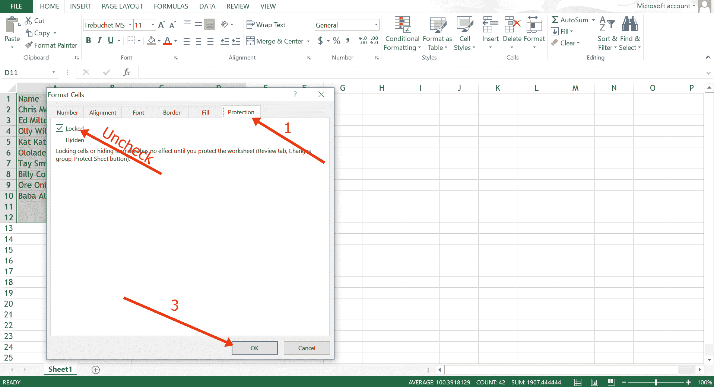
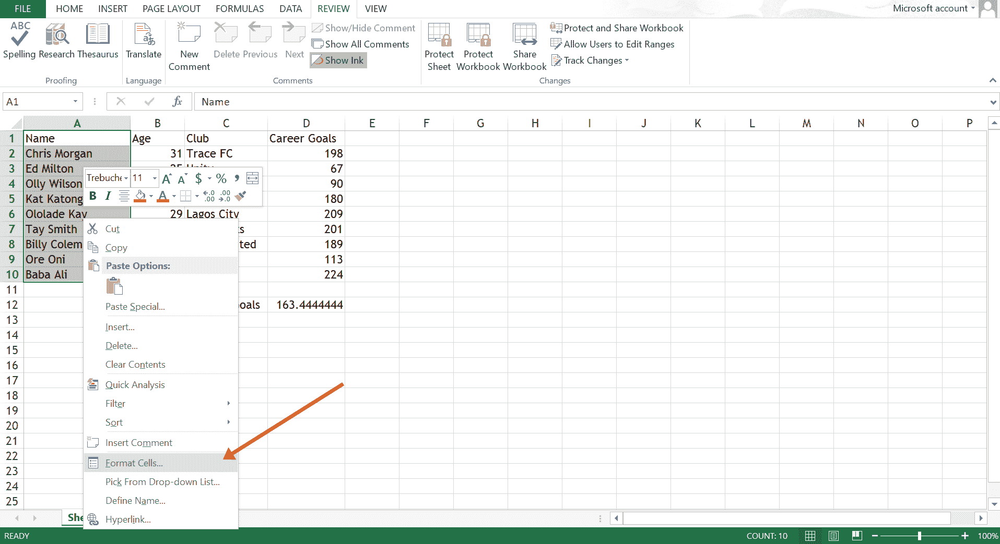
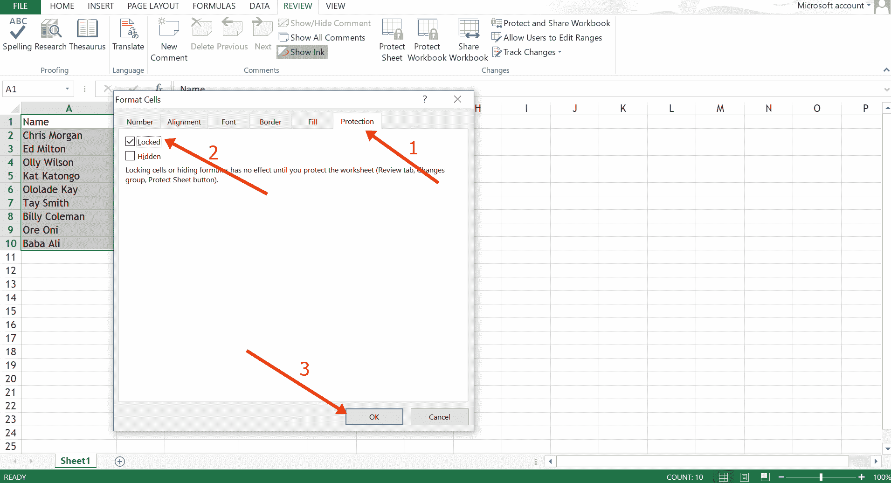
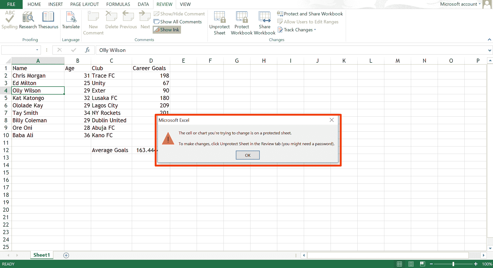

# 如何在 Excel 中锁定单元格–Excel 锁定单元格教程

> 原文：<https://www.freecodecamp.org/news/how-to-lock-cells-in-excel-excel-locked-cell-tutorial/>

为了保护您的 Excel 数据免受不必要的编辑和篡改，您可能需要锁定单元格并保护工作表。

幸运的是，Excel 是一个高度可定制的数据分析工具，它可以让您锁定单元格，同时用密码保护您的工作表。

在本指南中，我将向您展示如何在 Excel 中锁定单元格并对工作表进行密码保护。

## 如何锁定 Excel 中的所有单元格

默认情况下，Excel 中的所有单元格都是锁定的，但在工作表受到保护之前，这并不十分有效。

要确认所有单元格都已锁定，按`Ctrl + A`选择所有单元格。

右键单击选择范围内的任意位置，然后单击“单元格格式”

切换到保护选项卡

可以看到所有单元格默认都被锁定。

## 如何保护工作表

要使单元格锁定有效，您需要保护工作表。

要保护工作表，请单击“审阅”选项卡，然后选择“保护工作表”。

输入解除工作表保护所需的密码，以便编辑工作表，然后单击“确定”。

现在，如果任何人试图编辑单元格，他们会收到一条信息，表明工作表受到保护。

**注意:**如果您不输入密码，任何人都可以解锁工作表并篡改您的数据。

## 如何锁定 Excel 中的特定单元格

首先，你需要解锁所有单元格。

默认情况下，Excel 中的所有单元格都是锁定的，就像我上面讨论的那样。因此，为了锁定某些单元格，您必须做的第一件事是解锁所有单元格。

要解锁所有单元格，按`Ctrl + A`选择所有单元格。

右键单击选择范围内的任意位置，然后单击“单元格格式”。

切换到保护选项卡，取消选中“锁定”，然后单击“确定”。

**锁定特定单元格** :
选择要锁定的单元格，在选择范围内单击右键，然后单击“单元格格式”。

切换到“保护”选项卡，选中“锁定”，然后单击“确定”。

请记住，在保护工作表之前，锁定单元格是无效的。因此，再次执行[保护工作表](#howtoprotecttheworksheet)的过程。

现在，如果有人试图编辑任何单元格，Excel 会告诉他们它是受保护的。

## 结论

在本指南中，您不仅学习了如何锁定单元格，还学习了如何保护它们，使任何人都无法更改您的 Excel 数据。

您应该考虑在 Excel 中锁定单元格的另一个原因是为了保护您的公式，这样您的计算就不会被篡改。

感谢您的阅读。