# 如何使用 Falco、Prometheus、Grafana 和 Docker 保护服务器基础设施云

> 原文：<https://www.freecodecamp.org/news/secure-server-infrastructure-clouds-using-falco-prometheus-grafana-and-docker/>

最近，我在寻找一种方法来监视我们工作中的容器和应用程序。具体来说，我对检测配置中的异常感兴趣。经过一番小小的研究，我偶然发现了[法尔科](https://github.com/falcosecurity/falco)。

我发现这是一个非常完整的开源平台，有很多特性和优秀的文档。所以我想和你分享我的经历。

我们将在这篇文章中讨论什么？

*   如何在要监控事件(异常/违规)的主机上安装 [Falco](https://falco.org/) 代理
*   如何调整 Falco 以减少误报并获得您真正需要的信息
*   如何使用[普罗米修斯](https://prometheus.io/)收集 Falco 事件到一个中心位置，在出口商和刮刀的帮助下。
*   最后，如何将刮刀与 [Grafana](https://grafana.com/) 连接，以便可视化和报警

## **本教程需要什么？**

*   安装了 Linux 的一台或多台机器。虚拟机应该可以工作。
*   您需要超级用户权限才能安装/设置 Docker、RPM 和 systemd 进程
*   我们将使用 Docker 容器，因此需要 Docker 的基本知识
*   Python/Bash 的工作知识，因为我们将编写一些脚本来测试和改进我们的配置。

最后，您将能够设置以下每个组件:

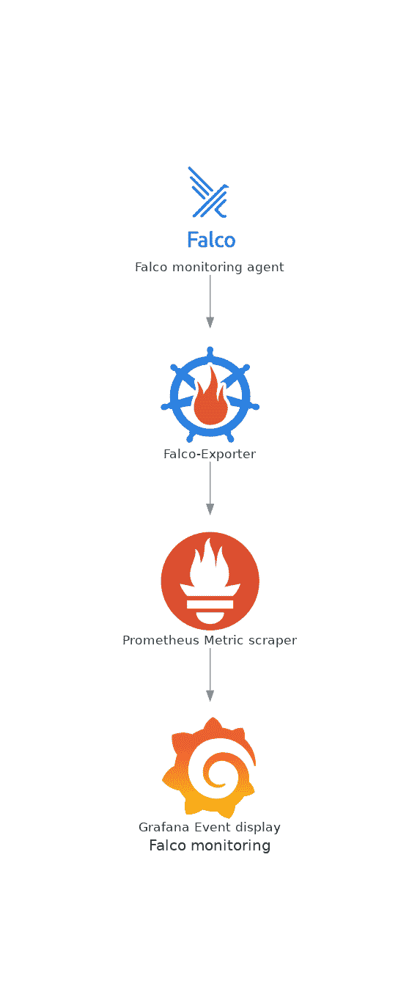

不要害怕——随着我们的进展，我会提供文档链接和对每项任务的详细解释。

## 目录

1.  [**Falco 是什么？**](#what-is-falco)
2.  [**如何安装 Falco**](#how-to-install-falco)
3.  [**基本配置**](#basic-configuration)
4.  [**如何测试默认配置**](#how-to-test-the-default-configuration)
5.  [**默认不总是好的**](#defaults-are-not-always-good)
6.  [**法尔科集成**](#falco-integrations)
***   [**学习更多**](#learning-more)**

# ****Falco 是什么？****

**描述这个工具*的最佳方式是了解它能做什么*:**

> **Falco 可以检测并警告任何涉及进行 Linux 系统调用的行为。
> 
> Falco 警报可以通过使用特定的系统调用、它们的参数以及调用过程的属性来触发。例如，Falco 可以轻松检测事故，包括但不限于:**

*   **在 Kubernetes，一个壳在一个容器或容器内运行。**
*   **容器正在特权模式下运行，或者正在从主机装载敏感路径，如/proc。**
*   **服务器进程正在生成意外类型的子进程。**
*   **意外读取敏感文件，如/etc/shadow。**
*   **非设备文件被写入/dev。**
*   **标准系统二进制文件(如 ls)正在建立出站网络连接。**
*   **特权 pod 在 Kubernetes 集群中启动。**

# ****如何安装 Falco****

**我将使用 RPM 安装 Falco】存在类似的指令用于 apt-get，甚至 Docker 容器)。在我的情况下，我觉得本机安装是最好的，RPM 使它非常容易做到:**

```
`[josevnz@macmini2 ~]$ sudo -i dnf install https://download.falco.org/packages/rpm/falco-0.31.1-x86_64.rpm
Last metadata expiration check: 2:53:53 ago on Sun 01 May 2022 04:13:09 PM EDT.
falco-0.31.1-x86_64.rpm                                                                                                                                                                                                       1.7 MB/s |  12 MB     00:07    
Dependencies resolved.
==============================================================================================================================================================================================================================================================
 Package                                                          Architecture                                      Version                                                                     Repository                                               Size
==============================================================================================================================================================================================================================================================
Installing:
 falco                                                            x86_64                                            0.31.1-1                                                                    @commandline                                             12 M
Installing dependencies:
 dkms                                                             noarch                                            2.8.1-4.20200214git5ca628c.fc30                                             updates                                                  78 k
 elfutils-libelf-devel                                            x86_64                                            0.179-2.fc30                                                                updates                                                  27 k
 kernel-devel                                                     x86_64                                            5.6.13-100.fc30                                                             updates                                                  14 M

Transaction Summary
==============================================================================================================================================================================================================================================================
Install  4 Packages

Total size: 26 M
Total download size: 14 M
Installed size: 92 M
Is this ok [y/N]: y
Downloading Packages:
(1/3): elfutils-libelf-devel-0.179-2.fc30.x86_64.rpm                                                                                                                                                                          253 kB/s |  27 kB     00:00    
(2/3): dkms-2.8.1-4.20200214git5ca628c.fc30.noarch.rpm                                                                                                                                                                        342 kB/s |  78 kB     00:00    
(3/3): kernel-devel-5.6.13-100.fc30.x86_64.rpm                                                                                                                                                                                1.9 MB/s |  14 MB     00:07    
--------------------------------------------------------------------------------------------------------------------------------------------------------------------------------------------------------------------------------------------------------------
Total                                                                                                                                                                                                                         1.8 MB/s |  14 MB     00:07     
Running transaction check
Transaction check succeeded.
Running transaction test
Transaction test succeeded.
Running transaction
  Preparing        :                                                                                                                                                                                                                                      1/1 
  Installing       : kernel-devel-5.6.13-100.fc30.x86_64                                                                                                                                                                                                  1/4 
  Running scriptlet: kernel-devel-5.6.13-100.fc30.x86_64                                                                                                                                                                                                  1/4 
  Installing       : elfutils-libelf-devel-0.179-2.fc30.x86_64                                                                                                                                                                                            2/4 
  Installing       : dkms-2.8.1-4.20200214git5ca628c.fc30.noarch                                                                                                                                                                                          3/4 
  Running scriptlet: dkms-2.8.1-4.20200214git5ca628c.fc30.noarch                                                                                                                                                                                          3/4 
  Running scriptlet: falco-0.31.1-1.x86_64                                                                                                                                                                                                                4/4 
  Installing       : falco-0.31.1-1.x86_64                                                                                                                                                                                                                4/4 
  Running scriptlet: falco-0.31.1-1.x86_64` 
```

# ****基本配置****

**除非我们想做非常基本的输出处理，否则我们想启用 JSON 输出:**

```
`# Whether to output events in json or text
json_output: true` 
```

**很快就会明白为什么。**

**接下来[开始](https://falco.org/docs/getting-started/running/)Falco 代理:**

```
`[josevnz@macmini2 falco]$ sudo systemctl start falco.service 
[josevnz@macmini2 falco]$ sudo systemctl status falco.service 
● falco.service - Falco: Container Native Runtime Security
   Loaded: loaded (/usr/lib/systemd/system/falco.service; disabled; vendor preset: disabled)
   Active: active (running) since Sun 2022-05-01 19:20:52 EDT; 1s ago
     Docs: https://falco.org/docs/
  Process: 26887 ExecStartPre=/sbin/modprobe falco (code=exited, status=0/SUCCESS)
 Main PID: 26888 (falco)
    Tasks: 1 (limit: 2310)
   Memory: 65.8M
   CGroup: /system.slice/falco.service
           └─26888 /usr/bin/falco --pidfile=/var/run/falco.pid

May 01 19:20:52 macmini2 systemd[1]: Starting Falco: Container Native Runtime Security...
May 01 19:20:52 macmini2 systemd[1]: Started Falco: Container Native Runtime Security.
May 01 19:20:52 macmini2 falco[26888]: Falco version 0.31.1 (driver version b7eb0dd65226a8dc254d228c8d950d07bf3521d2)
May 01 19:20:52 macmini2 falco[26888]: Falco initialized with configuration file /etc/falco/falco.yaml
May 01 19:20:52 macmini2 falco[26888]: Loading rules from file /etc/falco/falco_rules.yaml:
May 01 19:20:53 macmini2 falco[26888]: Loading rules from file /etc/falco/falco_rules.local.yaml:
May 01 19:20:54 macmini2 falco[26888]: Loading rules from file /etc/falco/k8s_audit_rules.yaml:` 
```

# ****如何测试默认配置****

**根据您的[配置](https://falco.org/docs/configuration/)，启动 Falco 后，您可能会也可能不会得到任何事件:**

```
`[josevnz@macmini2 falco]$ sudo journalctl --unit falco --follow
-- Logs begin at Tue 2021-05-25 00:15:22 EDT. --
May 01 19:20:52 macmini2 systemd[1]: Starting Falco: Container Native Runtime Security...
May 01 19:20:52 macmini2 systemd[1]: Started Falco: Container Native Runtime Security.
May 01 19:20:52 macmini2 falco[26888]: Falco version 0.31.1 (driver version b7eb0dd65226a8dc254d228c8d950d07bf3521d2)
May 01 19:20:52 macmini2 falco[26888]: Falco initialized with configuration file /etc/falco/falco.yaml
May 01 19:20:52 macmini2 falco[26888]: Loading rules from file /etc/falco/falco_rules.yaml:
May 01 19:20:53 macmini2 falco[26888]: Loading rules from file /etc/falco/falco_rules.local.yaml:
May 01 19:20:54 macmini2 falco[26888]: Loading rules from file /etc/falco/k8s_audit_rules.yaml:
May 01 19:20:55 macmini2 falco[26888]: Starting internal webserver, listening on port 8765` 
```

**别担心。我们将运行一些命令，让 Falco 记录一些警告和警报。是时候看看这是如何工作的了！**

## ****如何运行特权容器****

**使用特权容器[被认为是一种不好的做法](https://materials.rangeforce.com/tutorial/2020/06/25/Escaping-Docker-Privileged-Containers/)，所以让我们看看 Falco 是否检测到了这个事件:**

```
`[josevnz@macmini2 ~]$ docker run --rm --interactive --tty --privileged --volume /etc/shadow:/mnt/shadow fedora:latest ls -l /mnt/shadow
----------. 1 root root 1198 Nov 21 20:51 /mnt/shadow` 
```

**我们的 Falco 日志呢？**

```
`May 01 19:29:32 macmini2 falco[26888]: {"output":"19:29:32.918828894: Informational Privileged container started (user=root user_loginuid=0 command=container:bfb9637a47a6 kind_lumiere (id=bfb9637a47a6) image=fedora:latest)","priority":"Informational","rule":"Launch Privileged Container","source":"syscall","tags":["cis","container","mitre_lateral_movement","mitre_privilege_escalation"],"time":"2022-05-01T23:29:32.918828894Z", "output_fields": {"container.id":"bfb9637a47a6","container.image.repository":"fedora","container.image.tag":"latest","container.name":"kind_lumiere","evt.time":1651447772918828894,"proc.cmdline":"container:bfb9637a47a6","user.loginuid":0,"user.name":"root"}}` 
```

**它显示为一个信息事件。绝对是需要关注的事情之一。问问自己容器上的应用程序是否需要提升特权。**

**你可能也注意到了每封邮件都有标签。请注意“mitre_*”部分，它们确实与攻击和缓解的 [Mitre 攻击知识库](https://attack.mitre.org/)相关。是的，你会花些时间读这些。**

## ****如何在/根目录下创建文件****

**此示例显示了如何滥用 root 用户以及容器中的卷...**

```
`[josevnz@macmini2 ~]$ docker run --rm --interactive --tty --user root --volume /root:/mnt/ fedora:latest touch /mnt/test_file
[josevnz@macmini2 ~]$` 
```

**法尔科反应:**

```
`May 01 19:32:02 macmini2 falco[26888]: {"output":"19:32:02.434286167: Informational Container with sensitive mount started (user=root user_loginuid=0 command=container:ef061174c7ef distracted_lalande (id=ef061174c7ef) image=fedora:latest mounts=/root:/mnt::true:rprivate)","priority":"Informational","rule":"Launch Sensitive Mount Container","source":"syscall","tags":["cis","container","mitre_lateral_movement"],"time":"2022-05-01T23:32:02.434286167Z", "output_fields": {"container.id":"ef061174c7ef","container.image.repository":"fedora","container.image.tag":"latest","container.mounts":"/root:/mnt::true:rprivate","container.name":"distracted_lalande","evt.time":1651447922434286167,"proc.cmdline":"container:ef061174c7ef","user.loginuid":0,"user.name":"root"}}` 
```

**检测到敏感安装！**

## ****让我们通过在/bin 上创建一个文件来增加赌注****

**好吧，假设我们这样做:**

```
`[josevnz@macmini2 ~]$ sudo -i
[root@macmini2 ~]# touch /bin/should_not_be_here` 
```

**法尔科对此怎么看？**

```
`May 01 19:36:41 macmini2 falco[26888]: {"output":"19:36:41.237634398: Error File below a known binary directory opened for writing (user=root user_loginuid=1000 command=touch /bin/should_not_be_here file=/bin/should_not_be_here parent=bash pcmdline=bash gparent=sudo container_id=host image=<NA>)","priority":"Error","rule":"Write below binary dir","source":"syscall","tags":["filesystem","mitre_persistence"],"time":"2022-05-01T23:36:41.237634398Z", "output_fields": {"container.id":"host","container.image.repository":null,"evt.time":1651448201237634398,"fd.name":"/bin/should_not_be_here","proc.aname[2]":"sudo","proc.cmdline":"touch /bin/should_not_be_here","proc.pcmdline":"bash","proc.pname":"bash","user.loginuid":1000,"user.name":"root"}}` 
```

**错误，打开二进制目录进行写入。接得好。**

# ****默认并不总是好的****

**在 Falco 运行一段时间后，了解我们想要忽略什么样的事件以及我们想要调查哪些事件是一个好主意。**

**第一步是获得所有事件的列表，在有效负载上使用我们的 JSON 格式:**

```
`sudo journalctl --unit falco --no-page --output=cat > /tmp/falco_json_lines.txt` 
```

**“output=cat”告诉 journalctl 给我们不带时间戳的消息负载(不要担心，JSON 消息本身有时间戳)。**

```
`Starting Falco: Container Native Runtime Security...
Started Falco: Container Native Runtime Security.
Falco version 0.31.1 (driver version b7eb0dd65226a8dc254d228c8d950d07bf3521d2)
Falco initialized with configuration file /etc/falco/falco.yaml
Loading rules from file /etc/falco/falco_rules.yaml:
Loading rules from file /etc/falco/falco_rules.local.yaml:
Loading rules from file /etc/falco/k8s_audit_rules.yaml:
Starting internal webserver, listening on port 8765
{"output":"19:29:32.918828894: Informational Privileged container started (user=root user_loginuid=0 command=container:bfb9637a47a6 kind_lumiere (id=bfb9637a47a6) image=fedora:latest)","priority":"Informational","rule":"Launch Privileged Container","source":"syscall","tags":["cis","container","mitre_lateral_movement","mitre_privilege_escalation"],"time":"2022-05-01T23:29:32.918828894Z", "output_fields": {"container.id":"bfb9637a47a6","container.image.repository":"fedora","container.image.tag":"latest","container.name":"kind_lumiere","evt.time":1651447772918828894,"proc.cmdline":"container:bfb9637a47a6","user.loginuid":0,"user.name":"root"}}
{"output":"19:32:02.434286167: Informational Container with sensitive mount started (user=root user_loginuid=0 command=container:ef061174c7ef distracted_lalande (id=ef061174c7ef) image=fedora:latest mounts=/root:/mnt::true:rprivate)","priority":"Informational","rule":"Launch Sensitive Mount Container","source":"syscall","tags":["cis","container","mitre_lateral_movement"],"time":"2022-05-01T23:32:02.434286167Z", "output_fields": {"container.id":"ef061174c7ef","container.image.repository":"fedora","container.image.tag":"latest","container.mounts":"/root:/mnt::true:rprivate","container.name":"distracted_lalande","evt.time":1651447922434286167,"proc.cmdline":"container:ef061174c7ef","user.loginuid":0,"user.name":"root"}}` 
```

**到目前为止，它看起来很有趣，但这个呢？**

```
`{"output":"23:04:10.609949471: Warning Shell history had been deleted or renamed (user=josevnz user_loginuid=1000 type=openat command=bash fd.name=/home/josevnz/.bash_history-01112.tmp name=/home/josevnz/.bash_history-01112.tmp path=<NA> oldpath=<NA> host (id=host))","priority":"Warning","rule":"Delete or rename shell history","source":"syscall","tags":["mitre_defense_evasion","process"],"time":"2022-05-04T03:04:10.609949471Z", "output_fields": {"container.id":"host","container.name":"host","evt.arg.name":"/home/josevnz/.bash_history-01112.tmp","evt.arg.oldpath":null,"evt.arg.path":null,"evt.time":1651633450609949471,"evt.type":"openat","fd.name":"/home/josevnz/.bash_history-01112.tmp","proc.cmdline":"bash","user.loginuid":1000,"user.name":"josevnz"}}
{"output":"23:04:10.635602857: Warning Shell history had been deleted or renamed (user=josevnz user_loginuid=1000 type=openat command=bash fd.name=/home/josevnz/.bash_history-01627.tmp name=/home/josevnz/.bash_history-01627.tmp path=<NA> oldpath=<NA> host (id=host))","priority":"Warning","rule":"Delete or rename shell history","source":"syscall","tags":["mitre_defense_evasion","process"],"time":"2022-05-04T03:04:10.635602857Z", "output_fields": {"container.id":"host","container.name":"host","evt.arg.name":"/home/josevnz/.bash_history-01627.tmp","evt.arg.oldpath":null,"evt.arg.path":null,"evt.time":1651633450635602857,"evt.type":"openat","fd.name":"/home/josevnz/.bash_history-01627.tmp","proc.cmdline":"bash","user.loginuid":1000,"user.name":"josevnz"}}
{"output":"23:04:10.635851215: Warning Shell history had been deleted or renamed (user=josevnz user_loginuid=1000 type=rename command=bash fd.name=<NA> name=<NA> path=<NA> oldpath=/home/josevnz/.bash_history-01627.tmp host (id=host))","priority":"Warning","rule":"Delete or rename shell history","source":"syscall","tags":["mitre_defense_evasion","process"],"time":"2022-05-04T03:04:10.635851215Z", "output_fields": {"container.id":"host","container.name":"host","evt.arg.name":null,"evt.arg.oldpath":"/home/josevnz/.bash_history-01627.tmp","evt.arg.path":null,"evt.time":1651633450635851215,"evt.type":"rename","fd.name":null,"proc.cmdline":"bash","user.loginuid":1000,"user.name":"josevnz"}}
{"output":"23:04:10.661829867: Warning Shell history had been deleted or renamed (user=josevnz user_loginuid=1000 type=rename command=bash fd.name=<NA> name=<NA> path=<NA> oldpath=/home/josevnz/.bash_history-01112.tmp host (id=host))","priority":"Warning","rule":"Delete or rename shell history","source":"syscall","tags":["mitre_defense_evasion","process"],"time":"2022-05-04T03:04:10.661829867Z", "output_fields": {"container.id":"host","container.name":"host","evt.arg.name":null,"evt.arg.oldpath":"/home/josevnz/.bash_history-01112.tmp","evt.arg.path":null,"evt.time":1651633450661829867,"evt.type":"rename","fd.name":null,"proc.cmdline":"bash","user.loginuid":1000,"user.name":"josevnz"}}` 
```

**这是正常/合法的操作。让我们找到一种方法来强化这条规则，或者完全删除它。**

**首先，打开`/etc/falco/falco_rules.yaml`文件，寻找规则‘删除或重命名 shell 历史’(我们前面看到的 JSON 输出):**

```
`- list: docker_binaries
  items: [docker, dockerd, exe, docker-compose, docker-entrypoi, docker-runc-cur, docker-current, dockerd-current]

 macro: var_lib_docker_filepath
  condition: (evt.arg.name startswith /var/lib/docker or fd.name startswith /var/lib/docker)

- rule: Delete or rename shell history
  desc: Detect shell history deletion
  condition: >
    (modify_shell_history or truncate_shell_history) and
       not var_lib_docker_filepath and
       not proc.name in (docker_binaries)
  output: >
    Shell history had been deleted or renamed (user=%user.name user_loginuid=%user.loginuid type=%evt.type command=%proc.cmdline fd.name=%fd.name name=%evt.arg.name path=%evt.arg.path oldpath=%evt.arg.oldpath %container.info)
  priority:
    WARNING
  tags: [process, mitre_defense_evasion]` 
```

**Falco 规则在官方文档中有详细的解释。仅仅通过看这件作品，你就会注意到一些事情。**

**关于条件:**

1.  **支持复杂逻辑，**
2.  **类似`var_lib_docker_filepath`的宏**
3.  **类似于`(docker_binaries)`的列表**
4.  **以及带有类似`proc.name`字段的特殊变量。**

**建议您不要更改此文件。相反，您应该在`/etc/falco/falco_rules.local.yaml`上覆盖您需要的内容:**

```
`# Add new rules, like this one
# - rule: The program "sudo" is run in a container
#   desc: An event will trigger every time you run sudo in a container
#   condition: evt.type = execve and evt.dir=< and container.id != host and proc.name = sudo
#   output: "Sudo run in container (user=%user.name %container.info parent=%proc.pname cmdline=%proc.cmdline)"
#   priority: ERROR
#   tags: [users, container]

# Or override/append to any rule, macro, or list from the Default Rules` 
```

**举例来说，假设我们确实关心超级用户(root)的历史何时被覆盖，但是其他所有人都没有问题。最好的部分是，你不必推翻整个规则。**

**因此，原始规则将附加一个条件:**

```
`- rule: Delete or rename shell history
  append: true
  condition: and user.name=root` 
```

**验证您的规则是否编写正确总是一个好主意。为此，您需要告诉 Falco 一起检查原始规则和您的覆盖:**

```
`[root@macmini2 ~]# falco --validate /etc/falco/falco_rules.yaml --validate /etc/falco/falco_rules.local.yaml 
Fri May  6 20:48:00 2022: Validating rules file(s):
Fri May  6 20:48:00 2022:    /etc/falco/falco_rules.yaml
Fri May  6 20:48:00 2022:    /etc/falco/falco_rules.local.yaml
/etc/falco/falco_rules.yaml: Ok
/etc/falco/falco_rules.local.yaml: Ok
Fri May  6 20:48:01 2022: Ok

# If the rules are OK, restart Falco
[root@macmini2 ~]# systemctl restart falco.service` 
```

## ****如何用 Python 制作一个简单的事件浏览器****

**你可能会同意，弄清楚哪些规则是噪音，哪些是有用的是乏味的。**

**我们需要规范化这些数据，我们将使用一个 Python 脚本，它将:**

*   **移除非 JSON 数据**
*   **不带时间戳的聚合事件类型**
*   **生成一些聚合统计数据，这样我们就可以专注于系统中最频繁的事件**

**一个小的 Python 脚本就可以做到这一点。我省略了 UI 渲染部分(请检查代码以查看完整的图片)，取而代之的是向您展示文件解析部分:**

```
`#!/usr/bin/env python3
"""
Aggregate Falco events to make it easier to override rules
Jose Vicente Nunez (kodegeek.com@protonmail.com)
"""
import json
import re
from argparse import ArgumentParser
from pathlib import Path
from rich.console import Console
from falcotutor.ui import EventDisplayApp, create_event_table, add_rows_to_create_event_table

def filter_events(journalctl_out: Path) -> dict[any, any]:
    """
    :param journalctl_out:
    :return:
    """
    with open(journalctl_out, 'r') as journalctl_file:
        for row in journalctl_file:
            if re.search("^{", row):
                data = json.loads(row)
                if 'rule' in data and 'output_fields' in data:
                    yield data

def aggregate_events(local_event: dict[any, any], aggregated_events: dict[any, any]):
    rule = local_event['rule']
    if rule not in aggregated_events:
        aggregated_events[rule] = {
            'count': 0,
            'priority': local_event['priority'],
            'last_timestamp': "",
            'last_fields': ""
        }
    aggregated_events[rule]['count'] += 1
    aggregated_events[rule]['last_timestamp'] = local_event['time']
    del local_event['output_fields']['evt.time']
    aggregated_events[rule]['last_fields'] = json.dumps(local_event['output_fields'], indent=True)

if __name__ == "__main__":
    CONSOLE = Console()
    AGGREGATED = {}
    PARSER = ArgumentParser(description=__doc__)
    PARSER.add_argument(
        "falco_event",
        action="store"
    )
    ARGS = PARSER.parse_args()
    try:
        event_table = create_event_table()
        for event in filter_events(ARGS.falco_event):
            aggregate_events(local_event=event, aggregated_events=AGGREGATED)
        add_rows_to_create_event_table(AGGREGATED, event_table)
        EventDisplayApp.run(
            event_file=ARGS.falco_event,
            title="Falco aggregated events report",
            event_table=event_table
        )
    except KeyboardInterrupt:
        CONSOLE.print("[bold]Program interrupted...[/bold]")` 
```

**一旦文件作为字典加载，我们只需要迭代它来聚合事件，然后将结果显示为按计数排序的整洁表格:**

**[](https://asciinema.org/a/492898)**

 **## **如何展示 Falco 规则**

如果你和我一样，总是在查看/etc/falco/falco_rules.yaml 文件，了解被监控的内容。对这些规则的简要介绍(不用查看带有注释的冗长的 YAML 文件)是一个很好的补充:

```
#!/usr/bin/env python3
"""
Show brief content of default Falco rule YAML files
Jose Vicente Nunez (kodegeek.com@protonmail.com)
"""
from argparse import ArgumentParser
from pathlib import Path
from rich.console import Console
import yaml
from falcotutor.ui import create_rules_table, add_rows_to_create_rules_table, RulesDisplayApp

def load_rulez(falco_rulez: Path) -> dict[any, any]:
    rulez = {}
    with open(falco_rulez, 'rt') as falco_file:
        for rule_data in yaml.full_load(falco_file):
            if 'rule' in rule_data:
                rule_name = rule_data['rule']
                del rule_data['rule']
                rulez[rule_name] = rule_data
    return rulez

if __name__ == "__main__":
    CONSOLE = Console()
    AGGREGATED = {}
    PARSER = ArgumentParser(description=__doc__)
    PARSER.add_argument(
        "falco_rules",
        action="store"
    )
    ARGS = PARSER.parse_args()
    try:
        RULES = load_rulez(ARGS.falco_rules)
        RULE_TBL = create_rules_table()
        add_rows_to_create_rules_table(lrules=RULES, rules_tbl=RULE_TBL)
        RulesDisplayApp.run(
            rules_file=ARGS.falco_rules,
            title="Falco brief rule display",
            rules_table=RULE_TBL
        )
    except KeyboardInterrupt:
        CONSOLE.print("[bold]Program interrupted...[/bold]") 
```

您可以通过添加特定标准的规则过滤来改进该脚本，例如(规则名称、优先级、启用/禁用)。这个版本不做任何过滤:

[](https://asciinema.org/a/492908)

# **Falco 集成**

你可能注意到了我们早期实验中的两件事:

1.  事件的有效载荷没有宿主。如果您想要定位违规的服务器，您需要改进多主机事件的报告方式(解析来自许多主机的 journalctl 文件是不实际的)。
2.  我们希望在一个集中的位置获得警报。如果有一种方法来“推动”这些事件，而不是我们去钓鱼，那就太好了。

是时候将这些警报整合到一个地方了。

## **如何使用 Falco Exporter**

Falco exporter 将允许我们与 Prometheus scraper 共享 Falco 警报。我们需要首先在/etc/falco/falco.yaml 中启用 [gRPC](https://grpc.io/)

```
# gRPC server using an unix socket
grpc:
  enabled: true
  bind_address: "unix:///var/run/falco.sock"
  # when threadiness is 0, Falco automatically guesses it depending on the number of online cores
  threadiness: 0

# gRPC output service.
# By default it is off.
# By enabling this all the output events will be kept in memory until you read them with a gRPC client.
# Make sure to have a consumer for them or leave this disabled.
grpc_output:
  enabled: true 
```

重启 Falco:

```
[root@macmini2 ~]# systemctl restart falco.service 
[root@macmini2 ~]# systemctl status falco.service 
● falco.service - Falco: Container Native Runtime Security
   Loaded: loaded (/usr/lib/systemd/system/falco.service; disabled; vendor preset: disabled)
   Active: active (running) since Sun 2022-05-01 20:35:01 EDT; 26s ago
     Docs: https://falco.org/docs/
  Process: 28285 ExecStartPre=/sbin/modprobe falco (code=exited, status=0/SUCCESS)
 Main PID: 28288 (falco)
    Tasks: 11 (limit: 2310)
   Memory: 80.9M
   CGroup: /system.slice/falco.service
           └─28288 /usr/bin/falco --pidfile=/var/run/falco.pid

May 01 20:35:01 macmini2 systemd[1]: Starting Falco: Container Native Runtime Security...
May 01 20:35:01 macmini2 systemd[1]: Started Falco: Container Native Runtime Security.
May 01 20:35:01 macmini2 falco[28288]: Falco version 0.31.1 (driver version b7eb0dd65226a8dc254d228c8d950d07bf3521d2)
May 01 20:35:01 macmini2 falco[28288]: Falco initialized with configuration file /etc/falco/falco.yaml
May 01 20:35:01 macmini2 falco[28288]: Loading rules from file /etc/falco/falco_rules.yaml:
May 01 20:35:02 macmini2 falco[28288]: Loading rules from file /etc/falco/falco_rules.local.yaml:
May 01 20:35:03 macmini2 falco[28288]: Loading rules from file /etc/falco/k8s_audit_rules.yaml:
May 01 20:35:04 macmini2 falco[28288]: Starting internal webserver, listening on port 8765
May 01 20:35:04 macmini2 falco[28288]: gRPC server threadiness equals to 2
May 01 20:35:04 macmini2 falco[28288]: Starting gRPC server at unix:///var/run/falco.sock 
```

快速确保一切正常(提醒，Falco 代理正在 macmini2 上运行):

```
josevnz@raspberrypi:~$ curl --fail http://macmini2:8765/healthz
{"status": "ok"}josevnz@raspberrypi:~$ 
```

然后我们经营法尔科出口商。为了更简单，我们将使用 Docker 容器[，在命令行](https://docs.docker.com/engine/reference/commandline/run/)中有一些覆盖。

```
[root@macmini2 ~]# docker run --restart always --name falco-exporter --detach --volume /var/run/falco.sock:/var/run/falco.sock --network=host falcosecurity/falco-exporter --listen-address 192.168.1.16:9376
7d157af0251ea4bc73b8c355a74eaf4dd24a5348cbe3f5f2ea9d7147c6c366c8
[root@macmini2 ~]# docker logs falco-exporter
2022/05/02 00:56:30 connecting to gRPC server at unix:///var/run/falco.sock (timeout 2m0s)
2022/05/02 00:56:30 listening on http://192.168.1.16:9376/metrics
2022/05/02 00:56:30 connected to gRPC server, subscribing events stream
2022/05/02 00:56:30 ready

# Check with CURL if the URL is reachable
[root@macmini2 ~]# curl http://192.168.1.16:9376/metrics
# HELP go_gc_duration_seconds A summary of the pause duration of garbage collection cycles.
# TYPE go_gc_duration_seconds summary
go_gc_duration_seconds{quantile="0"} 0
go_gc_duration_seconds{quantile="0.25"} 0
go_gc_duration_seconds{quantile="0.5"} 0
go_gc_duration_seconds{quantile="0.75"} 0
go_gc_duration_seconds{quantile="1"} 0
go_gc_duration_seconds_sum 0
go_gc_duration_seconds_count 0
# HELP go_goroutines Number of goroutines that currently exist.
# TYPE go_goroutines gauge
go_goroutines 18
# HELP go_info Information about the Go environment.
# TYPE go_info gauge
go_info{version="go1.14.15"} 1
# HELP go_memstats_alloc_bytes Number of bytes allocated and still in use.
# TYPE go_memstats_alloc_bytes gauge
go_memstats_alloc_bytes 2.011112e+06 
```

为了完整起见，我还将向您展示如何使用节点导出器来捕获主机性能指标[(我们稍后将使用它来监视 Falco 使用了多少资源，并确保我们的安装不会损害服务器):](https://prometheus.io/docs/guides/node-exporter/)

```
docker run --detach --net="host" --pid="host" --volume "/:/host:ro,rslave" quay.io/prometheus/node-exporter:latest --path.rootfs=/host 
```

node-exporter 和 falco-exporter 将在每台需要抓取数据的主机上运行。现在，您需要等待将所有这些指标收集到一个位置。为此将使用[普罗米修斯药剂](https://prometheus.io/docs/prometheus/latest/getting_started/):

```
---
# /etc/prometheus.yaml on raspberrypi
global:
    scrape_interval: 30s
    evaluation_interval: 30s
    scrape_timeout: 10s
    external_labels:
        monitor: 'nunez-family-monitor'

scrape_configs:
  - job_name: 'falco-exporter'
    static_configs:
      - targets: ['macmini2.home:9376']
  - job_name: 'node-exporter'
    static_configs:
      - targets: ['macmini2.home:9100', 'raspberrypi.home:9100', 'dmaf5:9100']
  - job_name: 'docker-exporter'
    static_configs:
      - targets: ['macmini2.home:9323', 'raspberrypi.home:9323', 'dmaf5:9323']

    tls_config:
      insecure_skip_verify: true 
```

然后确保普罗米修斯铲运机可以与每个节点通话。我们访问网络用户界面:

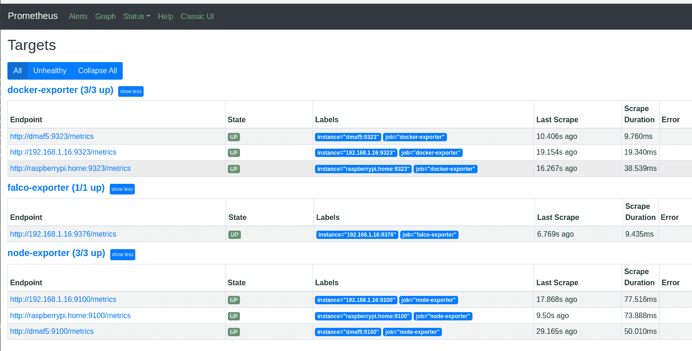

很好，普罗米修斯可以救法尔科了。我们甚至可以运行一个简单的查询来查看一些事件:

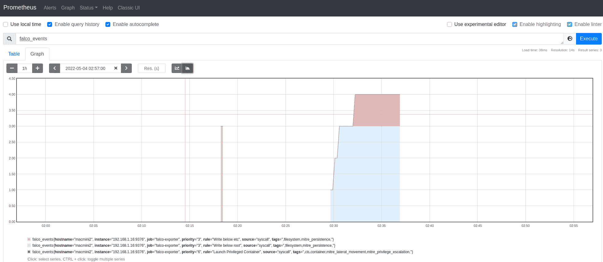

接下来我们需要为事件设置 UI 视图，为此我们将使用 Grafana。

安装 Grafana 的方法有很多种。在我的例子[中，我将使用 Grafana Docker 容器](https://grafana.com/docs/grafana/latest/installation/docker/)(我将在运行 Prometheus 的主机上运行 Grafana:raspberripi . home):

```
docker pull grafana/grafana:main-ubuntu
mkdir -p /data/grafana
chown syslog /data/grafana
docker run --user 104 --name grafana --detach --tty --volume /data/grafana:/var/lib/grafana -p 3000:3000 grafana/grafana:main-ubuntu 
```

Grafana 出现后，您需要更改您的密码，还需要与 Prometheus 连接:

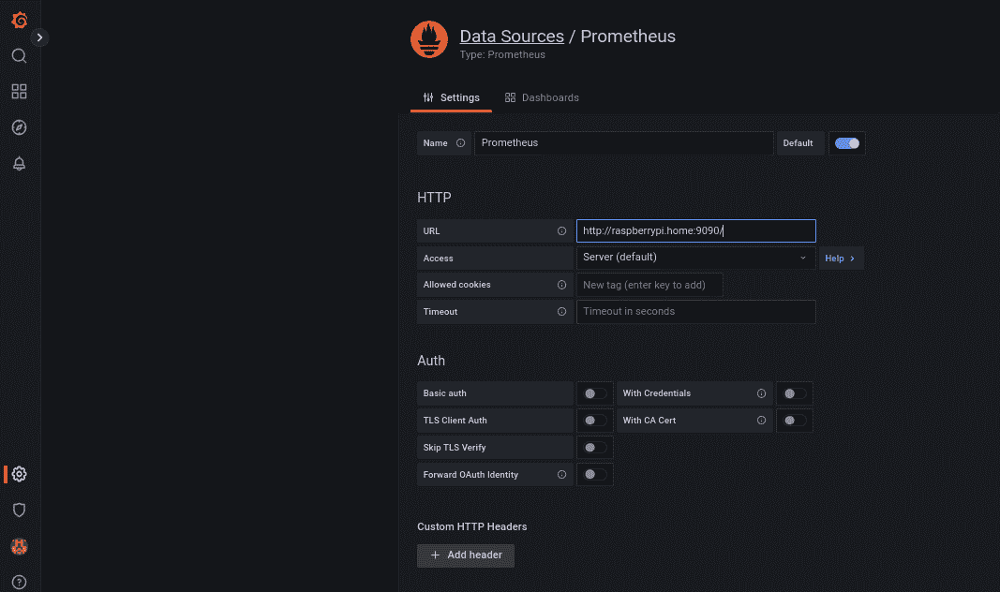

一旦 Grafana 启动，我们就可以[导入 Falco 仪表板](https://grafana.com/grafana/dashboards/11914)，正如[在这里](https://grafana.com/docs/reference/export_import/)解释的那样。

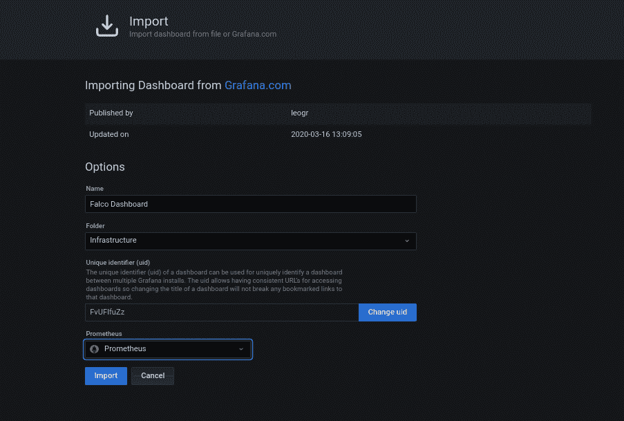

导入控制面板后，我们可以生成一些事件来触发安装了的主机上的 Falco:

```
[root@macmini2 ~]# for i in $(seq 1 60); do docker run --rm --interactive --tty --privileged fedora:latest /bin/bash -c ls; touch /root/test; rm -f /root/test; sleep 1; done 
```

过一会儿，您应该会在 Grafana 仪表板上看到类似这样的内容:

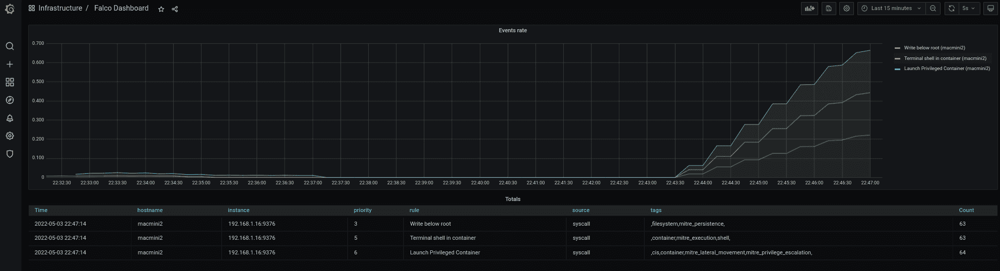

事件是流动的，您可以看到它们来自哪个主机。

## **如何为您的 Falco 事件创建提醒**

理想情况下，如果您在 Grafana 中有 Falco 事件，您可以制作这些可操作的项目，然后从中生成警报。

我不想受到非关键警报的狂轰滥炸，所以首先要知道要过滤什么级别的事件:

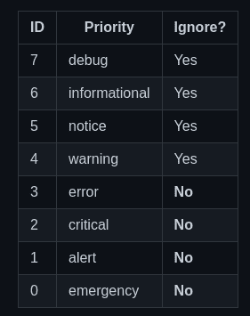

优先级低于 3 的任何事件都将被视为警报。

Grafana 有关于如何设置提醒的很好的文档，所以我在这里只展示最终结果:

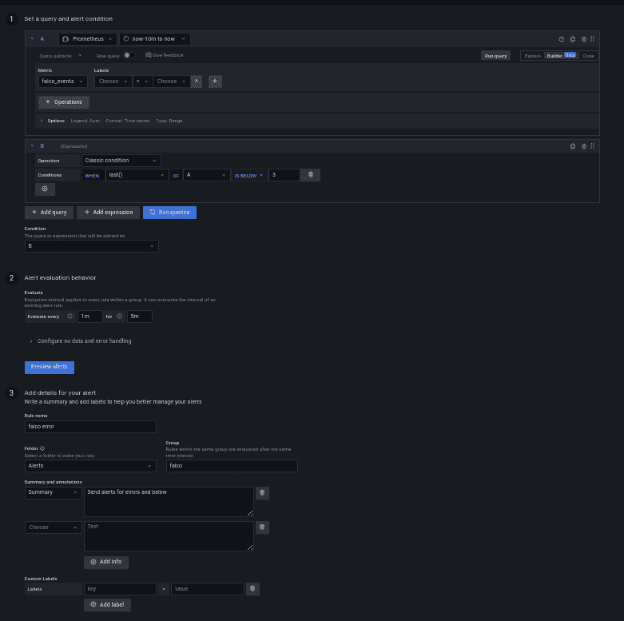

下一步是将警报发送到某个地方。

## **警报需要发送到某个地方——如何使用 Discord 定义联系点**

在本例中，我们将使用 [Discord](https://discord.com/) 作为警报的结尾。Discord 有一个关于如何设置[网页钩子](https://support.discord.com/hc/en-us/articles/228383668-Intro-to-Webhooks)的非常详细的指南，所以我在这里只向你展示我的 discord 网页钩子的最终结果:

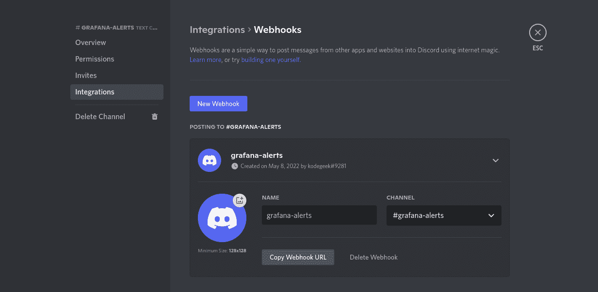

我们复制该 URL，然后将配置一个新的 Grafana 联系点，该联系点使用我们的 Discord webhook ( *我们将此设置为所有警报的默认联系点*):

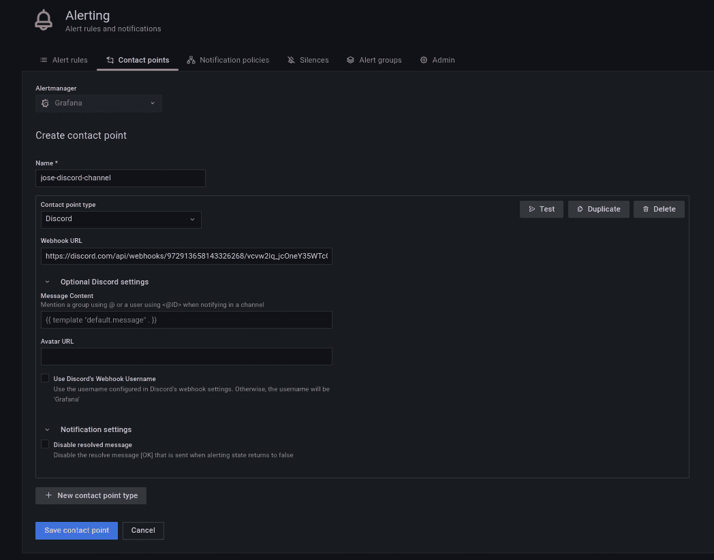

从那里，我们可以向 Discord 发送一条测试消息，以确认这条管道是否正常工作:

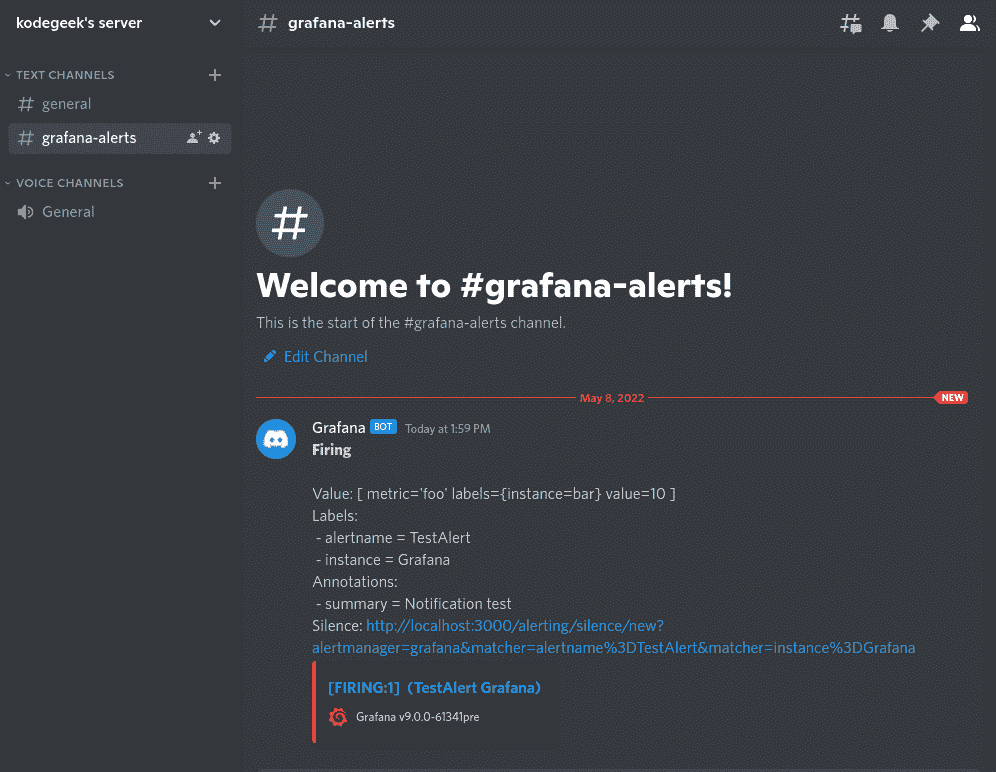

我们越来越接近了。现在，如果我们回到警报定义，我们应该看到它处于“触发”状态:

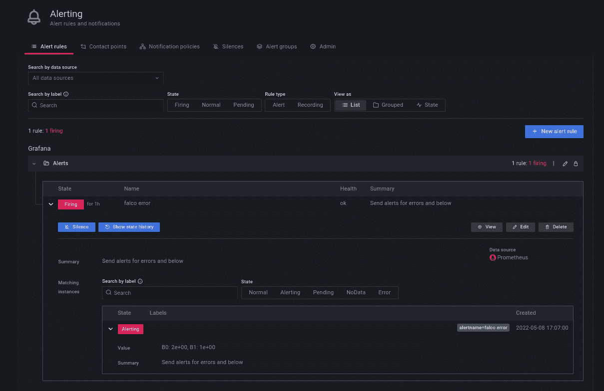

如果一切顺利，我们还会看到我们的第一个 Falco 警报不和谐:

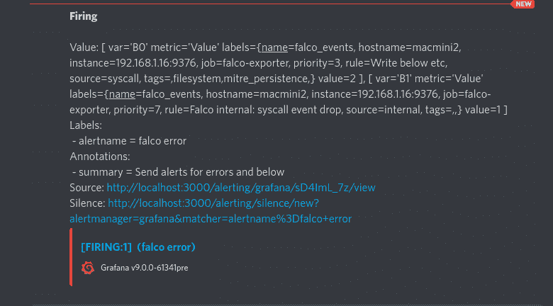

我们可以在这里看到在 journalctl 输出中得到的所有字段。不同之处在于，所有这些消息都将来自您定义 Falco-Prometheus-Grafana 桥的所有服务器。

## **荣誉奖:如何使用 Falcon Sidekick/Falcon Sidekick-UI 汇总警报**

Falco Sidekick 是收集事件并将其发送到其他目的地的另一种方式，如 [Falco Sidekick-UI](https://github.com/falcosecurity/falcosidekick-ui) 。但它不会告诉你始发主机(至少在 Falco 0.31.1 之前)。

对于来自 K8s 集群或容器化应用程序的警报来说，这很可能不是一个问题，在这些应用程序中，映像名称会为您提供大量信息。但是如果您的事件发生在裸机环境中，并且您有 2 台以上的机器，这将变得令人头痛。

因此，我不会在这里讨论 Sidekick 您可能想暂时继续使用 Grafana 集成。

# **了解更多信息**

Falco 有很棒的互动学习[环境](https://falco.org/docs/getting-started/third-party/learning/)。你应该试试看还有什么可能。这里有很多东西我没有涉及到，比如规则异常。

还有，你知道 Falco 可以用[插件](https://falco.org/docs/plugins/)来扩展吗？你可以选择使用 C++或 Go 作为语言来娱乐和学习

Falco 博客有很多有趣的文章，包括最新威胁的帖子。

最后，该项目在许多频道上有一个非常活跃的社区。选择你的并探索。

如果你发现任何问题，请随意[分叉我的代码](https://github.com/josevnz/Falco)并向[报告。但更重要的是，在实践中探索和学习。](https://github.com/josevnz/Falco/issues)**