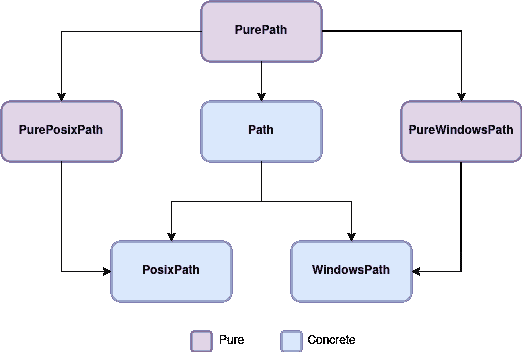

# python Path——如何使用 Pathlib 模块并举例说明

> 原文：<https://www.freecodecamp.org/news/how-to-use-pathlib-module-in-python/>

每个操作系统都有不同的构造文件路径的规则。例如，Linux 使用正斜杠作为路径，而 Windows 使用反斜杠。

如果您正在处理一个项目，并且您希望来自不同操作系统的其他开发人员扩展您的代码，那么这种微小的差异可能会导致问题。

幸运的是，如果您正在用 Python 编码，Pathlib 模块通过让您确保您的文件路径在不同的操作系统中工作相同来完成繁重的工作。此外，它还提供了一些功能和操作来帮助您在处理和操作路径时节省时间。

## 先决条件

Python >= 3.4 时默认提供 Pathlib。但是，如果您使用的 Python 版本低于 3.4，您将无法访问该模块。

## Pathlib 是如何工作的？

为了理解如何使用 Pathlib 构建基本路径，让我们创建一个名为`example.py`的新 Python 文件，并将其放在一个特定的目录中。

打开文件，并键入以下内容:

```
import pathlib

p = pathlib.Path(__file__)
print(p) 
```

example.py

在这个例子中，我们导入 Pathlib 模块。然后，我们创建一个名为`p`的新变量来存储路径。这里，我们使用 Pathlib 中的 Path 对象和 Python 中一个名为 **__file__** 的内置变量来引用我们当前正在写入其中的文件路径`example.py`。

如果我们打印`p`，我们将获得我们当前所在文件的路径:

```
/home/rochdikhalid/dev/src/package/example.py
```

如上所示，pathlib 通过将这个特定的脚本放在 Path 对象中来创建这个文件的路径。Pathlib 包含许多对象，如`PosixPath()`和`PurePath()`，我们将在下面的小节中了解更多。

在我们开始之前，Pathlib 将文件系统路径分成两个不同的类，代表两种类型的路径对象:**纯路径**和**具体路径**。



PurePath() classes

纯路径提供了在不进行写操作的情况下处理和操作文件路径的工具，而具体路径允许您在文件路径上操作和进行写操作。

换句话说，具体路径是纯路径的子类。它继承了父类的操作，并添加了执行系统调用的输入/输出操作。

## Python 中的纯路径

纯路径操作机器上的文件路径，即使它属于不同的操作系统。

例如，假设您在 Linux 上，您想使用 Windows 文件路径。在这里，纯 path 类对象将帮助您通过一些基本操作使路径在您的机器上工作，如创建子路径或访问路径的各个部分。

但是纯路径不能模拟其他操作，比如创建目录或文件，因为你实际上并不在那个操作系统中。

### 如何使用纯路径

如上图所示，纯路径由三个类组成，它们处理机器上的任何文件系统路径:

**PurePath()** 是为 Pathlib 中的每个 Path 对象提供处理操作的根节点。

当实例化`PurePath()`时，它创建两个类来处理 Windows 路径和非 Windows 路径。`PurePath()`创建一个通用路径对象“不可知路径”,与您运行的操作系统无关。

```
In [*]: pathlib.PurePath('setup.py')                                            
Out[*]: PurePosixPath('setup.py') 
```

上例中的 PurePath()创建了一个`PurePosixPath()`,因为我们假设我们运行在 Linux 机器上。但是如果你在 Windows 上实例化它，你会得到类似于`PureWindowsPath('setup.py')`的东西。

**PurePosixPath()** 是为非 Windows 文件系统路径实现的 PurePath()的子节点。

```
In [*]: pathlib.PurePosixPath('setup.py')                                            
Out[*]: PurePosixPath('setup.py') 
```

如果你在 Windows 上实例化`PurePosixPath()`,你不会得到任何错误，因为这个类不会进行系统调用。

**PureWindowsPath()** 是为 Windows 文件系统路径实现的 PurePath()的子节点。

```
In [*]: pathlib.PureWindowsPath('setup.py')                                     
Out[*]: PureWindowsPath('setup.py') 
```

这同样适用于`PureWindowsPath()`,因为这个类不提供系统调用，所以实例化它不会给其他操作系统带来任何错误。

### 纯路径属性

**`PurePath()`** 中的每个子类提供了以下属性:

**PurePath()。parent** 输出路径的父路径:

```
In [*]: pathlib.PurePath('/src/goo/scripts/main.py').parent                     
Out[*]: PurePosixPath('/src/goo/scripts') 
```

在上面的例子中，我们使用`.parent`属性来获取`**main.py**`的逻辑父节点的路径。

**PurePath()。**parents[]，输出路径的祖先:

```
In [*]: p = pathlib.PurePath('/src/goo/scripts/main.py')
		p.parents[0]               
Out[*]: PurePosixPath('/src/goo/scripts')

In [*]: p.parents[1]                
Out[*]: PurePosixPath('/src/goo') 
```

您应该总是在方括号中指定祖先索引，如上所示。在 Python 3.10 及以上版本中，可以使用切片和负索引值。

**PurePath()。name** 提供路径的最后一个组件的名称:

```
In [*]: pathlib.PurePath('/src/goo/scripts/main.py').name                      
Out[*]: 'main.py' 
```

在这个例子中，最终的路径组件是`main.py`。因此，`.name`属性输出文件`main.py`的名称，即 **main** 加上后缀**。py** 。

另一方面， **PurePath()。后缀**提供路径最后一部分的文件扩展名:

```
In [*]: pathlib.PurePath('/src/goo/scripts/main.py').suffix                    
Out[*]: '.py' 
```

与`.name`属性相比，`.suffix`属性输出文件扩展名并排除文件名。

**PurePath()。stem** 只输出路径最后一部分的名称，不带后缀:

```
In [*]: pathlib.PurePath('/src/goo/scripts/main.py').stem                      
Out[*]: 'main' 
```

如上所示，`.stem`属性排除了最后一个组件`main.py`的后缀，只提供了文件名。

### 纯路径方法

`PurePath()`的每个子类都提供了以下方法:

**PurePath()。is_absolute()** 检查您的路径是否是绝对路径:

```
In [*]: p = pathlib.PurePath('/src/goo/scripts/main.py')
        p.is_absolute()

Out[*]: True

In [*]: o = pathlib.PurePath('scripts/main.py')
        o.is_absolute()

Out[*]: False 
```

请注意，绝对路径由根目录和驱动器名组成。在这种情况下，`PurePath()`不允许我们知道驱动器的名称。

如果使用`PureWindowsPath()`，可以表示一个包含驱动器名的绝对路径，比如`PureWindowsPath('c:/Program Files')`。

**PurePath()。is_relative()** 检查该路径是否属于其他给定路径:

```
In [*]: p = pathlib.PurePath('/src/goo/scripts/main.py')
        p.is_relative_to('/src')

Out[*]: True

In [*]: p.is_relative_to('/data')

Out[*]: False 
```

在这个例子中，给定路径`/src`是路径`p`的一部分或者属于路径`p`，而另一个给定路径`/data`引发`False`，因为它与路径`p`没有相对关系。

**PurePath()。joinpath()** 用给定的参数连接路径(子路径):

```
In [*]: p = pathlib.PurePath('/src/goo')
        p.joinpath('scripts', 'main.py')

Out[*]: PurePosixPath('/src/goo/scripts/main.py') 
```

请注意，没有必要在给定的参数中添加斜杠，因为`.joinpath()`方法会为您处理这些。

**PurePath()。match()** 检查路径是否匹配给定的模式:

```
In [*]: pathlib.PurePath('/src/goo/scripts/main.py').match('*.py')
Out[*]: True

In [*]: pathlib.PurePath('/src/goo/scripts/main.py').match('goo/*.py')
Out[*]: True

In [*]: pathlib.PurePath('src/goo/scripts/main.py').match('/*.py')
Out[*]: False 
```

根据上面的例子，模式应该与路径匹配。如果给定的模式是绝对的，那么路径也必须是绝对的。

**PurePath()。with_name()** 改变最终组件的名称及其后缀:

```
In [*]: p = pathlib.PurePath('/src/goo/scripts/main.py')
        p.with_name('app.js')
Out[*]: PurePosixPath('/src/goo/scripts/app.js')

In [*]: p
Out[*]: PurePosixPath('/src/goo/scripts/main.py') 
```

`.with_name()`方法不会永久改变最后一个组件的名称。此外，如果给定的路径不包含名称，就会出现一个错误，如[官方文档](https://docs.python.org/3/library/pathlib.html#methods-and-properties)中所述。

**PurePath()。with_stem()** 只改变路径的最后一个组件的名称:

```
In [*]: p = pathlib.PurePath('/src/goo/scripts/main.py')
        p.with_stem('app.py')
Out[*]: PurePosixPath('/src/goo/scripts/app.py')

In [*]: p
Out[*]: PurePosixPath('/src/goo/scripts/main.py') 
```

这类似于`.with_name()`方法。`.with_stem()`临时更改最后一个组件的名称。此外，如果给定的路径不包含名称，将会发生错误。

**PurePath()。with_suffix()** 临时更改路径最后一个组件的后缀或扩展名:

```
In [*]: p = pathlib.PurePath('/src/goo/scripts/main.py')
        p.with_suffix('.js')
Out[*]: PurePosixPath('/src/goo/scripts/main.js') 
```

如果给定路径的名称不包含后缀，`.with_suffix()`方法会为您添加后缀:

```
In [*]: p = pathlib.PurePath('/src/goo/scripts/main')
        p.with_suffix('.py')
Out[*]: PurePosixPath('/src/goo/scripts/main.py') 
```

但是，如果我们不包含后缀，并且让参数为空`''`，那么当前后缀将被删除。

```
In [*]: p = pathlib.PurePath('/src/goo/scripts/main')
        p.with_suffix('')
Out[*]: PurePosixPath('/src/goo/scripts/main') 
```

Python 3.9 和更高版本最近增加了一些方法，如`.with_stem()`和`.is_relative_to()`。因此，如果您使用 Python 3.8 或更低版本调用这些方法，就会出现属性错误。

## Python 中的具体路径

具体路径允许您在不同的文件系统路径上处理、操作和执行写操作。

换句话说，这种类型的 path 对象帮助您创建新文件、新目录，并在不在该操作系统中时执行其他输入/输出操作。

### 如何使用混凝土路径

具体路径处理任何文件系统路径，并在您的机器上进行系统调用。这些路径对象是纯路径的子路径，由三个类似于纯路径的子类组成:

**Path()** 是`PurePath()`的子节点，它为处理操作提供了在路径上进行写操作的能力。

当实例化`Path()`时，它创建两个类来处理 Windows 路径和非 Windows 路径。和`PurePath()`一样，`Path()`也创建了一个通用的路径对象“不可知路径”，不管你运行的是什么操作系统。

```
In [*]: pathlib.Path('setup.py')                                            
Out[*]: PosixPath('setup.py') 
```

上例中的`Path()`创建了一个`PosixPath()`,因为我们假设我们运行在一台 Linux 机器上。但是如果你在 Windows 上实例化它，你会得到类似`WindowsPath('setup.py')`的东西

**PosixPath()** 是`Path()`和`PurePosixPath()`的子节点，用来处理和操作非 Windows 文件系统路径。

```
In [*]: pathlib.PosixPath('setup.py')                                            
Out[*]: PosixPath('setup.py') 
```

如果在 Windows 机器上实例化`PosixPath()`,你会得到一个错误，因为你不能在不同的操作系统上运行时进行系统调用。

**WindowsPath()** 是为 Windows 文件系统路径实现的`Path()`和`PureWindowsPath()`的子节点。

```
In [*]: pathlib.WindowsPath('setup.py')                                     
Out[*]: WindowsPath('setup.py') 
```

这同样适用于`WindowsPath()`,因为您正在不同的操作系统上运行——因此实例化它将会引发一个错误。

### 混凝土路径的属性

因为具体路径是纯路径的子类，所以可以使用`PurePath()`属性对具体路径做任何事情。这意味着我们可以使用，例如，`.with_suffix`属性为具体路径添加后缀:

```
In [*]: p = pathlib.Path('/src/goo/scripts/main')
        p.with_suffix('.py')
Out[*]: PosixPath('/src/goo/scripts/main.py') 
```

或者，您可以检查给定路径是否相对于原始路径:

```
In [*]: p = pathlib.Path('/src/goo/scripts/main.py')
        p.is_relative_to('/src')

Out[*]: True 
```

请始终记住，具体路径继承了纯路径的处理操作，并添加了执行系统调用和输入/输出配置的写操作。

### 具体路径方法

`Path()`的每个子类都提供了以下方法来处理路径和进行系统调用:

**路径()。iterdir()** 返回一个目录的内容。假设我们有一个包含以下文件的文件夹:

```
data
	population.json
	density.json
	temperature.yml
	stats.md
	details.txt 
```

data folder

要返回`/data`目录的内容，可以在这里使用`.iterdir()`方法:

```
In [*]: p = pathlib.Path('/data')

        for child in p.iterdir():
        	print(child)

Out[*]: PosixPath('/data/population.json')
         PosixPath('/data/density.json')
         PosixPath('/data/temprature.yml')
         PosixPath('/data/stats.md')
         PosixPath('/data/details.txt') 
```

`.iterdir()`方法创建一个随机列出文件的迭代器。

**路径()。exists()** 检查文件/目录是否存在于当前路径中。让我们使用上一个例子中的目录(我们当前的目录是`/data`):

```
In [*]: p = pathlib.Path('density.json').exists()
        p
Out[*]: True 
```

**。exists()** 方法返回`True`，因为给定的文件存在于`data`目录中。如果文件不存在，该方法返回`False`。

```
In [*]: p = pathlib.Path('aliens.py').exists()
        p
Out[*]: False 
```

这同样适用于目录，如果给定的目录存在，该方法返回`True`,如果不存在，则返回`False`。

**路径()。mkdir()** 在给定路径下创建一个新目录:

```
In [*]: p = pathlib.Path('data')
        directory = pathlib.Path('data/secrets')
        directory.exists()
Out[*]: False

In [*]: directory.mkdir(parents = False, exist_ok = False)
        directory.exists()
Out[*]: True 
```

根据官方文档，`.mkdir()`方法有三个参数。我们现在只关注`parents`和`exist_ok`。

默认情况下，两个参数都设置为`False`。如果缺少父目录，`parent`会引发 FileNotFound 错误，而如果给定的目录已经存在，`exist_ok`会引发 FileExists 错误。

在上面的例子中，您可以将参数设置为`True`来忽略提到的错误并更新目录。

我们还可以使用`Path().touch()`方法在给定路径下创建一个新文件:

```
In [*]: file = pathlib.Path('data/secrets/secret_one.md')
        file.exists()
Out[*]: False

In [*]: file.touch(exist_ok = False)
        file.exists()
Out[*]: True 
```

同样的逻辑也适用于`.touch()`方法。这里，可以将`exist_ok`设置为`True`来忽略 FileExists 错误并更新文件。

**路径()。重命名()**重命名给定路径下的文件/目录。让我们以目录`/data`为例:

```
In [*]: p = pathlib.Path('density.json')
        n = pathlib.Path('density_2100.json')
        p.rename(n)
Out[*]: PosixPath('density_2100.json') 
```

如果将一个不存在的文件赋给该方法，将引发 FileNotFound 错误。这同样适用于目录。

**路径()。read_text()** 以字符串格式返回文件的内容:

```
In [*]: p = pathlib.Path('info.txt')
        p.read_text()

Out[*]: 'some text added' 
```

同样，您可以使用`**write_text()**`方法在文件中写入内容:

```
In [*]: p = pathlib.Path('file.txt')
        p.write_text('we are building an empire')

Out[*]: 'we are building an empire' 
```

请注意， **`.write_text()`** 方法已经添加到 Python 3.5 中，并且最近在 Python 3.10 中进行了更新，增加了一些额外的参数。

## 重要说明

您可能会问自己为什么需要使用 Windows 文件系统路径——因为每个包都应该与其他操作系统兼容，而不仅仅是 Windows。

如果目标是打造一条与操作系统无关的道路，你是对的。但是，由于 Windows 或 Posix 系统特有的一些设置，有时我们无法做到这一点。这就是为什么这些对象可以帮助开发人员处理这些用例。

一些包的目标是只存在于 Windows 生态系统中的问题，Python 在这个库中容纳了那些用例。

## 接下来呢？

希望本教程能帮助您了解如何以及为什么使用 Pathlib，以及它对处理和操作文件系统路径的用处。

把你学到的东西拿来玩，然后把它们变成一个真正的项目，这将是非常棒的。如果您有任何问题，请随时联系我，并在 [LinkedIn](https://www.linkedin.com/in/rochdi-khalid/) 上联系我。

另外，你可以看看我在 YouTube 上的频道，在那里我分享了我学习和用代码构建的视频。

下期教程再见，继续前进！

### 参考

有很多要知道的。在这篇博文中，我介绍了在项目中使用 Pathlib 所需的基础知识。

官方文档强调了更多可以应用于文件系统路径的方法和属性:

*   [path lib——面向对象的文件系统路径](https://docs.python.org/3/library/pathlib.html)