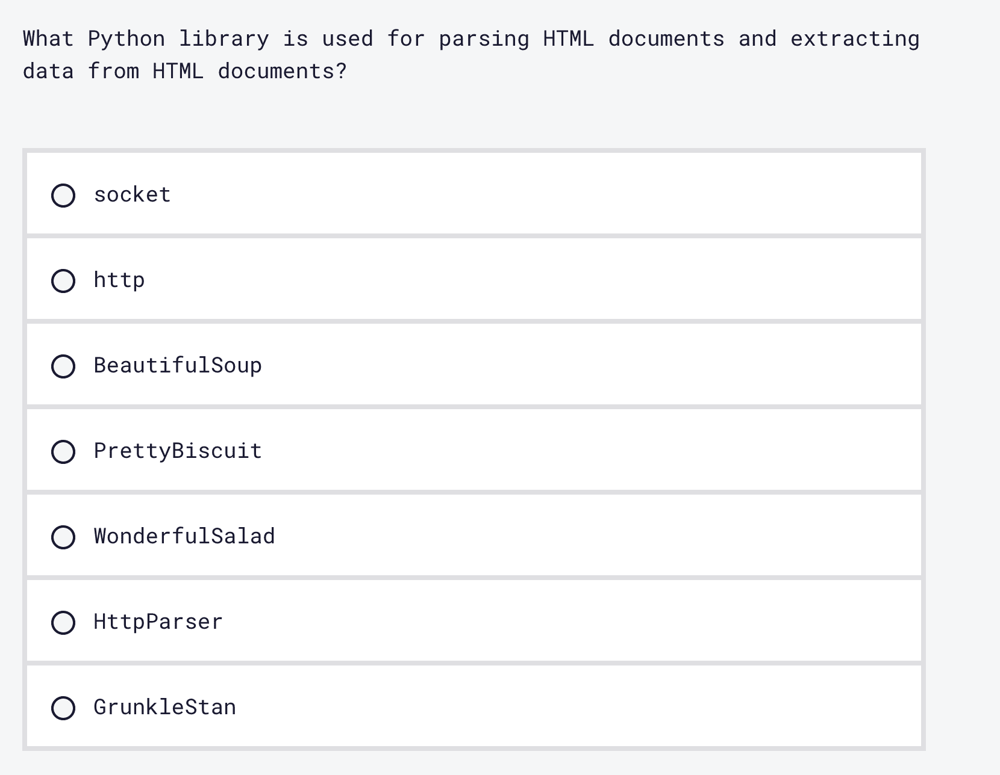

# 2022 年如何学习 Python

> 原文：<https://www.freecodecamp.org/news/how-to-learn-python/>

随着时间的推移，Python 编程语言变得越来越流行。

根据 2021 年的[栈溢出开发者调查，Python 是第三大流行语言，紧随 JavaScript 和 HTML & CSS 之后。](https://insights.stackoverflow.com/survey/2021#technology)

而且这种增长似乎不会很快放缓，所以 Python 程序员的需求量很大。

在本文中，您将看到为什么 Python 是初学者的首选编程语言，并且您将了解如何开始学习这种语言。

我将分享一些你可以参加的有用课程的列表，以及当你陷入编码问题时如何获得帮助的技巧。

以下是我们将在本指南中介绍的内容:

1.  [什么是 Python 编程语言？](#intro)
    1.  [为什么要学 Python？](#why)
    2.  [Python 2 vs Python 3](#differences)
    3.  [如何安装 Python 并搭建开发环境](#setup)
2.  [Python 课程](#courses)
    1.  [Python 项目教程——你的第一个 Python 项目](#first-project)
    2.  [Python 初学者教程](#beginners)
    3.  [Python 给大家看](#everybody)
    4.  [使用 OOP 的 Python 游戏开发项目——扫雷教程(w/ Tkinter)](#oop)
    5.  [Python 后端 Web 开发课程(与 Django 一起)](#django)
    6.  [中级 Python 编程课程](#intermediate)
    7.  [西班牙语 Python 简介](#spanish)
3.  [陷入困境时如何寻求帮助](#help)

## Python 编程语言是什么？

Python 由荷兰程序员吉多·范·罗苏姆设计，并于 1991 年 2 月 20 日首次发布。

Python 软件基金会是一个美国非营利组织，自 2001 年以来一直负责促进、推动和培养这种语言的发展。

当您想到 Python 这个词时，脑海中可能会浮现出一条蛇的形象。

但 Python 编程语言的名字是受 BBC 一部名为“蒙蒂·Python 的飞行马戏团”的喜剧系列的启发，该系列在 20 世纪 70 年代很受欢迎。

Python 是一种通用语言，在科技领域的很多领域都有使用。

当处理大量数据时，它是一种流行的语言，因此它经常用于机器学习和数据科学，以及数据分析和数据处理。

它也是网络抓取的首选语言。Web 抓取是一种从 web 中提取、收集和处理大量原始数据的自动化技术。

您还可以使用 Python 进行 web 开发，借助 Django 和 Flask 等框架创建功能强大的 web 应用程序。

此外，Python 是测试自动化的流行语言。

您可以依靠自动化工具、Python 库和 Python 脚本来完成工作，而不是手动为您的程序编写所有测试。

### 为什么要选择学习 Python？

当您第一次开始学习编码时，您可能会很快被大量可供学习的编程语言所淹没。

那么，为什么要选择学习 Python 而不是另一门语言呢？

首先，所有的编程语言都是工具，它们本质上都是给出指令——它们告诉计算机做什么，需要执行什么任务。

它们都有一些共同的概念和范例，所以当你对其中一个有了很好的了解后，再去学习另一个就更容易了。

也就是说，Python 是代码新手的首选编程语言有几个原因。

首先，Python 是一种**高级**服务器端脚本编程语言。

在计算领域，有两种编程语言。编程语言有低级的，也有高级的。

高级编程语言意味着在语言和以二进制编写的计算机机器指令之间有许多抽象和分离。二进制是由`1`和`0`组成的数字系统。

高级语言有一种更容易阅读、学习、掌握和编写的语法，因为这种语法对人友好，并且类似于英语。

Python 语法更简洁，不那么冗长。您可以通过编写少得多的代码来实现某些目标。

例如，下面是如何用 C++编写一个“Hello World”程序:

```
#include <iostream>

using namespace std;

int main()
{
   cout<<"Hello World!";

   return 0;
} 
```

下面是你如何用 Python 写一个“Hello World”程序:

```
print("Hello World") 
```

实现同样的事情需要更少的代码行——比如在控制台上打印“Hello World”。

更不用说它更容易阅读，也更简单明了，对吗？

Python 是一种开源语言，这意味着它可供每个人使用和免费分发。

我们也鼓励你为 it 做出贡献，成为一个大社区的一员。

### Python 2 vs Python 3——有什么区别？

当你刚开始学习 Python 的时候，你可能会碰到 Python 2 和 Python 3，可能会对两者的区别感到困惑。

多年来，Python 已经发展成为一种语言。

它经历了不断的改进、错误修复以及新的和改进的特性的更新。

Python 2 的最后一个版本 Python 2.7 不再被维护和支持。不会有未来的更新，比如安全问题的更新。

所以，Python 2 已经过时，不再使用了。

当你开始作为一名 Python 开发人员工作时，你可能会遇到一些带有 Python 2 代码的旧代码库。

然而，这个版本的语言不应该让你担心——尤其是作为一个初学者。

Python 3 是 Python 的最新版本。它是为了修复 Python 2 中的一些问题而创建的。

它引入的许多变化和新特性与 Python 2 不兼容。

在编程中，这被称为*向后不兼容*。

两个版本在语法上有很大的不同。

一个显著的区别是当您想要将某些内容打印到控制台时:

```
#print is a statement in Python 2
print "Hello World"

#print() is a function in Python 3
# parentheses were introduced

print("Hello World") 
```

总而言之，当前可维护的标准是 Python 3，如果有疑问，这是您应该关注的 Python 版本。

### 如何安装 Python 并搭建开发环境

您首先需要在本地机器上安装 Python。

具体来说，您需要安装 Python 解释器。Python 解释器是一个软件程序。

当你在扩展名为`.py`的文件中编写 Python 代码时，你需要一个程序将你的 Python 代码翻译成计算机能理解的语言。

这个充当翻译器的程序就是 Python 解释器。

默认情况下，一些操作系统已经安装了 Python 解释器。

比如在 macOS 上，安装 Python 2.x 版本。

你可以通过打开一个新的终端窗口来检查(输入快捷键`Command Space`并键入 Terminal.app，然后点击出现的第一个选项)。

一旦进入终端，键入`python -v`，其中`-v`参数代表`version`。

您将看到系统上已经有了默认的 2.x 版本。

然而，你不**也不**想使用这个版本，因为它已经过时了(我们在上面讨论过)。

无论您的操作系统是什么，您都可以下载 Python 解释器，但是不同的操作系统下载和安装 Python 的步骤会有所不同。

此时，学习用 Python 创建虚拟环境也很有帮助。

这对您未来的项目很有用，尤其是当您使用第三方包时。

虚拟环境为您的每个项目创建一个独立的空间，这意味着您可以创建多个虚拟环境。

这将确保安装在一个项目中的包的依赖关系不会干扰您的其他项目。

以下是在本地机器上安装 Python 以及学习更多虚拟环境知识的资源列表:

*   [如何在 Windows 上安装 Python](https://www.freecodecamp.org/news/how-to-install-python-in-windows-operating-system/)
*   [如何在 Mac 上安装 Python 3 并用 Pyenv-Mac OS home brew 命令指南更新版本](https://www.freecodecamp.org/news/how-to-install-python-3-on-mac-and-update-the-python-version-macos-homebrew-command-guide/)
*   [Python 虚拟环境举例说明](https://www.freecodecamp.org/news/python-virtual-environments-explained-with-examples/)
*   [如何用 Python 建立虚拟环境——以及它为什么有用](https://www.freecodecamp.org/news/how-to-setup-virtual-environments-in-python/)

前面我提到过在扩展名为`.py`的文件中编写 Python 代码。

但是你到底在哪里写 Python 代码呢？在 IDE(集成开发环境)中。

一些有用的 IDE 功能如下:

*   用于编写和编辑源代码的代码编辑器(源代码是用人类可读编程语言如 Python 编写的代码的另一种说法)，
*   语法突出显示(使代码更容易阅读)、代码提示和自动完成，
*   用于运行命令的内置终端，
*   调试和测试工具。

本质上，一个 IDE 拥有提高程序员生产率的所有必要工具，所有这些都在同一个屋檐下，[有许多用于编写 Python 代码的 IDE 可供选择](https://www.freecodecamp.org/news/python-ide-best-ides-and-editors-for-python/)。

个人觉得，刚开始学 Python 的时候，发现用 Visual Studio 代码写 Python 代码是一种愉快的体验。

Visual Studio Code 是一个免费的开源代码编辑器，具有类似 IDE 的强大功能，并支持使用 Python。[通过阅读有用的文档](https://code.visualstudio.com/docs/python/python-tutorial)，你可以了解更多关于开始用 Visual Studio 代码编写 Python 的信息

## Python 课程

freeCodeCamp 的使命是为世界各地的人们免费创造高质量的教育资源。

在 [freeCodeCamp 的 YouTube 频道](https://www.youtube.com/channel/UC8butISFwT-Wl7EV0hUK0BQ)上，你会找到数千小时的各种编程主题的教育内容。

下面是一些视频课程建议，帮助你作为一个完全的初学者开始学习 Python。

### Python 项目教程——你的第一个 Python 项目

[这个一小时的视频课程](https://www.youtube.com/watch?v=_ZqAVck-WeM)，由 Tech with Tim 创建，对于创建您的第一个 Python 项目和学习该语言的基础非常有用。

边玩游戏边学习是理解基本概念的一种有趣方式。

在本课程中，您也不需要设置环境，因为它使用浏览器内编辑器 [Repl.it](http://repl.it/) ，所以您可以立即开始编码。

### Python 初学者教程

在这个由资深软件工程师鲍比·斯特曼创建的 3 小时课程中，你将学习 Python 的基础知识。

本课程假定您之前没有任何知识，因为它将引导您完成编写 Python 和在本地计算机上创建虚拟环境的过程的安装和设置。

您还将学习 Python 的基本数据类型，如字符串和数字，然后继续学习更高级的类型，如元组、字典和集合，仅举几个主题。

### Python 适合所有人

这是由密歇根大学信息学院的临床教授查克博士创建的 14 小时课程。

在本课程中，您将学习 Python 的绝对基础和更高级的主题，如 OOP(面向对象编程的缩写)。

freeCodeCamp 也提供这门课程作为其可用的认证之一。

在[通过 Python 认证的科学计算](https://www.freecodecamp.org/learn/scientific-computing-with-python/)中，上面的视频课程被分解为更小的部分。

每个部分都有一个视频，并附有后续材料和要完成的练习。

看完视频，有一道选择题要回答。



这是练习主动回忆的好方法，一种有效的学习技巧。

为了练习主动回忆，你可以阅读或观看一些东西，一旦你完成了阅读/观看，你就可以检索到你所学的关键概念——你实际上是在对你刚刚消费的信息进行自我测试。

通过 Python 认证的[科学计算](https://www.freecodecamp.org/learn/scientific-computing-with-python/)也有 5 个练习项目要完成，在那里你可以通过将新技能付诸实践来巩固你的知识。

### 使用 OOP 的 Python 游戏开发项目——扫雷教程(w/ Tkinter)

在这个由 JimShapedCoding 的 Jim 创建的 3 小时课程中，您将使用 tkinter 库构建一个扫雷游戏。

一旦你理解了 Python 的基础知识，并且想要构建一个实现面向对象编程的项目，这个课程对你来说是完美的。

### Python 后端 Web 开发课程(与 Django 一起)

前面我提到过，在 Django web 框架的帮助下，Python 是 web 开发的流行选择。

在这个由孙铁麟·托克创建的 10 小时课程中，除了学习 Python 的基础知识，你还将学习如何使用 Python 和 Django 创建 web 应用程序。

### 中级 Python 编程教程

一旦你掌握了前面课程的基础知识，并构建了几个简单的项目，你可能不确定如何在现有技能的基础上继续前进。

在 Patrick Loeber 创建的这个 6 小时的课程中，您将更深入地学习 Python 编程语言，涵盖 Lambda 函数、多线程、多处理、异常和错误等主题。

### 西班牙语 Python 简介

最后，如果你是说西班牙语的人，或者有一个说西班牙语的朋友/家庭成员想要学习 Python，这是一个用西班牙语学习 Python 的很好的课程。

[这是由 freeCodeCamp 工作人员 Estefania Cassingena Navone 创建的视频课程](https://www.youtube.com/watch?v=DLikpfc64cA)，时长超过 4 小时。

借助详细的视觉效果和透彻的解释，你将学会绝对的基础知识。

## 当你陷入困境时如何寻求帮助

当你是一个初学编码的人时，在你的学习之旅中不可避免地会面临挑战和障碍。

当你发现自己处于这样的境地时，最好的办法就是依靠一个社区。

免费代码营论坛是一个支持和友好的社区，将帮助你摆脱困境。

例如，如果你在 freeCodeCamp 的 YouTube 视频中有什么不明白的地方，或者你在 Python 认证的[科学计算中遇到了困难，请不要犹豫，提出问题。](https://www.freecodecamp.org/learn/scientific-computing-with-python/)

在此之前，请务必[学习如何在论坛](https://www.freecodecamp.org/news/how-to-ask-a-question-on-a-forum/)上提出好的问题，以确保你提出了正确的问题，这将有助于解决你面临的问题。

此外，论坛是一个与其他开发者互动的好地方。它可以帮助你开始构建你的网络，并通过阅读来自社区成员的鼓舞人心的故事来保持动力，这些社区成员使用 freeCodeCamp 学习编码并获得了很好的开发人员工作。

最后，在学习 Python 时，如果你想了解更多，深入某个特定的主题，你可以依靠 [freeCodeCamp 出版物](https://www.freecodecamp.org/news/)。

社区中有超过 8000 篇关于编程和技术主题的深入文章。

所以，假设你正在学习 Python 列表，但是不太理解`.append()`方法。

使用网页版时，你会在左上角看到一个搜索栏。

然后你可以输入`.append() python`，你会看到几篇文章的结果，帮助你了解更多。

## 结论

这篇文章到此结束，非常感谢你坚持到最后！

希望这篇指南是有帮助的，它不仅给了你一些为什么你应该考虑学习 Python 的见解，也给了你一些如何在 2022 年学习这门语言的见解。

编码快乐！