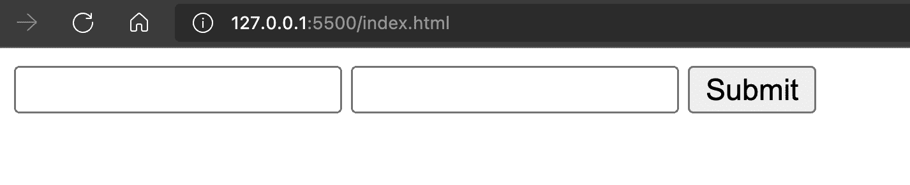
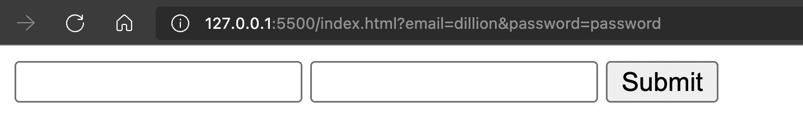
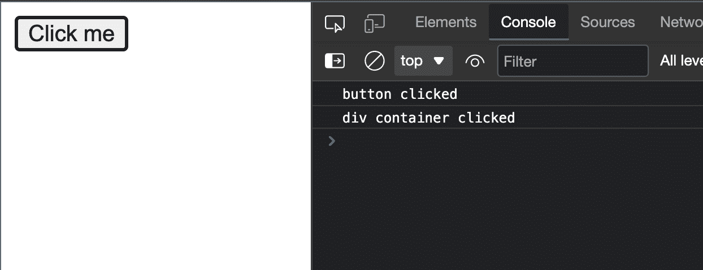
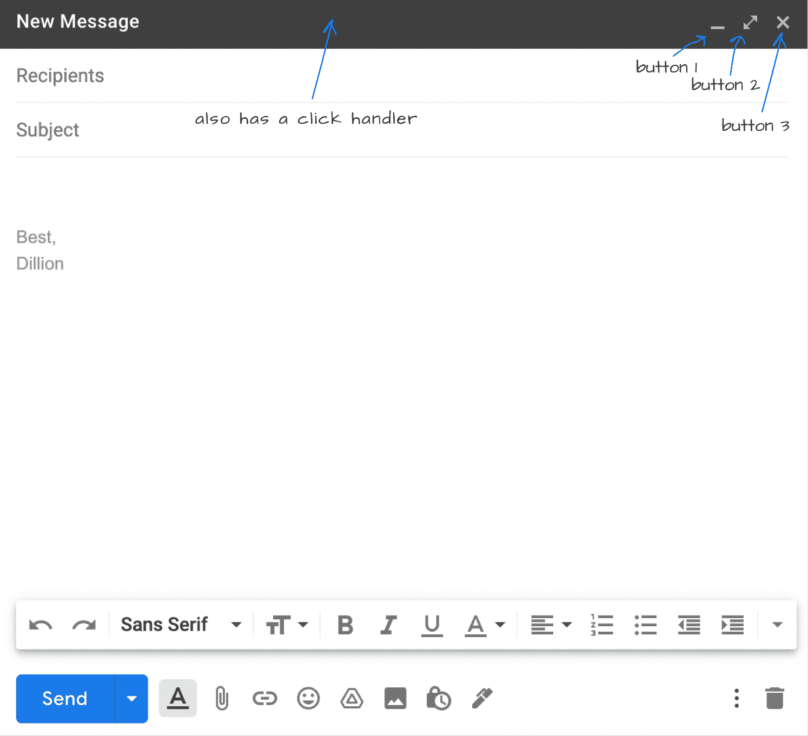
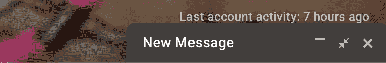

# 如何用 event.preventDefault()和 event.stopPropagation()管理浏览器默认值

> 原文：<https://www.freecodecamp.org/news/manage-default-behavior-in-browser/>

浏览器对不同的事件有默认的交互和行为。

例如，当用户点击表单上的“提交”按钮时，默认情况下表单会被提交到一个 URL。

当单击元素的子元素时，click 事件也会在该元素上发生，因为它是主容器。

在某些情况下，您可能希望覆盖这些默认值。在本文中，我们将了解什么是`event.preventDefault()`和`event.stopPropagation()`方法，以及如何使用它们来取消浏览器中发生的一些默认操作。

## event.preventDefault()

此方法防止浏览器在事件被触发时执行默认操作。

这里有一些网页上默认操作的例子，以及如何用`event.preventDefault()`覆盖它们。

### 如何覆盖默认表单提交

当用户提交表单时(单击了 submit 按钮)，表单的默认动作是将表单数据提交到处理数据的 URL。

表单元素有`action`和`method`属性，分别指定提交表单的 URL 和请求的类型(`get`、`post`等等)。

如果没有提供这些属性，默认的 URL 是提交表单的当前 URL，方法是`get`。

例如，这段代码:

```
<form>
  <input name="email" />
  <input name="password" />
  <input type="submit" />
</form> 
```

生成此页面:



在提交输入“dillion”和“password”的表单时，您可以看到一个提交给`127.0.0.1:5500/index.html`的`get`请求，如下所示:



这个动作是浏览器默认处理表单的方式。

但是在发送请求之前，您可能想对数据做更多的事情。这在当今处理表单的方法中尤其常见。

在向 URL 发送请求之前，您可能需要进行一些数据验证、数据检查、处理、配置头等操作。

在这些情况下，您会希望阻止表单的默认操作。方法如下:

```
<form id='form'>
  ...
</form> 
```

```
const form = document.getElementById('form')

form.addEventListener('submit', (event) => {
  event.preventDefault()

  // process data and submit a request manually
}) 
```

这样，提交表单就在你的手中了。

### 单击链接时如何覆盖默认操作

当您单击一个链接(一个带有`href`属性的锚标签`a`)时，默认的动作是在浏览器上导航到所单击的链接。

如果你想拦截这个动作，并在导航之前做些什么呢？例如，检查用户是否有权访问他们想要导航到的页面。你可以这样做:

```
<a id="link" href="https://google.com">Google</a> 
```

```
const link = document.getElementById("link")

link.addEventListener("click", event => {
  event.preventDefault()

  // do something and navigate
}) 
```

你可以测试一下。当你点击“Google”链接时，没有导航出现——因为你已经阻止了默认的导航操作。现在，你必须自己处理导航。

## event.stopPropagation()

传播是传播某物的行为，在这里指的是事件。当一个事件在一个元素上被触发时，`stopPropagation`方法用于防止事件的传播。

在 JavaScript 中，当您触发元素上的事件时，它会沿着树向上冒泡到该元素的父元素和祖先元素。基本上，带有事件的元素在父容器的“内部”,所以父容器也接收事件。

为了更好地解释这一点，我将使用一个示例。

### 单击元素的子元素

假设您有以下元素:

```
<div>
  <button>Click me</button>
</div> 
```

当你点击`button`时，你也点击了`div`容器，因为按钮在容器中。这个逻辑意味着点击事件从按钮传播到容器，并且该事件一直传播到所有的祖父母，直到它到达根。

为了验证这一点，我将用下面的代码解释它是如何工作的:

```
<div id="div">
  <button id="button">Click me</button>
</div> 
```

```
const div = document.getElementById('div')
const button = document.getElementById('button')

button.addEventListener('click', () => {
  console.log('button clicked')
})

div.addEventListener('click', () => {
  console.log('div container clicked')
}) 
```

当您尝试在浏览器上运行此程序并单击按钮时，将会得到以下结果:



`div`容器也接收 click 事件，所以 click 回调函数也被调用。

事件传播是事件和元素的默认行为，但是在某些情况下，您可能不需要某些行为。在许多例子中，这里有一个。

这是 Gmail 新邮件弹出窗口:



在顶部，你有三个动作按钮。一个最小化弹出窗口，一个全屏显示弹出窗口，一个关闭弹出窗口。

但是带有“新消息”文本的顶部栏也有一个点击处理程序，所以当它被点击时，它会最小化弹出窗口:



这里您需要避免的一件事是，在单击任何按钮时，您不希望 click 事件传播到顶栏并执行该事件的功能。我的意思是，例如，在点击关闭按钮时，你不希望顶栏也最小化。

在这种情况下，您需要停止传播。

假设弹出窗口是这样构建的:

```
<div id='top-bar'>
  <!-- The Message Element -->
  <!-- The Buttons -->
</div> 
```

```
const topBar = document.getElementById('top-bar')
const closeButton = document.getElementById('close-btn')

topBar.addEventListener('click', () => {
  // minimize or maximize popup
})

closeButton.addEventListener('click', () => {
  // close popup
}) 
```

您还需要将`stopPropagation`方法添加到按钮的侦听器中，以避免将事件传播到顶栏。为此，您需要将按钮的侦听器更新为:

```
closeButton.addEventListener('click', (event) => {
  event.stopPropagation()
  // close popup
}) 
```

这样，当顶部的工具条被直接点击时，它将只接收点击事件。

## 包扎

`event.preventDefault()`和`event.stopPropagation()`的区别在于，前者阻止浏览器做出的默认动作，而后者阻止事件的默认行为——沿树向上传播。

这些默认的动作和行为不是错误，在编码时您不必担心它们。但是有些情况下，您希望覆盖它们，正如我们在本文的示例中看到的那样。