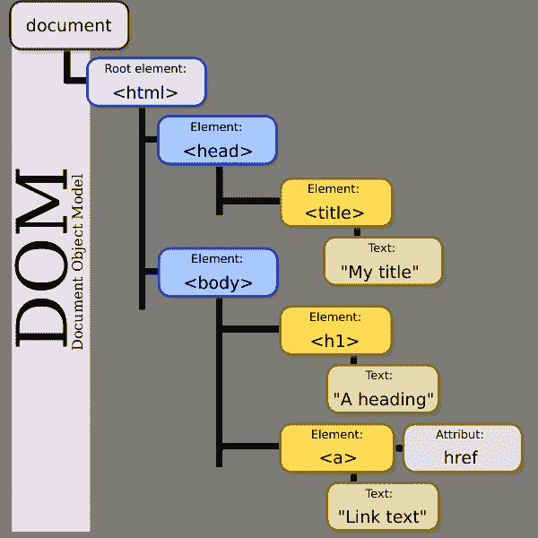
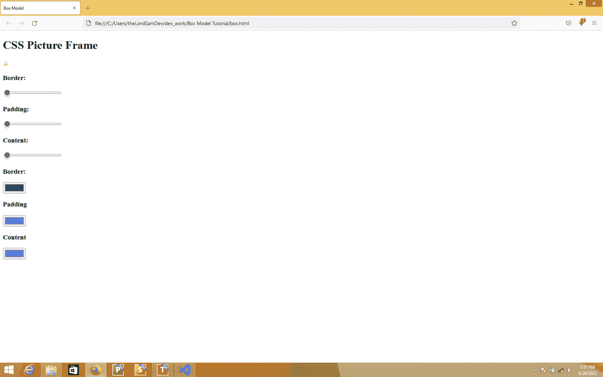
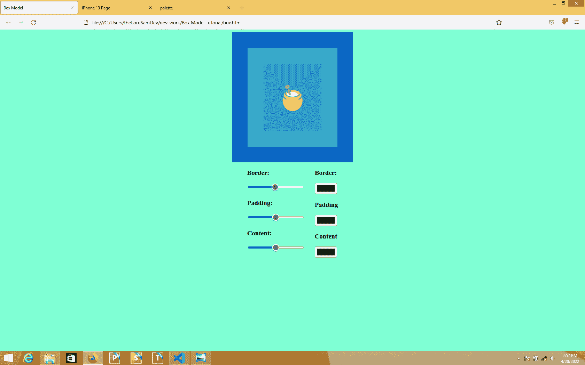
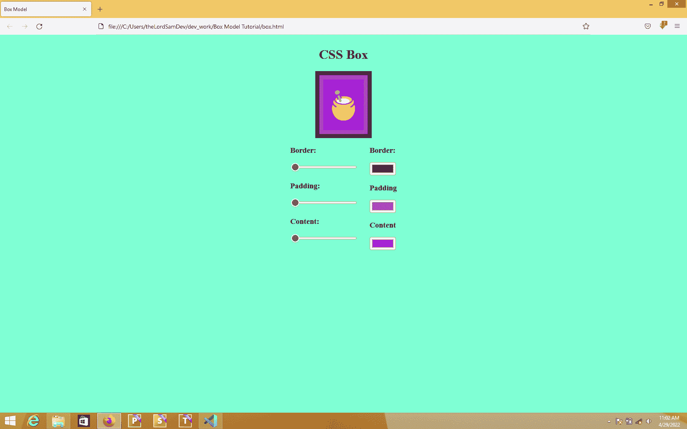
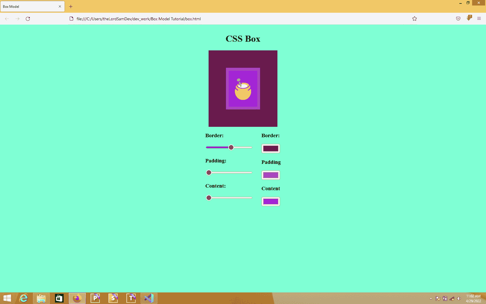
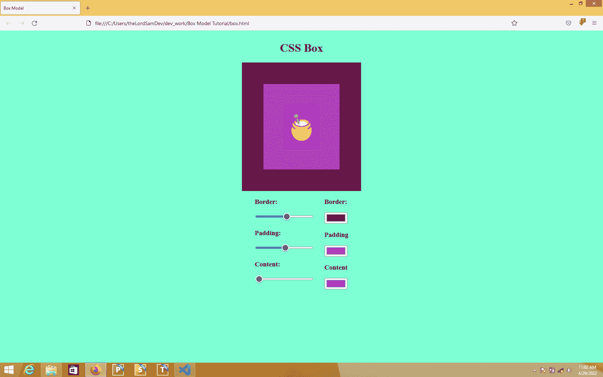
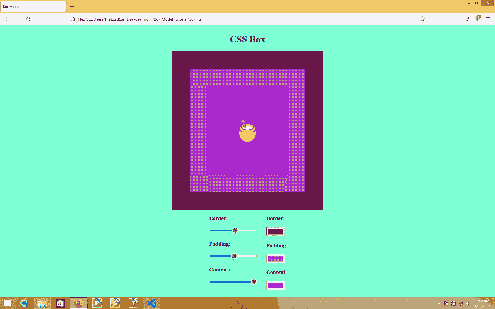
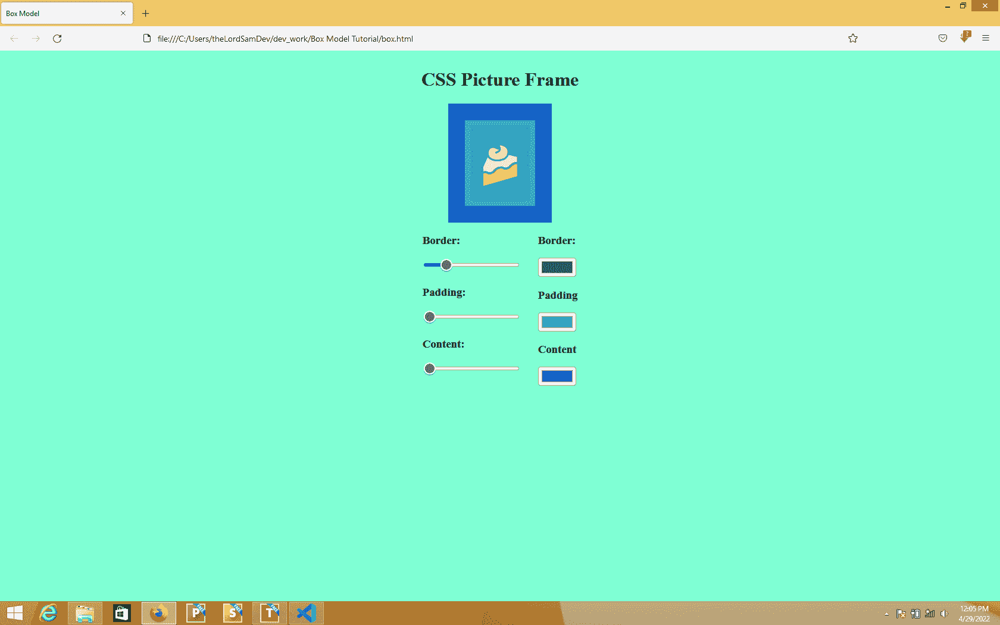

# 通过编写一个动态图片框架，学习如何用 JavaScript 操作 CSS

> 原文：<https://www.freecodecamp.org/news/learn-how-to-manipulate-css-with-javascript-by-coding-a-dynamic-picture-frame/>

DOM 操纵可以简单地定义为用 JavaScript 操纵 HTML 文档(或页面)。

DOM 代表文档对象模型，您可以将其可视化为由不同 HTML 元素组成的树状结构。

将 HTML 文档可视化为一棵树，可以很容易地访问它的元素，并有可能更改它们。JavaScript 帮助我们做到了这一点。



The DOM visualized as a tree

现在，JavaScript 是一种强大的语言，所以我们不仅可以用它来操纵 HTML 元素，还可以用它来操纵任何网页的 CSS 属性。

在本教程中，我将教你如何通过构建一个简单的项目来操作网页的样式。

在这个项目中，我们将使用 HTML 和 CSS 编码一个图片框架，然后我们将使用 JavaScript 使图片框架动态。听起来很有趣？我们开始吧！

## 如何创建 HTML 文件

为这个项目创建一个文件夹，并随意命名。然后在您喜欢的代码编辑器中导航到该文件夹，并创建一个新的 HTML 文件。我给我的取名为`box.html`，但是你可以给你的取名为任何你喜欢的名字。

接下来，[通过按感叹号和回车键生成一个 HTML5 样板文件](https://www.freecodecamp.org/news/html-starter-template-a-basic-html5-boilerplate-for-index-html/)。

在 body 标记中，创建一个 h1 标记，并在其中键入该项目的标题。在我的例子中，我是这样做的:

`<h1>CSS Picture Frame</h1>`

接下来，创建一个 div 并给它一个类“border ”,如下所示:

`<div class = “border”></div>`

在这个 div 中，创建另一个 div，并给它一个“填充”类，如下所示:

`<div class = “padding”></div>`

在“填充”div 中，创建另一个 div，并给它一个“内容”类，如下所示:

`<div class = “content”></div>`

现在，这个“内容”div 就是图片所在的位置。你可以选择使用图片或表情符号。我选择使用表情符号，所以我做了这样的事情:

`<div class = “content”>&#127856;</div>`

到目前为止，我们已经创建了三个 div。总的来说，它们应该是这样的:

```
<div class="border">
   <div class="padding">
       <div class="content">
            &#127856;
                </div>
           </div>
       </div
```

在上面代码的正下方，创建一个新的 div，并给它一个 Id“inputs ”,如下所示:

`<div id = “inputs”></div>`

在这个“inputs”div 中创建另一个 Id 为“sliders”的 div，因为我们将在其中创建滑块。

要在 HTML 中创建一个滑块，只需像这样做:

`<input type="range" name="" id=""  min="10" max="100">`

`<input type = "range">`创建一个滑块输入，`min`和`max`属性用于指定滑块可以拥有的最小值和最大值。在这种情况下，最小值为 10，最大值为 100。

对于这个项目，我们需要 3 个滑块，一个用于“边框”，一个用于“填充”，一个用于“内容”。给每个滑块一个有意义的 Id，或者你可以像我一样做:

```
<div id="sliders">
<h3>Border: </h3>
<input type="range" name="" id="border-range"  min="10" max="100">
<h3>Padding: </h3>
<input type="range" name="" id="padding-range" min="10" max="100">
<h3>Content: </h3>
<input type="range" name="" id="content-range" min="10" max="100">
</div>
```

在“sliders”div 下面创建一个新的 div，并给它一个 Id“colors ”,如下所示:

`<div id = “colors”></div>`

因为我们将在这个 div 中创建颜色选择器。您可以通过以下方式创建颜色拾取器:

`<input type="color" name="" id="">`

我们还需要这个项目的 3 个颜色选择器，分别为“边框”，“填充”和“内容”分区各一个。因此，继续在“colors”div 中创建三个颜色选择器。您的代码应该如下所示:

```
<div id="colors">
<h3>Border:</h3>
<input type="color" name="" id="border-color">
<h3>Padding</h3>
<input type="color" name="" id="padding-color">
<h3>Content</h3>
<input type="color" name="" id="content-color">
</div>
```

当您在浏览器中查看您的页面时，您应该会看到类似下面截图的结果:



下一步是链接 CSS 和 JavaScript 文件。如果您还没有，您应该创建一个 CSS 和 JS 文件，并将它们链接到您的 HTML。在我的例子中，我创建了一个`box.css`和一个`box.js`文件。不要忘记:

*   用下面的代码将你的 CSS 文件链接到你的 HTML 的 head 标签中:`<link rel="stylesheet" href="box.css">`
*   将 JS 文件链接到代码最底部的 body 标记中，紧靠最后一个结束 div 的下面和结束 body 标记的上面，如下所示:`<script src="box.js"></script>`

如果你成功做到了，恭喜你！本教程的 HTML 部分现在已经完成。以下是完整的 HTML 代码:

```
<!DOCTYPE html>
<html lang="en">
<head>
    <meta charset="UTF-8">
    <meta http-equiv="X-UA-Compatible" content="IE=edge">
    <meta name="viewport" content="width=device-width, initial-scale=1.0">
    <title>Box Model</title>
    <link rel="stylesheet" href="box.css">
</head>
<body>
    <h1>CSS Picture Frame</h1>
        <div class="border">
            <div class="padding">
                <div class="content">
                    &#127856;
                </div>
            </div>
        </div>

        <div id="inputs">
        <div id="sliders">
            <h3>Border: </h3>
            <input type="range" name="" id="border-range"  min="10" max="100">
            <h3>Padding: </h3>
            <input type="range" name="" id="padding-range" min="10" max="100">
            <h3>Content: </h3>
            <input type="range" name="" id="content-range" min="10" max="100"> 
        </div>

            <div id="colors">
                <h3>Border:</h3>
                <input type="color" name="" id="border-color">
                <h3>Padding</h3>
                <input type="color" name="" id="padding-color">
                <h3>Content</h3>
                <input type="color" name="" id="content-color">
            </div>
        </div>
        <script src="box.js"></script>
</body>
</html>
```

## 如何用 CSS 设计网页样式

打开您创建的 CSS 文件，并添加以下代码:

```
body{
display: flex;
align-items: center;
justify-content: center;
background-color: aquamarine;
flex-direction: column;
}
.border{
background-color: #0b67c4;
padding: 45px;
}
.padding{
background-color: #42b3dd;
padding: 45px;
}
.content{
background-color: #299baf;
padding: 45px;
font-size: 78px;
}
#inputs{
display: flex;
flex-direction: row;
}
#sliders{
margin-right: 30px;
}
```

注意:只有当你使用了我在 HTML 中使用的相同的 id 和类时，这种样式才会起作用。

现在，让我们来关注一下`.border`、`.padding`和`.content`风格。你会注意到，除了`.content`，他们都有两个规则，即:`background-color`和`padding`。我们将在 JavaScript 代码中操作这两条规则。

还记得我们在 HTML 代码中创建的滑块和颜色选择器吗？我们将使用滑块分别操作`.border`、`.padding`和`.content`的填充属性。我们将使用颜色选择器来改变每个 div 的`background-color`属性。

当你刷新浏览器时，你应该会看到类似下面的截图:


## 如何编写 JavaScript

这个项目的 JS 代码可以分为三个部分。首先，我们获取滑块和颜色选择器的 id，并将它们存储在变量中。接下来，我们得到“边框”、“填充”和“内容”div 的类，并将它们存储在变量中。最后，我们将事件监听器附加到变量上。

因为我们希望滑块改变 div 的填充属性，颜色选择器改变它们的背景颜色，所以我们使用 change 事件侦听器来实现这一点。

现在是编码的时候了。首先，像这样获取滑块的 id，并将它们存储在变量中(记住 HTML 代码中使用的 id 名称。):

```
let borderRange = document.getElementById("border-range")
let paddingRange = document.getElementById("padding-range")
let contentRange = document.getElementById("content-range")
```

接下来，获取颜色选择器的 id，并将它们存储在变量中，如下所示:

```
let borderColor = document.getElementById("border-color")
let paddingColor = document.getElementById("padding-color")
let contentColor = document.getElementById("content-color")
```

现在使用`querySelector`获得边框、填充和内容分割的类，如下所示:

```
let borderBox = document.querySelector(".border")
let paddingBox = document.querySelector(".padding")
let contentBox = document.querySelector(".content")
```

之后的下一步是将事件侦听器附加到每个滑块和颜色选择器。要使第一个滑块更改边框 div 的 CSS padding 属性，我们只需使用以下代码:

```
borderRange.addEventListener("change", function(){
borderBox.style.padding = borderRange.value + "px"
})
```

让我解释一下:更改事件监听器监听滑块中的更改。代码`borderBox.style.padding`用于定位 borderBox 的填充属性。

`borderRange.value`获取滑块的值，`+  “px”`将 px 加到这个值上。将`borderBox.style.padding`等同于`borderRange.value + “px”`是一种告诉我们的代码在我们移动滑块时将 borderBox 的 padding 属性更改为 borderRange 以像素为单位输入的任何值的方式(也就是说，change 事件被触发)。

对填充部分和内容部分进行同样的操作，如下所示:

```
paddingRange.addEventListener("change", function(){
paddingBox.style.padding = paddingRange.value + "px"
})
contentRange.addEventListener("change", function(){
contentBox.style.padding = contentRange.value + "px"
})
```

完成此操作后，使用相同的原理将事件侦听器连接到颜色选择器，只是在这种情况下，颜色值是十六进制的，因此我们不需要向它们添加任何单位。

我们不是以填充属性为目标，而是以`backgroundColor`属性为目标。(注意:JS 中背景色的语法是驼色的。)

您的代码应该如下所示:

```
borderColor.addEventListener("change", function(){
borderBox.style.backgroundColor = borderColor.value
})
paddingColor.addEventListener("change", function(){
paddingBox.style.backgroundColor = paddingColor.value
})
contentColor.addEventListener("change", function(){
contentBox.style.backgroundColor = contentColor.value
})
```

现在，当您刷新浏览器时，您应该能够使用滑块和颜色选择器来更改框的大小和颜色。使用这段代码，你可以创建不同大小和颜色的图片框架。



以下是完整的 JS 代码:

```
let borderRange = document.getElementById("border-range")

let paddingRange = document.getElementById("padding-range")

let contentRange = document.getElementById("content-range")

let borderColor = document.getElementById("border-color")

let paddingColor = document.getElementById("padding-color")

let contentColor = document.getElementById("content-color")

let borderBox = document.querySelector(".border")

let paddingBox = document.querySelector(".padding")

let contentBox = document.querySelector(".content")

borderRange.addEventListener("change", function(){
    borderBox.style.padding = borderRange.value + "px"
    console.log(borderRange.value)

})

paddingRange.addEventListener("change", function(){
    paddingBox.style.padding = paddingRange.value + "px"
    console.log(paddingRange.value)

})

contentRange.addEventListener("change", function(){
    contentBox.style.padding = contentRange.value + "px"
    console.log(contentRange.value)
})

borderColor.addEventListener("change", function(){
    borderBox.style.backgroundColor = borderColor.value
})

paddingColor.addEventListener("change", function(){
    paddingBox.style.backgroundColor = paddingColor.value
})

contentColor.addEventListener("change", function(){
    contentBox.style.backgroundColor = contentColor.value
})
```

## 结论

您不仅可以使用 JavaScript 的 DOM 操纵技术来操纵 HTML 文件，还可以操纵其样式。

这些知识的应用只受你想象力的限制。你可以用这种技术创造 CSS 艺术和效果，只需要一点创造力。

你可以在 https://www.twitter.com/lordsamdev 的推特上和我联系。我在推特上发布我正在工作的新想法和项目。我也很想看看你按照这个教程做了些什么。

感谢阅读。