# REST API 设计最佳实践手册——如何用 JavaScript、Node.js 和 Express.js 构建 REST API

> 原文：<https://www.freecodecamp.org/news/rest-api-design-best-practices-build-a-rest-api/>

在过去的几年里，我创建并使用了许多 API。在那段时间里，我遇到过好的和坏的实践，也经历过消费和构建 API 的糟糕情况。但是也有伟大的时刻。

网上有一些有用的文章，介绍了许多最佳实践，但在我看来，其中许多缺乏实用性。知道这个理论有几个例子是很好的，但是我总是想知道在一个更真实的例子中实现会是什么样子。

提供简单的例子有助于理解概念本身，而不会太复杂，但实际上事情并不总是这么简单。我很确定你知道我在说什么😁

这就是我决定写这篇教程的原因。我将所有这些经验(好的和坏的)合并到一篇容易理解的文章中，同时提供了一个可以遵循的实际例子。最后，我们将在实现一个又一个最佳实践的同时构建一个完整的 API。

在我们开始之前，需要记住几件事:

正如您可能已经猜到的那样，最佳实践不是要遵循的特定法律或规则。它们是随着时间的推移而演变并被证明是有效的惯例或技巧。有些现在已经成为标准。但这并不意味着你必须 1:1 地适应它们。

它们应该给你一个方向，让你的 API 在用户体验(对于消费者和构建者)、安全性和性能方面变得更好。

请记住，项目是不同的，需要不同的方法。可能有些情况下，你不能或不应该遵循某种惯例。所以每个工程师都必须为自己或他们的团队做出决定。

既然我们已经把那些事情都解决了，那就不多说了，让我们开始工作吧！

## 目录

*   [我们的示例项目](#our-example-project)
    *   [先决条件](#prerequisites)
    *   [架构](#architecture)
    *   [基本设置](#basic-setup)
*   [REST API 最佳实践](#rest-api-best-practices)
    *   [版本控制](#versioning)
    *   [用复数命名资源](#name-resources-in-plural)
    *   [接受并回复 JSON 格式的数据](#accept-and-respond-with-data-in-json-format)
    *   [用标准 HTTP 错误代码响应](#respond-with-standard-http-error-codes)
    *   [避免端点名称中的动词](#avoid-verbs-in-endpoint-names)
    *   [将相关资源组合在一起](#group-associated-resources-together-logical-nesting-)
    *   [整合过滤、排序&分页](#integrate-filtering-sorting-pagination)
    *   [使用数据缓存提高性能](#use-data-caching-for-performance-improvements)
    *   [良好的安全实践](#good-security-practices)
    *   [正确记录您的 API](#document-your-api-properly)
*   [结论](#conclusion)

## 我们的示例项目


Photo by [Alvaro Reyes](https://unsplash.com/@alvarordesign?utm_source=unsplash&utm_medium=referral&utm_content=creditCopyText) on [Unsplash](https://unsplash.com/s/photos/project?utm_source=unsplash&utm_medium=referral&utm_content=creditCopyText)

在我们开始在我们的示例项目中实现最佳实践之前，我想简单介绍一下我们将要构建的内容。

我们将为 CrossFit 训练应用程序构建一个 REST API。如果你不熟悉 CrossFit，它是一种健身方法和竞技运动，结合了高强度锻炼和几种运动(奥运会举重、体操等)的元素。

在我们的应用程序中，我们想要创建、读取、更新和删除 **WOD** 的(**W**orkouts**o**f**D**ay)。这将有助于我们的用户(健身房所有者)制定锻炼计划，并在一个应用程序中维护他们自己的锻炼计划。除此之外，他们还可以为每次锻炼添加一些重要的训练技巧。

我们的工作将要求我们为该应用程序设计和实现一个 API。

### 先决条件

为了跟上进度，你需要在 JavaScript、Node.js、Express.js 和后端架构方面有一些经验。像 REST 和 API 这样的术语对您来说应该不陌生，您应该对[客户机-服务器模型](https://en.wikipedia.org/wiki/Client%E2%80%93server_model)有所了解。

当然，你不必成为这些领域的专家，但是熟悉和一些经验就足够了。

如果不是所有的先决条件都适用于你，这当然不是跳过本教程的理由。这里还有很多东西需要你去学习。但是拥有这些技能会让你更容易跟上。

尽管这个 API 是用 JavaScript 和 Express 编写的，但是最佳实践并不局限于这些工具。它们也可以应用于其他编程语言或框架。

### 体系结构

如上所述，我们将使用 Express.js 作为我们的 API。我不想提出一个复杂的架构，所以我想坚持使用 **3 层架构:**

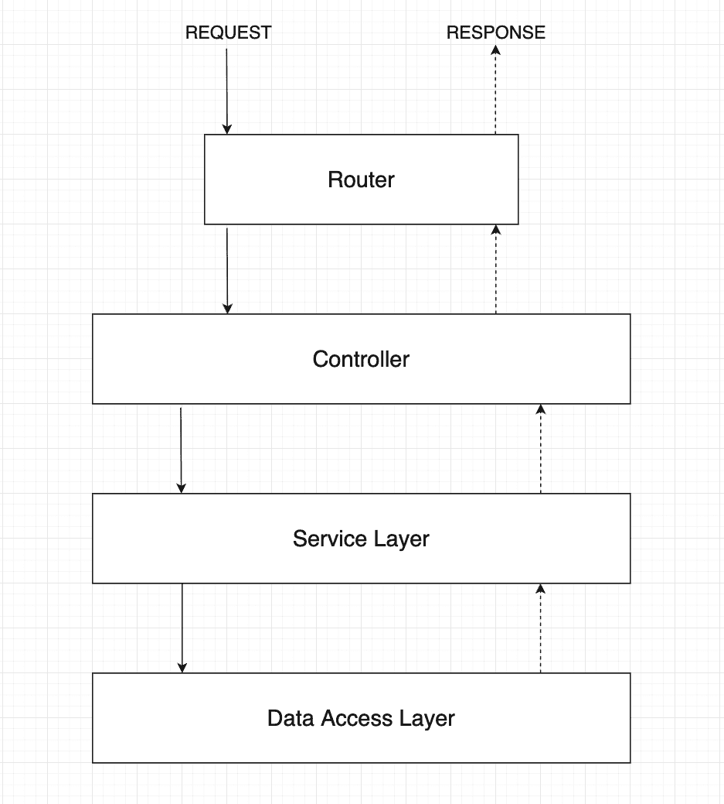

在**控制器**中，我们将处理所有与 HTTP 相关的东西。这意味着我们要处理端点的请求和响应。在这一层之上还有一个来自 Express 的小**路由器**，它将请求传递给相应的控制器。

整个业务逻辑将在**服务层**中，它导出控制器使用的某些服务(方法)。

第三层是**数据访问层**，我们将在这里处理我们的数据库。我们将为某些数据库操作导出一些方法，比如创建一个可由我们的服务层使用的 WOD。

在我们的例子中，我们没有使用真正的数据库，比如 MongoDB 或 PostgreSQL，因为我想更多地关注最佳实践本身。因此，我们使用模拟数据库的本地 JSON 文件。但是这个逻辑当然可以转移到其他数据库。

### 基本设置

现在我们应该准备好为我们的 API 创建一个基本的设置了。我们不会把事情搞得太复杂，我们会建立一个简单但有组织的项目结构。

首先，让我们创建一个包含所有必需文件和依赖项的整体文件夹结构。之后，我们将做一个快速测试来检查一切是否运行正常:

```
# Create project folder & navigate into it
mkdir crossfit-wod-api && cd crossfit-wod-api
```

```
# Create a src folder & navigate into it
mkdir src && cd src
```

```
# Create sub folders
mkdir controllers && mkdir services && mkdir database && mkdir routes
```

```
# Create an index file (entry point of our API)
touch index.js
```

```
# We're currently in the src folder, so we need to move one level up first 
cd .. 

# Create package.json file 
npm init -y
```

为基本设置安装依赖项:

```
# Dev Dependencies 
npm i -D nodemon 

# Dependencies 
npm i express
```

在您喜欢的文本编辑器中打开项目并配置 Express:

```
// In src/index.js 
const express = require("express"); 

const app = express(); 
const PORT = process.env.PORT || 3000; 

// For testing purposes 
app.get("/", (req, res) => { 
    res.send("<h2>It's Working!</h2>"); 
}); 

app.listen(PORT, () => { 
    console.log(`API is listening on port ${PORT}`); 
});
```

在 package.json 中集成一个名为**“dev”**的新脚本:

```
{
  "name": "crossfit-wod-api",
  "version": "1.0.0",
  "description": "",
  "main": "index.js",
  "scripts": {
    "dev": "nodemon src/index.js"
  },
  "keywords": [],
  "author": "",
  "license": "ISC",
  "devDependencies": {
    "nodemon": "^2.0.15"
  },
  "dependencies": {
    "express": "^4.17.3"
  }
} 
```

该脚本确保开发服务器在我们进行更改时自动重启(多亏了 nodemon)。

启动开发服务器:

```
npm run dev
```

查看您的终端，应该会有一条消息说**“API 正在监听端口 3000”**。

在浏览器中访问 **localhost:3000** 。当一切设置正确时，您应该看到以下内容:

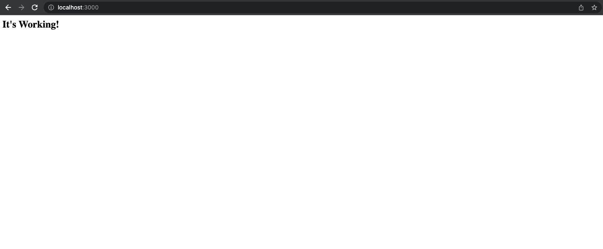

太好了！我们现在已经准备好模仿最佳实践。

## REST API 最佳实践


Photo by [Constantin Wenning](https://unsplash.com/@conniwenningsimages?utm_source=unsplash&utm_medium=referral&utm_content=creditCopyText) on [Unsplash](https://unsplash.com/s/photos/handshake?utm_source=unsplash&utm_medium=referral&utm_content=creditCopyText)

耶！现在我们已经有了一个真正基本的快速设置，我们可以用下面的最佳实践来扩展我们的 API。

让我们从简单的基本 CRUD 端点开始。之后，我们将使用每个最佳实践来扩展 API。

### 版本控制

等一下。在我们编写任何特定于 API 的代码之前，我们应该了解版本控制。就像在其他应用程序中一样，将会有改进、新特性等等。因此，对我们的 API 进行版本控制也很重要。

最大的优势是，我们可以在新版本上开发新功能或改进，而客户仍然使用当前版本，不会受到重大更改的影响。

我们也不会强迫客户马上使用新版本。他们可以使用当前版本，并在新版本稳定后自行迁移。

目前和新版本基本是并行运行，互不影响。

但是我们如何区分这些版本呢？一个好的做法是在 URL 中添加一个路径段，如 **v1** 或 **v2** 。

```
// Version 1 
"/api/v1/workouts" 

// Version 2 
"/api/v2/workouts" 

// ...
```

那是我们对外暴露的，也是其他开发者可以消费的。但是我们也需要构建我们的项目，以便区分每个版本。

有许多不同的方法来处理 Express API 中的版本控制。在我们的例子中，我想在我们的 **src** 目录中为每个版本创建一个名为 **v1** 的子文件夹。

```
mkdir src/v1
```

现在，我们将 routes 文件夹移动到新的 v1 目录中。

```
# Get the path to your current directory (copy it) 
pwd 

# Move "routes" into "v1" (insert the path from above into {pwd}) 
mv {pwd}/src/routes {pwd}/src/v1
```

新目录 **/src/v1/routes** 将存储版本 1 的所有路由。我们稍后将添加“真正的”内容。但是现在让我们添加一个简单的 **index.js** 文件来测试一下。

```
# In /src/v1/routes 
touch index.js
```

在里面我们旋转了一个简单的路由器。

```
// In src/v1/routes/index.js
const express = require("express");
const router = express.Router();

router.route("/").get((req, res) => {
  res.send(`<h2>Hello from ${req.baseUrl}</h2>`);
});

module.exports = router;
```

现在，我们必须在 src/index.js 中的根入口点内为 v1 连接路由器。

```
// In src/index.js
const express = require("express");
// *** ADD ***
const v1Router = require("./v1/routes");

const app = express();
const PORT = process.env.PORT || 3000;

// *** REMOVE ***
app.get("/", (req, res) => {
  res.send("<h2>It's Working!</h2>");
});

// *** ADD ***
app.use("/api/v1", v1Router);

app.listen(PORT, () => {
  console.log(`API is listening on port ${PORT}`);
}); 
```

现在，在您的浏览器中访问 **localhost:3000/api/v1** ，您应该会看到以下内容:


恭喜你！您刚刚构建了处理不同版本的项目。我们现在将带有“/api/v1”的传入请求传递给我们的第 1 版路由器，稍后它会将每个请求路由到相应的控制器方法。

在我们继续之前，我想指出一些事情。

我们刚刚将我们的 routes 文件夹移动到我们的 v1 目录中。控制器或服务等其他文件夹仍保留在我们的 src 目录中。目前这还可以，因为我们正在构建一个相当小的 API。我们可以在全球范围内的每个版本中使用相同的控制器和服务。

例如，当 API 不断增长并需要特定于 v2 的不同控制器方法时，将 controllers 文件夹移到 v2 目录中并封装该特定版本的所有特定逻辑将是一个更好的主意。

另一个原因可能是我们可能会更改所有其他版本都使用的服务。我们不想打破其他版本的东西。因此，将服务文件夹也移到特定的版本文件夹中是一个明智的决定。

但是正如我所说的，在我们的例子中，我可以只区分路由，让路由器处理其余的。尽管如此，重要的是要记住，当 API 扩展并需要更改时，要有一个清晰的结构。

### 用复数命名资源

设置好之后，我们现在可以开始真正实现我们的 API 了。如我所说，我想从我们的基本 CRUD 端点开始。

换句话说，让我们开始实现创建、读取、更新和删除锻炼的端点。

首先，让我们为我们的训练连接一个特定的控制器、服务和路由器。

```
touch src/controllers/workoutController.js 

touch src/services/workoutService.js 

touch src/v1/routes/workoutRoutes.js
```

我总是喜欢先从路线开始。让我们考虑如何命名我们的端点。这与这个特定的最佳实践密切相关。

我们可以将创建终点命名为 **/api/v1/workout** ，因为我们想要添加一个锻炼，对吗？这种方法基本上没什么问题——但这可能会导致误解。

永远记住:你的 API 被其他人使用，应该是精确的。这也适用于命名您的资源。

我总是把资源想象成一个盒子。在我们的例子中，盒子是存储不同的**锻炼**的集合。

用复数来命名你的资源有一个很大的优势，那就是对其他人来说这是一个由不同锻炼组成的集合。

因此，让我们在健身路由器中定义我们的端点。

```
// In src/v1/routes/workoutRoutes.js
const express = require("express");
const router = express.Router();

router.get("/", (req, res) => {
  res.send("Get all workouts");
});

router.get("/:workoutId", (req, res) => {
  res.send("Get an existing workout");
});

router.post("/", (req, res) => {
  res.send("Create a new workout");
});

router.patch("/:workoutId", (req, res) => {
  res.send("Update an existing workout");
});

router.delete("/:workoutId", (req, res) => {
  res.send("Delete an existing workout");
});

module.exports = router; 
```

你可以删除我们在 **src/v1/routes** 里面的测试文件 **index.js** 。

现在，让我们进入切入点，连接我们的 v1 健身路由器。

```
// In src/index.js
const express = require("express");
// *** REMOVE ***
const v1Router = require("./v1/routes");
// *** ADD ***
const v1WorkoutRouter = require("./v1/routes/workoutRoutes");

const app = express();
const PORT = process.env.PORT || 3000;

// *** REMOVE ***
app.use("/api/v1", v1Router);

// *** ADD ***
app.use("/api/v1/workouts", v1WorkoutRouter);

app.listen(PORT, () => {
  console.log(`API is listening on port ${PORT}`);
}); 
```

很顺利，对吧？现在，我们用 v1WorkoutRouter 捕获所有发送到**/API/v1/健身程序**的请求。

在路由器内部，我们将为每个不同的端点调用由控制器处理的不同方法。

让我们为每个端点创建一个方法。只是发送一个信息回来，现在应该没问题。

```
// In src/controllers/workoutController.js
const getAllWorkouts = (req, res) => {
  res.send("Get all workouts");
};

const getOneWorkout = (req, res) => {
  res.send("Get an existing workout");
};

const createNewWorkout = (req, res) => {
  res.send("Create a new workout");
};

const updateOneWorkout = (req, res) => {
  res.send("Update an existing workout");
};

const deleteOneWorkout = (req, res) => {
  res.send("Delete an existing workout");
};

module.exports = {
  getAllWorkouts,
  getOneWorkout,
  createNewWorkout,
  updateOneWorkout,
  deleteOneWorkout,
}; 
```

现在是时候稍微重构一下我们的训练路由器，使用控制器方法了。

```
// In src/v1/routes/workoutRoutes.js
const express = require("express");
const workoutController = require("../../controllers/workoutController");

const router = express.Router();

router.get("/", workoutController.getAllWorkouts);

router.get("/:workoutId", workoutController.getOneWorkout);

router.post("/", workoutController.createNewWorkout);

router.patch("/:workoutId", workoutController.updateOneWorkout);

router.delete("/:workoutId", workoutController.deleteOneWorkout);

module.exports = router; 
```

现在，我们可以通过在浏览器中键入**localhost:3000/API/v1/workouts/2342**来测试我们的**GET/API/v1/workouts/:workoutId**端点。您应该会看到类似这样的内容:

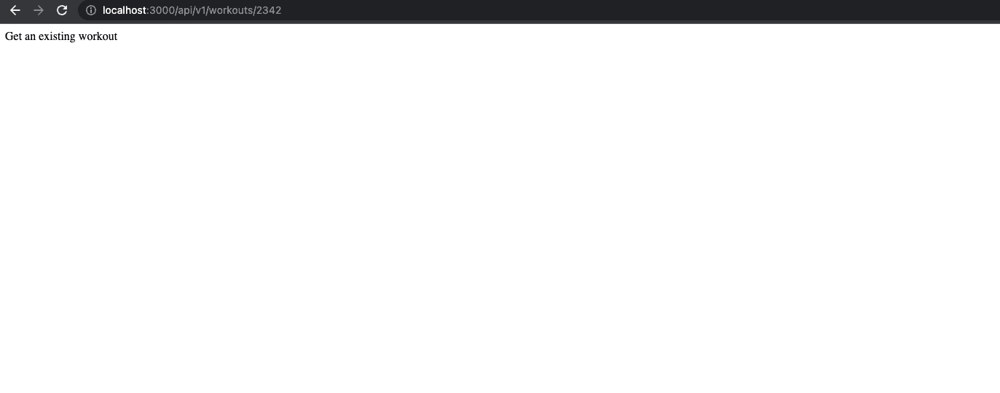

我们成功了！我们架构的第一层已经完成。让我们通过实现下一个最佳实践来创建我们的服务层。

### 接受并响应 JSON 格式的数据

当与 API 交互时，您总是在请求中发送特定的数据，或者在响应中接收数据。有许多不同的数据格式，但 JSON (Javascript Object Notation)是一种标准化的格式。

尽管 JSON 中有术语 **JavaScript** ，但它并不专门与此相关。您也可以用 Java 或 Python 编写能够处理 JSON 的 API。

由于它的标准化，API 应该接受并响应 JSON 格式的数据。

让我们看一下我们当前的实现，看看我们如何集成这一最佳实践。

首先，我们创建我们的服务层。

```
// In src/services/workoutService.js
const getAllWorkouts = () => {
  return;
};

const getOneWorkout = () => {
  return;
};

const createNewWorkout = () => {
  return;
};

const updateOneWorkout = () => {
  return;
};

const deleteOneWorkout = () => {
  return;
};

module.exports = {
  getAllWorkouts,
  getOneWorkout,
  createNewWorkout,
  updateOneWorkout,
  deleteOneWorkout,
}; 
```

将服务方法命名为与控制器方法相同也是一个很好的做法，这样您就可以在它们之间建立联系。让我们从什么都不返回开始。

在我们的健身程序控制器中，我们可以使用这些方法。

```
// In src/controllers/workoutController.js
// *** ADD ***
const workoutService = require("../services/workoutService");

const getAllWorkouts = (req, res) => {
  // *** ADD ***
  const allWorkouts = workoutService.getAllWorkouts();
  res.send("Get all workouts");
};

const getOneWorkout = (req, res) => {
  // *** ADD ***
  const workout = workoutService.getOneWorkout();
  res.send("Get an existing workout");
};

const createNewWorkout = (req, res) => {
  // *** ADD ***
  const createdWorkout = workoutService.createNewWorkout();
  res.send("Create a new workout");
};

const updateOneWorkout = (req, res) => {
  // *** ADD ***
  const updatedWorkout = workoutService.updateOneWorkout();
  res.send("Update an existing workout");
};

const deleteOneWorkout = (req, res) => {
  // *** ADD ***
  workoutService.deleteOneWorkout();
  res.send("Delete an existing workout");
};

module.exports = {
  getAllWorkouts,
  getOneWorkout,
  createNewWorkout,
  updateOneWorkout,
  deleteOneWorkout,
}; 
```

目前，我们的反应应该没有任何变化。但是在幕后，我们的控制器层现在与我们的服务层进行对话。

在我们的服务方法中，我们将处理我们的业务逻辑，比如转换数据结构和与我们的数据库层通信。

为此，我们需要一个数据库和一组实际处理数据库交互的方法。我们的数据库将是一个简单的 JSON 文件，已经预先填充了一些锻炼。

```
# Create a new file called db.json inside src/database 
touch src/database/db.json 

# Create a Workout File that stores all workout specific methods in /src/database 
touch src/database/Workout.js
```

将以下内容复制到 db.json 中:

```
{
  "workouts": [
    {
      "id": "61dbae02-c147-4e28-863c-db7bd402b2d6",
      "name": "Tommy V",
      "mode": "For Time",
      "equipment": [
        "barbell",
        "rope"
      ],
      "exercises": [
        "21 thrusters",
        "12 rope climbs, 15 ft",
        "15 thrusters",
        "9 rope climbs, 15 ft",
        "9 thrusters",
        "6 rope climbs, 15 ft"
      ],
      "createdAt": "4/20/2022, 2:21:56 PM",
      "updatedAt": "4/20/2022, 2:21:56 PM",
      "trainerTips": [
        "Split the 21 thrusters as needed",
        "Try to do the 9 and 6 thrusters unbroken",
        "RX Weights: 115lb/75lb"
      ]
    },
    {
      "id": "4a3d9aaa-608c-49a7-a004-66305ad4ab50",
      "name": "Dead Push-Ups",
      "mode": "AMRAP 10",
      "equipment": [
        "barbell"
      ],
      "exercises": [
        "15 deadlifts",
        "15 hand-release push-ups"
      ],
      "createdAt": "1/25/2022, 1:15:44 PM",
      "updatedAt": "3/10/2022, 8:21:56 AM",
      "trainerTips": [
        "Deadlifts are meant to be light and fast",
        "Try to aim for unbroken sets",
        "RX Weights: 135lb/95lb"
      ]
    },
    {
      "id": "d8be2362-7b68-4ea4-a1f6-03f8bc4eede7",
      "name": "Heavy DT",
      "mode": "5 Rounds For Time",
      "equipment": [
        "barbell",
        "rope"
      ],
      "exercises": [
        "12 deadlifts",
        "9 hang power cleans",
        "6 push jerks"
      ],
      "createdAt": "11/20/2021, 5:39:07 PM",
      "updatedAt": "11/20/2021, 5:39:07 PM",
      "trainerTips": [
        "Aim for unbroken push jerks",
        "The first three rounds might feel terrible, but stick to it",
        "RX Weights: 205lb/145lb"
      ]
    }
  ]
}
```

如您所见，插入了三个锻炼项目。一个健身程序由 id、名称、模式、设备、锻炼、创建日期、更新日期和训练提示组成。

让我们从最简单的开始，返回存储的所有锻炼数据，并从在我们的数据访问层(src/database/Workout.js)中实现相应的方法开始。

我再次选择将这里的方法命名为与服务和控制器中的方法相同。但这是完全可选的。

```
// In src/database/Workout.js
const DB = require("./db.json");

const getAllWorkouts = () => {
  return DB.workouts;
};

module.exports = { getAllWorkouts }; 
```

回到我们的健身服务，执行 **getAllWorkouts 的逻辑。**

```
// In src/database/workoutService.js
// *** ADD ***
const Workout = require("../database/Workout");
const getAllWorkouts = () => {
  // *** ADD ***
  const allWorkouts = Workout.getAllWorkouts();
  // *** ADD ***
  return allWorkouts;
};

const getOneWorkout = () => {
  return;
};

const createNewWorkout = () => {
  return;
};

const updateOneWorkout = () => {
  return;
};

const deleteOneWorkout = () => {
  return;
};

module.exports = {
  getAllWorkouts,
  getOneWorkout,
  createNewWorkout,
  updateOneWorkout,
  deleteOneWorkout,
}; 
```

返回所有锻炼数据非常简单，我们不需要进行转换，因为它已经是一个 JSON 文件了。我们现在也不需要接受任何争论。所以这个实现非常简单。但我们稍后会回到这个话题。

回到我们的健身程序控制器，我们接收来自`workoutService.getAllWorkouts()`的返回值，并简单地将其作为响应发送给客户端。我们已经通过服务将数据库响应循环到控制器。

```
// In src/controllers/workoutControllers.js
const workoutService = require("../services/workoutService");

const getAllWorkouts = (req, res) => {
  const allWorkouts = workoutService.getAllWorkouts();
  // *** ADD ***
  res.send({ status: "OK", data: allWorkouts });
};

const getOneWorkout = (req, res) => {
  const workout = workoutService.getOneWorkout();
  res.send("Get an existing workout");
};

const createNewWorkout = (req, res) => {
  const createdWorkout = workoutService.createNewWorkout();
  res.send("Create a new workout");
};

const updateOneWorkout = (req, res) => {
  const updatedWorkout = workoutService.updateOneWorkout();
  res.send("Update an existing workout");
};

const deleteOneWorkout = (req, res) => {
  workoutService.deleteOneWorkout();
  res.send("Delete an existing workout");
};

module.exports = {
  getAllWorkouts,
  getOneWorkout,
  createNewWorkout,
  updateOneWorkout,
  deleteOneWorkout,
}; 
```

在你的浏览器中进入**localhost:3000/API/v1/workouts**，你应该会看到响应 JSON。

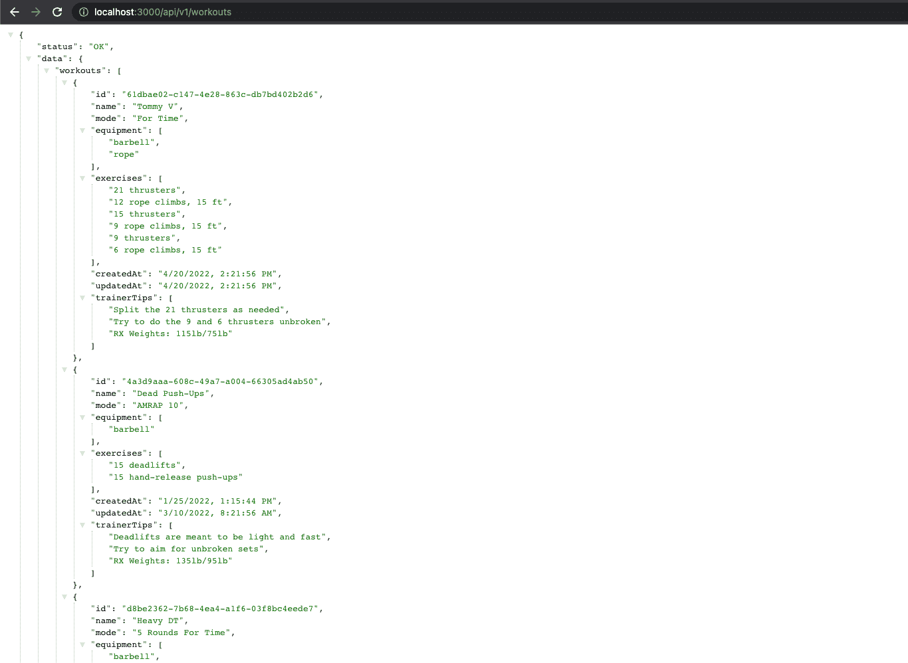

太棒了！我们以 JSON 格式发回数据。但是接受呢？让我们考虑一个端点，我们需要从客户端接收 JSON 数据。创建或更新健身程序的端点需要来自客户端的数据。

在我们的健身程序控制器中，我们提取用于创建新健身程序的请求主体，并将其传递给健身程序服务。在锻炼服务中，我们将把它插入到我们的 DB.json 中，并将新创建的锻炼发送回客户端。

为了能够在请求体中解析发送的 JSON，我们需要首先安装 **body-parser** 并对其进行配置。

```
npm i body-parser
```

```
// In src/index.js 
const express = require("express");
// *** ADD ***
const bodyParser = require("body-parser");
const v1WorkoutRouter = require("./v1/routes/workoutRoutes");

const app = express();
const PORT = process.env.PORT || 3000;

// *** ADD ***
app.use(bodyParser.json());
app.use("/api/v1/workouts", v1WorkoutRouter);

app.listen(PORT, () => {
  console.log(`API is listening on port ${PORT}`);
}); 
```

现在，我们能够在 **req.body.** 下接收控制器内部的 JSON 数据

为了正确地测试它，只需打开您最喜欢的 HTTP 客户端(我使用的是 Postman)，创建一个对 localhost:3000/api/v1/workouts 的 POST 请求和一个 JSON 格式的请求体，如下所示:

```
{
  "name": "Core Buster",
  "mode": "AMRAP 20",
  "equipment": [
    "rack",
    "barbell",
    "abmat"
  ],
  "exercises": [
    "15 toes to bars",
    "10 thrusters",
    "30 abmat sit-ups"
  ],
  "trainerTips": [
    "Split your toes to bars into two sets maximum",
    "Go unbroken on the thrusters",
    "Take the abmat sit-ups as a chance to normalize your breath"
  ]
}
```

您可能已经注意到，这里缺少一些属性，比如“id”、“createdAt”和“updatedAt”。这是我们的 API 的工作，在插入之前添加那些属性。我们稍后会在健身服务中解决这个问题。

在我们的锻炼控制器的方法 **createNewWorkout** 中，我们可以从请求对象中提取身体，进行一些验证，并将其作为参数传递给我们的锻炼服务。

```
// In src/controllers/workoutController.js
...

const createNewWorkout = (req, res) => {
  const { body } = req;
  // *** ADD ***
  if (
    !body.name ||
    !body.mode ||
    !body.equipment ||
    !body.exercises ||
    !body.trainerTips
  ) {
    return;
  }
  // *** ADD ***
  const newWorkout = {
    name: body.name,
    mode: body.mode,
    equipment: body.equipment,
    exercises: body.exercises,
    trainerTips: body.trainerTips,
  };
  // *** ADD ***
  const createdWorkout = workoutService.createNewWorkout(newWorkout);
  // *** ADD ***
  res.status(201).send({ status: "OK", data: createdWorkout });
};

...
```

为了改进请求验证，你通常会使用第三方包，比如 [express-validator](https://express-validator.github.io/docs/) 。

让我们进入我们的锻炼服务，并在我们的 createNewWorkout 方法中接收数据。

之后，我们将缺少的属性添加到对象中，并将其传递给数据访问层中的一个新方法，以将其存储在 DB 中。

首先，我们创建一个简单的 Util 函数来覆盖我们的 JSON 文件以持久化数据。

```
# Create a utils file inside our database directory 
touch src/database/utils.js
```

```
// In src/database/utils.js
const fs = require("fs");

const saveToDatabase = (DB) => {
  fs.writeFileSync("./src/database/db.json", JSON.stringify(DB, null, 2), {
    encoding: "utf-8",
  });
};

module.exports = { saveToDatabase }; 
```

然后我们可以在我们的 Workout.js 文件中使用这个函数。

```
// In src/database/Workout.js
const DB = require("./db.json");
// *** ADD ***
const { saveToDatabase } = require("./utils");

const getAllWorkouts = () => {
  return DB.workouts;
};

// *** ADD ***
const createNewWorkout = (newWorkout) => {
  const isAlreadyAdded =
    DB.workouts.findIndex((workout) => workout.name === newWorkout.name) > -1;
  if (isAlreadyAdded) {
    return;
  }
  DB.workouts.push(newWorkout);
  saveToDatabase(DB);
  return newWorkout;
};

module.exports = {
  getAllWorkouts,
  // *** ADD ***
  createNewWorkout,
}; 
```

太顺利了！下一步是在我们的健身服务中使用数据库方法。

```
# Install the uuid package 
npm i uuid
```

```
// In src/services/workoutService.js
// *** ADD ***
const { v4: uuid } = require("uuid");
// *** ADD ***
const Workout = require("../database/Workout");

const getAllWorkouts = () => {
    const allWorkouts = Workout.getAllWorkouts();
    return allWorkouts;
};

const getOneWorkout = () => {
  return;
};

const createNewWorkout = (newWorkout) => {
  // *** ADD ***
  const workoutToInsert = {
    ...newWorkout,
    id: uuid(),
    createdAt: new Date().toLocaleString("en-US", { timeZone: "UTC" }),
    updatedAt: new Date().toLocaleString("en-US", { timeZone: "UTC" }),
  };
  // *** ADD ***
  const createdWorkout = Workout.createNewWorkout(workoutToInsert);
  return createdWorkout;
};

const updateOneWorkout = () => {
  return;
};

const deleteOneWorkout = () => {
  return;
};

module.exports = {
  getAllWorkouts,
  getOneWorkout,
  createNewWorkout,
  updateOneWorkout,
  deleteOneWorkout,
}; 
```

哇！这很有趣，对吧？现在您可以转到您的 HTTP 客户端，再次发送 POST 请求，您应该会收到新创建的 JSON 形式的锻炼。

如果您尝试第二次添加相同的健身程序，您仍会收到 201 状态代码，但没有新插入的健身程序。

这意味着我们的数据库方法现在取消插入，并且不返回任何内容。这是因为我们的 if 语句检查是否已经插入了同名的锻炼。目前这很好，我们将在下一个最佳实践中处理这种情况！

现在，发送一个 GET 请求到**localhost:3000/API/v1/workouts**来读取所有的锻炼数据。我正在为此选择浏览器。您应该会看到我们的训练已成功插入并持续进行:

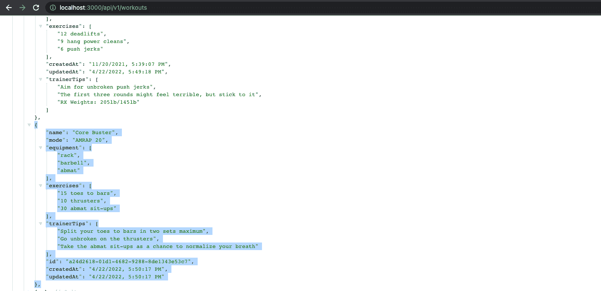

您可以自己实现其他方法，或者只是复制我的实现。

首先，健身程序控制器(您可以复制全部内容):

```
// In src/controllers/workoutController.js
const workoutService = require("../services/workoutService");

const getAllWorkouts = (req, res) => {
  const allWorkouts = workoutService.getAllWorkouts();
  res.send({ status: "OK", data: allWorkouts });
};

const getOneWorkout = (req, res) => {
  const {
    params: { workoutId },
  } = req;
  if (!workoutId) {
    return;
  }
  const workout = workoutService.getOneWorkout(workoutId);
  res.send({ status: "OK", data: workout });
};

const createNewWorkout = (req, res) => {
  const { body } = req;
  if (
    !body.name ||
    !body.mode ||
    !body.equipment ||
    !body.exercises ||
    !body.trainerTips
  ) {
    return;
  }
  const newWorkout = {
    name: body.name,
    mode: body.mode,
    equipment: body.equipment,
    exercises: body.exercises,
    trainerTips: body.trainerTips,
  };
  const createdWorkout = workoutService.createNewWorkout(newWorkout);
  res.status(201).send({ status: "OK", data: createdWorkout });
};

const updateOneWorkout = (req, res) => {
  const {
    body,
    params: { workoutId },
  } = req;
  if (!workoutId) {
    return;
  }
  const updatedWorkout = workoutService.updateOneWorkout(workoutId, body);
  res.send({ status: "OK", data: updatedWorkout });
};

const deleteOneWorkout = (req, res) => {
  const {
    params: { workoutId },
  } = req;
  if (!workoutId) {
    return;
  }
  workoutService.deleteOneWorkout(workoutId);
  res.status(204).send({ status: "OK" });
};

module.exports = {
  getAllWorkouts,
  getOneWorkout,
  createNewWorkout,
  updateOneWorkout,
  deleteOneWorkout,
}; 
```

然后，健身服务(您可以复制整个内容):

```
// In src/services/workoutServices.js
const { v4: uuid } = require("uuid");
const Workout = require("../database/Workout");

const getAllWorkouts = () => {
  const allWorkouts = Workout.getAllWorkouts();
  return allWorkouts;
};

const getOneWorkout = (workoutId) => {
  const workout = Workout.getOneWorkout(workoutId);
  return workout;
};

const createNewWorkout = (newWorkout) => {
  const workoutToInsert = {
    ...newWorkout,
    id: uuid(),
    createdAt: new Date().toLocaleString("en-US", { timeZone: "UTC" }),
    updatedAt: new Date().toLocaleString("en-US", { timeZone: "UTC" }),
  };
  const createdWorkout = Workout.createNewWorkout(workoutToInsert);
  return createdWorkout;
};

const updateOneWorkout = (workoutId, changes) => {
  const updatedWorkout = Workout.updateOneWorkout(workoutId, changes);
  return updatedWorkout;
};

const deleteOneWorkout = (workoutId) => {
  Workout.deleteOneWorkout(workoutId);
};

module.exports = {
  getAllWorkouts,
  getOneWorkout,
  createNewWorkout,
  updateOneWorkout,
  deleteOneWorkout,
}; 
```

最后是数据访问层中的数据库方法(您可以复制全部内容):

```
// In src/database/Workout.js
const DB = require("./db.json");
const { saveToDatabase } = require("./utils");

const getAllWorkouts = () => {
  return DB.workouts;
};

const getOneWorkout = (workoutId) => {
  const workout = DB.workouts.find((workout) => workout.id === workoutId);
  if (!workout) {
    return;
  }
  return workout;
};

const createNewWorkout = (newWorkout) => {
  const isAlreadyAdded =
    DB.workouts.findIndex((workout) => workout.name === newWorkout.name) > -1;
  if (isAlreadyAdded) {
    return;
  }
  DB.workouts.push(newWorkout);
  saveToDatabase(DB);
  return newWorkout;
};

const updateOneWorkout = (workoutId, changes) => {
  const indexForUpdate = DB.workouts.findIndex(
    (workout) => workout.id === workoutId
  );
  if (indexForUpdate === -1) {
    return;
  }
  const updatedWorkout = {
    ...DB.workouts[indexForUpdate],
    ...changes,
    updatedAt: new Date().toLocaleString("en-US", { timeZone: "UTC" }),
  };
  DB.workouts[indexForUpdate] = updatedWorkout;
  saveToDatabase(DB);
  return updatedWorkout;
};

const deleteOneWorkout = (workoutId) => {
  const indexForDeletion = DB.workouts.findIndex(
    (workout) => workout.id === workoutId
  );
  if (indexForDeletion === -1) {
    return;
  }
  DB.workouts.splice(indexForDeletion, 1);
  saveToDatabase(DB);
};

module.exports = {
  getAllWorkouts,
  createNewWorkout,
  getOneWorkout,
  updateOneWorkout,
  deleteOneWorkout,
}; 
```

太好了！让我们继续下一个最佳实践，看看我们如何正确处理错误。

### 用标准 HTTP 错误代码响应

我们已经走了很远，但我们还没有完成。我们的 API 现在有能力处理数据存储的基本 CRUD 操作。这很好，但并不理想。

为什么？让我解释一下。

在一个完美的世界里，一切顺利，没有任何错误。但是你可能知道，在现实世界中可能会发生很多错误——无论是从人的角度还是从技术的角度。

你可能知道那种奇怪的感觉，当事情从一开始就没有任何错误的时候。这很棒，也很愉快，但是作为开发人员，我们更习惯于不能正常工作的事情。😁

我们的 API 也是如此。我们应该处理某些可能出错或抛出错误的情况。这也将强化我们的 API。

当出错时(无论是来自请求还是我们的 API 内部),我们都会发回 HTTP 错误代码。我见过并使用过这样的 API，当一个请求有问题时，它总是返回一个 400 错误代码，而没有任何关于为什么会发生这个错误或者错误是什么的具体消息。于是调试成了一种痛苦。

这就是为什么对于不同的情况返回适当的 HTTP 错误代码总是一个好的实践的原因。这有助于消费者或构建 API 的工程师更容易地发现问题。

为了改善体验，我们还可以在错误响应的同时发送一条快速错误消息。但是正如我在引言中所写的，这并不总是明智的，应该由工程师自己来考虑。

例如，返回类似于**“用户名已经注册了”**这样的信息应该经过深思熟虑，因为您提供了关于您的用户的信息，而您确实应该隐藏这些信息。

在我们的 Crossfit API 中，我们将查看创建端点，看看可能会出现什么错误以及我们如何处理它们。在这篇技巧的最后，您将再次找到其他端点的完整实现。

让我们开始看看健身控制器中的 create new 健身方法:

```
// In src/controllers/workoutController.js
...

const createNewWorkout = (req, res) => {
  const { body } = req;
  if (
    !body.name ||
    !body.mode ||
    !body.equipment ||
    !body.exercises ||
    !body.trainerTips
  ) {
    return;
  }
  const newWorkout = {
    name: body.name,
    mode: body.mode,
    equipment: body.equipment,
    exercises: body.exercises,
    trainerTips: body.trainerTips,
  };
  const createdWorkout = workoutService.createNewWorkout(newWorkout);
  res.status(201).send({ status: "OK", data: createdWorkout });
};

...
```

我们已经发现了这样一种情况，即请求体没有正确构建，并且丢失了我们期望的键。

这是一个发回 400 HTTP 错误和相应错误消息的好例子。

```
// In src/controllers/workoutController.js
...

const createNewWorkout = (req, res) => {
  const { body } = req;
  if (
    !body.name ||
    !body.mode ||
    !body.equipment ||
    !body.exercises ||
    !body.trainerTips
  ) {
    res
      .status(400)
      .send({
        status: "FAILED",
        data: {
          error:
            "One of the following keys is missing or is empty in request body: 'name', 'mode', 'equipment', 'exercises', 'trainerTips'",
        },
      });
    return;
  }
  const newWorkout = {
    name: body.name,
    mode: body.mode,
    equipment: body.equipment,
    exercises: body.exercises,
    trainerTips: body.trainerTips,
  };
  const createdWorkout = workoutService.createNewWorkout(newWorkout);
  res.status(201).send({ status: "OK", data: createdWorkout });
};

...
```

如果我们试图添加一个新的健身程序，但忘记在我们的请求体中提供“模式”属性，我们应该会看到错误消息以及 400 HTTP 错误代码。

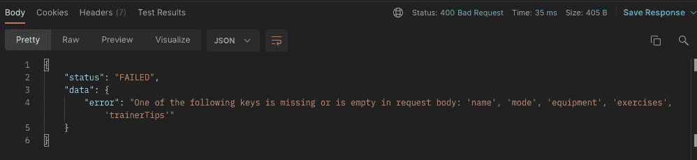

使用 API 的开发人员现在可以更好地了解应该寻找什么。他们立即知道进入请求体，看看他们是否错过了提供一个必需的属性。

对于所有属性来说，让这个错误消息变得更加通用，现在就可以了。通常，您会使用模式验证器来处理这个问题。

让我们更深入地了解我们的健身服务，看看可能会出现哪些潜在的错误。

```
// In src/services/workoutService.js
...

const createNewWorkout = (newWorkout) => {
  const workoutToInsert = {
    ...newWorkout,
    id: uuid(),
    createdAt: new Date().toLocaleString("en-US", { timeZone: "UTC" }),
    updatedAt: new Date().toLocaleString("en-US", { timeZone: "UTC" }),
  };
  const createdWorkout = Workout.createNewWorkout(workoutToInsert);
  return createdWorkout;
};

...
```

可能出错的一件事是数据库插入 **Workout.createNewWorkout()。**我喜欢将这个东西包装在一个 try/catch 块中，以便在错误发生时捕获它。

```
// In src/services/workoutService.js
...

const createNewWorkout = (newWorkout) => {
  const workoutToInsert = {
    ...newWorkout,
    id: uuid(),
    createdAt: new Date().toLocaleString("en-US", { timeZone: "UTC" }),
    updatedAt: new Date().toLocaleString("en-US", { timeZone: "UTC" }),
  };
  try {
    const createdWorkout = Workout.createNewWorkout(workoutToInsert);
    return createdWorkout;
  } catch (error) {
    throw error;
  }
};

...
```

在我们的 Workout.createNewWorkout()方法中抛出的每个错误都将在我们的 catch 块中被捕获。我们只是把它扔回去，所以我们可以稍后在控制器中调整我们的响应。

让我们定义一下我们在 Workout.js 中的错误:

```
// In src/database/Workout.js
...

const createNewWorkout = (newWorkout) => {
  const isAlreadyAdded =
    DB.workouts.findIndex((workout) => workout.name === newWorkout.name) > -1;
  if (isAlreadyAdded) {
    throw {
      status: 400,
      message: `Workout with the name '${newWorkout.name}' already exists`,
    };
  }
  try {
    DB.workouts.push(newWorkout);
    saveToDatabase(DB);
    return newWorkout;
  } catch (error) {
    throw { status: 500, message: error?.message || error };
  }
};

...
```

如您所见，错误由两部分组成，状态和消息。我在这里只使用了 **throw** 关键字来发送一个不同于字符串的数据结构，这在 **throw new Error()** 中是必需的。

仅仅抛出的一个缺点是我们没有得到堆栈跟踪。但通常这种错误抛出会由我们选择的第三方库来处理(例如，如果您使用 MongoDB 数据库，则使用 Mongoose)。但是出于本教程的目的，这应该没问题。

现在，我们能够在服务和数据访问层抛出和捕获错误。我们现在可以进入锻炼控制器，捕捉其中的错误，并做出相应的反应。

```
// In src/controllers/workoutController.js
...

const createNewWorkout = (req, res) => {
  const { body } = req;
  if (
    !body.name ||
    !body.mode ||
    !body.equipment ||
    !body.exercises ||
    !body.trainerTips
  ) {
    res
      .status(400)
      .send({
        status: "FAILED",
        data: {
          error:
            "One of the following keys is missing or is empty in request body: 'name', 'mode', 'equipment', 'exercises', 'trainerTips'",
        },
      });
    return;
  }
  const newWorkout = {
    name: body.name,
    mode: body.mode,
    equipment: body.equipment,
    exercises: body.exercises,
    trainerTips: body.trainerTips,
  };
  // *** ADD ***
  try {
    const createdWorkout = workoutService.createNewWorkout(newWorkout);
    res.status(201).send({ status: "OK", data: createdWorkout });
  } catch (error) {
    res
      .status(error?.status || 500)
      .send({ status: "FAILED", data: { error: error?.message || error } });
  }
};

...
```

您可以通过两次添加相同名称的锻炼或不在请求正文中提供必需的属性来进行测试。您应该会收到相应的 HTTP 错误代码和错误消息。

为了总结这一点并进入下一个技巧，您可以将其他实现的方法复制到以下文件中，或者您可以自己尝试:

```
// In src/controllers/workoutController.js
const workoutService = require("../services/workoutService");

const getAllWorkouts = (req, res) => {
  try {
    const allWorkouts = workoutService.getAllWorkouts();
    res.send({ status: "OK", data: allWorkouts });
  } catch (error) {
    res
      .status(error?.status || 500)
      .send({ status: "FAILED", data: { error: error?.message || error } });
  }
};

const getOneWorkout = (req, res) => {
  const {
    params: { workoutId },
  } = req;
  if (!workoutId) {
    res
      .status(400)
      .send({
        status: "FAILED",
        data: { error: "Parameter ':workoutId' can not be empty" },
      });
  }
  try {
    const workout = workoutService.getOneWorkout(workoutId);
    res.send({ status: "OK", data: workout });
  } catch (error) {
    res
      .status(error?.status || 500)
      .send({ status: "FAILED", data: { error: error?.message || error } });
  }
};

const createNewWorkout = (req, res) => {
  const { body } = req;
  if (
    !body.name ||
    !body.mode ||
    !body.equipment ||
    !body.exercises ||
    !body.trainerTips
  ) {
    res
      .status(400)
      .send({
        status: "FAILED",
        data: {
          error:
            "One of the following keys is missing or is empty in request body: 'name', 'mode', 'equipment', 'exercises', 'trainerTips'",
        },
      });
    return;
  }
  const newWorkout = {
    name: body.name,
    mode: body.mode,
    equipment: body.equipment,
    exercises: body.exercises,
    trainerTips: body.trainerTips,
  };
  try {
    const createdWorkout = workoutService.createNewWorkout(newWorkout);
    res.status(201).send({ status: "OK", data: createdWorkout });
  } catch (error) {
    res
      .status(error?.status || 500)
      .send({ status: "FAILED", data: { error: error?.message || error } });
  }
};

const updateOneWorkout = (req, res) => {
  const {
    body,
    params: { workoutId },
  } = req;
  if (!workoutId) {
    res
      .status(400)
      .send({
        status: "FAILED",
        data: { error: "Parameter ':workoutId' can not be empty" },
      });
  }
  try {
    const updatedWorkout = workoutService.updateOneWorkout(workoutId, body);
    res.send({ status: "OK", data: updatedWorkout });
  } catch (error) {
    res
      .status(error?.status || 500)
      .send({ status: "FAILED", data: { error: error?.message || error } });
  }
};

const deleteOneWorkout = (req, res) => {
  const {
    params: { workoutId },
  } = req;
  if (!workoutId) {
    res
      .status(400)
      .send({
        status: "FAILED",
        data: { error: "Parameter ':workoutId' can not be empty" },
      });
  }
  try {
    workoutService.deleteOneWorkout(workoutId);
    res.status(204).send({ status: "OK" });
  } catch (error) {
    res
      .status(error?.status || 500)
      .send({ status: "FAILED", data: { error: error?.message || error } });
  }
};

module.exports = {
  getAllWorkouts,
  getOneWorkout,
  createNewWorkout,
  updateOneWorkout,
  deleteOneWorkout,
  getRecordsForWorkout,
}; 
```

```
// In src/services/workoutService.js
const { v4: uuid } = require("uuid");
const Workout = require("../database/Workout");

const getAllWorkouts = () => {
  try {
    const allWorkouts = Workout.getAllWorkouts();
    return allWorkouts;
  } catch (error) {
    throw error;
  }
};

const getOneWorkout = (workoutId) => {
  try {
    const workout = Workout.getOneWorkout(workoutId);
    return workout;
  } catch (error) {
    throw error;
  }
};

const createNewWorkout = (newWorkout) => {
  const workoutToInsert = {
    ...newWorkout,
    id: uuid(),
    createdAt: new Date().toLocaleString("en-US", { timeZone: "UTC" }),
    updatedAt: new Date().toLocaleString("en-US", { timeZone: "UTC" }),
  };
  try {
    const createdWorkout = Workout.createNewWorkout(workoutToInsert);
    return createdWorkout;
  } catch (error) {
    throw error;
  }
};

const updateOneWorkout = (workoutId, changes) => {
  try {
    const updatedWorkout = Workout.updateOneWorkout(workoutId, changes);
    return updatedWorkout;
  } catch (error) {
    throw error;
  }
};

const deleteOneWorkout = (workoutId) => {
  try {
    Workout.deleteOneWorkout(workoutId);
  } catch (error) {
    throw error;
  }
};

module.exports = {
  getAllWorkouts,
  getOneWorkout,
  createNewWorkout,
  updateOneWorkout,
  deleteOneWorkout,
}; 
```

```
// In src/database/Workout.js
const DB = require("./db.json");
const { saveToDatabase } = require("./utils");

const getAllWorkouts = () => {
  try {
    return DB.workouts;
  } catch (error) {
    throw { status: 500, message: error };
  }
};

const getOneWorkout = (workoutId) => {
  try {
    const workout = DB.workouts.find((workout) => workout.id === workoutId);
    if (!workout) {
      throw {
        status: 400,
        message: `Can't find workout with the id '${workoutId}'`,
      };
    }
    return workout;
  } catch (error) {
    throw { status: error?.status || 500, message: error?.message || error };
  }
};

const createNewWorkout = (newWorkout) => {
  try {
    const isAlreadyAdded =
      DB.workouts.findIndex((workout) => workout.name === newWorkout.name) > -1;
    if (isAlreadyAdded) {
      throw {
        status: 400,
        message: `Workout with the name '${newWorkout.name}' already exists`,
      };
    }
    DB.workouts.push(newWorkout);
    saveToDatabase(DB);
    return newWorkout;
  } catch (error) {
    throw { status: error?.status || 500, message: error?.message || error };
  }
};

const updateOneWorkout = (workoutId, changes) => {
  try {
    const isAlreadyAdded =
      DB.workouts.findIndex((workout) => workout.name === changes.name) > -1;
    if (isAlreadyAdded) {
      throw {
        status: 400,
        message: `Workout with the name '${changes.name}' already exists`,
      };
    }
    const indexForUpdate = DB.workouts.findIndex(
      (workout) => workout.id === workoutId
    );
    if (indexForUpdate === -1) {
      throw {
        status: 400,
        message: `Can't find workout with the id '${workoutId}'`,
      };
    }
    const updatedWorkout = {
      ...DB.workouts[indexForUpdate],
      ...changes,
      updatedAt: new Date().toLocaleString("en-US", { timeZone: "UTC" }),
    };
    DB.workouts[indexForUpdate] = updatedWorkout;
    saveToDatabase(DB);
    return updatedWorkout;
  } catch (error) {
    throw { status: error?.status || 500, message: error?.message || error };
  }
};

const deleteOneWorkout = (workoutId) => {
  try {
    const indexForDeletion = DB.workouts.findIndex(
      (workout) => workout.id === workoutId
    );
    if (indexForDeletion === -1) {
      throw {
        status: 400,
        message: `Can't find workout with the id '${workoutId}'`,
      };
    }
    DB.workouts.splice(indexForDeletion, 1);
    saveToDatabase(DB);
  } catch (error) {
    throw { status: error?.status || 500, message: error?.message || error };
  }
};

module.exports = {
  getAllWorkouts,
  createNewWorkout,
  getOneWorkout,
  updateOneWorkout,
  deleteOneWorkout,
}; 
```

### 避免端点名称中出现动词

在端点中使用动词没有太大的意义，事实上，这是非常无用的。一般来说，每个 URL 都应该指向一个资源(记住上面的盒子例子)。不多也不少。

在 URL 中使用一个动词显示了一种资源本身所没有的行为。

我们已经在 URL 中没有使用动词的情况下正确地实现了端点，但是让我们看看如果我们使用了动词，我们的 URL 会是什么样子。

```
// Current implementations (without verbs)
GET "/api/v1/workouts" 
GET "/api/v1/workouts/:workoutId" 
POST "/api/v1/workouts" 
PATCH "/api/v1/workouts/:workoutId" 
DELETE "/api/v1/workouts/:workoutId"  

// Implementation using verbs 
GET "/api/v1/getAllWorkouts" 
GET "/api/v1/getWorkoutById/:workoutId" 
CREATE "/api/v1/createWorkout" 
PATCH "/api/v1/updateWorkout/:workoutId" 
DELETE "/api/v1/deleteWorkout/:workoutId"
```

你看出区别了吗？每个行为有一个完全不同的 URL 会很快变得混乱和不必要的复杂。

想象我们有 300 个不同的端点。为每一个使用一个单独的 URL 可能是一个开销(和文档)地狱。

我想指出的另一个不在 URL 中使用动词的原因是 HTTP 动词本身已经表示了动作。

像**“GET/API/v1/getAllWorkouts”**或者**“DELETE API/v1/DELETE workout/workoutId”**这样的东西是不必要的。

当你看一看我们当前的实现时，它变得更加简洁，因为我们只使用了两个不同的 URL，并且实际的行为是通过 HTTP 动词和相应的请求有效负载来处理的。

我总是认为 HTTP 动词描述了动作(我们想要做的事情),而 URL 本身(指向资源)描述了目标。**“GET/API/v1/workouts”**人类语言也更加流畅。

### 将相关资源组合在一起(逻辑嵌套)

当你在设计你的 API 的时候，可能会有这样的情况，你拥有和其他人相关联的资源。将它们组合到一个端点并适当嵌套是一个好的做法。

让我们考虑一下，在我们的 API 中，我们也有一个在我们的 CrossFit box 中注册的成员列表(“box”是 CrossFit 健身房的名称)。为了激励我们的会员，我们跟踪每次锻炼的总票房记录。

例如，有一种锻炼，你必须尽可能快地完成一定顺序的锻炼。我们会记录所有会员的时间，以便列出每位会员完成此锻炼的时间。

现在，前端需要一个端点来响应特定锻炼的所有记录，以便在 UI 中显示它。

健身程序、会员和记录存储在数据库的不同位置。所以我们这里需要的是一个盒子(记录)套在另一个盒子(锻炼)里，对吗？

该端点的 URI 将是**/API/v1/workouts/:workoutId/records**。这是一个允许 URL 逻辑嵌套的好习惯。URL 本身不一定要反映数据库结构。

让我们开始实现这个端点。

首先，在 db.json 中添加一个名为“members”的新表。把它放在“锻炼”下面。

```
{
  "workouts": [ ...
  ],
  "members": [
    {
      "id": "12a410bc-849f-4e7e-bfc8-4ef283ee4b19",
      "name": "Jason Miller",
      "gender": "male",
      "dateOfBirth": "23/04/1990",
      "email": "jason@mail.com",
      "password": "666349420ec497c1dc890c45179d44fb13220239325172af02d1fb6635922956"
    },
    {
      "id": "2b9130d4-47a7-4085-800e-0144f6a46059",
      "name": "Tiffany Brookston",
      "gender": "female",
      "dateOfBirth": "09/06/1996",
      "email": "tiffy@mail.com",
      "password": "8a1ea5669b749354110dcba3fac5546c16e6d0f73a37f35a84f6b0d7b3c22fcc"
    },
    {
      "id": "11817fb1-03a1-4b4a-8d27-854ac893cf41",
      "name": "Catrin Stevenson",
      "gender": "female",
      "dateOfBirth": "17/08/2001",
      "email": "catrin@mail.com",
      "password": "18eb2d6c5373c94c6d5d707650d02c3c06f33fac557c9cfb8cb1ee625a649ff3"
    },
    {
      "id": "6a89217b-7c28-4219-bd7f-af119c314159",
      "name": "Greg Bronson",
      "gender": "male",
      "dateOfBirth": "08/04/1993",
      "email": "greg@mail.com",
      "password": "a6dcde7eceb689142f21a1e30b5fdb868ec4cd25d5537d67ac7e8c7816b0e862"
    }
  ]
}
```

在你开始询问之前，是的，密码是散列的。😉

之后，在“成员”下添加一些“记录”。

```
{
  "workouts": [ ...
  ],
  "members": [ ...
  ],
  "records": [
    {
      "id": "ad75d475-ac57-44f4-a02a-8f6def58ff56",
      "workout": "4a3d9aaa-608c-49a7-a004-66305ad4ab50",
      "record": "160 reps"
    },
    {
      "id": "0bff586f-2017-4526-9e52-fe3ea46d55ab",
      "workout": "d8be2362-7b68-4ea4-a1f6-03f8bc4eede7",
      "record": "7:23 minutes"
    },
    {
      "id": "365cc0bb-ba8f-41d3-bf82-83d041d38b82",
      "workout": "a24d2618-01d1-4682-9288-8de1343e53c7",
      "record": "358 reps"
    },
    {
      "id": "62251cfe-fdb6-4fa6-9a2d-c21be93ac78d",
      "workout": "4a3d9aaa-608c-49a7-a004-66305ad4ab50",
      "record": "145 reps"
    }
  ],
}
```

为了确保你和我一样用相同的 id 得到相同的训练，也要复制训练:

```
{
  "workouts": [
    {
      "id": "61dbae02-c147-4e28-863c-db7bd402b2d6",
      "name": "Tommy V",
      "mode": "For Time",
      "equipment": [
        "barbell",
        "rope"
      ],
      "exercises": [
        "21 thrusters",
        "12 rope climbs, 15 ft",
        "15 thrusters",
        "9 rope climbs, 15 ft",
        "9 thrusters",
        "6 rope climbs, 15 ft"
      ],
      "createdAt": "4/20/2022, 2:21:56 PM",
      "updatedAt": "4/20/2022, 2:21:56 PM",
      "trainerTips": [
        "Split the 21 thrusters as needed",
        "Try to do the 9 and 6 thrusters unbroken",
        "RX Weights: 115lb/75lb"
      ]
    },
    {
      "id": "4a3d9aaa-608c-49a7-a004-66305ad4ab50",
      "name": "Dead Push-Ups",
      "mode": "AMRAP 10",
      "equipment": [
        "barbell"
      ],
      "exercises": [
        "15 deadlifts",
        "15 hand-release push-ups"
      ],
      "createdAt": "1/25/2022, 1:15:44 PM",
      "updatedAt": "3/10/2022, 8:21:56 AM",
      "trainerTips": [
        "Deadlifts are meant to be light and fast",
        "Try to aim for unbroken sets",
        "RX Weights: 135lb/95lb"
      ]
    },
    {
      "id": "d8be2362-7b68-4ea4-a1f6-03f8bc4eede7",
      "name": "Heavy DT",
      "mode": "5 Rounds For Time",
      "equipment": [
        "barbell",
        "rope"
      ],
      "exercises": [
        "12 deadlifts",
        "9 hang power cleans",
        "6 push jerks"
      ],
      "createdAt": "11/20/2021, 5:39:07 PM",
      "updatedAt": "4/22/2022, 5:49:18 PM",
      "trainerTips": [
        "Aim for unbroken push jerks",
        "The first three rounds might feel terrible, but stick to it",
        "RX Weights: 205lb/145lb"
      ]
    },
    {
      "name": "Core Buster",
      "mode": "AMRAP 20",
      "equipment": [
        "rack",
        "barbell",
        "abmat"
      ],
      "exercises": [
        "15 toes to bars",
        "10 thrusters",
        "30 abmat sit-ups"
      ],
      "trainerTips": [
        "Split your toes to bars in two sets maximum",
        "Go unbroken on the thrusters",
        "Take the abmat sit-ups as a chance to normalize your breath"
      ],
      "id": "a24d2618-01d1-4682-9288-8de1343e53c7",
      "createdAt": "4/22/2022, 5:50:17 PM",
      "updatedAt": "4/22/2022, 5:50:17 PM"
    }
  ],
  "members": [ ...
  ],
  "records": [ ...
  ]
}
```

好了，让我们花几分钟来思考一下我们的实现。

我们在一侧有一个名为“锻炼”的资源，在另一侧有一个名为“记录”的资源。

为了继续我们的架构，建议创建另一个控制器、另一个服务和另一个负责记录的数据库方法集合。

我们也很有可能为记录实现 CRUD 端点，因为将来还会添加、更新或删除记录。但这不是目前的首要任务。

我们还需要一个记录路由器来捕捉对记录的特定请求，但我们现在不需要它。这可能是一个很好的机会，让您用自己的路线和训练来实现记录的 CRUD 操作。

```
# Create records controller 
touch src/controllers/recordController.js 

# Create records service 
touch src/services/recordService.js 

# Create records database methods 
touch src/database/Record.js
```

那很容易。让我们继续，从实现我们的数据库方法开始。

```
// In src/database/Record.js
const DB = require("./db.json");

const getRecordForWorkout = (workoutId) => {
  try {
    const record = DB.records.filter((record) => record.workout === workoutId);
    if (!record) {
      throw {
        status: 400,
        message: `Can't find workout with the id '${workoutId}'`,
      };
    }
    return record;
  } catch (error) {
    throw { status: error?.status || 500, message: error?.message || error };
  }
};
module.exports = { getRecordForWorkout }; 
```

很简单，对吧？我们从查询参数中过滤出所有与健身程序 id 相关的记录。

下一个是我们的唱片服务:

```
// In src/services/recordService.js
const Record = require("../database/Record");

const getRecordForWorkout = (workoutId) => {
  try {
    const record = Record.getRecordForWorkout(workoutId);
    return record;
  } catch (error) {
    throw error;
  }
};
module.exports = { getRecordForWorkout }; 
```

同样，这里没有什么新的东西。

现在，我们可以在健身路由器中创建一条新路线，并将请求发送到我们的记录服务。

```
// In src/v1/routes/workoutRoutes.js
const express = require("express");
const workoutController = require("../../controllers/workoutController");
// *** ADD ***
const recordController = require("../../controllers/recordController");

const router = express.Router();

router.get("/", workoutController.getAllWorkouts);

router.get("/:workoutId", workoutController.getOneWorkout);

// *** ADD ***
router.get("/:workoutId/records", recordController.getRecordForWorkout);

router.post("/", workoutController.createNewWorkout);

router.patch("/:workoutId", workoutController.updateOneWorkout);

router.delete("/:workoutId", workoutController.deleteOneWorkout);

module.exports = router; 
```

太好了！让我们在浏览器中测试一下。

首先，我们获取所有锻炼以获得锻炼 id。

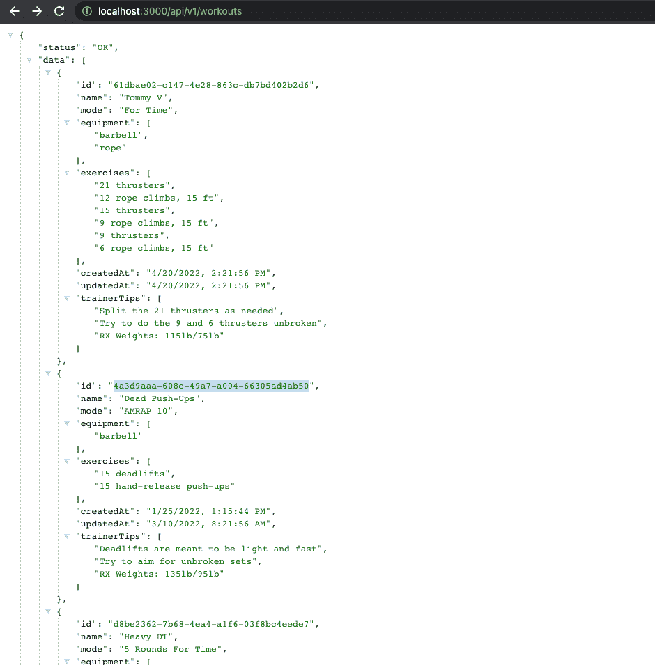

让我们看看是否能获取所有相关记录:


如您所见，当您拥有可以绑定在一起的资源时，逻辑嵌套是有意义的。理论上，你可以把它嵌套到你想要的深度，但是这里的经验法则是最多三层。

如果想嵌套得更深，可以在数据库记录中做一点小小的调整。我给你看一个小例子。

假设前端也需要一个端点来获取关于哪个成员确切持有当前记录并希望接收关于它们的元数据的信息。

当然，我们可以实现以下 URI:

```
GET /api/v1/workouts/:workoutId/records/members/:memberId
```

现在，我们添加的嵌套越多，端点就越难管理。因此，将接收成员信息的 URI 直接存储到记录中是一种很好的做法。

考虑数据库内部的以下情况:

```
{
  "workouts": [ ...
  ],
  "members": [ ...
  ],
  "records": [ ... {
      "id": "ad75d475-ac57-44f4-a02a-8f6def58ff56",
      "workout": "4a3d9aaa-608c-49a7-a004-66305ad4ab50",
      "record": "160 reps",
      "memberId": "11817fb1-03a1-4b4a-8d27-854ac893cf41",
      "member": "/members/:memberId"
    },
  ]
}
```

如您所见，我们已经向数据库中的记录添加了两个属性“memberId”和“member”。这有一个巨大的优势，那就是我们不必更深地嵌套我们现有的端点。

前端只需要调用**GET/API/v1/workouts/:workoutId/records**就可以自动接收与本次锻炼相关的所有记录。

除此之外，它还获取成员 id 和端点来获取关于该成员的信息。因此，我们避免了更深层次的端点嵌套。

当然，这只有在我们能够处理对“/members/:memberId”的请求时才有效😁这听起来像是一个很好的培训机会，让你实施这种情况！

### 集成过滤、排序和分页

现在，我们能够用我们的 API 完成相当多的操作。这是很大的进步，但还有更多。

在上一节中，我们着重于改善我们的开发人员体验，以及如何与我们的 API 交互。但是我们 API 的整体性能是我们应该努力的另一个关键因素。

这就是为什么集成过滤、排序和分页也是我列表中的一个重要因素。

假设我们的数据库中存储了 2，000 项锻炼、450 条记录和 500 名会员。当呼叫我们的端点获取所有锻炼数据时，我们不想一次发送所有 2，000 个锻炼数据。当然，这将是一个非常缓慢的响应，否则它会使我们的系统停机(可能有 200，000 次😁).

这就是为什么过滤和分页很重要的原因。顾名思义，过滤很有用，因为它允许我们从整个集合中获取特定的数据。例如，模式为“时间”的所有锻炼。

分页是另一种将我们收集的所有锻炼数据分成多个“页面”的机制，例如，每个页面只包含二十个锻炼数据。这项技术有助于我们确保在回复客户时不会同时发送超过 20 条锻炼信息。

分类可能是一项复杂的任务。因此，在我们的 API 中完成它并将排序后的数据发送给客户端会更有效。

让我们从在 API 中集成一些过滤机制开始。我们将通过接受过滤参数来升级发送所有锻炼数据的端点。通常，在 GET 请求中，我们添加过滤标准作为查询参数。

我们的新 URI 将会是这个样子，当我们只想得到“AMRAP”模式的训练时(**A**s**M**any**R**ounds**A**s**P**ossible):**/API/v1/outgots？模式=amrap。**

为了让这更有趣，我们需要增加一些锻炼。将这些训练粘贴到 db.json 中的“训练”集合中:

```
{
  "name": "Jumping (Not) Made Easy",
  "mode": "AMRAP 12",
  "equipment": [
    "jump rope"
  ],
  "exercises": [
    "10 burpees",
    "25 double-unders"
  ],
  "trainerTips": [
    "Scale to do 50 single-unders, if double-unders are too difficult"
  ],
  "id": "8f8318f8-b869-4e9d-bb78-88010193563a",
  "createdAt": "4/25/2022, 2:45:28 PM",
  "updatedAt": "4/25/2022, 2:45:28 PM"
},
{
  "name": "Burpee Meters",
  "mode": "3 Rounds For Time",
  "equipment": [
    "Row Erg"
  ],
  "exercises": [
    "Row 500 meters",
    "21 burpees",
    "Run 400 meters",
    "Rest 3 minutes"
  ],
  "trainerTips": [
    "Go hard",
    "Note your time after the first run",
    "Try to hold your pace"
  ],
  "id": "0a5948af-5185-4266-8c4b-818889657e9d",
  "createdAt": "4/25/2022, 2:48:53 PM",
  "updatedAt": "4/25/2022, 2:48:53 PM"
},
{
  "name": "Dumbbell Rower",
  "mode": "AMRAP 15",
  "equipment": [
    "Dumbbell"
  ],
  "exercises": [
    "15 dumbbell rows, left arm",
    "15 dumbbell rows, right arm",
    "50-ft handstand walk"
  ],
  "trainerTips": [
    "RX weights for women: 35-lb",
    "RX weights for men: 50-lb"
  ],
  "id": "3dc53bc8-27b8-4773-b85d-89f0a354d437",
  "createdAt": "4/25/2022, 2:56:03 PM",
  "updatedAt": "4/25/2022, 2:56:03 PM"
}
```

之后，我们必须接受和处理查询参数。我们的健身控制器将是正确的起点:

```
// In src/controllers/workoutController.js
...

const getAllWorkouts = (req, res) => {
  // *** ADD ***
  const { mode } = req.query;
  try {
    // *** ADD ***
    const allWorkouts = workoutService.getAllWorkouts({ mode });
    res.send({ status: "OK", data: allWorkouts });
  } catch (error) {
    res
      .status(error?.status || 500)
      .send({ status: "FAILED", data: { error: error?.message || error } });
  }
};

...
```

我们从 req.query 对象中提取“mode ”,并定义 workoutService.getAllWorkouts 的一个参数。

我在这里使用简写语法，用“req.query.mode”中的值在对象内部创建一个名为“mode”的新键。如果没有名为“mode”的查询参数，这可能是真值或未定义值。我们可以扩展这个对象来接受更多的过滤器参数。

在我们的健身服务中，将它传递到您的数据库方法:

```
// In src/services/workoutService.js
...

const getAllWorkouts = (filterParams) => {
  try {
    // *** ADD ***
    const allWorkouts = Workout.getAllWorkouts(filterParams);
    return allWorkouts;
  } catch (error) {
    throw error;
  }
};

...
```

现在我们可以在数据库方法中使用它，并应用过滤:

```
// In src/database/Workout.js
...

const getAllWorkouts = (filterParams) => {
  try {
    let workouts = DB.workouts;
    if (filterParams.mode) {
      return DB.workouts.filter((workout) =>
        workout.mode.toLowerCase().includes(filterParams.mode)
      );
    }
    // Other if-statements will go here for different parameters
    return workouts;
  } catch (error) {
    throw { status: 500, message: error };
  }
};

...
```

很简单，对吧？我们在这里所做的就是检查我们的“filterParams”中是否真的有键“mode”的真值。如果这是真的，我们会过滤所有具有相同“模式”的健身程序。如果不是这样，则没有名为“模式”的查询参数，我们会返回所有锻炼数据，因为我们不需要过滤。

我们在这里将“锻炼”定义为“let”变量，因为当我们为不同的过滤器添加更多的 if 语句时，我们可以覆盖“锻炼”并链接过滤器。

在您的浏览器中，您可以访问 localhost:3000/api/v1/workouts？mode=amrap，您将收到储存的所有“amrap”健身程序:

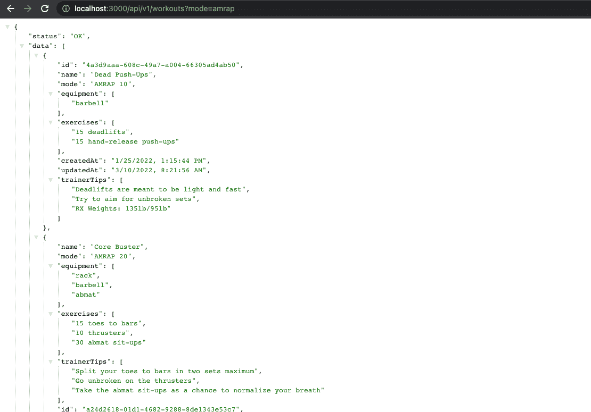

如果您不考虑查询参数，您应该像以前一样获得所有锻炼数据。您可以进一步尝试添加“for%20time”作为“mode”参数的值(记住-> “% 20”表示“空白”)，您应该会收到所有模式为“For Time”的健身程序(如果有存储的话)。

当键入一个没有存储的值时，您应该收到一个空数组。

排序和分页的参数遵循相同的原则。让我们看看我们可能实现的一些特性:

*   接收所有需要杠铃的健身程序:**/API/v1/健身程序？器械=杠铃**
*   只获得 5 个锻炼:**/API/v1/锻炼？长度=5**
*   使用分页时，接收第二页: **/api/v1/workouts？page=2**
*   按创建日期降序排列响应中的健身程序:**/API/v1/健身程序？sort=-createdAt**
*   您还可以组合这些参数，以获得最近 10 次更新的锻炼数据，例如: **/api/v1/workouts？sort =-updatedAt&length = 10**

### 使用数据缓存提高性能

使用数据缓存也是提高我们的 API 的整体体验和性能的一个很好的实践。

当数据是经常被请求的资源或者/和从数据库中查询数据是一项繁重的工作并且可能需要几秒钟时，使用缓存来提供数据是非常有意义的。

您可以将这种类型的数据存储在您的缓存中，并从那里提供服务，而不是每次都去数据库查询数据。

从缓存中提供数据时，您必须记住的一件重要事情是，这些数据可能会过时。所以你必须确保缓存中的数据总是最新的。

有许多不同的解决方案。一个合适的例子是使用 [redis](https://www.npmjs.com/package/redis) 或 express 中间件 [apicache](https://www.npmjs.com/package/apicache) 。

我想用 apicache，但是如果你想用 Redis，我可以强烈推荐你去看看他们伟大的[文档](https://docs.redis.com/latest/rs/references/client_references/client_nodejs/)。

让我们考虑一下 API 中缓存有意义的场景。我认为，请求接收所有锻炼将有效地从我们的缓存服务。

首先，让我们安装中间件:

```
npm i apicache
```

现在，我们必须将其导入健身路由器并进行配置。

```
// In src/v1/routes/workoutRoutes.js
const express = require("express");
// *** ADD ***
const apicache = require("apicache");
const workoutController = require("../../controllers/workoutController");
const recordController = require("../../controllers/recordController");

const router = express.Router();
// *** ADD ***
const cache = apicache.middleware;

// *** ADD ***
router.get("/", cache("2 minutes"), workoutController.getAllWorkouts);

router.get("/:workoutId", workoutController.getOneWorkout);

router.get("/:workoutId/records", recordController.getRecordForWorkout);

router.post("/", workoutController.createNewWorkout);

router.patch("/:workoutId", workoutController.updateOneWorkout);

router.delete("/:workoutId", workoutController.deleteOneWorkout);

module.exports = router; 
```

开始很简单，对吗？我们可以通过调用 **apicache.middleware** 来定义一个新的缓存，并在我们的 get 路由中使用它作为中间件。你只需要把它作为实际路径和我们的锻炼控制器之间的一个参数。

在里面你可以定义你的数据应该被缓存多长时间。为了这个教程，我选择了两分钟。时间取决于缓存中的数据变化的速度或频率。

让我们测试一下！

在 Postman 或您选择的另一个 HTTP 客户端中，定义一个获得所有锻炼的新请求。到目前为止，我都是在浏览器中完成的，但是我想为您更好地可视化响应时间。这就是我现在通过邮递员请求资源的原因。

让我们第一次呼唤我们的请求:

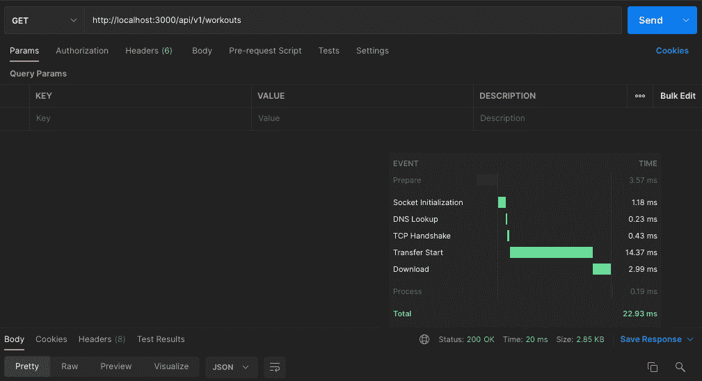

正如你所看到的，我们的 API 用了 22.93 毫秒来响应。一旦我们的缓存再次变空(两分钟后)，它必须再次被填充。这发生在我们的第一个请求中。

所以在上面的例子中，数据不是从我们的缓存中提供的。它从数据库中取“常规”方式，并填满了我们的缓存。

现在，对于我们的第二个请求，我们收到了更短的响应时间，因为它是直接由缓存提供的:

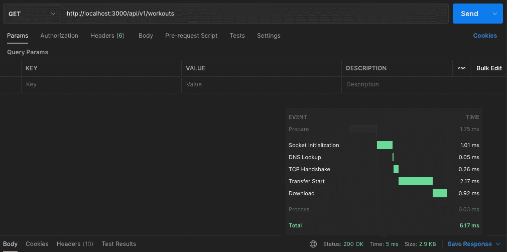

我们的服务速度比之前的要求快了三倍！多亏了我们的缓存。

在我们的示例中，我们只缓存了一条路由，但是您也可以通过如下实现来缓存所有路由:

```
// In src/index.js
const express = require("express");
const bodyParser = require("body-parser");
// *** ADD ***
const apicache = require("apicache");
const v1WorkoutRouter = require("./v1/routes/workoutRoutes");

const app = express();
// *** ADD ***
const cache = apicache.middleware;
const PORT = process.env.PORT || 3000;

app.use(bodyParser.json());
// *** ADD ***
app.use(cache("2 minutes"));
app.use("/api/v1/workouts", v1WorkoutRouter);

app.listen(PORT, () => {
  console.log(`API is listening on port ${PORT}`);
}); 
```

谈到缓存，我想在这里指出一件重要的事情。虽然它似乎为您解决了许多问题，但它也可能给您的应用程序带来一些问题。

使用缓存时，您需要注意以下几点:

*   您必须始终确保缓存中的数据是最新的，因为您不想提供过时的数据
*   在处理第一个请求时，缓存将被填满，并且会有更多的请求进入，您必须决定是否延迟其他请求并从缓存中提供数据，或者它们是否也像第一个请求一样直接从数据库中接收数据
*   如果您选择像 Redis 这样的分布式缓存，这是您的基础设施中的另一个组件(所以您必须问问自己使用它是否真的有意义)

通常是这样做的:

我喜欢以尽可能简单和干净的方式开始我建造的一切。API 也是如此。

当我开始构建一个 API，并且没有特别的理由立即使用一个缓存时，我会把它放在一边，看看随着时间的推移会发生什么。当有理由使用缓存时，我可以实现它。

### 良好的安全实践

哇！到目前为止，这是一次相当棒的旅程。我们已经触及了许多要点，并相应地扩展了我们的 API。

我们已经讨论了提高 API 可用性和性能的最佳实践。安全性也是 API 的一个关键因素。你可以构建最好的 API，但是当它是运行在服务器上的易受攻击的软件时，它就变得无用和危险了。

第一个也是绝对必须的是使用 SSL/TLS，因为它是当今互联网通信的标准。对于 API 来说，在客户端和我们的 API 之间发送私有数据更加重要。

如果您已经获得了只对经过身份验证的用户可用的资源，您应该使用身份验证检查来保护它们。

例如，在 Express 中，您可以将它实现为中间件，就像我们对特定路由的缓存所做的那样，并在请求访问资源之前首先检查请求是否经过了身份验证。

也可能有我们不想让每个用户请求的资源或与我们的 API 的交互。那么你应该为你的用户想出一个角色系统。因此，您必须向该路由添加另一个检查逻辑，并验证用户是否有权访问该资源。

当我们只希望特定用户(如教练)创建、更新和删除我们的锻炼和记录时，用户角色在我们的用例中也是有意义的。阅读可以面向所有人(也包括“正式”会员)。

这可以在我们用来保护路由的另一个中间件中处理。例如，我们将创建新健身程序的请求发送到/api/v1/workouts。

在第一个中间件中，我们将检查用户是否经过身份验证。如果这是真的，我们将进入下一个中间件，这将是一个检查用户的角色。如果用户具有访问该资源的适当角色，则请求将被传递给相应的控制器。

在路由处理程序中，它看起来像这样:

```
// In src/v1/routes/workoutRoutes.js
...

// Custom made middlewares
const authenticate = require("../../middlewares/authenticate");
const authorize = require("../../middlewares/authorize");

router.post("/", authenticate, authorize, workoutController.createNewWorkout);

...
```

要进一步阅读并获得更多关于该主题的最佳实践，我建议阅读[这篇文章](https://restfulapi.net/security-essentials/)。

### 正确记录您的 API

我知道文档肯定不是开发人员喜欢的任务，但却是必须要做的事情。尤其是涉及到 API 的时候。

有人说:

> “API 和它的文档一样好”

我认为这种说法很有道理，因为如果一个 API 没有被很好地记录，它就不能被正确地使用，因此变得毫无用处。文档也让开发人员的生活变得更加轻松。

永远记住，文档通常是用户与 API 的第一次交互。用户越快理解文档，他们就能越快使用 API。

所以，我们的工作就是实现一个好的和精确的文档。有一些很棒的工具让我们的生活变得更容易。

像在计算机科学的其他领域一样，也有一些用于记录 API 的标准，叫做 [OpenAPI 规范](https://swagger.io/specification/)。

让我们看看如何创建一些证明该规范的文档。我们将使用 [swagger-ui-express](https://www.npmjs.com/package/swagger-ui-express) 和 [swagger-jsdoc](https://www.npmjs.com/package/swagger-jsdoc) 包来完成这个任务。一会儿你会惊讶于这有多棒！

首先，我们为文档设置了一个简单的结构。因为我们计划拥有不同版本的 API，所以文档也会有所不同。这就是为什么我想定义我们的 swagger 文件来在相应的版本文件夹中旋转我们的文档。

```
# Install required npm packages 
npm i swagger-jsdoc swagger-ui-express 

# Create a new file to setup the swagger docs 
touch src/v1/swagger.js
```

```
// In src/v1/swagger.js
const swaggerJSDoc = require("swagger-jsdoc");
const swaggerUi = require("swagger-ui-express");

// Basic Meta Informations about our API
const options = {
  definition: {
    openapi: "3.0.0",
    info: { title: "Crossfit WOD API", version: "1.0.0" },
  },
  apis: ["./src/v1/routes/workoutRoutes.js", "./src/database/Workout.js"],
};

// Docs in JSON format
const swaggerSpec = swaggerJSDoc(options);

// Function to setup our docs
const swaggerDocs = (app, port) => {
  // Route-Handler to visit our docs
  app.use("/api/v1/docs", swaggerUi.serve, swaggerUi.setup(swaggerSpec));
  // Make our docs in JSON format available
  app.get("/api/v1/docs.json", (req, res) => {
    res.setHeader("Content-Type", "application/json");
    res.send(swaggerSpec);
  });
  console.log(
    `Version 1 Docs are available on http://localhost:${port}/api/v1/docs`
  );
};

module.exports = { swaggerDocs }; 
```

因此，设置非常简单。我们已经定义了 API 的一些基本元数据，创建了 JSON 格式的文档，并创建了一个使我们的文档可用的函数。

为了控制一切是否正常运行，我们将一条简单的消息记录到控制台，在那里我们可以找到我们的文档。

这将是我们将在根文件中使用的函数，我们在根文件中创建了 Express 服务器，以确保文档也能启动。

```
// In src/index.js
const express = require("express");
const bodyParser = require("body-parser");
const v1WorkoutRouter = require("./v1/routes/workoutRoutes");
// *** ADD ***
const { swaggerDocs: V1SwaggerDocs } = require("./v1/swagger");

const app = express();
const PORT = process.env.PORT || 3000;

app.use(bodyParser.json());
app.use("/api/v1/workouts", v1WorkoutRouter);

app.listen(PORT, () => {
  console.log(`API is listening on port ${PORT}`);
  /// *** ADD ***
  V1SwaggerDocs(app, PORT);
}); 
```

现在，您应该可以看到您的终端内部正在运行开发服务器:

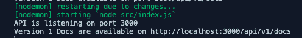

当您访问 localhost:3000/api/v1/docs 时，您应该已经看到了我们的 docs 页面:

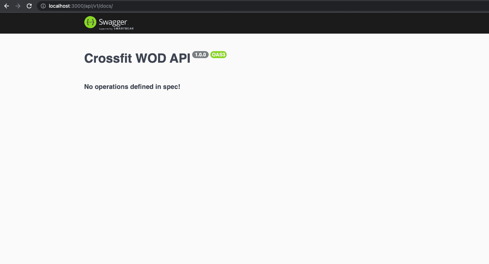

每次我都惊讶于这是多么的有效。现在，基本结构已经设置好了，我们可以开始为我们的端点实现文档了。我们走吧！

当您查看我们的 swagger.js 文件中的 **options.apis** 时，您会看到我们已经在数据库文件夹中包含了锻炼路线和锻炼文件的路径。这是在设置中最重要的事情，将使整个魔术发生。

在我们的 swagger 选项中定义这些文件将允许我们使用引用 OpenAPI 并具有 yaml 文件中的语法的注释，这是设置我们的文档所必需的。

现在我们已经准备好为我们的第一个端点创建文档了！让我们直接开始吧。

```
// In src/v1/routes/workoutRoutes.js
...

/**
 * @openapi
 * /api/v1/workouts:
 *   get:
 *     tags:
 *       - Workouts
 *     responses:
 *       200:
 *         description: OK
 *         content:
 *           application/json:
 *             schema:
 *               type: object
 *               properties:
 *                 status:
 *                   type: string
 *                   example: OK
 *                 data:
 *                   type: array 
 *                   items: 
 *                     type: object
 */
router.get("/", cache("2 minutes"), workoutController.getAllWorkouts);

...
```

这基本上就是为我们的 swagger 文档添加端点的全部魔力。你可以在他们的[伟大文档](https://swagger.io/docs/specification/about/)中查找描述一个端点的所有规范。

当您重新加载您的文档页面时，您应该看到以下内容:

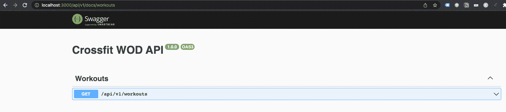

如果您已经使用过具有 OpenAPI 文档的 API，这应该看起来非常熟悉。这是一个视图，其中列出了我们所有的端点，您可以扩展每个端点以获得更多相关信息。


当您仔细观察我们的响应时，您会发现我们没有定义正确的返回值，因为我们只是说我们的“数据”属性将是一个空对象数组。

这就是模式发挥作用的地方。

```
// In src/databse/Workout.js
...

/**
 * @openapi
 * components:
 *   schemas:
 *     Workout:
 *       type: object
 *       properties:
 *         id: 
 *           type: string
 *           example: 61dbae02-c147-4e28-863c-db7bd402b2d6
 *         name: 
 *           type: string
 *           example: Tommy V  
 *         mode:
 *           type: string
 *           example: For Time
 *         equipment:
 *           type: array
 *           items:
 *             type: string
 *           example: ["barbell", "rope"]
 *         exercises:
 *           type: array
 *           items:
 *             type: string
 *           example: ["21 thrusters", "12 rope climbs, 15 ft", "15 thrusters", "9 rope climbs, 15 ft", "9 thrusters", "6 rope climbs, 15 ft"]
 *         createdAt:
 *           type: string
 *           example: 4/20/2022, 2:21:56 PM
 *         updatedAt: 
 *           type: string
 *           example: 4/20/2022, 2:21:56 PM
 *         trainerTips:
 *           type: array
 *           items:
 *             type: string
 *           example: ["Split the 21 thrusters as needed", "Try to do the 9 and 6 thrusters unbroken", "RX Weights: 115lb/75lb"]
 */

...
```

在上面的例子中，我们已经创建了第一个模式。通常，该定义位于您定义数据库模型的模式或模型文件中。

如你所见，这也很简单。我们已经定义了组成健身程序的所有属性，包括类型和示例。

您可以再次访问我们的文档页面，我们将收到另一个包含我们的模式的部分。

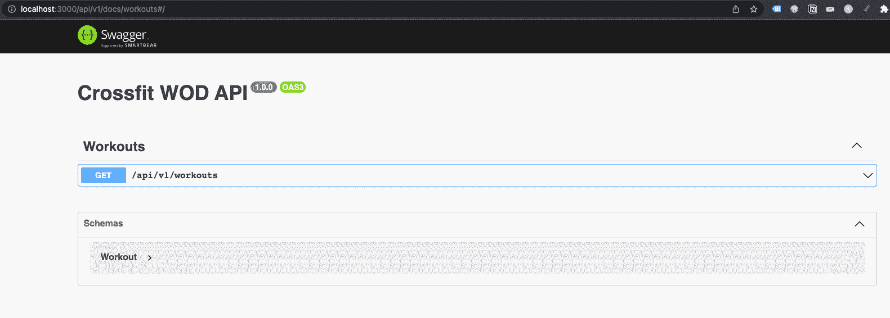

现在可以在端点的响应中引用这个模式。

```
// In src/v1/routes/workoutRoutes.js
...

/**
 * @openapi
 * /api/v1/workouts:
 *   get:
 *     tags:
 *       - Workouts
 *     responses:
 *       200:
 *         description: OK
 *         content:
 *           application/json:
 *             schema:
 *               type: object
 *               properties:
 *                 status:
 *                   type: string
 *                   example: OK
 *                 data:
 *                   type: array 
 *                   items: 
 *                     $ref: "#/components/schemas/Workout"
 */
router.get("/", cache("2 minutes"), workoutController.getAllWorkouts);

...
```

仔细看看我们在“项目”下的评论底部。我们使用“$ref”创建一个引用，并引用我们在训练文件中定义的模式的路径。

现在，我们可以在回答中展示完整的锻炼。

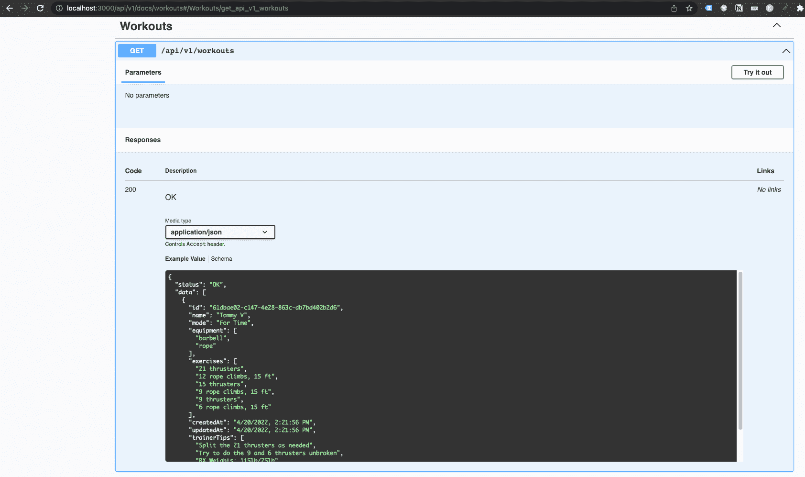

很酷，对吧？你可能会认为“手工输入这些评论可能是一项单调乏味的任务”。

这可能是真的，但是这样想。作为 API 开发人员，代码库中的那些注释也是很好的文档。当您想了解特定端点的文档时，您不必总是访问文档。你可以在源代码的某个地方查找。

记录端点也有助于你更好地理解它们，并且“迫使”你去想你可能已经忘记实现的任何事情。

如你所见，我确实忘记了一些事情。可能的错误响应和查询参数仍然缺失！

让我们来解决这个问题:

```
// In src/v1/routes/workoutRoutes.js
...

/**
 * @openapi
 * /api/v1/workouts:
 *   get:
 *     tags:
 *       - Workouts
 *     parameters:
 *       - in: query
 *         name: mode
 *         schema:
 *           type: string
 *         description: The mode of a workout
 *     responses:
 *       200:
 *         description: OK
 *         content:
 *           application/json:
 *             schema:
 *               type: object
 *               properties:
 *                 status:
 *                   type: string
 *                   example: OK
 *                 data:
 *                   type: array 
 *                   items: 
 *                     $ref: "#/components/schemas/Workout"
 *       5XX:
 *         description: FAILED
 *         content:
 *           application/json:
 *             schema:
 *               type: object
 *               properties:
 *                 status: 
 *                   type: string
 *                   example: FAILED
 *                 data:
 *                   type: object
 *                   properties:
 *                     error:
 *                       type: string 
 *                       example: "Some error message"
 */
router.get("/", cache("2 minutes"),  workoutController.getAllWorkouts);

...
```

当你在“tags”下查看我们的注释顶部时，你可以看到我添加了另一个名为“parameters”的键，在这里我定义了用于过滤的查询参数。

我们的文件现在显示正确:

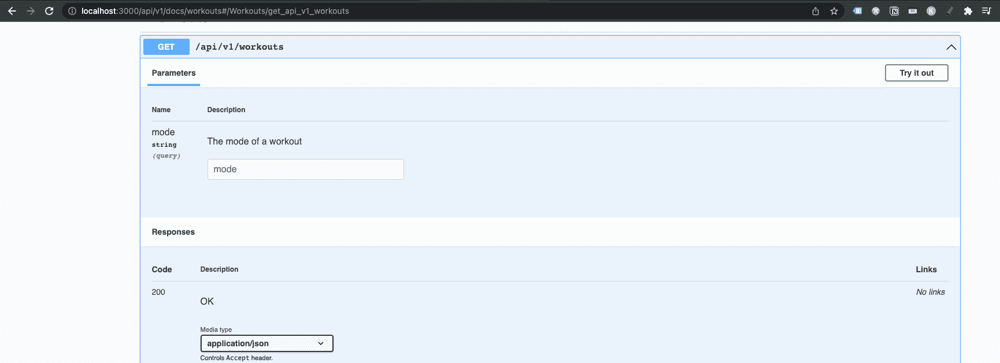

为了记录可能的错误情况，我们现在只抛出一个 5XX 错误。因此，在“响应”下，您可以看到我还为此定义了另一个文档。

在我们的文档页面上，它看起来像这样:

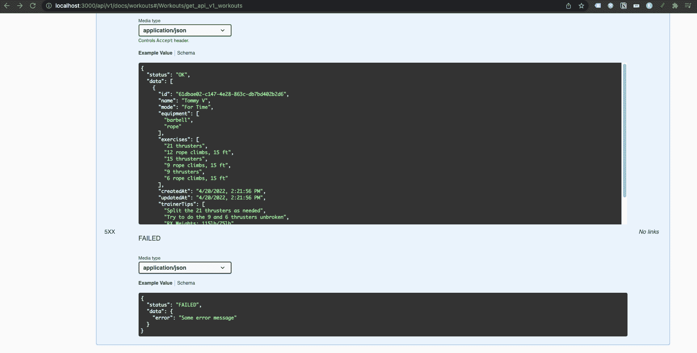

太神奇了！我们刚刚为一个端点创建了完整的文档。我强烈建议您自己实现其余的端点，以免弄脏自己的手。在这个过程中你会学到很多东西！

正如您可能已经看到的，记录您的 API 不一定总是令人头痛的事情。我认为我向您介绍的工具可以减少您的总体工作量，并且设置起来非常简单。

所以我们可以专注于重要的事情，文档本身。在我看来，swagger/OpenAPI 的文档非常好，互联网上有很多很好的例子。

因为太多的“额外”工作而没有文档不应该再成为理由。

## 结论

呃，那真是一次有趣的旅行。我真的很喜欢为你写这篇文章，也学到了很多东西。

可能有一些重要的最佳实践，而其他的似乎不适用于您当前的情况。这很好，因为正如我之前所说的，每个工程师都有责任挑选出适用于他们当前情况的最佳实践。

我尽最大努力将我迄今为止的所有最佳实践融合在一起，同时构建我们自己的 API。这让我觉得很有趣！

我希望收到任何形式的反馈。如果你有什么想告诉我的(好的或坏的)，请不要犹豫，尽管开口:

这是我的 Instagram(你也可以跟随我成为软件开发人员的旅程)

下次见！