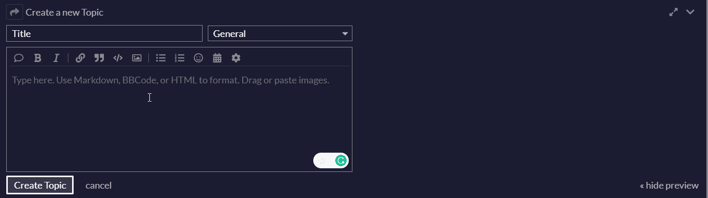
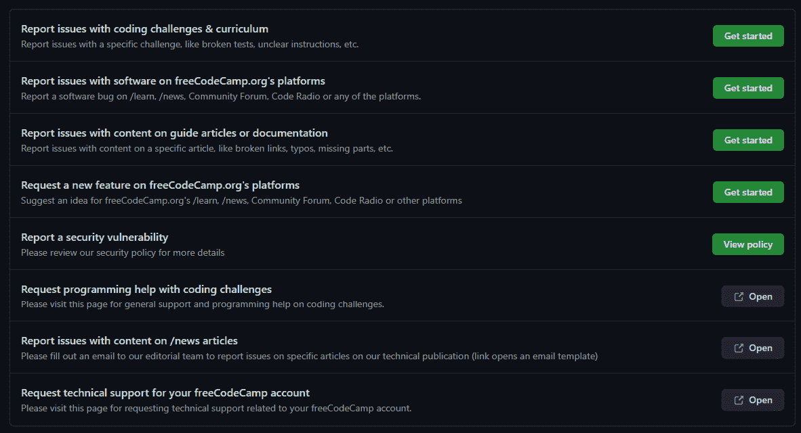
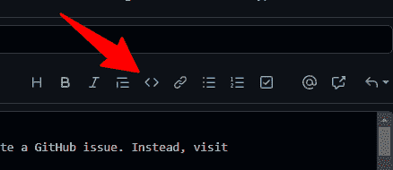

# 如何向 freeCodeCamp 报告 Bug

> 原文：<https://www.freecodecamp.org/news/how-to-report-a-bug-to-freecodecamp/>

感谢您花时间报告 freeCodeCamp 的问题。

如果您认为您在 freeCodeCamp 上发现了一个错误，请按照以下步骤解决您的问题:

## 在编辑器中重置代码

尝试使用页面上的重置按钮在编辑器中重置代码。如果您以某种方式更改了一些影响挑战的代码，这将解决大多数问题。

重置会将代码清除到第一次向您提出挑战时的原始状态。

## 使用编码键盘或手机应用程序

试着阅读这篇关于如何在手机上使用 freeCodeCamp 的文章。或者，如果你使用的是安卓设备，检查一下 [freeCodeCamp 应用](https://play.google.com/store/apps/details?id=org.freecodecamp&gl=US)是否有你想要使用的功能。

## 进行硬刷新

如果页面看起来有任何损坏，请尝试对页面进行硬刷新。这将更新可能已经缓存在浏览器中的任何旧代码。

如果 freeCodeCamp 网站是最近部署的，并且问题来自于此，这将足以修复它。

### 如何进行硬刷新

在有问题的页面上，根据您的操作系统，使用以下组合键触发硬刷新:

*   视窗:`CTRL + F5`
*   苹果/苹果:`Apple + Shift + R or Command + Shift + R`
*   Linux: `F5`

要了解更多，请阅读:[http://refreshyourcache.com/en/cache/ 73](http://refreshyourcache.com/en/cache/)

## 尝试清除浏览器的本地存储

移除所有本地存储的挑战将解决许多与 freeCodeCamp 浏览器崩溃相关的问题

### 在 Chrome 中:

*   在 freecodecamp.org 上打开你的控制台
*   视窗:`Ctrl` + `Shift` + `J`
*   Mac OS: `Cmd` + `Opt` + `J`
*   转到资源选项卡(Chrome)。
*   在那里，单击右侧导航栏中的“本地存储”链接。
*   删除右侧的所有条目，或者在浏览器的控制台中运行此命令来清除本地存储中的所有条目:`localStorage.clear();`
*   看看这是否能解决您的问题

### 如何从本地存储中删除单个挑战

也许你不想因为其他挑战或类似的事情而丢失代码。这种方法只会从浏览器的本地存储中删除有问题的质询。

#### 在 Chrome 中:

*   在**freecodecamp.org**，打开你的开发者工具。
*   更多工具>开发者工具(或`Ctrl` + `Shift` + `I` (Windows)、`Cmd` + `Opt` + `I` (Mac))
*   导航至`Resources`选项卡
*   展开左窗格中的`Local Storage`项
*   选择`http://www.freecodecamp.org`
*   在右窗格中找到要删除其数据的挑战
*   右键单击所需的挑战并选择`Delete`

#### 在 Firefox 中:

*   在**freecodecamp.org**上，用
*   `Ctrl` + `Shift` + `K`
*   从那里，直接使用控制台:
*   键入`console.log(localStorage);`并点击`Enter`。
*   点击`Storage`链接。
*   右侧将出现**存储**面板。
*   过滤结果，找出导致问题的算法、前端项目或挑战。
*   找到后，将鼠标放在上面，点击右边的`x`。
*   移除后，检查问题是否已解决。如有必要，刷新或关闭并打开浏览器。

**注意:**这也可以用[存储检查器](https://developer.mozilla.org/en-US/docs/Tools/Storage_Inspector)来完成，但是当有这么多值时，看起来像是 Firefox 挂起了。

## 检查问题是否是由您的浏览器扩展引起的

请尝试停用您的浏览器扩展，或者尝试在浏览器私人模式下打开该页面。

如果通过这种方式解决了问题，您将需要在有罪扩展中为 freeCodeCamp 添加一个例外，或者在您使用 freeCodeCamp 网站时将其关闭。

## 阅读支持常见问题

[支持常见问题解答](https://www.freecodecamp.org/news/support)为许多常见问题提供解决方案。如果上面的步骤不起作用或者与您的问题无关，请尝试通读这篇文章。

## 在论坛上求助

您可能已经到达这里，但仍有您的问题。现在是时候向其他人类寻求帮助了。

[在论坛上打开一个描述您的问题的主题](http://forum.freecodecamp.com/)。尽量提供更多信息，包括您的代码和挑战链接，或受影响页面的链接，以及您的操作系统(如果您正在接受挑战，您可以使用“寻求帮助”按钮创建一个预编译的帖子，其中已经包含了这些问题，您可以在其中添加您对问题的描述和最终的截图)。

您的代码可能会出现问题，或者 freeCodeCamp 可能会出现短暂的问题。

### 如何在论坛上格式化代码

当您在论坛帖子中输入代码块时，请在代码块前单独添加一行三个反勾号，并在代码块后单独添加一行三个反勾号，以便于阅读。

您也可以使用编辑器中的“预格式化文本”工具(`</>`)在文本周围添加反勾。

## 在 GitHub 上创建一个问题

论坛或许能帮到你，也可能把你送到 GitHub。

在 GitHub 上创建一个新问题之前，尝试在现有问题周围搜索，看看是否有人已经报告了类似的事情。

### 如何在 GitHub 上搜索问题

1.  转到 freeCodeCamp 的 [Github 问题](https://github.com/FreeCodeCamp/FreeCodeCamp/issues)页面。
2.  使用搜索栏搜索可能与您的问题相关的已归档问题。
3.  如果你找到了，就去读吧！您可以通过点击侧边栏中的`Subscribe`订阅获取关于该特定问题的更新。您可以在最能描述您的问题的帖子上添加回应，或者如果您有什么要添加的，您也可以对该问题进行评论。
4.  如果你找不到任何相关的问题，你应该创建一个新的 GitHub 问题。

### 如何在 GitHub 上创建新问题

**重要提示:**
在你报告一个新问题之前，一定要从聊天室或论坛的某人那里获得第三方的确认。请记住，问题追踪器严格用于报告错误或改进，它不是一个寻求任何帮助来解决挑战的地方。

精心设计一个好的问题会让开发团队更容易复制和解决你的问题。按照以下步骤做好它:

*   进入 freeCodeCamp 的 [GitHub 问题](https://github.com/FreeCodeCamp/FreeCodeCamp/issues)页面，点击`New Issue`。
*   从列表中选择正确的问题类型

*   **有一个有用的头衔。**写一个描述问题的有意义的标题。一些很好的例子是`Logging in from the News and Field Guide pages doesn't redirect properly (using e-mail)`和`Typo: "for" instead of "while" loop`；不好的例子包括`A bug, HELP!!!11`和`I found this bug in a Challenge`。
*   保持标题相对简短，因为描述是为了提供进一步的信息。一个例子是缩短长的挑战名称，所以不写`Test case bug in 'Challenge: Check Radio Buttons and Checkboxes by Default'`，你可能想写`Test case bug in 'Radio Buttons' Challenge`。
*   在正文中，**提供一个链接**，指向您遇到此问题的页面。
*   **描述问题**和**提供步骤**，以便开发人员可以尝试重现问题。包括您的操作系统和浏览器版本。当提及其他问题或拉动请求时，只需写下#issue/pr-number。
*   使用适当的代码格式粘贴任何相关的代码
*   **对该问题进行截图**，并将其包含在帖子中。
*   点击`Submit New Issue`就大功告成了！您将自动订阅任何更新或未来评论的通知。

### 如何格式化 GitHub 上的代码

您需要在代码块前使用三个反勾号，在代码块后使用三个反勾号。

您也可以选择您的代码块，并使用 GitHub 编辑器中的“添加代码”按钮。

通过这种方式，您的代码将被格式化，并且更加易读。

由 Ilenia Magoni，freeCodeCamp 作者和意大利本地化和社区负责人汇编和编辑的资源。