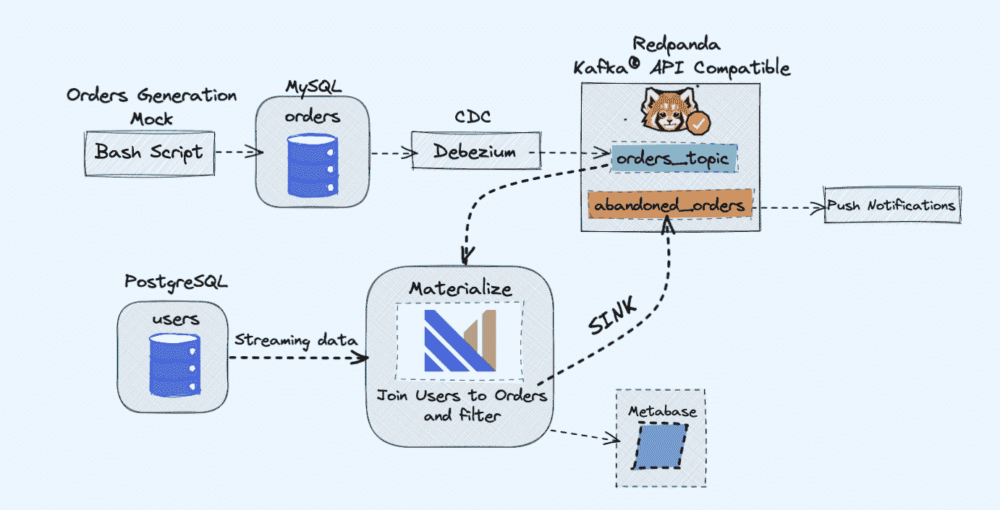

# 如何在实时物化视图中连接 MySQL 和 Postgres

> 原文：<https://www.freecodecamp.org/news/how-to-join-mysql-and-postgres-in-a-live-materialized-view/>

当你在一个包含许多微服务的项目中工作时，它也可能包含多个数据库。

例如，您可能有一个 [MySQL 数据库](https://www.mysql.com)和一个 [PostgreSQL 数据库](https://www.postgresql.org)，它们都运行在不同的服务器上。

通常，要连接来自两个数据库的数据，您必须引入一个新的微服务来将数据连接在一起。但是这将增加系统的复杂性。

在本教程中，我们将使用 Materialize 在一个实时物化视图中连接 MySQL 和 Postgres。然后，我们将能够使用标准 SQL 直接查询，并实时从两个数据库获得结果。

[Materialize](https://github.com/MaterializeInc/materialize/) 是一个源代码可用的流数据库，用 Rust 编写，当数据改变时，它在内存中维护 SQL 查询(物化视图)的结果。

本教程包括一个演示项目，您可以开始使用`docker-compose`。

我们将要使用的演示项目将监控我们的模拟网站上的订单。它将生成事件，这些事件可以在稍后用于在购物车被长时间废弃时发送通知。

演示项目的架构如下:



## 先决条件

我们将在演示中使用的所有服务都将在 Docker 容器中运行，这样您就不必在笔记本电脑或服务器上安装任何额外的服务，而只需安装 Docker 和 Docker Compose。

如果你还没有安装 Docker 和 Docker Compose，你可以按照这里的官方说明来做:

*   [安装对接器](https://docs.docker.com/get-docker/)
*   安装坞站复合

## 概观

如上图所示，我们将拥有以下组件:

*   持续生成订单的模拟服务。
*   订单将被存储在一个 MySQL 数据库中。
*   随着数据库写操作的发生， **Debezium** 将 MySQL 中的变化传输到 **Redpanda** 主题中。
*   我们也将有一个 **Postgres** 数据库，在那里我们可以得到我们的用户。
*   然后，我们将这个 Redpanda 主题与来自 Postgres 数据库的用户一起直接摄取到**物化**中。
*   在 Materialize 中，我们将把订单和用户连接在一起，进行一些过滤，并创建一个物化视图来显示废弃的购物车信息。
*   然后，我们将创建一个接收器，将废弃的购物车数据发送到一个新的 Redpanda 主题。
*   最后，我们将使用**元数据库**来可视化数据。
*   稍后，您可以使用新主题中的信息向用户发送通知，提醒他们有一个废弃的购物车。

作为一个旁注，你可以用卡夫卡而不是 Redpanda。我只是喜欢 Redpanda 带来的简单性，因为您可以运行单个 Redpanda 实例，而不是所有的 Kafka 组件。

## 如何运行演示

首先，从克隆存储库开始:

```
git clone https://github.com/bobbyiliev/materialize-tutorials.git 
```

之后，您可以访问目录:

```
cd materialize-tutorials/mz-join-mysql-and-postgresql 
```

让我们首先运行 Redpanda 容器:

```
docker-compose up -d redpanda 
```

构建图像:

```
docker-compose build 
```

最后，启动所有服务:

```
docker-compose up -d 
```

为了启动 Materialize CLI，您可以运行以下命令:

```
docker-compose run mzcli 
```

这只是一个预装了`postgres-client`的 Docker 容器的快捷方式。如果你已经有了`psql`，你可以运行`psql -U materialize -h localhost -p 6875 materialize`来代替。

### 如何创建物化的卡夫卡源

现在您已经在物化 CLI 中，让我们将`mysql.shop`数据库中的`orders`表定义为 Redpanda 源:

```
CREATE SOURCE orders
FROM KAFKA BROKER 'redpanda:9092' TOPIC 'mysql.shop.orders'
FORMAT AVRO USING CONFLUENT SCHEMA REGISTRY 'http://redpanda:8081'
ENVELOPE DEBEZIUM; 
```

如果您要通过运行以下语句来检查来自`orders`源的可用列:

```
SHOW COLUMNS FROM orders; 
```

您将能够看到，当 Materialize 从 Redpanda 注册表中提取消息模式数据时，它知道用于每个属性的列类型:

```
 name      | nullable |   type
--------------+----------+-----------
 id           | f        | bigint
 user_id      | t        | bigint
 order_status | t        | integer
 price        | t        | numeric
 created_at   | f        | text
 updated_at   | t        | timestamp 
```

### 如何创建物化视图

接下来，我们将创建第一个物化视图，从`orders` Redpanda 数据源获取所有数据:

```
CREATE MATERIALIZED VIEW orders_view AS
SELECT * FROM orders; 
```

```
CREATE MATERIALIZED VIEW abandoned_orders AS
    SELECT
        user_id,
        order_status,
        SUM(price) as revenue,
        COUNT(id) AS total
    FROM orders_view
    WHERE order_status=0
    GROUP BY 1,2; 
```

您现在可以使用`SELECT * FROM abandoned_orders;`来查看结果:

```
SELECT * FROM abandoned_orders; 
```

有关创建物化视图的更多信息，请查看物化文档的[物化视图](https://materialize.com/docs/sql/create-materialized-view/)部分。

### 如何创建 Postgres 源

有两种方法可以在 Materialize 中创建 Postgres 源:

*   使用 Debezium，就像我们使用 MySQL 源代码一样。
*   使用 Postgres Materialize 源代码，它允许您将 Materialize 直接连接到 Postgres，这样您就不必使用 Debezium。

在这个演示中，我们将使用 Postgres Materialize 源代码来演示如何使用它，但是也可以随意使用 Debezium。

要创建 Postgres 物化源，请运行以下语句:

```
CREATE MATERIALIZED SOURCE "mz_source" FROM POSTGRES
CONNECTION 'user=postgres port=5432 host=postgres dbname=postgres password=postgres'
PUBLICATION 'mz_source'; 
```

上述声明的简要概述:

*   `MATERIALIZED`:具体化 PostgreSQL 源的数据。所有的数据都保存在内存中，使数据源可以直接选择。
*   `mz_source`:PostgreSQL 源的名称。
*   `CONNECTION`:PostgreSQL 连接参数。
*   `PUBLICATION`:PostgreSQL 发布，包含要流化以实现的表。

一旦我们创建了 PostgreSQL 源，为了能够查询 PostgreSQL 表，我们需要创建表示上游发布的原始表的视图。

在我们的例子中，我们只有一个名为`users`的表，所以我们需要运行的语句是:

```
CREATE VIEWS FROM SOURCE mz_source (users); 
```

要查看可用视图，请执行以下语句:

```
SHOW FULL VIEWS; 
```

完成后，您可以直接查询新视图:

```
SELECT * FROM users; 
```

接下来，让我们继续创建几个视图。

### 如何打造卡夫卡水槽

[Sinks](https://materialize.com/docs/sql/create-sink/) 让您将数据从 Materialize 发送到外部源。

在这个演示中，我们将使用[小熊猫](https://materialize.com/docs/third-party/redpanda/)。

Redpanda 与 Kafka API 兼容，Materialize 可以处理来自它的数据，就像它处理来自 Kafka 源的数据一样。

让我们创建一个物化视图，它将保存所有大量未付款订单:

```
 CREATE MATERIALIZED VIEW high_value_orders AS
      SELECT
        users.id,
        users.email,
        abandoned_orders.revenue,
        abandoned_orders.total
      FROM users
      JOIN abandoned_orders ON abandoned_orders.user_id = users.id
      GROUP BY 1,2,3,4
      HAVING revenue > 2000; 
```

如您所见，这里我们实际上加入了直接从 Postgres 源获取数据的`users`视图和从 Redpanda 主题获取数据的`abandond_orders`视图。

让我们创建一个接收器，我们将在其中发送上述物化视图的数据:

```
CREATE SINK high_value_orders_sink
    FROM high_value_orders
    INTO KAFKA BROKER 'redpanda:9092' TOPIC 'high-value-orders-sink'
    FORMAT AVRO USING
    CONFLUENT SCHEMA REGISTRY 'http://redpanda:8081'; 
```

现在，如果您要连接到 Redpanda 容器并使用`rpk topic consume`命令，您将能够从主题中读取记录。

然而，目前我们还不能用`rpk`预览结果，因为它是 AVRO 格式的。Redpanda 将来很可能会实现这一点，但目前，我们可以将主题流回 Materialize 以确认格式。

首先，获取已经自动生成的主题的名称:

```
SELECT topic FROM mz_kafka_sinks; 
```

输出:

```
 topic
-----------------------------------------------------------------
 high-volume-orders-sink-u12-1637586945-13670686352905873426 
```

关于如何生成主题名称的更多信息，请查看文档[这里](https://materialize.com/docs/sql/create-sink/#kafka-sinks)。

然后从这个 Redpanda 主题创建一个新的物化源:

```
CREATE MATERIALIZED SOURCE high_volume_orders_test
FROM KAFKA BROKER 'redpanda:9092' TOPIC ' high-volume-orders-sink-u12-1637586945-13670686352905873426'
FORMAT AVRO USING CONFLUENT SCHEMA REGISTRY 'http://redpanda:8081'; 
```

确保相应地更改主题名称！

最后，查询这个新的物化视图:

```
SELECT * FROM high_volume_orders_test LIMIT 2; 
```

既然主题中有了数据，就可以让其他服务连接到它并使用它，然后触发电子邮件或警报。

## 如何连接元数据库

为了访问[元数据库](https://materialize.com/docs/third-party/metabase/)实例，如果您在本地运行演示，请访问`http://localhost:3030`,如果您在服务器上运行演示，请访问`http://your_server_ip:3030`。然后按照步骤完成元数据库设置。

确保选择 Materialize 作为数据源。

一旦准备就绪，您将能够像使用标准 PostgreSQL 数据库一样可视化您的数据。

## 如何停止演示

要停止所有服务，请运行以下命令:

```
docker-compose down 
```

## 结论

如您所见，这是一个非常简单的如何使用物化的例子。您可以使用 Materialize 从各种源接收数据，然后将其传输到各种目的地。

## 有用的资源:

*   [T2`CREATE SOURCE: PostgreSQL`](https://materialize.com/docs/sql/create-source/postgres/)
*   [T2`CREATE SOURCE`](https://materialize.com/docs/sql/create-source/)
*   [T2`CREATE VIEWS`](https://materialize.com/docs/sql/create-views)
*   [T2`SELECT`](https://materialize.com/docs/sql/select)