# 设计原则——设计原则列表

> 原文：<https://www.freecodecamp.org/news/design-principles-a-list-of-the-principles-of-design/>

当你开始学习平面设计理论的时候，你可能会惊讶地发现，在设计的时候，你需要遵循一些特定的规则。

这些规则被称为设计原则，在本文中，您将学习 13 个设计原则的基础。

了解什么是设计原则会让你更好地理解如何去创造更和谐的设计和更好的用户体验。

以下是我们将在本指南中介绍的内容:

1.  什么是设计原则？
2.  [设计的 13 个原则](#list)
    1.  [平衡](#balance)
    2.  [品种](#variety)
    3.  [强调](#emphasis)
    4.  [对比](#contrast)
    5.  [层级](#hierarchy)
    6.  [重复](#repetition)
    7.  [图案](#pattern)
    8.  [运动](#movement)
    9.  [节奏](#rhythm)
    10.  [比例](#proportion)
    11.  [对准](#alignment)
    12.  [统一](#unity)
    13.  [空白区域](#white-space)

## 什么是设计原则？

设计原则是一套严格的规则。

设计师遵循这些规则来创造愉快的用户体验和视觉上吸引人的最终产品。

这些规则是帮助设计师在设计中创造和谐与平衡感的工具和指南。

它们保证了可用性以及观众和用户的整体愉悦效果。

## 设计的 13 个原则

### 余额

页面上的每个设计元素都有不同的权重，这取决于其大小、形状或颜色。

该重量被称为*视觉重量*。

设计中的平衡是你如何在构图中安排和放置元素，它是关于分配这些元素的重量。

缺乏平衡的成分意味着一种元素压倒所有其他元素。

为了创造平衡，你需要正确地放置元素。

例如，这可能是一侧的元素比其余部分“重”得多，并且过大，从而使设计看起来不稳定。

有两种类型的平衡:

*   对称平衡
*   不对称平衡

利用**对称平衡**，想象在页面中央画一条看不见的垂直线，将页面分成两边。

线两侧的项目具有均匀分布的视觉重量，并创建一个镜像。

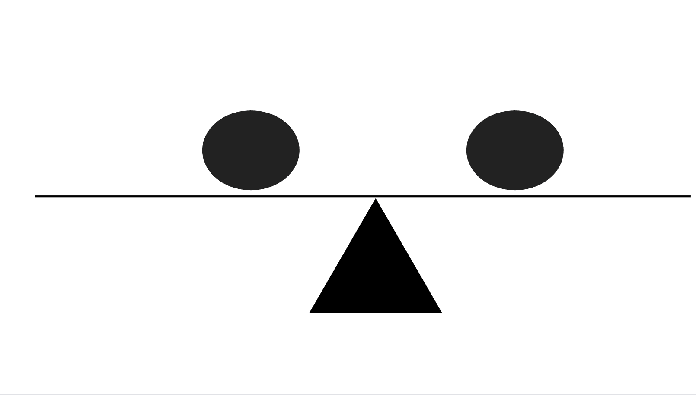

元素的顺序、位置和对齐方式在两边都是相同的，从而在设计中创造了一致性。

**不对称平衡**是对称平衡的反义词。

两侧的元素有不同的排列，因为它们在组合中也有不同的顺序和位置。

尽管每一侧的视觉重量不同，但整体设计在两侧保持了相等的视觉重量。

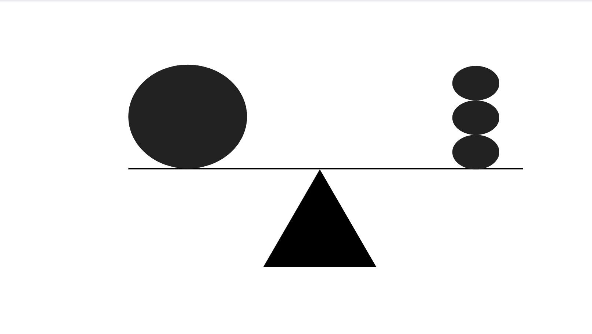

没有镜像，两边看起来都不一样，但是设计还是很稳定的。

例如，不对称设计可以是当三个较轻的元素在一侧相互堆叠，以平衡另一侧的一个较重的元素。

不对称的平衡创造了视觉趣味，并为设计增添了现代感。

### 品种

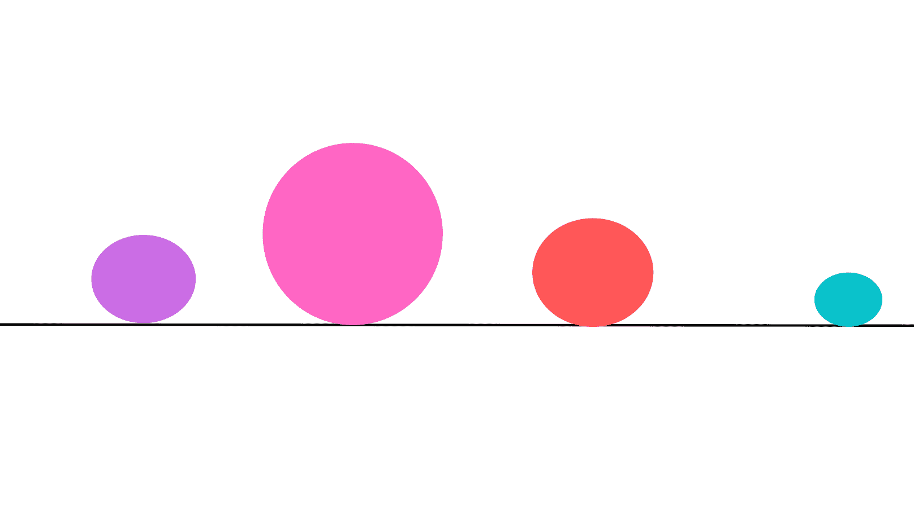

变化创造视觉趣味，防止设计变得单调和可预测。

多样性是通过使用彼此不相似的元素来创造的。

通过使用综艺节目，你有很好的机会保持观众的兴趣和参与度。

设计的多样性是通过使用许多不同的东西来实现的，其中一些是:

*   大小不一，
*   不同的形状，
*   变化的颜色，
*   不同的质地，
*   多变的排版。

### 重点

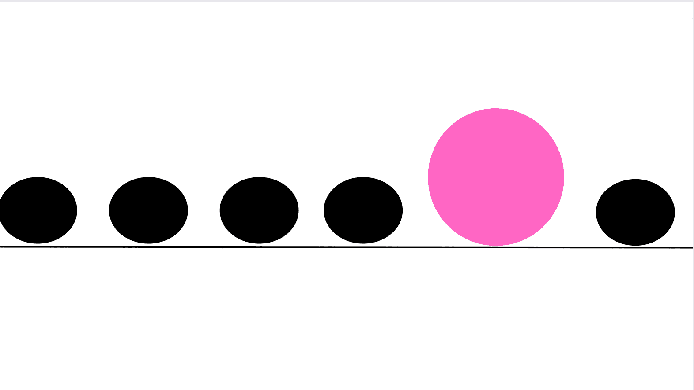

强调的目的是创造一个焦点。

焦点是一个能在第一眼就吸引观众或用户注意力的物体。

当一个设计元素被强调时，意味着这个特定的对象从其他元素中被突出出来，因此具有重大的意义和重要性。

例如，您可以将强调视为一些全大写和粗体的文本。

强调可以是网站的主要标题。

它也可以是某种信息。

你可能想向你的观众传达一些至关重要或具有警示性的东西，并需要确保你的观众首先意识到并关注这些东西。

重点也可以是一个大按钮，在购买的商品下面有一个明亮的颜色——这可以作为访问者的行动号召。

这是你想让别人首先注意到的东西——人们在第一次看到你的作品时需要知道和注意的基本信息。

这是一个需要从设计中脱颖而出的特定内容。

除了文字和颜色，重点是通过尺寸、形状、重量、纹理和位置来实现的。

在强调的时候，要确保不要破坏构图的整体平衡，也不要造成过于强烈和不和谐的效果。

### 对比度

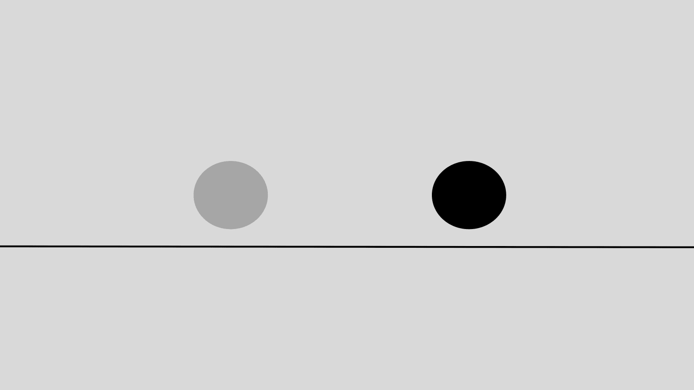

虽然强调是强调一个单一的元素，对比是指两个或两个以上紧密相连的设计元素之间明显的、突出的差异程度。

这种差异可能是一个元素的背景颜色较深，而另一个元素的背景颜色较浅。

也可能是一个元素具有较冷的色调，而另一个元素具有较暖的色调。或者一个元件较大而另一个元件较小。或者在某些文本上使用衬线字体，在另一段文本上使用无衬线字体。

比如说这个网页。

从台式电脑或笔记本电脑浏览页面时，您会看到在右上角有两个按钮可供您点击:

*   “论坛”按钮具有与导航栏的其余部分相同的深色背景颜色，
*   “捐赠”按钮有一个亮黄色的背景色，让它很显眼。

这被认为是对比。有两个截然不同的元素，但其中一个最引人注目，需要你的关注。

总而言之，对比突出了两种截然相反的元素，它们有着截然不同的特征。这种差异必须是显而易见的。

有不同类型的对比，如颜色对比或大小，形状，或纹理对比。

目的是创造变化和兴趣，从而在保持设计平衡的同时创造焦点和重点。

良好的对比与易访问性最佳实践以及为每个人创造可用的产品和服务是密切相关的。有必要考虑到有视觉障碍的人。

再想一个例子。

假设有一个浅灰色背景和一些深灰色文本的元素。然后，有另一个元素具有相同的背景颜色，但有一些黑色文本。

哪个更容易阅读？第二个有黑色文字的。

背景色和前景(文本)色之间有较高的颜色对比度。

第一个元素缺乏对比，这使得阅读文本更加困难。

### 层级

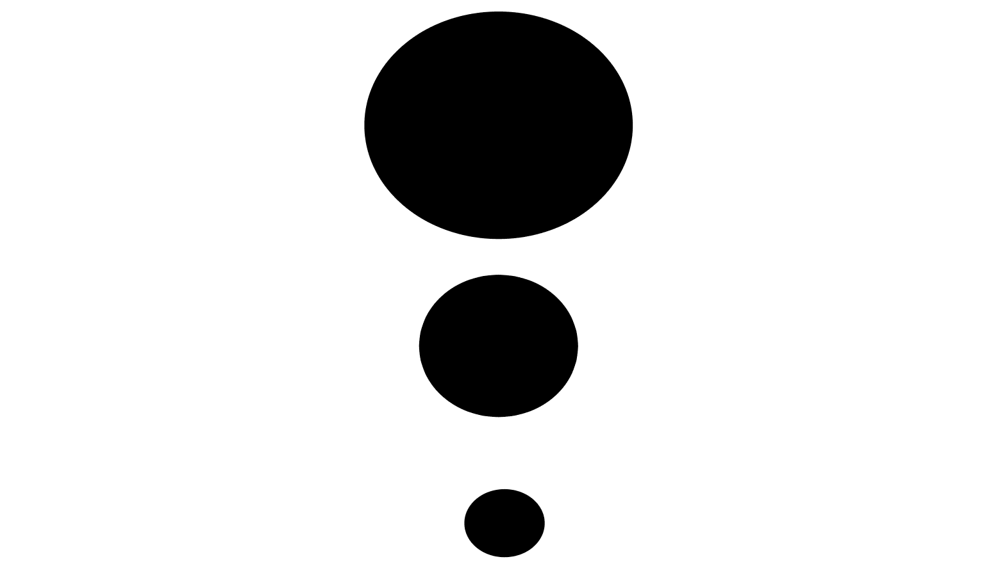

层级按照重要性的顺序组织视觉元素。

层次在设计中的作用是根据内容的逻辑优先级，创建一个可视化的排名系统。它通过创建内容的逻辑流程和排列，帮助观众从最重要的信息到最不重要的信息。

想想网页上元素的典型顺序。

我们从上到下阅读，所以在浏览者开始向下滚动页面之前，他们的眼睛必须首先被基本信息所吸引。

所以这意味着关键信息需要放在页面的顶部——它需要在页面上最突出，排名最高。

举下面这个例子。

在网页的顶部，通常首先是公司的标志。

然后，有一个导航条或下拉菜单，帮助用户决定他们想要与网站的哪个区域进行交互。

还可以有一个搜索栏，让用户输入关键字来搜索特定的主题，节省时间。

然后，可以有一个行动号召或主要标题来强调网页的目的和内容。

然后，可以有一个主要领域，将包含一个副标题与一些文字，然后另一个副标题与更多的文字，等等。

这种顺序创造了视觉组织，并帮助观众区分哪些内容似乎是最重要的，值得他们关注。

它从内容的开头到结尾引导观众-从最高优先级到最低优先级。

元素的位置意味着重要性——最重要的信息总是在页面的较高位置，而如果某些东西在底部，那么它就不那么重要了。

在设计中创建层次的其他方法是使用颜色来创建对比，并以不同的方式改变元素的大小。

如果没有层次结构，所有的内容看起来都是一样的，没有什么东西会突出和突出重要性，这将导致观众的困惑。

### 重复

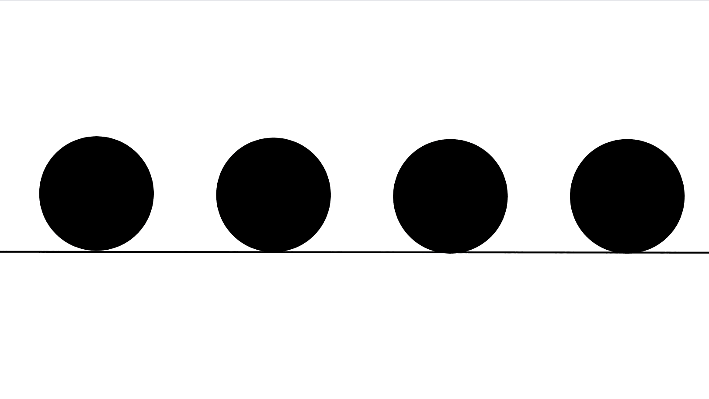

重复是指特定元素在整个设计中重复多次。

重复在设计中的作用是创造一致性和统一性。

重复在看似分离和不同的元素之间创造了关系和关联，并在它们之间创造了一种纽带——一种将一切联系在一起的共同纽带。

为了实现重复，您可以在整个设计中多次使用相同的特定颜色或相同的配色方案。

或者坚持使用特定的字体，或者在页面中使用重复出现的短语。

设计中经常重复的元素是标志，它在创造品牌形象中起着关键的作用。

一个标志会让观众和用户熟悉这个品牌。他们会从其他品牌中识别和区分它的声音和语调。

用户会记住并认同公司愿景和使命的标志。

他们会知道这个品牌是怎么回事。

### 图案

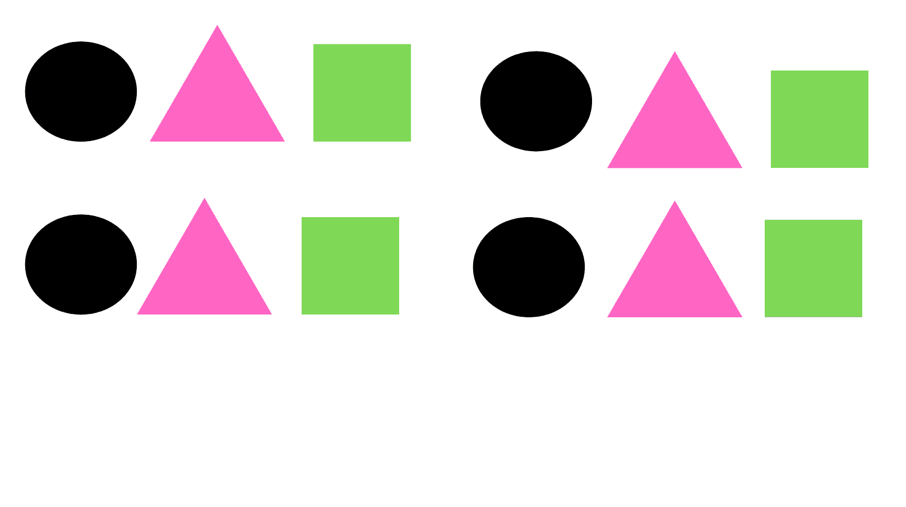

乍一看，模式似乎与重复非常相似，因为它意味着元素在整个页面中重复出现多次。

然而，它们有显著的不同。

重复处理的是在整个设计中重复的相同元素，而模式关注的是在整个作品中以相同方式重复的多个不同的设计元素。

设计中的模式是一个以上元素的重复。

日常生活中图案的一个例子是地砖和壁纸。

web 模式的一个例子是在网站和应用程序中使用背景来创造和谐和有凝聚力的感觉。

### 运动

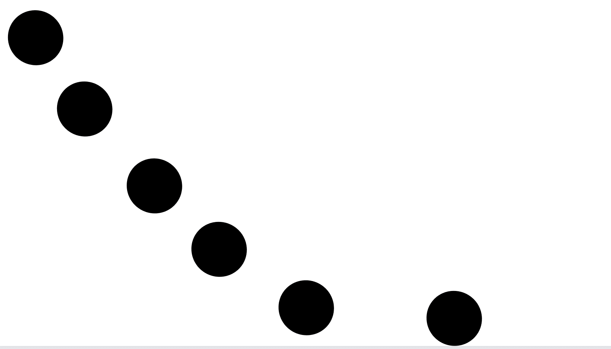
运动是眼睛在观看构图并与之互动时的运动方式。

运动指的是观察者的眼睛在整个设计中的移动方式和路径。

设计师利用运动来引导观众围绕不同的设计元素。

他们为每个时间点创建不同的焦点区域，以有效地抓住观众的注意力，以一种经过深思熟虑的定向序列从一个元素移动到另一个元素。

通常，观众的眼睛首先看到最重要的元素，然后是第二重要的，然后是第三重要的，等等。

一个运动的例子可以是当你站在顶端看一个螺旋楼梯时，你的眼睛会沿着不同的线和边缘移动。

web 上的移动可以通过以下方式创建:

*   动画效果的使用，
*   模糊效果的使用，
*   螺旋效果的使用，
*   线条和边缘的使用，
*   使用不同的方向标志来提供指导，指示观众向左、向右移动他们的焦点，或者向下或向上看。

### 节奏

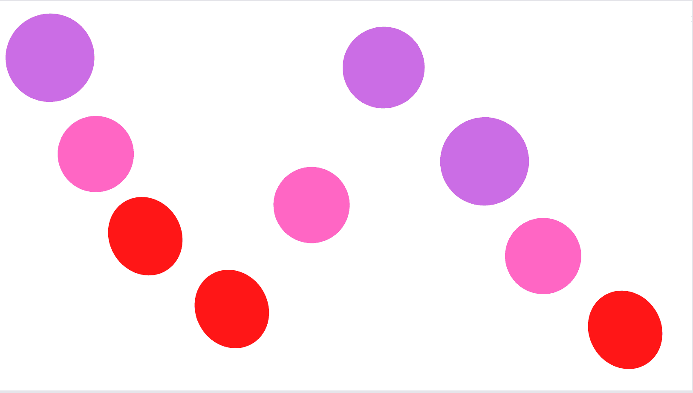

节奏包括重复、变化和运动的结合。

节奏是多个互不相同的设计元素如何以特定的顺序重复。

以相同的顺序和特定的间隔重复或交替一组不同的元素是设计中创造节奏的一种方式。

根据音程的类型，设计中有五种不同类型的节奏:

*   随机节奏，
*   有规律的节奏，
*   流动的节奏，
*   进展节奏，
*   交替节奏。

元素跟随节奏，以有组织的方式移动和流动。

这就像是跟随舞蹈编排或随着音乐节拍移动的感觉。

节奏不是将注意力只集中在设计的一个区域，也不是将观众从一个不同的部分引导到另一个不同的部分，而是将观众的目光移动到整个构图上。

### 比例

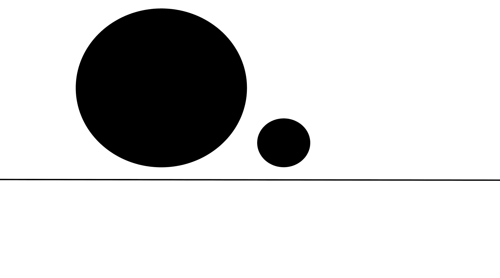

设计中的比例是指两个或两个以上视觉元素的大小和视觉分量。

比例也是那些视觉元素之间的关系。

这种关系是以大小为基础的。它是一个物体的大小与另一个物体的大小进行比较和关联的方式。

本质上，它是元素相对于彼此的大小缩放方式。

例如，比例比较和衡量元素之间的重要性。

假设有两个物体，一个大一些，另一个小得多。

较大的元素会更引人注目，这表明它比较小的元素更重要。

匀称的设计意味着所有元素的大小保持了整个设计的平衡、统一与和谐。

好的比例意味着所有的元素相互之间关系良好。

### 对齐

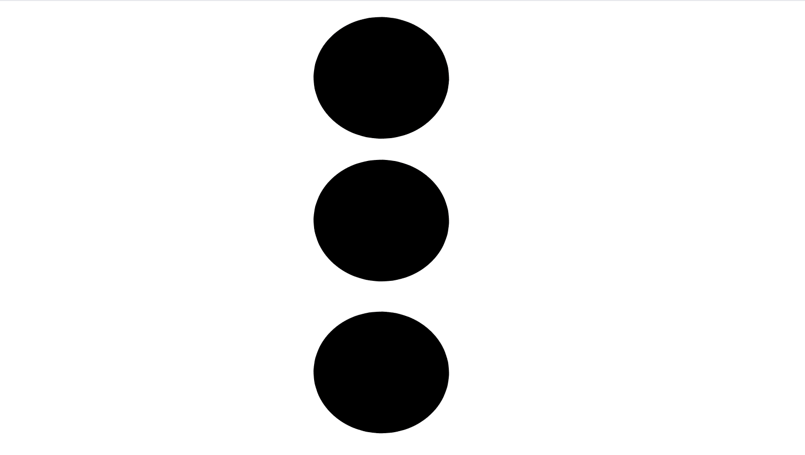

对齐指的是视觉元素是如何排列、排序和组织的，这些元素相互之间以及与整个设计相比较。

这是一种在相关对象之间创建连接和视觉流的方式，并在设计中创建更统一的结果。

通过对齐不同的视觉对象，您可以在整个设计过程中引导您的浏览者。

最常见的对齐方式有左对齐、右对齐和居中对齐。

### 统一

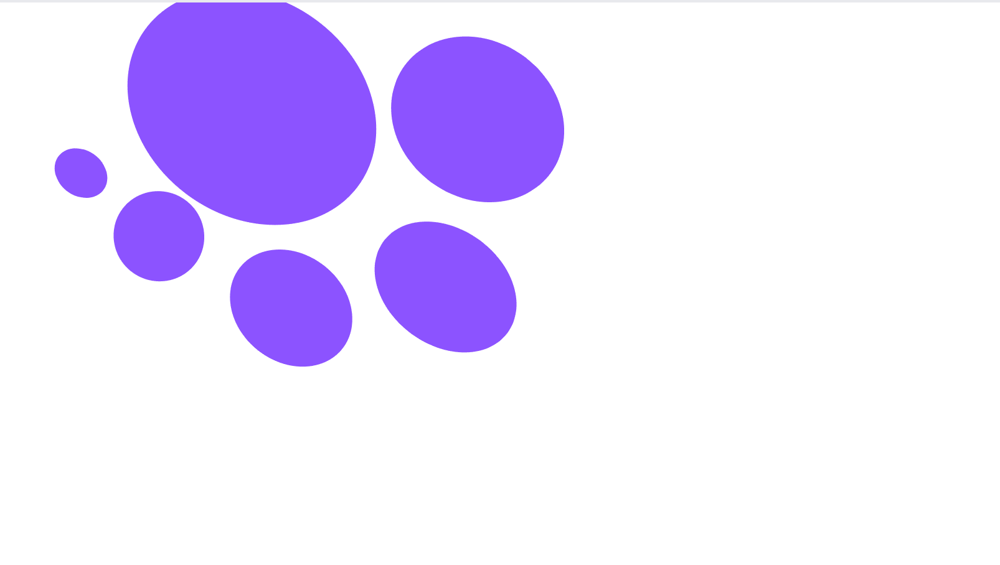

设计中的统一是不同的视觉元素如何结合在一起，在设计中创造凝聚力和完整性以及和谐的效果。

有了统一，看似不同的物品创造出一种“一体感”。这可以通过几种不同的方式来实现。

例如，不同大小的元素可以都具有相同的颜色，并且彼此接近。

这使得它们看起来好像是属于一起的，或者好像它们是相关的并且在某些方面是相似的。

### 空白区域

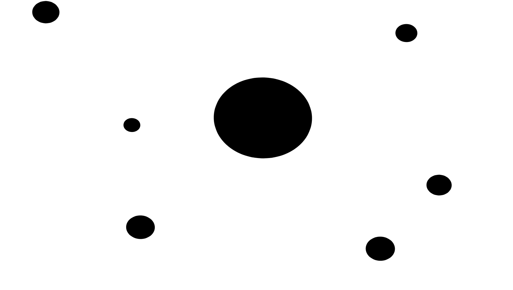

空白也称为*负空格*。

本质上，空白指的是*缺少*视觉元素的区域，以及设计中现有元素周围未使用的空白区域。

空白不一定意味着空白的地方是白色的——它可以是任何颜色。它更多的是指你设计中的空白和可用空间，以及一些区域什么都没有的事实。

留白是关于*而不是*向作品中添加任何元素，并采取更简约和简单的设计方法。有时候，少就是多。

留白在设计中创造了呼吸的空间。

当一个页面上有很多内容时，浏览者很容易被他们需要吸收的所有信息淹没。空白有助于防止这种情况发生。它使任何可用的文本更具可读性，并创造了全方位的更好的用户体验。

空白消除了任何不必要的混乱，并创造了一个焦点。所以，在重要的元素周围使用空白来突出它们。

## 结论

希望现在您对设计原则有了一个高层次的理解，并且对如何在未来的设计中实现它们有了一个更好的想法。

感谢阅读！