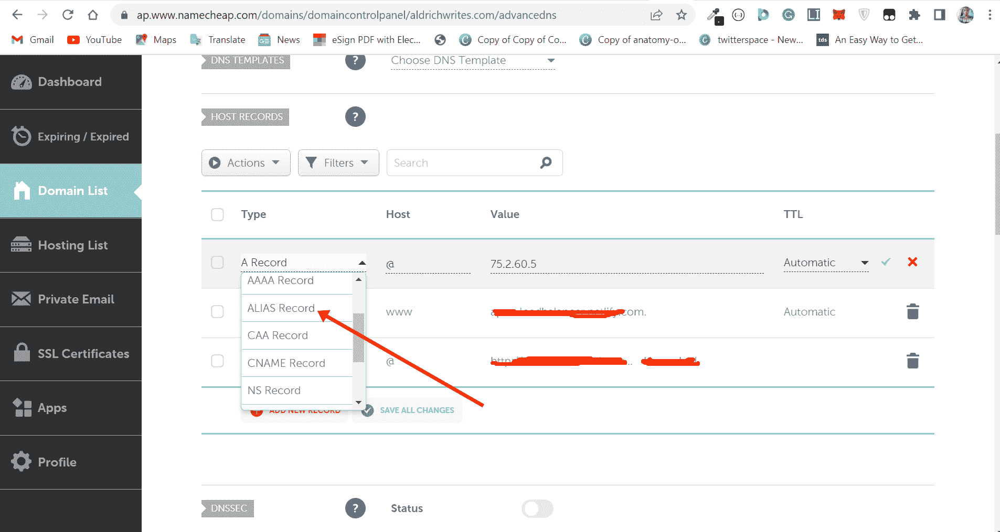

# 什么是名字？用户名记录 DNS 教程

> 原文：<https://www.freecodecamp.org/news/what-is-aname-aname-record-dns-tutorial/>

如果你曾经不得不在网站上使用域名，你可能会看到一个名字作为某种记录——就像流行的规范名称记录类型或简单的 CNAME。

CNAME 和 ANAME 都是为你的网站指定主机名的解决方案。比如`yourapp.netlify.com`到`yourwebsite.com`。

你可能一直在用 CNAME 让域名指向网站。但是，你可以使用一个有额外优势的名字，因为它给你更多的灵活性。

在本文中，您将了解什么是 ANAME，它相对于 CNAME 的优势，以及何时使用它。

## 什么是名字？

别名也称为别名，是一种域记录类型，可以用来代替 CNAME 记录。它可以从域名公司获得，如 Namecheap、GoDaddy、Hostinger、Google Domain 等。

ANAME 是由 CNAME 和另一种称为 A 的记录类型组合而成的。因此，ANAME 是 CNAME 和记录的综合体。

一个名称不是一个读取的 DNS 记录，而是模拟它的一种方式。这就是为什么它被称为别名，简称 ANAME。

当您购买域名并登录其管理面板时，您将始终看到一个使用域名的选项。

注意:一些域名提供商称之为别名而不是域名

下面是管理域名的廉价面板，他们称之为别名。

## ANAME 是如何工作的？

就像 CNAME 一样，域名将一个域名映射到另一个域名。因此，一个名称被配置为指向另一个域。

当客户端浏览器查询域名所指向的域名时，它会以一个 IP 地址作为响应。另一方面，CNAME 不能指向 IP 地址，但是域名可以。这是 ANAME 相对于 CNAME 的优势之一。

此外，ANAME 相对于 CNAME 的另一个优势是，它可以与该域名上的其他记录共存。因此，如果你想有子域，你应该使用一个域名，而不是 CNAME。

## 最后的想法

本文解释了什么是 ANAME，并将其与 CNAME 进行了比较，这样您就可以知道它相对于 CNAME 的优势。

你可能还想知道在名字和 CNAME 之间使用哪个，或者什么时候应该使用一个而不是另一个。

这是逻辑:

*   如果你知道你不能在一个域名上有其他记录，使用 CNAME。这是因为它不能与域名记录中的其他数据共存。
*   如果您将有其他记录，如该域名的子域，然后使用一个名称。如果你不知道你是否还会有一个子域，使用一个别名。

感谢您的阅读。