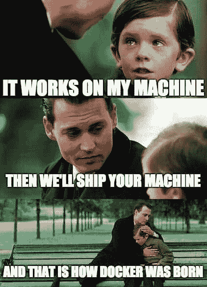
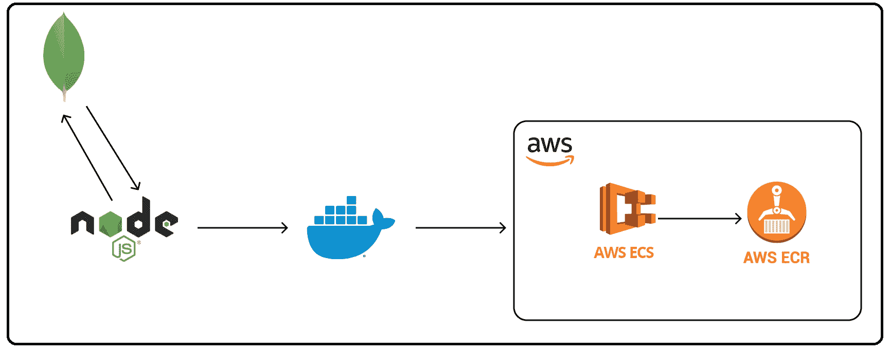
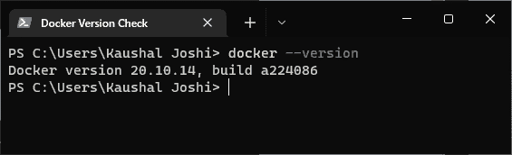
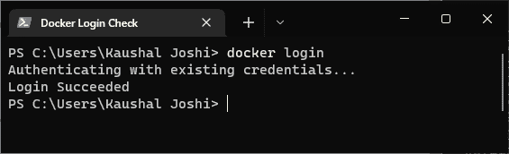
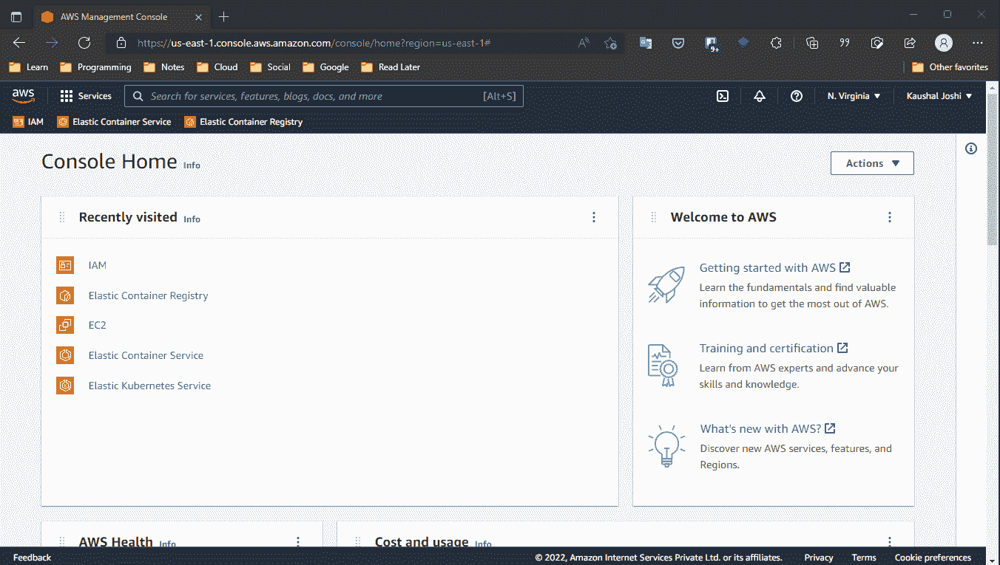
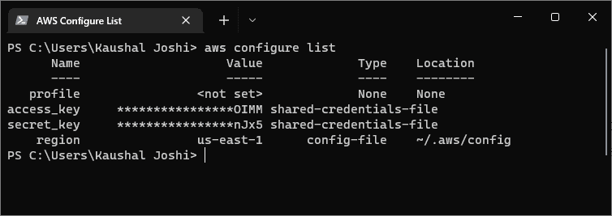
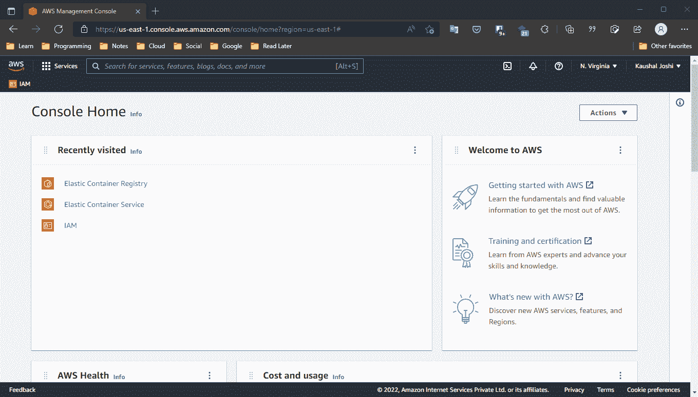

# 如何构建 Docker 映像并将其推送到 AWS ECR

> 原文：<https://www.freecodecamp.org/news/build-and-push-docker-images-to-aws-ecr/>

Docker 是一个平台，可以帮助您以无缝、无错误的方式构建、运行和发布应用程序。

您可能遇到过这样的情况，代码在您的机器上运行，但是在其他人的机器上以某种方式抛出错误。

Docker 就是为了解决这个问题而诞生的。



image source: internet

在本文中，我们将涵盖四个主要概念:

1.  如何设置、安装和配置 Docker
2.  如何将 Docker 添加到您的项目中
3.  如何在您的系统上安装和配置 AWS CLI
4.  如何使用 AWS ECR 在远程位置托管 Docker 映像

## 先决条件

以下是您在本教程中需要遵循的内容:

1.  码头帐目
2.  Docker 的基本知识:用例、命令
3.  AWS 帐户
4.  AWS 的基本知识:控制台、IAM、用户、ECS、ECR
5.  一个简单的网络应用程序，我们可以用于这个项目

如果您没有 web 应用程序或者只是想尝试一下，您可以克隆这个项目:

[GitHub - joshi-kaushal/members-onlyContribute to joshi-kaushal/members-only development by creating an account on GitHub.joshi-kaushalGitHub](https://github.com/joshi-kaushal/members-only)

上面的应用程序是一个 Express.js 应用程序，使用 MongoDB Compass 作为数据库。我们将创建项目的 Docker 映像，将其推送到 AWS ECR，并通过 AWS ECS 访问它。



## Docker 设置

如果你使用的是 Windows 或 Mac，你唯一需要做的就是安装 Docker 桌面应用程序。它安装了你需要的一切，并提供了一个很好的图形用户界面进行交互。

去[官网](https://www.docker.com/get-started/)安装设置。您还需要创建一个 Docker 帐户以备将来使用。如果你用的是 Linux，[这个页面](https://hub.docker.com/search?q=&type=edition&offering=community&operating_system=linux&utm_source=docker&utm_medium=webreferral&utm_campaign=dd-smartbutton&utm_location=module)或者一个简单的 [YouTube](https://www.youtube.com/results?search_query=install+docker+on+linux) 搜索会帮你搞定。

要检查安装是否成功，在终端中执行`docker --version`。它应该会提示您系统中安装的版本和内部版本。



Checking if the Docker installation is successful

### 坞站登录

前往[hub.docker.com/signup](https://hub.docker.com/signup)创建您的账户。要将您的系统与 Docker 帐户连接，请在终端中执行`docker login`。

你会在终端看到**登录成功**的提示。



Checking if the Docker login is successful

一旦在您的系统中安装并配置了 Docker，让我们进入下一部分。

## 如何将你的项目归档

通过 **Dockerize** *，*我的意思是用 Docker 建立你现有的项目并将其容器化。

在项目目录的根目录下创建一个名为`Dockerfile`的文件，不带任何扩展名。它包含构建 Docker 映像和作为容器运行 Docker 化的应用程序所需的代码。

如果你使用的是 VS 代码， [Docker](https://marketplace.visualstudio.com/items?itemName=ms-azuretools.vscode-docker) 扩展会派上用场。

### 如何配置 Dockerfile 文件

作为最低配置，将以下代码粘贴到`Dockerfile`中。

```
FROM node:12.17.0

WORKDIR /app

COPY package*.json ./

RUN npm install

COPY . .

ENV PORT=3000

EXPOSE 3000

CMD [ "npm", "start" ]
```

在理解这些指令之前，创建一个`.dockerignore`文件并在其中添加`node_modules`。它的工作原理和`.gitignore`一样。

现在让我们看一下代码:

*   `FROM`:为进一步指示设置基础图像。为了简单起见，我们将使用官方支持的 Node.js 映像。我正在使用我的`package.json`中提到的确切版本，所以如果您使用不同的节点版本，请相应地更改它。
*   `WORKDIR`:将当前工作目录中的源代码添加到图像中。
*   `COPY`:将镜像文件系统中的文件和文件夹从源文件系统复制到目标文件系统。我们正在复制`package.json`和`package-lock.json`。这个命令确保我们在 docker 容器中有一个要安装的依赖项列表。
*   `RUN`:执行给定的命令。正如我们从上一步中得到的`package.json`，我们可以在我们的容器中安装依赖项。
*   现在，我们将项目目录中的所有内容复制到我们的容器中。因为两者都在同一个目录中，所以我们使用了表示当前工作目录的`.`。`node_modules`没有被复制，因为我们已经在`.dokcerignore`中添加了它。
*   `ENV`:为 docker 容器设置一个环境变量。
*   当我们运行这个容器时，我们想在一个特定的端口上监听我们的应用程序。`EXPOSES`允许我们公开访问容器化的应用程序。不需要和`ENV`一样，但是降低了复杂度:)
*   `CMD`:一个映像中只能有一个`CMD`命令，告诉容器如何启动应用程序。注意，我们将数组和必要的命令作为元素传递。这被称为 **exec 表单**，它允许我们在不启动 shell 会话的情况下运行命令。

我们已经设置了创建 Docker 文件所需的一切。让我们现在创建一个 Docker 图像！

### 如何创建 Docker 图像

使用`docker build`命令创建 Docker 映像的构建。我们可以用这个命令传递很多参数。但是我们这里要用的是`-t`。这给了你的图像一个名字标签，使它容易记忆和访问。

没有标准的方法来命名您的图像，但是通常您会看到这样的情况:Docker 用户名后面跟一个斜杠(`/`)，然后是版本号，用冒号(`:`)隔开。

```
docker build -t <name-tag> .
```

Name tag must be like this: clumsycoder/myapp:1.0.0

第二个参数是 Dockerfile 文件的位置。因为我们的在同一个目录中，我们可以放一个句点(。).

当您运行该命令时，您将会看到这些步骤按照它们在`Dockerfile`中被写入的顺序被执行。一旦完成，就会提示**成功在终端中建立< baseID >** 。

您可以使用`baseID`来访问特定的 Docker 图像，而不是使用它的名称标签。

你可以通过查看 Docker 应用程序中的*图片*部分来验证这一点。您还可以在`Containers/ Apps`部分看到本地容器。

目前，让我们在本地系统中运行 Docker 映像。

```
docker run -p 3000:3000 <name-tag>
```

记住，也可以用`<baseID>`代替`<name-tag>`。

### 端口转发

如果在没有`-p 3000:3000`的情况下运行上面的命令，在端口 3000 上将看不到任何东西。这是因为即使我们在 Dockerfile 中暴露了端口 3000，如果没有使它对外界可访问，

`-p`标志允许我们从容器向本地机器进行端口转发。

端口转发实际上是一个巨大的概念，但这是我们目前需要知道的一切。

在浏览器中访问 [](http://localhost:3000/) ``[http://localhost:3000/](http://localhost:3000/)`。好了，您已经创建了一个 Docker 容器，并正在本地机器上运行它。太棒了。`

`通常，您会将该图像推送到某种容器注册表中，以便在真实世界的场景中使用。它可能是一个码头枢纽或其他任何东西。我们使用的是 AWS 提供的亚马逊弹性容器服务。`

`为了本地 Docker 映像和 ECS 之间的顺利通信，我们需要在我们的系统中设置 AWS CLI。我们来看看怎么做。`

## `如何设置 AWS CLI`

`AWS 命令行界面是一个命令行工具，使我们能够通过我们的终端使用 AWS 资源。我们可以在 AWS 控制台或 web GUI 中做的任何事情也可以通过 CLI 来完成。`

`为了在本地使用 ECS 服务，我们必须在系统中设置和配置 AWS CLI。要检查是否已经安装了 AWS CLI，请在终端中执行以下命令:`

```
`aws cli`
```

`如果命令没有任何响应，则未配置 CLI。如果是，请随意跳到下一部分。`

### `如何安装 AWS CLI`

`我用的是 Windows 10 和 WSL2。但是 Mac OS 和 Linux Debian 的过程是相似的。`

`转到[这个](https://docs.aws.amazon.com/cli/latest/userguide/getting-started-install.html)网站，按照步骤进行分发。对于 Windows，你必须下载一个 MSI。然后会出现安装程序提示。只要跟着做，它将在几分钟内安装。`

`现在重启终端，再次执行`aws cli`。让我们为这个本地概要文件设置一个用户。`

### `如何为 AWS CLI 设置本地用户`

`转到 web 上 AWS 控制台的 IAM 部分。按照此 GIF 创建新用户:`

`

create a user with appropriate rights` 

`**记住:**`

1.  `**访问键——当您输入新用户的名称时，会检查编程访问**。`
2.  `添加授予 ECS 完全访问权限的用户策略。策略的名称是`AmazonECS_FullAccess`。`
3.  `记下`access key ID`和`Secret access key`，因为我们稍后会用到它们。`

`让我们回到我们美好的老终点站。在终端中执行配置命令，并输入您的访问密钥、秘密访问密钥和首选区域。暂时跳过`default output format`。`

```
`aws configure`
```

`通过执行`aws configure list`命令验证配置。`

`

Verifying AWS CLI Configuration` 

`恭喜你！我们已经成功地用本地终端设置了 AWS CLI。现在是时候将我们的 Docker 图像推送到亚马逊 ECR 了。`

## `AWS 弹性集装箱服务`

`我们已经很久没谈过 Docker 了。我们已经创建了一个本地 Docker 映像和容器。我们必须将它从本地 Docker 存储库发布到 AWS ECR。这是通过 ECS 完成的`

`什么是 ECS？你可能会问。`

> `Amazon Elastic Container Services 又名 ECS，是一个完全托管的容器编排服务，使您可以轻松部署、管理和扩展容器化的应用程序。`

`弹性容器注册表(ECR)是存储在 ECS 中的 Docker 容器的注册表。我们将使用 ECS 将我们的 Docker 容器推送到 ECR。`

### `如何在 ECR 中创建回购协议`

`为了简单起见，我建议与您的项目保持相同的名称。`

```
`aws ecr create-repository --repository-name <repo_name> --region <region_name>`
```

`如果不确定`region_name`，就放`us-east-1`。这将在美国东部 1 区创建您的回购。一旦完成，它将在终端中提示一个类似 JSON 对象的响应。`

``

`为了安全起见，检查 AWS 控制台并查看是否创建了存储库:`

`

verifying if a repo is created` 

`**记住:**`

1.  `您不会在存储库下看到任何图像。因为我们还没有推送任何图像。`
2.  `记下你的回购。我们很快就要用它了。`

### `如何将 Docker 映像推送到 ECR`

`到目前为止，每件作品都是独立创作的。是时候把每一块拼起来，完成拼图了。`

`为了让 Docker 将图像推送到 ECR，首先我们必须用 AWS 认证我们的 Docker 凭证。我们使用`get-login-password`命令来检索和显示一个认证令牌，这个认证令牌使用的是*GetAuthorizationToken*API，我们可以使用这个 API 向 Amazon ECR 注册中心进行认证。`

```
`aws ecr get-login-password --region <region_name>`
```

`使用创建回购时使用的同一`region_name`。暂时将加密的令牌存储在某个地方。`

`现在深呼吸。我们需要两件我告诉过你的东西。第一个是我刚才提到的令牌，第二个是上一步中的存储库 URI。`

`你明白了吗？莱斯古奥。`

```
 `aws ecr --region <region> | docker login -u AWS -p <encrypted_token> <repo_uri>`
```

`不用说，放在存储库所在的区域。`

`我们正在查询 AWS CLI 提供的 ECR API。后来，我们正在流水线 Docker 登录。`

*   ``-u AWS`:AWS 提供的默认用户。`
*   ``-p <encrypted_token>`:上一步我们找回的密码。`
*   `我们仓库的 URI。`

`如果登录成功，终端会显示**登录成功**。****`

### `如何标记本地 Docker 图像`

`该命令使用 ECR Repo 标记本地 Docker 映像。`

```
`docker tag <source_image_tag> <target_ecr_repo_uri>`
```

*   ``source_image_tag`:你给`docker build`命令起的名字。如果你跟着，那就是`username/image_name:tag`。`
*   `URI 欧洲委员会储存库。`

### `如何将 Docker 图像推送到 ECR`

`最后一步——拼图的最后一块！`

`以下命令将本地 Docker 文件推送到远程 ECR 存储库。根据图像大小，需要一些时间才能完成。`

```
`docker push <ecr-repo-uri>`
```

`万岁！我们成功了🎉`

``

`您可以在 AWS 控制台中看到上传的图像。进入 ECR，点击 repositories，打开我们几分钟前上传的 ECR repo。如果您想进一步使用，请复制`Image URI`。`

## `包扎`

`在本文中，我们介绍了如何在 AWS ECS 上部署 Docker 映像。您可以使用 ECR 中的 Docker 容器在服务器上托管您的应用程序。可能是 AWS EC2 或者别的什么。`

`Docker 和 AWS 被广泛用于开发大型应用程序。了解这些东西是如何协同工作的，将有助于您在未来构建大规模的应用程序。`

`说了这么多，希望这篇文章对你的工作、学习或学习有所帮助。如果是这样的话，您可能也会发现我的其他文章很有帮助。`

`我主要在我的[个人博客](https://clumsycoder.hashnode.dev/)和 [freeCodeCamp](https://www.freecodecamp.org/news/author/clumsycoder/) 上写。要说嗨，我在 [Twitter](https://twitter.com/clumsy_coder) 、 [LinkedIn](https://www.linkedin.com/in/7JKaushal) 和 [Showwcase](https://www.showwcase.com/clumsycoder) 上最活跃。`

`航运愉快！🐳🚢`