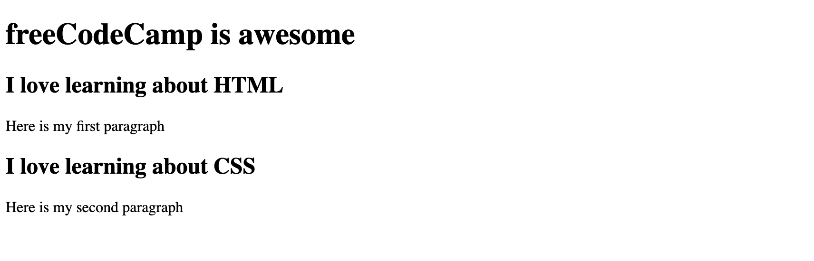
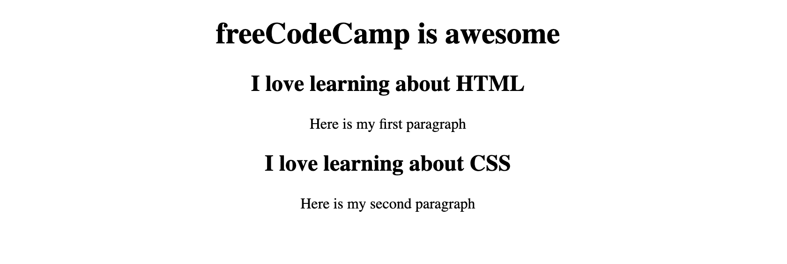
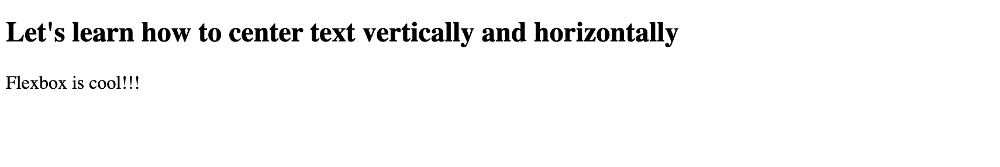
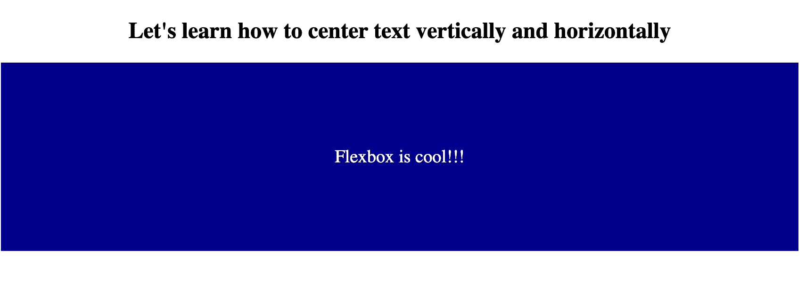
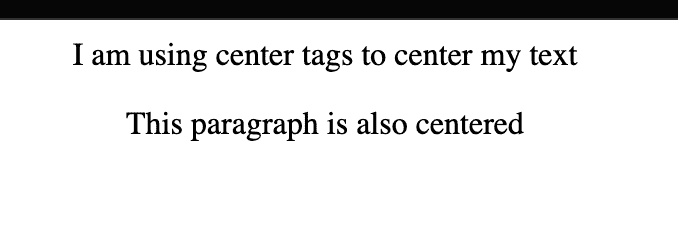
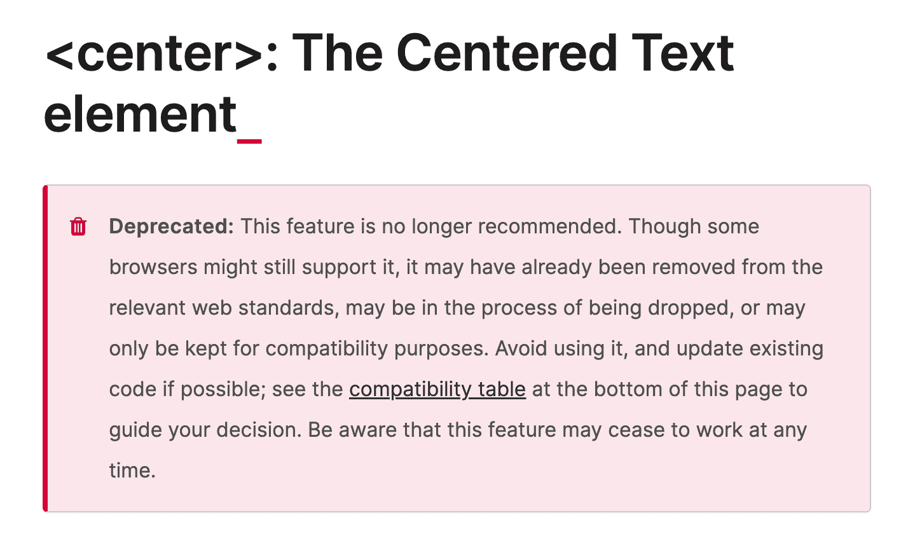

# CSS 中的文本对齐——如何将文本居中对齐 HTML

> 原文：<https://www.freecodecamp.org/news/text-align-in-css-how-to-align-text-in-center-with-html/>

很多时候你需要使用 HTML 和 CSS 来居中显示一些文本。但是最好的方法是什么呢？

在本文中，我将向您展示如何在 CSS 中使用`text-align`属性，以及如何使用 CSS Flexbox 垂直对齐文本。我还会谈到`<center>`标签，以及为什么不应该用它来居中文本。

## 如何在 CSS 中使用`text-align`属性

当您使用标题或段落标签时，HTML 中的默认样式会将文本放置在页面的左侧。

在这个例子中，我们有一个`<h1>`放在页面的左上角。

```
<h1 class="title">Let's learn about centering text</h1>
```


如果我们希望文本在页面上水平居中，那么我们可以使用`text-align`属性。

```
.title {
  text-align: center;
}
```


如果您想将页面上的所有文本水平居中，那么您可以使用正文选择器中的`text-align`属性。

在下一个例子中，我们的 HTML 中有更多的文本。

```
<h1>freeCodeCamp is awesome</h1>
<section>
  <h2>I love learning about HTML</h2>
  <p>Here is my first paragraph</p>
</section>

<section>
  <h2>I love learning about CSS</h2>
  <p>Here is my second paragraph</p>
</section>
```

没有任何样式，它目前在页面上看起来像这样。



在我们的 CSS 中，我们可以将`body`选择器作为目标，并使用`text-align`属性。

```
body {
  text-align: center;
}
```



## 如何水平和垂直居中文本

属性用于在页面上水平居中文本。但是我们也可以使用 CSS Flexbox 来垂直居中文本。

在这个例子中，我们的 HTML 中有一些文本:

```
<h2 class="title">Let's learn how to center text vertically and horizontally</h2>

<div class="flex-container">
  <p>Flexbox is cool!!!</p>
</div>
```

这是它目前没有任何造型的样子。



我们可以使用`text-align`属性将`<h2>`居中。

```
.title {
  text-align: center;
}
```


然后我们可以使用 Flexbox 在`flex-container` div 中水平和垂直居中段落。

```
.flex-container {
  display: flex;

  /*this centers the text horizontally*/
  justify-content: center;

  /*this centers the text vertically*/
  align-items: center;

  height: 200px;
  color: #fff;
  font-size: 1.2rem;
  background: #00008b;
}
```



## 你应该使用中心标签吗？

在旧版本的 HTML 中，`<center>`标签被用来在页面上水平居中文本。

```
<center>I am using center tags to center my text
  <p>This paragraph is also centered</p>
</center>
```



许多新开发人员仍然会使用这个标签，因为它确实显示了正确的结果。然而，HTML 4 中不赞成使用`<center>`标记，因为最佳实践是使用 CSS `text-align`属性。



This is the deprecation warning from [MDN docs](https://developer.mozilla.org/en-US/docs/Web/HTML/Element/center)

重要的是要记住 HTML 是用于内容的，而 CSS 是用于样式的。最佳实践是将这两个问题分开，不使用 HTML 进行样式设计。

我希望你喜欢这篇关于如何使用 HTML 和 CSS 居中文本的文章。