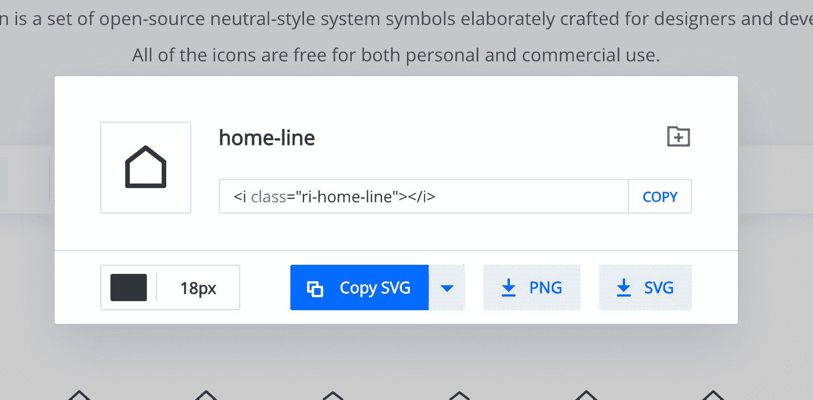
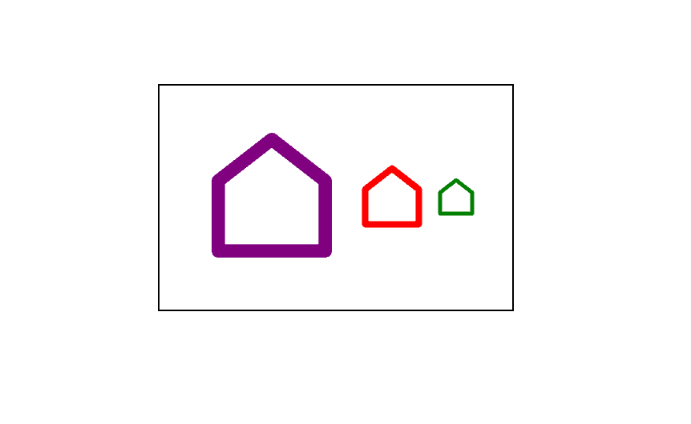

# 如何创建可重用的 SVG 图标反应组件

> 原文：<https://www.freecodecamp.org/news/how-to-create-reusable-icon-react-components-for-colors-and-sizes-customization/>

我们在构建前端应用程序时一直使用图标——作为指示、指针等等。下面是如何为图标创建一个可重用的 React 组件。

说到图标，可以用 PNG 或者 SVG 图片。png 具有固定的颜色，但允许尺寸变化(像常规图像一样)。在某些情况下，这改变了图像的质量。

另一方面，SVG 无论大小都有更好的质量，并且颜色甚至可以在下载后定制。

但是您可能同意我的观点，当谈到可定制性时，SVG 可能是一种痛苦。

在本文中，我将向您展示我目前是如何创建可定制的 SVG 图标作为 React 组件的。

## 如何下载图标

我通常从 [Remixicon](https://remixicon.com/) 下载我使用的图标。我还没有尝试过其他的图标库，所以如果您使用不同的库，本文中的步骤可能适用，也可能不适用。

也就是说，我过去曾与一位在 Figma 上创建自定义图标的客户合作过。我应用了这一步分享的解决方案，它也适用于大多数图标。所以即使不使用 Remixicon 也要跟着做:)

在 Remixicon 上，我选择一个我喜欢的图标，选择尺寸 **18px** ，选择**复制 SVG** 。



我把颜色留为黑色。如果您选择不同的颜色，它可能会与您稍后提供的指定颜色冲突。所以最好保持黑色，这是 SVGs 的默认颜色。

## 如何创建 React 组件

然后，我将 SVG 粘贴到一个文件中，比如说，`home-line.js`,代码如下:

```
import React from 'react'

export default function HomeLine() {
  return (
    <svg  viewBox="0 0 24 24" width="18" height="18">
      <path fill="none" d="M0 0h24v24H0z"/>
      <path d="M21 20a1 1 0 0 1-1 1H4a1 1 0 0 1-1-1V9.49a1 1 0 0 1 .386-.79l8-6.222a1 1 0 0 1 1.228 0l8 6.222a1 1 0 0 1 .386.79V20zm-2-1V9.978l-7-5.444-7 5.444V19h14z"/>
    </svg>
  )
} 
```

实际上，它使用来自 Remixicon 的默认颜色和大小。我会添加两个道具来修改这个组件:`size`和`color`。

`svg`元素有四个属性:`xmlns`、`viewBox`、`width`和`height`。我将使用`size`道具来修改`width`和`height`的值。然后我将添加一个额外的属性`fill`，我将使用它作为`color`道具。

以下是更新后的组件:

```
import React from 'react'

export default function HomeLine({
  size = 18, // or any default size of your choice
  color = "black" // or any color of your choice
}) {
  return (
    <svg

      viewBox="0 0 24 24"
      width={size} // added size here
      height={size} // added size here
      fill={color} // added color here
    >
      <path fill="none" d="M0 0h24v24H0z"/>
      <path d="M21 20a1 1 0 0 1-1 1H4a1 1 0 0 1-1-1V9.49a1 1 0 0 1 .386-.79l8-6.222a1 1 0 0 1 1.228 0l8 6.222a1 1 0 0 1 .386.79V20zm-2-1V9.978l-7-5.444-7 5.444V19h14z"/>
    </svg>
  )
} 
```

我让`viewBox`保持原样。现在我可以像这样使用组件:

```
<HomeLine size={100} color="purple" />
<HomeLine size={50} color="red" />
<HomeLine size={30} color="green" /> 
```



如果你使用一个非方形的图标，你将不得不特别提供`width`和`height`属性来相应地改变这两个属性。

## 包裹

我知道 Remixicon 并没有你可能需要的每一个图标，当你在使用一个设计系统时，你可能会被提供一些自定义图标。

但是这里分享的想法是你可以用你正在使用的任何库来尝试的。如果你这样做了，我很想听听你尝试这种方法的经历。

如果你喜欢这篇文章，并发现它很有帮助，请分享:)