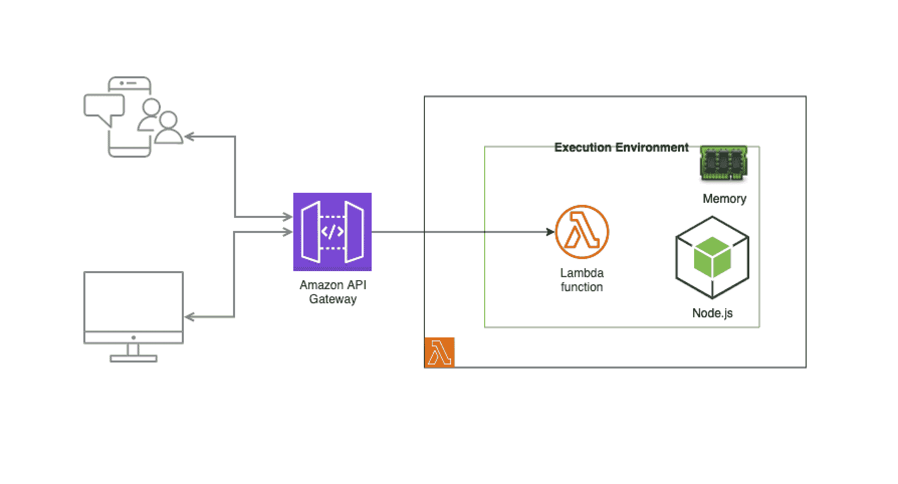
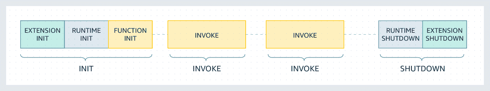
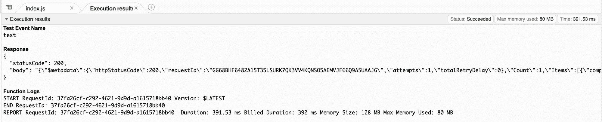

# 如何加速你的 Lambda 函数

> 原文：<https://www.freecodecamp.org/news/how-to-speed-up-lambda-functions/>

Lambda 在过去几年里广受欢迎。它有各种用例，从运行简单的脚本到在无服务器架构内或运行微服务时粘合流和流程。

不过，如果你刚刚开始在一个新的环境或组织中工作，你可能会对使用它感到谨慎，因为它的配置很复杂。

这对你准备开始使用的任何新技术都是公平的，小心谨慎是良好商业意识的标志。

你可能经常听到的一个论点是，lambda 可能会因为冷启动而降低操作速度。

这也是技术面试中的一个常见话题，所以如果你关注下一个梦想云工程职位，就值得深入挖掘一下。

|  |
| --- |
| 由 [pixabay](https://pixabay.com/photos/dawn-winter-snow-nature-frost-3142990/) 上的 [Myriams-Fotos](https://pixabay.com/users/myriams-fotos-1627417/) 拍摄的照片 |

在本文中，我们将讨论一种有助于提高 Lambda 函数性能的方法。

但是让我们先来概述一下，当你执行 Lambda 函数时会发生什么，也就是冷启动。

## Lambda 函数是如何执行的？

当你的 Lambda 函数被触发时，Lambda 服务在一个“执行环境”中运行代码，这个执行环境有三个阶段:`Init`、`Invoke`和`Shutdown`。



*   在`Init`阶段，Lambda 创建执行环境，下载代码，设置配置(例如，内存)，并运行位于`handler`函数之外的*代码*。(此时你可能已经掌握了文章的要点——但请继续阅读以获得进一步的解释和演示。)
*   在`Invoke`阶段，Lambda 运行`handler`函数中的代码
*   在`Shutdown`阶段，Lambda 终止环境

如果 Lambda 在相当短的时间内连续被触发了很多次(这个时间在 Lambda 文档中没有精确确定)，那么在一个`Init`阶段和一个`Shutdown`阶段之间可能会有多个`Invocations`。

这意味着，如果 Lambda 在短时间内连续执行多次，Lambda 服务将利用第一个创建的执行环境来运行下面的调用。也就是说，它只会在每次新调用 Lambda 时调用处理函数，而不必创建新的执行环境，也不必运行处理函数之外的代码。

第一次执行时,`Init`阶段只发生一次，我们可以把它想象成两个部分(每次执行都运行一次):

*   创建新的执行环境和下载代码的部分是*冷启动*。
*   Lambda 处理程序之外的代码运行的部分是初始化代码。

从 [AWS 文档](https://docs.aws.amazon.com/lambda/latest/dg/runtimes-context.html)中，该图片提供了三个阶段的正确可视化:


函数 INIT(INIT 阶段的最后一个模块)将只运行一次，与构成冷启动的前两个模块一起运行。

好了，说够了——给我们看看代码！

## λ功能代码

在上一节中，我们讨论了 Lambda 会在第一次执行时运行一次初始化代码(处理函数之外的代码)。如果下面的调用发生的时间相隔不是很远，它将使用相同的执行环境运行处理程序中的代码。

这是利用初始化代码来运行可重用代码并节省每次调用时重新运行这些代码的时间的完美方式。

假设我们有一个 Lambda 函数，它与 DynamoDB 交互以检索一组项目(请记住，这段代码仅用于演示目的，因此它不是您将看到的最干净的代码)。

创建一个`index.js`文件:

```
const { DynamoDB } = require("@aws-sdk/client-dynamodb");

exports.handler = async (event, context) => {
  const dynamodb = new DynamoDB({ region: "ap-southeast-2" }); // creating a new instance of DynamoDB
  const params = {
    TableName: "company",
  };

  const results = await dynamodb.scan(params); // avoid using scan in production - it's expensive and not performant

  return {
    statusCode: 200,
    body: JSON.stringify(results),
  };
}; 
```

在前面的代码片段中，初始化代码如下:

```
const { DynamoDB } = require('@aws-sdk/client-dynamodb'); 
```

它将在第一次执行时运行一次，如果在短时间内执行，则不会在后续执行中运行，也就是说，后续执行发生在关闭阶段之前。

## Lambda 演示

太棒了，现在我们准备好演示了。在这一节中，我们将构建基础设施并测试 Lambda 的性能。

### 建设基础设施

由于本教程旨在演示如何增强我们的 Lambda 的性能，所以我们不会把太多的注意力放在作为代码的基础设施上。

按照以下步骤构建和部署您的应用程序:

*   安装依赖项:`npm install`
*   压缩你的 Lambda 文件:`zip -r ./get-companies-lambda.zip index.js node_modules`
*   下载以下 Terraform 文件:[https://gist . github . com/AHaydar/bfc 173 db 2078 B2 eeb 884 da 8632248 c5d](https://gist.github.com/AHaydar/bfc173db2078b2eeb884da8632248c5d)
*   应用地形变化:`terraform apply`

打开 AWS 控制台，验证 DynamoDB 和 Lambda 是否都已正确创建(在本例中，我使用的是`ap-southeast-2`区域)。

### 测试性能

首先，在 AWS 控制台中导航到您的 Lambda 函数，并单击`Test`按钮运行您的代码。您将得到类似如下的结果:

请注意最后一行中的以下内容:

`Duration: 569.85 ms`

和

`Init Duration: 429.13 ms`

`Init Duration`是在 Lambda 处理程序之外运行代码的持续时间——这是需要 DynamoDB SDK 的代码。

`Duration`是在 Lambda 处理程序中运行代码的持续时间——实例化 DynamoDB，传递“ap-southeast-2”区域并扫描表。

再次点击`Test`按钮。您应该会得到这样的响应:

注意最后一行——它不包含`Init Duration`。如果您的结果包含 Init Duration，这意味着在您再次单击`Test`按钮之前，执行环境已经关闭。在这种情况下，请在其他时间点按它。

所以在第二次执行时，我们保存了`Init Duration`。这是一个优化我们的函数并在 Lambda 处理程序之外添加更多公共代码的提示。我们如何做到这一点？

```
const { DynamoDB } = require("@aws-sdk/client-dynamodb");

const dynamodb = new DynamoDB({ region: "ap-southeast-2" }); // creating a new instance of DynamoDB
const params = {
  TableName: "company",
};

exports.handler = async (event, context) => {
  const results = await dynamodb.scan(params); // avoid using scan in production - it's expensive and not performant

  return {
    statusCode: 200,
    body: JSON.stringify(results),
  };
}; 
```

在上面的代码片段中，我将 DynamoDB 的实例化与 params 对象一起移出了处理程序。

所以这会增加 Init 代码的执行时间(在 lambda 处理程序之外)，它只在执行环境生命周期的第一次执行期间运行。这将减少 Lambda 处理程序的执行时间，每次调用都会发生这种情况。

请记住，永远不要编写依赖于运行执行环境的业务逻辑。您的代码应该总是假设它需要在每次调用时初始化执行环境。

在优化 Lambda 性能方面，你还有什么其他建议？在推特或 LinkedIn 上与我分享它们